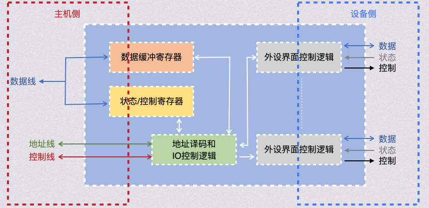
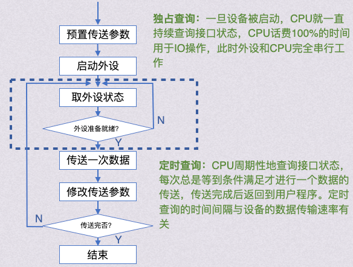
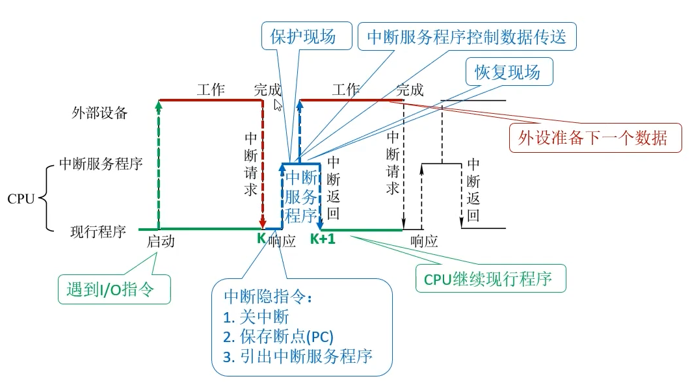
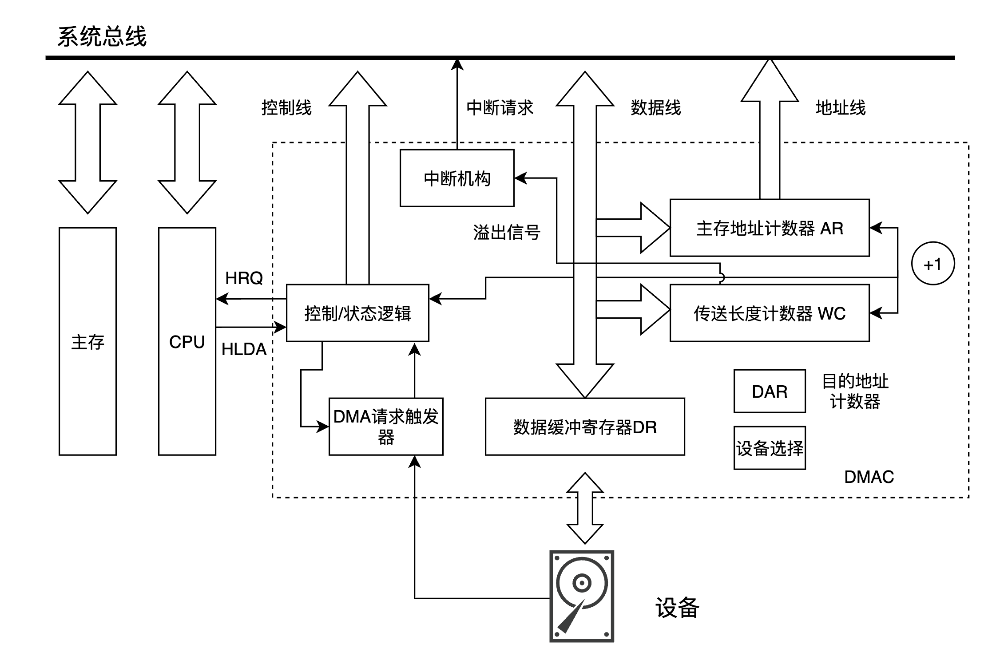
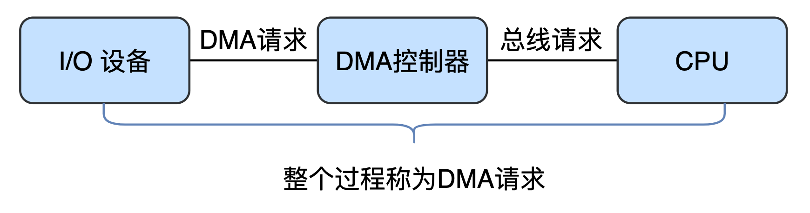
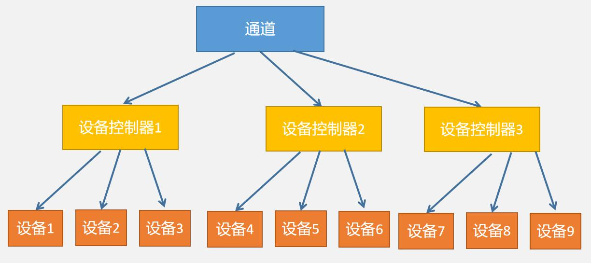

## IO 设备分类

### 信息交换单位

#### 块设备

- **单位**：以数据块为单位
- 可寻址、支持随机存取
- 通常是有 DMA 的 IO 方式
- eg：磁盘

#### 字符设备

- **单位**：字符
- 不可寻址、不可随机存取、使用中断驱动
- 字符设备面向流，流不可寻址
- eg: 打印机、键盘

在不考虑 DMA（直接内存访问）等特殊方式的情况下，**字符设备中的数据放入内存指定位置**的流程如下：

1. **I/O 指令**：CPU 向字符设备发送 I/O 指令，要求从设备寄存器中读取数据。
2. **数据传输到 CPU 寄存器**：字符设备将数据存放到其内部的设备寄存器中，然后 CPU 再通过 I/O 操作将该数据取出，并存储在 CPU 的寄存器中。
3. **将数据写入内存**：CPU 再次使用指令将寄存器中的数据写入到指定的内存位置，从而完成数据的转移。

> **备注**：DMA 方式虽然省去了 CPU 的直接数据搬运操作，但本质上也是通过 DMA 控制器代替 CPU 完成类似的数据传输步骤。

### 使用特性

#### 人机交互类

用于同计算机用户之间交互的设备，如打印机、显示器、鼠标、键盘等。这类设备数据交换速度相对较慢，通常是以字节为单位进行数据交换

#### 存储设备

用于存储程序和数据的设备，如磁盘、磁带、光盘等。
这类设备用于数据交换，速度较快，通常以多字节组成的块为单位进行数据交换

#### 网络设备

用于与远程设备通信的设备，如各种网络接口、调制解调器等。
其速度介于前两类设备之间。

### 传输速度

#### 低速设备：鼠标、键盘

#### 中速设备：行式打印机、激光打印机

#### 高速设备：磁盘机、磁带机、光盘机

## IO 控制器

### I/O 控制器的功能

又称：**设备控制器 / 接口**
CPU 无法直接控制 I/O 设备中的机械部件，所以 I/O 设备中还有一个电子部件作为中介

1. **接受和识别 CPU 命令**
   - 将 CPU 的命令（例如 read/write）放到控制寄存器中，同时通过控制器告知 I/O 设备发送了命令

2. **向 CPU 报告设备状态**
   - 状态寄存器：表示空闲与忙碌等状态

3. **数据交换**
   - 读写数据的媒介【数据寄存器】

4. **地址识别**
   - 把逻辑 I/O 存储器地址转换为物理地址，通过【地址总线】进行传输

5. **信号格式的转换**

   - 电子转换
   - 并/串转换
   - 缩/扩转换

6. 实现主机和外设之间的通信联络控制

### I/O 控制器的组成

1. **数据线**
   - 读写数据
   - 状态字（命令字）
   - 控制字
   - 中断类型号

2. **地址线**
   - I/O 端口地址
   如果某个 I/O 接口能够作为数据通信的主控设备（如 DMA 控制器），那么它就可以发起总线事务并控制总线传送数据，地址线方向为输出

3. **控制线**
   - 各种信号

### I/O 端口

- I/O 端口指 IO 接口（设备控制器）中可直接与 CPU 通信的寄存器
- 内存映射 I/O 简化了指令
- 寄存器独立编址让指令设计变得复杂，需要单独设计 read write 相区别的指令（input output）

## I/O 控制方式

### 程序直接控制 设备 ⇄ CPU ⇄ 内存

- 特点
  - 信息交换完全由 CPU 执行程序实现
  - CPU 与外设串行工作
  - 适用于少量 IO 设备或低速设备

> [! ] 读写单位：字 word

- 工作流程
    

### 中断驱动方式 设备 ⇄ CPU ⇄ 内存

- 特点
  - 信息交换完全由 CPU 执行程序实现
  - CPU 与外设串行工作
  - 中断 IO 方式请求的是处理器时间

> [! ] 读写单位：字 word

> [! ] 检查中断的时期：**中断检查的时机**：通常在**指令执行末尾**的时候进行中断检查

- 工作流程
  
- 缺点
  - 需要硬件支持的中断机制
  - 处理多个中断时可能增加系统复杂度

### DMA 方式 设备 ⇄ 内存

#### DMA 方式特点

- **独立性**：DMA（Direct Memory Access）使 CPU 与主存之间不存在固定联系，主存既可以被 CPU 访问，也可以被外设访问
- **硬件控制**：在数据传输过程中，主存地址是确定的，数据传输的计数器由控制器电路直接实现
- **专用缓冲区**：主存中需要开辟专用缓冲区，以便顺利供给和接收外设的数据
- **并行处理**：DMA 允许 CPU 和外设并行工作，从而**提高系统效率**
- **初始化和中断处理**：DMA 在开始前需要通过程序进行初始化，数据传输完成后，通过中断方式进行后续处理
- **降低 CPU 负担**：在数据搬运过程中，CPU 无需参与，只在几个关键时刻进行干预

#### CPU 干预的时机

1. **配置 DMA 控制器**：在数据传输前，CPU 需要配置 DMA 控制器的参数
2. **启动 DMA 传输**：CPU 启动 DMA 传输后，DMA 控制器接管数据搬运任务
3. **传输完成响应中断**：传输完成后，DMA 通过中断通知 CPU 进行后续处理

#### DMAC

- **HRQ**：DMA 发送的总线请求
- **HLDA**：CPU 发送给 DMA 的应答信号

- **控制/状态寄存器**：
  控制/初始化信息，指定每一步骤进行的操作
  *控制器可以通过控制状态寄存器进行了*

- **DMA 请求寄存器**：
  当【设备】输入完成了一个传输数据，就给 DMA 请求寄存器发送一个控制信号，但 DMA 请求寄存器不能响应多个设备
  *所以是外设发起的 DMA 请求*
    

- **主存地址计数器（AR）**：
  传输数据的目的主存地址

- **传输计数器（WC）**：
  用来保持总的字节数，记录和减少剩余传输/已传输的字节数，当完成传输后计数器为零时，DMA 通知 CPU

- **目的地址寄存器（DAR）**：
  记录交换数据的 I/O 目的地址

- **数据寄存器（DR）**：
  暂存传输中的数据值和内容（输入输出的数据流）

- **中断机构**：
  传送长度计数器通过发送溢出信号来控制中断机构何时发出中断请求

#### 工作流程

1. **DMA 控制器的初始化**：
   1. 准备内存区
   2. 设置传送参数
   3. 由 DMA 控制器接受 " 启动 DMA 传输 " 命令，然后 CPU 执行其他程序，由 DMA 控制器管理数据传输

2. **DMA 数据传输**：
   - DMA 控制器提供内存地址
   - 发起数据传输命令
   - 每完成一个数据传送，字节计数值减并转变去下地址，字节数递减 0 时完成所有的 I/O 操作

3. **DMA 的后处理**：
   - 字节数递减为 0 时，发出 DMA 结束命令中断信号给 CPU，转入中断服务程序，做一些最终程序处理工作

#### 传输方式

##### 停止 CPU 访存

DMA 传输时，由 DMA 控制器发送一个停止信号给 CPU，使 CPU 脱离总线，停止访问主存，直到 DMA 传送一块数据结束

##### 周期挪用

DMA 传输时，CPU 让出一个总线事务周期，由 DMA 控制器挪用一个主存周期来访问主存，传送完一个数据后立即释放总线。这是一种单字传输

##### DMA 与 CPU 交替访存

每个 CPU 工作周期分成两个时间片，一个给 CPU，另一个给 DMA 控制器。这样在每个 CPU 工作周期内，CPU 和 DMA 控制器均访问存储器

#### DMA 与中断对比

- **中断低速**：高速设备频繁请求程序中断，会占用大量的 CPU 时间
- **DMA 高速**
- **中断**靠**程序**传输
- **DMA** 靠**硬件**传输
- **功能对比**：中断功能多，可以处理异常，而 DMA 只是为了 I/O 数据传输设计的
- **响应时机**：
  - **DMA**：在**存取周期末尾检测**，对 DMA 的响应可以在取指周期、间址周期、执行周期之后，只要 CPU 不占用总线就可以被响应
  - **程序中断**：中断请求的响应只能发生在**每条指令的执行周期之后**

### 计算: CPU 用于 IO 或 DMA 的时间占整个 CPU 时间的百分比

$$
\frac{1s内用于IO的时钟周期数}{CPU在1s内能够提供的时钟周期数}
$$

## IO 软件层级结构

从下到上一步步抽象

### 用户层 IO 软件

#### 向上

- 实现和用户交互的【接口】
  - 块设备接口
  - 流设备接口
  - 网络设备接口

#### 向下

- 可以直接调用用提供和 I/O 有关的【库函数】
- 将用户请求【翻译】为格式化的 I/O 请求，通过【系统调用】请求 OS 提供服务

### 设备独立性软件

 又称**设备无关程序，系统调用处理程序**

- 用于实现用户程序和设备驱动的统一接口
- 计算机在对一个设备进行了区分和识别过后，会分配给它一个 " 绝对号

#### 向上

- **提供 read/write 调用**
  - 即提供把系统指令翻译为设备操作命令
- **提供设备保护**
  - 即文件保护，禁止用户直接访问设备
- **差错处理**
- **设备分配和回收**
  - 即文件的分配与回收
- **数据缓冲区管理**
  - 对字节设备和块设备的缓冲区进行有效的管理

- **为了实现设备无关性**，进程使用逻辑设备名请求某些设备，而系统实际访问的，还是物理设备编号。所以逻辑设备表 (LUT, Logic Unit Table) 需要被建立

  - **LUT**用于实现将应用程序中的逻辑设备映射为物理设备名
   
    - 整个系统设置一张 LUT，记录所有进程的分配情况，这样就能有相同的逻辑设备名，多用户环境下难以处理
    - 每个用户设置一张 LUT，用户登录时为用户建立一个进程，同时建立 LUT，并放入 PCB 中
    - 使用逻辑设备名的好处：
      - 增加了设备分配的灵活性
      - 易于实现 I/O 重定向

### 设备驱动程序

- 每个连接到计算机上的 I/O 设备都需要某些设备特定的代码对其进行控制，这样的代码称为设备驱动程序
- 运行在内核空间，驱动程序和硬件紧密相关，部分必须用汇编语言书写

#### 作用

1. **初始化与打开设备**
   在设备使用之前，驱动程序会进行设备初始化，确保设备能够正常工作，并为设备打开做准备

2. **检查 I/O 请求的合法性**
   驱动程序负责检查用户发出的 I/O 请求是否合法，并了解 I/O 设备的当前工作状态

3. **逻辑地址转换为物理地址**
   驱动程序负责将用户请求的逻辑地址转换为设备操作所需的物理地址

4. **响应设备控制器的中断请求**
   当设备控制器发出中断请求时，驱动程序能够及时响应，根据不同的中断类型调用相应的中断处理程序

5. **向设备控制器发送命令**
   驱动程序通过发送命令来控制设备的工作状态和行为

6. **I/O 结束后的出错检查**
   驱动程序在 I/O 操作结束后，会检查设备是否在执行过程中出现错误，确保操作的正确性

> 一个驱动程序处理一类设备

- 例如系统中有 2 个绘图机和 3 个打印机，只需要两个驱动程序即可

### 中断处理程序

- 用户保存中断被处理时 CPU 状态，转入相应的中断处理程序后，处理完成后将用户进程的 CPU 状态恢复，返回到中断的进程
- 执行进程的上下文切换，对中断信号进行测试，读取设备状态和修改进程状态

### 硬件设备

#### 机器部件

#### 电子部件：设备控制器

### IO 子系统【高三层】

> 功能

- IO 调度
- 缓冲与高速缓存：缓冲区
- 设备分配与回收
- 假脱机
- 设备保护
- 差错处理

## 缓冲区

### 缓冲区的作用

1. **缓和 CPU 与 I/O 设备间速度不匹配的矛盾** 由于 CPU 的处理速度远快于 I/O 设备，缓冲区可以临时存储数据，从而减少 CPU 等待 I/O 设备的时间
2. **减少对 CPU 的中断频率，放宽对 CPU 中断响应时间的限制** 通过使用缓冲区，多个数据可以一次传输，减少中断请求的频率
3. **解决基本数据单元大小（即数据粒度）不匹配的问题** 不同设备的数据传输单位可能不同，缓冲区可以协调它们之间的数据传输
4. **提高 CPU 和 I/O 设备之间的并行性** 缓冲区允许数据在 CPU 和 I/O 设备之间独立传输，增加并行处理能力，从而提高系统的整体效率

### 内核缓冲区

- **提前读**
  比请求更多地读取磁盘上的数据，保存在缓冲区，以备程序后续使用

- **延迟写**
  不会直接把数据写入到磁盘文件中，而仅是写入到缓冲区中，如果当前进程或其他进程再次访问该数据时，内核可以从直接从缓冲区中提供更新的文件数据

- **目的**
  减少 I/O 次数

### 用户缓冲区

- **提前读**
  从内核缓冲区拷贝出请求更多的数据，保存在用户缓冲区，以备程序后续使用

- **延迟写**
  不会把数据写入到内核缓冲区，而仅是写入到用户缓冲区中，如果当前进程或其他进程再次访问该数据时，可以直接从用户缓冲区中提供更新的文件数据

- **目的**
  减少 CPU 变换次数

### 高速缓冲区

#### 磁盘高速缓存 (Disk Cache)

- **概念**
  - 将一个指令既存在内存中，又存在磁盘中

- **作用**
  - 提高 I/O 的速度，访问更高效
    - 例如进程的指令既在磁盘中，也在内存中，同时还在 CPU 一级、二级 cache 中

- **形式**
  1. 在内存中【单独开辟空间】，大小固定
  2. 把未利用的内存空间作为【缓冲池】，供请求分页和 I/O 共享

#### 缓冲区

##### 目的

1. 缓和 CPU 和 I/O 的速度矛盾
2. 减少 CPU 中断频率，放宽对 CPU 中断响应时间的限制
   - 例如：CPU 一次产生一个块，I/O 一次只能读一次 char
3. 解决数据粒度不同
4. 提高 CPU 和 I/O 的并行性
5. 减少磁盘的 I/O 次数 (主要目的)

##### 实现方法

- 使用硬件缓冲区，成本太高、容量小，仅用在对速度要求非常高的地方
- 采用内存作为缓冲区，**设备独立性软件**组织管理这些缓冲区

##### 需要缓冲的例子

- **鼠标、键盘**
  - 若有更高优先级的进程到来，鼠标点击事件不应被丢失，则放在 buffer 中
- **图形卡**
  - 图形学界面，使用双缓冲来实现图像更换

> [! ] 若无特殊说明，缓冲区大小为一个块

##### 高速缓存和缓冲区的对比

##### 预读 + 滞后写

- **预读**：读取一块时的同时，把下一块也读入到 buffer 中
- **滞后写**：在需要把 A 写回时，先写 B 号，先挂载到 buffer 中，直到该 buffer 需要使用再写回 A 号

### 缓冲技术

#### 单缓冲【读、写不能同时进行 速度受限】

##### 单缓冲区的工作原理

- 单缓冲区指在内存中设置唯一的一块缓冲区，I/O 设备将数据先传入缓冲区，等 I/O 传输完成后，缓冲区的数据才能传送到工作区，进程再处理工作区中的数据
- 值得注意的是，I/O 设备传输下一个数据到缓冲区的操作可以与进程处理当前数据并行

##### 传输和处理两个数据的时间计算

> 假设：

- `T`: 数据从 I/O 设备传输到缓冲区的时间
- `M`: 将数据从缓冲区传送到工作区的时间
- `C`: 进程处理数据的时间

> 情况一：T > C

- 第一个数据花费 `T + M` 的时间送到工作区，并开始处理
- 同时，第二个数据开始传输。因为 `T > C`，所以 I/O 传输在第一个数据处理结束前就完成
- 总时间为：

  $$
  2T + 2M + C
  $$

> 情况二：T < C

- 第一个数据花费 `T + M` 的时间送到工作区，并开始处理
- 第二个数据传输完后，由于 `T < C`，需要等待第一个数据处理完成后才能进行传送
- 总时间为：

  $$
  T + 2M + 2C
  $$

> 使用单缓冲方法传输和处理两个数据的总时间为：

$$
T + 2M + C + \max(T, C)
$$

#### 双缓冲【读、写同时进行】

##### 双缓冲区的工作原理

- 双缓冲区通过设置两个缓冲区来存放 I/O 传输的数据。当一个缓冲区的数据被传输和处理时，另一个缓冲区可以同时进行下一批数据的传输
- I/O 设备、缓冲区与工作区之间的数据操作可以部分并行进行

##### 传输和处理两个数据的时间计算

假设：

- `T`: 数据从 I/O 设备传输到缓冲区的时间
- `M`: 缓冲区向工作区传输数据的时间
- `C`: 进程处理数据的时间

> 情况一：M + C > T

- 第一个数据传输到**缓冲区 1**后，开始传送到工作区并处理，耗时 `M + C`
- 与此同时，第二个数据传输到**缓冲区 2**，但由于第一个数据还未处理完，第二个数据需要等待
- 总时间为：

  $$
  T + 2M + 2C
  $$

> 情况二：M + C < T

- 第一个数据传输到**缓冲区 1**后，开始传送到工作区并处理，同时第二个数据也开始传输到**缓冲区 2**
- 由于处理速度较快，当第二个数据传输完毕后，可以立刻将其读入工作区
- 总时间为：

  $$
  2T + M + C
  $$

> 双缓冲区下传输和处理两个数据的总时间为：

$$
T + M + C + \max(T, M + C)
$$

##### 缓存通信

###### 两台机器都是单缓冲【只能单向传输】

 

###### 都有双缓冲【双线传输】

   

##### 管道通信

- " 管道 " 通信就是一个缓冲区，要实现双向通信就需要两个 " 管道 "

 

#### 循环缓冲

- 包含多个大小相等的缓冲区，形成循环链表的形式
- 另外有两个指针 in/out 分别是输入指针和输出指针
  - in 指向空缓冲
  - out 指向满缓冲

#### 缓冲池

缓冲池使用多个缓冲区并通过队列来管理数据的传输和处理。它包括三种缓冲区队列和四种类型的缓冲区，以更高效地管理 I/O 数据的输入和输出操作

> 三种缓冲区队列

1. **空缓冲区队列**
   用于存放可供使用的空缓冲区，这些缓冲区可以容纳新的数据输入

2. **包含输入数据的满缓冲区队列**
   存放已接收输入数据的缓冲区，等待进程对数据进行处理

3. **包含输出数据的满缓冲区队列**
   存放已处理并准备输出的数据，等待 I/O 设备将其输出

> 四种缓冲区

1. **收容输入数据的空缓冲区**
   用于接收从 I/O 设备传输过来的输入数据

2. **收容输出数据的空缓冲区**
   用于存放即将被输出的数据，等待数据传输到 I/O 设备

3. **提取输入数据的满缓冲区**
   包含已输入的数据，进程将从该缓冲区中提取数据进行处理

4. **提取输出数据的满缓冲区**
   包含已处理完毕的数据，等待输出到 I/O 设备

> 优点

缓冲池通过多个缓冲区的并行管理，能够有效减少 I/O 操作的等待时间，提高系统的整体吞吐量。它可以动态地管理输入和输出缓冲区的数量，适应不同负载下的数据处理需求

## 设备分配与回收

### 设备的固有属性【分类】

#### 1. 独占设备

- **定义**：一个时段内只能分配给一个进程独占使用的设备
- **示例**：如打印机等设备，在使用时只允许一个进程控制，其他进程必须等待该设备空闲
- **特点**：独占性强，不能被多个进程同时访问

#### 2. 共享设备

- **定义**：可以同时分配给多个进程使用的设备，各进程在宏观上同时使用，但在微观上是交替使用设备
- **示例**：如磁盘，多个进程可以同时访问，但实际上进程是交替进行数据读写操作
- **特点**：设备利用率高，能够在多个进程之间快速切换，提高资源的共享效率

#### 3. 虚拟设备

- **定义**：通过虚拟化技术（如 SPOOLing），将独占设备改造成虚拟的共享设备，使其能够被多个进程同时使用
- **示例**：采用 SPOOLing 技术实现的共享打印机，可以让多个进程同时提交打印任务，而系统会依次处理
- **特点**：通过软件实现设备共享，使独占设备具有类似共享设备的功能

#### 小结

- **独占设备**：一次只能被一个进程使用，常用于不可并行操作的设备
- **共享设备**：多个进程可以并行使用，适合高并发场景
- **虚拟设备**：利用技术手段实现独占设备的共享化，提高设备的使用效率

*通过合理分类和管理设备属性，操作系统能够更高效地分配设备资源，适应不同进程对设备的使用需求。*

### 设备分配相关的数据结构

一个控制器可以控制多个设备，一个通道可以控制多个控制器，一个系统中可以有多个控制器

- **设备控制器**：每个设备都有一个从属的控制器，用于控制设备的 I/O 操作
- **通道**：每个控制器都有一个从属的通道，用于管理数据传输。因此，设备管理的数据结构需要能够表示设备、控制器和通道的树形从属关系

#### 设备控制表（Device Control Table，DCT）

 
一个 DCT 表就表征一个设备，表中内容就是设备的各个属性
每个设备都有一个 DCT，记录设备的使用状态和相关信息。操作系统通过 DCT 来管理设备

#### 控制器控制表（COCT）

每个设备控制器对应一个 COCT，操作系统根据 COCT 的信息管理控制器的操作

#### 通道控制表（CHCT）

每个通道对应一个 CHCT，操作系统根据 CHCT 的信息管理通道的操作

#### **系统设备表（SDT）**

   
   记录系统中所有设备的信息。每个设备对应一个表项，包含设备类型（如打印机、显示器等）和设备标识符（物理设备名）

### 设备分配算法

备分配可以采用不同的算法，根据系统需求选择最优策略：

- **先来先服务（FCFS）**：按照进程请求的先后顺序分配设备
- **优先级高者优先**：根据进程的优先级高低来分配设备，优先级高的进程会优先得到设备资源
- **短任务优先**：优先为耗时短的任务分配设备，以提高设备的利用率

### 设备分配中的安全性

#### 安全分配方式

- **定义**：为进程分配设备后，将进程阻塞，等待本次 I/O 操作完成后再唤醒
- **优点**：破坏了 " 请求和保持 " 条件，避免了死锁的发生
- **缺点**：进程的 CPU 和 I/O 设备只能串行工作，不能并行处理
- **示例**：如进程请求打印机进行打印操作时，分配设备后进程被阻塞，直到打印完成才继续执行

#### 不安全分配方式

- **定义**：进程发出 I/O 请求后，系统为其分配设备，进程可以继续执行并发出新的 I/O 请求，只有当 I/O 请求得不到满足时，进程才被阻塞
- **优点**：进程的计算任务与 I/O 任务可以并行处理，提高了执行效率
- **缺点**：可能会发生死锁，因为存在 " 请求和保持 " 条件

### 设备分配策略

#### 静态分配

- **定义**：进程运行前，系统一次性为其分配全部所需资源，进程运行结束后归还资源
- **优点**：破坏了 " 请求和保持 " 条件，不会产生死锁
- **缺点**：资源可能被长时间占用，降低了资源利用率

#### 动态分配

- **定义**：进程在运行过程中根据需要动态申请设备资源
- **优点**：提高了资源的利用效率，适合资源需求变化较大的场景
- **缺点**：可能产生资源争夺，导致死锁

#### 小结

设备分配的安全性与分配方式对系统的性能与稳定性有直接影响。通过合理选择分配算法与策略，可以有效避免死锁并提高资源利用效率

*通过动态的设备管理机制，操作系统能够在保障系统稳定性的同时，提高设备资源的利用率，适应多种任务处理的需求。*

#### 设备分配流程

1. **查找物理设备**
   根据进程请求的物理设备名，在 SDT 中找到对应的表项，并通过该表项找到相应的 DCT

2. **分配设备**
   根据 DCT 判断设备状态，若设备空闲则将其分配给进程；若设备忙碌，则将进程的 PCB 挂到设备的等待队列中

3. **分配控制器**
   系统通过 DCT 中的指针找到设备对应的 COCT，判断控制器状态。若控制器空闲则分配给进程，若忙碌则挂到控制器的等待队列中

4. **分配通道**
   系统通过 COCT 中的指针找到控制器对应的 CHCT，判断通道状态。若通道空闲则分配给进程，若忙碌则挂到通道的等待队列中

5. **完成分配**
   只有设备、控制器和通道三者都分配成功时，设备分配才算完成，I/O 设备才能启动数据传送

#### 按物理设备名分配的缺陷

1. **编程不便**：用户必须使用物理设备名，不够灵活，底层细节对用户不透明
2. **设备依赖**：如果更换了物理设备，即使是相同类型的设备（如不同品牌的打印机），程序也无法运行
3. **资源浪费**：如果请求的物理设备忙碌，进程必须等待，即使系统中有其他同类设备

### 按逻辑设备名分配设备

1. **逻辑设备名的含义**
   逻辑设备名代表设备的类型（如打印机、显示器等），同类型的设备可以归为一个逻辑设备

2. **分配流程**
   根据进程请求的逻辑设备名，操作系统在 SDT 中查找该类型的空闲设备并分配给进程。只有当所有同类型设备都忙碌时，进程才会阻塞

3. **逻辑设备表（LUT）**
 
   当进程第一次通过逻辑设备名申请设备时，操作系统在 LUT 中新增一个表项，记录逻辑设备名与物理设备名的映射关系。之后，系统可以通过 LUT 快速找到对应的物理设备
   - 单用户：每个设备都在 LUT 中，不运行出现相同的逻辑设备名
   - 多用户：每个用户登录时，系统会给用户创建一个进程和 LUT，这个 LUT 会放入 PCB 中

## 虚拟化与外围控制

- **虚拟化**：SPOOLing 依赖虚拟化技术，通过模拟的外围控制机（非物理设备）来管理输入和输出操作
- **专用外存设备**：SPOOLing 使用专用的存储区域（如磁盘）来存储输入输出数据并实现缓冲操作

### SPOOLing 技术

#### 定义

SPOOLing 是通过**缓冲技术**实现异步 I/O 操作的机制。它将**独占资源**（如打印机）转化为**共享资源**，允许多个进程的任务排队，系统按顺序完成任务

#### 原理

SPOOLing 通过引入**消息队列**或**缓冲队列**，使进程可以异步地将任务写入队列，资源（如打印机）逐一处理队列中的任务

#### 应用场景

常用于处理**独占资源**的顺序操作场景，如**打印任务队列**。多个用户提交的任务按顺序排队，避免资源冲突

#### 步骤

1. **分配空闲磁盘区块**：用户发出请求后，系统启动输出进程并分配存储空间
2. **排队处理**：将任务放入输出队列，等待共享资源（如打印机）处理

#### 特点

- **提高 I/O 速度**：协调多个请求，减少设备速度与 CPU 处理速度的不匹配
- **设备虚拟化**：将独占资源虚拟化为共享资源，实现任务排队处理
- **独立进程处理**：每个任务**由独立进程管理**，使得共享设备像独占设备一样为用户服务
- **操作系统支持**：需要操作系统提供进程调度和管理，确保任务并发处理

#### 虚拟化的应用

- **虚拟操作系统**：虚拟化技术为共享打印机的实现提供了支持，使得用户可以在同一设备上运行多个虚拟打印机进程，所有请求都通过系统的虚拟队列统一管理和调度
- **外围控制机**：SPOOLing 需要利用专门的外围控制机，这里通常是软件模拟的，而不是物理的外部控制机。它用于处理输入和输出的排队管理
- **专门的外存设备**：SPOOLing 系统需要一个专门的存储区域（如磁盘）来存放输入和输出进程的数据，以便进行缓冲操作和任务排队

## 通道【通道大纲已删除】

### 字节多路通道

- **特点**：一个字节多路通道可控制多个慢速的设备控制器。以字节为数据传送单位。一段时间可同时为多个慢速设备服务
- **适用于**：大量的低速、中速 I/O 设备
- **优势**：多路通道技术允许多个设备共享一个通道来传输数据。在慢速设备如打印机、键盘等使用的场景中非常适合，这些设备的数据传输速率较低，可以有效利用时间分片来为多个设备服务

### 数组选择通道

- **特点**：一个数组选择通道可控制多个高速的设备控制器（如 DMA 控制器）。以数组（块）为数据传送单位。这种通道一段时间内只能为一个高速设备服务
- **适用于**：少量的高速 I/O 设备
- **优势**：这类通道更多用于控制高速设备。由于高速设备通常对数据的传输速度要求更高，因此数组选择通道通过 " 数组传送 "（也就是块传输）的方式确保在一段时间内专门为单一高速设备传输数据，提高效率。典型应用为少量的磁盘设备等

### 数组多路通道

- **特点**：一个数组多路通道可控制多个高速的设备控制器（如 DMA 控制器）。以数组（块）为数据传送单位。这种通道一段时间内可同时为多个高速设备服务
- **适用于**：大量的高速 I/O 设备
- **优势**：这类通道的最大特点是能够在同一时间内服务多个高速设备。对于大量高速设备同时工作的场景，如多个高速磁盘阵列同时进行数据传输，这种通道提供了并发处理能力，提升了整体系统的 I/O 性能

### DMA 控制器

- **DMA（Direct Memory Access，直接内存访问）控制器** 是数组通道的关键设备，允许设备直接与内存交换数据而不经过 CPU，从而减少 CPU 的负载并加速数据传输

> [! ] 通道选择依据
> 通道的选择通常依据设备的速度和系统的 I/O 需求量来决定

## 固态硬盘 (SSD)

[[#固态硬盘 (SSD)|见计组]]
