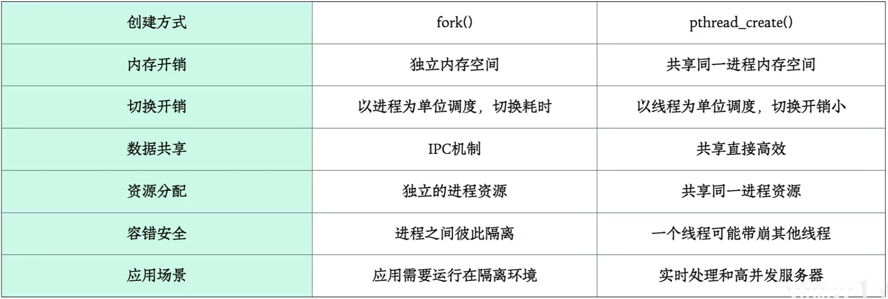
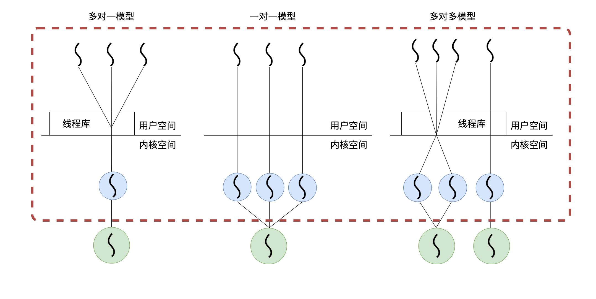
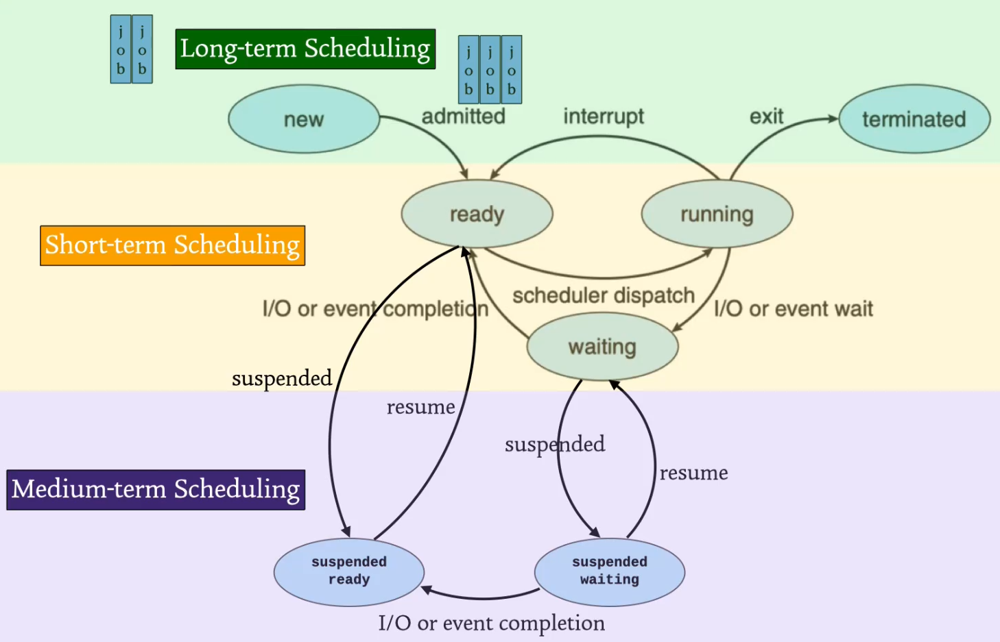

## 进程的概念

##### 程序与进程

###### 程序是<font color="#e36c09">静态</font>的

- 程序 = 代码 + 数据
- 程序是**被动实体**，例如：包含存储在磁盘上的指令列表的文件（通常称为可执行文件）

###### 🌟进程是<font color="#e36c09">动态</font>的

- 进程 = 程序 + 程序运行的上下文
- 当一个可执行文件被加载到内存中时，一个程序就变成了一个进程
- 进程是一个**活动实体**，具有指定的一条指令以及一组相关资源的程序执行过程
  - 进程是系统进行 **资源分配** 和**CPU 调度**的基本单位
  - 进程包含了正在运行的一个程序的所有状态信息

#### 进程映像


每个进程都有自己的内核堆栈和用户堆栈，其中独立的内核堆栈用来保护改进程的中断上下文以及供内核态程序使用。

### 进程的特征

#### 🌟 动态性

- 进程是动态地产生、变化和消亡的，**动态性是进程的最基本特征**
- 动态性表现在：进程由创建而产生，由调度而执行，由撤消而消亡

#### 并发性

- 并发性是指在某段时间内多个进程**同时**在执行。并发执行的进程具有以下几个特点：

  1. **间断性**：
     - 并发进程是**间断**执行的，它们不会一直占用 CPU，通常会在运行一段时间后被操作系统调度切换出去，之后再被切换回来继续执行

  2. **失去封闭性与不可再现性**：
     **封闭性**是指进程独立运行、封闭管理的特性。在并发执行中，由于进程之间共享资源，进程不再是完全封闭的。- 由于调度的不可预测性，进程执行顺序和速度通常不可控，即使是在相同初始条件下，运行结果可能不同。
     - 例如，进程 A 和 B 同时访问共享资源，调度顺序的不同可能导致执行结果的变化。

  3. **异步性**：
     - 并发进程具有执行的间断性，进程之间是独立的，相互制约。

#### 独立性

- 一个进程是一个独立的实体，独立占用资源、独立接受调度。
- 每个进程都有自己的 PCB（进程控制块）。
- **独立的寄存器**：每个进程有自己独立的寄存器（如程序计数器 PC）。
- **寄存器的轮流使用**：通过寄存器的上下文切换，多个进程看似独占 CPU。

#### 异步性

- 进程按各自独立、不可预知的速度向前推进，产生异步性。
- 为了保证并发执行结果的可再现性，操作系统引入了进程同步机制。

### 守护进程、僵尸进程和孤儿进程【了解】

- **守护进程**：在后台运行，无需用户干预，常用于系统服务
- **孤儿进程**：父进程退出后由 `init` 进程收养，不会影响系统
- **僵尸进程**：已退出但父进程未回收其状态，若不处理将占用系统资源

#### 1. 守护进程（Daemon）

- 守护进程是在后台运行的进程，通常用于执行周期性任务。
- 典型应用包括 Linux 系统中的 `httpd`、`mysqld` 等服务。

#### 2. 孤儿进程（Orphan Process）

- 父进程退出后，孤儿进程被 `init` 进程收养。
- 这些进程不会对系统造成影响，`init` 进程会清理它们的资源。

#### 3. 僵尸进程（Zombie Process）

- 僵尸进程已退出但父进程未回收其状态，占用系统资源。
- 父进程可通过 `wait()` 回收僵尸进程，避免资源浪费。

## 进程的操作

> [! ] 进程的控制与管理，使用原语完成，<font color="#e36c09">原语不可中断</font>，一气呵成

### 进程的创建【创建态】


- **本质**：在一个已经存在的进程中，通过系统调用来创建一个新进程
- **内容**：
  - 创建者为父进程（可以是用户进程也可以是系统进程），被创建者为子进程
    - 父子进程可并发运行。
    - 父子进程有独立的 PCB（不共享虚拟地址空间），但可以共享部分资源。
    - 父子进程不可同时使用同一临界资源。

- **创建原语的执行过程**

  1. **给新进程分配一个标识符 PID，申请一个空白 PCB**
     - PCB 申请失败，创建失败

  2. **给进程分配内存资源**（为程序、数据、用户栈分配必要内存空间）
     - 资源不足则进入阻塞态

  3. **初始化 PCB**
     - 初始化标识符信息
     - 初始化处理和控制信息
     - 设置进程优先级

  4. **新进程进度就绪态，插入就绪队列，等待调度**

  5. **将进程设定为运行态**

> [! ]  **创建进程的事件**
>
> - 终端用户登录操作操作系统后
> - 执行了创建进程的系统调用
> - 用户发出请求，打开一个应用程序
> - 初始化批处理作业的时候，当作业调度程序按一定的算法调度到某个 (些) 作业时，便将它装入内存创建进程

### 进程的终止【执行态➡️终止态】

- **进程终止的四种情形**
  - 正常退出（自愿退出）
  - 错误退出（进程自己提出，自愿退出）
  - 致命错误（操作系统发现后强制退出，非自愿退出）
  - 被其他进程 kill
- **终止原语的执行过程**

 1. **根据进程的 PID**，通过 PCB 找到该进程的状态
 2. **修改进程的状态，置为终止态终止进程执行**
 3. **终止所有子孙进程**（有些系统无此要求）【2024】
 4. **把所有资源都归还给父进程或操作系统**
 5. **把 PCB 删除**

### 进程的堵塞【执行态➡️堵塞态】

- 进程的阻塞过程是<font color="#e36c09">主动</font>的（进程自身决定）

- 又称：睡眠等待状态

1. **根据进程的 PID**，找到对应 PCB，获取进程状态
2. **若进程在运行状态**，则保护现场，将其转为阻塞态，停止运行
3. **PCB 插入【相应事件】的等待队列**
4. 进程上下文切换，从就绪队列选择一个进程

### 进程的唤醒【堵塞态➡️就绪态】

- 进程的唤醒过程是<font color="#e36c09">被动</font>的 (由其他进程调用唤醒原语唤醒自己)

1. 根据 PID 找到对应 **PCB**
2. 将其从**等待队列中**移出，把状态设置为**就绪态**
3. PCB 插入**就绪队列**，等待 CPU 调度

> **例子**

- **I/O 结束**：I/O 结束后，等待这个 I/O 的进程会被唤醒
- **进程退出临界区**：进程 A 想要访问有进程 B 在访问的临界区——A 进入阻塞，进程 B 访问完临界区——A 回到就绪

### 进程的状态转移

#### 三状态


- **运行态** (Running)：此时进程的代码存在 CPU 上运行
- **就绪态** (Ready)：进程具备运行条件（PCB、PID、内存）**等待分配** CPU
- **堵塞态** (Waiting)：进程在等待某些事件的发生

#### 五状态  #考前摇一摇


- **运行 (Running)**：占用 CPU
- **就绪 (Ready)**：具备运行条件，等待 CPU
- **堵塞【等待】(Waiting)**：等待某一事件发生
- **创建 (New)**：正在创建
- **结束 (Terminated)**：结束执行，正在被回收
- **挂起状态 (Suspended)**：暂停执行，进程暂时不活跃（包括就绪挂起与等待挂起）


| 进程状态转换          | 原因                         |
|-----------------------|------------------------------|
| 就绪态 ➡️ 执行态      | 分配 CPU                     |
| 执行态 ➡️ 就绪态      | CPU 时间用尽或被抢占         |
| 执行态 ➡️ 阻塞态      | I/O 请求、事件等待           |
| 阻塞态 ➡️ 就绪态      | I/O 完成、事件发生           |
| 执行态 ➡️ 终止态      | 正常/错误退出、被系统或用户强制终止 |
| 阻塞态 ➡️ 执行态 ❌   | 需先进入就绪态，再由调度器分配 CPU |

#### 七状态


##### 状态队列


##### 挂起状态的引入原因

- **系统需要释放内存资源**：将进程从内存中移到外存中
- **用户需求**：用户可能暂停某个进程以释放系统资源
- **父进程请求**：父进程可以挂起子进程
- **操作系统故障恢复**：当操作系统出现故障时，可能需要挂起进程以便于系统恢复

### 进程切换【**发生在内核态**】

- **切换时机**：
  - 进程需要进入等待状态
  - 进程被抢占 CPU 进而进入就绪状态

> **切换代价**：进程切换发生在内核态，需要保存和恢复状态信息，开销较高。

#### 进程切换过程

1. **保存处理器的上下文**：

   - 保存当前进程的寄存器信息，包括**程序计数器（PC）、状态寄存器**等重要信息，并将这些信息存储到该进程的 PCB（进程控制块）中

2. **修改进程状态，并将该进程的 PCB 放入对应的队列**：

   - 通常会将当前进程的状态修改为阻塞、就绪等非执行状态，并将其 PCB 放到适当的队列中，等待再次被调度执行

3. **调度程序选择另一个进程执行**：

   - 操作系统的调度程序根据一定的调度算法，从就绪队列中选择一个新的进程执行

4. **读取待调度进程的 PCB，修改其状态为执行状态**：

   - 将选定进程的状态从就绪修改为执行，并从其 PCB 中恢复该进程的上下文

5. **更新内存管理的数据结构**：

   - 这个步骤涉及到进程的内存管理，比如页表的更新，确保 CPU 在执行时能够正确访问到进程的内存数据

6. **恢复新进程的上下文环境**：

   - 将之前保存的处理器上下文信息恢复到 CPU 寄存器中，这些信息包括程序计数器和其他关键寄存器的值

7. **根据程序计数器找到下一条指令，恢复进程的执行**：

   - 通过恢复的程序计数器，操作系统能够继续执行该进程上一次未执行完的指令

## 进程的组织

### 进程控制块 PCB (Process Control Block)


PCB 中包含【PID + 资源分配清单 + 进程控制/管理信息】

- **PCB (Process Control Block) 是进程存在的唯一标识。**
- PCB 创建后常驻内存，任意时刻都可以存取，进程结束时删除
- 所谓创建进程就是创建 PCB

1. **PID** 标志各个进程，UID 标志进程归属的用户
2. 描述进程的状态信息，描述进程抢占处理机的优先级
3. 有关内存地址、虚拟内存地址相关的内容，打开文件列表、IO 设备信息
4. 处理机中的各种寄存器的值

> **进程标识信息**: 进程 ID（PID），父进程 ID

- **进程 ID（PID）**：标志各个进程
- **父进程 ID**：标志进程归属的用户
- **外部标识符**：方便用户 (进程) 对进程的访问而设置的外部标识符
- **内部标识符**：方便系统对进程的使用而设置的内部标识符

> **处理机状态信息**: 程序计数器 PC，处理器寄存器，程序状态字 PSW 等

- **程序计数器 PC**：存放要访问的下一条指令的地址
- **处理器寄存器**：用户程序可以访问的寄存器，用于暂存信息
- **程序状态字 PSW**：含有状态信息，如条件码、执行方式、中断屏蔽标志等
- **用户栈指针**：用于存放过程和系统调用参数及调用地址，栈指针指向该栈的栈顶

> **进程调度信息**: 进程状态、优先级、时间片、调度队列指针等

- **进程状态**：指明进程的当前状态
- **进程优先级**：用于描述进程使用处理机的优先级别的一个整数
- **时间片**：进程被分配的 CPU 时间
- **调度队列指针**：指向进程所在的调度队列
- **事件**：进程由执行状态转变为阻塞状态所等待发生的事件

> **进程控制信息**: 程序、数据的地址指针，资源清单，打开文件表

- **程序和数据的地址**：进程实体中的程序和数据的内存或外存地 (首）址【`逻辑地址`】
- **资源清单**：进程在运行期间所需的全部资源和已分配的资源的清单
- **打开文件表**：进程当前打开的文件列表
- **进程同步和通信机制**：如消息队列指针、信号量等
- **链接指针**：本进程所在队列中的下一个进程的 PCB 的首地址

### PCB 的作用

- **唯一标识**：*PCB 是进程存在的唯一标识*
- **常驻内存**：PCB 创建后常驻内存，进程结束时删除。
- **进程管理**：操作系统通过 PCB 实现进程的管理和调度。
- **独立运行**：PCB 使程序能够独立运行。
- **间断性运行**：PCB 保存 CPU 现场信息，使进程能够在被调度时恢复执行。
- **信息提供**：PCB 提供进程管理和调度所需的所有关键信息。
- **同步与通信**：PCB 实现进程间的同步与通信。

#### 需要访问 PCB 的情况

1. **调度**：OS 需要调度某个进程时，需要访问该进程的 PCB。
2. **恢复**：当进程被调度后，操作系统根据 PCB 恢复该进程的执行现场。
3. **合作**：进程运行过程中，需要与其他进程同步或通信时，需要访问 PCB。
4. **暂停**：当进程由于某些原因暂停时，暂停点信息和环境会保存至 PCB。

> [! ] PCB 位于内核空间中
> 只有内核态的代码才能访问和修改与进程有关的这些重要数据结构
> 用户程序如果需要与内核交互（比如获取进程状态），必须通过**系统调用**来请求内核进行相关操作，而不能直接操作 PCB

##### 小结


在整个生命周期中，系统是通过 PCB 来对进程进行控制，系统能通过 PCB 才能知道进程存在

### PCB 的组织方式

在一个系统中通常会拥有一对 PCB。为了能对它们加以有效的管理，应该用适当的方式将这些 PCB 组织起来

#### 线性方式


将系统中所有的 PCB 都组织在一张线性表中，将该表的首址存放在内存的一个专用区域中。该方式实现简单、开销小，但每次查找时都需要扫描整张表

#### 链接方式


把具有相同状态进程的 PCB 分别通过 PCB 中的链接字链接成一个队列，可以形成就绪队列、若干个阻塞队列和空白队列等，操作系统持有指向各个队列的指针

#### 索引方式


系统根据所有进程状态的不同建立索引表，并把各索引表在内存的首地址记录在内存的一些专用单元中

### 程序段与数据段

- **程序段**：程序段可以被多个进程共享
  - 多个进程运行同一个程序

- **数据段**：数据段是进程的数据段

因此，不同进程的 PCB 不同，程序段相同，数据段不同

**例**：
父子进程，代码段相同，地址段不同（不可以共享同一片虚拟地址空间）

## 进程通信（IPC）

进程间通信（IPC）允许独立进程之间交换数据和信息，帮助他们完成**协作和同步**

### 通信方式分类

- **低级通信**：传递**少量**控制信息，如一个字节或整型变量
- **高级通信**：传送**任意数量**的数据，通常是整块数据的传递

### 共享内存通信【高效】


- 共享内存是一种高效的通信方式。进程通过共享同一块内存区域**直接进行读写操作**，通常需要**同步机制**来避免数据竞争

- **优点**：
  - **速度快**：直接访问内存地址，减少中间环节，读写操作速度快，适合数据量大、频繁交换的场景
  - **数据传递效率高**：进程直接读写共享内存，高效
- **缺点**：
  - **同步问题**：需要同步机制防止数据竞争，通常通过锁、信号量等保证数据一致性
  - **安全性低**：进程直接访问共享内存，可能破坏共享数据，影响其他进程

### 消息传递通信


- **数据格式化与同步**：数据交换以格式化信息为单位，操作系统通过发送和接收原语传递数据
- **直接通信**：通过共享空间（如缓冲区、输入输出队列）进行直接通信，使用系统原语发送和接收消息，操作简单
- **间接通信**：通过中间实体（如邮箱或缓冲区）传递信息，称为信箱通信或电子邮件系统

  - **优点**：
    - **隔离进程间的直接内存访问**，安全性高，消息不会被非法修改
    - **灵活性**：使用信箱和缓冲区作为中间层，消息在发送和接收进程间自由传递，实现灵活的同步和异步通信
  - **缺点**：
    - **效率较低**：消息经过中间实体传递，增加中间环节，特别是消息较大或频繁发送时，效率受影响
    - **消息队列管理**：需要操作系统维护消息队列和缓冲区，增加系统复杂性

#### 消息队列【通过系统调用创建维护】

- **消息队列**：位于内核中的一个链表，进程通过将消息放入这个链表来与其他进程进行通信
- 消息队列中的消息可以被有序存储，接收进程可以根据一定的条件从队列中获取消息
- **消息链表**：消息队列中的消息按照链表结构组织，每条消息由消息类型和消息数据组成。内核通过链表来管理消息的顺序和存储
- **消息持久性**：消息在队列中可以暂存，消息队列中的数据由内核进行维护，直到接收方读取消息为止
- **多对多通信**：多个发送者可以将消息发送到同一个消息队列中，多个接收者也可以从同一个队列中读取消息
- **消息优先级**：消息可以按优先级存储，接收方可以根据消息的优先级选择接收哪条消息
- **消息队列控制块**：每个消息队列由内核中的一个**消息队列控制块（Message Queue Control Block, MQCB）** 来管理，控制块中包含了队列的标识符、消息链表、权限信息、最大消息数、最大消息大小等

- **消息存储在<font color="#e36c09">内存</font>中**：消息队列的数据都存储在内核内存中，并且受系统配置限制。内核会限制每个消息队列的最大容量和每条消息的大小，以确保系统内存资源的有效利用

##### 优点

- **异步通信**：消息队列支持异步消息传递，发送进程可以继续执行，无需等待接收进程处理消息
- **消息持久性**：即使发送方结束运行，消息仍会在消息队列中保留，直到接收方读取消息
- **多对多通信**：消息队列允许多个发送方和多个接收方共享同一队列，支持复杂的多进程通信
- **顺序和优先级管理**：消息可以按顺序排队，也可以按优先级处理，这为进程间通信提供了灵活性

##### 缺点

- **有限的消息队列大小**：由于消息队列在内存中，系统会限制队列的大小，可能导致队列满时的阻塞或消息丢失
- **性能开销**：内核在管理消息队列时需要额外的内存和 CPU 开销，消息的传递需要内核态与用户态的上下文切换
- **不可持久化**：消息队列的消息只存在于内存中，如果系统崩溃或重启，消息会丢失

##### 应用场景

- **进程间数据交换**：在同一台机器上运行的多个进程之间，可以通过消息队列传递数据
- **异步事件通知**：当一个进程需要通知另一个进程某个事件发生时，可以通过消息队列发送事件消息
- **多线程程序中的任务分发**：可以将消息队列用于多线程程序中的任务调度，主线程将任务加入队列，工作线程从队列中取出任务处理

### 管道通信【类比生产者 - 消费者问题】


#### 管道通信特点

- " 管道 " 指用于连接一个读进程和一个写进程以实现它们之间通信的一个共享文件，也叫 pipe 文件
- **半双工通信**：管道是**单向**传输的，数据只能从一端写入，另一端读出【<font color="#e36c09">不可以同时读写</font>】
  - 如果需要双向通信，可以使用两个管道（每个方向一个）
- **阻塞读写行为**：

  - 当管道<font color="#e36c09">写满</font>时，调用 `write()` 函数的进程会被**阻塞**，直到有进程从管道中读取数据并释放空间
  - 当管道<font color="#e36c09">读空</font>时，调用 `read()` 函数的进程会被**阻塞**，直到有进程写入数据供其读取
- 管道的数据读取后会失效；
- 管道的读操作需要互斥，保证每个数据项只被读取一次。

> [! ] 只能有一个读取进程，但可以有多个写入进程

> [! ] 管道是固定缓冲区，位于内存中，受内核管理，不受磁盘大小影响
>
> - 管道大小受限于内存，不受磁盘大小影响
> - 由内核负责内核负责调度、同步和内存管理

#### 管道的应用场景

- **无名管道**：通常用于有亲缘关系的进程间通信，比如**父子进程之间**。不支持无关进程大访问因为他**没有名称**
- **有名管道**（FIFO）：则允许无亲缘关系的进程间通信，通过指定路径的文件**名称**来访问管道，实现跨进才通信

#### 管道通信的优缺点

- **优点**：
  - 简单直接
  - 适用于父子进程之间的通信
  - 无需显式同步机制，使用方便
- **缺点**：
  - **半双工限制，只能单向传递信息**。需要双向通信，需要建立**两个管道**分别进行读写操作
  - 只能在具有亲缘关系的进程间使用（无名管道）
  - 管道是一种**本地进程间通信**机制，无法跨越不同主机通信

### 信号


信号是一种用于通知进程发生某种事件的机制，用不同的整数表示
信号是一种**异步的进程通信方式**。在特定的情况下，操作系统或其它进程会向某一进程发送特定的信号，该进程会在特定的时机对信号进行对应的处理。


#### **SIGKILL** 和 **SIGSTOP**

有两种信号不能被忽略，即 **SIGKILL** 和 **SIGSTOP**，原因是它们用于系统管理：

- **SIGKILL**：用于立即杀死进程，无法被进程处理或忽略
- **SIGSTOP**：用于暂停进程，无法被忽略或捕获

#### 信号的默认操作

信号发出后系统会执行该信号的默认操作。例如：

- **SIGINT**：通常由 Ctrl+C 发送，默认操作是终止进程
- **SIGQUIT**：默认行为是产生核心转储并终止进程

#### 捕获并处理信号

大多数信号是可以被进程通过自定义的 `signal` 或 `sigaction` 函数来捕获的，并定义如何处理。例如：

- 自定义函数 `handle()` 可以修改收到信号后的行为，而不是执行默认操作
- 不可捕获的信号如 **SIGKILL** 和 **SIGSTOP**，则不能通过 `handle()` 处理

#### 信号的产生

- **终端控制**：例如按下 `Ctrl+C` 会发送 **SIGINT** 信号，`Ctrl+\` 会发送 **SIGQUIT** 信号
- **程序异常**：例如访问非法内存时，系统会向进程发送 **SIGSEGV** 信号
- **调用函数**：程序可以调用 `kill()` 函数来向指定进程发送信号
- **硬件异常**：发生硬件异常（如除零错误或非法内存访问）时，操作系统会向进程发送信号（如 **SIGSEGV**）。
- **软件条件**：某些进程行为触发系统发送信号。例如，尝试写入已关闭的管道会触发 **SIGPIPE** 信号。

#### 信号的状态

信号可以处于两种状态：

- **冻结态（阻塞态）**：当信号被屏蔽时处于冻结状态，不会被进程处理。
- **活跃态**：当信号未被屏蔽且准备处理时，处于活跃状态。

#### 信号的发送权限


系统中的所有进程都可以向其他进程发送信号，但并非每个进程都有权发送。例如：

- **普通用户只**能向自己拥有的进程发送信号
- **超级用户（root）**可以向系统中的任何进程发送信号

#### 注意事项

- 某些关键操作会屏蔽信号，以避免进程被中断。
- 信号的优先级和处理顺序可能影响响应速度。
- 不同信号的处理方式和优先级取决于操作系统实现。

### 通道、管道、管理、信号量

- **通道**：使用硬件 I/O 技术进行快速信息传递，通常用于多个块的 I/O 传输
  - 比 DMA 传输效果好
  - **类型**：硬件
- **管道（pipe）**：用于进程间信息传递，通常是半双工通信，数据按顺序读取和写入，传递流式数据
- 信息传输
  - **类型**：软件
- **管理**：在进程互斥与同步中，利用信号量（如 PV 操作）进行管理的数据结构
- 信号量、PV：通过维护一个计数器控制对共享资源的访问
  - **类型**：软件

## 进程与线程

### 线程的概念

- **进程**：资源分配的最小单位
- **线程**：调度和执行的最小单位，提升并发执行速度，减少时空开销，但也带来了安全隐患
- 线程是轻量级进程
- 同一进程内所有线程共享资源 (地址空间（code、data）)，但每个线程有私有部分（独立的寄存器、独立的堆栈和线程控制块 TCB）

> [! ] 一个线程的系统调度可能让整个进程堵塞
>
> - 用户级线程中进程的调度单位。从操作系统的视角来看，它看不到线程的存在，只能看到整个进程在执行。因此，如果一个线程阻塞，整个进程都会被阻塞，即使进程中其他线程可以继续执行，它们也无法被调度运行
> - 内核级线程中每个线程都是独立的调度单位，线程堵塞仍可以调度其他线程运行

### 线程与进程的区别



| 特性   | 进程                  | 线程                 |
| ---- | ------------------- | ------------------ |
| 调度   | 不再是调度的最小单位（引入内核线程后）| 是调度的最小单位           |
| 拥有资源 | 进程都是资源分配的基本单位       | 线程只拥有少量资源          |
| 并发性  | 多个进程间可以并发执行         | 一个进程的多个线程也能并发执行    |
| 独立性  | 只共享全局变量             | 只有少数资源不能共享，例如线程的栈区 |
| 系统开销 | 通信、进程切换开销大          | 通信、切换开销小           |
| 多处理机 | 单个进程只能运行在一个处理机上     | 多线程进程可以充分利用多处理机    |
| 其他   | 进程间相互不影响            | 用户级线程的阻塞会影响整个进程    |

### 多线程模型



#### 一对一模型【并发型最好】

- **一个用户级线程**  ➡️ **一个内核级线程**

- **优点**
  - 一个线程阻塞，可以调度另一个线程
  - **并发能力强**

- **缺点**: 每来一个用户级线程都要创建一个内核级线程，开销大

#### 多对一模型【并发性低】

- **多个用户级线程** ➡️**一个内核级线程**

- 优点：线程管理在用户空间，切换效率高，速度快

- 缺点

  - 一个线程阻塞，整个进程阻塞
  - 每个进程同时只能有一个线程访问内核，并发度不高

### 多对一模型的阻塞问题

> [! ] 在线程多对一模型中，当一个线程被阻塞时，其他线程是否可以执行？
 不可以。由于多个用户线程由同一个内核线程管理，当该内核线程被阻塞时，它管理的所有用户线程也会被阻塞。因此，在多对一模型下，一个线程的阻塞会影响所有其他用户线程，导致整个进程阻塞。

#### 多对多模型【实现并发控制, 折中】


- **多个用户级线程** → **多个内核级线程**

- 优点：
  - 兼具 1:1 模型的并发能力和 N:1 模型的低开销。
  - 解决了 1:1 模型的高开销问题和 N:1 模型的低并发度问题。

### 线程库

- Thread library 为程序员提供创建和管理线程的 API

### 用户级线程与内核级线程

#### 用户级线程（User Level Threads, ULT）


- 内核不知晓线程的存在，**用户级线程切换效率高**
- 通过调用线程库提供的函数来创建用户进程，进程的控制（状态转换）由运行时操作系统内核负责
- 由内核维护 PCB 进程表
- 线程库实现 TCB 线程表

##### 用户级线程的典型应用场景

- **单处理器系统**：用户级线程在单处理器系统中优势明显，上下文切换开销小，适用于频繁切换的应用场景
- **轻量级任务**：适用于管理大量轻量级任务的场景，如模拟并发用户的应用程序

#### 内核级线程


- 通过系统调用创建内核线程，线程的控制（状态转换）**由内核负责**
- 无论是 PCB 还是 TCB，都由内核维护

### 线程的组织与控制

  

### 线程的调度

##### 用户级线程的调度


- 线程切换代价低，不需要切换完整上下文
- 并发/并行度低，一个线程阻塞整个进程阻塞

###### 优点

1. **用户态管理线程，速度快**：

   - 用户级线程的管理（如创建、销毁、同步、调度等）由用户态完成，不需要系统调用，线程切换速度快，代价低

2. **灵活性高**：

   - 用户级线程可以根据需求选择不同的调度算法，跨系统实现方便

3. **适用于多进程操作系统**：

   - 用户级线程适用于不支持线程技术的多进程操作系统，兼容性高

###### 缺点

1. **一个线程阻塞整个进程**：

   - 当一个线程被阻塞时，整个进程都将被阻塞，无法调度其他线程继续执行

2. **无法发挥多处理器的并行优势**：

   - 在多处理器环境中，用户级线程不能被调度到不同的处理器上执行，无法利用多核并行优势

##### 内核级线程的调度


- 线程切换代价高，需要转为内核态、切换完整上下文
- 并发/并行度高，一个线程阻塞其他线程仍可运行

###### 优点

1. **线程调度由内核完成**：
    - 内核选择线程运行，不考虑线程所属进程，调度灵活，粒度细
2. **多处理器支持**：
    - 在多处理器系统中，内核可以调度同一进程的多个线程并行运行，利用多处理器的并行计算能力
3. **线程阻塞处理**：
    - 当一个线程被阻塞时，内核可以调度该进程中的其他线程继续执行，避免进程整体阻塞
4. **内核线程支持多线程技术**：
    - 内核本身的线程也可以利用多线程技术，增强操作系统的多任务处理能力

###### 缺点

1. **开销大**：
    - 内核管理线程带来较高的开销，尤其是线程的创建、销毁和调度时，涉及用户态和内核态之间的转换
2. **延迟较大**：
    - 内核线程调度需要进行上下文切换和内存管理等操作，相比用户级线程，操作延迟较大

##### 总结


## 处理机调度

> 处理机调度是多道程序操作系统的基础

### 调度方式


#### 非抢占式调度

- **定义:** 一旦某个进程得到 CPU，就会一直占用到终止或等待状态
  可以简单理解为：不会因为一个新的进程到来，而结束当前进程

- **优点:**
  - 设计简单，减少调度成本

- **缺点:**
  - 仅适用于早期的批处理系统，不能用于分时系统和绝大多数的实时系统
  - 需要严格执行到一个程序的结束或者阻塞

#### 抢占式调度

- **定义:** 系统会因为新的进程达到 CPU，而去选择一个最优的进行时间片的分配
- **抢占原则**
  - 优先权原则：优先级高的进程可以抢占优先级低的进程
  - 短进程优先原则：请求处理器时间短的进程，可以抢占请求时间长的进程
  - 时间片轮原则：一个进程耗尽当前分配的时间片后，其他就绪进程可以在进程调度发生时进行抢占

- **优点:**
  - 可以防止一个进程长时间独占处理器的恶意行为
  - 等待时间和响应时间更短，用户体验好
  - 每次中断后都要考虑调度，使得操作系统更加灵活

- **缺点:**
  - 触发更多次的调度，调度是一个白白 " 浪费 " 操作系统资源的行为，因为调度程序本身处理器资源这一行为对作业的完成或是没有贡献的，因而使得系统吞吐量变低

### 三种调度



#### 作业调度 【高级调度】

- 把外存上处于后备状态的作业中挑选一个，给他们分配内存、输入/输出设备等必要资源，并建立相应的进程（作业→创建进程→就绪态）
- `外存 -> 内存`

> [! ] 在**批处理系统**中，一个作业从提交到完成通常包括以下步骤：
>
> 1. **提交作业**：用户将作业提交给系统
> 2. **作业调度**：系统决定哪些作业应该被调入内存
> 3. **作业执行**：作业开始执行，直到完成
> 4. **作业完成**：作业执行完毕后，系统会进行清理工作，比如释放占用的资源
>
> - 在这个过程中，一个作业**只会有一次调入和一次调出**，这里的 " 调出 " 指的是作业执行完毕后，系统将其从内存中移除，释放资源

#### 内存调度【中级调度】

- 把暂时无法执行的进程调度到【外存的挂起队列中】，但是其 PCB 仍然保留在内存

- 目的：节省内存

- 挂起态：内存 → 外存 / 外存 → 内存 → 挂起态

- 例如

  - 进程在内存中，出现了其他进程进来抢占内存资源，导致被挤出到外存，触发挂起态

  - 内存有了空间，触发挂起态的进程调入内存

#### 进程调度【最关键、不可或缺】【低级调度】

- 按照某种方法调度就绪队列【就绪队列】中选一个进程，将处理器分配给它

- `内存 —> CPU`

#### 三种调度的联系

- 【进程调度】使进程正常活动起来
- 【作业调度】为进程活动做准备
- 【中级调度】将暂时不能运行的进程挂起
- 调度顺序：作业调度 < 内存调度 < 进程调度


### 调度的时机 #考研摇一摇

#### 什么情况下**不可调度**

- **处理中断过程**中，**多重中断中间**可以调度

- **完全屏蔽中断的原子操作**

- **进程在内核程序临界区**
  - 因为临界区只能有一个进程访问，所以访问时一定是加锁。解锁前不应切换到其他进程运行，以加快共享数据的释放

#### 什么情况下**可以调度**: 绝大多数情况下


### 调度算法

#### FCFS (First Come First Served)

- **先来先服务** (First Come First Served)
  - **FIFO 队列**
  - 非抢占式

- **优点:**
  - 简单易行
  - 有利于长进程和 CPU 繁忙型

- **缺点:**
  - 没有优化策略
  - 无法并行利用资源，可能导致车队效应即导致长程和 I/O 密集型进程的效率低下

> [! ] 车队效应
   当有许多 I/O 密集型进程和一个 CPU 密集型进程时，CPU 密集型进程占用 CPU，I/O 密集型进程得不到处理
   实际上，I/O 密集型进程可以短暂地使用 CPU，然后很快使用 I/O 设备，以更高效地利用系统资源。但在 FCFS 调度下，它们只能等待 CPU 密集型进程完成后才开始执行

#### SJF (Shortest Job First)

- **短作业优先** (Shortest Job First)
- 适用于运行时间已知的批作业处理作业
- 一般指非抢占式版本
- 抢占式版本：最短剩余时间优先（Shortest Remaining Time First，SRTF）

- **优势:**
  - 拥有最优的平均等待时间和平均周转时间
  - 此算法被证明是最优的

- **劣势:**
  - 容易发生饥饿，对长作业不利
  - 该算法需要先知道进程/作业所需的 CPU 时间，但这并非易事

#### SRTF（Shortest Remaining Time First）

#### 时间片轮转 RR

每个进程都可以得到相同的 CPU 时间，当时间片到达，进程将被剥夺 CPU 并加入**就绪**队列的尾部

- **FCFS** 抢占式版本

- **优点:**
  - 每个进程（包括新创建的进程）都能获得相等的 CPU 时间，并确保所有进程都能轮到执行。因此，<font color="#e36c09">不会出现饥饿问题</font>
  - **多任务操作系统的关键调度算法<font color="#e36c09">公平性</font>**
  - 易于实现

- **缺点:**
  - 较长的等待时间和响应时间：进程可能会经历较长的等待时间和响应时间
  - 低吞吐量
  - 在给定的时间内完成的进程总数可能较少
  - 对长作业带来额外的上下文切换开销
- **目的:**
  - 创建【分时系统】，让多个用户可以及时干预系统

- **时间片选择:**
  - **过小**: 进程切换开销显著增大
  - **过大**: 响应速度下降（取值无穷大将退化成 FCFS）

#### 优先级调度 (PRIORITY)

- 优先级通常为固定区间的数字

##### 静态优先级

- **创建进程时确定**的，确定之后整个运行期间不可改变
- 优先级保持不变，但会出现不公平（饥饿）现象

##### 动态优先级

- **运行时确定**的
- 根据进程占用 CPU 时间：当进程占有 CPU 时间愈长，则调低优先级
- 根据进程在等待 CPU 时间：当进程在就绪队列中等待时间愈长，则调高优先级

#### 高响应比【非抢占式】

- **响应比** $R_p$ = $\frac{等待时间 + 要求服务时间}{要求服务时间} = 1 + \frac{等待时间}{要求服务时间} = 1 + \frac{当前时间-到达时间}{要求服务时间}$

> [! ] 响应比越高，优先级越高

- **优势:**
  - 利于短作业作业，且不会发生饥饿现象
  - 长作业等待的时间足够长，优先级就会高于短进程

> [! ] 饥饿现象（Starvation）
> 指某个或某些进程长时间得不到资源的分配，导致它们无法执行的情况
> 在多任务操作系统中，调度器根据某种调度策略分配 CPU 等资源，如果某些进程一直得不到调度执行，就会陷入 " 饥饿 " 状态，进而无法完成任务

- **缺点**：
  - 计算开销
  - 预估运行时间难以实现

#### 多级队列调度


- 把进程就绪队列从一个拆分为多个优先级队列
- 多个就绪队列都有一定的优先级, 优先处理高优先级队列的队列

> [! ] 不同就绪队列的调度算法可以不一样

- 优先级类型

  - `系统 > 用户`
  - `交互 > 非交互`
  - `I/O > 计算`

- **优点**: 灵活性
- **缺点**：公平性差，饥饿现象，复杂性

#### 多级反馈队列


- **多个队列，每个队列对应一个优先级**：系统中有多个就绪队列，每个队列的优先级不同。优先级较高的队列用于处理短作业或交互式进程，优先级较低的队列则用于处理长作业或后台进程
- **时间片轮转调度**：每个队列都采用时间片轮转调度，但是**优先级越高的队列时间片越短**，优先级越低的队列时间片越长。这种设计使得**短作业优先得到处理**，而长作业则逐步向低优先级队列移动，得到更长的时间片处理时间
- **允许进程在队列之间迁移**：进程初始被放在高优先级队列中，如果在规定的时间片内没有完成，进程会被降级，进入较低优先级的队列。反之，如果某些低优先级队列的进程在运行时表现为短作业，它们可以被提升到较高优先级的队列。这一机制避免了长作业的**无限期推迟（饥饿）**
- **优先调度高优先级队列**：系统总是优先选择高优先级队列中的进程进行调度，只有在高优先级队列空闲时，才会调度低优先级队列中的进程。这种方式确保了短作业或交互性强的进程得到优先处理
- **时间片递增**：每个队列对应的时间片长度不同。一般来说，优先级越高，时间片越短，优先级越低，时间片越长
- **满足各类进程需求**：能较好地满足各类进程对处理器的需求

##### 需要综合考虑的因素

- **优先级数量**：设定多少个优先级
- **优先级之间的转换规则**：进程在不同优先级之间如何转换
- **就绪队列数量**：设定多少个就绪队列
- **就绪队列的调度算法**：每个队列采用何种调度算法
- **进程在就绪队列间的迁移条件**：进程在不同队列之间迁移的条件

##### 优点

- **短作业优先处理**：高优先级队列具有短时间片，能够迅速处理交互式任务和短作业，用户体验较好
- **减缓饥饿现象**
- **灵活的优先级调整**：进程可以在不同优先级队列之间动态迁移，根据作业的执行情况调整其优先级

##### 缺点

- **算法复杂性较高**：多级反馈队列需要设定多个优先级和时间片，且要管理进程在队列之间的迁移，调度开销较大
- **不易确定最佳参数**：如何设置每个队列的时间片长度和优先级之间的转换规则，往往需要根据具体的系统和应用进行调整，难以找到最优配置
- **低优先级进程响应较慢**：虽然能够避免长作业饥饿，但低优先级的进程仍可能等待较长时间才会被调度

#### 小结


|  调度算法  | 特点                                           |
| :----: | -------------------------------------------- |
| 先来先服务  | 优点：逻辑简单<br>缺点：完全不考虑进程特性，容易出现长作业延迟现象          |
| 短进程优先  | 优点：拥有最低的平均等待时间和平均周转时间<br>缺点：进程预估运行时间不准确时计算困难 |
|  优先级   | 优点：通过设置进程的优先级划分不同特权<br>缺点：低优先级进程可能被饿死        |
| 高响应比优先 | 优点：优先级动态变化，兼顾长短作业<br>缺点：可能消除饥饿，但较为复杂         |
| 时间片轮转  | 优点：公平地将处理器分配给每个进程                            |
| 多级反馈队列 | 优点：能够较好地满足各类进程对处理器的需求                        |

|    调度算法    |  是否可抢占  | 是否会<br>导致饥饿 |     算法考虑因素      |
| :--------: | :-----: | :---------: | :-------------: |
| 先来先服务调度算法  |    否    |      否      |     进程到达时间      |
| 短进程优先调度算法  |   均可    |      是      |    进程预计执行时间     |
|  优先级调度算法   |    可    |      是      |      进程优先级      |
| 高响应比优先调度算法 |   均可    |      否      | 进程预计运行时间 + 等待时间 |
| 时间片轮转调度算法  |    是    |      否      | 所有进程公平分配的使用处理器  |
| 多级反馈队列调度算法 | 队列算法不一定 |      是      |      较为复杂       |

### 调度评价指标

#### CPU 利用率

  $$\text{CPU 利用率} = \frac{\text{CPU 有效执行时间}}{\text{CPU 有效工作时间} + \text{CPU 空闲时间}}$$

#### 系统吞吐量

  $$\text{系统吞吐量} = \frac{\text{完成作业数}}{\text{完成时间}}$$

- 单位时间内完的进程数量
- 调度算法效率越高，吞吐量越大

#### 周转时间

- $\text{周转时间} = t_{\text{完成}} - t_{\text{提交}}$
- $\text{平均周转时间} = \frac{1}{n} \sum t_{\text{周转}}$
- 从进程提交都进程完成所经历的总时间

#### 带权周转时间

- $\text{带权周转时间} = \frac{t_{\text{周转}}}{t_{\text{实际运行}}}$
- $\text{带权周转时间} \geq 1.0$

#### 响应时间

- 从提交任务到**第一次响**应的时间

#### 等待时间

- 进程在就绪队列中累计等待的时间**之和**

#### 公平性

- 调度策略应确保所有进程得到公平的处理器时间，不应该让某些资源长期得不到处理器资源
- 公平的调度策略可以防止饥饿现象，即某些进程长期等待却无法执行

### 定时器中断的概念

- **定时器（Timer）** 是一个硬件设备，可以按照设定的时间周期生成中断信号，称为 **时钟中断**
- 操作系统利用定时器中断来管理时间、调度进程以及实现某些周期性任务
- 定时器是系统保持多任务运行的关键，确保操作系统能定期获得 CPU 控制权

#### 时钟中断的作用

- **进程调度**：操作系统通过定时器中断来触发进程的调度。例如在 **时间片轮转（RR）调度算法** 中，每当时间片结束，时钟中断会触发进程切换
- **时间管理**：操作系统通过时钟中断来维护系统时间、计时器（如定时任务、延迟任务）的运行。例如，系统时间会定期更新，计时器等也需要通过时钟中断实现
- **抢占式多任务**：定时器中断用于实现抢占式调度，使得高优先级任务可以在低优先级任务执行时打断低优先级任务，获得 CPU 控制权
  - 在非抢占式调度中，进程运行到结束或主动放弃 CPU
  - 在抢占式调度中，时钟中断可以打断进程的执行，强制切换到另一个高优先级的进程
- **系统统计和分析**：操作系统可以通过定时器中断统计 CPU 使用情况、进程运行时间等，从而进行系统监控和优化

#### 时钟中断的实现过程

- 定时器在系统启动时会被初始化，通常以固定频率发送中断请求
- **当时钟中断发生时**，CPU 暂停当前任务，进入 **中断处理程序**。在处理程序中，操作系统可以：
  - 进行 **进程调度**，如检查当前任务的时间片是否用完
  - **更新系统时间**，如时钟滴答数（ticks）增加
  - **检查定时器队列**，如有无需要唤醒的任务等

1. **内核中时钟变量的值**：这包括全局系统时间的更新，通常是记录系统启动后的运行时间，或者更新系统时钟以供其他系统组件使用

2. **当前进程占用 CPU 的时间**：时钟中断会记录当前进程在此次调度周期中已占用的时间，用来统计进程的 CPU 使用情况

3. **当前进程在时间片内的剩余执行时间**：操作系统会为每个进程分配一个时间片，在时间片用完之前允许进程继续运行。时钟中断会减少该剩余时间，如果时间片用完，则触发进程切换

## 多处理机调度

1. **并行性**

   - **单处理器系统**：所有任务串行执行，调度器每次只能分配一个任务。
   - **多处理器系统**：调度器可以将任务分配给多个处理器以实现并行执行，从而提升系统的并发性能。

2. **负载均衡**

   - **单处理器系统**：只有一个处理器，无需考虑负载均衡。
   - **多处理器系统**：调度器需合理分配任务以均衡各处理器的负载，避免出现某些处理器过载、其他处理器空闲的情况。

3. **处理器亲和性**

   - **定义**：尽量让进程在其之前运行过的处理器上执行，以提高缓存命中率，减少缓存失效的开销。
   - **两种亲和性**：
     - **软亲和性**：尽量在之前运行过的处理器上执行，但不强制。
     - **硬亲和性**：强制绑定到特定处理器，进程只能在该处理器上运行（如 Linux 的 `sched_setaffinity()`）。

### 两种多处理机

#### 非对称多处理机（AMP）


- 结构：一个处理器专门负责调度和系统任务，其他处理器仅负责执行用户进程。
- 特点：只有一个处理器能访问内核区，适用于简单系统设计。

#### 对称多处理机（SMP）


- 每个处理器自我调度（自己空闲了就调度一个就绪进程进行）

- **简化设计**：每个处理器的调度相互独立，不需要复杂的全局协调
- **系统共享资源**：多个处理器共享主存和 I/O 设备，但可能会导致瓶颈

- **SMP vs AMP**：在 SMP 系统中，所有处理器共享内存、I/O 设备，并且可以并行访问和使用相同的资源，因而更适合对称的多任务操作。在 AMP 系统中，不同的处理器可能拥有不同的任务和职责，这使得它们通常不共享相同的资源，但某些情况下仍可能会使用类似的独立调度机制

- **优缺点**：独立调度可以减少全局调度器的复杂度，提升调度效率，特别是在多核系统中，能大大提高资源利用率。然而，如果没有合理的资源共享机制，系统性能可能受到瓶颈影响

### 调度算法

#### 公共就绪队列

- **定义**：所有处理器共享一个全局就绪队列，所有任务在该队列中等待调度。
- **优点**：任务分配更均衡。
- **缺点**：频繁访问队列可能导致锁竞争和同步开销

#### 私有就绪队列

- **定义**：每个处理器有独立的就绪队列，独立管理任务。
- **优点**：任务可以持续在同一处理器上运行，缓存命中率更高。
- **缺点**：可能导致负载不均衡，某些处理器负载过重，而其他处理器负载较轻。

### 静态负载均衡策略

#### 定义

静态负载均衡是在程序执行之前，根据任务的特征和系统资源的情况，预先进行任务的分配。任务一旦分配，分配策略在运行期间不会改变

- **优点**：实现简单，开销小。
- **缺点**：缺乏灵活性，无法应对运行时的负载变化。

- **方法**

  - **轮询法（Round Robin）**：任务依次分配到不同的处理器上，适用于任务大小较为均等的场景
  - **加权轮询法**：根据处理器的不同能力，给不同处理器赋予权重，按比例分配任务
  - **任务划分法**：根据任务特性，将任务划分成大小均等的子任务，然后均匀分配给各个处理器

### 动态负载均衡策略

#### 定义

动态负载均衡是在程序运行过程中，根据系统当前的负载情况，实时调整任务的分配，以均衡每个处理器或节点的工作负载

- **特点**

  - 任务分配依据系统运行状态动态调整
  - 系统定期监控各个处理器的负载，自动迁移任务以达到负载均衡

- **优点**：灵活适应负载变化，优化资源利用率。
- **缺点**：实现复杂，任务迁移带来开销。

- **方法**

  - **集中式调度**：一个中央调度器负责监控所有处理器的负载情况，实时调整任务分配
  - **分布式调度**：每个处理器自我监控，并根据邻近处理器的负载情况协同调整任务分配
  - **推 - 拉策略（Push-Pull Migration）**：
    - **推迁移（Push Migration）**：当某个 CPU 负载过重时，系统主动将部分任务迁移到其他空闲的 CPU 上
    - **拉迁移（Pull Migration）**：当某个 CPU 负载较轻时，它会主动从其他处理器拉取任务，以均衡负载

### 负载均衡与多核处理器

在多核处理器系统中，负载均衡是提高处理器利用率的关键。多核系统的负载均衡策略可能需要考虑以下几个因素：

- **处理器亲和性**：确保任务尽可能在同一处理器上运行，以提高缓存利用率
- **NUMA 架构**：在 NUMA 系统中，任务尽量分配到与其访问的内存距离较近的处理器上，以提高内存访问效率

- **典型应用**：

  - 适用于负载比较均衡且已知的环境，例如某些科学计算应用，任务大小和计算时间相对固定

#### 处理机亲和性

> [! ] 进程尽可能保持在同一个处理器上运行，以减少缓冲失效的开销

1. **软亲和性（Soft Affinity）**：操作系统尽量尝试将一个进程安排到其先前运行过的处理器上，但并不强制执行。如果系统负载较高，进程仍可能被调度到其他处理器上

2. **硬亲和性（Hard Affinity）**：操作系统强制将进程绑定到特定的处理器核心，**进程只能在指定的核心上执行**。这通常可以通过特定的 API 来实现，比如 Linux 系统中的 `sched_setaffinity()`

## 同步与互斥

### 同步的概念

- **可重入代码**: 允许多进程同时访问的代码。

#### 临界资源

> 一次只能有一个进程所用的共享资源: **互斥**

- **进入区（entry section）**
  - **" 上锁 "**：用于检查是否可以进入临界区
  - 如果可以进入，设置当前进程正在访问临界资源的标志，防止其他进程同时进入

- **临界区（critical section）**
  - 包含访问共享资源的代码段，是必须独占执行的部分，保证某一时刻只有一个进程能够进入

- **退出区（exit section）**
  - 离开临界区的代码段，用于清除对临界区的标志，使其他进程可以进入

- **剩余区（remainder section）**
  - 不涉及临界资源访问的代码段，即程序的其他部分

- 例子：公用队列

```cpp
while (true) {
    entry section;      // 进入区
    critical section;   // 临界区
    exit section;       // 退出区
    remainder section;  // 剩余区
}
```

```cpp
int n = 0; // n为共享变量

P1() {
    int step;
    while (n < 5) {
        step = n;
        n = step + 1;  // 临界区：对共享变量 n 进行操作
    }
    printf("A=%d", n);
}

```

- 反例: 磁盘、内存、私有数据、可重入程序代码

#### 同步【直接制约】

- 同步问题实质是将异步的并发进程按照某种顺序执行
- 目的：保证进程每次执行结果的可再现性

#### 互斥【间接制约】

某些应用程序建立了多个进程完成同一项任务，这些进程就构成了直接制约关系

> **四大原则**

|     空闲让进      | 当无进程处于临界区时，任何进程都可以进入临界区                               |
| :-----------: | ----------------------------------------------------- |
|     忙则等待      | 当已有进程进入临界区时，其它进程不能进去进入临界区；必须等待                        |
|     有限等待      | 对要求访问临界资源的进程，应保证在有限时间内能进入自己的临界区</br>等待进入临界区的进程不能无限期等待 |
| 让权等待</br>(可选) | 不能进入自己的临界区的进程，应立即释放 CPU（如转换到堵塞状态）|

### 实现临界区互斥的软件方法

- 复杂
- 需要 " 忙则等待 "，浪费 CPU 时间

#### 单标志法【违背 " 空闲让进 "】


- **特点**：使用单个标志（Flag）来判断是否可以进入临界区
- **缺点**：违背了 " 空闲让进 " 的原则，当一个进程长时间占用临界区时，其他进程无法进入，即便临界区已经空闲

#### 双标志法先检查【违背 " 忙则等待 "】


- **特点**：每个进程都有一个标志，只有当对方不需要进入临界区时，进程才可以进入
- **缺点**：违背了 " 忙则等待 " 的原则，进程不断检查是否可以进入，导致 CPU 资源浪费

#### 双标志法后检查【违背 " 空闲让进 "、" 有限等待 "】


- **特点**：和先检查法类似，区别在于检查和设置标志的顺序
- **缺点**：违背了 " 空闲让进 " 和 " 有限等待 " 的原则，可能会导致某个进程无法进入临界区

#### Peterson's Algorithm【违背 " 让权等待 "】


### 并发控制与忙等机制

- **特点**：通过两个进程间的通信，实现对临界区的互斥访问
- **优点**：能保证**互斥**进入临界区，并避免了**饥饿**
- **缺点**：违背了 " 让权等待 " 的原则

> [! ] 忙等等待机制
>
> - **Peterson 算法**（软件实现）
> - **硬件原子操作指令**
>   - **TSL 指令**
>   - **SWAP 指令**

---

硬件控制通过 TSL 和 SWAP 等原子指令来确保并发进程的原子操作

> 算法分析：穷举法、断电分析法


### 实现临界区互斥的硬件方法


#### 中断屏蔽法

- **特点**：在进程进入临界区时，关闭中断，保证没有其他进程或线程可以打断该进程的执行
- **缺点**：不适合多处理器环境，因为关中断只能作用于当前处理器

#### 硬件指令法 (TestAndSet，TS 指令)


- TS 可以看作一个执行过程不可分割的函数过程（原语)
- 忙等待：有进程在临界区执行期间，计算机系统关中断，从而不会引发调度，也就不会有进程或线程切换
- 等待进入临界区的进程不会主动放弃 CPU
- 这是一个原子操作，确保对临界区的访问是不可分割的。进程通过测试并设置锁变量来决定是否可以进入临界区
- **优点**：有效实现了临界区的互斥
- **缺点**：采用忙等待的方式，进程不断测试锁的状态，导致 CPU 资源浪费，违背了 " 让权等待 " 原则

#### Swap


为每个临界资源设置一个全局布尔变量 lock，初值 FALSE

- 通过交换操作实现对全局布尔变量（锁）的原子修改，确保互斥
- **缺点**：与 TS 类似，采用忙等待机制，不符合 " 让权等待 " 的要求

#### 信号量


### 信号量机制

- 信号量 S 是一个整型变量，除了初始化之外，它只能通过两个标准原子操作访问：P（荷兰语中的 proberen）和 V（荷兰语中的 verhogen）

- P: wait() operation
- V: signal () operation

- 信号量可以用于解决互斥和同步问题，只能被 Wait 和 Signal 访问

  - Wait ---- P, Signal ---- V
  - Wait：等待 S 大于零的时候执行；可执行时 S--
    - Signal：S++

  - PV 操作是一种【低级进程通信原语】而不是系统调用命令

#### 整形信号量

- `wait (S)` 和 `signal (S)`，其中 S 是一个整数：
  - wait：S -= 1
  - signal：S += 1
- **优点**：
  1. 解决了同步互斥问题
  2. 不强制进程切换
- **缺点**：不满足 " 让权等待 " 的要求，可能导致忙等待

#### 记录型信号 【题目不说，默认是对记录型信号量处理】

- int + 链表
- 满足了让权等待

- wait: S <= 1；把进程加入等待队列；阻塞进程
- signal: S += 1；把进程从等待队列中移出；唤醒进程

#### Swait 和 Ssignal

- 格式为：Swait(Si, ti, di, …)

- 对于信号量 Si，每次分配 di（即 Si = Si - di）
- 如果 Si < ti 则不予以分配

## 管程


- **作用**：用于管理共享变量和它们的操作过程，简化同步机制，避免大量分散的 PV 操作，提高进程间的互斥性和同步性，降低死锁的可能性。
- **特点**：管程本身是一个进程同步工具，进程必须通过管程的入口来访问数据结构，保证了访问互斥。同一时刻只有一个进程能进入管程。

### 作用

- **互斥**：进程访问管程的共享资源时不需要显式实现互斥操作，避免编程时的复杂性。
- **同步**：通过 `wait` 和 `signal` 操作管理进程的阻塞与唤醒。
- 通过管程提供的接口才能访问数据结构
  - 类似 class 数据结构，管程的变量全是 private 类型
- 同一时刻仅允许一个进程使用管程，从而实现进程互斥

### 组成


- 定义：【联想 " Class 类 "】
  1. 管程名称
  2. 共享数据结构
  3. 操作方法
  4. 初始化定义


- 使用 x 来对阻塞队列进行挂载：
  - `x.wait()`:
    - 当对应的条件不满足时，正在调用管程的进程调用 `x.wait()` 将自己插入条件的等待队列，并释放管程
    - 此时其他进程可以使用该管程

  - `x.signal()`:
    - 对应的条件发生了变化，调用 `x.signal()` 唤醒一个因 x 条件而阻塞的进程

- 注意管程的 `wait`, `signal` 和 PV 操作的**区别**：
  - **相似**：可以实现进程的阻塞/唤醒
  - **不同**：
    - 信号量是有值的，信号量反应了剩余资源数，而在管程中，剩余资源数用共享数据结构记录
    - 条件变量是无值的，管程的 `signal` 和 `wait` 只负责阻塞、唤醒进程，所以<font color="#e36c09">管程的条件变量不需要赋值也不需要初始化</font>。

- 可以有多个 condition x，可以在一个管程中，管理多个共享资源

### 信号量 vs 管程

| 比较对象        | 信号量                  | 管程                     |
| ----------- | -------------------- | ---------------------- |
| **机制支持者**   | 操作系统                 | 编程语言                   |
| **同步互斥设计者** | 临界区资源使用者             | 临界区资源提供者               |
| **进程阻塞的条件** | 计数值为 0 的信号量执行 P() 操作 | 条件变量 `wait()`          |
| **进程唤醒的条件** | 计数值为正的信号量执行 V() 操作   | 等待队列非空的条件变量 `signal()` |
| **服务使用方式**  | 系统原语                 | 函数调用                   |

- 管程在用户态下设计，条件变量的设计以信号量机制为基础，二者在同步互斥功能上是等价的

## 死锁（Deadlocks）

### 概念


- **定义**：在并发环境下，各进程因竞争资源而互相等待，导致所有进程都阻塞，无法继续推进，称为**死锁**
- 特点：若无外力干涉，死锁状态将持续。
- 形成原因：通常是**n ≥ 2 个进程**争夺有限资源或彼此通信引发的阻塞现象。若无外部干涉，死锁将无法终止。

- **死锁**：各进程互相等待对方的资源，导致所有进程阻塞
- **饥饿**：进程长期得不到所需资源，无法推进
- **死循环**：进程在执行过程中一直跳不出某个循环，可能是程序逻辑错误或故意设计

### 死锁的必要条件

- **互斥 Mutual Exclusion**
  - 每个资源在一段时间内只能由一个进程占用。

- **不可剥夺 No Preemption**
  - 资源一旦分配给进程，不能被强行剥夺，除非进程主动释放。

- **请求 + 保持 Hold and Wait**
  - 进程持有至少一个资源，同时还在请求其他资源，并且不释放已经持有的资源。

- **循环等待 Circular**
  - 存在一组进程，每个进程都在等待另一个进程所占有的资源，形成环形等待链。

---

- 系统要避免死锁，必须保证有足够的资源使得至少一个进程可以完成其执行，从而释放资源供其他进程使用。
- 每个进程可能最大占用的资源数为 $m$ 个（题目会给出）。系统不会发生死锁的条件是至少有 $n+1$ 个资源，其中 $n$ 是进程数。即，系统所需的最小资源数为：

   $$
   \text{最小资源数} = n \times (\text{每个进程的最大需求} - 1) + 1
   $$


> [! ]  **避免死锁的最小资源数公式**：

   $$
   R \geq P \times (M - 1) + 1
   $$

- $R$ 是总资源数
- $P$ 是进程数
- $M$ 是每个进程最大资源需求数

> [! ] **死锁最小进程数公式**：

   $$
   P_{\text{min}} = \frac{R}{M - 1}
   $$

- $R$ 是资源数
- $M$ 是每个进程的最大需求
- $P_{\text{min}}$ 是可能发生死锁的最小进程数

---

### 选择进程解除死锁的标准

- 进程优先级
- 已执行时间
- 预计完成时间
- 已使用资源量
- 进程类型（交互式或批处理式）

### 死锁产生的两大原因

> [! ] 系统资源不足不是系统产生死锁的原因，资源不足只会对进程造成 " 饥饿 "

#### 资源分配不合理——操作系统背锅

#### 进程推进顺序非法——程序员的锅

### 死锁解除方法

1. **资源剥夺法**：挂起某些死锁进程，抢占其资源
2. **撤销进程法**：强制终止部分或全部死锁进程，释放资源
3. **进程回退法**：让一个或多个死锁进程回退到避免死锁的状态

### 死锁的处理策略

| 死锁预防 | 通过设置某些限制条件，破坏产生死锁四个必要条件中的一个或几个  |
| :--: | ------------------------------- |
| 死锁避免 | 在资源的动态分配过程中，用某种方法防止系统进入不安全状态    |
| 死锁检测 | 发生死锁后及时地检测出死锁的发生                |
| 死锁解除 | 当检测到系统中已发生死锁时，就采取相应措施将进程从死锁状态解除 |

#### 死锁预防

##### 破坏互斥【使用可共享的资源（如 SPOOLing 技术）】

- 使用 **SPOOLing 技术** 允许多个进程同时产生输出，避免对某些独占资源的互斥访问。

> [! ] 有些资源（如打印机、文件写锁、CPU）不能共享，强制共享会导致数据损坏或系统崩溃。

##### 破坏不剥夺【允许系统强行剥夺进程资源】

- 系统可以通过剥夺进程所持有的资源来避免死锁。例如，当进程请求新资源时，如果资源不足，则可以强行剥夺其他进程的资源。
- **缺点**：实现复杂，频繁的资源申请和释放会增加系统开销。

##### 破坏请求保持【要求进程在需要时一次性申请所有资源。】

- 要求进程一次性申请所有所需资源，若无法一次获取足够资源则不执行，避免部分占有导致的死锁。
- **缺点**：资源利用率低，可能会导致资源长时间闲置或饥饿。

##### 破坏循环等待【给资源编号，并按顺序申请资源。】


- 通过给资源编号，并按顺序分配资源来避免循环等待。例如，进程只能按编号顺序申请资源。
- **缺点**：进程的资源请求顺序可能与系统资源编号不一致，导致资源浪费。

#### 死锁避免【银行家算法】动态侦查

##### 安全状态与不安全状态

- **安全状态**：一定没有死锁风险
- **不安全状态**：当前无死锁，但未来某些资源请求可能导致死锁

> [! ] 避免死锁的方法：确保系统不会进入不安全状态

---

- **银行家算法**：动态检测资源分配请求是否会导致系统进入不安全状态，如果会进入不安全状态，则拒绝该请求。
- **缺点**：实现复杂，频繁进行安全检查，计算开销大。适用于资源需求固定且可预测的系统，但不适合动态需求系统。
- 该算法要求提前知道每个进程的最大资源需求 `Max`，不能用于检测已经发生的死锁。

**公式**：


##### 银行家算法的应用场景可以概括为以下几种情况

- **资源有限的系统**，需要避免资源分配导致死锁。
- **多进程环境下**，进程可能动态申请和释放资源的系统。

在使用银行家算法时，分配的资源实际上是一种假设，并不代表真正的资源已经分配。算法在假设资源分配后，会通过模拟计算来检查系统是否仍然处于安全状态。如果系统在该分配下仍然可以满足所有进程的资源需求（即不会导致死锁），则返回 " 同意分配 "；否则，返回 " 拒绝分配 "

##### 银行家算法需要提供的信息

- **n** = 线程数量
- **m** = 资源类型数量

1. **Max（资源最大需求量）**：n x m 矩阵
   - 表示进程 $P_i$ 最多请求资源类型 $R_j$ 的实例数量，记为 `Max[i,j]`。

2. **Available（剩余空闲量）**：长度为 m 的向量
   - 表示当前系统中类型 $R_j$ 的可用资源实例数，记为 `Available[j]`。

3. **Allocation（已分配量）**：n x m 矩阵
   - 表示进程 $P_i$ 当前分配到的类型 $R_j$ 的资源实例数，记为 `Allocation[i,j]`。

4. **Need（未来需要量）**：n x m 矩阵
   - 表示进程 $P_i$ 未来还需类型 $R_j$ 的资源实例数，记为 `Need[i,j]`。
   - 计算公式：`Need[i,j] = Max[i,j] - Allocation[i,j]`

$$need = Max - Allocation$$


#### 死锁检测【通过资源分配图等方法检测是否出现死锁】


若能把图中所有的边都消除，则称该图是可完全简化的，如果该图是不可完全简化的，则此时处于死锁状态
进程画圆圈，资源画方框里的圆圈

- **资源分配图**：用于检测死锁的图结构
  - **结点**：进程结点和资源结点
  - **边**：进程到资源表示请求，资源到进程表示分配

- **检测算法**：
  1. 如果系统中剩余资源足够满足某进程需求，该进程可顺利执行并释放资源
  2. 通过上述过程，若最终能消除所有边，则无死锁；否则，存在死锁

#### 死锁解除

- **资源剥夺法**：挂起某些死锁进程，剥夺其资源分配给其他死锁进程。需要注意防止剥夺进程的饥饿问题。
- **撤销进程法**：强制撤销部分或全部死锁进程并剥夺这些进程的资源。代价较大，通常按进程优先级撤销。
- **进程回退法**：让一个或多个进程回退到避免死锁的状态，系统需要保存进程的历史记录。
