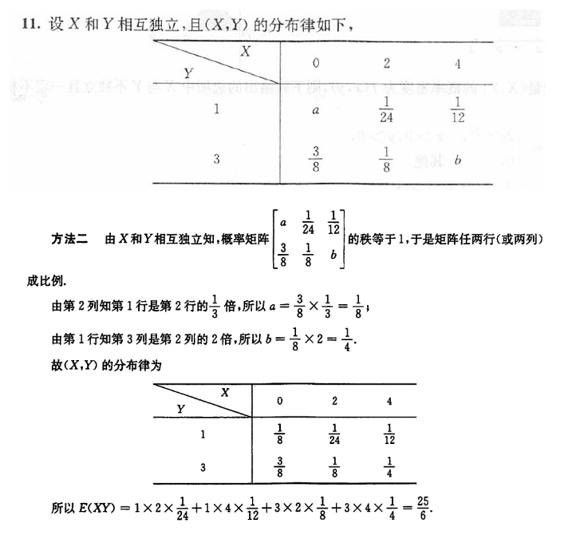

## 考前摇一摇

> [! ] 独立是由事件概率等式来定义的，不取决于事件之间的关系
> 事件可以推概率，概率不可以推事件

- 独立与互斥无关
 
- 独立定义：$P(AB) = P(A) \cdot P(B)$
- 概率为 0 或 1 的事件，与任何事件独立，其中概率为 0 的事件与任何事件都互斥

- 若 $C$ 发生必然导致 $A$、$B$ 同时发生则 $C \subseteq AB$
- $A \subset B \ \Rightarrow$

  1. A 发生 B 一定发生
  2. P(A) ≤ P(B)
  3. $AB \subset A \subset A+B$
  4. $AB \cap A  = AB$
  5. $A \cap A+B = A$
  6. $AB\cup A = A$

### 分配律公式

- $A \cap (B \cup C) = (A \cap B) \cup (A \cap C)$
- $A \cup (B \cap C) = (A \cup B) \cap (A \cup C)$
- $A \cap (B - C) = (A \cap B) - (A \cap C)$

### 对偶律 (德摩根律)

$$\overline{A \cup B} = \overline{A} \cap \overline{B}$$

$$\overline{A \cap B} = \overline{A} \cup \overline{B}$$

$$\overline{A \cup B \cup C} = \overline{A} \cap \overline{B} \cap \overline{C}$$

### 容斥原理

- $P(A + B) = P(A) + P(B) - P(AB)$
- $P(A - B) = P(A) - P(AB)$
- $P(A \cup B) = P(A - B) + P(B - A) + P(AB) = P(A - B) + P(B)$
- $P(A \cup B \cup C) = P(A) + P(B) + P(C) - P(AB) - P(AC) - P(BC) + P(ABC)$

### 概率单调性

$$
P(AB) \leq P(A) \leq P(A+B) \leq P(A) + P(B)
$$

$$
P(A_{1}A_{2}\cdots A_{n}) \geq P(A_{1}) + P_{A_{2}} + \cdots P(A_{n}) - (n-1)
$$

$$
P(AB) \geq P(A) + P(B) - 1
$$

$$
P(ABC) \geq P(A) + P(B) + P(C) - 2
$$

### 全概率

#### 完备事件组

若 $A_1, A_2, \cdots, A_n$ 两两互斥，且满足 $\bigcup_{i=1}^n A_i = \Omega$，则称 $A_1, A_2, \cdots, A_n$ 为完备事件组。

1. 两两互斥
2. 构成全集

#### 全概率公式

设 $A_1, A_2, \cdots, A_n$ 两两不相容，且 $\bigcup_{i=1}^n A_i = \Omega$，则称 $A_1, A_2, \cdots, A_n$ 构成一个完备事件组。若 $P(A_i) > 0, i = 1, 2, \dots, n$，则有以下的全概率公式：

$$
P(B) = P(B|A_1) \cdot P(A_1) + P(B|A_2) \cdot P(A_2) + P(B|A_3) \cdot P(A_3) + \cdots
$$

$$

\Rightarrow  P(B) = P(B \cap \Omega) = P[B \cap (A_1 + A_2 + A_3)] = P(B A_1 + B A_2 + B A_3)

$$

$$

\Rightarrow P(B) = P(B|A_1) \cdot P(A_1) + P(B|A_2) \cdot P(A_2) + P(B|A_3) \cdot P(A_3)

$$

$$

\Rightarrow P(B) = \sum_{i=1}^n P(A_i) \cdot P(B|A_i)

$$

### 贝叶斯公式

设 $A_1, A_2, \cdots, A_n$ 构成一个完备事件组，且 $P(A_i) > 0, i = 1, 2, \dots, n$，则当 $P(B) > 0$ 时，有

$$

P(A_k | B) = \frac{P(B | A_k) \cdot P(A_k)}{P(B)}

$$

$$

P(A_k | B) = \frac{P(B | A_k) \cdot P(A_k)}{\sum_{i=1}^n P(B | A_i) \cdot P(A_i)}, \quad k = 1, 2, \dots, n

$$

$$

P(B) = \sum_{i=1}^n P(B | A_i) \cdot P(A_i)

$$

## 便于计算的理解

$$\Gamma(n+1) = \int_0^{\infty} x^n \cdot e^{x} \, dx = n! = 2 \cdot \int_0^{\infty} x^{2n+1} \cdot e^{-x^2} \, dx$$

> [! ] 统一形式

### 指数分布

$$f(x) = \lambda e^{-\lambda x} \quad x > 0$$

- $\int_0^{\infty} e^{-\lambda x} \, dx = \frac{1}{\lambda} \cdot \int_0^{\infty} e^{-x} \, dx = \frac{1}{\lambda}$
- $E (X) = \int_0^{\infty} x \cdot \lambda \cdot e^{-\lambda x} \, dx = \frac{1}{\lambda} \cdot \frac{1}{\lambda} \cdot \int_0^{\infty} x \lambda e^{-x} \, dx = \frac{1}{\lambda}$
- $E (X^2) = \int_0^{\infty} x^2  \cdot \lambda \cdot e^{-\lambda x} \, dx =  \lambda \cdot \frac{1}{\lambda} \cdot \frac{1}{\lambda^2} \cdot \int_0^{\infty} x^2 \lambda e^{-x} \, dx  = \frac{2}{\lambda^2}$
- $E (X^{k}) = \frac{k!}{\lambda^{k}}$
- $D (X) = E (X^2) - (E (X))^2 = \frac{2}{\lambda^2}$

### 正态分布

$$f(x) = \frac{1}{\sqrt{2\pi}\sigma} e^{-\frac{(x - \mu)^2}{2\sigma^2}}$$

- $E(|X|) = \sqrt{\frac{2}{\pi}} \sigma + \mu$

- $D(|X|) = \sigma^2 \left( 1 - \frac{2}{\pi} \right)$

---
$\Gamma (n+1) = n \ \Gamma (n) \Rightarrow \Gamma (\frac{2n+1}{2}) = \frac{(2n-1)!!}{2^n} \cdot \sqrt{\pi}$
$\Gamma (\frac{1}{2}) = \sqrt{\pi}$
$\int_{-\infty}^{+\infty} e^{-\lambda x^2} dx = \frac{\sqrt{\pi}}{\sqrt{\lambda}}$
$\int_0^{\infty} e^{-\lambda x^2} dx = \frac{\sqrt{\pi}}{2\sqrt{\lambda}}$
$\int_0^{\infty} x e^{-\lambda x^2} dx = \frac{1}{2\lambda}$
$\int_0^{\infty} x^2 e^{-\lambda x^2} dx = \frac{1}{4\lambda^{3/2}}$

## 概率的理解

(抽签原理) 一批产品有 $M$ 个正品，$N$ 个次品，任意抽取 $k$ 次 ($k \leq \min(M, N)$)，每次抽一个，**抽取后不放回**，则第 $i$ ($1 \leq i \leq k$) 次抽出次品的概率 $P = \frac{N}{M + N}$

## 可加性

**可加性**意味着多个独立同分布的随机变量的和仍然服从与原分布相同的分布类型

1. **二项分布**
   设 $X \sim B(m, p)$, $Y \sim B(n, p)$，且相互独立，则 $Z = (X + Y) \sim B(m + n, p)$。

2. **泊松分布**
   设 $X \sim P(\lambda_1)$, $Y \sim P(\lambda_2)$ 且相互独立，则 $Z = (X + Y) \sim P(\lambda_1 + \lambda_2)$。

3. **正态分布**
   设 $X \sim N(\mu_1, \sigma_1^2)$, $Y \sim N(\mu_2, \sigma_2^2)$ 且相互独立，则 $Z = (X + Y) \sim N(\mu_1 + \mu_2, \sigma_1^2 + \sigma_2^2)$。

4. **卡方分布**
   设 $X \sim \chi^2(m)$, $Y \sim \chi^2(n)$，且相互独立，则 $Z = (X + Y) \sim \chi^2(m + n)$。

## 无记忆性

1. X,Y 对称，那么|X-Y|和 (X-Y|X≥Y) 同分布
2. 对任意的 Y=y，由无记忆性，X-y|X≥y 和 X 同分布
3. 既然对任意的 Y 都同分布，那么 X-Y 和 Y 独立，因此 X-Y|X≥Y 也和 X 同分布

### 无记忆性的分布

如果某一事件在给定时间间隔 $(0, t)$ 内发生的次数服从参数为 $\lambda t$ 的泊松分布，那么该事件的两次连续发生之间的时间间隔服从参数为 $\lambda$ 的指数分布

> 无记忆性的连续函数分布只能是指数分布

- **泊松分布**：描述在固定时间间隔内某事件发生的次数
  - 尽管泊松分布本身没有无记忆性，但如果某事件在给定时间间隔 $(0, t)$ 内发生的次数服从参数为 $\lambda t$ 的泊松分布，那么该事件的两次连续发生之间的时间间隔服从参数为 $\lambda$ 的指数分布。指数分布具有无记忆性
  - 设 $X \sim P(\lambda t)$，则对任意正整数 $m, n$，有 $P(X > m + n | X > m) = P(X > n)$。
- **几何分布**：描述在独立伯努利试验中首次成功之前的失败次数
  - 无论已经经历了多少次失败，接下来的试验仍然像从头开始一样
  - 设 $X \sim G(p)$，则对任意正整数 $m, n$，有 $P(X > m + n | X > m) = P(X > n)$。

- **指数分布**：描述连续两次事件发生之间的时间间隔
  - 已过时间的长短与未来事件发生的概率无关
  - 设 $X \sim E(\lambda)$，则对任意常数 $s > 0, t > 0$，有 $P(X > s + t | X > s) = P(X > t)$。

### 正态分布

### 标准正态分布的上侧分位点与正态分布的性质

若 $X \sim N(0, 1)$，且 $P(X > \mu_{\alpha}) = \alpha$，则称 $\mu_{\alpha}$ 为标准正态分布的上侧 $\alpha$ 分位数（上 $\alpha$ 分位点）。

如果 $X \sim N(\mu, \sigma^2)$，则累计分布函数 $F(x) = P(X \leq x)$ 为：

$$
F(x) = \Phi\left(\frac{x - \mu}{\sigma}\right)
$$

> $\Phi(z)$ 表示标准正态分布的累计分布函数。

$$
F(\mu - x) + F(\mu + x) = 1
$$

$$
P(a < X < b) = \Phi\left(\frac{b - \mu}{\sigma}\right) - \Phi\left(\frac{a - \mu}{\sigma}\right)
$$

$$
aX + b \sim N(a\mu + b, a^2 \sigma^2) \quad (a \neq 0)
$$

## 各种变量分布

### 常见离散型随机变量

|              分布               |                                         分布律                                         |                                        解释说明                                         |
| :---------------------------: | :---------------------------------------------------------------------------------: | :---------------------------------------------------------------------------------: |
|   **两点分布** $X \sim B(1, p)$   |                   $P(X = k) = p^k (1 - p)^{1 - k}$ (k = 0,1,…)                   |                                         掷硬币                                         |
|   **二项分布** $X \sim B(n, p)$   |               $P(X = k) = C_n^k p^k (1 - p)^{n - k}$ (k = 0,1,2…)                |                   $n$ 次独立重复试验中事件 $A$ 发生的次数，数服从二项分布。关键词：$n$ 次相同实验                    |
| **泊松分布** $X \sim P(\lambda)$  | $P(X = k) = \frac{\lambda^k}{k!} e^{-\lambda} \quad (\lambda > 0$ (k = 0,1,2, …) |                                   抓鱼食人数、车流量、地震次数等                                   |
|    **几何分布** $X \sim G(p)$     |                    $P(X = k) = (1 - p)^{k - 1} p$ (k = 1,2,…)                    |                 随机变量表示试验过程中的首次事件发生的次数，服从几何分布。关键词：" 直到 " 或 " 首次成功 "                  |
| **超几何分布** $X \sim H(n, M, N)$ |                 $P(X = k) = \frac{C_M^k C_{N - M}^{n - k}}{C_N^n}$                  | 用于古典概率的计算，$M, N, k, n$ 为自然数，且 $M \leq N, \max(n - N + M, 0) \leq k \leq \min(M, n)$ |

### 常见的连续型随机变量的分布

|                   分布                   |                                 概率密度函数                                  |                                                分布函数                                                |
| :------------------------------------: | :---------------------------------------------------------------------: | :------------------------------------------------------------------------------------------------: |
|     **均匀分布**  $X \sim U(a, b)$      |                $f(x) = \frac{1}{b - a} \quad a < x < b$                 | $F(x) = \begin{cases} 0 & x < a \\ \frac{x - a}{b - a} & a \leq x \leq b \\ 1 & x > b \end{cases}$ |
|    **指数分布**  $X \sim E(\lambda)$    |               $f(x) = \lambda e^{-\lambda x} \quad x > 0$               |            $F(x) = \begin{cases} 0 & x < 0 \\ 1 - e^{-\lambda x} & x \ge 0 \end{cases}$            |
| **正态分布**  $X \sim N(\mu, \sigma^2)$ | $f(x) = \frac{1}{\sqrt{2\pi}\sigma} e^{-\frac{(x - \mu)^2}{2\sigma^2}}$ |             $\Phi(x) = \int_{-\infty}^x \frac{1}{\sqrt{2\pi}} e^{-\frac{t^2}{2}} \,dt$             |

**注**：$\Phi(x)$ 表示标准正态分布的分布函数。

## 不同分布的相互转换

#### 二项分布➡️泊松分布的转换

**转换**: 当二项分布的试验次数 $n$ 很大且成功概率 $p$ 很小时（特别是 $n \rightarrow \infty$, $p \rightarrow 0$ 并且 $np = \lambda$ 保持常数），二项分布 $B(n, p)$ 可以近似为泊松分布 $P(\lambda)$

**通俗理解**: 如果你进行很多次试验（比如投掷一枚硬币很多次），每次成功的概率非常小（硬币立起来的概率），那么在大量试验下成功次数的分布可以用泊松分布来近似描述

#### 几何分布➡️指数分布的转换

**转换**: 当观察离散时间间隔下的几何分布 $G(p)$ 的极限情况时，随着时间间隔趋于连续，几何分布趋于指数分布 $E(\lambda)$，其中 $\lambda = -\ln(1-p)$

**通俗理解**: 几何分布描述的是首次成功的离散时间间隔，当时间变得越来越连续（时间间隔非常小），我们可以用指数分布来描述事件发生的时间

#### 正态分布与二项分布的转换

**转换**: 当 $n$ 非常大时，二项分布 $B(n, p)$ 可以通过中心极限定理近似为正态分布 $N(\mu, \sigma^2)$，其中 $\mu = np$，$\sigma^2 = np(1-p)$

**通俗理解**: 如果你进行非常多次独立试验（例如抛硬币），那么成功的次数分布可以近似为正态分布。正态分布描述了大量随机事件的平均分布情况

#### 指数分布泊松分布

**转换**: 泊松分布 $P(\lambda)$ 描述在固定时间段内发生的事件次数，而指数分布 $E(\lambda)$ 描述两次事件发生之间的时间间隔。这两者之间具有互补关系

**证明**:

- 假设事件到达服从泊松过程，即每单位时间发生的事件数 $k$ 服从泊松分布：

  $$

  P(K = k) = \frac{(\lambda t)^k e^{-\lambda t}}{k!}

  $$

- 其中，两次事件之间的时间间隔 $T$ 服从指数分布：

  $$

  P(T > t) = P(K = 0) = e^{-\lambda t}

  $$

  其概率密度函数为 $f(t) = \lambda e^{-\lambda t}$

**通俗理解**: 泊松分布告诉你在给定时间段内某个事件发生的次数，而指数分布则告诉你这些事件之间的时间间隔。这两个分布通常用于描述随机事件的发生情况

#### 随机变量函数的分布

若连续型随机变量 $X$ 的分布函数为 $F(x)$，则 $Y = F(X)$ 服从 $[0, 1]$ 上的均匀分布，且与随机变量 $X$ 原来的分布无关。

## 二维分布

如果二维随机变量 $(X, Y)$ 的概率密度为 $f(x, y)$，边缘概率密度分别为 $f_X(x)$ 和 $f_Y(y)$，

则**随机变量 $X$ 和 $Y$ 相互独立的充要条件**是 $f(x, y) = f_X(x) f_Y(y)$，对任意的 $x, y \in R$。

### 二维均匀分布

**定义**：设 $G$ 是平面上有界可求面积的区域，其面积为 $S_G$。若二维随机变量 $(X, Y)$ 的概率密度

$$
f(x, y) =
\begin{cases}
\frac{1}{S_G}, & (x, y) \in G \\
0, & (x, y) \notin G
\end{cases}
$$

则称 $(X, Y)$ 服从区域 $G$ 上的二维均匀分布。

**性质**：若在各边平行于坐标轴的矩形区域 $D = \{ (x, y) | a \leq x \leq b, c \leq y \leq d \}$ 上服从均匀分布的随机变量 $(X, Y)$，则它的两个分量 $X$ 和 $Y$ 是独立的，并且分别服从区间 $[a, b]$、$[c, d]$ 上的一维均匀分布。

### 二维正态分布

如果二维连续型随机变量 $(X, Y)$ 的概率密度为

$$
f(x, y) = \frac{1}{2 \pi \sigma_1 \sigma_2 \sqrt{1 - \rho^2}} \exp \left\{ -\frac{1}{2(1 - \rho^2)} \left[ \frac{(x - \mu_1)^2}{\sigma_1^2} - \frac{2 \rho (x - \mu_1)(y - \mu_2)}{\sigma_1 \sigma_2} + \frac{(y - \mu_2)^2}{\sigma_2^2} \right] \right\}, \quad x, y \in \mathbb{R}
$$

其中 $\mu_1, \mu_2, \sigma_1 > 0, \sigma_2 > 0, -1 < \rho < 1$ 均为常数
则称 $(X, Y)$ 服从参数为 $\mu_1, \mu_2, \sigma_1, \sigma_2$ 和 $\rho$ 的二维正态分布
记作 $(X, Y) \sim N(\mu_1, \mu_2; \sigma_1^2, \sigma_2^2, \rho)$，也称 $(X, Y)$ 为二维正态随机变量。

---
若 $(X, Y) \sim N(\mu_1, \mu_2; \sigma_1^2, \sigma_2^2, \rho)$，则有以下重要性质：

1. 边缘分布都是服从一维正态分布，即 $X \sim N(\mu_1, \sigma_1^2)$，$Y \sim N(\mu_2, \sigma_2^2)$。

2. $X$ 和 $Y$ 任意的非零线性组合 $aX + bY$ 服从一维正态分布。

3. $X$ 和 $Y$ 相互独立的**充要条件**是相关系数 $\rho = 0$。

### 性质

1. **一维正态分布的线性组合仍然服从正态分布**

   - 如果 $X \sim N(\mu_1, \sigma_1^2)$，$Y \sim N(\mu_2, \sigma_2^2)$，则对于任意常数 $a$ 和 $b$，**线性组合** $aX + bY$ 仍然服从正态分布，即 $aX + bY \sim N(a\mu_1 + b\mu_2, a^2\sigma_1^2 + b^2\sigma_2^2)$，其中若 $X$ 和 $Y$ 独立，方差项无需包含协方差项。
   - 若 $X + Y$ 服从正态分布，**不能反推出** $X$ 和 $Y$ 各自服从正态分布。例如，某些非正态分布的随机变量的和可以是正态分布（如双峰分布的对称部分相加）。

2. **二维正态分布可以推出一维边缘正态分布**

   - 如果 $(X, Y) \sim N(\mu_1, \mu_2, \sigma_1^2, \sigma_2^2; \rho)$，则边缘分布 $X \sim N(\mu_1, \sigma_1^2)$ 和 $Y \sim N(\mu_2, \sigma_2^2)$。
   - 这说明如果我们有二维正态分布的联合分布，边缘分布也是正态的。**从多维正态分布取出单个变量，其分布仍是正态的**。

3. **一维正态分布不能推出二维正态分布，除非满足独立性条件**

    - 若 $X \sim N(\mu_1, \sigma_1^2)$ 且 $Y \sim N(\mu_2, \sigma_2^2)$，即 $X$ 和 $Y$ 单独各自服从正态分布，但这并不意味着 $(X, Y)$ 的联合分布是二维正态分布。
    - 当且仅当 $X$ 和 $Y$ 独立且分别服从正态分布，才可以推出 $(X, Y)$ 联合服从二维正态分布。换句话说，**独立的两维正态变量的联合分布仍是正态分布。**
    - **注意**：若 $\rho = 0$，则 $X$ 和 $Y$ 不相关，若 $X$ 和 $Y$ 独立，独立性进一步保证了联合正态性。

4. **二维正态分布的线性组合仍服从正态分布**

   - 如果 $(X_1, X_2) \sim N(\mu, \Sigma)$ 为二维正态分布，且 $Y_1 = aX_1 + bX_2$、$Y_2 = cX_1 + dX_2$，且矩阵 $\begin{vmatrix} a & b \\ c & d \end{vmatrix} \neq 0$，则 $(Y_1, Y_2)$ 也服从二维正态分布。
   - 这表明，正态分布具有**线性变换下的不变性**，即二维正态分布的线性组合仍然是正态的。

5. **二维正态分布下，独立与不相关等价**

   - 在二维正态分布下，若 $\text{Cov}(X_1, X_2) = 0$，则 $X_1$ 和 $X_2$ 独立。
   - 对于非正态分布，独立性和不相关性不一定等价。

> [! ] 独立 == 没有关系；不相关 == 没有线性关系

1. $X$ 和 $Y$ 分别服从正态分布是 $X+Y$ 服从正态分布的**既非充分也非必要条件**
   - 若 $X$ 和 $Y$ **独立且分别服从正态分布**，则 $X+Y$ 服从正态分布（充分条件）。
   - 仅知道 $X$ 和 $Y$ 分别服从正态分布，并不能保证 $X+Y$ 服从正态分布。
   - $X+Y$ 服从正态分布也不能推出 $X$ 和 $Y$ 各自服从正态分布。

2. 随机变量 $X \sim N(\mu_1, \sigma_1^2)$, $Y \sim N(\mu_2, \sigma_2^2)$ 是 $(X, Y)$ 服从二维正态分布的**必要不充分条件**
   - 若 $(X, Y)$ 服从二维正态分布，则 $X$ 和 $Y$ 必然分别服从正态分布。
   - $X$ 和 $Y$ 分别服从正态分布，**不能推出** $(X, Y)$ 必然服从二维正态分布，除非 $X$ 和 $Y$ **线性相关或独立**。

### 总结

- $X$ 和 $Y$ 分别服从正态分布 + $X、Y$ 相互独立 $\Rightarrow$ $X+Y$ 服从正态分布。
- $X \sim N(\mu_1, \sigma_1^2), Y \sim N(\mu_2, \sigma_2^2)$ 是 $(X, Y)$ 服从二维正态分布的必要不充分条件。

### 二维连续

1. **定义密度函数** $f(x, y)$
2. **求联合分布函数** $F(x, y)$
3. **求边缘分布密度** $f_X(x)$、$f_Y(y)$
4. **求条件分布密度** $f_{Y|X}(y|x)$
5. **求概率 $P(X > 2Y)$**
6. **求分布函数 $F(x, y)$**
7. **在 $X = x$ 条件下，$Y$ 服从的分布**

## 求概率密度

### 边缘概率密度

设 $(X, Y) \sim f(x, y)$，则 $X$ 的边缘分布函数为

$$
F_X(x) = F(x, +\infty) = \int_{-\infty}^x \left[ \int_{-\infty}^{+\infty} f(u, v) \, \mathrm{d}v \right] \mathrm{d}u,
$$

所以 $X$ 是连续型随机变量，其概率密度为 $f_X(x) = \int_{-\infty}^{+\infty} f(x, y) \, \mathrm{d}y,$

称 $f_X(x)$ 为 $(X, Y)$ 关于 $X$ 的**边缘概率密度**。

同理，$Y$ 也是连续型随机变量，其概率密度为 $f_Y(y) = \int_{-\infty}^{+\infty} f(x, y) \, \mathrm{d}x.$

- 求谁不积谁
- 不积先定限
- 限内画条线
- 先交写下限
- 后交写上限

### 联合概率密度

联合 = 边缘 ✖️ 条件

> [! ] 当用边缘 x 条件得到的联合概率密度不能直接认为是全平面的联合分布
> 应通过积分验证结果为 1

### 条件概率密度

设 $(X, Y) \sim f(x, y)$，边缘概率密度 $f_X(x) > 0$，则称

$Y$ 在 "$X = x$" 条件下的条件概率密度:$f_{Y|X}(y|x) = \frac{f(x, y)}{f_X(x)} \quad (f_X(x) > 0)。$
$X$ 在 "$Y = y$" 条件下的条件概率密度:$f_{X|Y}(x|y) = \frac{f(x, y)}{f_Y(y)} \quad (f_Y(y) > 0)。$

$$
f(x, y) = f_X(x) f_{Y|X}(y | x) = f_Y(y) f_{X|Y}(x | y)。
$$

### 先求分布函数再求概率密度

### 已知 x 的概率密度 $f_{X}(x)$

#### $Y = a X + b$

$f_Y (y) = \frac{1}{|a|} \cdot f_X(\frac{y-b}{a})$
eg: 正态分布
$X \sim N(\mu, \sigma^2)$ , Y = aX + b
$Y \sim N(a\mu + b, a^2\sigma^2)$ 仍为正态分布

$X \sim N(0,1), Y = \sigma X + \mu$
$\frac{Y-\mu}{\sigma} \sim N(0,1)$

#### $Y = X^2$

$f_Y(y) = \frac{1}{2\sqrt{y}} \cdot f_X(\sqrt{y}) + \frac{1}{2\sqrt{y}} \cdot f_X(-\sqrt{y})$

eg: 正态分布
$X \sim N(0,\sigma^2) , Y = X^2$

$$f_Y(y) =
\begin{cases}
\frac{1}{\sqrt{2\pi\sigma^2 y}} \exp\left(-\frac{y}{2\sigma^2}\right), & y > 0 \\
0, & y \leq 0
\end{cases}
$$

- $\sigma = 1$ 时

$$f_Y(y) =
\begin{cases}
\frac{1}{\sqrt{2\pi\sigma^2 y}} \exp\left(-\frac{y}{2\sigma^2}\right), & y > 0 \\
0, & y \leq 0
\end{cases}
$$

此时为 $\chi^2(1)$ 分布

$$Y = X_1^2 + X_2^2 + \cdots + X_n^2, X_k \sim N(0,1)$$

$$Y \sim \chi^2(n)$$

$$F_Y(y) = \frac{1}{2^{n/2} \Gamma(n/2)} y^{n/2-1} e^{-y/2}$$

$\chi^2(2) 的 PDF 为 \frac{1}{\sqrt{2\pi y}} e^{-y/2}$

$\int_0^{\infty} y \cdot f_Y(y) \, dy = n$
$DX = E(X^2) - (E(X))^2 = n(n+2) - n^2 = 2n$

> [! ] Gamma 分布
$\int_0^{\infty} x^{p-1} e^{-x} \, dx = \Gamma(p)$
$\Rightarrow \int_0^{\infty} x^{p-1} e^{-\lambda x} \, dx = \frac{\Gamma(p)}{\lambda^p}$
$\Rightarrow \int_0^{\infty} \frac{1}{\Gamma(p)} x^{p-1} e^{-x} \, dx = 1$
$\int_0^{\infty} x^{p-1} e^{\alpha-x} \, dx = \int_0^{\infty} x^{p-1} e^{-x} e^{\alpha} \, dx = e^{\alpha} \int_0^{\infty} x^{p-1} e^{-x} \, dx = e^{\alpha} \Gamma(p)$

#### $Y = \sqrt{X}$

$F_Y(y) = P(Y \leq y) = P(\sqrt{X} \leq y) = P(X \leq y^2) = F_X(y^2)$

#### 幂函数 $g(x) = x^a,g'(x) = a x^{a-1}$

$$Y = g(X)，f_Y(y) = \frac{f_X(y^{1/a})}{|a|y^{1-1/a}} = \frac{1}{|a|} \cdot y^{\frac{1}{a}-1} \cdot f_X(y^{1/a})$$

- Weibull 分布

$$X \sim exp(\lambda), Y = X^\frac{1}{\alpha},\alpha > 0$$

$$f_Y(y) = \frac{1}{\alpha} \cdot y^{\frac{1}{\alpha}-1} \cdot \lambda e^{-\lambda y^\frac{1}{\alpha}}$$

#### $Y = e^X$

$$f_Y(y) = f_X(\ln y) \cdot \frac{1}{y}$$

#### $Y = \ln x$

$$f_Y(y) = f_X(e^y) \cdot e^y$$

eg:

$$X \sim U(0,1), Y = -\frac{1}{\lambda} \ln(1-X), \lambda > 0$$

$$
f_Y(y) =
\begin{cases}
\lambda e^{-\lambda y}, & y > 0 \\
0, & y \leq 0
\end{cases}
$$

> [! ] $X \sim U(0,1), Y = -\frac{1}{\lambda} \ln(1-X) \Rightarrow Y \sim E(\lambda)$

#### 三角函数 $Y = \tan X$

$$X \sim U(-\frac{\pi}{2}, \frac{\pi}{2}), Y = \tan X$$

$$f_Y(y) = f_X(\arctan y) \cdot \frac{1}{1+y^2} = \frac{1}{\pi(1+y^2)}, -\infty < y < \infty$$

- Cauchy 分布

#### $Y = \sin X$

$$X \sim U(-\frac{\pi}{2}, \frac{\pi}{2}), Y = \sin X$$

$$E(Y) = \int_{-\frac{\pi}{2}}^{\frac{\pi}{2}} \sin x \cdot \frac{1}{\pi} \, dx = 0$$

$$D(Y) = \int_{-\frac{\pi}{2}}^{\frac{\pi}{2}} (\sin x)^2 \cdot \frac{1}{\pi} \, dx = \frac{1}{2}$$

$$E(XY) = \int_{-\frac{\pi}{2}}^{\frac{\pi}{2}} x \cdot \sin x \cdot \frac{1}{\pi} \, dx = \frac{2}{\pi}$$

$$Cov(X,Y) = E(XY) - E(X)E(Y) = \frac{2}{\pi}$$

#### $Y = |X|$

### 多维随机变量 已知 $f(x,y)$

#### 判断独立

$$f(x,y) = f_X(x) \cdot f_Y(y)$$

$$F(x,y) = F_X(x) \cdot F_Y(y)$$

$$f_X(x) = \int_{-\infty}^{\infty} f(x,y) \, dy$$

$$f_Y(y) = \int_{-\infty}^{\infty} f(x,y) \, dx$$

#### $Z = aX + bY$

$$
\begin{cases}
u = ax + by \\
v = cx + dy \\
\end{cases}, \quad
\begin{cases}
x = \frac{u - bv}{a} \\
y = v \\
\end{cases}, \quad
J =
\begin{vmatrix}
\frac{\partial x}{\partial u} & \frac{\partial x}{\partial v} \\
\frac{\partial y}{\partial u} & \frac{\partial y}{\partial v} \\
\end{vmatrix} =
\begin{vmatrix}
\frac{1}{a} & -\frac{b}{a} \\
0 & 1 \\
\end{vmatrix} = \frac{1}{a}

$$

$$f(u,v) = f_X(\frac{u - bv}{a}) \cdot f_Y(v) \cdot |J| = \frac{1}{|a|} \cdot f_X(\frac{u - bv}{a}) \cdot f_Y(v)
$$

$$
f(u) = \int f(u,v) \, dv = \int \frac{1}{|a|} \cdot f_X\left(\frac{u - bv}{a}\right) \cdot f_Y(v) \, dv = \int \frac{1}{|a|} \cdot f_X\left(\frac{u - by}{a}\right) \cdot f_Y(y) \, dy
$$

#### $Z = XY$

$$
\begin{cases}
u = xy \\
v = y
\end{cases}, \quad
\begin{cases}
x = \frac{u}{v} \\
y = v
\end{cases}, \quad
J =
\begin{vmatrix}
\frac{\partial x}{\partial u} & \frac{\partial x}{\partial v} \\
\frac{\partial y}{\partial u} & \frac{\partial y}{\partial v}
\end{vmatrix} =
\begin{vmatrix}
\frac{1}{v} & -\frac{u}{v^2} \\
0 & 1
\end{vmatrix} = \frac{1}{v}
$$

$$
f(u, v) = f_X\left( \frac{u}{v} \right) \cdot f_Y(v) \cdot \left| J \right| = \frac{1}{|v|} \cdot f_X\left( \frac{u}{v} \right) \cdot f_Y(v)
$$

$$
f(u) = \int_{-\infty}^{\infty} \frac{1}{|v|} \cdot f_X\left( \frac{u}{v} \right) \cdot f_Y(v) \, dv = \int_{-\infty}^{\infty} \frac{1}{|y|} \cdot f_X\left( \frac{u}{y} \right) \cdot f_Y(y) \, dy
$$

#### $Z = \frac{X}{Y}$

$$
\begin{cases}
u = \frac{x}{y} \\
v = y
\end{cases}, \quad
\begin{cases}
x = uv \\
y = v
\end{cases}, \quad
J =
\begin{vmatrix}
\frac{\partial x}{\partial u} & \frac{\partial x}{\partial v} \\
\frac{\partial y}{\partial u} & \frac{\partial y}{\partial v}
\end{vmatrix} =
\begin{vmatrix}
v & u \\
0 & 1
\end{vmatrix} = v
$$

$$
f(u, v) = f_X(uv) \cdot f_Y(v) \cdot |J| = |v| \cdot f_X(uv) \cdot f_Y(v)
$$

$$
f(u) = \int_{-\infty}^{\infty} |v| \cdot f_X(uv) \cdot f_Y(v) \, dv = f(u) = \int_{-\infty}^{\infty} |y| \cdot f_X(uy) \cdot f_Y(y) \, dy
$$

#### 小结 #🌟🌟🌟

> [! ] " 积谁不换谁，换完求偏导。"

例如在求 $Z = X - Y$ 的概率密度函数 $f_Z(z)$ 时，公式如下：

$$
f_Z(z) = \int_{-\infty}^{+\infty} f_X(x) f_Y(x - z) \, dx
$$

具体步骤如下：

1. **第一步：** 使用 " 积谁不换谁 "，即对于积分变量 $x$ 不进行替换。将 $f(x, \, \square)$ 写成 $f(x, x - z)$ 的形式，这里替换 $y = x - z$。

2. **第二步：** 使用 " 换完求偏导 "。对 $y = x - z$ 求偏导，得到：

   $$
   \frac{\partial (x - z)}{\partial z} = -1
   $$

   因为概率密度非负，因此取绝对值，即 $|-1| = 1$。

#### $Y = |X-Y|$

#### $Y = |X|-Y$

#### $Y = min (X_1, X_2)$ or $Y = max (X_1, X_2)$

设 $X_1, X_2, \ldots, X_n$ 为独立同分布的随机变量，记 $X_i \overset{\text{i.i.d}}{\sim} F(\mu, \sigma^2)$，

- $U = \max \{ X_1, X_2 \}$
- $V = \min \{ X_1, X_2 \}$

#### max (X, Y) 分布

设 $(X, Y) \sim F(x, y)$，则 $Z = \max(X, Y)$ 的分布函数为：

$$
F_{\max}(z) = P(\max(X, Y) \leq z) = P(X \leq z, Y \leq z) = F(z, z).
$$

当 $X$ 与 $Y$ 独立时：

$$
F_{\max}(z) = F_X(z) \cdot F_Y(z).
$$

#### min (X, Y) 分布

设 $(X, Y) \sim F(x, y)$，则 $Z = \min(X, Y)$ 的分布函数为：

$$
F_{\min}(z) = P(\min(X, Y) \leq z) = P(X \leq z \cup Y \leq z)
           = P(X \leq z) + P(Y \leq z) - P(X \leq z, Y \leq z)
           = F_X(z) + F_Y(z) - F(z, z).
$$

当 $X$ 与 $Y$ 独立时：

$$
F_{\min}(z) = F_X(z) + F_Y(z) - F_X(z)F_Y(z)
           = 1 - [1 - F_X(z)][1 - F_Y(z)].
$$

---

上述结果容易推广到 $n$ 个相互独立的随机变量 $X_1, X_2, \ldots, X_n$ 的情况，即：

$$
F_{\max}(z) = F_{X_1}(z) F_{X_2}(z) \cdots F_{X_n}(z),
$$

$$
F_{\min}(z) = 1 - [1 - F_{X_1}(z)] [1 - F_{X_2}(z)] \cdots [1 - F_{X_n}(z)].
$$

特别地，当 $X_i (i = 1, 2, \ldots, n)$ 相互独立且有相同的分布函数 $F(x)$ 与概率密度 $f(x)$ 时：

$$
F_{\max}(x) = [F(x)]^n,
$$

$$
f_{\max}(x) = n [F(x)]^{n-1} f(x),
$$

$$
F_{\min}(x) = 1 - [1 - F(x)]^n,
$$

$$
f_{\min}(x) = n [1 - F(x)]^{n-1} f(x).
$$

这些结果在数理统计部分是要用到的。

## 分布函数

1. **非负性**：$0 \leq F(x) \leq 1$

2. **规范性**：
   - $F(-\infty) = \lim_{x \to -\infty} F(x) = 0$
   - $F(+\infty) = \lim_{x \to +\infty} F(x) = 1$

3. **单调不减性**：对于任意 $x_1 < x_2$，有 $F(x_1) \leq F(x_2)$

4. **右连续（等号跟着大于号：≤）**：$\lim_{x \to x_{0}^{+}} F(x) = F(x_{0})$

### 利用分布函数求各种随机事件的概率

已知随机变量 $X$ 的分布函数为 $F(x)$，则有：

1. $P(X \leq a) = F(a)$

2. $P(X > a) = 1 - P(X \leq a) = 1 - F(a)$

3. $P(X < a) = F(a - 0) = \lim_{x \to a^-} F(x)$

4. $P(X = a) = P(X \leq a) - P(X < a) = F(a) - F(a - 0)$

5. $P(a < X < b) = P(X < b) - P(X \leq a) = F(b) - F(a)$

6. $P(a \leq X < b) = P(X < b) - P(X < a) = F(b) - F(a - 0)$

7. $P(a < X \leq b) = P(X \leq b) - P(X \leq a) = F(b) - F(a)$

8. $P(a \leq X \leq b) = P(X \leq b) - P(X < a) = F(b) - F(a - 0)$

## max 和 min 函数

- **最大值找上界，最小值找下界**：$\max(X, Y)$ 的概率分布可以通过 $X$ 和 $Y$ 同时小于某值的概率来求；而 $\min(X, Y)$ 的分布则是通过 $X$ 和 $Y$ 同时大于某值的概率来求。
- **最大值和最小值的公式**可以用来直接计算在已知 $X$ 和 $Y$ 值时的最大值或最小值。

---

1. **最大值和最小值的概率表示**：

   - $\max(X, Y) \leq a$ 等价于 $X \leq a$ 且 $Y \leq a$。
   - $\min(X, Y) \geq a$ 等价于 $X \geq a$ 且 $Y \geq a$。

2. **分布函数的求法**：

   - $\max(X, Y) \leq a$ 的概率：$P(\max(X, Y) \leq a) = P(X \leq a, Y \leq a)$。
   - $\min(X, Y) \leq a$ 的概率：$P(\min(X, Y) \leq a) = 1 - P(X > a, Y > a)$。

3. **最大值和最小值的恒等公式**：

   - $\max(X, Y) = \frac{X + Y + |X - Y|}{2}$
   - $\min(X, Y) = \frac{X + Y - |X - Y|}{2}$

4. **独立情况下的分布**：

   - 如果 $Z = \max(X, Y)$ 且 $X$ 和 $Y$ 独立，则：

     $$
     F_Z(z) = P(Z \leq z) = P(X \leq z) \cdot P(Y \leq z) = F_X(z) \cdot F_Y(z)
     $$

   - 如果 $Z = \min(X, Y)$ 且 $X$ 和 $Y$ 独立，则：

     $$
     F_Z(z) = 1 - (1 - F_X(z))(1 - F_Y(z))
     $$

$$
max\{X,Y\} = \frac{X+Y+|X-Y|}{2},min\{X,Y\} = \frac{X+Y-|X-Y|}{2}
$$

$$
max\{X,Y\} + min\{X,Y\} = X+Y
$$

$$
max\{X,Y\} - min\{X,Y\} = |X-Y|
$$

$$
max\{X,Y\} \cdot min\{X,Y\} = XY
$$

### max min 分布

#### $Z = \max (X, Y)$ 的分布函数

- 情形 1: $X$ 与 $Y$ 独立
  $F_Z (z) = F_X (z) \cdot F_Y (z)$

- 情形 2: $X$ 与 $Y$ 独立同分布
  $F_Z (z) = F_X^2 (z)$

#### $Z = \min (X, Y)$ 的分布函数

- 情形 1: $X$ 与 $Y$ 独立
  $F_Z (z) = 1 - [1 - F_X (z)] \cdot [1 - F_Y (z)]$

- 情形 2: $X$ 与 $Y$ 独立同分布
  $F_Z (z) = 1 - [1 - F_X (z)]^2$

---

### max min 期望

1. 最大值 → 绝对值 → 一维正态 → 标准正态绝对值期望

2. $F \to f \to E (Z) = \int_{-\infty}^{+\infty} z f_Z (z) dz$

## 二维变量独立概率矩阵的秩为 1

## 数字特征

|             分布              | 概率密度/  质量函数 (PDF/PMF)                                               | 期望 【EX】| 方差【DX】  $DX = E(X)^2-E(X^2)$                            |
| :-------------------------: | ----------------------------------------------------------------------- | ------------------- | ----------------------------------------------------------- |
|    0-1 分布  $B(1, p)$     | $P(X=1) = p$   $P(X=0) = 1-p$                                       | $p$                 | $p(1-p)$                                                    |
|     二项分布  $B(n, p)$      | $P(X=k) = \binom{n}{k} p^k (1-p)^{n-k}$                                 | $np$                | $np(1-p)$                                                   |
|    泊松分布  $P(\lambda)$    | $P(X=k) = \frac{\lambda^k e^{-\lambda}}{k!}$                            | $\lambda$           | $\lambda$                                                   |
|       几何分布  $G(p)$       | $P(X=k) = (1-p)^{k-1} p$                                                | $\frac{1}{p}$       | $\frac{1-p}{p^2}$                                           |
|   超几何分布  $H(N, M, n)$    | $P(X=k) = \frac{\binom{M}{k}\binom{N-M}{n-k}}{\binom{N}{n}}$            | $\frac{nM}{N}$      | $\frac{nM}{N} \left( \frac{N-M}{N} \right) \frac{N-n}{N-1}$ |
|     均匀分布  $U(a, b)$      | $f(x) = \frac{1}{b-a}, \, a \leq x \leq b$                              | $\frac{a+b}{2}$     | $\frac{(b-a)^2}{12}$                                        |
|    指数分布  $E(\lambda)$    | $f(x) = \lambda e^{-\lambda x}, \, x \geq 0$                            | $\frac{1}{\lambda}$ | $\frac{1}{\lambda^2}$                                       |
| 正态分布  $N(\mu, \sigma^2)$ | $f(x) = \frac{1}{\sqrt{2\pi\sigma^2}} e^{-\frac{(x-\mu)^2}{2\sigma^2}}$ | $\mu$               | $\sigma^2$                                                  |

#### 期望

1. **常数的期望**
   - 若 $C$ 为常数，则 $E(C) = C$。

2. **期望的线性性质**
   - 若 $a$ 为常数，则 $E(aX) = a E(X)$。

3. **线性组合的期望**
   - 若 $X$ 和 $Y$ 为随机变量，$a$ 和 $b$ 为常数，则 $E(aX + bY) = a E(X) + b E(Y)$。

4. **期望的加和性**
   - 对于一组随机变量 $X_1, X_2, \dots, X_n$，有 $E\left(\sum_{i=1}^{n} X_i\right) = \sum_{i=1}^{n} E(X_i)$。

5. **独立随机变量的乘积期望**
   - 若 $X$ 和 $Y$ 相互独立，则 $E(XY) = E(X) \cdot E(Y)$。
   - 独立性推出不相关性，即若 $X$ 和 $Y$ 独立，则 $\text{Cov}(X, Y) = 0$，$\rho_{XY} = 0$。

6. **期望的恒等性**
   - 对于期望的再次期望，$E(E(X)) = E(X)$。

#### 方差

1. **方差定义**
   - $D(X) = E[(X - E(X))^2]$
   - 等价形式：$D(X) = E(X^2) - [E(X)]^2$

2. **常数的方差**
   - 若 $C$ 为常数，则 $D(C) = 0$

3. **线性变换的方差**
   - 对于常数 $a$，有 $D(aX) = a^2 D(X)$

4. **方差的可加性**
   - 对于两个随机变量 $X$ 和 $Y$：
     - 若 $X$ 和 $Y$ 独立，则 $D(X + Y) = D(X) + D(Y)$
     - 若 $X$ 和 $Y$ 不独立，则 $D(X + Y) = D(X) + D(Y) + 2 \text{Cov}(X, Y)$
     - 方差的减法类似，$D(X - Y) = D(X) + D(Y) - 2 \text{Cov}(X, Y)$

5. **方差的扩展公式**
   - 若 $X$ 和 $Y$ 相互独立，则对于常数 $a, b$ 有：
     - $D(aX + bY) = a^2 D(X) + b^2 D(Y)$

6. **协方差的计算**
   - 协方差公式：$\text{Cov}(X, Y) = E[(X - E(X))(Y - E(Y))]$

7. **均值和方差的总结**

| 性质        | 期望公式                      | 方差公式                                          | 备注                |
| --------- | ------------------------- | --------------------------------------------- | ----------------- |
| 常数        | $E(C) = C$                | $D(C) = 0$                                    | $C$ 为常数           |
| 加法        | $E(X + Y) = E(X) + E(Y)$  | $D(X + Y) = D(X) + D(Y) + 2 \text{Cov}(X, Y)$ | 适用于不独立的 $X$ 和 $Y$ |
| 线性变换      | $E(aX) = a E(X)$          | $D(aX) = a^2 D(X)$                            | $a$ 为常数           |

- 若 $X, Y$ 独立，则 $E(XY) = E(X) \cdot E(Y)$
- 独立的 $X$ 和 $Y$ 满足 $D(X \pm Y) = D(X) + D(Y)$

#### 条件期望与方差公式

1. **条件期望**
   - $E(X | Y = y) = \sum_i x_i P\{X = x_i | Y = y\}$
   - $E(X | Y = y) = \int_{-\infty}^{+\infty} x f(x | y) \, dx$

   条件期望 $E(X | Y)$ 表示关于 $Y$ 的函数。

2. **条件方差**
   - $D(X | Y) = E(X^2 | Y) - E(X | Y)^2$

   其中：
   - $D(X) = E(X^2) - (E(X))^2$
   - $D(X | Y) = E(X^2 | Y) - E(X | Y)^2$

#### 亚当公式与夏娃公式

1. **亚当公式**：
   - $EX = E(E(X | Y))$【左边删掉 E、右边删掉条件，留下中间的 E】

2. **夏娃公式**：EDDE
   - $DX = E(D(X | Y)) + D(E(X | Y))$

##### 亚当公式证明

从积分公式推导出亚当公式：

$$
E(X) = \iint x \cdot f_{X,Y}(x, y) \, dx \, dy = \int_{-\infty}^{+\infty} \int_{-\infty}^{+\infty} x \cdot f_{X|Y}(x|y) \cdot f_Y(y) \, dx \, dy
$$

$$
= \int_{-\infty}^{+\infty} \left( \int_{-\infty}^{+\infty} x \cdot f_{X|Y}(x | y) \, dx \right) f_Y(y) \, dy = = \int_{-\infty}^{+\infty} E(X | Y) \cdot f_Y(y) \, dy
$$

$$
= E(E(X | Y))
$$

##### 亚当相关公式

- $E(Y) = \int_{-\infty}^{+\infty} y \cdot f_Y(y) \, dy$
- $E(Y^2) = \int_{-\infty}^{+\infty} y^2 \cdot f_Y(y) \, dy$
- $E(g(Y)) = \int_{-\infty}^{+\infty} g(y) \cdot f_Y(y) \, dy$
- $E(\square) = \int_{-\infty}^{+\infty} \square \cdot f_Y(y) \, dy$

##### 夏娃公式证明

$$
DX = E(X^2) - (EX)^2
$$

$$
= E(E(X^2 | Y)) - (E(E(X | Y)))^2
$$

$$
= E\left[ D(X | Y) + (E(X | Y))^2 \right] - E^2(E(X | Y))
$$

$$
= E(D(X | Y)) + E((E(X | Y))^2) - E^2(E(X | Y)) = E(D(X | Y)) + D(E(X | Y))

$$

$$
\Rightarrow D(X) = E(D(X | Y)) + D(E(X | Y))

$$

##### 丢出去公式

1. 在条件下，可以把 … 丢到前面：
   - $E(XY | Y) = Y \cdot E(X | Y)$
   - $E(g(Y) \cdot X | Y) = g(Y) \cdot E(X | Y)$
   - $E(g(Y) | Y) = g(Y)$
   - $E(a | Y) = a$

2. 亚当公式的逆用：
   - $EX = E(E(X | Y))$

### 协方差与相关系数

$$

Cov(X,Y) = E[(x-E(X))(y-E(Y))] = E(XY) - E(X)E(Y)

$$

- $Cov(X,Y)$ 就是内积 $<X, Y>$
- $Cov(X,Y) = Cov(Y,X)$
- $Cov(X,X) = DX$
- $Cov(X,a) = 0$
- $Cov(aX+bY,Z) = aCov(X,Z) + bCov(Y,Z)$
- $Cov(X,cY+dZ) = cCov(X,Y) + dCov(X,Z)$

- 内积为 0，两个向量垂直。正交
- $Cov(X,Y) = 0$，X，Y 正交，不相关

$$

Cov(X,Y) = \frac{Cov(X,Y)}{\sqrt{Cov (X,X) \cdot Cov(Y,Y)}} = \frac{Cov(X,Y)}{\sqrt{DX \cdot DY}}

$$

- 对于二位正态分布 XY 不相关与 XY 独立等价
- 多元正太分布的边缘分布仍为正态分布

- X,Y 独立：毫无关系

- X, Y 不相关：无线性关系

## 大数定律和中心极限定理

[知乎大神的通俗解释](https://zhuanlan.zhihu.com/p/259280292)
设 $X_1, X_2, \cdots, X_n, \cdots$ 是一个随机变量序列，$A$ 是一个常数。如果对任意 $\varepsilon > 0$，有

$$

\lim_{n \to \infty} P(|X_n - A| < \varepsilon) = 1,

$$

则称随机变量序列 $X_1, X_2, \cdots, X_n, \cdots$ **依概率收敛** 于常数 $A$，记作

$$

X_n \xrightarrow{P} A.

$$

### 大数定律

#### 切比雪夫大数定律（依概率收敛于期望）

设随机变量序列 $X_1, X_2, \cdots, X_n, \cdots$ 独立同分布，如果**期望和方差存在**，记

$$

E(X_i) = \mu, \quad D(X_i) = \sigma^2 \quad (i = 1, 2, \cdots),

$$

则对任意 $\varepsilon > 0$，有

$$

\lim_{n \to \infty} P \left( \left| \frac{1}{n} \sum_{i=1}^n X_i - \mu \right| < \varepsilon \right) = 1.

$$

这表示当 $n$ 趋向无穷大时，样本均值 $\frac{1}{n} \sum_{i=1}^n X_i$ **依概率收敛** 于总体期望 $\mu$。

- 对于 $E\left(\frac{1}{n} \sum_{i=1}^n X_i\right)$，由于每个 $X_i$ 的期望为 $\mu$，所以 $E\left(\frac{1}{n} \sum_{i=1}^n X_i\right) = \frac{1}{n} \cdot n \cdot E(X_i) = \mu.$

- 因此可以理解为，当样本量 $n$ 越来越大时，样本均值逐渐接近于期望值 $\mu$，这就是切比雪夫大数定律的含义。

#### 辛钦大数定律【弱大数定律】（依概率收敛于期望）

设随机变量序列 $X_1, X_2, \cdots, X_n, \cdots$ 独立同分布，且期望存在 $E(X_i) = \mu$。则对任意 $\varepsilon > 0$，有

$$

\lim_{n \to \infty} P \left( \left| \frac{1}{n} \sum_{i=1}^n X_i - \mu \right| < \varepsilon \right) = 1 \quad \text{或} \quad \frac{1}{n} \sum_{i=1}^n X_i \xrightarrow{P} \mu \quad (n \to \infty).

$$

满足条件：

1. 独立
2. 同分布
3. 期望存在

$$

\lim_{n \to \infty} P \left( \left| \frac{1}{n} \sum_{i=1}^n X_i - \mu \right| \geq \varepsilon \right) = 0.

$$

#### 伯努利大数定律

设在重伯努利试验中，两个可能的结果为 $A$ 和 $\bar{A}$ 且 $P(A) = p \ (0 < p < 1)$。令 $n_{A}$ 为 $n$ 次试验中事件 $A$ 发生的次数，则对于任意 $\varepsilon > 0$，有

$$

\lim_{n \to \infty} P \left( \left| \frac{n_A}{n} - p \right| < \varepsilon \right) = 1.

$$

(伯努利大数定律说明频率依概率收敛于其概率)

### 中心极限定理

#### 列维 - 林德伯格中心极限定理（独立同分布的中心极限定理）

设随机变量 $X_1, X_2, \dots, X_n, \dots$ 相互独立，服从同一分布，且具有数学期望和方差：

- 独立、同分布
- 数学期望存在 $E(X_i) = \mu$
- 方差存在 $D(X_i) = \sigma^2 > 0$（其中 $i = 1, 2, \dots$）

则对任意实数 $x$，有

$$

\lim_{n \to \infty} P \left( \frac{\frac{1}{n} \sum_{i=1}^n X_i - \mu}{\sigma / \sqrt{n}} \leq x \right) = \int_{-\infty}^x \frac{1}{\sqrt{2\pi}} e^{-\frac{t^2}{2}} \, dt = \Phi(x)

$$

其中 $\Phi(x)$ 是标准正态分布函数。

**注**：
当 $n$ 充分大时，$\overline{X} = \frac{1}{n} \sum_{i=1}^n X_i$ 近似服从正态分布 $N \left( \mu, \frac{\sigma^2}{n} \right)$，其标准化 $\frac{\overline{X} - \mu}{\sigma / \sqrt{n}}$
近似服从标准正态分布 $N(0, 1)$。

#### 莫莫弗 - 拉普拉斯中心极限定理

- 独立、同分布
- 二项分布转化为正态分布
设随机变量 $Y_n \sim B(n, p)$, $n = 1, 2, \dots$，则对于任意 $x$，有

$$

\lim_{n \to \infty} P \left( \frac{Y_n - np}{\sqrt{np(1 - p)}} \leq x \right) = \int_{-\infty}^x \frac{1}{\sqrt{2\pi}} e^{-\frac{t^2}{2}} \, dt = \Phi(x)

$$

其中 $\Phi(x)$ 是标准正态分布函数。

---

**注**：
当 $n$ 充分大时，$Y_n$ 近似服从正态分布 $N(np, np(1 - p))$，其标准化随机变量 $\frac{Y_n - np}{\sqrt{np(1 - p)}}$

近似服从标准正态分布 $N(0, 1)$。即正态分布是二项分布的极限分布，当 $n$ 充分大时，可以利用该定理来计算二项分布的概率。

## 例题

