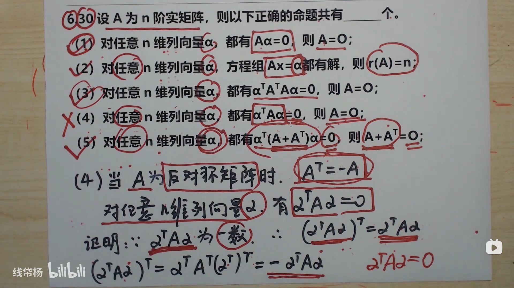
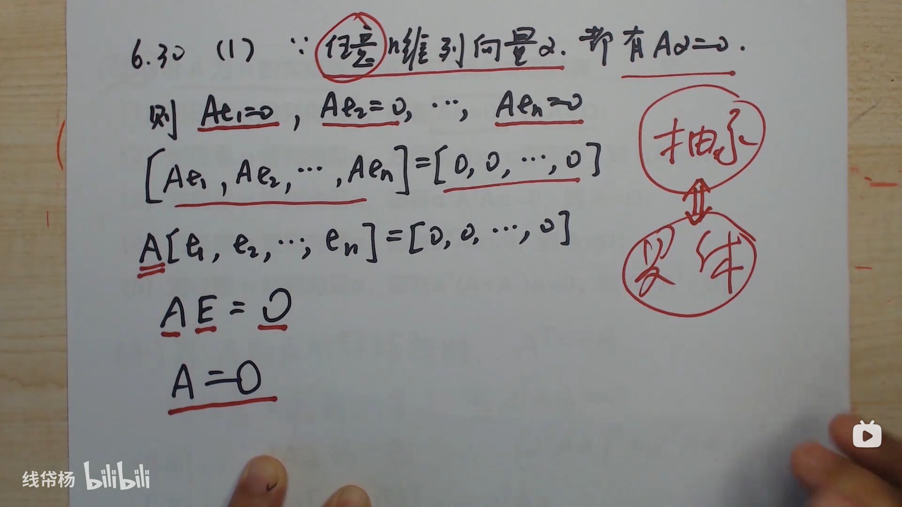
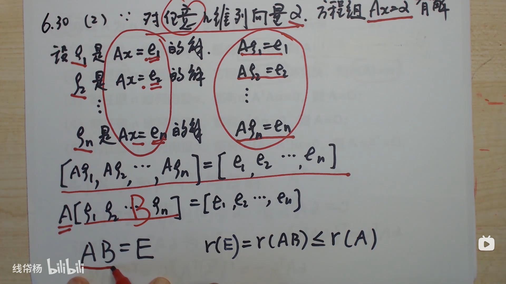
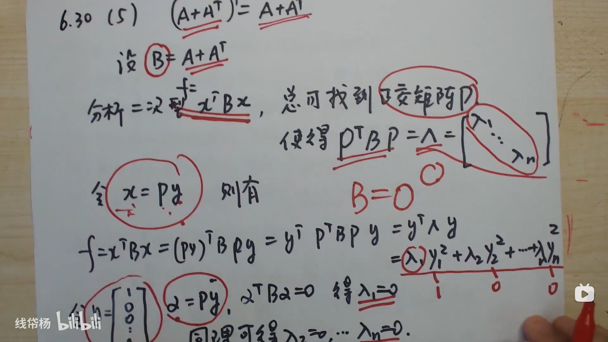

### [对任意α均有αTAα=0则A=O吗？](https://www.bilibili.com/video/BV1Lw4m1r7Gs/)

### AB 有公共特征向量

[判断A和B有公共特征向量——线帒杨25考研每日一题109_哔哩哔哩_bilibili](https://www.bilibili.com/video/BV1jE4m197oT/)

> 设 $A, B$ 均为 3 阶矩阵，$r(A+2E) = r(2B - E) = 1$, 且 $|A| = |B| = -8$ 则

- $A$ 不相似于对角化

 A 有三重特征值 -2 但是 $r (A+2 E) = 1 \Rightarrow s = n - r = 1 \Rightarrow$ A 不可相似对角化

$$
 -2 \times-2\times \lambda_{A3} = -8 \Rightarrow \lambda_{A3} = -2
  $$

- $B$ 可以相似于对角化

 $$
 -\frac{1}{2} \times -\frac{1}{2} \times \times \lambda_{B3} = -8 \Rightarrow \times \lambda_{B3} = -32
 $$

- $A, B$ 有公共特征向量
 $A, B$ 有公共特征向量 → A，B 有公共解

 $$
 \begin{bmatrix}
 A + 2E \\
 B - \frac{1}{2}E
 \end{bmatrix} x = 0 \quad \cdots (1)
 $$

 $$
 r \left[
 \begin{bmatrix}
 A + 2E \\
 B - \frac{1}{2}E
 \end{bmatrix}
 \right] \leq r(A + 2E) + r(B - \frac{1}{2}E) = 2 < 3
 $$

 因此方程组有非零解向量

 $$
 \Rightarrow (A + 2E)x = 0 \quad \text{与} \quad (B - \frac{1}{2}E)x = 0 \quad \text{有公共非零解向量}
 $$

- $A+4B$ 为不可逆矩阵

 设 $\alpha$ 是（1）中的非零解向量

 $$
 A \alpha = -2 \alpha \quad \quad B \alpha = \frac{1}{2} \alpha
 $$

 $$
 \Rightarrow (A + 4B) \alpha = -2\alpha + 2\alpha = 0
 $$

 因此，方程组 $(A + 4B)x = 0$ 有非零解，$\Rightarrow A + 4B$ 不可逆

 ---

 $$r(A+4B) \le r(A+2E) + r(2B - E) = 2 < 3$$

### 设 $A$ 为 3 阶正交矩阵，$A^3 = E$，$\alpha$，$\beta$ 为非零向量，且 $\alpha$、$A\alpha$、$A^2\alpha$ 线性相关，$\beta$ 与 $\alpha$、$A\alpha$、$A^2\alpha$ 线性无关，且 $\beta^T \alpha = \beta^T A\alpha = \beta^T A^2 \alpha = 0$，则（）

A. $\beta$ 与 $A\beta$、$A^2\beta$ 均正交

B. $\beta$ 与 $A\beta$ 正交，不与 $A^2 \alpha$ 正交

C. $A \beta$ 与 $\alpha$、$A\alpha$ 均正交

D. $A \beta$ 与 $\alpha$ 正交，不与 $A^2 \alpha$ 正交

#### 解析

##### 题目分析

1. **矩阵 $A$ 的性质**：
   - $A$ 为 3 阶正交矩阵，且 $A^3 = E$，说明 $A$ 的逆矩阵等于 $A^2$（因为 $A^2 = A^{-1}$），即 $A^3 = E$
   - 因为 $A$ 是正交矩阵，所以它的列向量和行向量均正交，且模为 1

2. **向量线性相关性**：
   - 由题意，$\alpha$、$A\alpha$、$A^2\alpha$ 线性相关，且 $\beta$ 与它们线性无关，因此 $\alpha$、$A\alpha$、$A^2\alpha$ 形成了一个平面，$\beta$ 垂直于这个平面

3. **正交性分析**：
   - $\beta$ 与 $\alpha$、$A\alpha$、$A^2\alpha$ 正交，说明 $\beta$ 与 $\alpha$ 张成的平面正交
   - 由于 $A$ 是正交矩阵，所以 $A\beta$ 也与这个平面正交

##### 选项分析

- **A 选项**：$\beta$ 与 $A\beta$、$A^2\beta$ 均正交。这不成立，因为 $A\beta$ 与 $\beta$ 不一定正交

- **B 选项**：$\beta$ 与 $A\beta$ 正交，但不与 $A^2\alpha$ 正交。这不成立，$\beta$ 与 $A\alpha$ 和 $A^2\alpha$ 都是正交的

- **C 选项**：$A\beta$ 与 $\alpha$、$A\alpha$ 均正交。此选项正确，因为 $A\beta$ 与 $\alpha$ 张成的平面正交

- **D 选项**：$A\beta$ 与 $\alpha$ 正交，但不与 $A^2\alpha$ 正交。这与条件矛盾

##### 结论

正确答案是 **C. $A\beta$ 与 $\alpha$、$A\alpha$ 均正交**

### 设 $\alpha$、$\beta$ 为 $n$ 维列向量，$A = E - k_1 \alpha \beta^T$，$k_1 \neq 0$，且 $\alpha \beta^T \neq \frac{1}{k_1}$，证明：$A$ 可逆，且 $A^{-1} = E - k_2 \alpha \beta^T$，其中 $\beta^T \alpha = \frac{1}{k_1} + \frac{1}{k_2}$

#### 解析

##### 1. 矩阵 $A$ 的形式

矩阵 $A$ 的形式为：

$$
A = E - k_1 \alpha \beta^T
$$

其中，$E$ 是 $n$ 阶单位矩阵，$\alpha$ 和 $\beta$ 是 $n$ 维列向量，$k_1$ 是非零常数

##### 2. 假设逆矩阵的形式

假设矩阵 $A$ 的逆矩阵形式为：

$$
A^{-1} = E - k_2 \alpha \beta^T
$$

其中，$k_2$ 是一个待定的常数

##### 3. 计算 $A \cdot A^{-1}$

计算 $A \cdot A^{-1}$ 并展开：

$$
A \cdot A^{-1} = (E - k_1 \alpha \beta^T)(E - k_2 \alpha \beta^T) = E - k_2 \alpha \beta^T - k_1 \alpha \beta^T + k_1 k_2 \alpha (\beta^T \alpha) \beta^T
$$

简化：

$$
= E - (k_1 + k_2) \alpha \beta^T + k_1 k_2 (\beta^T \alpha) \alpha \beta^T
$$

##### 4. 使其等于单位矩阵

为了使 $A \cdot A^{-1} = E$，需要满足：

$$

- (k_1 + k_2) \alpha \beta^T + k_1 k_2 (\beta^T \alpha) \alpha \beta^T = 0
$$

得到：

$$
k_1 + k_2 = k_1 k_2 \cdot (\beta^T \alpha)
$$

因此：

$$
\beta^T \alpha = \frac{1}{k_1} + \frac{1}{k_2}
$$

##### 5. 可逆性结论

由于 $k_1 \neq 0$ 且 $\alpha \beta^T \neq \frac{1}{k_1}$，因此 $k_2$ 是非零常数，矩阵 $A$ 可逆，且逆矩阵为：

$$
A^{-1} = E - k_2 \alpha \beta^T
$$

## Jordan 标准型

> 对于 $n$ 阶矩阵：

- **可对角化的充要条件**是拥有 $n$ 个线性无关的特征向量，即每个特征值的几何重数等于代数重数。
- **不可对角化的充要条件**是存在线性无关特征向量的数量少于 $n$，即存在特征值的几何重数小于其代数重数。

矩阵相似无论是否可以对角化，取决于是否存在相同的对角形或若尔当形；对角化或若尔当形的结构完全由特征值、特征值的代数重数和几何重数（无关向量的个数）所决定。

因此，两矩阵相似的充要条件是：
- **特征值相同**；
- **对应特征值的代数重数相同**；
- **对应特征值的无关向量个数（几何重数）相同**。

### 特殊情况

以上结论适用于以下两种情况：
1. 三阶及以下矩阵；
2. 所有特征值的代数重数不超过 3 的矩阵。

在这类矩阵中，若存在特征值的几何重数小于代数重数，则该矩阵不可对角化，但与一个若尔当标准形相似。

### 若尔当块构造

将特征值排列在对角线上（相同的特征值排列在一起），对于几何重数小于代数重数的特征值，在相应特征值所在的对角块上方或下方补 1：

$$
\begin{pmatrix}
\lambda_1 & 1 & 0 & \cdots & 0 \\
0 & \lambda_1 & 1 & \cdots & 0 \\
0 & 0 & \lambda_1 & \cdots & 0 \\
\vdots & \vdots & \vdots & \ddots & 1 \\
0 & 0 & 0 & \cdots & \lambda_1
\end{pmatrix}
$$

$$ \begin{pmatrix} a & 1 \\ 0 & a \end{pmatrix}, \quad \begin{pmatrix} a & 1 & 0 \\ 0 & a & 1 \\ 0 & 0 & a \end{pmatrix}, \quad \begin{pmatrix} b & 0 \\ 0 & b \end{pmatrix} $$

- 第一个矩阵表示特征值为 $a$ 的情况，重数为 2 但仅有 1 个无关特征向量；
- 第二个矩阵表示特征值为 $a$ 的情况，重数为 3 但仅有 1 个无关特征向量；
- 第三个矩阵表示特征值为 $b$ 的情况，重数为 2 且有 2 个无关特征向量，因此可以对角化。

## 反解 A

### 向量法

### 矩阵法

## 方程组法

### 秩

### 秩 + 方程组

