> [! ] 消元的本质是投影
> 消元的过程是将一个向量投影到另一个向量上，使得向量的某个分量为 0

- 克拉默法则
  - 例子：对于方程组 $Ax = b$，如果 $A$ 是一个 $3 \times 3$ 的矩阵，且 $\det(A) \neq 0$，则可以用克拉默法则求解 $x$

## 行列式

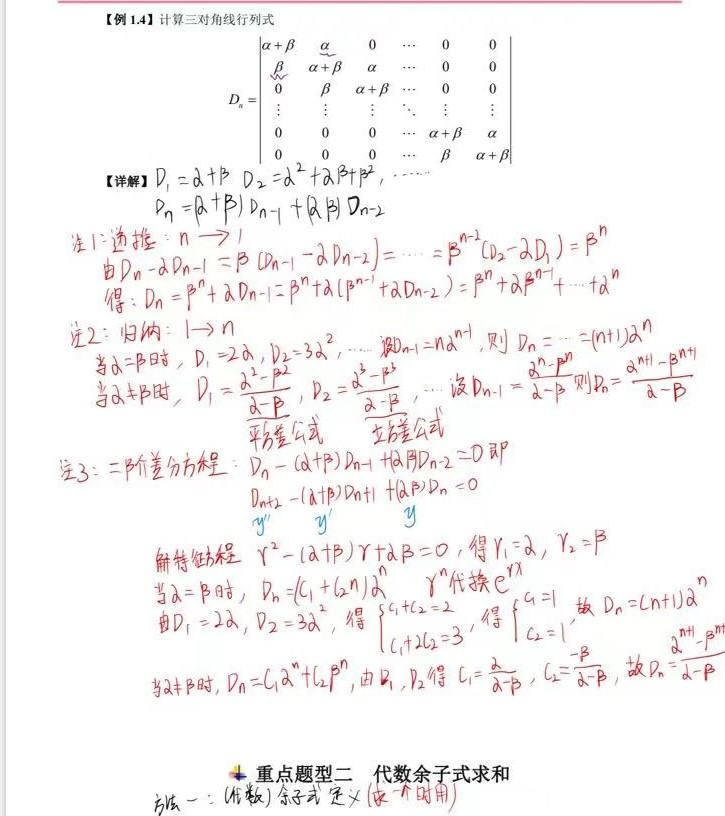

## 求逆

## 代数余子式

### $a_{ij} = A_{ij}$ 结论

设 A 是 3 阶非零矩阵，则

$$
a_{ij} = A_{ij} \iff A^T = A \iff A^T A = E (A \text{正交}) \implies |A| = 1
$$

$$
a_{ij} = -A_{ij} \iff A^T = -A \iff A^T A = E (A \text{正交}) \implies |A| = -1
$$

**【余子式】** $M_{ij}$:

$$
|A| \text{中去掉第} i \text{行第} j \text{列元素后的} n-1 \text{阶子式}
$$

**【代数余子式】** $A_{ij}$:

$$
A_{ij} = (-1)^{i+j} M_{ij}
$$

### 行列式

- 大 A 配小 a，逆用展开式
- 大 A 配小 k，k 把小 a 吃

### 矩阵

当 $\left| A \right| \neq 0$ 时，$A^{-1} = \frac{1}{|A|} A^{*}$，即可以求任一 $A_j$ 或行和、列和及：$\sum_{i=1}^{n} \sum_{j=1}^{n} A_{ij}$

### 特征值

- |A|中所有元素的代数余子式之和为 $A^{*}$ 的元素之和
- A 为 3 阶可逆方阵，特征值为 $\lambda_{1},\lambda_{2},\lambda_{3}$

$$
|\lambda E-A| = \lambda^3 - tr(A) \lambda^2 +  tr(A^{*}) \lambda - |A|
$$

$$
A_{11} + A_{22} + A_{33} = tr(A^{*}) = \lambda_1 \lambda_2 + \lambda_1 \lambda_3 + \lambda_2 \lambda_3 = \lambda_1^{*} + \lambda_2^{*} + \lambda_3^{*}
$$

### 分块矩阵

给定矩阵 $A = (a_{ij})_{3 \times 3}$，$A_j$ 是 $a_j$ 的代数余子式，则：

 $$
 \left|
 \begin{matrix}
 a_{11} - a_{21} & a_{12} - a_{22} & a_{13} - a_{23} \\
 a_{21} - a_{31} & a_{22} - a_{32} & a_{23} - a_{33} \\
 a_{31} - a_{11} & a_{32} - a_{12} & a_{33} - a_{13}
 \end{matrix}
 \right| = \sum_{j=1}^{3} A_j
 $$

- $\left| A + \beta \alpha^T \right| = \left| A \right| + b \sum_{j=1}^{3} A_{ij}$

  $$
    A + \beta \alpha^T =
    \begin{bmatrix}
    b \\
    b \\
    b
    \end{bmatrix}
    \quad
    [1, 1, 1]
  $$

- $\left| A + x y^T \right| = \left| A \right| + \sum_{j=1}^{3} A_{ij} \cdot x_i \cdot y_j$

    $$
    A + x y^T =
    \begin{bmatrix}
    x_1 \\
    x_2 \\
    x_3
    \end{bmatrix}
    \quad
    [y_1, y_2, y_3]
    $$

## 矩阵运算 [基础30讲 P23]()

- 相等、加法、数乘
  - 交换律 A + B = B + A
  - 结合律 A + (B + C) = (A + B) + C
  - 分配律 k(A + B) = kA + kB、(k + l)A = kA + lA、k(lA) = (kl)A
- 矩阵乘法
  - 结合律 A(BC) = (AB)C
  - 分配律
    - A (B + C) = AB + AC
    - (A + B) C = AC + BC
  - 不满足交换律 AB ≠ BA
    - AB = 0 时，A 和 B 不一定为零矩阵
    - AB = AC 时，B 和 C 不一定相等
  - 数乘结合律 k(AB) = (kA)B = A(kB)

#### 矩阵的三大运算 $(T、-1、{*})$

> [! ] **矩阵的三大运算 $(T、-1、{*})$ 可交换运算顺序**

#### 可逆

- $A^{-1}A = AA^{-1} = E$
- $(A^{-1})^{-1} = A$
- $(AB)^{-1} = B^{-1}A^{-1}$
- $kA^{-1} = (kA)^{-1} = \frac{1}{k}A^{-1}, k \neq 0$
- $A^{-1} = \frac{1}{|A|}A^{*}$ ($A$ 为可逆矩阵)
- $(A^T)^{-1} = (A^{-1})^T$
- $(A^*)^{-1} = (A^{-1})^*$

#### 转置

- $(A^T)^T = A$
- $(A + B)^T = A^T + B^T$
- $(kA)^T = kA^T$
- $(AB)^T = B^T A^T$

#### 伴随

A 为三阶可逆方阵，其特征值为 $λ_1, λ_2, λ_3$
$A$ 的伴随矩阵为 $A^{*}$，其特征值为 $λ_2λ_3, λ_1λ_3, λ_1λ_2$

- $A A^{*} = |A|E$
- $|A^{*}| = |A|^{n-1}$
- $(A^{*})^{*} = |A|^{n-2}A$
- $(kA)^{*} = k^{n-1}A^{*} \quad (-A)^{*} = (-1)^{n-1}A^{*}$
- $(A^{*})^{-1} = \frac{1}{|A|}A$
- $(A^{*})^T = |A|^{n-2}A^T$
- $|(A^{*})^{{*}}| = |A|^{(n-1)^2}$
- $(AB)^{*} = B^{*} A^{*}$

## 三阶秩 2 矩阵

### 几何意义

- 两两无关，三个相关
- 其中两个向量共面，第三个向量不在这个平面上

#### 例子

向量 $a = [1, 0, 0]^T$，$b = [0, 1, 0]^T$ 和 $c = [1, 1, 1]^T$，其中 $a$ 和 $b$ 共面，$c$ 不在这个平面上。

- 秩为 2 的三阶矩阵表示其列向量（或行向量）中有两个是线性无关的，第三个向量可以由这两个向量线性表示。
- 这种矩阵的行列式为 0，因为其列向量（或行向量）是线性相关的。

## 三阶秩 1 矩阵

### 几何意义

- 所有列向量（或行向量）都在同一条直线上，即所有列向量（或行向量）都是线性相关的。

1. **$r(A) = 1 \iff A$ 可表示为 $αβ^T$**
（其中 $α, β$ 是 n 维非零列向量，此时 $tr(A) = (α, β)$）

2. **$r(A) = 1 \Rightarrow A^n = [tr(A)]^{n-1} A$**，其中 $tr(A) = β^T α$

3. **$r(A) = 1 \Rightarrow A$ 的所有特征值为 $tr(A), 0, \ldots, 0$**（共 $n-1$ 个零特征值）

4. **对角化条件**：
   - 当 $tr(A) = 0$ 时，$A$ 不可对角化。
   - 当 $tr(A) \neq 0$ 时，$A$ 可以对角化。

## 初等变换的逆变换

| **矩阵**     | **意义**                                            | **逆**                                  | **行列式**                                | **伴随**                |
| ------------ | ---------------------------------------------------- | --------------------------------------- | ----------------------------------------- | ----------------------- |
| $E_{i,j}$    | 交换第 $i$ 行与第 $j$ 行（或交换第 $i$ 列与第 $j$ 列）| $(E_{i,j})^{-1} = E_{i,j}$             | $\lvert E_{i,j} \rvert = -1$             | $-E_{i,j}$              |
| $E_{i}(k)$   | 第 $i$ 行（或第 $i$ 列）乘以非零常数 $k$               | $\left(E_{i}(k)\right)^{-1} = E_{i}\left(\frac{1}{k}\right)$ | $\lvert E_{i}(k) \rvert = k$，$k \neq 0$ | $k E_{i}\left(\frac{1}{k}\right)$ |
| $E_{j}(c)$   | 第 $i$ 行的 $c$ 倍加到第 $j$ 行（或第 $i$ 列的 $c$ 倍加到第 $j$ 列）| $\left(E_{j}(c)\right)^{-1} = E_{j}(-c)$ | $\lvert E_{j}(c) \rvert = 1$             | $E_{j}(c)$              |

[基础30讲 P34]()

### 1. 行交换变换（交换矩阵的两行或列）

**逆变换**：$E_{ij}^{-1} = E_{ij}$

$$
A = \begin{pmatrix}
0 & 1 & 0 \\
1 & 0 & 0 \\
0 & 0 & 1
\end{pmatrix},
\quad
A^{-1} = \begin{pmatrix}
0 & 1 & 0 \\
1 & 0 & 0 \\
0 & 0 & 1
\end{pmatrix}
$$

### 2. 行（列）乘以一个非零常数

**逆变换**：$[E_{i}(k)]^{-1} = E_{i}\left(\frac{1}{k}\right)$

$$
A = \begin{pmatrix}
1 & 0 & 0 \\
0 & 2 & 0 \\
0 & 0 & 1
\end{pmatrix},
\quad
A^{-1} = \begin{pmatrix}
1 & 0 & 0 \\
0 & \frac{1}{2} & 0 \\
0 & 0 & 1
\end{pmatrix}
$$

### 3. 行（列）加上另一行（列）的倍数

**逆变换**：$[E_{ij}(k)]^{-1} = E_{ij}(-k)$

$$
A = \begin{pmatrix}
1 & 0 & 0 \\
0 & 1 & 0 \\
0 & 1 & 1
\end{pmatrix},
\quad
A^{-1} = \begin{pmatrix}
1 & 0 & 0 \\
0 & 1 & 0 \\
0 & -1 & 1
\end{pmatrix}
$$

### 多个初等变换的逆变换

当对矩阵进行多个初等变换时，其**逆变换的顺序**应当是这些初等变换的**逆序**。若对矩阵依次施加变换 $E_1, E_2, \ldots, E_n$，那么逆变换的顺序应该是：$$ E_n^{-1}, E_{n-1}^{-1}, \ldots, E_1^{-1} $$

## 分块矩阵

## $AB = 0 ,B^TA^T=0$

设 $A_{m \times n}$, $B_{n \times l}$，满足 $A_{m \times n} B_{n \times l} = 0_{m \times l}$，则有以下结论：

### 一、$B$ 的列向量都是 $Ax = 0$ 的解向量

### 二、秩的关系

$$

A_{m \times n} B_{n \times l} = A_{m \times n}
\begin{bmatrix}
s_1, s_2, \cdots, s_l
\end{bmatrix}
= \begin{bmatrix}
A_{m \times n}s_1, A_{m \times n}s_2, \cdots, A_{m \times n}s_l
\end{bmatrix}
= \begin{bmatrix}
0, 0, \cdots, 0
\end{bmatrix}

$$

- $B$ 的所有列向量都可以由 $A$ 的零空间中的向量线性组合得到
- 每个 $A$ 的零空间中的向量都被 $B$ 投影成零向量
- $r (A) + r (B) \leq n$ 其中 n 是 A 的列数也是 B 的行数

### 三、若 $A \neq 0$，则 $B$ 的行向量线性相关 $B^T x=0$ 有非零解

- **提示**:（2004 年考察过）

### 四、若 $B \neq 0$，则 $A$ 的列向量线性相关 $Ax=0$ 有非零解

- **提示**:（2004 年考察过）

### 五、$A$ 的任意一个行向量与 $B$ 的任意一个列向量正交

## 🌟AB = C C≠0

设 $A_{m \times n}$, $B_{n \times l}$, $C_{m \times l}$ 满足 $A_{m \times n} B_{n \times l} = C_{m \times l}$，则有以下结论：

### 一、$C$ 的列向量组可以由 $A$ 的列向量组线性表出

- **特别地**，当 $B$ 可逆时，$C$ 和 $A$ 的列向量组等价

### 二、$C$ 的行向量组可以由 $B$ 的行向量组线性表出

- **特别地**，当 $A$ 可逆时，$C$ 和 $B$ 的行向量组等价

#### 方阵的理解

$AB = C$，当 $A$ 可逆时，根据左行右列，相当于对 $B$ 进行行变换，而 $A$ 是可逆的，则该变换是初等变换，而初等行变换下的行向量等价

### 三、秩的关系

- 矩阵 $C$ 的列向量是 $B$ 的列向量在线性变换 $A$ 作用下得到的
- $r (A) = r (A, C) = r (A, AB)$

### 四、行空间秩的关系

> [! ] 竖拼右同多化零

- $r (B) = r\left ( \begin{pmatrix} B \\ C \end{pmatrix} \right) = r\left( \begin{pmatrix} B \\ AB \end{pmatrix} \right)$
- $r (A^TA) = r (AA^T) = r(A)$ 行等价可以直接替换
- $r (A) = r\left ( \begin{pmatrix} A^TA \\ B^TA \end{pmatrix} \right) \rightarrow r\left ( \begin{pmatrix} A \\ B^TA \end{pmatrix} \right) \rightarrow r\left ( \begin{pmatrix} A \\ 0 \end{pmatrix} \right)$

---

### 五、$A$ 列满秩时的性质

> [! ] 横拼左同多化零

1. $Bx = 0$ 与 $Cx = 0$ 同解
2. $r(B) = r(C) = r\left( \begin{pmatrix} B \\ C \end{pmatrix} \right)$
3. $C$ 和 $B$ 的行向量组等价

### 六、$B$ 行满秩时的性质

1. $A^T x = 0$ 与 $C^T x = 0$ 同解
2. $r(A) = r(C) = r(A, C)$
3. $C$ 和 $A$ 的列向量组等价

### 秩

$$

\text{rank}(C) = \text{rank}(AB) \leq \min\{\text{rank}(A), \text{rank}(B)\}

$$

- 当 $A$ 或 $B$ 是满秩矩阵时，乘积矩阵 $AB$ 的秩等于秩较低的那个矩阵
- 特别地，如果 $A$ 或 $B$ 是零矩阵，则 $AB$ 也是零矩阵

### 行向量与列向量的乘积

矩阵乘积 $AB$ 的每个元素 $c_{ij}$ 是矩阵 $A$ 的第 $i$ 行向量与矩阵 $B$ 的第 $j$ 列向量的内积：

$$

c_{ij} = \sum_{k=1}^{n} a_{ik} b_{kj}

$$

其中 $a_{ik}$ 表示矩阵 $A$ 的第 $i$ 行、第 $k$ 列的元素，$b_{kj}$ 表示矩阵 $B$ 的第 $k$ 行、第 $j$ 列的元素

## $A^T A = \Lambda$

$$

A^T A = \\
\begin{bmatrix}
\alpha_1^T \\
\alpha_2^T \\
\vdots \\
\alpha_n^T
\end{bmatrix}
\begin{bmatrix}
\alpha_1 & \alpha_2 & \cdots & \alpha_n
\end{bmatrix}

=

\begin{bmatrix}
1 & 0 & 0 & 0 \\
0 & 2 & 0 & 0 \\
0 & 0 & 3 & 0 \\
0 & 0 & 0 & 4
\end{bmatrix}

$$

$$\alpha_i^T \alpha_i = i$$

$$\alpha_i^T \alpha_j = 0 \ (i \neq j)$$

- $A^TA$ 与 E 合同
- $A^TEA = \Lambda$

## $A^TA$

- **对称性**：$A^TA \text{ 一定是对称矩阵}$

- **半正定性**：$x^T(A^TA)x \geq 0$

- **秩的性质**：$\text{rank}(A^TA) = \text{rank}(A)$

- **特征值**：
  - 如果 $A$ 的秩为 $r$，则 $A^TA$ 具有 $r$ 个正特征值，其余的特征值为 0
  - 如果 $A$ 是一个满秩矩阵（即 $\text{rank}(A) = n$，并且 $A$ 的列向量是线性无关的），则 $A^TA$ 是一个正定矩阵。正定矩阵的所有特征值都是正的。

- **迹的性质**：$$ tr(A^TA) \text{ 等于 } A \text{ 的列向量的内积的和} $$

## AB 与 BA 的关系

### 当 $AB = BA$ 时

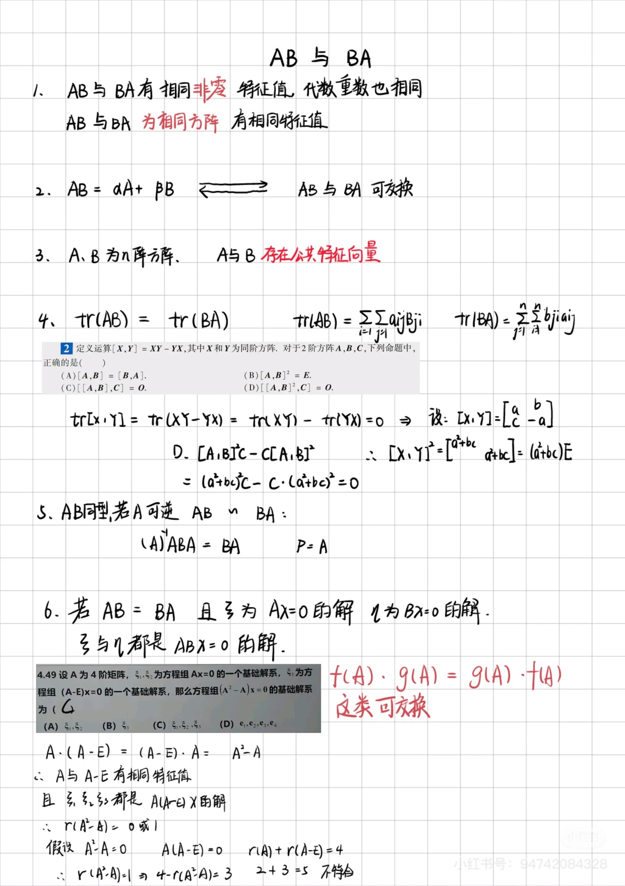

### 若 $AB = BA$，则 r (A+B) + r (AB) $\le$ r (A) + r (B)

### $A^T A$ 与 $A A^T$

### $AB = k_1 A + k_2 B$ 且 $k_1k_2≠0$

1. $(A - k_2 E)(B - k_1 E) = k_1 k_2 E$
2. $(B - k_1 E)(A - k_2 E) = k_1 k_2 E$
3. $A - k_1 E$ 可逆
4. $B - k_2 E$ 可逆
5. $AB = BA$

### AB = 0 研究 BAX = 0 的解

## 方程组和秩

### 部分向量组的秩不能直接相加，需要考虑矩阵的整体秩关系

设：

$$
\hat{A} = [\alpha_1, \alpha_2, \cdots, \alpha_n, \alpha], \quad \hat{B} = [\beta_1, \beta_2, \cdots, \beta_n, \beta]
$$

根据已知条件：

$$
r(\hat{A}) = r_1, \quad r(\hat{B}) = r_2 + 1
$$

由于矩阵的整体秩满足：

$$
r([\hat{A}, \hat{B}]) \leq r(A) + r(B)
$$

所以：

$$
r(\alpha_1, \alpha_2, \cdots, \alpha_n, \alpha, \beta_1, \beta_2, \cdots, \beta_n, \beta) = r \leq r_1 + r_2 + 1
$$

因此，结论为：

$$
r(\alpha_1, \alpha_2, \cdots, \alpha_n, \alpha, \beta_1, \beta_2, \cdots, \beta_n, \beta) = r_1 + r_2 + 1
$$

### $r(A|B) \leq r(A)$

设 $A$ 是 $m \times n$ 的实矩阵。对任意 $m$ 维列向量 $b$，线性方程组 $A^T A x = A^T b$ 的解情况如下：

对于任意 $m$ 维列向量 $b$，有：

$$
r([A^T A | A^T b]) = r(A^T A)
$$

因此：

$$
r([A^T A | A^T b]) \leq r(A^T) = r(A)
$$

又因为：

$$
r(A) = r(A^T A) \leq r([A^T A | A^T b])
$$

所以：

$$
r(A^T A) = r([A^T A | A^T b])
$$

由此可以得出：方程 $A^T A x = A^T b$ **有解**。

### $r(AB) \leq r(B)$

设 $A$ 是 $m \times n$ 矩阵，$B$ 是 $n \times s$ 矩阵：

1. 如果 $r(A) = n$（即 $A$ 满秩），则 $r(AB) = r(B)$。
2. 如果 $r(B) = n$（即 $B$ 满秩），则 $r(AB) = r(A)$。

> **注意：** 如果不满足等号成立的条件，则严格小于。

## 向量组和秩

[两个向量组等秩的条件（较难）——线帒杨25考研每日一题112_哔哩哔哩_bilibili](https://www.bilibili.com/video/BV1BjpweJEHh/)

1. **若存在实数 $k_1, k_2, \cdots, k_s$ 使得**：

   $$
   k_1 \alpha_1 + k_2 \alpha_2 + \cdots + k_s \alpha_s = \beta
   $$

   则称 $\beta$ 是 $\alpha_1, \alpha_2, \cdots, \alpha_s$ 的线性组合。

2. **线性组合的等价条件：**

   $$
   \beta \in \text{Span}(\alpha_1, \alpha_2, \cdots, \alpha_s) \Leftrightarrow r (\alpha_1, \alpha_2, \cdots, \alpha_s) = r (\alpha_1, \alpha_2, \cdots, \alpha_s, \beta)
   $$

3. **线性相关与无关的判断：**
   - 若 $\alpha_1, \alpha_2, \cdots, \alpha_s$ 线性无关，但 $\beta$ 可以由它们线性表示，则 $\alpha_1, \alpha_2, \cdots, \alpha_s, \beta$ 线性相关。

4. **向量组的秩比较：**
   - 若多数量向量可以由少数量向量线性表示，则多数量向量必线性相关。

5. **等秩的条件：**

   $$
   r(\alpha_1, \alpha_2, \cdots, \alpha_s, \beta_1, \beta_2, \cdots, \beta_r) = r(\beta_1, \beta_2, \cdots, \beta_r)
   $$

6. **线性相关与线性无关的推论：**
   - 线性无关的向量组的任意子集仍然线性无关。
   - 线性相关的向量组增加向量后仍然线性相关。

## 线性相关的充要条件

设 $\alpha_1, \alpha_2, \cdots, \alpha_s$ 是 $n$ 维向量，则它们线性相关的充要条件为：

$$
\exists \, k_1, k_2, \cdots, k_s \, \text{不全为 0} \quad \text{使得} \quad k_1 \alpha_1 + k_2 \alpha_2 + \cdots + k_s \alpha_s = 0
$$

这等价于齐次方程组存在非零解：

$$
A x = 0 \quad \text{有非零解} \Leftrightarrow r(\alpha_1, \alpha_2, \cdots, \alpha_s) < s
$$

## 向量组等价的条件

两个向量组 $(I)$ 和 $(II)$ 等秩的条件是：

$$
r((I)) = r((II)) = r((I), (II))
$$

但 **等秩不一定等价**，只有在向量组互为线性组合时才等价。

## 线性表示

## 秩不等式

1. $0 \leq r(A_{m \times n}) \leq \min \{m, n\}$
2. $r(kA) = r(A) \quad (k \neq 0)$
3. $r(A) = r(PA) = r(AQ) = r(PAQ) \quad (P, Q \text{为} m \times m \text{可逆矩阵})$
4. 若 $A$ 为 $m \times n$ 矩阵, $B$ 为 $n \times s$ 矩阵

   - 若 $r(A) = n$ (列满秩)，则 $r(AB) = r(B)$ 且 $ABX = 0, BX = 0$ 同解
   - 若 $r(B) = n$ (行满秩)，则 $r(AB) = r(A)$，$r(B^TA^T) = r(A^T)$ 且 $B^TA^TX = 0, A^TX = 0$ 同解

5. $r (AB) \leq \min \{r (A), r (B)\} \leq r([A, B]) \leq r(A) + r(B)$
6. $r(A + B) \leq r([A, B]) \leq r(A) + r(B)$
7. $r(E - AB) = r(E - BA) \quad (A, B \text{为} m \times n \text{矩阵})$
8. $r(E_{m} - A^T A) = r(E_{n} - AA^T) = m-n \quad (A \text{为} m \times n \text{矩阵})$
9. $r(A) + r(B) = r(A + AB) + r(E - AA^T) = r(B^T A^T)$
10. $r(AB) \geq r(A) + r(B) - n$ (A,B 分别为 m×n 和 n×m 矩阵)
11. $r(ABC) \geq r(AB) + r(BC) - r(B)$
12. $r(A) = r(A^T) = r(A A^T) = r(A^T A)$

13. $$
    r(A^*) =
    \begin{cases}
    n, & r(A) = n, \\
    1, & r(A) = n - 1, \\
    0, & r(A) < n - 1.
    \end{cases}
    $$

14. $Ax=0 \Rightarrow$ 基础解系中向量的个数为 $n-r(A)$
15. $Ax=b \Rightarrow$ 基础解系中向量的个数为 $n-r(A) + 1$
16. 若 $A^2 - (k_1 + k_2)A + k_3E = 0, k \neq E$, 则 $r(A - k_1 E) + r(A - k_2 E) = r(A)$
17. $r(I) = r(II) = r(I, II) \Leftrightarrow$ 向量组等价
18. 若 $A \sim \Lambda$, 则 $n_i = n - r(A - \lambda_i E)$, 其中 $n_i$ 为 $\lambda_i$ 的代数重数
19. 若 $A \sim \Lambda$, 则 $r(A)$ 等于非零特征值的个数, 重根按重数计算

## 几何意义 方程组的解空间

[线代9讲 P90]()
设 $\alpha_i = (a_i, b_i, c_i)^T$, $i = 1, 2, 3$, $\beta = (d_1, d_2, d_3)^T$，三个平面

$$

a_1 x + b_1 y + c_1 z + d_1 = 0,\quad a_2 x + b_2 y + c_2 z + d_2 = 0,\quad a_3 x + b_3 y + c_3 z + d_3 = 0

$$

两两相交成三条平行直线，则有：
$\text{(A)}\quad r(\alpha_1, \alpha_2, \alpha_3) = 1,\quad r(\alpha_1, \alpha_2, \alpha_3, \beta) = 2$
$\text{(B)}\quad r(\alpha_1, \alpha_2, \alpha_3) = 2,\quad r(\alpha_1, \alpha_2, \alpha_3, \beta) = 3$
$\text{(C)}\quad \alpha_1, \alpha_2, \alpha_3 \text{ 中任意两个线性无关，且 } \beta \text{ 不能由 } \alpha_1, \alpha_2, \alpha_3 \text{ 线性表示}$
$\text{(D)}\quad \alpha_1, \alpha_2, \alpha_3 \text{ 线性相关，且 } \beta \text{ 不能由 } \alpha_1, \alpha_2, \alpha_3 \text{ 线性表示}$

- 在书中 无解情况在秩的表达上面 还多了一个 " 且 " 的约束
  - A 错误
  - B 是必要条件
- $\beta$ 能不能被 $\alpha$ 线性表示
  - $\beta$ 能被 $\alpha$ 线性表示，即 有解 $r(A) = r(\overline{A})$
  - $\beta$ 不能被 $\alpha$ 线性表示，即 无解 $r(A) + 1 =  r(\overline{A})$
- $\alpha_1, \alpha_2, \alpha_3$ 任意两个线性无关：
  - 任意两个面都相交于一条直线
  - $r(A) = 2$ 表示 $A$ 的行向量（或列向量）中有两个是线性无关的
- $\alpha_1, \alpha_2, \alpha_3$ 任意两个线性相关：
  - 存在两个面线性相关
  - $r(A) = 2$

### 小结

- 无解：$r (A) ≠ r(\overline{A})$
- 仅有一个解：$r (A) = r (\overline{A}) = 3$
- 无穷多解：$r (A) = r (\overline{A}) < 3$

## 实对称矩阵的性质

1. **自反性：** $A = A^T$（实对称矩阵的转置仍是它本身）
2. **特征值为实数：** 实对称矩阵的所有特征值都是实数
3. **特征向量的正交性：**

- 不同特征值对应的特征向量是正交的
- 如果特征值不同，则特征向量组成的基是正交基

1. **对角化：** 实对称矩阵可以通过正交相似变换（即正交矩阵的相似变换）对角化
2. **正定性：**
   - 如果所有特征值均为正数，则矩阵是正定矩阵
   - 如果所有特征值均为非负数，则矩阵是半正定矩阵
   - 如果所有特征值均为负数，则矩阵是负定矩阵

## 反对称矩阵的性质

1. **反对称性：** $A = -A^T$（反对称矩阵的转置是其相反矩阵）
2. $a_{ij} = -a_{ji}$
3. **对角元为零：** 反对称矩阵的对角元 $a_{ii}$ 都为零
4. A+kE 为可逆矩阵（k≠0）
5. A+kE 只有零解（k≠0）结合 4 或者通过反证法证明
6. $\alpha ^T A \alpha = 0$ 转置一下代入 $A = -A^T$ 即可
7. **特征值为纯虚数或零：** 反对称矩阵的特征值要么是纯虚数，要么是零
8. **奇数阶行列式为零：** 奇数阶的反对称矩阵的行列式为零。|A|=-|A| 所以 |A|=0
9. **秩为偶数：** 偶数阶反对称矩阵的秩为偶数。*r (A) ≠ 1*
10. **解向量:** $\alpha$ 不是 Ax=0 的解向量则 $\alpha, A\alpha$ 线性无关。$A\alpha \ne 0$ 结合 6 $\alpha ^T A \alpha = 0$ 两个非零向量正交立即推两者线性无关

## 矩阵分解

任意实方阵 $A$ 都可以分解为一个对称矩阵和一个反对称矩阵的和：

$$

A = \frac{1}{2}(A + A^T) + \frac{1}{2}(A - A^T)

$$

其中，$\frac{1}{2}(A + A^T)$ 是对称矩阵，$\frac{1}{2}(A - A^T)$ 是反对称矩阵

## 正交矩阵的性质

1. **行与列正交：** 正交矩阵的行向量和列向量都是正交的

   - 即任意两行（或列）向量的内积为零

2. **单位向量：** 正交矩阵的行向量和列向量的模长均为 1

   - 因此，正交矩阵的行（或列）向量构成正交归一基

3. **保持内积不变：** 对任意向量 $\mathbf{x}$ 和 $\mathbf{y}$，有 $(Q\mathbf{x}) \cdot (Q\mathbf{y}) = \mathbf{x} \cdot \mathbf{y}$
4. **长度保持不变：** 对任意向量 $\mathbf{x}$，有 $\|Q\mathbf{x}\| = \|\mathbf{x}\|$
5. **行列式为 $\pm 1$：** 正交矩阵的行列式为 $\det(Q) = \pm 1$
   - 行列式为 1 时，是旋转矩阵
   - 行列式为 -1 时，是反射矩阵
6. **逆矩阵为转置矩阵：** 正交矩阵的逆矩阵等于其转置矩阵，即 $Q^{-1} = Q^T$
7. **保持几何性质：** 正交矩阵的变换保持几何图形的形状、面积和角度

## 方程组解的问题

### $A^TAx = 0$ 与 $Ax = 0$ 同解

*证明：*
 **$A x = 0$ 的解是 $A^T A x = 0$ 的解**：
   $Ax = 0$ 两边左乘 $A^T$，得到：$A^T A x = A^T 0 = 0$
   所以，$x$ 也是 $A^T A x = 0$ 的解

**$A^T A x = 0$ 的解是 $Ax = 0$ 的解**：
   $A^T A x = 0$ 左乘 $x^T$，得到：$x^T A^T A x = (A x)^T (A x) = \|Ax\|^2 = 0$
   由于 $\|Ax\|^2 = 0$ 表示 $Ax = 0$，所以 $x$ 也是 $Ax = 0$ 的解
   所以，$A^T A x = 0$ 和 $A x = 0$ 的解集是相同的
   所以 $r(A) = r(A^T) = r(A^TA) = r(AA^T)$

### $Ax=0$ 与 $A^{\ast}x=0$ 有非零公共解的充要条件是 $tr(A^{\ast})=0$

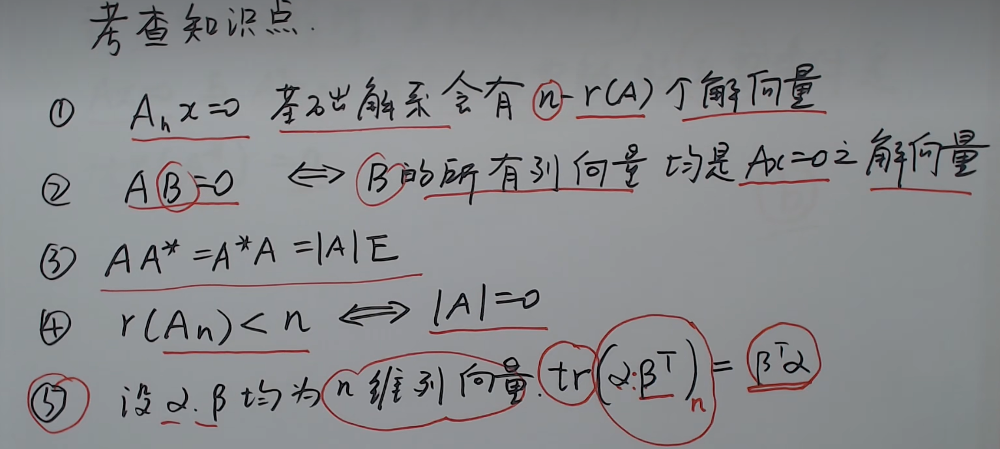
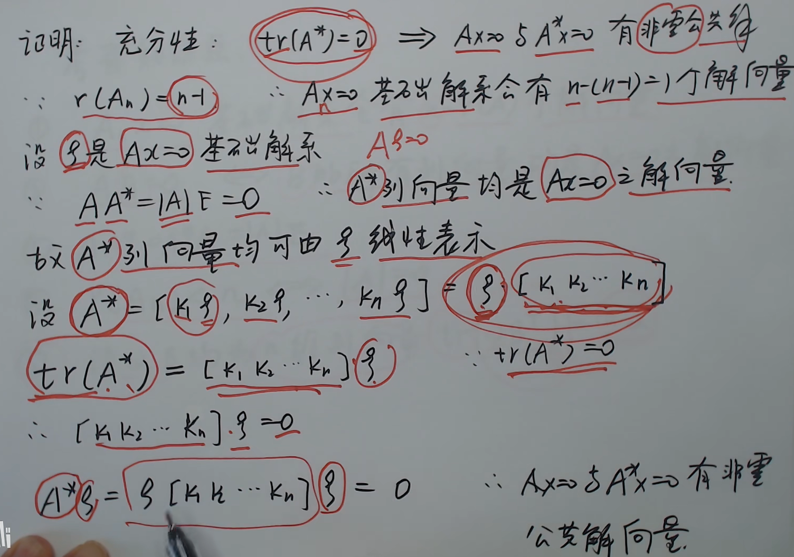
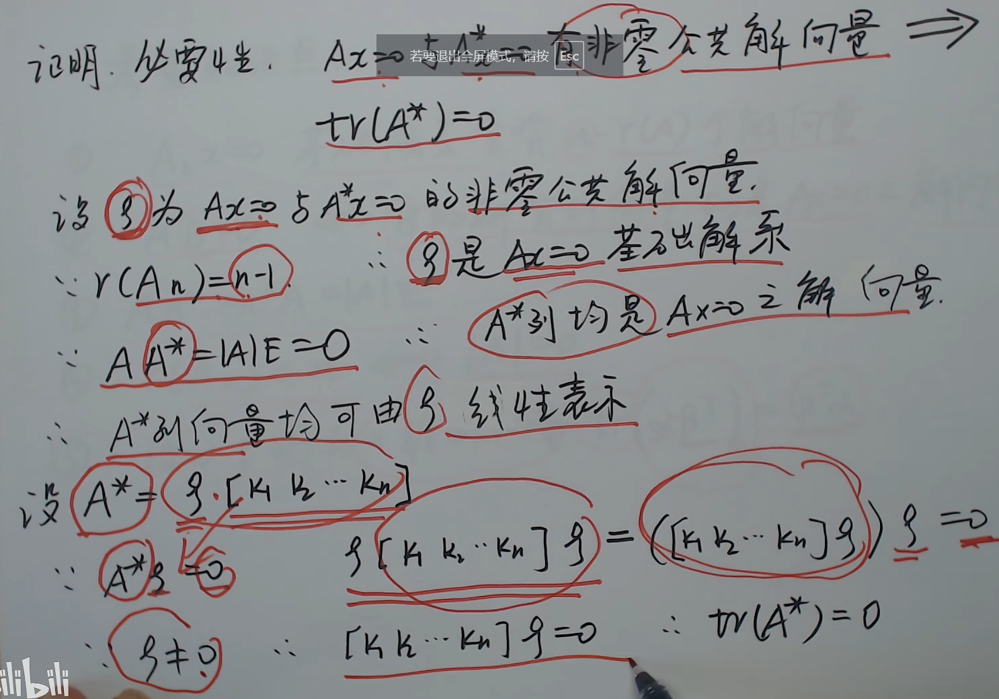

[900 方程组C类2.3题](#)

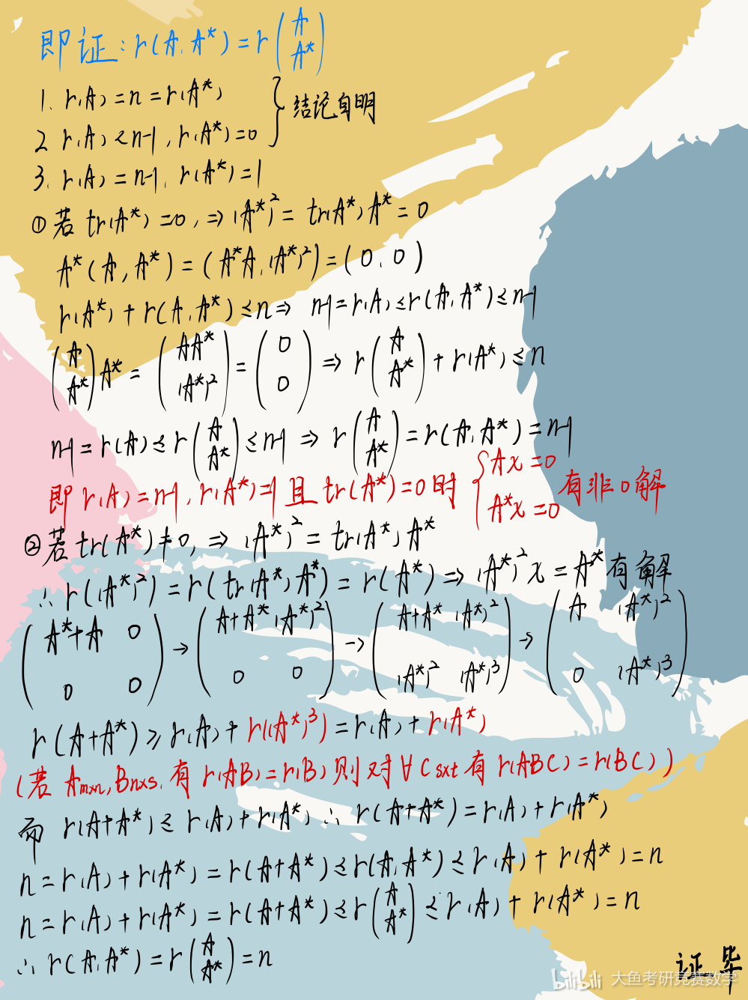

## 同解问题

## 特征值、特征向量

- 特征值之和=迹 $\lambda_1 + \lambda_2 + \cdots + \lambda_n = \text{tr}(A) = \sum_{i=1}^{n} a_{ii}$
- 特征值之积=行列式 $\lambda_1 \lambda_2 \cdots \lambda_n = |A| = \text{det}(A)$
- 特征值之差=代数余子式 $\lambda_1 - \lambda_2 + \cdots + (-1)^{n-1} \lambda_n = \sum_{i=1}^{n} (-1)^{i-1} A_{ii}$

- 不同特征值对应的特征向量是线性无关的
- k 重特征值对应的特征向量个数不超过 k 个
- 同一特征值的特征向量组合还是特征向量
- 特征值的代数重数大于等于几何重数
- 不同特征值的特征向量组合不是 A 的特征向量

### 相关考法

1. **特征值与特征向量的定义与判断**
   - 若 $n$ 阶矩阵 $A$ 满足 $A\alpha = \lambda \alpha$（$\alpha \neq 0$），则：
     - $\alpha$ 是 $A$ 的属于特征值 $\lambda$ 的特征向量。

   - $b/a$ 是 $A$ 的特征值 $\iff |aA - bE| = 0$（$a \neq 0$）。

   - $\lambda_0$ 不是 $A$ 的特征值 $\iff |A - \lambda_0 E| \neq 0$。

   - 0 是 $A$ 的特征值 $\iff |A| = 0$。

   - 0 不是 $A$ 的特征值 $\iff |A| \neq 0$。

2. **方程组与特征向量的判定**
   - 若方程组 $(A - \lambda_0 E)x = 0$ 有非零解，则 $\lambda_0$ 是矩阵 $A$ 的特征值，且该方程组的非零解向量就是矩阵 $A$ 属于 $\lambda_0$ 的特征向量。

3. **特征向量的线性组合性质**
   - 设 3 阶矩阵 $A = (\alpha_1, \alpha_2, \alpha_3)$，若存在 $k_1, k_2, k_3$ 使 $k_1 \alpha_1 + k_2 \alpha_2 + k_3 \alpha_3 = 0$，则非零向量 $(k_1, k_2, k_3)^T$ 是矩阵 $A$ 属于特征值 0 的特征向量。

   - 若 $(k_1, k_2, k_3)^T \neq 0$，则其为 $A$ 属于特征值 1 的特征向量。

4. **矩阵外积与特征值**
   - 若 $\alpha, \beta$ 均为 $n$ 维非零列向量，且：

     $$
     A = \alpha \beta^T
     $$

     则 $\alpha$ 是矩阵 $A$ 属于特征值 $\beta^T \alpha$（或 $\alpha^T \beta$）的特征向量。

5. **特殊外积形式矩阵的特征值判定**
   - 若 $\alpha, \beta$ 均为非零列向量，且 $\alpha$ 和 $\beta$ 正交：

     $$
     A = \alpha \alpha^T + \beta \beta^T
     $$

     则 $\alpha$ 和 $\beta$ 均是 $A$ 的特征向量。

   - 若 $\alpha, \beta$ 为单位交叉列向量：

     $$
     A = \alpha \beta^T + \beta \alpha^T
     $$

     则 $\alpha + \beta$ 是 $A$ 属于特征值 1 的特征向量，$\alpha - \beta$ 是 $A$ 属于特征值 -1 的特征向量。

6. **特征值的缩放性质**
   - 若 $\alpha = k \beta$，且：

     $$
     A \beta = k \alpha, \quad \alpha + \beta \neq 0, \quad \alpha - \beta \neq 0
     $$

     则 $\alpha + \beta$ 是 $A$ 属于 $k$ 的特征向量，而 $\alpha - \beta$ 是 $A$ 属于 $-k$ 的特征向量。

7. **特征向量之间的线性关系与矩阵性质**
   - 若两个向量 $\alpha, \beta$ 线性相关（$\alpha \neq 0$），则 $\alpha$ 是 $A$ 的特征向量 $\iff$ $\beta$ 也是 $A$ 的特征向量。

8. **矩阵类型与特征值性质**
   - **三角矩阵**：对角线元素为特征值。
   - **对称矩阵**：对称矩阵的特征值与其对角线元素相同。
   - **幂零矩阵**：若 $A^k = O$，则所有特征值均为 0。

9. **幂零矩阵的进一步判定**
   - 若 $A$ 为幂零矩阵，且 $A^k = O$，则 $A$ 的特征值全为 0。

10. **矩阵的特征值运算与等价关系**

    - 若 $A$ 和 $B$ 相似，则 $A$ 和 $B$ 具有相同的特征值。

    - 若 $AP = PB$，且 $P$ 为可逆矩阵，则 $A$ 和 $B$ 具有相同特征值。

11. **方程组解的线性关系与特征值计算**

    - 例如：已知方程组 $Ax = b$ 的解为 $x = (-2,2,1)^T + k(-6,3,0)^T$，
      - 则解向量 $(-6,3,0)^T$ 与向量 $(-2,1,-2)^T$ 线性相关，说明 $(-2,1,-2)^T$ 是矩阵 $A$ 的属于特征值 -3 的特征向量。

### 若已知矩阵 $A$ 的特征值 $\lambda$ 与其对应的特征向量 $\alpha$，则下列矩阵的特征值与其对应的特征向量的关系有

| A         | $P^{-1}AP$  | $aA + bE$      | $f(A)$       | $A^{-1}$            | $A^{*}$                 | $A^{T}$   |
| --------- | ----------- | -------------- | ------------ | ------------------- | ----------------------- | --------- |
| $\lambda$ | $\lambda$   | $a\lambda + b$ | $f(\lambda)$ | $\frac{1}{\lambda}$ | $\frac{\|A\|}{\lambda}$ | $\lambda$ |
| $\xi$     | $P^{-1}\xi$ | $\xi$          | $\xi$        | $\xi$               | $\xi$                   | 不确定       |

- $(A-\lambda E) x = 0$ 与 $(A^T-\lambda E) x = 0$ 的解没有必然联系，所以对应特征向量不一定相同

### 秩与特征值重数的关系

#### 情况一：矩阵 $A_n$ 相似对角化

1. **秩与零特征值的关系：**
   - 若 $\text{rank}(A_n) = r < n$，则 0 是 $A$ 的 $n-r$ 重特征值

2. **秩与重复特征值 $k$ 的关系：**
   - 若 $\text{rank}(A_n - kE_n) = r < n$，则 $k$ 是 $A$ 的 $n-r$ 重特征值

3. **非零特征值的个数：**
   - 若 $\text{rank}(A_n) = r$，则 $A$ 的非零特征值的个数为 $r$

#### 情况二：矩阵 $A_n$ 不知能否相似对角化

1. **秩与零特征值的关系：**
   - 若 $\text{rank}(A_n) = r < n$，则 0 是 $A$ 的 **至少** $n-r$ 重特征值

2. **秩与重复特征值 $k$ 的关系：**
   - 若 $\text{rank}(A_n - kE_n) = r < n$，则 $k$ 是 $A$ 的 **至少** $n-r$ 重特征值

3. **非零特征值的个数：**
   - 若 $\text{rank}(A_n) = r$，则 $A$ 的非零特征值的个数 **小于等于** $r$

### 知二求一

- $\beta_{1} = (1,0,-1)^T$
- $\beta_{2} = (-1,0,1)^T$

$$

\beta_{3} = \beta_{1} \times \beta_{2} = \begin{vmatrix} \mathbf{i} & \mathbf{j} & \mathbf{k} \\ 1 & 0 & -1 \\ -1 & 0 & 1 \end{vmatrix} = (0,2,0)^T

$$

### 知一求二

- $\beta_{1} = (1,0,-1)^T$

$$

\beta_{1} \cdot \beta_{2} = 0

$$

$$

\beta_{3} = \beta_{1} \times \beta_{2}

$$

### 施密特（Schmidt）正交化

$\alpha_2$ 在 $\alpha_1$ 的投影向量为

$$\alpha_1 \cos \theta = \frac{\alpha_1 \cdot \alpha_2}{\alpha_1 \cdot \alpha_1} \alpha_1 = \frac{\alpha_1^T \alpha_2}{\alpha_1^T \alpha_1} \alpha_1$$

- 过程：

$$\beta_1 = \alpha_1$$

$$\beta_2 = \alpha_2 - \frac{\alpha_1^T \alpha_2}{\alpha_1^T \alpha_1} \alpha_1$$

$$\beta_3 = \alpha_3 - \frac{\beta_{1}^T \alpha_3}{\beta_{1}^T \beta_{1}} \beta_{1} - \frac{\beta_2^T \alpha_3}{\beta_2^T \beta_2} \beta_2$$

> [! ] 本质：存在 $\beta_{3} = k_1 \alpha_{1} + k_{2}\alpha_{2}$ 与 $\beta_{1},\beta_{2}$ 都正交

#### 另一理解

对于 $\beta_{3}$ 可以通过找到 $\beta_{1}x = 0$ 和 $\beta_{2}x=0$ 的齐次同解

$$

\begin{pmatrix}
  \beta_1^T \\
  \beta_2^T
\end{pmatrix} \cdot \beta_{3} = 0

$$

反解 $\beta_{3}$ 即可

## 向量空间

| 求基 $\alpha$ 到基 $\beta$ 的过渡矩阵                       | $AC = B \Rightarrow C = A^{-1} B$   $(A\|B) \rightarrow (E\|A^{-1} B)$ |
| -------------------------------------------------- | ------------------------------------------------------------------------- |
| 求向量 $\beta$ 在基底 $\alpha$ 下的坐标 $(x_1 \cdots x_n)^T$ | 相当于解方程组：$x_1 \alpha_1 + x_2 \alpha_2 + x_3 \alpha_3 = \beta$              |
| 求向量在两组基下的坐标相同                                      | 公式解问题                                                                  |
| 证明 $\beta_1, \beta_2, \beta_3$ 是一组基                | 1. 无关 2. 表示                                                            |
| 维数                                                 | 向量维数 向量空间维数                                                            |
| 基底变换                                               | $x = Cy$                                                                  |

### 基底的坐标变换公式

如果向量 $y$ 在基底 $(\alpha_1, \alpha_2, \dots, \alpha_n)$ 的坐标为 $x_1, x_2, \dots, x_n$，向量 $y$ 在基底 $(\beta_1, \beta_2, \dots, \beta_n)$ 的坐标为 $y_1, y_2, \dots, y_n$，则坐标变换公式为：

$$
\begin{bmatrix}
x_1 \\
x_2 \\
\vdots \\
x_n
\end{bmatrix}
=
C
\begin{bmatrix}
y_1 \\
y_2 \\
\vdots \\
y_n
\end{bmatrix}
\quad 或者 \quad x = C y,
$$

其中 $C$ 是过渡矩阵。

## 二次型基本概念

### 二次型

含有 $n$ 个变量 $x_1, x_2, \cdots, x_n$ 的二次齐次函数 $f (x_1, x_2, \cdots, x_n)$ 称为 $n$ 元二次型

如果存在矩阵 $A$ 满足下列两个条件，则 $A$ 是该 $n$ 元二次型的二次型矩阵

- **条件一**：$x^{T} A x = f (x_1, x_2, \cdots, x_n)$

- **条件二**：矩阵 $A$ 是对称矩阵

> [! ] 对于仅满足条件一的矩阵 $A$，可以作 $B = \frac{(A^T + A)}{2}$，则 $B$ 会是二次型矩阵

### 标准型

### 规范型

### 坐标变换与标准化

1. 线性变换的定义

对于 $n$ 元二次型 $f (x_1, x_2, \cdots, x_n)$, 若令

$$
\begin{cases}
x_1 = c_{11} y_1 + c_{12} y_2 + \cdots + c_{1 n} y_n, \\
x_2 = c_{21} y_1 + c_{22} y_2 + \cdots + c_{2 n} y_n, \\
\vdots \\
x_n = c_{n 1} y_1 + c_{n 2} y_2 + \cdots + c_{nn} y_n,
\end{cases}
\tag{*}
$$

记

$$
x =
\begin{bmatrix}
x_1 \\
x_2 \\
\vdots \\
x_n
\end{bmatrix},
C =
\begin{bmatrix}
c_{11} & c_{12} & \cdots & c_{1 n} \\
c_{21} & c_{22} & \cdots & c_{2 n} \\
\vdots & \vdots & \ddots & \vdots \\
c_{n 1} & c_{n 2} & \cdots & c_{nn}
\end{bmatrix},
y =
\begin{bmatrix}
y_1 \\
y_2 \\
\vdots \\
y_n
\end{bmatrix},
$$

则 $(*)$ 式可写为 $x = C y,$

其中 $(*)$ 式称为从 $y_1, y_2, \cdots, y_n$ 到 $x_1, x_2, \cdots, x_n$ 的线性变换。若线性变换的系数矩阵 $C$ 可逆，即 $|C| \neq 0$，则称为 **可逆线性变换**。现给出 $f (x) = x^T A x,$

令 $x = C y$，则 $f (x) = (C y)^T A (C y) = y^T (C^T A C) y.$

记 $B = C^T A C$，则 $f (x) = y^T B y = g (y).$

此时，二次型 $f (x) = x^T A x$ 通过线性变换 $x = C y$ 得到一个新二次型 $g (y) = y^T B y$。

---

1. $f (x_1, x_2, \cdots, x_n) = x^T A x$ 是一一对应的关系。

2. $x = C y$（联想高数的换元）

    $x$ 为列向量，$f (x_1, x_2, \cdots, x_n)$ 代表一个坐标系
    $y$ 为列向量，$f (y_1, y_2, \cdots, y_n)$ 代表一个坐标系
    $C$ 是一个线性变换矩阵。

3. $f (x_1, x_2, \cdots, x_n) = x^T A x \quad x = C y$

    $$

    (C y)^T A (C y) = y^T (C^T A C) y = y^T B y = g (y_1, y_2, \cdots, y_n)

    $$

    其中 $B = C^T A C$ 且 $B > 0 \iff g > 0$

4. 称此时 A、B 合同，两个二次项合同

### 惯性指数

#### 自由度

##### [求平方和构成的二次型的惯性指数](https://www.bilibili.com/video/BV1QM4m1a75i/)

$$

f = \left(a_1x_1 + a_2x_2 + a_3x_3\right)^2 + \left(b_1x_1 + b_2x_2 + b_3x_3\right)^2 + \left(c_1x_1 + c_2x_2 + c_3x_3\right)^2

$$

$$

A = \begin{bmatrix}
a_1 & a_2 & a_3 \\
b_1 & b_2 & b_3 \\
c_1 & c_2 & c_3
\end{bmatrix}

$$

$$

\begin{array}{|c|c|}
\hline
r(A) & 正负惯性指数 \\ \hline
r(A) = 0 & 0, 0 \\ \hline
r(A) = 1 & 1, 0 \\ \hline
r(A) = 2 & 2, 0 \\ \hline
r(A) = 3 & 3, 0 \\ \hline
\end{array}

$$

#### 惯性定理

### 矩阵合同

[[#合同]]

## 二次型化标准型

### 配方法

### 正交变换

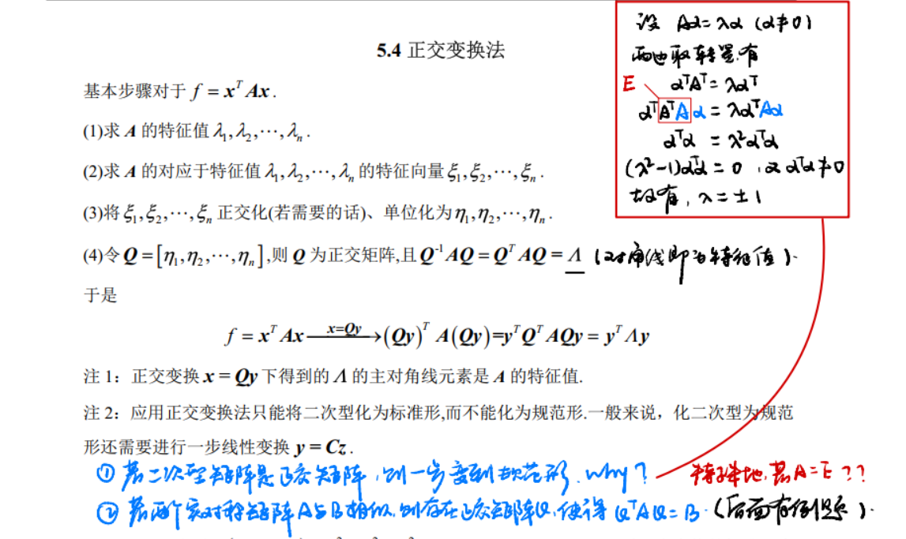

#### 步骤

1. 求 $A$ 的特征值，即由 $|λE - A| = 0$，得 $λ_1, λ_2, \cdots, λ_n$
2. 求 $A$ 的特征向量，即由 $(λE - A)x = 0$ ( $i = 1, 2, \cdots, n$)，得 $α_1, α_2, \cdots, α_n$
3. 对 $α_1, α_2, \cdots, α_n$ 进行施密特正交化，单位化，得 $η_1, η_2, \cdots, η_n$（正交化只针对特征值对应的特征向量）
4. 令 $Q = [η_1, η_2, \cdots, η_n]$，则 $x = Qy$ 为正交变换
5. 写出标准形 $λ_1y_1^2 + λ_2y_2^2 + \cdots + λ_ny_n^2$

## 相似

> 相似变换不会改变矩阵的秩，但会改变矩阵的特征值和特征向量

- **相似定义**：存在可逆矩阵 $P$，使得 $A = P^{-1}BP$ <=> 矩阵 $A$ 和 $B$ 称为相似的
- **相似的性质**：
  - 相似矩阵具有相同的特征值和相同的特征多项式
  - 相似矩阵对应相同的特征向量空间（但基不一定相同）
  - 相似性是等价的一种特殊形式，即相似矩阵一定等价，但等价矩阵不一定相似
  - **技巧**：
    - 对于实对称矩阵，相似性和合同是等价的
    - 但对于一般矩阵，相似性和合同性无法相互推导

### 证明 A 可/不可相似对角化

### 可相似对角化的条件

1. **n 阶矩阵 $A$ 可相似对角化的充要条件**：
   - $A$ **有 n 个线性无关的特征向量**。

2. **几何重数与代数重数相等的充要条件**：
   - $A$ 的每个特征值的**几何重数**等于其**代数重数**，则 $A$ 可以相似对角化。

3. **特征值互不相等的情况**：
   - 如果 $A$ 有 $n$ 个**互不相等的特征值**，则 $A$ 一定可以相似对角化。

4. **实对称矩阵**：
   - **任意实对称矩阵** $A$ 一定可以相似对角化。

5. **多项式条件**：
   - 如果 $A$ 满足：

     $$
     (A - k_1 E)(A - k_2 E) = 0 \quad (k_1 \neq k_2)
     $$

     则 $A$ 可以相似对角化。

6. **秩与迹的特例**：
   - 若 $r(A) = 1$ 且 $\text{tr}(A) \neq 0$，则 $A$ 可以相似对角化。

7. **特殊外积矩阵的条件**：
   - 若 $A = \alpha \beta^T$，且 $\alpha^T \beta \neq 0$，则 $A$ 可以相似对角化。

8. **二阶矩阵的特例**：
   - 若 $A$ 为二阶矩阵，且 $|A| < 0$，则 $A$ 可以相似对角化。

9. **秩与非零特征值的关系**：
   - 若矩阵 $A$ 可以相似对角化，则 $A$ 的秩等于其**非零特征值的个数**。

---

### 不能相似对角化的特殊矩阵类型

1. **非零三角矩阵**：
   - 若 $A$ 为**非零三角矩阵**，且**主对角线元素全为 0**，则 $A$ 不能相似对角化。

2. **秩与迹的限制**：
   - 若矩阵 $A$ 的**秩** $r(A) = 1$，且**迹** $\text{tr}(A) = 0$，则 $A$ 不能相似对角化。

3. **特定的外积矩阵**：
   - 若 $\alpha$、$\beta$ 为 $n$ 维**非零列向量**，且满足：

     $$
     A = \alpha \beta^T, \quad \alpha^T \beta = 0
     $$

     则 $A$ 不能相似对角化。

4. **幂零矩阵**：
   - 若 $A$ 为 $n$ 阶非零矩阵，且满足：

     $$
     A^k = O \quad (k \text{ 为正整数})
     $$

     则 $A$ 不能相似对角化。

5. **所有特征值相同的矩阵**：
   - 若 $A$ 的所有特征值均为某常数 $k$，但 $A \neq kE$（即 $A$ 不是 $k$ 倍的单位矩阵），则 $A$ 不能相似对角化。

#### 非对称矩阵的相似

##### 法一：利用对角矩阵过渡

##### 法二：利用相似的必要条件

[线代9讲 P123]()

1. $|A| = |B|$

2. $tr (A) = tr (B)$

3. $r (A) = r (B)$

4. 具有相同的特征值

5. $f (A)$ 相似于 $f (B)$

   此处的 $f (A)$ 不仅仅是以 $A$ 为自变量的多项式函数，还可以是其他算子，如 $f (A) = A^{T}$，则 $A^{T} \sim B^{T}$；如果 $f (A) = A^{*}$，则 $A^{*} \sim B^{*}$；如果 $f (A) = A^{-1}$，则 $A^{-1} \sim B^{-1}$（注意前提是 $A$ 与 $B$ 都可逆）

6. 若 $A \sim \Lambda$，则 $B \sim \Lambda$

#### 抽象矩阵相似

### 手段相同 P 时，$f(A) f(\lambda)$ 哈密顿凯莱定理

每个 $n$ 阶矩阵都是它的特征多项式的根，设 $A$ 为 $n$ 阶矩阵，

$$

f(\lambda) = |\lambda E - A| = \lambda^n + a_{n-1}\lambda^{n-1} + \cdots + a_1\lambda + a_0,

$$

$$

\Rightarrow  f(A) = A^n + a_{n-1}A^{n-1} + \cdots + a_1A + a_0E = 0.

$$

> [! warning] 不可反推
>
> $$f (\lambda) \Rightarrow  f(A)$$
>
> $$f (A) \nRightarrow  f(\lambda)$$

### A 与 B 相似的条件 [相似对角化的充要条件](https://zhuanlan.zhihu.com/p/517865976)

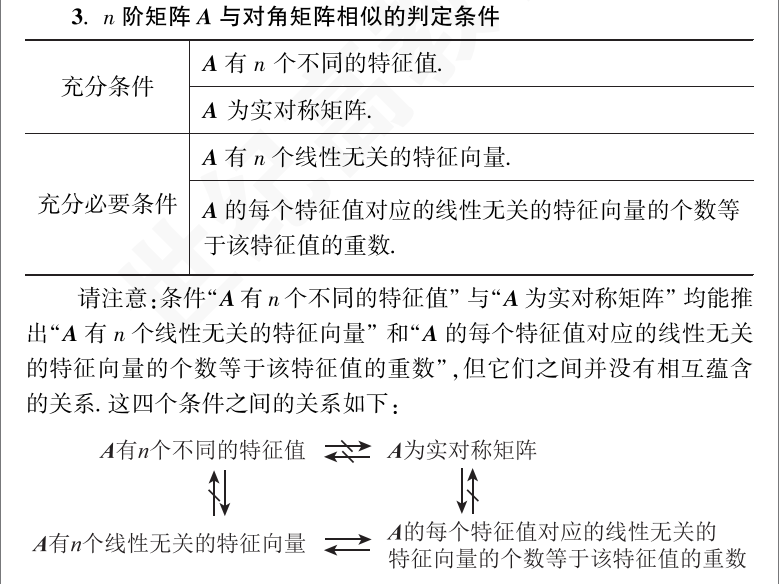

#### 四等

1. $|A|=|B|$

2. $r(A) = r(B)$

3. $|\lambda E - A| = |\lambda E - B|$ ⇒ $\lambda(A) = \lambda(B)$

4. $\sum a_{ii} = \sum b_{ii}$；$\sum \alpha_i = \sum \beta_i$

#### 五相似

$A \sim B'$, $A' \sim B'$, $A^{-1} \sim B'$, $A^{-1} \sim B'$, $A^+ \sim B^+$

$f(A) = f(B)$。从而 $[f(A)] = [f(B)]$。$|f(A)| = |f(B)|$

上述性质如加减乘及不含有变量的函数

即 $A$ 与 $B$ 相似，则 $A + A' + A^{-1} + B' + B + B'$

**【评注】** 一般矩阵 $A$ 与 $B$ 相似或 $\lambda E - A$ 与 $\lambda E - B$ 等价

证明矩阵在值域上的恒等变换（求矩阵中的警觉）

1. 给特征值直 $a_i$，用定义 $A_\alpha = |a_i|$

2. 给特征值，可用特征多项式 $|\lambda E - A| = 0$

3. 行相乘，用相似的四个必要条件，尤其是第四条

4. 若知有 $n_i$ 重根 $\lambda_i$，可对角化，可用秩 $(\lambda E - A) = n - n_i$

见到方阵 $A$ 的每行元素之和均为 3 的矩阵，立马想到是 $A$ 的一个特征值，相应特征向量 $a = (1, \ldots, 1)^T$，证明 $a4 + bE = 0$，立即想到有特征值 $\lambda = \frac{-b}{a}$，见到矩阵等式 $f(A) = 0$，求行列 $[a_i]$ 的值，一般考虑利用特征值求解

单特征值只有一个线性无关特征向量时，类似双重特征值问题，当其特征向量组合（组合系数不全零）仍然是特征值问题的解时，不同特征值的线性无关特征向量组的线性组合（组合系数均不为零）不再是特征值问题的解

## $A$ 与实对称矩阵

求可逆矩阵 $P$ 的步骤：

1. 求 A 的特征值

2. 求 $A$ 的特征向量 $a_1, a_2, a_3$
3. 构造可逆矩阵 $P = (a_1, a_2, a_3)$, $P^{-1}AP = \begin{pmatrix} \lambda_1 & & \\ & \lambda_2 & \\ & & \lambda_3 \end{pmatrix}$

**【评注】** 若 $P^{-1}AP = B \neq A$

设法分别求出 $A, B$ 的特征值、特征向量，由特征向量构造 $Q_1, Q_2$

使 $Q_1^{-1}AQ_1 = A, Q_2^{-1}BQ_2 = A$, 则 $Q_2^{-1}AQ_2 = B$, 故 $P = Q_2^{-1}$

见到对角化的线性互变换化二次型为标准型就要想到考察特征值与特征向量的对应

见到实对称矩阵应想到

1. 对于每个特征值的特征向量应正交（也线性无关）

2. 有 $n$ 互异特征值 $\lambda_i$ 必有 $n$ 个线性无关的特征向量，即 $(\lambda E - A) = n - k_i$

3. 实对称矩阵可对角化

若 $Q$ 是正交矩阵 $Q$，有 $Q^T AQ = A = \begin{pmatrix} \lambda_1 & & \\ & \lambda_2 & \\ & & \lambda_3 \end{pmatrix}$

## 合同

- **合同定义**：若 A，B 为 n 阶实对称矩阵，存在可逆矩阵 C，使得 $C^TAC=B$，则称 A 与 B 合同
- **合同的性质**：
  - **对称矩阵只能和对称矩阵合同。**
    1. 对称与对称合同：若 $B$ 是实对称矩阵，则 $A$ 一定是实对称矩阵（不对称和不对称合同）
    2. **相似必合同**：若实对称矩阵 $A$ 和 $B$ 相似，则必然合同
  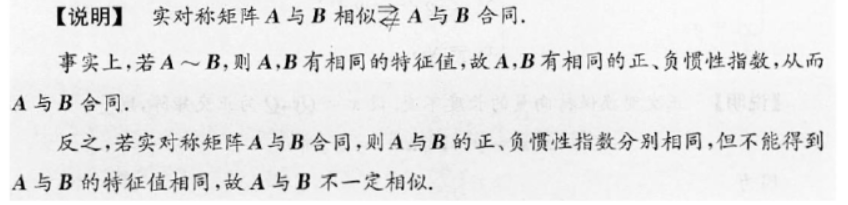
    3. $A$ 和 $B$ 合同即相同的正负惯性指数
    4. $A$ 和 $B$ 合同，$B$ 和 $C$ 合同，则 $A$ 和 $C$ 合同
  - **非对称矩阵只能和非对称矩阵合同。**
    - 两个非对称矩阵合同属于超纲内容
    - 一般证明非对称矩阵不合同
    - 通过 $A = \frac{1}{2} (A + A^T) + \frac{1}{2} (A - A^T)$，分解为对称矩阵和反对称矩阵，再证明

> [! ] 相似看迹，合同看是否对称
> 相似：特征值相同
> 合同：特征值正负个数相同

## 同时对角化

### 同时相似对角化 AB=BA

法三：拆 E

### 同时合同对角化

## 正交 " 内积为 0"

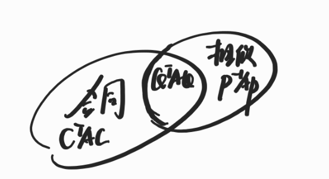
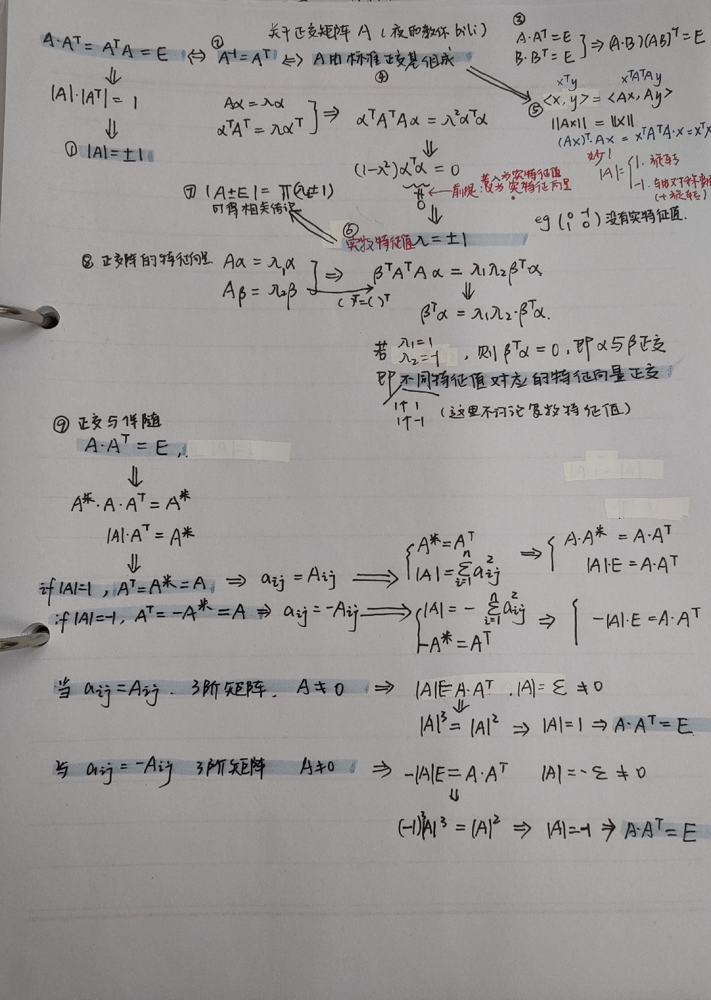

#### 正交变换的不变量

正交变换不改变向量的长度，内积，夹角。证明如下：

- **长度**：向量 X 长度为 $\ce{\left| X \right|=\sqrt{X^{T}X}}$，正交变换后为 Y，$\ce{\left| Y \right|=\sqrt{Y^{T}Y}}$，由于 Y=QX(Q 为正交矩阵,$\ce{Q^{T}Q=E}$)，则 $\ce{\left| Y \right|=\sqrt{X^{T}Q^{T}QX}=\sqrt{X^{T}X}=\left| X \right|}$,长度不变！

- **内积**：向量 X,Y 内积为 $\ce{X^{T}Y}$，正交变换后：X$\ce{\rightarrow}$X'，Y$\ce{\rightarrow}$Y'。内积为 $\ce{X'^{T}Y'}$，由于 X'=QX,Y'=QY，则 $\ce{X'^{T}Y'=X^{T}Q^{T}QY=X^{T}Y}$，不变！

- **夹角**：向量 X,Y 夹角为 $\ce{cos\theta=\frac{X^{T}Y}{\left| X \right|\left| Y \right|}}$，由于 $\ce{X^{T}Y}$ 不变，$\ce{\left| X \right|\left| Y \right|}$ 不变，则 $\ce{cos\theta}$ 不变，$\ce{\theta}$ 不变！

- 有了这些不变，再经过正交变换后，图形的大小、形状经正交变换后不变

### 正交变换化二次型为标准形的步骤

1. 将二次型表示成成矩阵形式关于 $\Delta x$

2. 求出 A 的特征值（这时，二次型的标准形已经求得）

3. 求出 A 的对应于 λ_i 的特征向量

4. 对相等特征值（如果有的话）对应的线性无关特征向量正交化，在将所有的特征向量单位化，得标准正交特征向量组 $η_1, η_2, …, η_3$

5. 构造正交阵 $C = (η_1, η_2, …, η_3)$，令 x = Cy，则

$$ f = x^T A x = (Cy)^T A (Cy) = y^T (C^T AC) y = λ_1 y_1^2 + λ_2 y_2^2 + … + λ_n y_n^2 $$

### A 为实对称矩阵，求正交矩阵 $Q$ 对角化

1. 求特征值 $\lambda_1, \lambda_2, \lambda_3$

2. 求特征向量 $a_1, a_2, a_3$

3. 令常数 $\xi_1, \xi_2, \xi_3$ 单位化为 $\xi_1, \xi_2, \xi_3$

$$ \lambda_2 = \lambda_1 $$

，需要将 $a_2, a_3$ Schimidi 正交化

1. 构造正交矩阵 $Q = (\xi_1, \xi_2, \xi_3)$，则 $Q^T AQ = A = \begin{pmatrix} \lambda_1 & & \\ & \lambda_2 & \\ & & \lambda_3 \end{pmatrix}$

**【评注】** 为避免 Schimidi 正交化计算量过大，可选择利用叉积 $a_i \times a_j$ 来计算

见到二次型正定就要想到

1. $$ \lambda_1 \geq 0 $$

2. 顺序于主子式全大于等于零，所有特征值全大于零

### 利用特征值特征向量反应求矩阵 A

1. 先求出 P 的全部特征值 λ_1, λ_2, λ_3 及 n 个无关的特征向量 a_1, a_2, a_3

2. 由 A (a_1, a_2, a_3) = (a_1, a_2, a_3)Λ 可得

$$ A = (a_1, a_2, a_3) \begin{pmatrix} λ_1 & & \\ & λ_2 & \\ & & λ_3 \end{pmatrix} (a_1, a_2, a_3)^{-1} $$

**【评注】** 若 A 为实对称矩阵或某二次型表达式，为避免共计，将特征向量 $a_1, a_2, a_3$ 正交化

后得矩阵 $Q = (η_1, η_2, η_3)$ 来求，即 $A = QΛQ^T = Q \begin{pmatrix} λ_1 & & \\ & λ_2 & \\ & & λ_3 \end{pmatrix} Q^T$

为减少计算量也可

$$ A = QΛQ^T = (\eta_1, \eta_2, \eta_3) \begin{pmatrix} λ_1 & & \\ & λ_2 & \\ & & λ_3 \end{pmatrix} \begin{pmatrix} \eta_1^T \\ \eta_2^T \\ \eta_3^T \end{pmatrix} = λ_1 \eta_1 \eta_1^T + λ_2 \eta_2 \eta_2^T + λ_3 \eta_3 \eta_3^T $$

### 求 $f(x_1, x_2, x_3) = 0$ 的解

方法：先将二次型 $f(x_1, x_2, x_3)$ 化为标准型，得到几个平方和，然后得到等号等于零，再利用 $Q^T y$，得解

### 求 $x^T A x$ 的最大值和最小值

方法：先将二次型 $x^T Ax$ 化为标准形

再将 $x = Q^T y Q^T y = y^T Q^T Q y = y^T Q^T Q y = y_1^2 + y_2^2 + y_3^2 = k$，最后放缩

## 矩阵等价、相似、合同、正交的概念辨析

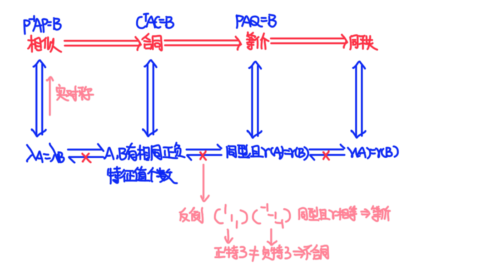

## 正定

### 正定矩阵的充要条件

若 $n$ 阶矩阵 $A$ 正定，则下列命题等价：

1. 对任意非零列向量 $x$，都有 $x^T A x > 0$
2. $x^T A x$ 的标准型的系数全为正数
   - 推论：$r(A) = n$，因为正交变换得到的标准型的系数就是 $A$ 的所有特征值
   - 由 $r(A) = n$ 且 $A$ 可逆：正定矩阵一定是可逆矩阵
3. $x^T A x$ 的正惯性指数（规范性中正的系数）$p = n$
4. 存在可逆矩阵 D  $A = D^TD$
5. $A$ 的特征值全大于 0
6. $A$ 的各阶顺序主子式全大于 0
7. $A$ 与 $E$ 合同

若题干所给矩阵是 $A^T A$，要证明正定很容易，记 $B = A^T A$，有 $B = A^T EA$，则 $B$ 与 $E$ 合同。

### 正定的必要条件

1. 矩阵 $A$ 的主对角线元素 $a_{ij} > 0$
2. $A^1, A^*, A^n, aA + bE (a, b > 0)$ 正定【根据特征值】

> 判断矩阵 $A$ 是否正定时，需要验证 $A$ 是否为实对称矩阵。

### 判断正定矩阵的方法

1. 矩阵 $A$ 的各阶顺序主子式大于 0
2. 特征值大于 0
3. 正惯性指数 $p = n$
4. 用定义验证：
   
5. 配完全平方和：
   

### 抽象正定

#### 方法一：用特征值

- 设矩阵 $A^{-1}$ 的特征值是 $λ_1, λ_2, \cdots, λ_n$，那么矩阵 $A$ 的特征值是 $\frac{1}{λ_1}, \frac{1}{λ_2}, \cdots, \frac{1}{λ_n}$。
- 由于 $A$ 正定，知其特征值 $\frac{1}{λ_i} > 0$ ($i = 1, 2, \cdots, n$)，从而矩阵 $A^{-1}$ 的特征值 $λ_i$ ($i = 1, 2, \cdots, n$) 全大于 0。
- 因此矩阵 $A^{-1}$ 正定。

#### 方法二：用与 $E$ 合同

- 因为矩阵 $A$ 正定，故存在可逆矩阵 $C$ 使得 $C^TAC = E$。
- 两边取逆，得到 $(C^TAC)^{-1} = (C^{-1})^T A^{-1} C^{-1} = E$。
- 记 $P = C^{-1}$，则可逆矩阵 $P$ 有 $P^T A^{-1} P = E$，所以 $A^{-1}$ 与 $E$ 合同，故 $A^{-1}$ 正定。

#### 方法三：用定义，坐标变换

- 因为 $A$ 正定，那么 $A$ 可逆，对二次型 $x^TAx$ 作坐标变换 $x = Ay$，有 $x^TAx = (Ay)^TA(Ay) = y^TA^TAy = y^TAy$。
- 由于 $A$ 可逆，得到 $y \neq 0$ 时，恒有 $y \neq 0$，又因 $A$ 正定，那么 $y^TAy > 0$。
- 故 $y^TAx = y^TAy > 0$，所以 $A^{-1}$ 正定。

#### 方法四：用与已知的正定矩阵合同

- 因为 $A$ 正定，那么 $A$ 对称且可逆，于是 $A^TA = A^{-1}A = A^{-1}A = A$。
- 所以 $A^{-1}$ 与 $A$ 合同，即二次型 $x^TAx$ 与 $A$ 合同，故它们有相同的正负惯性指数。
- 既然 $A$ 是正定二次型，知 $A^{-1}$ 是正定，即 $A^{-1}$ 正定。

##### 设矩阵 $A = A_{m \times n}$ 的秩 $r$，证明 $A^TA$ 正定

- **证：** 由 $$(A^TA)^T = A^TA = A^TA$$

 知 $A^TA$ 为对称矩阵。对任意 $x$，有 $$x^TA^TAx = (Ax)^T(Ax) = A^TAx \geq 0$$

 由已知，得 $A^T$ 有 $n$ 个列满秩，故方程组 $Ax = 0$ 只有零解，且当 $x ≠ 0$ 时 $x^TAx > 0$，故 $A$ 正定的定义，知 $A^TA$ 是正定矩阵

- **注：** $Ax$ 表示列向量，$(Ax)^T(Ax)$ 表示 $Ax$ 与 $Ax$ 的内积。当 $x ≠ 0$ 时，内积 $(Ax)^T(Ax) > 0$

##### 设 $A_{mn}$ 正定，对于 $B_{mn}$，证明 $AB + B^TA^T$ 正定的充分必要条件是 $X^TAX > 0$

**证** (必要性)：

- **解法一 (用特征值)：** 对任意 $x ≠ 0$，由 $B^TAB$ 正定，知 $x^T(B^TAB)x = (Bx)^TA(Bx) > 0$
  故存在 $c > 0$，使 $Bx ≠ 0$ 且 $x^T(B^TAB)x ≥ c$

- **解法二 (用例 1)：** 由 $A$ 正定，$X = A^{-1}$ 且 $X^TAX > 0$，故 $m = x^T(B^TAB)x ≤ c(B^TAB)x ≤ m$

- **解法三：** 设 $D = D^T$，则 $D = D^TA$ 可逆，易知 $n = c^T(B^TAB)c ≤ c(B^TAB)c = D(B^TAB)c ≤ m$

- **解法四 (用反证法)：** 设 $X = B_1, B_2, \cdots, B_n$ 的列向量相同且线性相关。故存在不全为 0 的点 $x_1, x_2, \cdots, x_n$ 使得

  $$

  B = \begin{pmatrix} B_1 & B_2 & \cdots & B_n \end{pmatrix}, \quad \text{且} \quad x = \begin{pmatrix} x_1 \\ x_2 \\ \vdots \\ x_n \end{pmatrix}

  $$

  那么存在点 $a_1, a_2, \cdots, a_n$，使得 $a^TAa = A$，从而 $AB + B^TA^T$ 正定

  - **证明 (用定义)：** 先由 $B^TAB$ 正定证明 $Bx ≠ 0$，因为

    $$
    x^T(B^TAB)x = (Bx)^TA(Bx) > 0,
    $$

    故 $Bx ≠ 0$ 且 $x ≠ 0$

- **证明：** 若 $AB + B^TA^T$ 不正定，则存在 $Bx = 0$，从而存在点 $c^TAc > 0$，恒有 $x^TAx = 0$ 且 $x ≠ 0$。从而得 $x^T(Ax) = 0$
  若 $A^{-1}$ 可逆且正定，得 $x = 0$，与 $AB$ 正定矛盾

- **证明 (反证法)：** 设 $A = P^TP, B = Q^TQ$，且 $P = Q^TQ$，故 $P = Q$，使得

  $$

  AB + B^TA^T = P^TP + Q^TQ^T = P^TP

  $$

  又因 $P$ 可逆，得 $P^TP$ 正定，从而得 $AB + B^TA^T$ 正定

- **总结：** $AB + B^TA^T$ 正定的充分必要条件是 $X^TAX > 0$
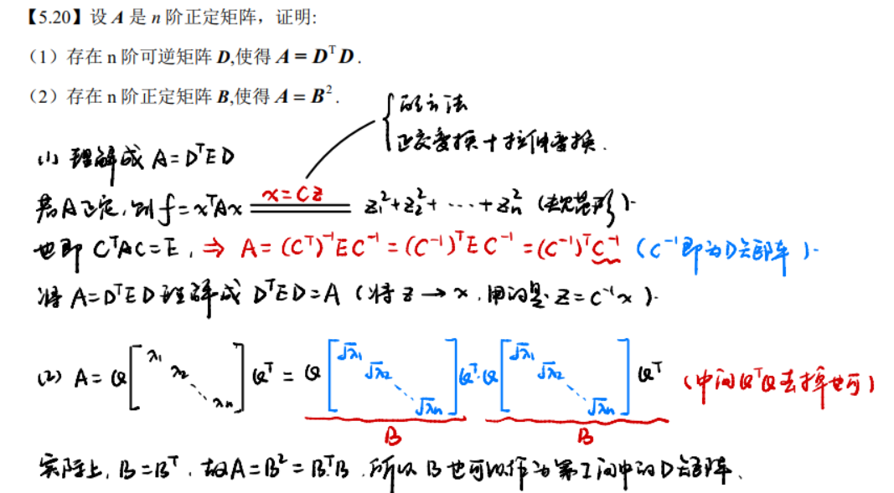  [b战讲解](https://www.bilibili.com/video/BV1hM4m1a7A9/)

##### A 是 n 阶正定矩阵又是 n 阶正交矩阵 $\Rightarrow A = E_n$

- $A$ 正定 $\Rightarrow A$ 对称矩阵
- 存在可逆矩阵 $P$，使得 $P^{-1}AP = \Lambda$
- $A$ 正交 $\Rightarrow A$ 特征值的模为 1
- $A$ 对称 $\Rightarrow A$ 特征值为实数
- $A$ 正定 $\Rightarrow A$ 特征值均为正数

因此，$A$ 的特征值全为 1，$P^{-1}AP = \Lambda = E \Rightarrow A = PEP^{-1} = E$。

##### A 为 n 阶反对称矩阵，那么 $E-A^2$ 是正定矩阵

- $(E - A^2)^T = E^T - (A^2)^T$
- $A^T = -A \Rightarrow (E - A^2)^T = E - A^2$，故 $E - A^2$ 是对称矩阵
- $x^T (E - A^2) x = x^T x + x^T A^T A x = \|x\|^2 + \|Ax\|^2 > 0$

因此，$E - A^2$ 是正定矩阵。

## 空间曲面与二次型

设 $f (x, y, z) = \mathbf{x}^{\top} A \mathbf{x} = (x, y, z)^{\top}$
$A$ 的特征值为 $\lambda_1, \lambda_2, \lambda_3$，则特征值符号与 $f(x, y, z)$ 代表的曲面关系如下表：

| 特征值符号  |                                                                                  曲面图形                                                                                   |
| :----: | :---------------------------------------------------------------------------------------------------------------------------------------------------------------------: |
|   全正   |                                             椭球面  $f(x, y, z) = \frac{x^2}{a^2} + \frac{y^2}{b^2} + \frac{z^2}{c^2} = 1$                                             |
|  两正一负  | 单叶双曲面  $f(x, y, z) = \frac{x^2}{a^2} + \frac{y^2}{b^2} - \frac{z^2}{c^2} = 1$   或者锥面  $f(x, y, z) = \frac{x^2}{a^2} + \frac{y^2}{b^2} - \frac{z^2}{c^2} = 0$ |
|  两负一正  |                                            双叶双曲面 $f(x, y, z) = -\frac{x^2}{a^2} - \frac{y^2}{b^2} + \frac{z^2}{c^2} = 1$                                            |
|  两正一零  |                                                  椭圆柱面（含圆柱面）  $f(x, y, z) = \frac{x^2}{a^2} + \frac{y^2}{b^2} = 1$                                                   |
| 一正一负一零 |                                                     双曲柱面   $f(x, y, z) = \frac{x^2}{a^2} - \frac{y^2}{b^2} = 1$                                                     |
|  一正两零  |                                                                                 两个平行平面                                                                                  |

## 还原矩阵

