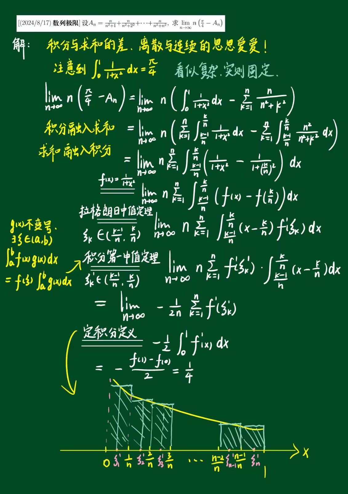
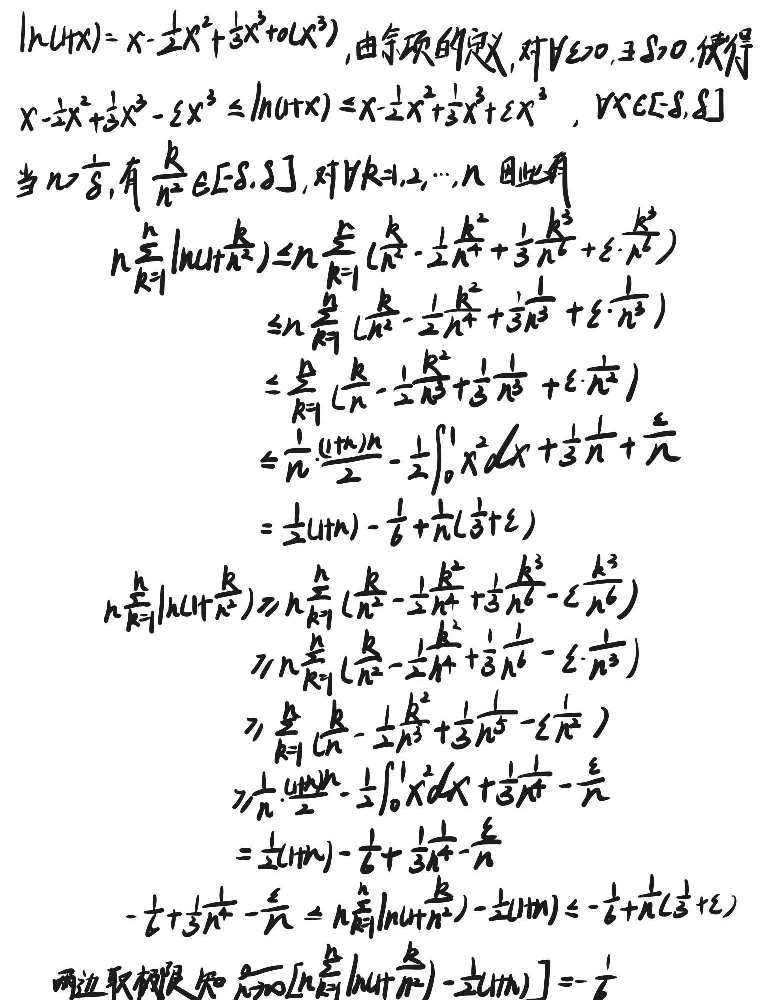
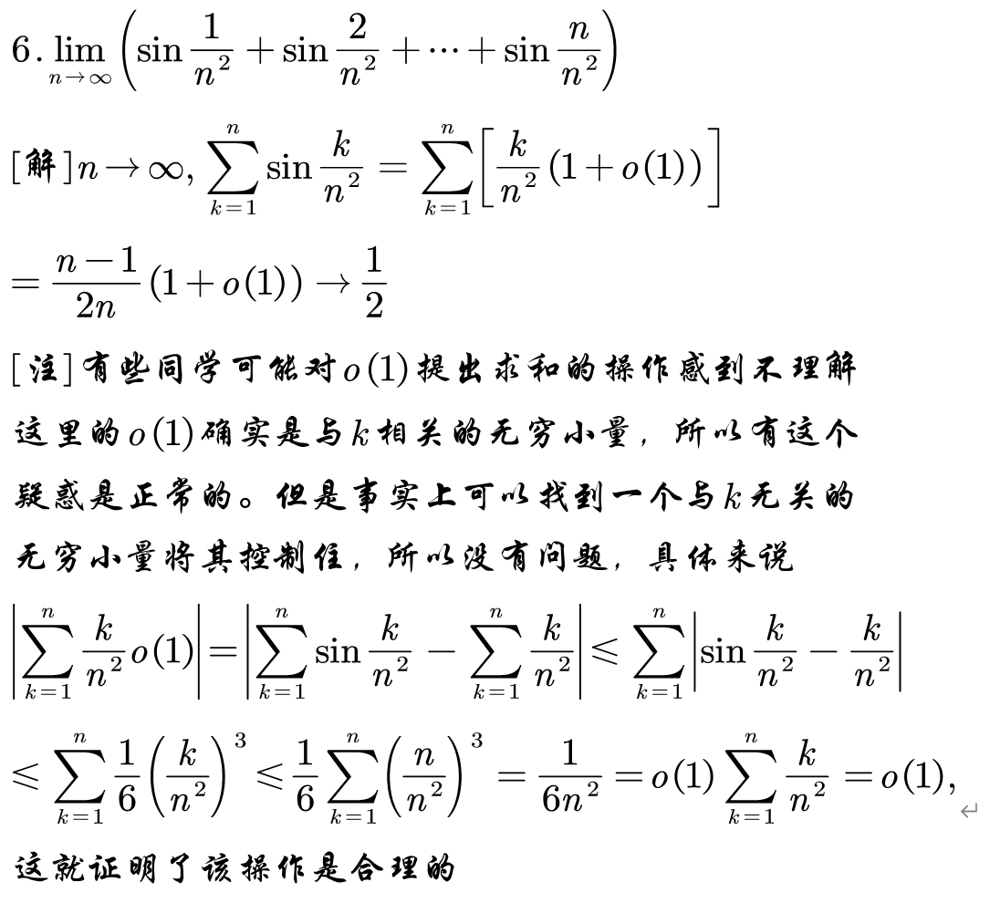
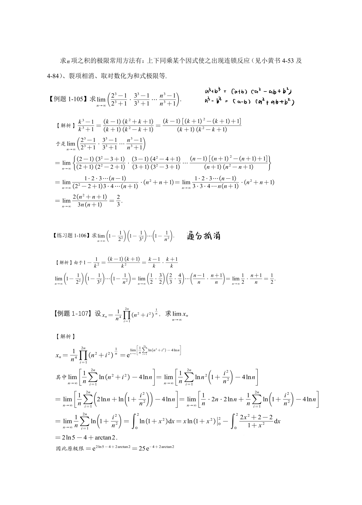
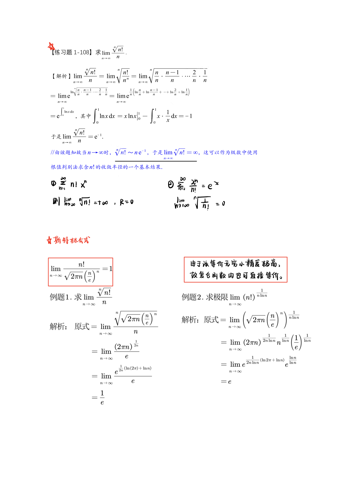

## 利用求和符号结合统一思想求极限

$$
\sum_{i=1}^{n} 2 = 2n
$$

$$
\sum_{n=1}^{n} n = n^2
$$

## n 项和极限

[求n项和的极限](src/求n项和的极限.pdf)

### 泰勒展开

$$
\lim_{n \to \infty} \left[ n \sum_{k=1}^{n} \ln\left(1 + \frac{k}{n^2}\right) - \frac{1}{2}(n+1) \right] = \_\_\_\_\_\_ \ .
$$

[【考研数学】经典累加极限题【易错题】_哔哩哔哩_bilibili](https://www.bilibili.com/video/BV1GM4m1Z7aC/)
[一个视频解决定积分几何定义【易错题】+巧妙【举一反三】，从此不怕此类题！_哔哩哔哩_bilibili](https://www.bilibili.com/video/BV1UT421D7Ak/)

> *放缩*：
> 根据 $\ln(1+x)$ 的展开：
> $2k$ 阶 < $\ln(1+x)$ < $2k+1$ 阶

[36讲 P37 例1.45](#)
[900 B 1.25](#)

### 阶乘有关

#### Strling 公式

$$ n! \sim \sqrt{2 \pi n} \left(\frac{n}{e}\right)^n $$

 即：$$ \lim_{n \to \infty} \frac{n!}{\sqrt{2 \pi n} \left(\frac{n}{e}\right)^n} = 1 $$

 其中，$n^n$, $e^n$ 起到了相关的幂指数平衡作用。--- ### 证明：设 $A_n = \frac{n!}{\sqrt{n} \left(\frac{n}{e}\right)^n}$. $$ \frac{A_{n+1}}{A_n} = \frac{n! e^n (n+1)^{n+\frac{1}{2}}}{(n+1)! e^{n+1} n^{n+\frac{1}{2}}} = \frac{e}{n} \cdot \left(1 + \frac{1}{n}\right)^{n+1/2} $$

 利用近似：$$ \left(1 + \frac{1}{n}\right)^n = e \left( 1 + \frac{1}{2n} \right) \implies \frac{A_{n+1}}{A_n} > 1 $$

 $\therefore A_n$ 单调递增，且有界（通过估计发现），因此收敛。故：$$ n! \sim A_n \sim a \cdot \sqrt{n} \left( \frac{n}{e} \right)^n $$

> 利用 Wallis 公式确定 $a$ 的值

$$ \frac{\pi}{2} = \lim_{n \to \infty} \frac{(2n-1)!!}{(2n)!!} \cdot \frac{2n}{2n+1} $$

 $$ \Rightarrow (2n)! \sim 2^n n! \quad \Rightarrow \quad a = \sqrt{2 \pi} \quad \Rightarrow \quad n! \sim \sqrt{2\pi n} \left(\frac{n}{e}\right)^n$$

#### 例题

##### 1

[【考研数学】检验你综合运用能力_哔哩哔哩_bilibili](https://www.bilibili.com/video/BV1Yt421N79J/)

[900 数一第一章 A 24]

$$
\lim_{n \to \infty} \frac{\sqrt{1! + 2! + 3! + \cdots + n!}}{n}
$$

利用不等式：

$$
\sqrt{n!} \leq \frac{\sqrt{1! + 2! + 3! + \cdots + n!}}{n} \leq \frac{\sqrt{n!}}{n}
$$

$$
x = \lim_{n \to \infty} \frac{\sqrt[n]{n!}}{n}
$$

$$
x = \lim_{n \to \infty} \sqrt[n]{\frac{n!}{n^n}} = e^{\lim_{n \to \infty} \frac{1}{n} \sum_{k=1}^n \ln\left(\frac{k}{n}\right)}
$$

$$
= e^{\int_0^1 \ln(x) dx} = e^{-1} = \frac{1}{e}
$$

因此，原极限为 $\frac{1}{e}$

##### 2

$$lim_{n\to \infty}(\sqrt[n+!]{(n+1)!} - \sqrt[n]{ n! })$$

 令 $x_n = \left[ \frac{\sqrt[n]{(n+1)!}}{\sqrt{n!}} \right] - \frac{n}{n!}$, 则

$$
x_n = \frac{\sqrt{n!}}{n} \left( \frac{\sqrt[n+1]{(n+1)!}}{\sqrt{n!}} - 1 \right) n
$$

$$
\lim_{n \to \infty} \frac{\sqrt[n]{n!}}{\sqrt{n!}} = \lim_{n \to \infty} \frac{\sqrt[n]{n!}}{n} = \lim_{n \to \infty} e^{\frac{1}{n} \ln \frac{n!}{n^n}} = \lim_{n \to \infty} e^{\sum_{i=1}^{n} \frac{1}{n} \ln i} = e^{\int_0^1 \ln x dx} = e^{-1},
$$

$$
\left( \frac{\sqrt[n+1]{(n+1)!}}{\sqrt{n!}} - 1 \right) n = \left( \sqrt[n+1]{\frac{(n+1)^{n+1}}{(n!)}} - 1 \right) n.
$$

##### 3 $\\lim_{ n \to \infty }\frac{\sum_{0}^n \frac{1}{k}}{\ln n} = 1$

## n 项积分极限

