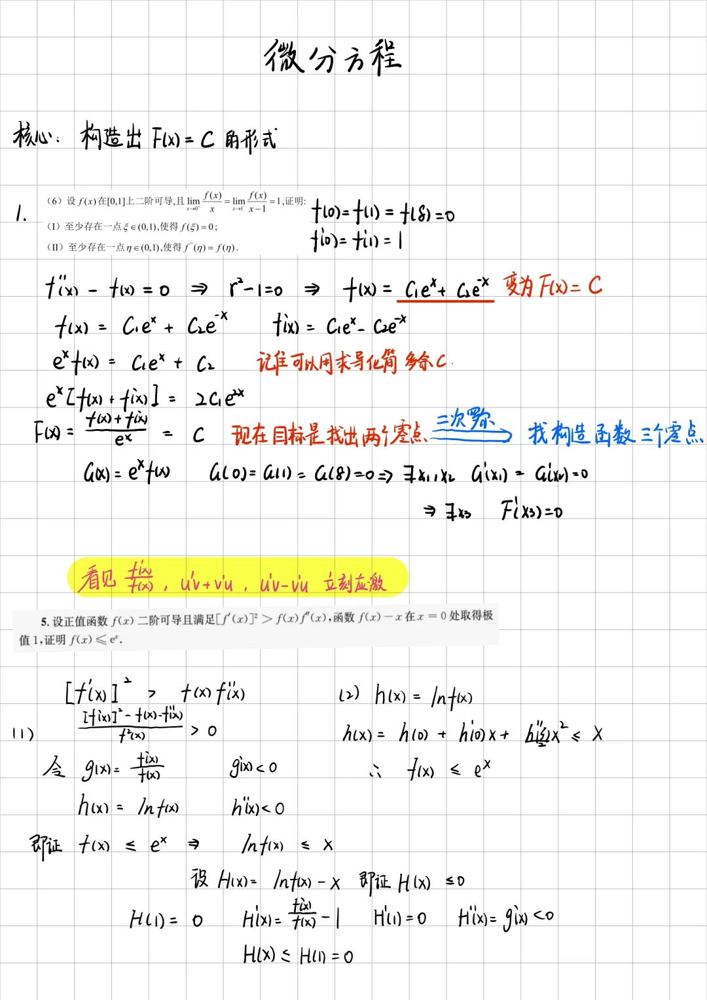

## 中值定理

### 函数基本定理

1. **费马定理：** 唯一
   - **内容：** 中值在极值点附近 $\exists c \in (a,b)$ 令 $f'(c) = 0$，即得到极值

2. **罗尔定理：**
   - **条件：** 两侧极值扩散
   - **推论方程：** 微分方程 $f'(x) = 0$，构造 $F(x) = C$
   - **结论：** 若一次恒真再用物理→k

3. **拉格朗日：**
   - **内容：** 图像连线有斜率
   - **双中值：** 波点找 $c$ / 反解函数

4. **柯西：**
   - **变量分离：** $\frac{f(a)}{g(a)} \approx \frac{f(b)}{g(b)}$ 之间是混合
   - **假双中值：** 分子同时 分母互乘，找柯西形式

5. **泰勒：**
   - **消界点连线：** 联立
   - **消原点数：** 分区间估值论
   - **消中值：** 有界放缩

6. **介值定理：**

   - **介值定理 I**：如果函数 $f(x)$ 在闭区间 $[a, b]$ 上连续，并且 $f(a) \neq f(b)$，那么对于 $f(a)$ 和 $f(b)$ 之间的任意值 $c$，在区间 $(a, b)$ 内至少存在一点 $\xi$，使得 $f(\xi) = c$

   - **介值定理 II**：对于闭区间 $[a, b]$ 上的连续函数 $f(x)$，函数值必定能取到介于其最大值 $M$ 和最小值 $m$ 之间的任何值 $\mu$，即存在至少一点 $\xi \in [a, b]$，满足 $f(\xi) = \mu$

7. **平均值定理：**

8. **多项式拟合：**
   - $f^{(n)}(\xi) = k$ 问题

[36 讲 P 15 例题 1.25](#) #多项式拟合 #双变量
[36 讲 P 15 例题 6.34](#) #多项式拟合 #泰勒 #分部积分

[【24考研数学强化】中值定理中题源思想（竞赛可积累）_哔哩哔哩_bilibili](https://www.bilibili.com/video/BV1Nz4y147bd/)

---

### 积分中值定理

- 积分中值定理
- 第一积分中值定理
<https://zhuanlan.zhihu.com/p/606798556>

<https://www.bilibili.com/video/BV19p421m7uS/>

[【考研数学】易错题，积分中值错的原因_哔哩哔哩_bilibili](https://www.bilibili.com/video/BV19p421m7uS/)

### 拉格朗日中值定理

#### 单中值

#### 双中值

#### 假双中值

设 $0 \leq f(x) \leq \pi$,$f'(x) \geq m > 0$($a \leq x \leq b$), 证明：

$$
\left| \int_a^b \sin f(x) \, dx \right| \leq \frac{2}{m}.
$$

**证明：**

首先，由于 $f'(x) \geq m > 0$，我们知道 $f(x)$ 是严格递增函数。因此，对于 $a \leq x \leq b$，有

$$
f(b) - f(a) \geq m(b - a).
$$

由于 $0 \leq f(x) \leq \pi$，我们有

$$
\pi \geq f(b) - f(a) \geq m(b - a).
$$

因此，

$$
b - a \leq \frac{\pi}{m}.
$$

接下来，我们考虑积分 $\int_a^b \sin f(x) \, dx$

由于 $\sin f(x)$ 的绝对值最大为 1，因此有

$$
\left| \int_a^b \sin f(x) \, dx \right| \leq \int_a^b |\sin f(x)| \, dx \leq \int_a^b 1 \, dx = b - a.
$$

结合 $b - a \leq \frac{\pi}{m}$，我们得到

$$
\left| \int_a^b \sin f(x) \, dx \right| \leq \frac{\pi}{m}.
$$

但是，我们希望证明的是 $\left| \int_a^b \sin f(x) \, dx \right| \leq \frac{2}{m}$

注意到，$\sin f(x)$ 在 $[0, \pi]$ 上的积分周期为 $\pi$，并且在一个周期内的最大值为 2。因此，对于 $0 \leq f(x) \leq \pi$，

$$
\left| \int_a^b \sin f(x) \, dx \right| \leq \frac{2}{m}.
$$

综上所述，我们证明了

$$
\left| \int_a^b \sin f(x) \, dx \right| \leq \frac{2}{m}.
$$

- **反证法**

当 $a \leq x \leq b$ 时，$f'(x) > 0$，$f(x)$ 在 $[a, b]$ 上严格单调增加

故其存在反函数。记 $t = f(x)$，其反函数记为 $x = g(t)$，又记 $\alpha = f(a)$，$\beta = f(b)$

由于 $0 \leq f(x) \leq \pi$，则 $0 \leq \alpha < \beta \leq \pi$，故

$$
\int_a^b \sin f(x) \, dx = \int_\alpha^\beta \sin t \cdot g'(t) \, dt,
$$

由于 $f'(x) \geq m > 0$，故

$$
0 < g'(t) = \frac{1}{f'(x)} \leq \frac{1}{m},
$$

则

$$
\left| \int_a^b \sin f(x) \, dx \right| = \left| \int_\alpha^\beta \sin t \cdot g'(t) \, dt \right| \leq \int_\alpha^\beta \left| \sin t \cdot g'(t) \right| \, dt \leq \frac{1}{m} \int_0^\pi \sin t \, dt = \frac{2}{m}.
$$

### 原函数法

#### 积分因子法

#### 微分方程法

#### 直接积分法

#### 反解函数

### 可分离中值

### 常数 k 值法

 (南京大学 1995 年竞赛题)

设 $f(x)$ 在 $(0, 1)$ 内有三阶导数，$0 < a < b < 1$，证明: 存在 $\xi \in (a, b)$，使得

$$
f(b) = f(a) + \frac{1}{2} (b - a) (f'(a) + f'(b)) - \frac{(b - a)^3}{12} f'''(\xi)
$$

令

$$
k = \frac{12}{(b - a)^3} \left[ f(a) - f(b) + \frac{1}{2} (b - a) (f'(a) + f'(b)) \right]
$$

则有等式

$$
f(a) - f(b) + \frac{1}{2} (b - a) (f'(a) + f'(b)) - \frac{(b - a)^3}{12} k = 0 \tag{*}
$$

作辅助函数

$$
F(x) = f(a) - f(x) + \frac{1}{2} (x - a) (f'(a) + f'(x)) - \frac{(x - a)^3}{12} k
$$

由 ( * ) 式得 $F(b) = 0$

又 $F(x)$ 在 $(0, 1)$ 内可导，$F(a) = 0$

在 $[a, b]$ 上应用罗尔定理，必有 $\eta \in (a, b)$，使得 $F'(\eta) = 0$

由于

$$
F'(x) = - f'(x) + \frac{1}{2} (f'(a) + f'(x)) + \frac{1}{2} (x - a) f''(x) - \frac{1}{4} (x - a)^2 k
$$

$$
= \frac{1}{2} (f'(a) - f'(x)) + \frac{1}{2} (x - a) f''(x) - \frac{1}{4} (x - a)^2 k
$$

所以 $F'(\eta) = 0$

由于 $F'(x)$ 在 $(0, 1)$ 上可导，且 $F'(\eta) = F'(\eta) = 0$，

对函数 $F''(x)$ 在 $[a, \eta]$ 上应用罗尔定理，必有 $\xi \in (a, \eta) \subset (a, b)$，使得 $F''(\xi) = 0$

又因为

$$
F''(x) = - \frac{1}{2} f''(x) + \frac{1}{2} f''(x) + \frac{1}{2} (x - a) f'''(x) - \frac{1}{2} (x - a) k
= \frac{1}{2} (x - a) (f'''(x) - k)
$$

所以 $$F''(\xi) = \frac{1}{2} (\xi - a) (f'''(\xi) - k) = 0$$

于是 $k = f'''(\xi)$，代入 ( * ) 式即为所求的等式

---

### 常数变异易法

- 不等式中只有 a, b

#### 1

求证不等式：

$$
\frac{e^b - e^a}{b - a} < \frac{e^b + e^a}{2} \quad (a \neq b)
$$

- **解析**

不妨设 $a < b$ ,令

$$
f(x) = (e^x + e^a)(x - a) - 2(e^x - e^a) \quad (x \geq a)
$$

则 $f(a) = 0$

对 $f(x)$ 求导，并应用拉格朗日中值定理，得

$$
f'(x) = e^x(x - a) + (e^x + e^a) - 2e^x = e^x(x - a) - (e^x - e^a)
$$

其中 $a < \xi < x$

由于 $e^x > e^{\xi}$，所以 $f'(x) \geq 0$

当 $x > a$ 时，$f(x)$ 单调增加，

故 $f(x) > f(a) = 0$。取 $x = b > a$，即得

$$
(e^b + e^a)(b - a) > 2(e^b - e^a)
$$

此式等价于

$$
\frac{e^b - e^a}{b - a} < \frac{e^b + e^a}{2}
$$

---

### 插值法

#### 拉格朗日插值法

### 泰勒展开法

1. **写出两种原式：**
   - $f(x)$ = $f(x_0)$ + $f'(x_0)(x-x_0)$ + $\frac{1}{2}f''(x_0)(x-x_0)^2$

2. **看哪一种解不出加未极数：**
   - 用奇偶性，
   - 分部积分消去

   - **注意：** 中值一般用积分形式放缩，联立后乘因式消极数，分区间消大小

#### 在 x 处展开，h 看做变量（题目无任何点的具体信息）

#### 在 具体点 展开（题目给的已知信息较多）

一般是 端点、中点

#### 在最值点、极值点展开

### 中值极限定理

这类问题一句话的结论就是求中值参数使用泰勒公式把它暴露出来即可，注意使用合适的余项

我们先对各种泰勒余项进行总结：

- **Peano 余项**

> 若 $f(x)$ 在 $x = x_0$ 处 $n$ 阶可导,
> 则 $R_n(x) = o((x - x_0)^n)$

- **拉格朗日余项**

> 若 $f(x) \in D^{n+1}[a, b], x_0 \in (a, b)$
> 则存在 $\theta \in (0, 1)$, 使得 $R_n(x) = \frac{f^{(n+1)}(\xi)}{(n+1)!}(x - x_0)^{n+1}$

- **Cauchy 余项**

> 若 $f(x) \in D^{n+1}[a, b], x_0 \in (a, b)$
> 则存在 $\theta \in (0, 1), R_n(x) = \frac{(1-\theta)^n}{n!}f^{(n+1)}(\xi)(x - x_0)^{n+1}$

- **积分余项**

> 若 $f(x) \in C^{n+1}[a, b], x_0 \in [a, b]$
> 则 $R_n(x) = \frac{(x - x_0)^{n+1}}{n!} \int_0^1(1 - y)^n f^{(n+1)}[x_0 + y(x - x_0)]dy$

- **Schlomilch-Roche 余项**

> 若 $f(x) \in D^{n+1}[a, b], x_0 \in (a, b)$, 存在全介于 $x$ 与 $x_0$ 之间, 使得
> $R_n(x) = \frac{f^{(n+1)}(\xi)}{n!p}((\xi - x_0)^{n+1-p}(x - x_0)^p$

---

#### 例题 1

> 若函数 $f(x)$ 在 $x = a$ 处 $n+1$ 阶可导, 且 $f^{(n+1)}(a) \neq 0$, 记 $f(a + h) = f(a) + hf'(a) + \frac{h^2}{2}f''(a) + \dots + \frac{h^{n+1}}{(n+1)!}f^{(n+1)}(a) + o(h^{n+1})$。证明: $\lim_{h \to 0^+} \theta(h) = \frac{1}{n+1}$

*笔记:* 中值假设的结论就是说 $\theta$ 是帮助带中值参数暴露出来

**解:** 利用泰勒展开

$$
f(a+h) = f(a) + hf'(a) + \frac{h^2}{2}f''(a) + \dots + \frac{h^{n+1}}{(n+1)!}f^{(n+1)}(a) + o(h^{n+1})
$$

将两边求极限, 可得

$$
\lim_{h \to 0^+} \theta(h) = \frac{1}{n+1}
$$

#### 例题 2

**例题 1.56:** 设 $f(x)$ 在 $x = a$ 领域内 $p$ 阶可导, $p \geq 1$。有 $f(x) = f(a) + f'(a)(x-a) + \dots + \frac{f^{(n)}(a)}{n!}(x-a)^n + R_n(x-a)$。如果对于 $j = 1,2,\dots, p-1$, 有 $f^{(n)}(a + h(x)) = f^{(n)}(c)$，证明极限: $\lim_{x \to a} \frac{x - a}{x-a} = \lim_{x \to a} \frac{x - a}{x-a}$

*笔记:* 求导是关键

**解:** 利用泰勒展开可得

$$
f(x) = f(a) + f'(a)(x-a) + \dots + \frac{f^{(n)}(a)}{n!}(x-a)^n + R_n(x-a)
$$

则

$$
f(c) = \sum_{j=0}^{p-1} \frac{f^{(n)}(c)}{j!}(x-a)^j + o((x-a)^p)
$$

#### 例题 3

> 若函数 $f(x)$ 在点 $a$ 处 $n+1$ 阶可导, 且 $f^{(n+1)}(a) \neq 0$，记 $f(a+h) = f(a) + hf'(a) + \frac{h^2}{2!}f''(a) + \cdots + \frac{h^n}{n!}f^{(n)}(a+h \theta(h))$, $0 < \theta(h) < 1$。证明：$\lim_{h \to 0} \theta(h) = \frac{1}{n+1}$

*笔记:* 中值极限总结表述就是利用泰勒将中值暴露出来

**解:** 利用泰勒展开

$$
f(a+h) = f(a) + hf'(a) + \cdots + \frac{h^n}{n!}f^{(n)}(a) + \frac{h^{n+1}}{n+1}f^{(n+1)}(a) + o(h^{n+1})
$$

与题干条件对比可得

$$
\lim_{h \to 0} \frac{f^{(n)}(a + \theta h) - f^{(n)}(a)}{h} = \lim_{h \to 0} \frac{f^{(n+1)}(a)}{n + 1} + o(1) = \frac{f^{(n+1)}(a)}{n + 1}
$$

$$
\lim_{h \to 0} \frac{f^{(n)}(a + \theta h) - f^{(n)}(a)}{\theta h} \theta = \lim_{h \to 0} \theta f^{(n+1)}(a)
$$

将两式联立，可得

$$
\lim_{h \to 0} \theta(h) = \frac{1}{n + 1}
$$

#### 例题 4

> 设 $f(x)$ 在 $x = a$ 邻域内 $p$ 阶可导, $p \geq 1$，有 $f(x) = f(a) + f'(a)(x-a) + \cdots + \frac{f^{(n-1)}(a)}{(n-1)!}(x-a)^{n-1} + \frac{f^{(c)}(a)}{(n+p)!}(x-a)^{n}$。如果对于 $j = 1, 2, \dots, p-1$，有 $f^{(n+j)}(a) = 0$，且 $f^{(n+p)}(a) \neq 0$。求极限：$\lim_{x \to a} \frac{c-a}{x-a}$

利用泰勒展开可得

$$
f(x) = f(a) + f'(a)(x-a) + \cdots + f^{(n)}(a)\frac{(x-a)^n}{n!} + f^{(n+p)}(a)\frac{(x-a)^{n+p}}{(n+p)!} + o((x-a)^{n+p})
$$

则

$$
\frac{f^{(n)}(c)(x-a)^n - f^{(n)}(a)(x-a)^n}{n!} = f^{(n+p)}(a)\frac{(x-a)^{n+p}}{(n+p)!} + o((x-a)^{n+p})
$$

等式两边取极限可得

$$
\lim_{x \to a} \frac{f^{(n)}(c) - f^{(n)}(a)}{(x-a)^p} = \lim_{x \to a} f^{(n+p)}(a) \frac{n!}{(n+p)!} + o(1)
$$

再次利用泰勒展开

$$
f^{(n)}(c) = f^{(n)}(a) + f^{(n+1)}(a)(c-a) + \cdots + f^{(n+p)}(a)\frac{(c-a)^p}{p!} + o((c-a)^p)
$$

进而

$$
\lim_{x \to a} f^{(n+p)}(a)(c-a)^p \cdot (\frac{c-a}{x-a})^p \cdot \frac{1}{p!} + \frac{o \left((c-a)^p\right)}{(x-a)^p} \cdot (\frac{c-a}{x-a})^p = \lim_{x \to a} f^{(n+p)}(a) \frac{n!}{(n+p)!}
$$

因此

$$
\lim_{x \to a} \frac{c-a}{x-a} = \left(\frac{p!n!}{(n+p)!}\right)^{\frac{1}{p}}
$$

#### 例题 5

> 当 $x \neq 0$ 时, 存在 $\xi$ 介于 0 与 $x$ 之间, 使得 $\frac{1 - \cos x}{x^2} = \frac{\sin \xi}{2\xi}$, 求 $\lim_{x \to 0} \frac{\xi}{x}$

*笔记:* 本题的关键就是将所求的式子视作整体

$$
\frac{2(1 - \cos x) - x^2}{x^4} = \frac{\sin \xi - \xi}{\xi x^2}
$$

两边取极限可得

$$
\lim_{x \to 0} \frac{2 \sin x - 2x}{4x^3} = \lim_{x \to 0} \left(-\frac{1}{6} \frac{\xi^2}{x^2}\right)
$$

$$
\Rightarrow \lim_{x \to 0} \frac{\xi}{x} = \frac{\sqrt{2}}{2}
$$

#### 900 C 组

#### 微分中值定理

### 含积分的中值

- 设变量积分为 $F(x)$ → $F'(x) = f(x)$
- 指已知条件全部转为 $F(x)$

### 积分不等式

1. **变量积分/微分扩展**
   - **构造二维数：** 验证己知单调性

2. **逆用 N-L：**
   - **特点：** 给出零点（多个零点则分区间多次逆用 N-L）求证一阶导
   - **注意：** 如果式中含有 $f(x)$，一般是拉氏

3. **化为二重积分：**
   - **特点：** 积分乘积形式
   - **公式：** 利用 $\iint f(x,y)dxdy = \iint[f(x,y)+f(y,x)]dxdy$

4. **形式一致性：【同构】**
   - $\sum$ 与 $\int$

5. **泰勒：**
   - 二阶导以上项无脑

    [泰勒展开法](#泰勒展开法)

#### 选择题

1. 哈达玛 + 分区间
2. 凸凹性
3. 加比奥不等式

### 备注

- 与微分稍稍不同，微分中值、泊松数、一般式：
  1. 联立后乘因式，消极数
  2. 分区间消大小

## 柯西 - 施瓦茨不等式

[b战 三种证明](https://www.bilibili.com/video/BV1uE421w7ug/)
[]

## 一些不等式

[知乎](https://zhuanlan.zhihu.com/p/713911123)

### 🌟🌟🌟Cauchy-Schwarz 不等式

若 $f, g \in \mathcal{R}[a, b]$，则：

$$
\left( \int_{a}^{b} f(x)g(x) \, dx \right)^2 \leq \int_{a}^{b} f^2(x) \, dx \int_{a}^{b} g^2(x) \, dx
$$

等号成立的充要条件是在常数 $c$，使得 $f(x) = cg(x)$ 或 $g(x) = cf(x)$

### 🌟🌟🌟Jensen 不等式

若 $f \in \mathcal{R}[a, b]$，且 $m \leq f(x) \leq M$

1. 若 $\varphi(x)$ 是 $[m, M]$ 上的连续下凸函数，则有：

    $$
    \varphi \left( \frac{1}{b-a} \int_{a}^{b} f(x) \, dx \right) \leq \frac{1}{b-a} \int_{a}^{b} \varphi[f(x)] \, dx
    $$

2. 若 $\varphi(x)$ 是 $[m, M]$ 上的连续上凸函数，则有：

    $$
    \varphi \left( \frac{1}{b-a} \int_{a}^{b} f(x) \, dx \right) \geq \frac{1}{b-a} \int_{a}^{b} \varphi[f(x)] \, dx.
    $$

    另一种形式，若 $f, p \in \mathcal{R}[a, b]$，$m \leq f(x) \leq M$, $p(x) \geq 0$, 且 $\int_{a}^{b} p(x) \, dx > 0$

3. 若 $\varphi(x)$ 是 $[m, M]$ 上的连续下凸函数，则有：

    $$
    \varphi \left( \frac{\int_{a}^{b} p(x) f(x) \, dx}{\int_{a}^{b} p(x) \, dx} \right) \leq \frac{\int_{a}^{b} p(x) \varphi[f(x)] \, dx}{\int_{a}^{b} p(x) \, dx}
    $$

4. 若 $\varphi(x)$ 是 $[m, M]$ 上的连续上凸函数，则有：

    $$
    \varphi \left( \frac{\int_{a}^{b} p(x) f(x) \, dx}{\int_{a}^{b} p(x) \, dx} \right) \geq \frac{\int_{a}^{b} p(x) \varphi[f(x)] \, dx}{\int_{a}^{b} p(x) \, dx}.
    $$

### Young 不等式

若 $f$ 在 $[0, +\infty)$ 上连续可导且严格单增，$f(0) = 0$，$a, b > 0$

则有：

$$
ab \leq \int_{0}^{a} f(x) \, dx + \int_{0}^{b} g(y) \, dy
$$

其中 $g(y)$ 是 $f(x)$ 的反函数，当且仅当 $b = f(a)$ 时，等号成立

### Hadamard 不等式

<https://zhuanlan.zhihu.com/p/573515356>

若 $f$ 是 $(a, b)$ 上的下凸函数，则对 $\forall x_1, x_2 \in (a, b)$, $x_1 < x_2$ 有：

$$
f \left( \frac{x_1 + x_2}{2} \right) \leq \frac{1}{x_2 - x_1} \int_{x_1}^{x_2} f(t) \, dt \leq \frac{f(x_1) + f(x_2)}{2}.
$$

### 🌟🌟🌟Chebyshev 不等式

$f(x), g(x)$ 是 $[a, b]$ 上的连续函数，且 $f(x), g(x)$ 在 $[a, b]$ 上单调性一致，则有：

$$
\int_{a}^{b} f(x) \, dx \int_{a}^{b} g(x) \, dx \leq (b - a) \int_{a}^{b} f(x) g(x) \, dx.
$$

拓展形式：

若 $f(x), g(x)$ 在区间 $[a, b]$ 上连续且有相同的单调性，$p(x)$ 在 $[a, b]$ 上连续且恒正，则有：

$$
\left( \int_{a}^{b} p(x) \, dx \right) \left( \int_{a}^{b} p(x) f(x) g(x) \, dx \right) \geq \left( \int_{a}^{b} p(x) f(x) \, dx \right) \left( \int_{a}^{b} p(x) g(x) \, dx \right).
$$

注：若单调性不同则改变不等式方向

### 🌟🌟🌟Iyengar 不等式【2024】

[2024年考研数学高数部分压轴题做法总结](https://zhuanlan.zhihu.com/p/674967238)
若 $f(x)$ 在 $(a, b)$ 上可微函数，且：$|f'(x)| \leq M$,  $\theta = \frac{f(b) - f(a)}{M (b - a)}$
则有：

$$
\left| \frac{1}{b - a} \int_{a}^{b} f(x) \, dx - \frac{f(a) + f(b)}{2} \right| \leq \frac{M (b - a)}{4} (1 - \theta^2).
$$

### Favard 不等式

设 $f(x): [0, 1] \to \mathbb{R}$ 是一个非负凹函数，则有：

$$
\int_{0}^{1} f^p(x) \, dx \leq \frac{2^p}{p + 1} \left( \int_{0}^{1} f(x) \, dx \right)^p.
$$

### Kantorovich 不等式

设 $f(x)$ 是定义在闭区间 $[0, 1]$ 上的连续函数，对任意 $x \in [0, 1]$，且满足 $0 < m \leq f(x) \leq M$，则有：

$$
\left( \int_0^1 f(x) \, dx \right) \left( \int_0^1 \frac{1}{f(x)} \, dx \right) \leq \frac{(m + M)^2}{4mM}.
$$

**拓展版本 1：**

设 $f(x)$ 是定义在闭区间 $[a, b]$ 上的连续函数，对任意 $x \in [a, b]$，且满足 $0 < m \leq f(x) \leq M$，则有：

$$
\left( \int_a^b f(x) \, dx \right) \left( \int_a^b \frac{1}{f(x)} \, dx \right) \leq \frac{(m + M)^2}{4mM} (b - a)^2.
$$

**拓展版本 2：**

设 $f(x), \frac{1}{f(x)}$ 均在闭区间 $[a, b]$ 上可积，且在 $[a, b]$ 上满足 $0 < m \leq f(x) \leq M$，$g(x) \geq 0$，则有：

$$
\left( \int_a^b f(x) g(x) \, dx \right) \left( \int_a^b \frac{g(x)}{f(x)} \, dx \right) \leq \frac{1}{4} \left( \sqrt{\frac{M}{m}} + \sqrt{\frac{m}{M}} \right)^2 \left( \int_a^b g^2(x) \, dx \right).
$$

### 流行不等式

设 $f(x)$ 是 $[0, 1]$ 上的可微函数，且当 $x \in (0, 1)$ 时，$0 < f'(x) < 1, f(0) = 0$，则有：

$$
\left( \int_{0}^{1} f(x) \, dx \right)^2 > \int_{0}^{1} f^3(x) \, dx.
$$

### Opial 不等式

对一个在 $(0, a)$ 上绝对连续的函数 $f(x)$，且 $f(0) = 0$，则有：

$$
\int_0^a |f(x) f'(x)| dx \leq \frac{a}{2} \int_0^a |f'(x)|^2 dx.
$$

#### 推广

$$
\int_0^a |f^p(x) f'(x)| dx \leq \frac{a^p}{p + 1} \int_0^a |f'(x)|^{p+1} dx.
$$

当且仅当 $y = ax$ 时取等号

[柯西不等式转换](https://www.bilibili.com/video/BV1xv4segEaV/)

