## 二重积分的定义

### 和式极限

$$ \iint_D f(x,y) d\sigma = \lim_{n \to \infty} \sum_{i=1}^{n} \sum_{j=1}^{n} f \left( a + \frac{b-a}{n}i, c + \frac{d-c}{n}j \right) \cdot \frac{b-a}{n} \cdot \frac{d-c}{n} $$

- $x \in (a, b), y \in (c,d)$

> 这里的 $D$ 不是一般的平面有界闭区域，而是一个长方形区域 $[a,b] \times [c,d]$

- 确定上下限
- 确定被积变量
- 确定系数
- $a = \frac{(b-a)i}{n} \rightarrow x,c + \frac{(d-c)j}{n} \rightarrow y$

### 例题

$$ \lim_{n \to \infty} \sum_{i=1}^n \sum_{j=1}^{2n} \frac{2}{n^2} f\left(\frac{2i + j}{n}\right) = \int_{0}^2dx \int_{0}^2 f(x+y)dy$$

$$ I = \lim_{n \to \infty} \frac{1}{n^2} \sum_{i=1}^n \sum_{j=1}^{2n} e^{\max \left( \frac{4i^2}{n^2}, \frac{j^2}{n^2} \right)} = \frac{1}{2}(e^4 - 1)$$

## 交换积分次序

1. 直角坐标系下 $x$ 与 $y$ 互相交换
2. 直角坐标与极坐标相互转换
3. 极坐标下 $r$ 与 $\theta$ 互相转换
4. 给两个积分先对其中一个交换积分次序，然后合并
5. 先进行积分上下限的交换，然后再交换积分次序

## 余面积公式【降维

[余面积公式的证明](https://www.cnblogs.com/Arcticus/articles/16768757.html)

$$\iint \limits_D g(x,y) dS=\int_a^b \int \limits_L g(x,y)\frac{ dy}{f_x} dz =\int_a^b \int \limits_L g(x,y) - \frac{dx}{f_y} dz$$

## 偏心圆的计算

[考研数学 武忠祥 二重积分偏心圆？_哔哩哔哩_bilibili](https://www.bilibili.com/video/BV1SR4y1k7F2/)

### 形心公式 + 坐标系平移

> [!note] $(x-c) + c$

积分区域 $D$ 关于 $x = a$, $y = b$ 对称，则 $\iint_{D}(lx + my + nxy) \, dx \, dy$ 的值就为：

将 $x = a$, $y = b$ 代进被积函数中，然后再乘以积分区域面积就可以了：

$$
\iint_{D}(lx + my + nxy) \, dx \, dy = (la + mb + nab) S_D
$$

#### 求解形心

###### **巴鲁斯定理（Barrow's Theorem）**

如果一个曲面围绕一条轴旋转一周，则
*旋转体积等于曲面面积乘以质心在旋转过程中扫过的距离*

$$
V = A \times 2\pi r
$$

> [! ] 若一个半径为 $R$、圆心角为 $\theta$ 的扇形区域（在 $\theta$ 不超过 $2\pi$ 的情况下）其形心距圆心的距离为 $d$，则 $d$ 可表示为：
>
> $$ d = \frac{4R \sin\left(\frac{\theta}{2}\right)}{3\theta} $$

### 奇偶性平移 简化运算

### 🌟广义极坐标

当被积函数或积分区域的边界方程中出现 $\left(\frac{x}{a}\right)^n + \left(\frac{y}{b}\right)^n (\alpha > 0)$ 时，可作广义极坐标变换：$\begin{cases}
x = a \cdot r \cdot \cos \theta \\
y = b \cdot r \cdot \sin \theta
\end{cases}$

将 $\iint\limits_R f(x, y) dxdy$ 化成积分

$$

$$

$$
\left|\frac{\partial(x, y)}{\partial(r, \theta)}\right| = \left| \begin{matrix}
\frac{\partial x}{\partial r} & \frac{\partial x}{\partial \theta} \\
\frac{\partial y}{\partial r} & \frac{\partial y}{\partial \theta}
\end{matrix} \right| = \left| \begin{matrix}
a \cos \theta & -a r \sin \theta \\
b \sin \theta & b r \cos \theta
\end{matrix} \right|
$$

$$
= \left| a \cos \theta \cdot b r \cos \theta - (-a r \sin \theta \cdot b \sin \theta) \right|
= \left| ab r (\cos^2 \theta + \sin^2 \theta) \right|
= \left| ab r \right|
= ab r
$$

$$
\Rightarrow \iint\limits_R f(x, y) \, dx \, dy = \int_0^{2\pi} \int_0^1 f(a r \cos \theta, b r \sin \theta) \cdot ab r \, dr \, d\theta
$$

#### 极坐标改变积分次序

- 确定变化范围。从图 2 中可看出区域 D 被围绕在极点，半径为 $\sqrt{2a}$ 的圆覆盖，即 $0 \leq r \leq \sqrt{2a}$

- 设 $[a, b]$ 将 r 固定，则从极点引同心圆穿过区域 D，然后观察 r 的变化
  - 当 r = 0 时（如图 3.1），圆与 D 交于 x 轴和 y 轴，θ从 0 变化到 $\frac{\pi}{2}$ 时
  - 当 $r = [a, \sqrt{2a}]$ 时，θ从 x = a 变化到 y = a,
  - $x = a \Rightarrow r \cos θ = a \Rightarrow θ = \arccos \frac{a}{r}$
  - $y = a \Rightarrow r \sin θ = a \Rightarrow θ = \arcsin \frac{a}{r}$

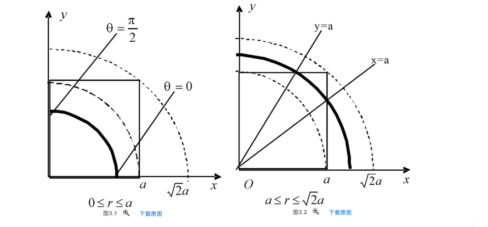

$$
\begin{cases}
0 \leq r \leq a & \quad \text{图3.1} \\
a \leq r \leq \sqrt{2a} & \quad \text{图3.2}
\end{cases}
$$

$$
I = \int_0^a dr \int_{0}^{\frac{\pi}{2}} f(r \cos θ, r \sin θ) rdrdθ + \int_a^{\sqrt{2a}} dr \int_{\arccos \frac{a}{r}}^{\arcsin \frac{a}{r}} f(r \cos θ, r \sin θ) rdr
$$

故θ从 $\arccos \frac{a}{r}$ 变化到 $\arcsin \frac{a}{r}$

##### 例题

#### 例 23.6

设有极坐标系下的累次积分

$$
\int_{\frac{\pi}{2}}^{\pi} \int_{0}^{1} f(\cos \theta, \sin \theta) r dr d\theta
$$

将累次积分 $J = \int_D f(x, y) d\sigma$ 化为:

$$
J = \int_{\frac{\pi}{2}}^{\pi} \int_{0}^{1} f(\cos \theta, \sin \theta) r dr d\theta
$$

其中, D 的极坐标表示 $D: \frac{\pi}{2} \leq \theta \leq \pi$, $0 \leq r \leq \sin \theta$, 于是给 D 的直角坐标表达为:

$$
\sqrt{2} - 1 \leq y \leq 1, 0 \leq x \leq \sin (\pi - \theta)
$$

$$
x^2 + \left( y - \frac{1}{2} \right)^2 \leq \frac{1}{4}, x \geq 0
$$

## 变更累次积分

##### 例题 1

设 $f(x, y)$ 在单位圆 $x^2 + y^2 \leq 1$ 上有连续一阶偏导数, 且在边界上取值为零, 证明:

$$
f(0, 0) = \lim_{n \to \infty} \frac{1}{n} \iint\limits_D \frac{f_x^2 + f_y^2}{x^2 + y^2} dxdy, \quad \text{其中} \ D \ \text{为圆环域} \ 0 \leq x^2 + y^2 \leq 1.
$$

$$
\iint\limits_D \frac{f_x^2 + f_y^2}{x^2 + y^2} dxdy = \int_0^1 \left[ \int_0^{2\pi} \frac{f_\rho^2 (\rho \cos \theta, \rho \sin \theta) + \frac{1}{\rho^2} f_\theta^2 (\rho \cos \theta, \rho \sin \theta)}{\rho} d \theta \right] d \rho
$$

$$
= \int_0^1 \frac{1}{\rho} \left[ \int_0^{2\pi} \frac{f_\theta^2 (\cos \theta, \sin \theta) d \theta}{\rho^2} \right] d \rho
$$

则 $\lim_{n \to \infty} \frac{1}{n} \iint\limits_D \frac{f_x^2 + f_y^2}{x^2 + y^2} dxdy = f(0, 0)$.

##### 例 2

设二维函数 $f(x, y)$ 在平面区域 $D = \{(x, y) | 0 \leq x \leq 1, 0 \leq y \leq 1 \}$ 上具有二阶连续偏导数, 在 $D$ 的边界上取零值, 且 $D$ 上有:

$$
\left| \frac{\partial^2 f}{\partial x^2} \right| \leq M,
$$

试证:

$$
\left| \iint\limits_D x y f_{xy} (x, y) dxdy \right| \leq \frac{M}{4}.
$$

> 法一

由题设知 $f(x, 0) = f(0, y) = 0$, 且

$$
\iint\limits_D xy f_{xy} (x, y) dxdy = \int_0^1 y \left[ \int_0^1 x f_{xy} (x, y) dx \right] dy = \int_0^1 y (1 - x) \frac{\partial^2 f}{\partial x^2} dx dy
$$

$$
= M \int_0^1 y (1 - x) dxdy = \frac{M}{4}.
$$

> 法二

设 $f(x, y) = f(x, y) - f(0, y)= x f_x (\xi, y) - x f_x (\xi, 0) = x y f_{xy} (\epsilon, \eta)$

$$
\iint\limits_D xy f_{xy} (x, y) dxdy \leq \iint\limits_D xy f_{xy} (\epsilon, \eta) dxdy \leq M \iint\limits_D (1 - x) dxdy = \frac{M}{4}.
$$

- 拉格朗日中值定理: $f(0, y) = 0$
- 拉格朗日中值定理：$f_x (\xi, 0) = 0$

##### (2011, 21 题, 11 分)

已知函数 $f(x,y)$ 具有二阶连续偏导数, 且 $f(1, y) = f(x, 1) = 0$，计算二重积分

$$

\iint\limits_D x y f_{xy}(x,y) dxdy = a,

$$

其中 $D = \{(x,y) | 0 \leq x \leq 1, 0 \leq y \leq 1 \}$.

$$

\iint\limits_D xy f_{xy}(x, y) dxdy = - \iint\limits_D x \left( \int_0^y \frac{\partial}{\partial y} \left( x y f_{xy}(x, y) \right) dy \right) dx = \int_0^1 \left[ xy f_{xy}(x, y) \right]_0^1 dx

$$

$$

\int_0^1 ydf(x,y) = y f(x, y) \Big|_0^1 - \int_0^1 f(x,y) dy = - \int_0^1 f(x,y) dy

$$

$$

\int_0^1 x \left( \int_0^1 f_y(x, y) dy \right) dx = - \int_0^1 x f(x, y) \Big|_0^1 dx

$$

$$

\int_0^1 x f_y(x, y) dx = \left[ xf(x, y) \right]_0^1 - \int_0^1 f(x, y) dx = - \int_0^1 f(x, y) dx

$$

$$

\iint\limits_D xy f_{xy}(x, y) dxdy = \int_0^1 f(x, y) dxdy = a.

$$

## 摆线的计算

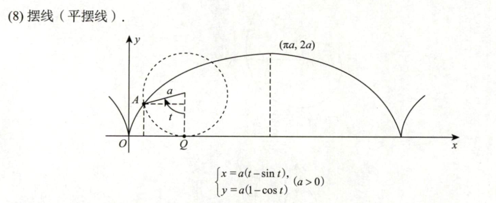
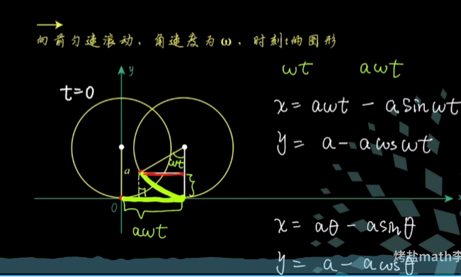
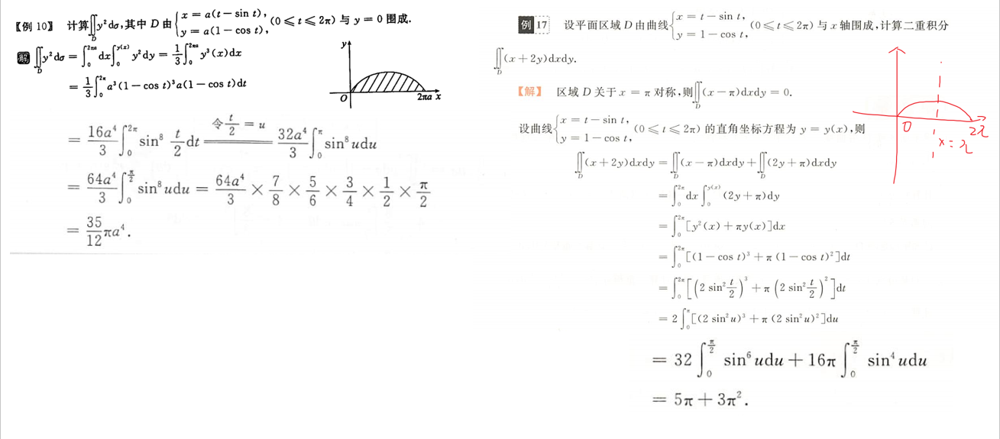

两者都是先按直角函数积分，最后再把参数方程代入进去，其中关键在于参数 t 的取值范围
左图 $x\in(0,2\pi a),t\in(0,2\pi)$，右图 $x\in(0,2\pi ),t\in(0,2\pi)$
先对直接函数积分，得出来一个表达式在，再把参数方程代入进去。为什么要转化成参数方程呢？因为从参数方程种不好得出直接坐标系下的函数关系，因此选择参数方程代入进去
不同点：
左右图的被积函数不一样。右图中含有 x,而积分区域关于 x= $\pi$ 对称，因此可以用奇函数的对称性来达到化简式子的效果

##### 一些结论

[【数学荟萃】第21期：摆线疑难问题汇总（含简便计算技巧）](https://zhuanlan.zhihu.com/p/688335708)

- **摆线长度**: $8 a$
- **摆线形心**: $(\pi a, \frac{4}{3} a)$
- 与 x 轴所围**区域形心：**$(\pi a, \frac{5}{6} a)$
- 与 x 轴所围的**面积**:$3 \pi a^2$
- 与 x 轴所围区域 **绕极轴（x 轴）** 旋转一周所形成旋转体的体积:$5 \pi^2 a^3$
- 与 x 轴所围区域 **绕 y 轴** 旋转一周所形成旋转体的体积:$6 \pi^3 a^3$
- 绕 **x 轴** 旋转一周的曲面表面积:$\frac{64}{3} \pi a^2$
- 绕 **y 轴** 旋转一周的曲面表面积:$16 \pi^2 a^2$

## 对称性

##### 普通对称性

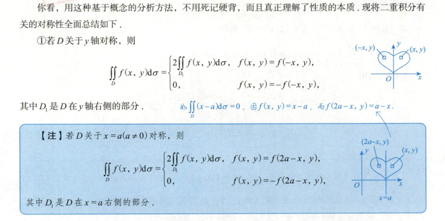
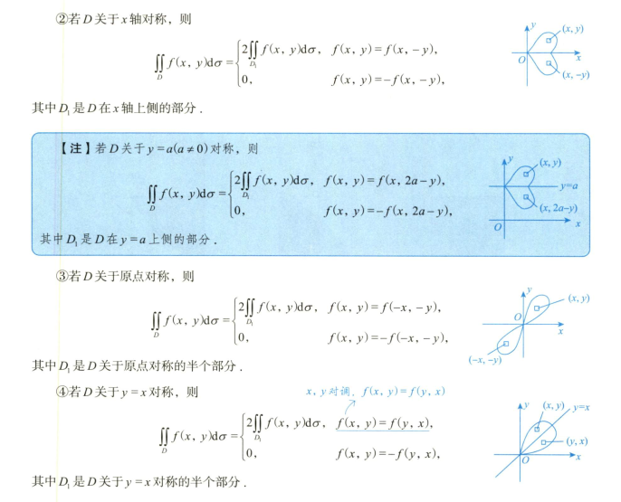

##### 轮换对称性

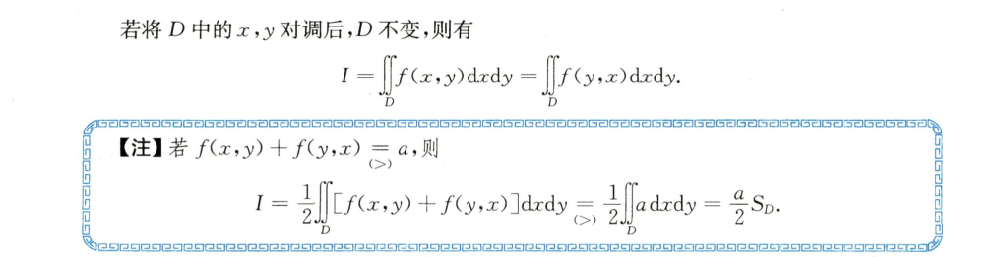

**核心**：积分区域关于 y = x 对称

##### 变量对称性

所谓变量对称性是指对积分区域和被积函数同时将 $y$ 和 $x$ 对调时，积分值不变。这不同于轮换对称性

当积分区域 $D$ 关于 $y = x$ 对称时，把被积函数中的 $y, x$ 互换，积分值也不变

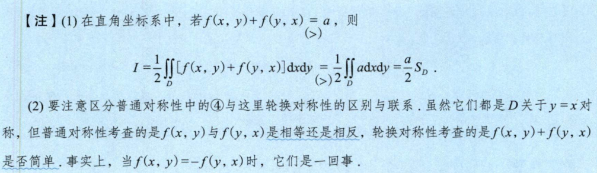
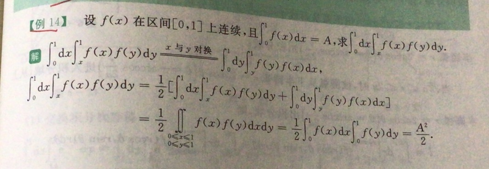

1. $\int_{0}^{1} f(x) dx = A$，则 $\int_{0}^{1} dx \int_{x}^{1} f(x) f(y) dy = \frac{A^2}{2}$

2. 设 $f(x)$ 在 $[0, 1]$ 上连续，且 $\int_{0}^{1} f(x) dx = A$，则

   $$

   \int_{0}^{1} \left[ \int_{x}^{1} f(t) dt + (1 - x) f(x) \right] dx = A

   $$

3. 设 $f(x)$ 在 $[0, 1]$ 上连续，且 $\int_{0}^{1} f(x) dx = A$，证明

   $$

   \int_{0}^{1} dx \int_{0}^{x} f(x) f(y) dy - \int_{0}^{1} dx \int_{x}^{1} f(x) f(t) dt = A^2

   $$

4. 设 $f(x)$ 在 $[0, 4]$ 上连续，且 $\int_{0}^{4} f(x) dx = A$，则

   $$

   \int_{0}^{4} dx \int_{\sqrt{x}}^{2} y f(x) f(y^2) dy = \frac{A^2}{4}

   $$

## 二重积分求导

[重积分求导题型_哔哩哔哩_bilibili](https://www.bilibili.com/video/BV19c411c7by/)

## 含偏导数的

- **方法 1**：分部积分：由结论推条件
- **方法 2**：分部积分由条件推结论

## 分段函数的二重积分

### 含绝对值的二重积分

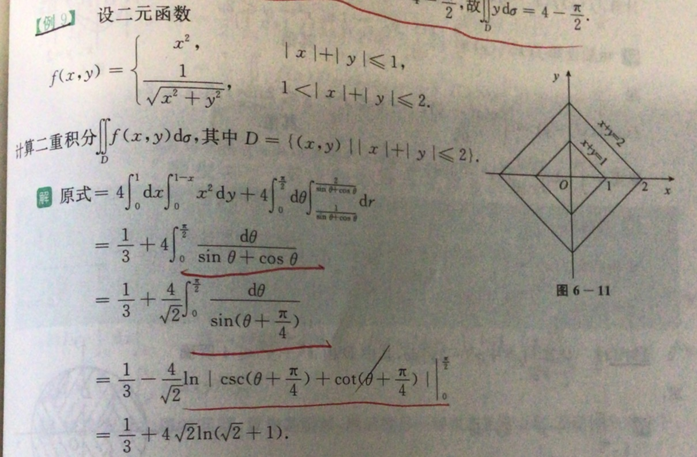

### 含取整函数的二重积分

 $[x + n] = [x] + n$，其中 $n$ 为整数

 $x - 1 < [x] \leq x$

 $\lim_{x \to 0^+} [x] = 0$；$\lim_{x \to 0^-} [x] = -1$。$\Rightarrow \lim_{x \to 0} [x] 不存在$

#### 例题

设 $A = \int_{0}^{2} \left[ e^x \right] dx$，$B = \iint \left( x^2 + xy + y^2 \right) dxdy$，$D = \{(x, y) \mid x^2 + y^2 \leq 2x + 2y\}$

则 $\frac{A}{B} =$

## 二重积分的变限积分

方法 1：直接求导，外层的 dy 保持不变，直接将 dx 那一部分进行求导，剩下的进行积分算出来的答案也是 6

方法 2：正规做法，先交换积分次序，尽可能地化简，换成了一重积分，再求导，主打一个简化运算

## 割补法求二重积分

## 双曲线函数

易错：容易忽略另外一部分积分区域

如何做：令 x=-x,y=-y,验证，观察函数的奇偶性

## 区间再现【切割化弦】

$$\tan x = \frac{\sin x}{\cos x}$$

## 二重积分比大小

#### 积分区间（域）相同

##### 直接比较被积函数大小

###### 一些常用的不等式

- $x \in \left(0, \frac{\pi}{4}\right)$
- $0 < \sin x < \cos x < \cot x$

###### 利用奇偶性

##### 积分可加性、保号性

#### 被积函数相同

###### 二重积分的性质

- 线性、可加性、保号性

###### 单调性

###### 常见不等式

###### 几何背景

###### 降维化为一维函数

###### 作差法

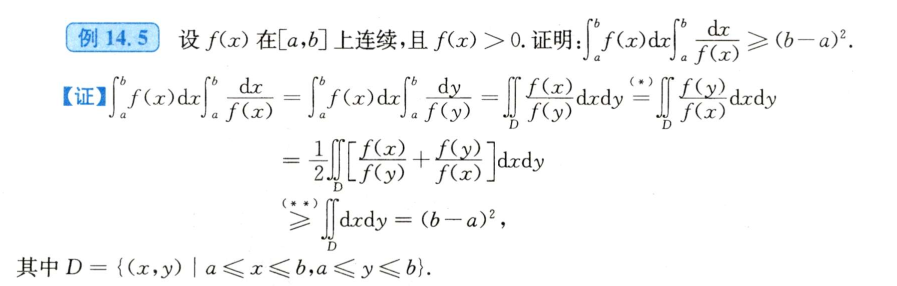

## 二重积分求极限

#### 二重积分极限中值

#### 换元

#### 交换积分次序

#### 改用极坐标

## 二重积分中值定理

**定理 1** 如果函数 $f(x,y)$ 在有界闭区域 $D$ 上连续，函数 $g(x,y)$ 在 $D$ 上可积且不变号，则存在 $(\xi, \eta) \in D$ 使得：

$$

\iint_D f(x,y)g(x,y) \, dx \, dy = f(\xi, \eta) \iint_D g(x,y) \, dx \, dy.

$$

**注释：** **定理中要求 $f(x,y)$ 在有界闭区域 $D$ 上连续**，函数 $g(x,y)$ 在 $D$ 上可积时，时不一定成立，但对一些部分不连续函数，如科西函数是成立的

- 例：设 $D: 0 \leq x \leq 1, 0 \leq y \leq 1$，$(\xi, \eta) \in \mathbb{R}$，定义函数 $g(x,y) = \alpha_y$ 当 $x \neq y$，$g(x,y) = 0$ 当 $x = y$。显然，$g(x,y)$ 在 $D$ 上可积但不连续。容易得到：

$$

\iint_D g(x,y) \, dx \, dy = 0.

$$

因此，取 $\xi = \eta$ 使 $f(\xi, \eta) \iint_D g(x,y) \, dx \, dy = f(\xi, \eta) \times 0 = 0$

在上述的例子中，二重积分中值定理中 $f(x,y)$ 在有界闭区域 $D$ 上连续是充分条件，而非必要条件，也就是说可以允许一些部分不连续的函数，二重积分中值定理依然适用

**引理 2** 设函数 $f(x,y)$ 在有界区域 $D$ 上可积，则 $F(g(x,y)) > 0$，则：

$$

\iint_D f(x,y) \, dx \, dy > 0.

$$

**定理 2** 若函数 $f(x,y)$ 在有界区域 $D$ 上可积，且有介值性，函数 $g(x,y)$ 在 $D$ 上可积且不变号，则存在一点 $(\xi, \eta) \in D$ 使得：

$$

\iint_D f(x,y)g(x,y) \, dx \, dy = f(\xi, \eta) \iint_D g(x,y) \, dx \, dy.

$$

### 能使用二重积分中值定理的三种情况

1. 如果 $\lim f(\epsilon, \delta) = 0$，而且 $f(\epsilon, \delta)$ 可以使用**夹逼准则**，则使用 $f(\epsilon, \delta)$ 来逼近后的式子

2. 如果 $\lim f(\epsilon, \delta) = 0$，但是 $S_{D}$ 与分母同阶或者大于分母次方，也可以使用二重积分中值定理

3. 如果 $\lim f(\epsilon, \delta) \neq 0$ ,可根据 f(x,y)f(x, y)f(x,y) 的具体形式判断使用。

---

设 $m, n$ 都是整数，如果 $\lim f(\epsilon, \delta) = 0$，求：

$$

\lim_{t \to 0^+} \frac{\iint_{x^2 + y^2 \leq t^2} f(x, y) \, dx \, dy}{r^n}

$$

1. 当 $m, n \geq n$ 时，使用二重积分中值定理或者极坐标都可以
2. 当 $m \leq n$ 时，二重积分中值定理可能不行

## 待整理

  

