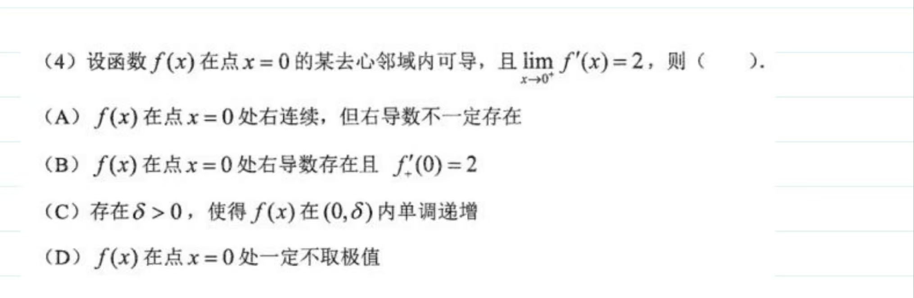
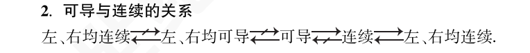

## 连续、间断点

- 分母为 0
- 函数无意义
- 突变点

### 连续

设函数 $y=f(x)$ 在点 $x_0$ 的某一邻域内有定义，若

$$
\lim_{x \to x_0} f(x) = f(x_0)
$$

则称函数 $f(x)$ 在点 $x_0$ 连续

**ε-δ 定义**：$f(x)$ 在点 $x_0$ 连续等价于 $\forall \varepsilon > 0$，$\exists \delta > 0$，当 $|x - x_0| < \delta$ 时，有 $|f(x) - f(x_0)| < \varepsilon$

若 $\lim_{x \to x_0^-} f(x) = f(x_0^-)$ 存在且等于 $f(x_0)$，即 $f(x_0^-) = f(x_0)$，则称函数 $f(x)$ 在点 $x_0$ **左连续**
若 $\lim_{x \to x_0^+} f(x) = f(x_0^+)$ 存在且等于 $f(x_0)$，即 $f(x_0^+) = f(x_0)$，则称函数 $f(x)$ 在点 $x_0$ **右连续**

- 函数在点 $x_0$ 连续等价于函数在点 $x_0$ 左连续且右连续
- 在区间上每一点都连续的函数，叫做在该区间上的连续函数，或者称函数在该区间上连续

### 间断点的分类

间断点可以分为两类：

1. **第一类间断点**：当函数在某点的左右极限都存在时，我们称之为第一类间断点，具体又分为：
   - **可去间断点**：如果左右极限相等，我们称之为可去间断点
   - **跳跃间断点**：如果左右极限不相等，我们称之为跳跃间断点

2. **第二类间断点**：当函数在某点的至少一个方向的极限不存在时，我们称之为第二类间断点，具体又分为：
   - **无穷间断点**：至少一侧极限发散到无穷
   - **震荡间断点**：至少一侧极限不存在，且表现为震荡

$$
\begin{cases}
\text{单侧极限都存在} \Rightarrow \text{第一类间断点}
\begin{cases}
左 = 右 \Rightarrow \text{可去} \\
左 \neq 右 \Rightarrow \text{跳跃}
\end{cases} \\
\text{单侧极限至少有一个不存在} \Rightarrow \text{第二类间断点}
\begin{cases}
\text{无穷} \\
\text{震荡}
\end{cases}
\end{cases}
$$

- 可去间断点即可以去掉的间断点，通常我们会采用修改、补充定义的方式使其连续
- 而第二类间断点是只要沾哪个就是哪个，即如果有某一侧极限发散即为二类，发散到无穷即为无穷间断，此时无需考虑另一侧，那么如果一侧是无穷另一侧为震荡呢，考研不会出这种情况给大家判断，我们笼统的称其为第二类间断点即可

### 连续性相关结论

###### 一般连续性结论

1. **$f(x)$ 在 $x_0$ 处连续 ⇒ $f(x)$ 在 $x_0$ 处、邻域内有定义**
2. $f(x)$ 在 $x_0$ 处连续 ⇒ $\lim_{x \to x_0} f(x) = f(x_0)$

###### 连续函数保号性

$f (x)$ 在 $x = a$ 连续，$f (a) \neq 0$，则存在一个邻域使 $f (x)$ 与 $f (a)$ 同号

【证明】由连续定义，对任意正数 $\varepsilon$，存在正数 $\delta$，当 $|x - a| < \delta$ 时，$|f(x) - f(a)| < \varepsilon$，

取 $\varepsilon = \dfrac{|f(a)|}{2}$，则

$$
f(a) - \dfrac{|f(a)|}{2} < f(x) < f(a) + \dfrac{|f(a)|}{2},
$$

若 $f(a) > 0$，则

$$
0 < f(a) - \dfrac{|f(a)|}{2} = f(a) - \dfrac{f(a)}{2} < f(x),
$$

若 $f(a) < 0$，则

$$
f(x) < f(a) + \dfrac{|f(a)|}{2} = f(a) + \dfrac{f(a)}{2} < 0，
$$

综上所述，存在一个邻域使 $f(x)$ 与 $f(a)$ 同号

###### 一阶可导与可微关系

1. **可导性蕴含连续性** 如果函数 $f(x)$ 在 $x_0$ 处可导，则 $f(x)$ 在 $x_0$ 处连续。**例子**：函数 $f(x) = |x|$ 在 $x = 0$ 连续但不可导
2. **可导性与导数存在的等价关系** 函数 $f(x)$ 在 $x_0$ 处可导，当且仅当 $f(x)$ 在 $x_0$ 处的导数存在
3. **导数存在且有定义即可导** 函数 $f(x)$ 在 $x_0$ 处可导，当且仅当 $f(x)$ 在 $x_0$ 处的导数存在且有确定的值

4. **导数的极限定义** 函数 $f(x)$ 在 $x_0$ 处可导，当且仅当以下极限存在：$$ \lim_{h \to 0} \frac{f(x_0 + h) - f(x_0)}{h} $$

###### 高阶导数可微性相关结论

1. **可导性与导数存在的等价关系** 函数 $f(x)$ 在 $x_0$ 处可导，当且仅当 $f(x)$ 在 $x_0$ 处的导数存在
2. **导数存在且有定义即可导** 函数 $f(x)$ 在 $x_0$ 处可导，当且仅当 $f(x)$ 在 $x_0$ 处的导数存在且有确定的值

###### 函数单调性相关结论

1. **可导性不等同于单调性** 函数在某点可导并不意味着该函数在该点附近是单调的。**例子**：函数 $f(x) = x^3$ 在所有点可导，但在不同区间内可能是递增或递减的
2. **函数有定义不等同于可导** 函数在某点有定义并不保证该函数在该点可导。**例子**：函数 $f(x) = |x|$ 在 $x = 0$ 处有定义但不可导

## 导数

利用 $\lim_{\boxed{} \to 0} \frac{f (x_0 + \boxed{}) - f (x_0)}{\boxed{}} = f' (x_0)$ 来计算极限，有两个注意事项

1. 一点处导数是 $\frac{f(x_0 + \boxed{}) - f(x_0)}{\boxed{}}$ 这个式子取极限得到的，很多同学在计算中不写极限符号，直接得到 $\frac{f(x_0 + \boxed{}) - f(x_0)}{\boxed{}} = f'(x_0)$，这是错误的

2. $f'(x_0)$ 存在 $\iff \lim_{x \to +\infty} \frac{f(x_0 + \frac{1}{x}) - f(x_0)}{\frac{1}{x}}$ 存在 $\implies \lim_{n \to +\infty} \frac{f(x_0 + \frac{1}{n}) - f(x_0)}{\frac{1}{n}}$ 存在

$$
\lim_{n \to +\infty} \frac{f(x_0 + \frac{1}{n}) - f(x_0)}{\frac{1}{n}} \quad 存在 \iff \lim_{x \to +\infty} \frac{f(x_0 + \frac{1}{x}) - f(x_0)}{\frac{1}{x}} \quad 存在
$$

导数通常解释为函数在一点处的瞬时变化率，这是通过将平均变化率 $\frac{\Delta f(x)}{\Delta x}$ 的极限来定义的，具体表达式为：

$$
f'(x) := \lim_{\Delta x \to 0} \frac{\Delta f(x)}{\Delta x} = \lim_{\Delta x \to 0} \frac{f(x + \Delta x) - f(x)}{\Delta x}
$$

$$\Rightarrow
f'(x_0) = \lim_{x \to x_0} \frac{f(x) - f(x_0)}{x - x_0} = \lim_{\square \to 0} \frac{f(x_0 + \square) - f(x_0)}{\square}
$$

这可以进一步简化为：

$$
\Delta x \to 0, \frac{f(x + \Delta x) - f(x)}{\Delta x} = f'(x) + o(1),
$$

$$
\Delta x \to 0, f(x + \Delta x) = f(x) + f'(x) \Delta x + o(\Delta x)
$$

使用增量 $h$，我们有：

$$
f(x + h) = f(x) + f'(x)h + o(h), \quad h \to 0 \quad \text{(增量式)}
$$

$$
f(x) = f(x_0) + f'(x_0)(x-x_0) + o(x-x_0), \quad x-x_0 \to 0 \quad \text{(一般式)}
$$

### 单侧导数与导数单侧极限关系

$f'_{x_0}(x_0)$ 和 $\lim_{x \to x_0^+} f'(x)$ 的关系：

$$
f'_{-}(x_0) = \lim_{x \to x_0^-} \frac{f(x) - f(x_0)}{x - x_0} = \lim_{\square \to 0^-} \frac{f(x_0 + \square) - f(x_0)}{\square}
$$

$$
f'_{+}(x_0) = \lim_{x \to x_0^+} \frac{f(x) - f(x_0)}{x - x_0} = \lim_{\square \to 0^+} \frac{f(x_0 + \square) - f(x_0)}{\square}
$$

$$
f'(x_0) \text{ 存在} \iff f'_{+}(x_0) \text{及} f'_{-}(x_0) \text{都存在且相等}
$$

1. 当 $f'_{x_0}(x_0)$ 存在时，$\lim_{x \to x_0^+} f'(x)$ 不一定存在

   例如取

   $$
   f(x) = \begin{cases}
   x^2 \sin \frac{1}{x}, & x \neq 0, \\
   0, & x = 0. \\
   \end{cases}
   $$

   由导数定义可得 $f'(0) = 0$，但 $f'(x)$ 的右侧极限 $\lim_{x \to 0^+} f'(x)$ 不存在

2. 当 $\lim_{x \to x_0^+} f'(x)$ 存在时，$f'_{x_0}(x_0)$ 不一定存在

   例如取 $f (x) = x \ (x ≠ 0)$，当 $x \neq 0$ 时，故 $\lim_{x \to 0^+} f'(x) = 1$，但 $x = 0$ 时 $f(x)$ 无定义

   因此 $f'(x)$ 不存在

3. 若 $f(x)$ 的右侧导数 $f'_{x_0^+}(x_0)$ 存在，则当且仅当 $\lim_{x \to x_0^+} f'(x)$ 都存在时，两者必然相等

   由导数定义可得：$f'_{x_0}(x_0) = \lim_{x \to x_0} \frac{f(x) - f(x_0)}{x - x_0}$ 存在时，$\lim_{x \to x_0^+} f'(x) = f'_{x_0}(x_0)$，因此两者相等

### 可导性与连续性

1. 设 $f (x)$ 在 $x_0$ 的去心领域内有定义，则 $g (x) = f (x)|x - x_0|$ 在 $x_0$ 处可导的充要条件是

   $f(x)$ 在 $x_0$ 处的左右极限都存在且互为相反数

2. 若 $f(x)$ 在 $x_0$ 处可导，则 $|f(x)|$ 在 $x_0$ 处的可导性为：

   当 $f(x_0) \neq 0$ 时，$|f(x)|$ 在 $x_0$ 处可导；

   当 $f(x_0) = 0$ 时，$|f(x)|$ 在 $x_0$ 处可导的充要条件是 $f'(x_0) = 0$；

   当 $f(x_0) = 0$ 时，$|f(x)|$ 在 $x_0$ 处不可导的充要条件是 $f'(x_0) \neq 0$

   综上可知，判断含绝对值函数的可导性时，只需要判断零点处的可导性，而非零点处处可导

3. 设 $f(x)$ 在 $x_0$ 处连续时，则 $g(x) = f(x)|x - x_0|$ 在 $x_0$ 处可导的充要条件是：$f(x_0) = 0$

   **【注】** 研究 $g(x)$ 在零点 $x_0$ 处的可导性，关键就在于判断 $g(x)$ 在零点 $x_0$ 处有没有额外的保零因子 $f(x_0) = 0$

4. $(x - a)^n |x - a|$ 在 $x = a$ 处有 $n$ 阶导, 在其他点处任意可导

- **可导一定连续**：如果函数在某点可导，则该点一定连续
  - 例如：$f(x) = |x|$ 在 $x=0$ 处连续，但不可导
- **连续不一定可导**：函数在某点连续，并不意味着该点可导

### 导数的连续性

- 导函数的存在意味着函数在该点连续
- 导函数在某点 $x_0$ 的连续性可以用极限表示：

$$
f'(x) \text{在} x = x_0 \text{连续} \iff \lim_{x \to x_0} f'(x) = f'(x_0)
$$

$$
\iff \lim_{x \to x_0} \lim_{\Delta x \to 0} \frac{f(x + \Delta x) - f(x)}{\Delta x} = f'(x_0)
$$

### Darboux 定理（导数的介值性）

- 如果函数 $f(x)$ 在闭区间 $[a, b]$ 上可导，则其导数 $f'(x)$ 在该区间上可以取遍 $f'(a)$ 与 $f'(b)$ 之间的所有值

**推论：**

- 如果函数 $f(x)$ 在闭区间 $[a, b]$ 上可导，则其导数 $f'(x)$ 在开区间 $(a, b)$ 内至多存在有限个断点
  - 例如：某函数在 $x=0$ 处可导，但其导函数在 $x=0$ 处出现震荡间断

$$
f(x) = \begin{cases}
x^2 \sin \frac{1}{x}, & x \neq 0 \\
0, & x = 0; 补充定义使之连续
\end{cases}
$$

$$
f'(x) = \begin{cases}
2x \sin \frac{1}{x} - \cos \frac{1}{x}, & x \neq 0 \\
0, & x = 0; 利用导数定义求得
\end{cases}
$$

这就体现了震荡这种间断的特殊性，我们可以总结一下：

在 $x = 0$ 处

$$
\begin{cases}
x^{-1} \sin \frac{1}{x} & \text{无界震荡} \\
x^0 \sin \frac{1}{x} & \text{有界震荡}
\end{cases}
$$

$$
\begin{cases}
x^1 \sin \frac{1}{x} & \text{连续但不可导} \\
x^2 \sin \frac{1}{x} & \text{可导但导函数震荡（在补充定义的前提下）} \\
\end{cases}
$$

### 可导和导函数连续在泰勒视角下的形式

$$
f(x) = f(x_0) + f'(x_0)(x - x_0) + o(x - x_0) \quad \text{可导}
$$

$$
f'(x) = f'(x_0) + o(1) \quad \text{导函数连续}
$$

乍一看上述求导得下式，应该可以互推，但是 $o(x-x_0)$ 求导真的等于 $o(1)$ 吗?
显然 $x \rightarrow 0$, $x^2\sin(1/x) = o(x)$，但是 $(x^2\sin(\frac{1}{x}))' = 2x\sin(\frac{1}{x}) - \cos(\frac{1}{x})$ 并不是一个无穷小量
所以从泰勒的视角让我们能很自然地把目光聚焦到问题的关键，就是这个不起眼的小 o！只要把它展开了，再也没有什么抽象的、神秘的，一切都清晰明了了
再看二阶导数，当 $f$ 在 $x = x_0$ 二阶可导时有：

$$
f(x) = f(x_0) + f'(x_0)(x - x_0) + \frac{1}{2}f''(x_0)(x - x_0)^2 + o((x - x_0)^2)
$$

简单移项一下：

$$
\frac{f(x) - f(x_0)}{x - x_0} = f'(x_0) + \frac{1}{2}f''(x_0)(x - x_0) + o(x - x_0)
$$

继续移项，再取极限得：

$$
f''(x_0) = 2\lim_{x \rightarrow x_0} \frac{f(x) - f(x_0) - f'(x_0)(x - x_0)}{(x - x_0)^2}
$$

当然也等价于：

$$
f'(x) = f'(x_0) + f''(x_0)(x - x_0) + o(x - x_0)
$$

$$
\Rightarrow f''(x_0) = \lim_{x \rightarrow x_0} \frac{f'(x) - f'(x_0)}{x - x_0}
$$

### 函数在一点的可导性

### 复合函数求导

- 当复合函数在某点处内外都可导时，可以用链式求导法则求解该点导数
- 当复合函数在某点处，内外都不可导或者内外有一个不可导时，只能表明无法用链式求导法则求解该点导数，并不代表复合函数在该点的导数不存在

## 单调

设函数 $y = f(x)$ 在区间 $[a,b]$ 上连续，并且在开区间 $(a,b)$ 内可导，则有：

1. **单调递增性**：如果对于所有 $x \in (a,b)$，都有 $f'(x) \geq 0$，且等号仅在有限多个点成立，那么 $f(x)$ 在 $[a,b]$ 上是单调递增的
2. **单调递减性**：如果对于所有 $x \in (a,b)$，都有 $f'(x) \leq 0$，且等号仅在有限多个点成立，那么 $f(x)$ 在 $[a,b]$ 上是单调递减的

若 $\forall x, y \in E, x \neq y, (f(x) - f(y))(x - y) > 0$，则称 $f(x)$ 严格单调递增
若 $\forall x, y \in E, x \neq y, (f(x) - f(y))(x - y) \geq 0$，则称 $f(x)$ 单调递增，也称单调不减

### 小结【函数单调性的判定】

1. **连续函数** $f(x)$ 在定义域上 _单调_ 增加：
    - $\text{在定义域上} f'(x) > 0$ ❌
    - $\text{在定义域上} f'(x) \geq 0$ ✅

    反例：$f(x) = x^3$ 当 $x = 0$ 时，$f'(x) = 3x^2$ 且 $f'(x) = 0$

2. **可导函数** $f(x)$ 在定义域上 _单调_ 增加：
    - $\text{在定义域上} f'(x) > 0$ ❌
    - $\text{在定义域上} f'(x) \geq 0$ ✅

3. **可导函数** $f(x)$ 在定义域上 _严格单调_ 增加：
    - $\text{在定义域上} f'(x) > 0$ ❌
    - $\text{在定义域上} f'(x) \geq 0 \quad (\text{等号只在有限个点处取得})$ ✅

    示例：$f(x) > x$ 时，$f(x) = x^2$，$f'(x) = 2x$

4. 若 $f(x)$ 在定义域上处处可导且 $f'(x) > 0$，则 $f(x)$ 在定义域上严格单调递增。❌
     反例：$f(x) = - \frac{1}{x}$，有 $f'(x) > 0$

5. 若 $f(x)$ 在定义区间上处处可导且 $f'(x) > 0$，则 $f(x)$ 在定义区间上严格单调递增。✅

6. **若 $f(x)$ 在定义区间上处处可导且 $f'(x) \geq 0$，
  则 $f(x)$ 在定义区间上严格单调递增。❌
  若 $f(x)$ 为常函数即可成为反例
7. 🌟，复合函数的单调性（同增异减）

- $f(x)$ 单调增加，$g(x)$ 单调增加，则 $f(g(x))$ 单调增加
- $f(x)$ 单调减少，$g(x)$ 单调减少，则 $f(g(x))$ 单调增加
- $f(x)$ 单调减少，$g(x)$ 单调增加，则 $f(g(x))$ 单调减少
- $f(x)$ 单调增加，$g(x)$ 单调减少，则 $f(g(x))$ 单调减少

> [!note] 反之不一定成立

## 零点 -- 根的个数

### 1. 存在性

### 方法 1: 零点定理

### 方法 2: 罗尔定理

### 2. 根的个数

#### 方法 1: 单调性

#### 方法 2: 罗尔定理推论

_罗尔定理推论_：若在区间 I 上 $f'(x) \neq 0$，则方程 $f(x) = 0$ 在 I 上最多有 n 个实根

_罗尔定理_：设 $f(x)$ 在 $[a, b]$ 上连续，在 $(a, b)$ 内可导，且 $f(a) = f(b)$，那么至少存在一个 $\xi \in (a, b)$，使 $f'(\xi) = 0$

---

设 $x_0$ 是方程 $f(x) = 0$ 的 n 重根，即 $f(x) = (x - x_0)^n g(x)$，且 $g(x_0) \neq 0$。若 $g(x)$ 具有 n 阶导数，则：

- (1) 当 $n = 1$ 时，$f'(x_0) = 0$ 的根广义为 0 重根，依此类推，$x_0$ 是 $f^{(k)}(x_0) = 0$ 的 n - k 重根，k = 1
- (2) 若导数阶数较高，根的重数减少一次

---

见到等式右端不为 0，无脑移项，移到一端

涉及到参数，优先考虑分离变量 $k = g(x)$，将方程根的个数，转化为直线 $y = k$ 和曲线 $y = g(x)$ 的交点个数。画图，只研究 $g(x)$ 的图像即可

**错解：**

- 应结合记得转化后分段和特殊情况
- 分离参数应注意讨论分母为 0 的特殊情况

---

- 方法一：画图像，研究单调性
- 定义域、奇偶性、端点函数值、导数判断单调极值
- 方法二：代入特殊值，如 $x = 0, \pm 1, \pm 2$，先找出至少存在 k 个根，之后再利用罗尔定理推论，k 阶导不等于 0，最多存在 k 个根，夹逼，只能有 k 个根

记得结合函数的奇偶性，且研究一半区间即可

## 极值

### 定义

对于函数 $f(x)$，若存在点 $x_0$ 的某个邻域内，对于任意一点 $x$，均有

$$f(x) \leq f(x_0) \quad \text{或} \quad f(x) \geq (x_0)$$

成立，则称 $f(x_0)$ 为函数 $f(x)$ 的极大值或极小值，$x_0$ 为极值点

> [!note] 严格极值和广义极值
> 在考研大纲和 wzx lyf 的题目中极值基本都认为是严格极值即没有等于
> zy 的书中则是广义极值

### 一阶可导点是极值点的必要条件

设 $f(x)$ 在 $x=x_0$ 处可导，且在点 $x_0$ 处取得极值，则必有 $f'(x_0)=0$

- **例子**：
  - 对于 $y = x^2$，在 $x=0$ 处 $f'(0)=0$，且取得极小值
  - 对于 $y = x^3$，虽然 $f'(0) = 0$，但在 $x=0$ 处没有取得极值
    - $f'(0) = 0$ 必要但不充分
  - 对于 $y = |x|$，在 $x = 0$ 处取得极小值，但是 $f'(0)$ 不存在

> **注意**：
>
> - 导数为 0 的点称为函数的**驻点**
> - 极值点必为驻点，但驻点不一定是极值点。?
>
> - **极值点** = _驻点_ + _不可导点_

### 第一充分条件：一阶导数

设函数 $f(x)$ 在 $x = x_0$ 处连续，并且在 $x_0$ 的某个去心邻域内可导

- **判定规则**：
  - 如果 $f'(x)$ 在 $x_0$ 的左侧从正变负，右侧从负变正，则点 $(x_0, f(x_0))$ 是曲线的**极大值点**
  - 如果 $f'(x)$ 在 $x_0$ 的左侧从负变正，右侧从正变负，则点 $(x_0, f(x_0))$ 是曲线的**极小值点**
  - 如果 $f'(x)$ 在 $x_0$ 的左侧和右侧符号相同，则点 $(x_0, f(x_0))$ 是曲线的**拐点**，不是极值点

> 判断 _驻点_ or _不可导点_ 是否存在极值点

### 第二充分条件：二阶导数

设函数 $f(x)$ 在 $x = x_0$ 处二阶可导，且 $f'(x_0) = 0$，$f''(x_0)$ 存在且不等于 0

- **判定规则**：
  - 若 $f''(x_0) > 0$，则点 $(x_0, f(x_0))$ 是曲线的**极小值点**
  - 若 $f''(x_0) < 0$，则点 $(x_0, f(x_0))$ 是曲线的**极大值点**

> 判断 _驻点_ 是否存在极值点
> 若 $f''(x_0) = 0$ 考虑用 _第一充分条件_ 或者 _定义_

### 第三充分条件：高阶导数

设函数 $f(x)$ 在 $x = x_0$ 处 $n$ 阶可导，且 $f^{(m)}(x_0) = 0$（$m = 1, 2, \ldots, n-1$），$f^{(n)}(x_0)$ 存在且不等于 0

- **判定规则**：
  - 若 $n$ 为偶数且 $f^{(n)}(x_0) > 0$，则点 $(x_0, f(x_0))$ 是曲线的**极小值点**
  - 若 $n$ 为偶数且 $f^{(n)}(x_0) < 0$，则点 $(x_0, f(x_0))$ 是曲线的**极大值点**
  - 若 $n$ 为奇数且 $f^{(n)}(x_0) \neq 0$，则点 $(x_0, f(x_0))$ 不是极值点

### 极值相关易错概念

1. **若 $f(x)$ 为 $[-a, a]$ 的偶函数，则 $x = 0$ 是 $f(x)$ 的极值点。**

   错误。反例 $f(x) = \begin{cases}
   x^2 \sin \frac{1}{x}, & x \neq 0, \\
   0, & x = 0. \\
   \end{cases}$

   $f(0) = 0$，由于 $f(x) = x^2 \sin \frac{1}{x}$ 在 $[0, x]$ 上下降幅度，因此 $x = 0$ 不发生极值。使得极值的偶函数值 $f(0)$ 小或更值极大

   使 $f(0) = 0$ 不是极值

2. **若 $f(x)$ 在 $x_0$ 处取极值，则 $f(x)$ 在 $x_0$ 的左、右导数极值等值。若 $f(x)$ 的导数等值相等。**

   错误。反例 $f(x) = \begin{cases}
   -x, & x < 0, \\
   0, & x = 0. \\
   \end{cases}$

   在该情况下，导数函数和极值极大值相等且极限值相等

3. **若非连续函数 $f(x)$ 只在点 $x_0$ 处取极值，则 $f(x)$ 的左、右连续极值在 $x_0$ 处的极值相等。**

   错误。反例 $f(x) = \begin{cases}
   -2x^3 - x + 1, & x \neq 0, \\
   \frac{1}{x}, & x = 0. \\
   \end{cases}$

   导数 $f(x)$ 不一定具有连续性极值在 $x_0$ 处有相等

4. **若函数 $f(x)$ 在 $x_0$ 处不连续，则 $x_0$ 是 $f(x)$ 的极值点。**

   错误。若 $f(x)$ 在区间极限点不具连续性

5. **若 $f(x)$ 存在 $f''(x_0) > 0$ 且 $f'(x_0) = 0$，则函数 $f(x)$ 在 $x_0$ 存在极大值？**

   不对，反例 $f(x) = x^4$，则 $f(0) = 0$，使得 $f(x) = 0$ 极值在 $x_0$ 存在极值

   而 $f''(0) = 0$。因此 $f(x)$ 在 $x = 0$ 发散极大值

## 凹凸性分析 $f'' (x)$

### 定义 1：基于中点和平均值的凹凸性 【区间上连续】

- **凹函数**：设函数 $f(x)$ 在**区间 $I$ 上连续**。如果对于区间 $I$ 上任意两点 $x_1, x_2$，总满足

    $$f\left(\frac{x_1 + x_2}{2}\right) \leq \frac{f(x_1) + f(x_2)}{2}$$

    则称 $f(x)$ 在区间 $I$ 上是凹函数

- **凸函数**：同样地，如果对于任意两点 $x_1, x_2$，总满足

    $$f\left(\frac{x_1 + x_2}{2}\right) \geq \frac{f(x_1) + f(x_2)}{2}$$

    则称 $f(x)$ 在区间 $I$ 上是凸函数

### 定义 2：基于切线的凹凸性 【开区间内可导】

- **凹函数**：设函数 $f(x)$ 在**闭区间 $[a,b]$ 上连续，并在开区间 $(a,b)$ 内可导**。若对于 $(a,b)$ 内任意的 $x$ 及 $x_0$（$x \neq x_0$），均有

    $$f(x_0) + f'(x_0)(x-x_0) \leq f(x)$$

    则称 $f(x)$ 在 $[a,b]$ 上是凹的

    $$f(x_0) + f'(x_0)(x-x_0) ≥ f(x)$$

    则称 $f(x)$ 在 $[a,b]$ 上是凸的

### 定义 3：基于二阶导数的凹凸性【区间上二阶可导】

- **凸函数**：设函数 $f(x)$ 在区间 $I$ 上二阶可导
  - 若对于任意 $x \in I$，有 $f''(x) > 0$，则称 $f(x)$ 在 $I$ 上是**凸的**

- **凹函数**：设函数 $f(x)$ 在区间 $I$ 上二阶可导
  - 若对于任意 $x \in I$，有 $f''(x) < 0$，则称 $f(x)$ 在 $I$ 上是**凹的**

### 例题

## 拐点

#### 定义

连续曲线的凹弧与凸弧的分界点，即曲线的凹凸性发生改变的点,称为该曲线的拐点

#### 二阶可导点是拐点的必要条件

设 $f''(x_0)$ 存在，且点 $(x_0, f(x_0))$ 为曲线的拐点

- **结论**：则有 $f''(x_0) = 0$

#### 拐点的三个充分条件

###### 第一充分条件

设函数 $f(x)$ 在点 $x = x_0$ 处连续，并且在点 $x = x_0$ 的某去心邻域内**二阶导数存在**

- 如果在该点的左右邻域内，二阶导数值异号（即，$f''(x)$ 在 $x_0$ 左侧的符号与在 $x_0$ 右侧的符号不同），则点 $(x_0, f(x_0))$ 为曲线的拐点

###### 第二充分条件

设函数 $f(x)$ 在点 $x = x_0$ 处**三阶可导**，
且 $f''(x_0) = 0$，$f'''(x_0) \neq 0$

- 若 $f'''(x_0) \neq 0$，则点 $(x_0, f(x_0))$ 为曲线的拐点

###### 第三充分条件

设函数 $f(x)$ 在点 $x = x_0$ 处 **$n$ 阶可导**，
且 $f^{(m)}(x_0) = 0$（$m = 2, 3, \ldots, n-1$），$f^{(n)}(x_0) \neq 0$

- 若 $n$ 为奇数且 $f^{(n)}(x_0) \neq 0$，则点 $(x_0, f(x_0))$ 为曲线的拐点

## 渐进线

- 铅直渐近线
- 水平渐进性、斜渐近线

### 找点（定义域）

- 无定义点 铅直渐近线
  - 函数的无定义点 (tanx)
  - 定义区间的端点
  - 分段函数的分段点
- 正负无穷 水平渐进性或者斜渐近线（二者同时最多只有一种存在）

### 计算

#### 无定义点 铅直渐近线

如果

$$
\lim_{x \to x_0^+} f(x) = \infty \quad \text{或} \quad \lim_{x \to x_0^-} f(x) = \infty
$$

则存在铅直渐近线 $x=x_0$

> 此处的 $x_0$ 或是函数的无定义点，或是定义区间的端点，或是分段函数的分段点

一般考虑：

- 分母不为 0
- $\log_a{f(x)} 中 f(x)$ > 0
- 偶次根 $\sqrt[n]{f(x)}$ 中 f(x) ≥ 0
- ${f(x)}^0$ 中 f(x) ≠ 0

- " 或 "，单边无穷即可
- 对于 $x_{0}$ 来说，$f(x_0^+)$ 或 $f(x_0^-)$ 任意一个为无穷即可
- $\arctan {\frac{1}{(x-1)(x-2)}}$
  - 尽管 1 和 2 是无定义点，但是 $\arctan x \in [-\frac{\pi}{2}, \frac{\pi}{2}]$ 有界 无铅直渐近线
- $\tan{\frac{1}{x}}$
  - 间断点：x = 0，$\frac{1}{x} = \frac{(2k+1)\pi}{2}$
- $\sqrt{1+x^2}$
  - $x \to + \infty$ 时，$\sqrt{1+x^2} = x$
  - $x \to - \infty$ 时，$\sqrt{1+x^2} = -x$

#### 正负无穷点 水平渐近线 or 斜渐近线

- $\lim_{x \to \infty} f(x) = A$
- 通常无穷是正负无穷两种，具体看定义域包含哪种
  - $\frac{1}{\sqrt{x}}$ 定义域只包含正无穷

- $f(x) = kx + b + o(x)$
  - $k$ 是斜率
  - $b$ 是截距
  - $o(x)$ 是无穷小量

正负无穷点 所以 水平渐近线 or 斜渐近线最多有两条 `{0条，1条，2条}`

#### 一些函数的无穷点展开

##### 指数函数在无穷远处的泰勒展开

$$
e^{x + \frac{1}{x}} = e^x \cdot e^{\left(\frac{1}{x} + o\left(\frac{1}{x}\right)\right)}
$$

##### 三角函数在无穷远处的泰勒展开

$$
\sin\left(\frac{1}{x}\right) = \frac{1}{x} + o\left(\frac{1}{x}\right)
$$

$$
\cos\left (\frac{1}{x}\right) = 1 - \frac{1}{2x^2} + o\left (\frac{1}{x^2}\right)
$$

$$
\tan\left (\frac{1}{x}\right) = \frac{1}{x} + o\left (\frac{1}{x}\right)
$$

##### 对数函数在无穷远处的泰勒展开

$$
\ln\left(1 + \frac{1}{x}\right) = \frac{1}{x} - \frac{1}{2x^2} + o\left(\frac{1}{x^2}\right)
$$

##### 幂函数在无穷远处的泰勒展开

$$
(1 + x)^\alpha = x^\alpha \left(1 + \frac{\alpha}{x} + o\left(\frac{1}{x}\right)\right)
$$

注：常考的是 $\alpha$ 为分式，即开方函数，
如 $1 + \frac{1}{x} = (1 + x)^{\frac{1}{x}} = 1^{\frac{1}{x}} \left(1 + \frac{1}{x}\right)^x = 1\left(1 + \frac{1}{x} + o\left(\frac{1}{x}\right)\right)$

##### 反正切函数在无穷远处的泰勒展开

$$
x \to +\infty, \quad \arctan x = \frac{\pi}{2} - \arctan\left(\frac{1}{x}\right) = \frac{\pi}{2} - \frac{1}{x} + o\left(\frac{1}{x}\right)
$$

$$
x \to -\infty, \quad \arctan x = -\frac{\pi}{2} - \arctan\left(\frac{1}{x}\right) = -\frac{\pi}{2} - \frac{1}{x} + o\left(\frac{1}{x}\right)
$$

### 例题

#### $\sqrt{4x^2 + x} \ln\left(2 + \frac{1}{x}\right)$

- **铅直渐近线**
  - $x = -\frac{1}{2}$
- **斜渐近线**
  - $y = 2\ln(2) x + \frac{1}{4}\ln(2) + 1$
  - $y = -2\ln(2) x - \frac{1}{4}\ln(2) - 1$
- **思考**：
  - 当 $x \to \infty$ 时，$f(x)$ 等价于 $2|x|\ln(2)$，这是一个偶函数。这是否意味着渐进线是对称的？（偶函数的切线（导）是奇函数？

- 猜 k 原式 = $2x\sqrt{1+\frac{1}{2x}}(\ln 2 + \ln(1 + \frac{1}{2x})) = 2\ln(2) x$
- 猜 b 原式 = $2x\sqrt{1+\frac{1}{2x}}(\ln 2 + \ln(1 + \frac{1}{2x})) = \frac{1}{4}\ln(2) + 1$

#### 函数的导数与渐进线的斜率无关

> 一个函数的渐近线不等于该函数在无穷处的导数

eg：$f(x) = 1 + x + \frac{{sin (1+x^2)}^2}{1 + x^2}$

- 斜渐近线 y = 1 + x
- $\lim_{x \to \infty} f'(x)$ 不存在

#### 已知导函数在无穷处的极限，但是该函数不一定有渐进线

eg：$f(x) = 2 + 3x + cos(1 + x^2)$

#### $\sqrt{1+x^2 } \cdot e^{\tan{\frac{1}{x}}}$

- 铅直渐近线
$x = 0, \tan \frac{1}{x}$ 存在不确定性
$x = \frac{2}{(2k+1)\pi}, k \in Z, \lim_{x \to \frac{2}{(2k+1)\pi}} \tan \frac{1}{x} = +\infty$ 有无数条铅直渐近线
- 斜渐近线
这种不建议展开，按照定义走

$$
\lim_{x \to +\infty} \frac{\sqrt{1+x^2 } \cdot e^{\tan{\frac{1}{x}}}}{x} = 1 , \quad
b = \lim_{x \to +\infty} \sqrt{1+x^2 } \cdot e^{\tan{\frac{1}{x}}} - x = 1
$$

$$
\lim_{x \to -\infty} \frac{\sqrt{1+x^2 } \cdot e^{\tan{\frac{1}{x}}}}{x} = -1 , \quad
b = \lim_{x \to -\infty} \sqrt{1+x^2 } \cdot e^{\tan{\frac{1}{x}}} - x = -1

$$
