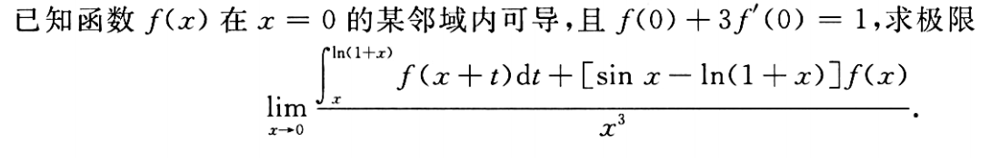
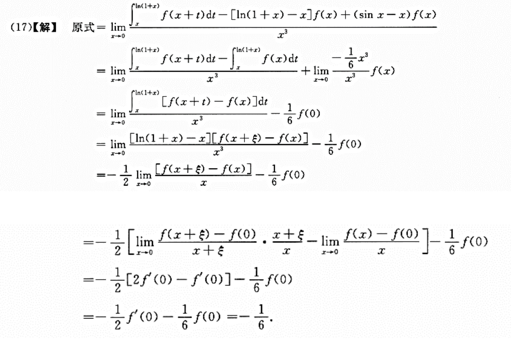

## 极限

### 极限不存在的两种情况

#### **函数自变量靠近某一点时函数值趋于无穷**

#### **函数只存在左极限或只存在右极限或虽然左右极限都存在但不相等**

### 极限四则运算

> 设 $\lim_{x \to x_0} f(x)$ 与 $\lim_{x \to x_0} g(x)$ 存在，
> 则当 $x \to x_0$ 时，$f(x)$ 与 $g(x)$ 及 $f(x) \cdot g(x)$ 并且有：

1. $\lim_{x \to x_0} [f(x) \pm g(x)] = \lim_{x \to x_0} f(x) \pm \lim_{x \to x_0} g(x)$

2. $\lim_{x \to x_0} [f(x) \cdot g(x)] = \lim_{x \to x_0} f(x) \cdot \lim_{x \to x_0} g(x)$

   - $\lim_{x \to x_0} [c \cdot g(x)] = c \cdot \lim_{x \to x_0} g(x)$，其中 $c$ 为任意常数

3. 若 $\lim_{x \to x_0} g(x) \neq 0$，则当 $x \to x_0$ 时，$\frac{f(x)}{g(x)}$ 的极限也存在，则：

   $$
   \lim_{x \to x_0} \frac{f(x)}{g(x)} = \frac{\lim_{x \to x_0} f(x)}{\lim_{x \to x_0} g(x)}
   $$

### Stolz 定理

若数列 $\{x_n\}$ $\{y_n\}$ 满足以下条件：

- $\{y_n\}$ 为单调数列

- $\lim_{n \to \infty} y_n = \infty$

- $\lim_{n \to \infty} \frac{x_n - x_{n-1}}{y_n - y_{n-1}}$ 存在或为 $\infty$

则 $\lim_{n \to \infty} \frac{x_n}{y_n} = \lim_{n \to \infty} \frac{x_n - x_{n-1}}{y_n - y_{n-1}}$

#### 例题

- $\lim_{n \to \infty} \frac{n!}{n^n} = 0$

### 洛必达

1. **一阶可导**：函数 $f(x)$ 和 $g(x)$ 在点 a 的某个去心邻域内可导，$g'(x) \neq 0$（除非在 a 点取极限）

2. **导函数连续**：$f'(x)$ 和 $g'(x)$ 在点 $a$ 的某个邻域内连续。连续的导函数意味着在这个邻域内，导数不会突变，保证了洛必达法则的适用性

3. **不确定形式**：极限 $\lim_{x \to a} \frac{f(x)}{g(x)}$ 必须是以下两种不确定形式之一：（洛必达法则仅适用于这两类情况）

- $\frac{0}{0}$
- $\frac{\infty}{\infty}$

若满足上述条件，则有：$$ \lim_{x \to a} \frac{f(x)}{g(x)} = \lim_{x \to a} \frac{f'(x)}{g'(x)} $$

 **前提**：右侧的极限 $\lim_{x \to a} \frac{f'(x)}{g'(x)}$ 必须存在，且其结果为有限值或无穷大。

### 无穷小量

设 $f$ 在某 $U^\circ (x_0)$ 上有定义. 若

$$
\lim_{x \to x_0} f(x) = 0
$$

则称 $f$ 为当 $x \to x_0$ 时的无穷小量，记作 $f(x) = o(1) (x \to x_0)$

- **Notes**

  1. 这种记法其实是想表达 $\frac{f(x)}{1} \to 0 (x \to x_0)$。类似地，$f(x) = o(g(x)) (x \to x_0)$ 的含义为 $\frac{f(x)}{g(x)} \to 0 (x \to x_0)$，其中 $f, g$ 均为 $x \to x_0$ 时的无穷小量

  2. $o(\alpha)$ 表示一个函数族，即在自变量的某种趋向下，与 $\alpha$ 的比值趋向于 0 的所有函数的集合。因此，$o(1) = \{f | \lim_{x \to x_0} f(x) = 0\}$。对于 "$f(x) = o(1) (x \to x_0)$" 而言，这里的 "= " 相当于 "∈"

#### 无穷小计算

1. **无穷小量乘以有限量等于无穷小量**

   $$
   g(x) \cdot o(x^n) = o(g(x) \cdot x^n)
   $$

2. **有限个无穷小量的乘积等于无穷小量**

   $$
   o(x^n) \cdot o(x^m) = o(x^{m+n})
   $$

3. **高阶无穷小加低阶无穷小等于低阶无穷小**

   $$
   o(x^n) \pm o(x^m) = o\left(x^{\min\{m,n\}}\right)
   $$

4. **高阶无穷小除以低阶无穷小的极限等于零**
   - 对于任意高阶无穷小 $o(x^n)$ 和低阶无穷小 $o(x^m)$，当 $n > m$ 时：

   $$
   \lim_{x \to 0} \frac{o(x^n)}{o(x^m)} = 0
   $$

5. **无穷小量的乘法规则**
   - 两个无穷小量的乘积仍然是无穷小量，其阶数为两个无穷小的阶数之和：

   $$
   o(x^n) \cdot o(x^m) = o(x^{m+n})
   $$

6. **有限量与无穷小量的乘法规则**
   - 有限量与无穷小量的乘积仍为无穷小量，且保持无穷小量的形式不变：

   $$
   g(x) \cdot o(x^n) = o(g(x) \cdot x^n)
   $$

 > 其中 $g(x)$ 是有限量

---

- **无穷小与无穷大的关系**
  - 如果我们将无穷小理解为某种无穷大的倒数，比如 $o(x^n)$ 是趋向于零的无穷小量，其对应的无穷大量可能是 $1/x^n$，这种对偶关系也可以帮助理解无穷小与无穷大的运算规则

- **常见应用场景**
  - 无穷小量的这些性质在微积分中应用广泛，尤其是在极限运算、泰勒展开式及渐近分析中，帮助简化复杂表达式

#### 无穷小比阶

若 $f(x)$ 在 $x = 0$ 的某邻域内连续，且当 $x \to 0$ 时，$f(x)$ 是 $x$ 的 $m$ 阶无穷小，
$\varphi(x)$ 是 $x$ 的 $n$ 阶无穷小，且 $\varphi(x)$ 可导，则当 $x \to 0$ 时，
$F(x) = \int_0^{\varphi(x)} f(t) \, dt$ 是 $x$ 的 $nm + n$ 阶无穷小

$$
\lim_{x \to 0} \frac{F(x)}{x^{nm+n}} = \lim_{x \to 0} \frac{\varphi'(x) f(\varphi(x))}{(nm+n) x^{nm+n-1}} = \lim_{x \to 0} \frac{f(\varphi(x))}{(nm+n) x^{nm}} = \frac{1}{nm+n}
$$

### 无穷大量与无界量

#### 无穷大量

- 定义：**函数 $f(x)$ 当 $x$ 趋于无穷时，$f(x)$ 的值也趋于无穷**
- 形式化定义：对于任意正数 $M > 0$，存在 $x_0$，当 $x > x_0$ 时，$|f(x)| > M$
- 解释：$f(x)$ 随 $x$ 增加而无限增大，超越任何有限界限
- 示例：$f(x) = x^2$，随着 $x$ 趋于无穷，$x^2$ 也趋于无穷

#### 无界量

- 定义：**函数 $f(x)$ 的值没有上界或下界，但不一定趋于无穷大**
- 形式化定义：对于任意正数 $M > 0$，存在 $x$ 使得 $|f(x)| > M$，但这种情况不持续
- 解释：无界量的值在某些 $x$ 上非常大或非常小，但不会一直处于无穷大状态
- 示例：$f(x) = x \sin x$，其值随 $x$ 变化在正负之间震荡，幅值随 $x$ 增大而增大，但不会一直保持无穷大

#### 举例说明

- **无穷大量**：
  - $f(x) = x^2$：无论 $M$ 多大，只要 $x$ 足够大，总有 $f(x) > M$，且随着 $x$ 增大，$f(x)$ 始终增大

- **无界量**：
  - $f(x) = x \sin x$：虽然没有上界或下界，但其值随 $\sin x$ 的周期性震荡变化。对于任意大的 $M$，可以找到 $x$ 使得 $|x \sin x| > M$，但不是所有 $x$ 都满足 $|x \sin x| > M$

#### 总结

无穷大量的增长是持续的，函数值随 $x$ 增大不断趋向无穷；无界量则只是没有界限，其值在某些点上变得非常大或非常小，但不是始终如此

## 无穷大和无穷小的求导

#### 无穷小函数求导**不一定**降一阶

$f(x)$ 在 $(-\infty, +\infty)$ 连续，$F(x) = \int_0^x f(t) dt$，$n \geq 2$，$\lim_{x \to 0} \frac{F(x)}{x^n} = 1$，
则 $\lim_{x \to 0} \frac{f(x)}{nx^{n-1}} = 1$。❌

> eg1：一阶可导但震荡

$$
F(x) =
\begin{cases}
x^2 + x^3 \sin \frac{1}{x}, & x \neq 0 \\
0, & x = 0
\end{cases}
\quad \lim_{x \to 0} \frac{F(x)}{x^2} = 1
$$

$F(x)$ 为 $x$ 的 2 阶无穷小，当 $x \to 0$ 时，

$$
f(x) =
\begin{cases}
2x + 3x^2 \sin \frac{1}{x} - x \cos \frac{1}{x}, & x \neq 0 \\
0, & x = 0
\end{cases}
$$

$$
\lim_{x \to 0} \frac{f(x)}{x} = \lim_{x \to 0} \frac{2x + 3x^2 \sin \frac{1}{x} - x \cos \frac{1}{x}}{x}  = \text{ 不存在，}
$$

即当 $x \to 0$ 时，$f(x)$ 不是 $x$ 的 1 阶无穷小

> eg2: 一点连续但导数不存在

$$
F(x) =
\begin{cases}
x^2 + x^3  \cdot D(x), & x \neq 0 \\
0, & x = 0
\end{cases}
\quad \lim_{x \to 0} \frac{F(x)}{x^2} = 1
$$

#### 无穷大函数求导**不一定**降一阶

$f(x)$ 在 $(-\infty, +\infty)$ 连续，$F(x) = \int_0^x f(t) dt$，$n \geq 2$，$\lim_{x \to +\infty} \frac{F(x)}{x^n} = 1$，
则 $\lim_{x \to +\infty} \frac{f(x)}{nx^{n-1}} = 1$。❌

> eg3: 震荡导致极限不存在

$$
F(x) = x^2 + 2 \cos x + 2x \sin x - 2, \quad \lim_{x \to +\infty} \frac{F(x)}{x^2} = 1
$$

$F(x)$ 为 $x$ 的 2 阶无穷大，当 $x \to +\infty$ 时，

$$
f(x) = 2x + 2x \cos x, \quad \lim_{x \to +\infty} \frac{f(x)}{x} = \lim_{x \to +\infty} \frac{2x + 2x \cos x}{x} \text{ 不存在。}
$$

即当 $x \to +\infty$ 时，$f(x)$ 不是 $x$ 的 1 阶无穷大

## 等价替换

### 基本等价关系

当 $f \to 0$ 时，有：

$$
f \sim e^f - 1 \sim \ln(1 + f) \sim \tan f \sim \sin f \sim \arcsin f \sim \arctan f
$$

$$
f - \sin f \sim \frac{f^3}{6}, \quad \arcsin f - f \sim \frac{f^3}{6}
$$

$$
\tan f - f \sim \frac{f^3}{3}, \quad f - \arctan f \sim \frac{f^3}{3}
$$

$$
f - \ln(1 + f) \sim \frac{f^2}{2}, \quad 1 - \cos f \sim \frac{f^2}{2}, \quad a^f - 1 \sim f \ln a
$$

### 等价替换法则

若 $f \sim u$, $g \sim v$，则有：

$$
\lim \frac{f}{g} = \lim \frac{u}{v}
$$

### 特殊等价关系

1. 当 $f \to 0$, $g \to \infty$，则 $(1 + f)^g \sim e^{fg}$

    $$
    (1 + f)^g = e^{g \ln(1 + f)} \sim e^{f \cdot g}
    $$

2. 当 $f \to 0$, 并且 $f \cdot g \to 0$，则 $(1 + f)^g - 1 \sim f \cdot g$

    $$
    (1 + f)^g - 1 = e^{g \ln(1 + f)} - e^0 = e^{\xi} g \ln(1 + f) \sim f \cdot g
    $$

3. 当 $f \to 0$，则 $(1 - \cos^k f) \sim \frac{f^2}{2k}$

    $$
    (1 - \cos^k f) = \frac{1}{k} \cdot \xi^{k-1} (1 - \cos f) \sim \frac{f^2}{2k}
    $$

### 推论

$$
\lim_{x \to 0} \frac{1 - (\cos x)(\cos 2x) \cdots (\cos nx)}{x^2} = \frac{1}{2}(1 + 2^2 + \cdots + n^2) = \frac{1}{2} \cdot \frac{1}{6} n(n+1)(2n+1)
$$

$$
\lim_{x \to 0} \frac{1 - (\cos x)(\cos 2x)^{\frac{1}{2}}(\cos 3x)^{\frac{1}{3}} \cdots (\cos nx)^{\frac{1}{n}}}{x^2} = \frac{1}{2}(1 + 2^2 \cdot \frac{1}{2} + \cdots + n^2 \cdot \frac{1}{n}) = \frac{1}{2} \cdot \frac{n(n+1)}{2}
$$

## 差式极限

### 加减中的等价替换

若 $f \sim u$, $g \sim v$，则有：

1. 当 $\lim \frac{u}{v} = a \neq 1$ 时，有 $(f - g) \sim (u - v)$

    **证明**:

    $$
    \lim \frac{f - g}{u - v} = \lim \frac{g \left( \frac{f}{g} - 1 \right)}{v \left( \frac{u}{v} - 1 \right)}
    $$

    $$
    = \lim \frac{g}{v} \lim \frac{\left( \frac{f}{g} - 1 \right)}{\left( \frac{u}{v} - 1 \right)}
    $$

    $$
    = \lim \frac{g}{v} \lim \frac{\left( \frac{f}{g} - 1 \right)}{\left( \frac{u}{v} - 1 \right)} = \frac{a - 1}{a - 1} = 1
    $$

2. 当 $\lim \frac{u}{v} = a \neq 1$ 时，有 $(f + g) \sim (u + v)$

### 拟合法

1. **原理**
   已知 $\alpha, \beta$ 均是无穷小量，则 $\alpha, \beta$ 是等价无穷小的充要条件为 $\alpha - \beta = o(\alpha)$

2. **使用方法**
   在处理差式极限 $\lim_{x \to 0} \frac{f - g}{x^k}$ 时，可以减去 $f$ 的等价量 $u$ 从而生成 $f$ 的高阶无穷小量，即：

    $$
    \lim_{x \to 0} \frac{f - g}{x^k} = \lim_{x \to 0} \frac{(f - u) - (g - u)}{x^k}
    $$

    其中 $f - u \sim o(f)$ 且 $g - u \sim o(g)$

## 二重极限

### 二重极限是否存在

### 极限 $\lim_{x \to x_0} f(x) = A$（$\lim_{n \to \infty} a_n = A$）的等价定义

1. 任意给定 $\varepsilon > 0$，存在 $\delta > 0$，当 $0 < |x - x_0| < k\delta$ 时，有 $|f(x) - A| < \varepsilon$。（$k, l$ 为任意确定的正数）

2. 任意给定 $\varepsilon > 0$，存在 $\delta > 0$，当 $0 < |x - x_0| \leq \delta$ 时，有 $|f(x) - A| < \varepsilon$

3. 对任意给定的 $\varepsilon > 0$，数列 $\{a_n\}$ 中仅有有限项不满足 $|a_n - A| < \varepsilon$

### $x \to x_0$ 时，$f(x)$ 不以 $A$ 为极限的严格定义

存在 $\varepsilon > 0$，对任意给定的 $\delta > 0$，总存在点 $x_1$ 满足 $0 < |x_1 - x_0| < \delta$，使得 $|f(x_1) - A| \geq \varepsilon$

### 复合函数极限

设函数 $f[g(x)]$ 由函数 $u = g(x)$ 和函数 $y = f(u)$ 复合而成，$y = f[g(x)]$ 在 $\overset{\circ}{U}(x_0)$ 有定义，若：

$$
\lim_{x \to x_0} g(x) = u_0 \quad \lim_{u \to u_0} f(u) = L
$$

且 $\exists \delta_0 > 0$，当 $x \in \overset{\circ}{U}(x_0, \delta_0)$ 时，有 $g(x) \neq u_0$，则：

$$
\lim_{x \to x_0} f[g(x)] = L
$$

---

### 小结

1. $f[g(x)]$ 在某去心邻域内有定义
2. $\lim_{x \to x_0} g(x) = u_0$
3. $\lim_{u \to u_0} f(u) = L$
4. 在去心邻域内，$g(x) \neq u_0$

$$
\Rightarrow \lim_{x \to x_0} f[g(x)] = L
$$

### 例题

#### 例题 1

已知 $f(x)$ 在 $x = 0$ 的某邻域有定义，$\lim\limits_{x \to 0} g(x) = 0$，且 $g(x) > 0$，则 $\lim\limits_{x \to 0} \frac{f[g(x)] - f(0)}{g(x)}$ 存在是 $f(x)$ 在 $x = 0$ 右可导的必要条件（【必要不充分】）

**证明必要性** $\Leftarrow$

令 $y = s(x) = \frac{f[g(x)] - f(0)}{g(x)}$，$y = s(x)$ 由 $y = h(t) = \frac{f(t) - f(0)}{t}$ 与 $t = g(x)$ 复合而成，且 $\lim\limits_{x \to 0} g(x) = 0$，且 $g(x) > 0$。已知 $f(x)$ 在 $x = 0$ 右可导，即 $\lim\limits_{t \to 0^+} h(t) = \lim\limits_{t \to 0^+} \frac{f(t) - f(0)}{t}$ 存在，记为 $c$，因此：

$$
\lim\limits_{x \to 0} \frac{f[g(x)] - f(0)}{g(x)} = \lim\limits_{t \to 0^+} \frac{f(t) - f(0)}{t} = c.
$$

已知 $f(x)$ 在 $x = 0$ 的某邻域内有定义，且 $\lim\limits_{x \to 0} g(x) = 0$，$g(x) > 0$，则

$$
\lim\limits_{x \to 0} \frac{f[g(x)] - f(0)}{g(x)}
$$

存在是 $f(x)$ 在 $x = 0$ 右可导的必要条件

---

**说明不充分** $\nRightarrow$

设 $g(x)$ 为：

$$
g(x) =
\begin{cases}
x^2, & |x| = \frac{1}{n}, \, n = 1, 2, 3, \dots \\
\frac{1}{\left[\frac{1}{x}\right]^2}, & x \in (0,1), |x| \neq \frac{1}{n} \\
10086, & x = 0 \text{ 或 } |x| > 1 \, (\text{这里不重要})
\end{cases}
$$

且 $R_g$ 含于正有理数集

定义 $f(x)$ 为：

$$
f(x) =
\begin{cases}
x, & x \text{ 是有理数} \\
0, & x \text{ 是无理数}
\end{cases}
$$

显然，$\lim\limits_{x \to 0^+} \frac{f(x) - f(0)}{x}$ 不存在，但 $\lim\limits_{x \to 0} \frac{f[g(x)] - f(0)}{g(x)} = 1.$

> 在 $x=0$ 的近旁，可以找到 $g$ 使得不论 $x$ 的选取，$g$ 总是以有理数的不连续的方式趋于 0，这样，$x$ 趋于 0 时，对于 $f \circ g(x)$，相当于 $f(t)$，$t$ 只以有理数的方式趋于 0，只是说明了 $f(x)$ 在有理点处的性质，因而不是充分的

## 复合函数的连续性

若 $g(x)$ 在 $x = x_0$ 处连续，$f(u)$ 在 $u = u_0 = g(x_0)$ 处连续，则 $f(g(x))$ 在 $x = x_0$ 处连续

- **内层不连续，外层连续，复合函数可能连续**：

- **内层连续，外层不连续，复合函数可能连续**：

- **内层不连续，外层不连续，复合函数可能连续**：

### 小结

#### 若 $\\lim_{ x \to x_{0} } g (x) = A, \lim_{ x \to A } = B$ 无法推出 $\\lim_{ x \to x_{0} } f[g (x)] = B$

- **反例 1**：

  $$
  g (x) = 0, \quad f(x) = \begin{cases}
  x, & x \neq 0 \\
  1, & x = 0
  \end{cases}
  $$

- **反例 2**：

  $$
  g (x) = x \sin\frac{1}{x}, \quad f(x) = \begin{cases}
  x, & x \neq 0 \\
  1, & x = 0
  \end{cases}
  $$

  当 $x \to 0$ 时，$g (x) = x \sin\frac{1}{x}$ 不仅趋于 0 同时可在 $x = \frac{1}{n \pi}$ 时等于 0 $\Rightarrow \lim_{ x \to 0 }f[g(x)]$ 不存在

#### $\\lim_{ x \to x_{0} } g (x) = A, \lim_{ x \to A } = B \Rightarrow \\lim_{ x \to x_{0} } f[g (x)] = B$ 的必要条件

复合函数极限成立的**必要条件**：

- **内极限取不到极限值**，即 $g(x) \neq A$，保证内函数不会逼近外函数的奇异点
- **外函数在该点连续**，即 $f(x)$ 在 $x = A$ 处连续，确保即使内函数逼近 $A$，外函数不会引入新的不连续。外函数在该点连续**，即 f (x) f (x) f (x) 在 x=Ax = Ax=A 处连续，确保即使内函数逼近 AAA，外函数不会引入新的不连续

## 函数有界与极限的关系

1. **函数 $f(x)$ 在 $x_0$ 点附近有界，则 $\lim_{x \to x_0} f(x)$ 存在。** ❌
   - *反例*：$f(x) = \sin \frac{1}{x}$，当 $x_0 = 0$ 时，函数在 $x_0$ 点附近有界，但极限不存在

2. **$f(x)$ 在 $(-\infty, +\infty)$ 上连续且有界，则 $\lim_{x \to \infty} f(x)$ 存在。** ❌
   - *反例*：$f(x) = \arctan x$，在 $(-\infty, +\infty)$ 上连续且有界，但 $\lim_{x \to \infty} f(x) = \frac{\pi}{2}$，$\lim_{x \to -\infty} f(x) = -\frac{\pi}{2}$，因此极限 $\lim_{x \to \infty} f(x)$ 不存在

3. **函数 $f(x)$ 在 $x_0$ 点附近无界，则 $\lim_{x \to x_0} f(x) = \infty$。** ❌
   - *反例*：$f(x) = e^{\frac{1}{x}}$，当 $x_0 = 0$ 时，函数在 $x_0$ 点附近无界，但 $\lim_{x \to 0} e^{\frac{1}{x}} = 0$，因此 $\lim_{x \to 0} f(x)$ 不等于 $\infty$

4. **函数 $f(x)$ 在 $x_0$ 点附近无界，且 $\lim_{x \to x_0} f(x) = \infty$，则在 $x_0$ 的某一半侧领域内 $f(x)$ 一定有界。** ❌
   - 可能存在不同半侧的极限数极限无限且无从相同方向方式趋近，$\lim_{x \to x_0} f(x) = \infty$。说明里不止有函数在某一侧的极限不为无穷大，从而得出在某一半侧领域内 $f(x)$ 无界，且有界

5. **$f(x)$ 在 $x_0$ 点附近有界，则在 $x_0$ 的某一半侧领域内 $f(x)$ 存在无限大。** ❌
   - 某函数在某一半侧邻域内可以在任何领域趋近，并可能在某一临近点趋近 $\infty$。例如：$f(x) = \frac{1}{x - x_0}$，取 $x_0 = 0$，$\lim_{x \to x_0} \frac{1}{x - x_0} = \infty$，$f(x)$ 无界。但在领域邻域内可以在任何邻域无数多次，且 $\lim_{x_0 \to 0} f(x)$ 都无界

## 数列极限

### 数列极限与函数极限

### 单调性与有界性

1. **单调但不收敛的数列**

    $$a_n = n \quad \text{单调递增不收敛}$$

    $$a_n = -n \quad \text{单调递减不收敛}$$

2. **收敛但不单调的数列**

   $$ a_n = (-1)^n \frac{1}{n} $$

3. **有界但不收敛的数列**

   $$ a_n = \sin \frac{1}{n} $$

4. **无界但极限为无穷大的数列**

    $$ \lim_{n \to \infty} a_n = \infty, \quad a_n = \left[ 2 + (-1)^n \right]^n $$

5. **无界但极限不为无穷大的数列**

    $$ a_n = \left[ 2 + (-1)^n \right]^n $$

> **注**：数列 $a_n$ 无界是指 $n$ 趋近 ∞ 时，$a_n$ 能够取得无穷大；而数列 $a_n$ 为无穷大则是指 $n$ 趋近 ∞ 时，$a_n$ 的极限都是无穷大。因此，无穷大量必然是无界量，而无界量不一定是无穷大量

### 夹逼准则

1. **夹逼准则的反例**
   - 数列 $\{x_n\}, \{y_n\}, \{z_n\}$ 满足：$y_n \leq x_n \leq z_n$，且 $\lim_{n \to \infty} (z_n - y_n) = 0$，则 $\lim_{n \to \infty} x_n$ 存在
   - 反例：

     - $x_n = (-1)^n$

     - $y_n = (-1)^n - \frac{1}{n}, \quad n = 1, 2, 3, \dots$

     - $z_n = (-1)^n + \frac{1}{n}$

2. **收敛的充要条件**
   - 当 $n$ 充分大时，$a - \frac{1}{n} < a_n < a + \frac{1}{n}$ 是数列 $\{a_n\}$ 收敛于 $a$ 的充要条件
   - 反例：构造一个数列 $\{a_n\}$ 使得它满足 $a - \frac{2}{n} < a_n < a + \frac{2}{n}$，此时数列 $\{a_n\}$ 收敛于 $a$，但是推不出 $a - \frac{1}{n} < a_n < a + \frac{1}{n}$

> [!  ] 数列 $\{a_n\}$ 收敛于 $a$；而数列 $\{a_n\}$ 收敛于 $a$ 可以有无数种情况，推不出数列 $\{a_n\}$ 一定以 $\frac{1}{n}$ 收敛于 $a$。比如构造一个数列 $\{a_n\}$ 使得它满足 $a - \frac{2}{n} < a_n < a + \frac{2}{n}$，此时数列 $\{a_n\}$ 收敛于 $a$，但是推不出 $a - \frac{1}{n} < a_n < a + \frac{1}{n}$

### $\lim_{n \to \infty} \frac{x_{n+1}}{x_n}$ 相关命题

#### 若 $\lim_{n \to \infty} x_n = a$，则 $\lim_{n \to \infty} \frac{x_{n+1}}{x_n} = \lim_{n \to \infty} \frac{x_n}{x_{n-1}} = 1$

- 当 $a \neq 0$，该命题为真
- 当 $a = 0$ 时，$\lim_{n \to \infty} \frac{x_{n+1}}{x_n} = 1$ 不一定成立

#### 若 $\lim_{n \to \infty} \frac{x_{n+1}}{x_n} = a$，则 $\lim_{n \to \infty} x_n = 0, 当 |a| < 1$  ✅

#### 若 $\lim_{n \to \infty} \frac{x_{n+1}}{x_n}$ 存在且 $x_n > 0$，则 $\lim_{n \to \infty} \sqrt[n]{x_n} = \lim_{n \to \infty} \frac{x_{n+1}}{x_n}$ ✅

#### 若 $\lim_{n \to \infty} \sqrt[n]{x_n}$ 存在，则 $\lim_{n \to \infty} \frac{x_{n+1}}{x_n}$ 存在 ❌

- 例如 $\{ x_n \} = \left\{\frac{1}{n} \left[ 2 + (-1)^n \right] \right\}$，有 $\frac{1}{n} < \frac{1}{n} \left[ 2 + (-1)^n \right] < \frac{3}{n}$，$\lim_{n \to \infty} \sqrt[n]{x_n} = \lim_{n \to \infty} \sqrt[n]{\frac{3}{n}} = 1$

### 递推函数与递推数列的关系

设 $x_{n+1} = f (x_n)$,

1. **单调性**
   - 若 $f' (x) \geq 0$，则数列 $\{x_n\}$ 单调
   - 若 $x_2 > x_1$，则数列 $\{x_n\}$ 单调递增
   - 若 $x_2 < x_1$，则数列 $\{x_n\}$ 单调递减

2. **奇偶子列**
   - 若 $f' (x) < 0$，数列 $\{x_n\}$ 必定不单调，但是奇偶子列各自单调

#### 单调数列的极限解法

对于递推关系 $a_{n+1} = f(a_n)$，且 $a_n$ 单调，要求证明 $\{a_n\}$ 收敛。处理这类问题的固定方法是运用单调有界准则证明 $\{a_n\}$ 收敛。具体步骤如下：

##### 步骤一：求解方程 $f(A) = A$

在草稿纸上解方程 $f(A) = A$ 得到 A 的值。若已知 $a_1 > A$ 或 $a_1 < A$，则直接进行下一步；否则需分类讨论 $a_1 > A$、$a_1 < A$ 和 $a_1 = A$（此时数列为常数数列）的情况再进行下一步

##### 步骤二：证明数列有界

- 若 $a_1 > A$，则用数学归纳法证明 $a_n > A$，故数列有下界
- 若 $a_1 < A$，则用数学归纳法证明 $a_n < A$，故数列有上界

##### 步骤三：证明数列单调性

- 构造函数 $g(x) = f(x) - x$，定义域为 $(A, +\infty)$。求导判断单调性，从而验证 $g(x) = f(x) - x \leq 0$，即 $a_{n+1} \leq a_n$，故数列单调递减
- 构造函数 $g(x) = f(x) - x$，定义域为 $(-\infty, A)$。求导判断单调性，从而验证 $g(x) = f(x) - x \geq 0$，即 $a_{n+1} \geq a_n$，故数列单调递增

> [! ] 若数列是正项数列，则也可以构造函数 $g(x) = \frac{f(x)}{x}$
> 去验证 $\frac{f(a_n)}{a_n} \leq 1$（或者 $\geq 1$）⇒ $\frac{f(a_n)}{a_n} = \frac{a_{n+1}}{a_n} \leq 1$ ⇒ 数列单调递减
> （$\frac{f(a_n)}{a_n} = \frac{a_{n+1}}{a_n} \geq 1$ ⇒ 数列单调递增）

##### 步骤四：证明数列收敛

由单调有界准则说明 $a_n$ 收敛，设 $\lim_{n \to \infty} a_n = A$，对 $a_{n+1} = f(a_n)$ 两端取极限，再解方程 $f(A) = A$ 得到数列极限值

#### 非单调数列的奇偶子列法

对于递推关系 $a_{n+1} = f(a_n)$，且 $f'(x) < 0$，要求证明 $\{a_n\}$ 收敛
由于 $f'(x) < 0$，数列必然有单调性相反的奇偶子列（可用拉格朗日中值定理证明）

##### 严谨地证明奇偶子列的单调性与有界性

##### 使用单调有界准则说明奇偶子列都收敛

##### 对递推式取极限得到两个方程，解方程得到奇偶子列的极限值相等

##### 由数列收敛的充要条件，其奇偶子列收敛于同一值，说明原数列收敛

> [! ] 数列极限 $\lim_{n \to \infty} x_n$ 存在的充要条件是：$\lim_{n \to \infty} x_{2n+1} = \lim_{n \to \infty} x_{2n} = a$ 为常数

#### 变号情况的处理

对于递推函数 $f'(x)$ 出现变号的情况，前两种方法失效。我们需要在思维层面解决递推数列的极限证明题

##### 情形一：$\{x_n\}$ 可能单调型

当 $f'(x)$ 不恒小于等于 0 时，可以用单调有界准则来求解。解题思路如下：

1. 设 $\lim_{n \to \infty} x_n = 4$，先对递推式两端取极限求出 4
2. 利用 4 与 $x_n$ 的关系，推出单调性与有界性

##### 全局思想

- **证一辅一**：先证明单调性或有界性中较容易证明的一个，再利用已证明的性质辅助证明另一个性质
- **抓一放一**：对于 $x_{n+1} = f(x_n)$，有时可以反解出右端 $f(x_n)$ 内的 $x_n$，甚至 $f(x_n)$ 整体去证明单调性

##### 证明 $f(x)$ 性质的常用方法

- **有界性**：常用左右归纳法，利用常见不等式
- **单调性**：常用作差法、作商法、构造极大数法、归纳法

### $\{x_n\}, \{y_n\}$ 与 $\{x_n y_n\}$ 的敛散性

| $\{x_n\}$                            | $\{y_n\}$ | $\{x_n y_n\}$ |
| -------------------------------------- | ----------- | --------------- |
| 收敛                                     | 收敛          | 收敛              |
| 收敛                                     | 发散          | 不能确定            |
| $\lim_{n \to \infty} x_n = a \neq 0$ | 发散          | 发散              |
| $\lim_{n \to \infty} x_n = 0$        | 发散          | 不能确定            |
| 发散                                     | 收敛          | 不能确定            |
| $\lim_{n \to \infty} x_n = \infty$   | 发散且不为无穷大    | 发散              |
| 发散且不为无穷大                               | 发散且不为无穷大    | 不能确定            |

## 极限与绝对值的极限

### 绝对值极限存在但本身极限不存在

- 例子：$a_n = (-1)^n$
- 例子：函数 $f(x)$

$$
f(x) =
\begin{cases}
1, & x \geq 0, \\
-1, & x < 0.
\end{cases}
$$

#### 保号性

## 连续与可导

### 可导与连续的易错概念

#### $f(x)$ 可导 $\iff f'(x)$ 存在 $\centernot\implies \lim_{x \to x_0} f'(x)$ 存在

$f'(x)$ 连续 $\implies \lim_{x \to x_0} f'(x)$ 存在且等于 $f'(x_0)$

$$
f(x) =
\begin{cases}
x^2 \sin \frac{1}{x}, & x \neq 0 \\
0, & x = 0
\end{cases}
\quad \text{连续},
\quad f'(x) =
\begin{cases}
2x \sin \frac{1}{x} - \cos \frac{1}{x}, & x \neq 0 \\
0, & x = 0
\end{cases}
$$

#### 1. 一点处连续相关结论

#### 2. 某邻域内连续相关结论

#### 3. 去心邻域内连续

#### 4. 一点处可导相关结论

#### 5. 某邻域内可导相关结论

#### 6. 去心邻域内可导相关结论

#### 7. 二阶可导

#### 某点可导

#### 某点二阶可导

#### 去心邻域二阶可导

---

#### 小结

- **一点处的性质**无法直接推广到邻域内
- **邻域内的性质**可以推广到邻域内的所有点，但不能保证在邻域边界点的性质
- **去心邻域的性质**无法直接推及到主轴点

### 例题

---

## 一元可微

### 微分与增量的关系

### 一元函数可微的定义

设函数 $y = f(x)$ 在某区间内有定义，$x_0$ 及 $x_0 + \Delta x$ 都在该区间内。若函数的增量

$$
\Delta y = f(x_0 + \Delta x) - f(x_0)
$$

可表示为

$$
\Delta y = A\Delta x + o(\Delta x)
$$

其中 $A$ 是不依赖于 $\Delta x$ 的常数，则称函数 $y = f(x)$ 在点 $x_0$ 是可微的

- $A\Delta x$ 叫做函数 $y = f(x)$ 在点 $x_0$ 相应于自变量增量 $\Delta x$ 的微分，记作 $dy$，即 $dy = A\Delta x$。实际上，$dy = f'(x_0) \Delta x$

**总结**：

$$
dy = A \Delta x
\begin{cases}
A = f'(x_0) \\
o(\Delta x) \text{ 是与 } \Delta x \text{ 相比高阶的无穷小量} \\
\Delta y = A \cdot \Delta x + o(\Delta x), \quad A \text{ 是不依赖于 } \Delta x \text{ 的常数}
\end{cases}
$$

### 一元函数导数与微分的等价性

在一元函数 $f(x)$ 中有：可导 $\Leftrightarrow$ 可微

- **可导 $\rightarrow$ 可微**

  设函数 $f(x)$ 在点 $x_0$ 的某邻域内有定义，$f(x)$ 在点 $x_0$ 处可导，由导数的定义可知：

  $$
  \lim_{\Delta x \to 0} \frac{\Delta y}{\Delta x} = A \Rightarrow \lim_{\Delta x \to 0} \left( \frac{\Delta y}{\Delta x} - A \right) = 0 \Rightarrow \lim_{\Delta x \to 0} \frac{\Delta y - A \Delta x}{\Delta x} = 0.
  $$

  由高阶无穷小量的定义可知：$\Delta y - A \Delta x = o(\Delta x) \Rightarrow \Delta y = A \Delta x + o(\Delta x)$。即 $f(x)$ 在点 $x_0$ 处可微

- **可微 $\rightarrow$ 可导**

  设函数 $f(x)$ 在点 $x_0$ 的某邻域内有定义，$f(x)$ 在点 $x_0$ 处可微，由微分的定义可知：

  $$
  \Delta y = A \Delta x + o(\Delta x) \Rightarrow \Delta y - A \Delta x = o(\Delta x).
  $$

  由高阶无穷小量的定义可知：

  $$
  \lim_{\Delta x \to 0} \frac{\Delta y - A \Delta x}{\Delta x} \Rightarrow \lim_{\Delta x \to 0} \left( \frac{\Delta y}{\Delta x} - A \right) \Rightarrow \lim_{\Delta x \to 0} \frac{\Delta y}{\Delta x} = A.
  $$

  即 $f(x)$ 在点 $x_0$ 处可导

#### 设 $y = f(x)$ 在 $(a,b)$ 可微，则下列结论正确的是

1. $x_0 \in (a,b)$，若 $f'(x_0) \neq 0$，则 $\Delta x \to 0$ 时，$dy|_{x=x_0}$ 与 $\Delta x$ 是同阶无穷小

   **证明**：

   由于

   $$
   \lim_{\Delta x \to 0} \frac{dy|*{x=x_0}}{\Delta x} = \lim*{\Delta x \to 0} \frac{f'(x_0) \Delta x}{\Delta x} = f'(x_0) \neq 0
   $$

   故 $dy|_{x=x_0}$ 与 $\Delta x$ 是同阶无穷小

2. $df(x)$ 只与 $x \in (a,b)$ 有关

   $df(x) = f'(x) \Delta x$，因此 $df(x)$ 与 $x \in (a,b)$ 以及 $\Delta x$ 都有关

3. $\Delta y = f(x + \Delta x) - f(x)$，则 $dy \neq \Delta y$

   线性性函数 $y = ax + b$ 为例，则 $dy = a\Delta x$，$\Delta y = a\Delta x$，此时 $dy = \Delta y$

4. 当 $\Delta x \to 0$ 时，$dy - \Delta y$ 是 $\Delta x$ 的高阶无穷小

   由可微的概念得 $\Delta y = f'(x)\Delta x + o(\Delta x) = dy + o(\Delta x)$

   故 $\Delta y - dy = o(\Delta x)$，因此 $dy - \Delta y$ 是 $\Delta x$ 的高阶无穷小

### 相关例题

#### 设 $\lim\limits_{x \to 0} \varphi(x) = 0$，判定下列命题的真伪

1. $$
   \lim_{x \to 0} \frac{\varphi^2(x)}{\varphi(x)} = 0 \quad \text{❌  显然由于} \lim_{x \to 0} \varphi(x) = 0 \text{无法保证：当} x \to 0 \text{时，} \varphi(x) \text{不等于} 0
   $$

2. $$
   \lim_{x \to 0} \frac{\sin(\varphi(x))}{\varphi(x)} = 1 \quad \text{❌  同上，当} x \to 0 \text{时，} \varphi(x) = 0，\text{时式子无意义。}
   $$

3. 若 $\lim\limits_{u \to 0} f(u) = A$，则 $\lim\limits_{x \to 0} f(\varphi(x)) = A$；**❌**
   有同学可能会如此处理：

   $$
   \lim_{x \to 0} f(\varphi(x)) \stackrel{\varphi(x) = t}{=} \lim_{t \to 0} f(t) = A,
   $$

   这是❌的

   因为由 $\lim\limits_{u \to 0} f(u) = A$，必定有 $u \to 0$ 但 $u \neq 0$（这是极限的定义）

   而当 $x \to 0$，$\varphi(x)$ 可能等于 0。换元令 $\varphi(x) = t$ 时，$t$ 可能为 0

   因此 $\lim\limits_{x \to 0} f(\varphi(x)) \neq \lim\limits_{t \to 0} f(t) = A$

   **反例**，令 $\varphi(x) = 0$，$f(x)$ =

   $$
   f(x) =
   \begin{cases}
   1, & x \neq 0, \\
   0, & x = 0.
   \end{cases}
   $$

   此时 $\lim\limits_{u \to 0} f(u) = 1$，但 $\lim\limits_{x \to 0} f(\varphi(x)) = \lim\limits_{x \to 0} f(0) = 0 \neq 1$

4. 若 $f'(0) = A$，则 $\lim\limits_{x \to 0} f(\varphi(x))$ 存在；✅

   由 $f'(0) = A$ 可得 $\lim\limits_{x \to 0} \frac{f(x)}{x} = f'(0)$，

   一方面如果 $\varphi(x)$ 趋于 0 且不等于 0 时，有

   $$
   \lim\limits_{x \to 0} f(\varphi(x)) \stackrel{\varphi(x) = t}{=} \lim\limits_{t \to 0} f(t) = f(0)
   $$

   另一方面如果 $\varphi(x)$ 趋于 0 且等于 0 时，有

   $$
   \lim\limits_{x \to 0} f(\varphi(x)) = \lim\limits_{x \to 0} f(0) = f(0)
   $$

   **综上，该命题正确。**

5. 若 $f(0) \neq \lim\limits_{x \to 0} f(x)$，则 $\lim\limits_{x \to 0} f(\varphi(x))$ 存在；❌

   首先由 $f(0) \neq \lim\limits_{x \to 0} f(x)$，极端一点，我们可以考虑虚构 $f(x)$ 在 0 处极限不存在的例子，

   如

   $$
   f(x) = \begin{cases}
   \sin\frac{1}{x}, & x \neq 0, \\
   0, & x = 0,
   \end{cases}
   $$

   而我们构造反例的目的是为了让 $\lim\limits_{x \to 0} f(\varphi(x))$ 不存在，因此只需要

   令 $\varphi(x) = x$ 即可，此时

   $$
   \lim\limits_{x \to 0} f(\varphi(x)) = \lim\limits_{x \to 0} f(x) = \lim\limits_{x \to 0} \sin\frac{1}{x}
   $$

   **不存在。**

#### 若 $f(x)$ 在 $x = 0$ 处连续，且 $f'(0) > 0$，下列命题正确的有 ______

1. $\exists \delta > 0, f(x)$ 在 $(- \delta, \delta)$ 上单调递增 ❌
2. $\exists \delta > 0, f(x)$ 在 $(0, \delta)$ 上单调递增❌
3. $\exists \delta > 0, f(x)$ 在 $(- \delta, 0)$ 上单调递增❌
4. $\exists \delta > 0, f(x)$ 在 $(- \delta, \delta)$ 上连续 ❌
5. $\exists \delta > 0, \forall x \in (- \delta, \delta), f'(x) > 0$ ❌
6. $\exists \delta > 0, \forall x \in (- \delta, \delta), f(x) > f(0)$ ❌
7. $\exists \delta > 0, \forall x \in (0, \delta), f(x) > f(0)$ ✅
8. $\exists \delta > 0, \forall x \in (- \delta, 0), f(x) > f(0)$ ❌

> 点对点，区间对区间 12345 全❌
> 根据保号性 7✅

#### $f (x) g (x)$ 的可导性

#### 已知 $f(x)$ 在 $x = 0$ 的某邻域有定义，$\lim_{x \to 0} g(x) = 0$，且 $g(x) > 0$，则 $\lim_{x \to 0} \frac{f[g(x)] - f(0)}{g(x)}$ 存在是 $f(x)$ 在 $x = 0$ 右可导的

 必要条件但不是充分条件

## 绝对值函数的可导性

- 情况 1：$f(a) = 0$
  - 若 $f(a) = 0$，则讨论 $|f(x)|$ 的导数要根据 $f(x)$ 的导数情况。绝对值函数 $|f(x)|$ 的导数可以通过分段函数形式给出：

    $$
    |f(x)| = \begin{cases}
    f(x), & f(x) \geq 0 \\
    -f(x), & f(x) < 0
    \end{cases}
    $$

    - 若 $f'(a) \neq 0$，则 $|f(x)|$ 在 $x = a$ 处不可导
    - 若 $f'(a) = 0$，则 $|f(x)|$ 在 $x = a$ 处可导，且导数为 0

- 情况 2：$f(a) \neq 0$
  - 导数的计算可以通过链式法则来处理：

    $$
    |f(x)|' = \left[\sqrt{f^2(x)}\right]' = \frac{f(x)}{|f(x)|} \cdot f'(x) = sgn(f(x)) \cdot f'(x)
    $$

### 可导性条件

- 在 $x = a$ 处，$f(x)$ 可导，$|f(x)|$ 不可导的充要条件是 $f(a) = 0$ 且 $f'(a) \neq 0$

### $\varphi(x) = f(x) \cdot |g(x)|$ 的可导性

- 若 $f(x)$ 在 $x = x_0$ **可导**，$|g(x)|$ 在 $x_0$ 连续但不可导，那么 $\varphi(x) = f(x) \cdot |g(x)|$ 在 $x = x_0$ 可导的**充要条件**为 $f(x_0) = 0$

  - 若 $f(x_0) = 0$，即使 $|g(x)|$ 在 $x_0$ 处不可导，由于 $f(x_0) = 0$，乘积函数在该点仍然可以可导

  - 此时 $\varphi'(x_0) = f'(x_0) \cdot |g(x_0)|$

- 若 $f(x)$ 在 $x = x_0$ **连续**，那么 $\varphi(x) = f(x) \cdot |x - x_0|$ 可导的**充要条件**为 $f(x_0) = 0$

  - 因为 $|x - x_0|$ 在 $x = x_0$ 处不可导，若 $f(x_0) \neq 0$，乘积函数不可导；但如果 $f(x_0) = 0$，则 $\varphi(x)$ 可导

## 反函数导数

$$d y = f'(x) d x \Rightarrow d x = \frac{d y}{f'(x)}$$

## 隐函数求导

## 高阶导数

### 常用公式

#### $$\left( e^{ax + b} \right)^{(n)} = a^n e^{ax + b}$$

#### $$\sin^{(n)}(ax + b) = a^n \cdot \sin\left( ax + b + \frac{n\pi}{2} \right)$$

#### $$\cos^{(n)}(ax + b) = a^n \cdot \cos\left( ax + b + \frac{n\pi}{2} \right)$$

#### $$(\ln |ax + b|)^{(n)} = (-1)^{n-1} \cdot (n-1)! \cdot a^n \frac{1}{(ax + b)^n}$$

#### $$\left( (ax + b)^\alpha \right)^{(n)} = a^n \alpha(\alpha - 1)\cdots(\alpha - n + 1)(ax + b)^{\alpha - n}$$

#### $$(\frac{1}{ax+b})^{(n)} = (-1)^n \cdot n! \frac{a^n}{(b+ax)^{(n+1)}}$$

### 求 $f^{(n)}(x)$ 的方法

1. **公式法**: 适用于 $f(x)$ 是上述公式中的函数，直接套公式即可
2. **归纳法**: 适用于 $f(x)$ 是指数函数或者 $f(x)$ 内含有属于某函数族的多种不同类型函数。先求出前二、三导数，观察其规律，从而写出 $f^{(n)}(x)$，再利用数学归纳法进行说明
3. **分解法**:
   - **加减法**: 适用于原函数 $f(x)$ 可以分解为 $f(x) = f_1(x) + f_2(x)$，并且 $f_1(x), f_2(x)$ 的 $n$ 阶导数容易求得，则 $f^{(n)}(x) = f_1^{(n)}(x) + f_2^{(n)}(x)$
   - **乘除法**: 适用于 $f(x)$ 可以表示为 $P_n(x) \cdot g(x)$，或者 $f(x)$ 求导后会得到 $P_n(x) \cdot f'(x) = g(x)$，其中 $P_n(x)$ 为多项式函数；则对 $f(x)$ 或者 $f'(x)$ 等式两端求导使用莱布尼茨法则计算 $f^{(n)}(x)$
4. **泰勒展开法**: 适用于求 $f(x)$ 具体点的高阶导数，并且 $f(x)$ 的泰勒展开已知或者 $f(x) = x^k g(x)$ 而 $g(x)$ 的泰勒展开形式已知，则使用泰勒展开并比较系数即可

### 带绝对值的高阶可导问题

设 $f(x)=g(x)\left| x-x_{0} \right|$，若其满足 2 个条件：

1. $g(x)$ k 阶连续可导 ( $k\geq1$ )
2. $g(x_{0})=g^{(1)}(x_{0})=……=g^{(k)}(x_{0})=0$

则有推论 $f^{(k+1)}(x_{0})=0$

### 欧拉公式求解高阶导

#### $e^{ax} \cdot \sin bx$ 的 $n$ 阶导数

$$
e^{ax} \cdot \sin bx = e^{ax} \cdot \frac{e^{ibx} - e^{-ibx}}{2i} = \frac{e^{(a+ib)x} - e^{(a-ib)x}}{2i} = f(x)
$$

$$
f^{(n)}(x) = \frac{1}{2i} \left[ (a + ib)^n e^{(a+ib)x} - (a - ib)^n e^{(a-ib)x} \right]
$$

$$
f^{(n)}(0) = \frac{1}{2i} \left[ (a + ib)^n - (a - ib)^n \right] = (a^2+b^2)^{\frac{n}{2}} \cdot \sin \left( n \theta \right)
$$

### 例题

#### $arcsin x$

