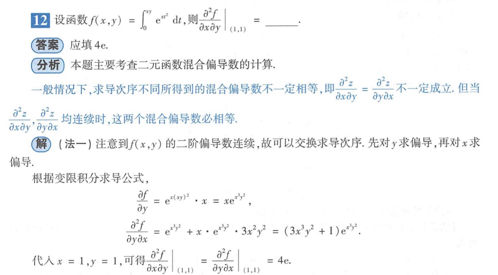
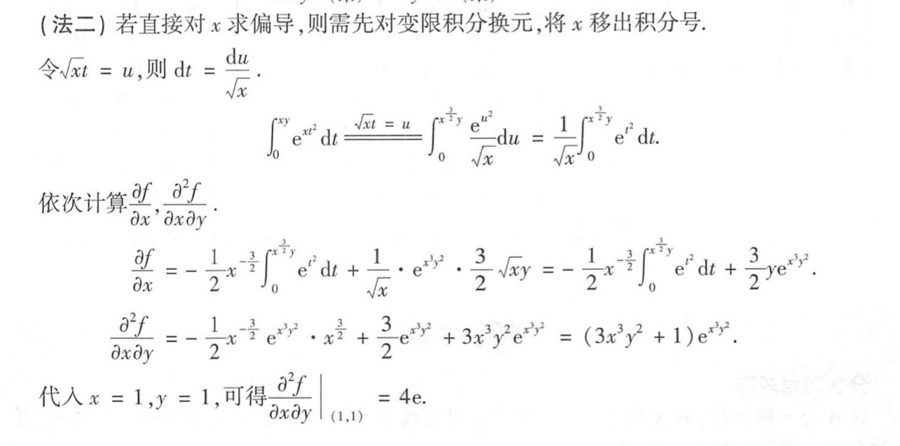

## 概念

- **方向导数**：本质就是函数在 A 点无数个切线的斜率的定义。每一个切线都代表一个变化的方向

- **梯度**：函数在 A 点无数个变化方向中变化最快的那个方向

- **全微分**：函数从 A 点到 B 点变化的量（其实是取一个无穷小的变化的量）

- **偏导**：多元函数降维时候的变化，比如二元函数固定 y，只让 x 单独变化，从而看成是关于 x 的一元函数的变化来研究

## 二重极限

$$
\lim_{{x \to 0^+ \atop y \to 0^+}} \frac{x^p y^q}{x^m + y^n} \quad (m, n \text{为正整数}, p, q \text{为非负实数})
$$

是二重否存在的结论：

1. $m$ 和 $n$ 不全为偶数时，极限一定不存在

2. $m$ 和 $n$ 全为偶数时：

   若 $\frac{p}{m} + \frac{q}{n} > 1$，则

   $$
   \lim_{{x \to 0^+ \atop y \to 0^+}} \frac{x^p y^q}{x^m + y^n} = 0
   $$

   若 $\frac{p}{m} + \frac{q}{n} \leq 1$，则

   $$
   \lim_{{x \to 0^+ \atop y \to 0^+}} \frac{x^p y^q}{x^m + y^n} \text{不存在}.
   $$

   当 $\frac{p}{m} + \frac{q}{n} \leq 1$ 时，选择路径 $y = kx^{\frac{m-p}{q}}$ 即可说明极限不存在

### 分母不是偶次和时不能使用

$$x = r \cos \theta，\quad y = r \sin \theta$$

$$f(x,y) = f(r \cos \theta, r \sin \theta) = g(r)h(\theta)$$

当 $\lim_{r \to 0} g(r) = 0$ 时，$h(\theta)$ 有界 $\Rightarrow$ 极限存在

## 累次极限

## 偏导数

### 求解混合偏导

- 利用定义求一阶偏导
- 利用求导公式求解一阶偏导在利用定义求二阶偏导

[36 讲 P 316]

设 $f(t)$ 在 $t = 0$ 的某个邻域内有定义，记数列 $\left\{ \frac{1}{n\pi} \right\}$ 的值域为 $D$，

令 $g (x) = \begin{cases}
x \sin \frac{1}{x}, & x > 0 且 x \notin D \\
x, & x \in D
\end{cases}$,

则 $\lim_{x \to 0^+} \frac{f\left(x \sin \frac{1}{x}\right) - f(0)}{g(x)}$ 存在是 $f'(0) = 0$ 的

- a，充分必要条件
- b，充分不必要条件
- c，必要不充分条件
- d，非充分非必要条件

### 偏导连续

### 偏导存在

### 计算

### 先代后求

## 二元可微

### 例题

已知 $f(x, y)$ 在 $(0, 0)$ 点的某邻域内有定义, 且

$$
\lim_{(x, y) \to (0, 0)} \frac{f(x, y) + a(x-1)^2 + b(y+1)^2}{\sqrt{x^2 + y^2}} = c,
$$

则 $f(x, y)$ 在 $(0, 0)$ 可微的充分条件是 ( )

 $f(0, 0) = -(a + b), c = 1$.✅

## 全微分的定义

设二元函数 $z = f(x, y)$ 在点 $P_0(x_0, y_0)$ 的某邻域 $U(P_0)$ 内有定义，
若它在 $P_0(x_0, y_0)$ 处的全增量：

$$  
\Delta z = f(x_0 + \Delta x, y_0 + \Delta y) - f(x_0, y_0)  
$$

可以表示为：

$$  
\Delta z = A \cdot \Delta x + B \cdot \Delta y + o(\rho),  
$$

其中 $A, B$ 为与 $\Delta x, \Delta y$ 无关的常数，
$\rho = \sqrt{(\Delta x)^2 + (\Delta y)^2}$，则称 $f$ 在 $P_0(x_0, y_0)$ 可微

而称 $A \cdot \Delta x + B \cdot \Delta y$ 为函数 $f$ 在点 $P_0(x_0, y_0)$ 处的全微分

可微是偏导数连续与可微之间的关系：
若函数 $f$ 在 $P_0(x_0, y_0)$ 可微，
则偏导数 $f'_x(x_0, y_0)$ 和 $f'_y(x_0, y_0)$ 存在，且 $A = f'_x(x_0, y_0), B = f'_y(x_0, y_0)$
另一方面，若 $f'_x(x_0, y_0)$ 和 $f'_y(x_0, y_0)$ 连续，则 $f(x, y)$ 可微

## 判断不可微的方法

- 法一：验证一阶偏导数不存在（或者验证原函数不连续）

- 法二：证明二重极限

$$
\lim_{\Delta x \to 0 \atop \Delta y \to 0} \frac{f(x_0 + \Delta x, y_0 + \Delta y) - f(x_0, y_0) - f'_x(x_0, y_0) \Delta x - f'_y(x_0, y_0) \Delta y}{\sqrt{(\Delta x)^2 + (\Delta y)^2}} \neq 0
$$

f 为分式
分母为偶次齐次和式
在（0,0）处判别可微
f（0,0）= 0，f 偏 x 导 = 0，f 偏 y 导 = 0，
比阶 k > 1 可微
比阶 k ≤ 1 不可微分

## 隐函数求导

## 待整理

