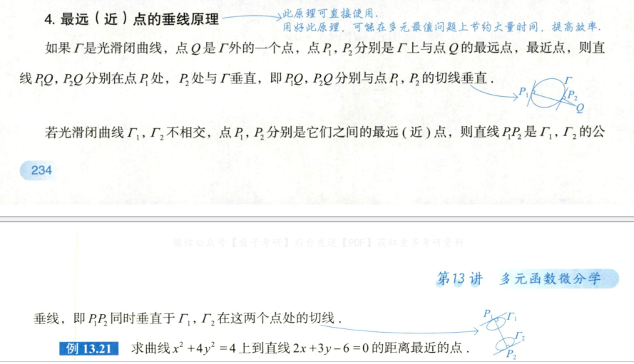
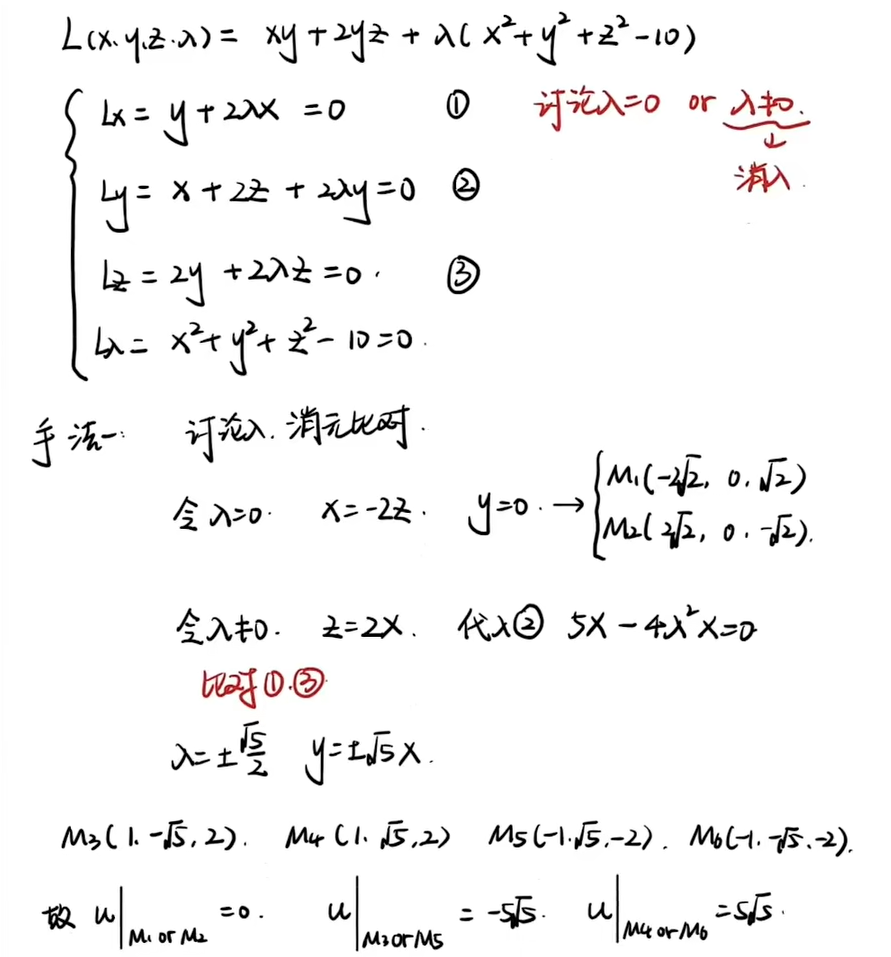
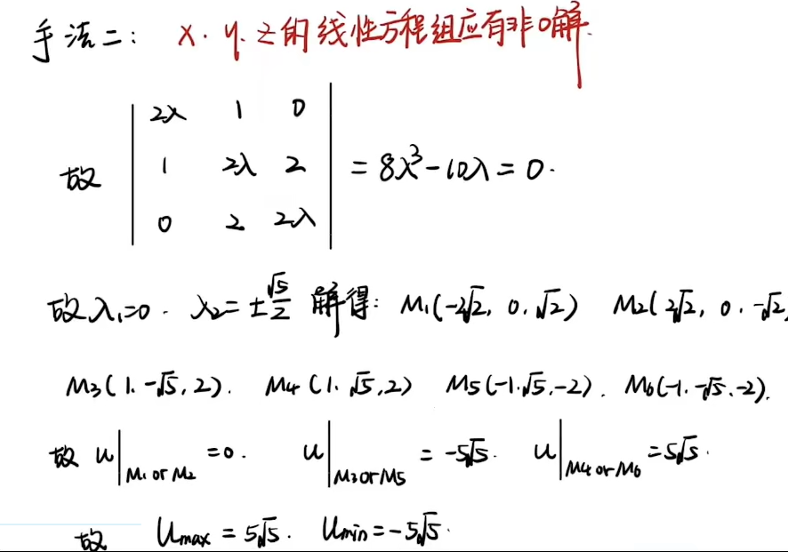
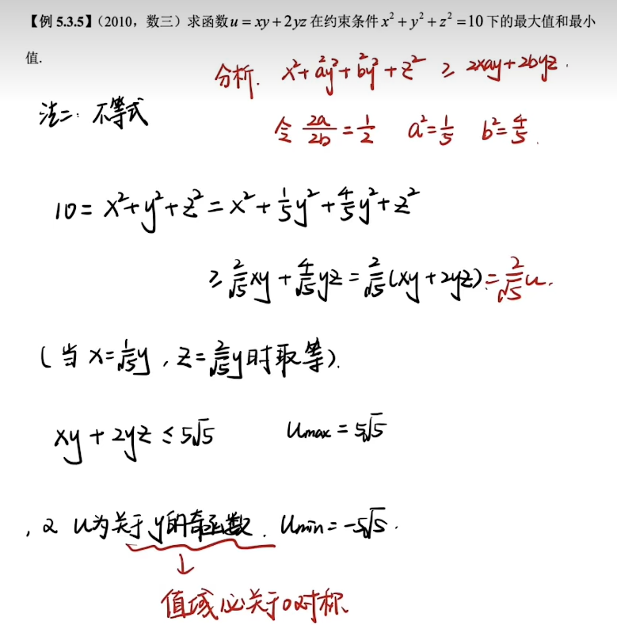
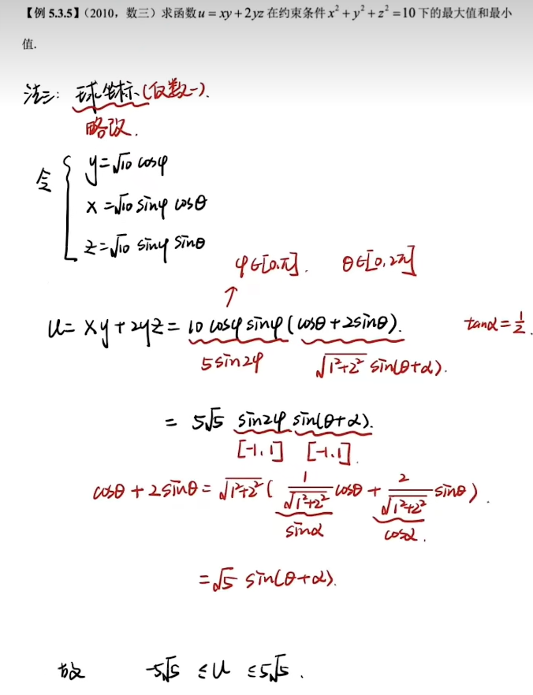
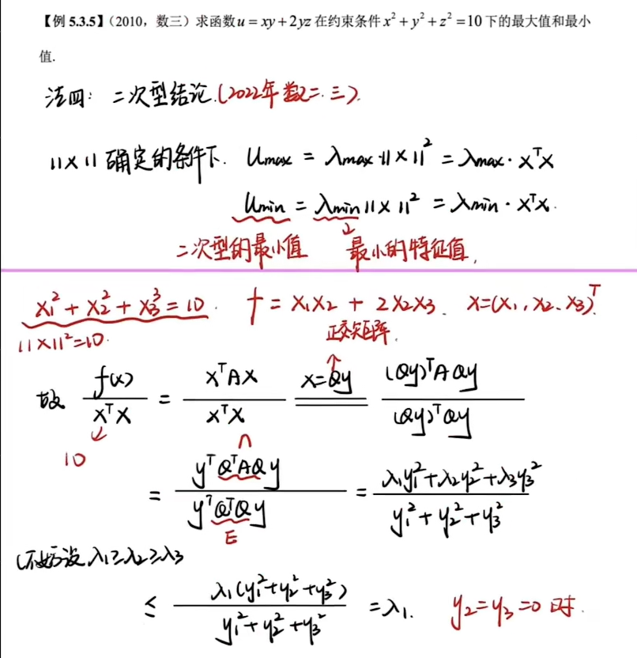
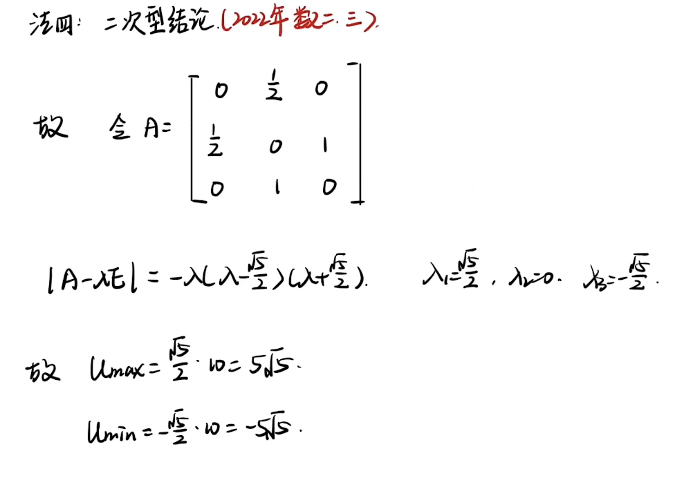

## 相关概念

- 若 $(x_0, y_0)$ 为 $f(x, y)$ 的极值点，则 $(x_0, y_0)$ 必为 $f(x, y)$ 的驻点
  - 极值存在的必要条件是取得极值和可偏导这里考虑偏导不存在
  - f (x, y) = |x| + |y| 在（0,0）点
- 若 $(x_0, y_0)$ 为 $f(x, y)$ 的驻点，则 $(x_0, y_0)$ 必为 $f(x, y)$ 的极值点
  - 根据充分条件还需要进一步验证
  - 反例：马鞍面
- 若 $f(x, y)$ 为有界闭区域 $D$ 上连续的函数 $f(x, y)$ 在 $D$ 内部的一极值点，且 $f(x, y)$ 在该点取极大值，则 $(x_0, y_0)$ 取值它在 $D$ 上的最大值
  - [有界闭区域的极值](#有界闭区域的极值)
  - 除了考虑极值点还有考虑 D 边界上的点
- 若 $(x_0, y_0)$ 在点 $(x_0, y_0)$ 取极大值，则 $f(x, y)$ 在 $x = x_0$ 处取极小值，$f(x, y)$ 在 $y = y_0$ 处取极小值

## 无条件极值

**二元函数极值存在的必要条件**
假设 $f(x,y)$ 在 $(x_0, y_0)$ 处取极值*且可偏导*，则必有 $f_x'(x_0, y_0) = f_y'(x_0, y_0) = 0$
称点 $(x_0, y_0)$ 为函数 $z = f(x, y)$ 的驻点

**二元函数极值存在的充分条件**
假设点 $(x_0, y_0)$ 已满足 $f_x'(x_0, y_0) = f_y'(x_0, y_0) = 0$，令

$$f_{xx}''(x_0, y_0) = A, f_{yy}''(x_0, y_0) = C, f_{xy}''(x_0, y_0) = B$$

则 $f(x, y)$ 在 $(x_0, y_0)$ 处是否取极值的条件如下：

$$
\begin{bmatrix}
f_{xx}''(x_0, y_0) & f_{xy}''(x_0, y_0) \\
f_{xy}''(x_0, y_0) & f_{yy}''(x_0, y_0)
\end{bmatrix} =
\begin{bmatrix}
A & B \\
B & C
\end{bmatrix}
$$

> [! ] 当 $\frac{dy}{dx} = 0$，即 $F_x = 0$ 时，
>
> $$\frac{d^2 y}{dx^2} = -\frac{F_{xx}}{F_y}$$

- 顺序主子式均大于 0 正定
- 奇数阶小于 0 偶数阶大于 0 负定
- 若偶数阶顺序主子式小于 0 称为不定

- 当 $AC - B^2 > 0$ 时，$(x_0, y_0)$ 处取极值
  - 当 $A < 0$ 时为极大值。$-+$ 负定
  - 当 $A > 0$ 时为极小值。$++$ 正定
- 当 $AC - B^2 < 0$ 时，$(x_0, y_0)$ 处不取极值
- 当 $AC - B^2 = 0$ 时，无法判断，使用定义
 
  - 即证明 $f(x, y) \geq f(x_0, y_0)$（或 $f(x, y) \leq f(x_0, y_0)$）在 $(x_0, y_0)$ 的邻域内恒成立
  - 从而证明 $(x_0, y_0)$ 处是为 $z = f(x, y)$ 的极小值点（或极大值点）
  - 找路径

##### 具体步骤

求 $z = f(x, y)$ 的极值，主要分为以下三步：

1. **解方程组**
   令 $\begin{cases} f_x'(x,y) = 0 \\ f_y'(x,y) = 0 \end{cases}$，求出 (同时）满足条件的 $x$ 和 $y$，由此组合成一切可能的驻点

2. **对于每一个驻点 $(x_0, y_0)$**
   求出其对应的二阶偏导数 $A$、$B$、$C$

3. **确定 $AC - B^2$ 的符号**

## 条件极值

> [! warning] 约束条件也有约束（端点）时, 单独算出端点进行比较。【2013 年数二】
> 

##### 拉格朗日乘数法

###### 条件最值与拉格朗日乘数法

求目标函数 $u = f (x, y, z)$ 在约束条件

$$
\begin{aligned}
\phi (x, y, z) &= 0 \\
\psi (x, y, z) &= 0
\end{aligned}
$$

下的极值。

> 步骤

1. 构造辅助函数

   $$
   F (x, y, z, \lambda, \mu) = f (x, y, z) + \lambda \phi (x, y, z) + \mu \psi (x, y, z)
   $$

2. 令

   $$
   \begin{aligned}
   F'_x &= f'_x + \lambda \phi'_x + \mu \psi'_x = 0, \\
   F'_y &= f'_y + \lambda \phi'_y + \mu \psi'_y = 0, \\
   F'_z &= f'_z + \lambda \phi'_z + \mu \psi'_z = 0, \\
   F'_λ &= \phi (x, y, z) = 0, \\
   F'_μ &= \psi (x, y, z) = 0.
   \end{aligned}
   $$

3. 解上述方程组得备选点 $P_i$, $i = 1, 2, 3, \dots, n$，并求 $f (P)$，取其最大值为 $u_{\max}$，最小值为 $u_{\min}$。

4. 根据实际问题，必存在极值，所得即为所求。

若从约束条件 $\phi (x, y, z) = 0$ 中易解出 $z = z (x, y)$，则将其代入 $f (x, y, z)$，得

$$
f (x, y, z (x, y)),
$$

可转化为无条件极值问题。

1. 从前几个式子中找出 $x,y,z$ 之间的关系，然后带入到 $\varphi (x,y,z)=0$ 中解出来
2. 先求出 $\lambda$ 的值，化简式子
3. 目标函数的极值可以用 $\lambda$ 表示，然后只用求 $\lambda$ 即可
4. 转换目标函数，使拉氏函数变的简单
5. 降维转变为一元函数求极值

###### 最远（近）点的垂线定理

[具体例子](https://zhuanlan.zhihu.com/p/399975884)

##### 硬核作差法（消除 $\lambda$）

二元做差两次，三元做差三次

##### 单项连等法

目标函数是 $f(x,y,z)=mx^{a}y^{b}z^{c}$ 时（ $m,a,b,c$ 均不为 0）

该方法可以通过讨论消除 $\lambda$ ，进而变成不含 $\lambda$ 的连等式或直接得到 $\lambda =0$ 。其中本题的连等式可以写成两个等式，因此本题也可以看成是变成了三个方程三个未知数的形式

##### 对称做差法

目标函数 $f(x, y, z)$ 和约束条件 $\varphi(x, y, z)$ 可能关于某些变量对称

- **关于 $y = x$ 对称**：如果互换 $x$ 和 $y$ 后，目标函数和约束条件不变
- **关于 $z = x$ 对称**：如果互换 $x$ 和 $z$ 后，目标函数和约束条件不变

**技巧简述：**

1. $f(x,y,z)$ 和 $\varphi(x,y,z)$ 关于 $y=x$ 对称：

    我们需要做的是让 $L_{x}^{'}=0$ 减去 $L_{y}^{'}=0$ ，得到的式子可以变形成：
    整式 $(y-x)(整式)=0$ ，从而简化计算
    如果其中有 $y≠x$ 的解，则将它的 ，$x，y$ 互换后则是另一个解

    > 例如： $(x,y,z)=(a,b,c)$ 是其中一个解，那么 $(x,y,z)=(b,a,c)$ 一定也是另一个解

2. 若 $f(x,y,z)$ 和 $\varphi(x,y,z)$ 关于 $y=z$ 对称：

    则让 $L_{y}^{'}=0$ 减去 $L_{z}^{'}=0$ ，得到的式子可以变形成：
    整式 $(y-z)(整式)=0$
    如果其中有 $y≠z$ 的解，则将它的 $y,z$ 互换后则是另一个解

3. 若 $f(x,y,z)$ 和 $\varphi(x,y,z)$ 即关于 $y=x$ 对称又关于 $y=z$ 对称：

    同时进行上面两个操作

##### 行列式求解法

##### 齐次构造法

如果目标函数 $f$ 是齐次的，同时约束条件可以转化成齐次函数 $g(x,y,z)=c$ 的形式

> 齐次函数说白了，就是每一项中变量的指数和都相等。比如： $g(x,y)=x^{2}+y^{2}+xy$ 就是 2 次齐次函数

**技巧简述：**

若此时目标函数 $f(x,y,z)$ 为 m 次齐次函数， $g(x,y,z)$ 为 n 次齐次函数 ( $m,n≠0$ )，则可以构造出这个式子： $f(x,y,z)=-\frac{cn}{m}\lambda$ 。此时再求出 $\lambda$ 的值即可求出目标函数 $f(x,y,z)$ 的最值

##### 目标函数转换法

如果可导函数 $g(x)$ 在目标函数值域内是单调的。那么求目标函数的极值点可以转化为求 目标函数 $g(目标函数)$ 的极值点

比如求 $f(x,y)$= $\sqrt{x^{2}+y^{2}}$ 在 $\varphi(x,y)=0$ 下的极值点，可以转变为求 $[f(x,y)]^{2}=x^{2}+y^{2}$ 在 $\varphi(x,y)=0$ 下的极值点。其中 $g(x)=x^{2}$ ，其可导且在 $f(x,y)$ 值域内 ( $[0,+\infty)$ ) 单调递增

##### 带入降维

把约束条件 $\varphi(x,y)=0$ 看成一个隐函数，如果这个隐函数可以显化，则可以将显化后的函数带入到目标函数中，进而可以 " 降维 " 成一元函数，从而利用一元函数知识求极值（求导，单调性）

##### 参数降维法

若约束条件中的 $\varphi(x,y)=0$ :
可以转变成形如： $ax^{2}+by^{2}=1$ (其中 a, b 大于 0)，
设 $x=\frac{cos\theta}{\sqrt{a}}$ , $y=\frac{sin\theta}{\sqrt{b}}$ ，再带入到目标函数中，继而解决问题

##### 不等式法

在求解极值问题时，常用的几类不等式包括以下几种，每种不等式都有不同的适用场景：

###### 均值不等式（AM-GM 不等式）

   均值不等式是解决极值问题时非常常用的不等式。对于非负实数 $a_1, a_2, \dots, a_n$，有：

   $$

   \frac{a_1 + a_2 + \dots + a_n}{n} \geq \sqrt[n]{a_1 a_2 \dots a_n}

   $$

   当且仅当 $a_1 = a_2 = \dots = a_n$ 时，等号成立

   应用场景：当需要将和（或加法表达式）转化为乘积（或乘法形式）时，均值不等式常被用来求最大值或最小值

###### 柯西 - 施瓦兹不等式（Cauchy-Schwarz Inequality）

   对于任意向量 $\mathbf{a} = (a_1, a_2, \dots, a_n)$ 和 $\mathbf{b} = (b_1, b_2, \dots, b_n)$，有：

   $$

   (a_1^2 + a_2^2 + \dots + a_n^2)(b_1^2 + b_2^2 + \dots + b_n^2) \geq (a_1 b_1 + a_2 b_2 + \dots + a_n b_n)^2

   $$

   当且仅当 $\mathbf{a}$ 和 $\mathbf{b}$ 线性相关时，等号成立

   应用场景：柯西不等式常用于解决具有内积或乘积形式的极值问题，特别是在二次型、积分、向量场的极值求解中

###### 杨氏不等式（Young's Inequality）

   对于正数 $a, b > 0$ 和 $p, q > 1$，且 $\frac{1}{p} + \frac{1}{q} = 1$，有：

   $$

   ab \leq \frac{a^p}{p} + \frac{b^q}{q}

   $$

   当且仅当 $a^p = b^q$ 时，等号成立

   应用场景：杨氏不等式常用于处理乘积形式的极值问题

###### 施密特不等式（Schur's Inequality）

   对于非负实数 $a \geq b \geq c \geq 0$，有：

   $$

   a(a - b)(a - c) + b(b - a)(b - c) + c(c - a)(c - b) \geq 0

   $$

   应用场景：施密特不等式在处理对称函数或三元不等式时有重要应用

## 有界闭区域的极值

#### D 的内部：无条件极值

#### D 的边界：条件极值

## 例题

### 2010 数三

[b站讲解](https://www.bilibili.com/video/BV12EHKe6Evg/)

#### 拉格朗日乘数法

#### 不等式

#### 参数法 (球坐标)

#### 二次型

### 最大方向导数

#### 1

已知函数 $f(x, y) = x + y + xy$，曲线 $C: x^2 + y^2 + xy = 3$，求 $f(x, y)$ 在曲线 $C$ 上的最大方向导数

$$

\nabla f(x, y) = \left( \frac{\partial f}{\partial x}, \frac{\partial f}{\partial y} \right)

$$

$$

\Rightarrow \nabla f(x, y) = (1 + y, 1 + x)

$$

函数 $f(x, y) = x + y + xy$ 在点 $(x, y)$ 处的最大方向导数为

$$

\sqrt{f_x'^2(x, y) + f_y'^2(x, y)} = \sqrt{(1 + y)^2 + (1 + x)^2}.

$$

构造拉格朗日函数

$$

L(x, y, \lambda) = (1 + y)^2 + (1 + x)^2 + \lambda (x^2 + y^2 + xy - 3).

$$

$$

\begin{cases}
L_x'(x, y, \lambda) = 2(1 + x) + 2\lambda x + \lambda y = 0 \quad \text{(1)} \\
L_y'(x, y, \lambda) = 2(1 + y) + 2\lambda y + \lambda x = 0 \quad \text{(2)} \\
L_\lambda'(x, y, \lambda) = x^2 + y^2 + xy - 3 = 0 \quad \text{(3)}
\end{cases}

$$

由 $L_y'(x, y, \lambda) = 2(1 + y) + 2\lambda y + \lambda x = 0$ (2) - (1) 得 $(y - x)(2 + \lambda) = 0$.

若 $y = x$, 则 $y = x = \pm1$.
若 $\lambda = -2$, 则 $x = 2, y = -1$ 或 $x = -2, y = 1$.

把两个点坐标代入 $\sqrt{(1 + y)^2 + (1 + x)^2}$ 中, 得曲线 $C$ 上的最大方向导数为 3.

#### 2

$F(x, y, z) = x^2 + y^2 + \frac{1}{\lambda + 2} z^3$

在曲面 Σ 上位于 $x^2 + y^2 \leq 1$ 部分沿 $I = \langle \lambda, \lambda, 2 \rangle$ 方向的方向导数的最大值.

#### 3

#### 4

### 求函数 $u = xy + 2 xz$ 在约束条件 $x^2+y^2+z^2 = 10$ 条件下的最值

#### $u = \sqrt{10} \cos t [\sqrt{10}\sin t \cdot \sin \theta + 2 \sqrt{ 10 } \sin t \cdot \cos \theta]$

> 答案：A
