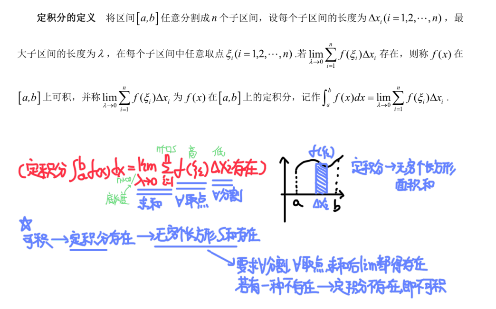
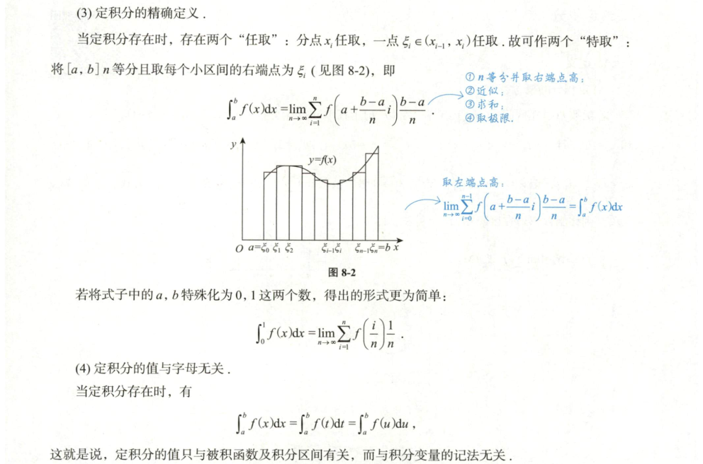
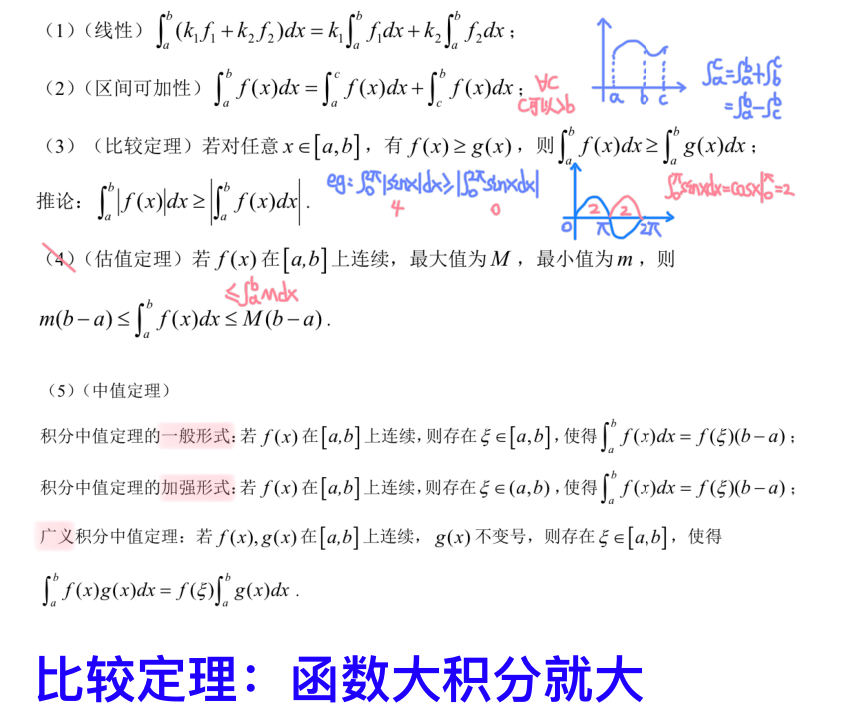
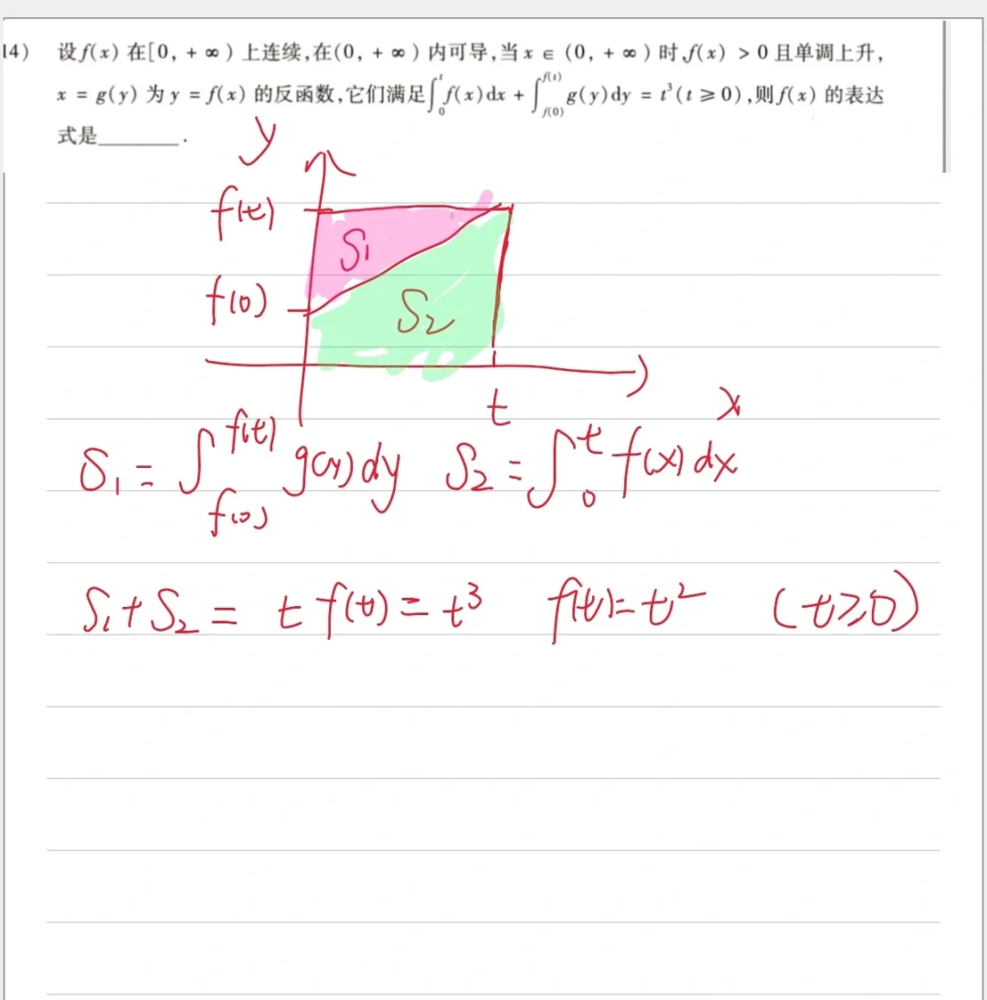

## 定积分

### 定积分的定义

[n项和极限](n项极限.md)

### 定积分的几何意义

- $\int_{a}^{b} f(x) dx$ 表示由曲线 $y = f(x)$ 与直线 $x = a$, $x = b$ 及 $x$ 轴所围成的面积

- **底为上、下限，高为被积函数：**

  - 底和高都为正或者都为负，积分为正，即面积为正
  - 底和高一正一负，积分为负，即面积的相反数

### 定积分的精确定义

### 定积分的性质

### Newton-Leibniz 公式（微积分基本定理）

### 可积性与连续性

1. 若 $f(x)$ 在 $[a, b]$ 上**可积**，则 $f(x)$ 在 $[a, b]$ 上**有界**

2. 若 $f(x)$ 在 $[a, b]$ 上**连续**，则 $f(x)$ 在 $[a, b]$ 上**可积**

3. 若 $f(x)$ 为 $[a, b]$ 上有**有限个间断点的有界函数**，则 $f(x)$ 在 $[a, b]$ 上**可积**

- 可积必有界
- 连续必可积
- 有限个间断点的有界函数可积

**关系链**: 可导 ➡ 连续 ➡ 可积 ➡ 有界

### 定积分的计算

## 变限积分

$$连续 \Rightarrow 原函数（变限积分）存在$$

### 变限积分的可导性

[30讲 p146]()

> 讨论：$F(x) = \int_{a}^{x} f(t) \, dt$ 在 $x = x_0$ 处的可导性，其中 $F(x)$ 在 $x = x_0$ 的领域内可导
> $F'(x_0) = \lim_{x \to x_0} \frac{F(x) - F(x_0)}{x - x_0} = \lim_{x \to x_0} \frac{\int_{x_0}^{x} f(t) \, dt}{x - x_0} \overset{L'H}{=} \lim_{x \to x_0} f(x)$
> 因此 $F(x)$ 在 $x = x_0$ 处是否可导，取决于 $\lim_{x \to x_0} f(x)$ 是否存在：

- **函数 $f(x)$ 连续**：
  - $F(x) = \int_{a}^{x} f(t) \, dt$ 可导，且 $F(x)$ 为 $f(x)$ 的原函数
    - $F'(x_0) = \lim_{x \to x_0} f(x) = f(x_0)$

- **$x = x_0$ 为可去间断点**：
  - $F(x) = \int_{a}^{x} f(t) \, dt$ 可导，但 $F(x)$ 不是 $f(x)$ 的原函数
  - 在 $x_0$ 处可导，但 $F(x)$ 的导数等于 $f$ 的左右极限而不是 $f(x)$ 的值
    - 即 $F'(x_0) = \lim_{x \to x_0} f(x)$

- **$x = x_0$ 是跳跃间断点**：
  - $F(x)$ 在这点 连续但不可导

  $$
   \begin{cases}
   F'_{+}(x_0) = \lim_{x \to x_0^{+}} f(x) \\
   F'_{-}(x_0) = \lim_{x \to x_0^{-}} f(x)
   \end{cases}
   $$

- **$x = x_0$ 是无穷间断点**：
  - $F(x)$ 在这点 连续但不可导

### 变限积分的求导公式

- **若** $f(x)$ 在 $[a, b]$ 上可积，则 $F(x)$ 在 $[a, b]$ 上连续。
- **若** $f(x)$ 在 $[a, b]$ 上连续，则 $F(x)$ 在 $[a, b]$ 上可导，且：

  $$
  F'(x) = f(x)
  $$

**推广**：若 $f(x)$ 连续，且 $u(x), v(x)$ 可导，则：

- $\left[ \int_{a}^{u(x)} f(t) \, dt \right]' = f(u(x)) u'(x)$
- $\left[ \int_{v(x)}^{a} f(t) \, dt \right]' = -f(v(x)) v'(x)$
- $\left[ \int_{v(x)}^{u(x)} f(t) \, dt \right]' = f(u(x)) u'(x) - f(v(x)) v'(x)$

- **若** $x = x_0$ 为 $f(x)$ 的可去间断点，则 $F(x)$ 在 $x = x_0$ 可导，但 $F'(x_0) \neq f(x_0)$。

- **若** $x = x_0$ 为 $f(x)$ 的跳跃间断点，则 $F(x)$ 在 $x_0$ 处连续但不可导。

### 原函数与绝对值函数的关系

1. $f(x)$ 连续 $\Rightarrow |f(x)|$ 连续，但反之不成立。
2. $f(x)$ 有间断点 $\nRightarrow |f(x)|$ 有间断点，但 $|f(x)|$ 有间断点 $\Rightarrow f(x)$ 有间断点。
3. $f(x)$ 有间断点 $\nRightarrow f^2(x)$ 有间断点，但 $f^2(x)$ 有间断点 $\Rightarrow f(x)$ 有间断点。
4. 设 $f(x)$ 在 $x_0$ 的去心邻域内有定义，则：
   $g(x) = f(x) |x - x_0|$ 在 $x_0$ 处可导的充要条件是 $f(x)$ 在 $x_0$ 处的左右极限存在且互为相反数。

5. 若 $f(x)$ 在 $x_0$ 处可导，则 $|f(x)|$ 在 $x_0$ 处的可导性为：
   - 当 $f(x_0) \neq 0$ 时，$|f(x)|$ 在 $x_0$ 处可导。
   - 当 $f(x_0) = 0$ 时，$|f(x)|$ 在 $x_0$ 处可导的充要条件是 $f'(x_0) = 0$。
   - 当 $f(x_0) = 0$ 且 $f'(x_0) \neq 0$ 时，$|f(x)|$ 在 $x_0$ 处不可导。

### 导数极限定理

设 $F(x)$ 在 $x_0$ 处连续，在 $U^o(x_0)$ 内可导，

- 若 $\lim\limits_{x \to x_0^+} F'(x) = A$ 或 $\infty$，则 $F'^+(x_0) = A$ 或 $\infty$
- 若 $\lim\limits_{x \to x_0^-} F'(x) = A$ 或 $\infty$，则 $F'^-(x_0) = A$ 或 $\infty$
- 若 $\lim\limits_{x \to x_0} F'(x) = A$ 或 $\infty$，则 $F'(x_0) = A$ 或 $\infty$

### 变限积分的奇偶性

1. **连续的奇函数**的原函数均为偶函数：

   $$
   \int_{0}^{x} f(t) \, dt + C
   $$

2. **连续的偶函数**只有一个原函数为奇函数：

   $$
   \int_{0}^{x} f(t) \, dt
   $$

3. **连续的周期函数**的原函数均为周期函数，当且仅当：

   $$
   \int_{0}^{T} f(x) \, dx = 0
   $$

[30讲 p176]()
[18讲 p264]()

### 变限积分的周期性

$$
\int_{0}^{\pi} f(\sin x) dx = 2 \cdot \int_{0}^{\frac{\pi}{2}} f(\sin x) dx
$$

$$

\int_{0}^{\pi} x \cdot f(\sin x) dx = \frac{\pi}{2} \cdot \int_{0}^{\pi} f(\sin x) dx
$$

给定 $f (x)$ 是周期为 $T$ 的可积函数，即满足：

$$
f (x + T) = f (x), \quad \forall x \in \mathbb{R},
$$

且 $f (x)$ 是可积的。

#### $\int_{a}^{a+T} f (x) \, dx = \int_{0}^{T} f (x) \, dx$

由于 $f (x)$ 是周期为 $T$ 的函数，即 $f (x + T) = f (x)$，则积分范围平移不会改变积分值：

$$
\int_{a}^{a+T} f (x) \, dx = \int_{0}^{T} f (x) \, dx.
$$

设 $x = u + a$，则有 $dx = du$，积分区间也随之变化，从 $a \to a + T$ 变为 $0 \to T$：

$$
\int_{a}^{a+T} f (x) \, dx = \int_0^T f (u + a) \, du = \int_0^T f (u) \, du = \int_0^T f (x) \, dx,
$$

#### $\int_{a}^{a+nT} f (x) \, dx = n \int_{0}^{T} f (x) \, dx$

#### 周期函数在任意区间上的积分

对于任意区间 $[a, b]$，我们可以将其划分为整数个周期 $T$ 加上一个残余部分。如果 $b = a + kT + r$（其中 $0 \leq r < T$），则：

$$
\int_a^b f (x) \, dx = k \int_0^T f (x) \, dx + \int_a^{a+r} f (x) \, dx.
$$

这个结果表明，可以将积分拆分为整周期的积分和剩余部分的积分。

#### 周期函数的平均值

周期为 $T$ 的函数的平均值 $f_{\text{avg}}$ 定义为：

$$
f_{\text{avg}} = \frac{1}{T} \int_0^T f (x) \, dx.
$$

如果要计算 $f (x)$ 在多个周期内的平均值，如 $nT$ 个周期，则平均值保持不变：

$$
f_{\text{avg}} = \frac{1}{nT} \int_0^{nT} f (x) \, dx = \frac{1}{T} \int_0^T f (x) \, dx.
$$

### 变限积分的积分的处理方法

#### 1. 交换积分次序【适用性最广】

#### 2. 分部积分

## 反函数的问题

$f(x),g(x)$ 互为反函数

$$
f(g(x)) = x
$$

### 反函数导数

$$d y = f'(x) d x \Rightarrow d x = \frac{d y}{f'(x)}$$

### 三角反函数

| 原函数          | 反函数             | 定义域                  | 值域                                                    |
| ------------ | --------------- | -------------------- | ----------------------------------------------------- |
| $y = x$      | $y = x$         | $x \in \mathbb{R}$   | $y \in \mathbb{R}$                                    |
| $y = \sin x$ | $y = \arcsin x$ | $x \in [-1, 1]$      | $y \in \left[-\frac{\pi}{2}, \frac{\pi}{2}\right]$    |
| $y = \cos x$ | $y = \arccos x$ | $x \in [-1, 1]$      | $y \in [0, \pi]$                                      |
| $y = \tan x$ | $y = \arctan x$ | $x \in \mathbb{R}$   | $y \in \left ( -\frac{\pi}{2}, \frac{\pi}{2} \right)$ |
| $y = e^x$    | $y = \ln x$     | $x \in (0, +\infty)$ | $y \in \mathbb{R}$                                    |

### 反函数的积分

#### 反函数积分公式

设函数 $f(x)$ 在区间 $[a, b]$ 上是**严格单调且可微**的，反函数为 $g(x)$

$$
\int_{f(a)}^{f(b)} g(y) \, dy = b f(b) - a f(a) - \int_a^b f(x) \, dx$$

该公式能够通过已知函数 $f(x)$ 的积分，简化反函数 $g(y)$ 的积分问题
#### 证明

利用反函数的性质 $g(f(x)) = x$，我们可以证明该公式
1. **反函数导数关系**：

   $$

   g'(y) = \frac{1}{f'(g(y))}   $$

   由于 $g(f(x)) = x$，并且 $f(x)$ 是可微的，因此 $g(y)$ 和 $f(x)$ 的积分具有对应关系
2. **换元积分**：考虑积分 $\int_{f(a)}^{f(b)} g(y) \, dy$，做变量代换 $y = f(x)$，得到：#🌟🌟🌟

   $$
   \int_{f(a)}^{f(b)} g(y) \, dy = \int_a^b x f'(x) \, dx   $$

3. **分部积分**：通过分部积分公式 $\int u \, dv = uv - \int v \, du$，令 $u = x$，$dv = f'(x) \, dx$，则：

   $$

   \int_a^b x f'(x) \, dx = \left[ x f(x) \right]_a^b - \int_a^b f(x) \, dx   $$

   所以得到反函数积分公式：

   $$
   \int_{f(a)}^{f(b)} g(y) \, dy = b f(b) - a f(a) - \int_a^b f(x) \, dx   $$

#### 应用

1. **简化反函数积分**：当 $g(y)$ 的积分较难直接计算时，可以通过已知 $f(x)$ 的积分来简化。例如，当 $f(x) = x^2$，其反函数 $g(y) = \sqrt{y}$ 的积分可以通过 $f(x)$ 的积分来求解
2. **几何解释**：这个公式也有几何上的解释，两个积分分别表示了不同坐标系下的面积，一个是 $f(x)$ 在 $(x, y)$ 坐标系下的面积，另一个是其反函数 $g(y)$ 在 $(y, x)$ 坐标系下的面积
### 反函数几何意义

设函数 $f(x)$ 在区间 $[0, a]$ 上单调递增并有连续的导数，且 $f(0) = 0$、$f(a) = b$。要求证明：

$$

\int_0^a f(x) \, dx + \int_0^b g(x) \, dx = ab,

$$

其中 $g(x)$ 是 $f(x)$ 的反函数
我们要证明对于 $a$，有函数恒等式：

$$

\int_0^a f(x) \, dx + \int_0^{f(a)} g(x) \, dx = a f(a)$$

#### 证明

1. **定义辅助函数**：设

   $$
   F(a) = \int_0^a f(x) \, dx + \int_0^{f(a)} g(x) \, dx - a f(a)   $$

2. **对 $a$ 求导**：接着对 $F(a)$ 求导，得到

   $$
   F'(a) = f(a) + g(f(a)) \cdot f'(a) - f(a) - af'(a)   $$

3. **利用反函数性质**：由于 $g(x)$ 是 $f(x)$ 的反函数，即 $g(f(a)) = a$，因此 $F'(a) = 0$，表明 $F(a)$ 是常数
4. **确定常数**：又因为 $F(0) = 0$，所以 $F(a)$ 为零，即

   $$
   \int_0^a f(x) \, dx + \int_0^{f(a)} g(x) \, dx = a f(a)   $$

5. **最终结论**：因为 $f(a) = b$，因此

   $$
   \int_0^a f(x) \, dx + \int_0^b g(x) \, dx = ab   $$

证明完毕

### 微分方程

