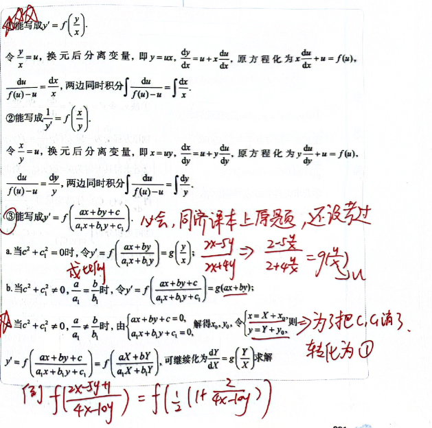
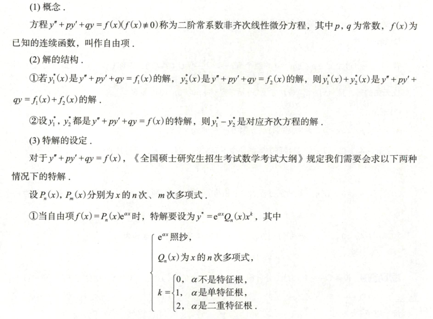
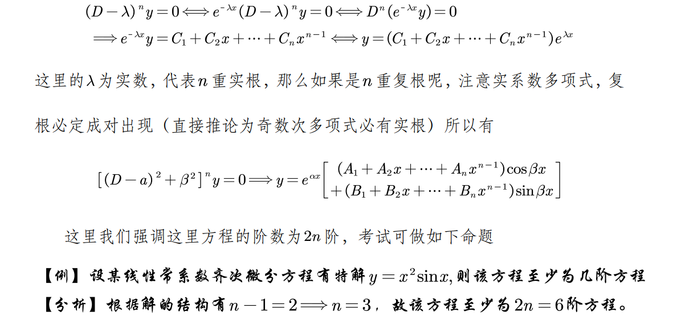

## 方程的解

[基础30讲 P265]()

[基础30讲 P273]()

- 非齐次解为 $y_1,y_2$
	- $\Rightarrow \quad y_{1}-y_{2}$ 齐次通解
	- $\Rightarrow \quad \lambda y_{1} + (1-\lambda) y_{2}$ 也是非齐次解

- 如果只给出了非齐次特解，去假设验证改解是否有齐次解的部分

### 积分问题

### 极限问题

### 周期问题

## 一阶微分方程求解

### 可分离变量型微分方程

####  $y' = f(x) \cdot g(y)$

 分离变量写成 $\frac{dy}{g(y)} = f(x)dx$，两边同时积分

$$
 \int \frac{dy}{g(y)} = \int f(x)dx
 $$

#### 能写成 $y' = f(ax + by + c)$

 令 $u = ax + by + c$，则 $u' = a + bf(u)$，分离变量写成

 $$
 \frac{du}{a + bf(u)} = dx \Rightarrow  \int \frac{du}{a + bf(u)} = \int dx
 $$

### 齐次微分方程

### 一阶线性 $y' = p(x)\cdot y = q(x)$

$$
y  = e^{- \int p(x) \, dx} \cdot \left[ \int q(x) \cdot e^{\int p(x) \, dx}  + C \right] , \ \text{其中 C为任意常数}
$$

#### 推导通解公式

在方程两边同时乘以 $e^{\int p(x) \, dx}$，得：

$$
e^{\int p(x) \, dx} \cdot y' + e^{\int p(x) \, dx} \cdot p(x) \cdot y = e^{\int p(x) \, dx} \cdot q(x),
$$

$$
\left[ e^{\int p(x) \, dx} \cdot y \right]' = e^{\int p(x) \, dx} \cdot q(x) \Rightarrow
e^{\int p(x) \, dx} \cdot y = \int e^{\int p(x) \, dx} \cdot q(x) \, dx + C
$$

$$
y = e^{-\int p(x) \, dx} \left[ \int e^{\int p(x) \, dx} \cdot q(x) \, dx + C \right].
$$

> [! ]  $e^{\int p(x) \, dx} = |\varphi(x)|$ 可不加绝对值。在其他计算过程中，若出现 $\ln u$，且 $u$ 不知正负，一律加绝对值。

---

由于 $\int p(x) \, dx$ 与 $\int q(x) e^{\int p(x) \, dx} \, dx$ 均应当理解为某一不含任意常数的原函数，故公式亦可写成：

$$
y = e^{-\int_{x_{0}}^x p(t) \, dt} \left[ \int_{x_0}^{x} q(t) e^{\int_{x_{0}}^{t} p(s) \, dts} \, dt + C \right],
$$

这里的 $x_0$ 在题设未提出定值要求时，可按方便解题的原则来取。

### 伯努利方程 $f(x) \cdot y^n$

方程 $\frac{dy}{dx} + p(x)y = q(x)y^n$ ($n \neq 0, 1$) 叫做伯努利方程

原方程两端同时除以 $y^n$ 可得

$$
y^{-n} \frac{dy}{dx} + p(x)y^{1-n} = q(x)
$$

令 $z = y^{1-n}$，则 $\frac{dz}{dx} = (1-n) y^{-n} \frac{dy}{dx}$

$$
\frac{1}{1-n}\frac{dz}{dx} + p(x)z = qx(x)
$$

解该一阶线性微分方程，并用 $y^{1-n}$ 代回 $z$ 便可得原方程的解

### 全微分方程

 若一个微分方程能写成 $P(x, y) dx + Q(x, y) dy = 0$ 的形式，而 $P(x, y) dx + Q(x, y) dy$ 为某一个函数 $u(x, y)$ 的全微分，则上述方程称为全微分方程，$u(x, y) = C$ 是它的隐式通解，其中 $C$ 为任意常数。

### 二阶可降幂微分方程（换元法）

我们遇到的可降阶的高阶微分方程一般可分为以下三类：

1. $y'' = f(x, y')$ 型：令 $y' = p$，则 $y'' = p'$，方程化为 $p' = f(x, p)$。
2. $y'' = f(y, y')$ 型：令 $y' = p$，则 $y'' = p \frac{dp}{dy}$，方程化为 $p \frac{dp}{dy} = f(y, p)$。
3. $y^{(n)} = f(x)$ 型：对 $f(x)$ 进行 $n$ 次不定积分。

## 二阶常系数齐次

二阶常系数齐次线性微分方程 $y'' + py' + qy = 0$ ( $p, q$ 为常数 ) 通解的求法

1. 写出特征方程 $\lambda^2 + p\lambda + q = 0$;
2. 求出特征方程的两个根 $\lambda_1, \lambda_2$;
3. 根据特征方程两个根的不同情形，按照下述表格写出通解。

|   特征方程 $\lambda^2 + p\lambda + q = 0$ 的根    |              微分方程 $y'' + py' + qy = 0$ 的通解               |
| :-----------------------------------------: | :------------------------------------------------------: |
|       两个不相等的实根 $\lambda_1, \lambda_2$       |     $y = C_1 e^{\lambda_1 x} + C_2 e^{\lambda_2 x}$      |
|       两个相等的实根 $\lambda_1 = \lambda_2$       |            $y = (C_1 + C_2 x)e^{\lambda_1 x}$            |
| 一对共轭复根 $\lambda_{1,2} = \alpha \pm \beta i$ | $y = e^{\alpha x} (C_1 \cos \beta x + C_2 \sin \beta x)$ |

## 二阶常系数非齐次

#### 待定系数

#### 例题

##### 已知特解求另一特解

> 设 $y = x e^x + x$ 是方程 $y'' + p y' + q y = a e^x + b$ 的一个特解，则下列函数中也是该方程的特解的是（）。

- (A) $y = e^{2x} + x e^x + x$
- (B) $y = (x + 1) e^x + x$
- (C) $y = x e^x + 2x$
- (D) $y = 2x e^x + x$
---

思考：
1. 两个不相等实根，$y = C_1 e^{\lambda_1 x} + C_2 e^{\lambda_2 x}$ ❌
2. 两个相等重根，$y = (C_1 + C_2 x)e^{\lambda_1 x}$ 对应题目 $xe^x$ 但是非齐次部分也是 $a \cdot e^x$ 此时待定系数应该为 $x^2 \cdot e^x$ ❌
3. 共轭复根 ❌
4. 综上 不包括齐次部分

#### 微分算子

##### $f(x) = e^{kx}$ 见 D 换 k

#### 特殊公式法

[【数一147】【独家大招系列】“公式法”秒杀微分方程特解_哔哩哔哩_bilibili](https://www.bilibili.com/video/BV14u4y1F7yr/)

$$
y'' + py' + qy = u(x) \cdot e^{ax}
$$

- 特征方程：$r^2 + pr + q = 0$

$$
[u'' + (2\lambda + p) u' + (\lambda^2 + p\lambda + q)u] \cdot e^{ax} = u(x) \cdot e^{ax}
$$

##### 例题 1

$$
y'' - 5y' + 6y = xe^{2x}
$$

- 特征方程：$r^2 - 5r + 6 = 0 \quad (r-2)(r-3) = 0$
- 通解：$y_{\text{通}} = C_1 e^{2x} + C_2 e^{3x}$
- 尝试特解：$y^* = x(ax + b)e^{2x}，u(x) = ax + b$

将 $y^*$ 代入方程：

$$
\left[u'' + (2λ + p)u' + (λ^2 + pλ + q)u\right]e^{λx} = x e^{2x}
$$

方程整理后：

$$
(2a + ( - 1)(2ax + b))e^{2x} = xe^{2x} = (-2ax + (2a-b))e^{2x}
$$

$$
-2a = 1 \quad \Rightarrow \quad a = -\frac{1}{2}
$$

$$
2a - b = 0 \quad \Rightarrow \quad b = -1
$$

特解：

$$
y^* = \left(-\frac{1}{2}x^2 - x\right)e^{2x}
$$

##### 例题 2

2010 数一 求微分方程的通解

$$
y'' - 3y' + 2y = 2xe^x
$$

- 特征方程：$r^2 - 3r + 2 = 0, \quad (r - 1)(r - 2) = 0$
- 通解：$y_{\text{齐}} = C_1e^x + C_2e^{2x}$
- 尝试特解：$y^* = x(AX + B)e^x$

代入方程：

$$
\left[ u'' + (2x + p)u' + (\lambda^2 + p\lambda + q)u \right] e^x = 2xe^x
$$

$$
\left[ 2A + (x-1)(2Ax + B) \right] e^x = 2xe^x \quad \Rightarrow \quad \text{对比求解}
$$

$$
-2A = 2 \quad \Rightarrow \quad A = -1
$$

$$
2A - B = 0 \quad \Rightarrow \quad B = -2
$$

$$
\Rightarrow y^* = (-x^2 - 2x)e^x
$$

## 高阶微分方程

### n (n>2) 阶常系数

1. **若 $r$ 为单实根**，写为：

   $$
   C e^{r x}
   $$

2. **若 $r$ 为 $k$ 重实根**，写为：

   $$
   \left( C_1 + C_2 x + C_3 x^2 + \dots + C_k x^{k-1} \right) e^{r x}
   $$

3. **若 $r$ 为单复根 $\alpha \pm \beta i$**，写为：

   $$
   e^{\alpha x} \left( C_1 \cos \beta x + C_2 \sin \beta x \right)
   $$

4. **若 $r$ 为二重复根 $\alpha \pm \beta i$**，写为：

   $$
   e^{\alpha x} \left( C_1 \cos \beta x + C_2 \sin \beta x + C_3 x \cos \beta x + C_4 x \sin \beta x \right)
   $$

#### 注

1. 如果解中含特解 $e^{r x}$，则 $r$ 至少为单实根；
2. 如果解中含特解 $x^k e^{r x}$，则 $r$ 至少为 $k$ 重实根；
3. 如果解中含特解 $e^{\alpha x} \cos \beta x$ 或 $e^{\alpha x} \sin \beta x$，则 $\alpha \pm \beta i$ 至少为单复根；
4. 如果解中含特解 $x e^{\alpha x} \cos \beta x$ 或 $x e^{\alpha x} \sin \beta x$，则 $\alpha \pm \beta i$ 至少为二重复根。

### 欧拉方程

$$
(xD - \lambda_1)(xD - \lambda_2)y = 0 \implies y = C_1 x^{\lambda_1} + C_2 x^{\lambda_2}
$$

$$
(xD - \lambda_1)(xD - \lambda_2)y = x^2 y'' + (1 - (\lambda_1 + \lambda_2))xy' + \lambda_1 \lambda_2 y
$$

$$
r^2 - 4 = 0 \Rightarrow r = 2,-2 \Rightarrow y = C_{1} \cdot x^{-2} + C_{2} \cdot x^2
$$

$$
y (1) = 1, y' (1) = 2 \Rightarrow C_{1} + C_{2} = 1, -2 C_{1} + 2 C_{2} = 2
$$

$$
C_{1} = 0, C_{2} = 1 \Rightarrow y = x^2
$$

## 对微分方程积分

## 解的结构

![[images/Pasted image 20241031125855.png]]

## Tricks

### $y'' - y = f ( x )$

- $[e^{x}(y'-t)]' = y'' - y$
- 通解
  - $r^2-1 = 0,r_1 = 1, r_2 = -1$
  - $y = C_1e^x + C_2 e^{-x}$

