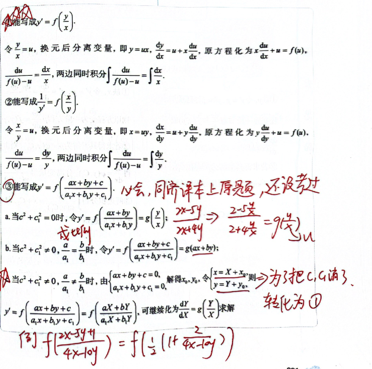
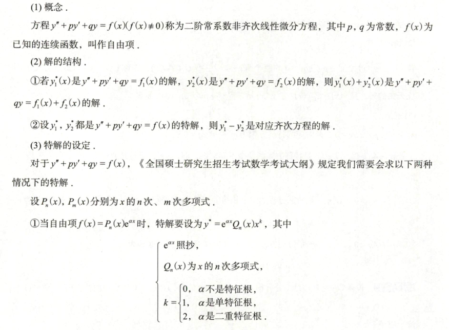

## 方程的解

[基础30讲 P265]()

[基础30讲 P273]()

非齐次解为 $y_1,y_2$
$\Rightarrow \quad y_{1}-y_{2}$ 齐次通解
$\Rightarrow \quad \lambda y_{1} + (1-\lambda) y_{2}$ 也是非齐次解

## 一阶微分方程求解

### 可分离变量型微分方程

1. 能写成 $y' = f(x) \cdot g(y)$

    分离变量写成 $\frac{dy}{g(y)} = f(x)dx$，两边同时积分

    $$
    \int \frac{dy}{g(y)} = \int f(x)dx
    $$

2. 能写成 $y' = f(ax + by + c)$

    令 $u = ax + by + c$，则 $u' = a + bf(u)$，分离变量写成

    $$
    \frac{du}{a + bf(u)} = dx
    $$

    $$
    \int \frac{du}{a + bf(u)} = \int dx
    $$

### 齐次微分方程

### 一阶线性

$$
y' = p(x)\cdot y = q(x)
$$

### 伯努利方程 $f(x) \cdot y^n$

方程 $\frac{dy}{dx} + p(x)y = q(x)y^n$ ($n \neq 0, 1$) 叫做伯努利方程

原方程两端同时除以 $y^n$ 可得

$$
y^{-n} \frac{dy}{dx} + p(x)y^{1-n} = q(x)
$$

令 $z = y^{1-n}$，则

$$
\frac{dz}{dx} = (1-n) y^{-n} \frac{dy}{dx}
$$

$$
\frac{1}{1-n}\frac{dz}{dx} + p(x)z = qx(x)
$$

解该一阶线性微分方程，并用 $y^{1-n}$ 代回 $z$ 便可得原方程的解

### 全微分方程

 若一个微分方程能写成

$$
P(x, y) dx + Q(x, y) dy = 0
$$

的形式，而 $P(x, y) dx + Q(x, y) dy$ 为某一个函数 $u(x, y)$ 的全微分，则上述方程称为全微分方程，$u(x, y) = C$ 是它的隐式通解，其中 $C$ 为任意常数

### 二阶可降幂微分方程（换元法）

## 二阶常系数齐次

## 二阶常系数非齐次

#### 待定系数

#### 微分算子

#### 特殊公式法

[【数一147】【独家大招系列】“公式法”秒杀微分方程特解_哔哩哔哩_bilibili](https://www.bilibili.com/video/BV14u4y1F7yr/)

$$
y'' + py' + qy = u(x) \cdot e^{ax}
$$

- 特征方程：$r^2 + pr + q = 0$

$$
[u'' + (2\lambda + p) u' + (\lambda^2 + p\lambda + q)u] \cdot e^{ax} = u(x) \cdot e^{ax}
$$

##### 例题 1

$$
y'' - 5y' + 6y = xe^{2x}
$$

- 特征方程：$r^2 - 5r + 6 = 0 \quad (r-2)(r-3) = 0$
- 通解：$y_{\text{通}} = C_1 e^{2x} + C_2 e^{3x}$
- 尝试特解：$y^* = x(ax + b)e^{2x}，u(x) = ax + b$

将 $y^*$ 代入方程：

$$
\left[u'' + (2λ + p)u' + (λ^2 + pλ + q)u\right]e^{λx} = x e^{2x}
$$

方程整理后：

$$
(2a + ( - 1)(2ax + b))e^{2x} = xe^{2x} = (-2ax + (2a-b))e^{2x}
$$

$$
-2a = 1 \quad \Rightarrow \quad a = -\frac{1}{2}
$$

$$
2a - b = 0 \quad \Rightarrow \quad b = -1
$$

特解：

$$
y^* = \left(-\frac{1}{2}x^2 - x\right)e^{2x}
$$

#### 例题 2

2010 数一 求微分方程的通解

$$
y'' - 3y' + 2y = 2xe^x
$$

- 特征方程：$r^2 - 3r + 2 = 0, \quad (r - 1)(r - 2) = 0$
- 通解：$y_{\text{齐}} = C_1e^x + C_2e^{2x}$
- 尝试特解：$y^* = x(AX + B)e^x$

代入方程：

$$
\left[ u'' + (2x + p)u' + (\lambda^2 + p\lambda + q)u \right] e^x = 2xe^x
$$

$$
\left[ 2A + (x-1)(2Ax + B) \right] e^x = 2xe^x \quad \Rightarrow \quad \text{对比求解}
$$

$$
-2A = 2 \quad \Rightarrow \quad A = -1
$$

$$
2A - B = 0 \quad \Rightarrow \quad B = -2
$$

$$
\Rightarrow y^* = (-x^2 - 2x)e^x
$$

## 高阶微分方程

### n 阶常系数

### 欧拉方程

$$
(xD - \lambda_1)(xD - \lambda_2)y = 0 \implies y = C_1 x^{\lambda_1} + C_2 x^{\lambda_2}
$$

$$
(xD - \lambda_1)(xD - \lambda_2)y = x^2 y'' + (1 - (\lambda_1 + \lambda_2))xy' + \lambda_1 \lambda_2 y
$$

$$
r^2 - 4 = 0 \Rightarrow r = 2,-2 \Rightarrow y = C_{1} \cdot x^{-2} + C_{2} \cdot x^2
$$

$$
y (1) = 1, y' (1) = 2 \Rightarrow C_{1} + C_{2} = 1, -2 C_{1} + 2 C_{2} = 2
$$

$$
C_{1} = 0, C_{2} = 1 \Rightarrow y = x^2
$$

## 对微分方程积分

## 解的结构

## Tricks

### $y'' - y = f ( x )$

- $[e^{x}(y'-t)]' = y'' - y$
- 通解
  - $r^2-1 = 0,r_1 = 1, r_2 = -1$
  - $y = C_1e^x + C_2 e^{-x}$
