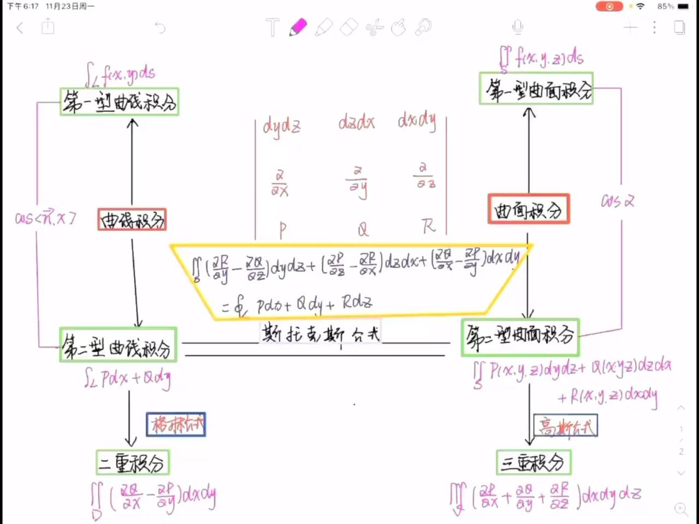
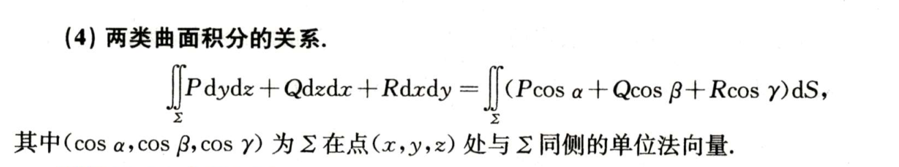

## 预备知识

### 方向角，方向余弦

非零向量 $r$ 与三条坐标轴的夹角 $\alpha$, $\beta$, $\gamma$ 称为向量 $r$ 的**方向角**

$$
(\cos \alpha, \cos \beta, \cos \gamma) = \left ( \frac{x}{|r|}, \frac{y}{|r|}, \frac{z}{|r|} \right) = \frac{1}{|r|}(x, y, z) = \frac{r}{|r|} = e_r.
$$

$\cos \alpha$, $\cos \beta$, $\cos \gamma$ 称为向量 $r$ 的**方向余弦**
以向量 $r$ 的方向余弦为坐标的向量就是与 $r$ 同方向的单位向量 $e_r$
从而 $\cos^2 \alpha + \cos^2 \beta + \cos^2 \gamma = 1$
**方向余弦的取值范围**为 $[-1, 1]$

### 向量混合积

### 切线与法平面

#### 用参数方程给出曲线

$$
\begin{cases}
x = x(t), \\
y = y(t), t \in I, \\
z = z(t),
\end{cases}
$$

其在 $P_0(x_0, y_0, z_0)$ 处的切向量 $\tau = (x'(t_0), y'(t_0), z'(t_0))$。

**切线**方程：$\frac{x - x_0}{x' (t_0)} = \frac{y - y_0}{y' (t_0)} = \frac{z - z_0}{z' (t_0)}$

- 注意 x, y, z 的系数归为 $+1$，在前面如果 $z_{0}-z$ 下面也要取相反数
**法平面**方程：$x'(t_0)(x - x_0) + y'(t_0)(y - y_0) + z'(t_0)(z - z_0) = 0$

> [! ] 线在分母，面在分母

#### 用方程组给出曲线：$

\begin{cases}
F(x, y, z) = 0, \\
G(x, y, z) = 0.
\end{cases}
$

当 $\frac{\partial (F, G)}{\partial (y, z)} \neq 0$ 时 $
\begin{cases}
x = x, \\
y = y(x), \\
z = z(x).
\end{cases}
$
其在 $P_0(x_0, y_0, z_0)$ 处的切向量 $\tau = (1, y'(x_0), z'(x_0))$，其中

$$
y'(x_0) = - \frac{\frac{\partial (F, G)}{\partial (x, z)}}{\frac{\partial (F, G)}{\partial (y, z)}}, \quad z'(x_0) = - \frac{\frac{\partial (F, G)}{\partial (x, y)}}{\frac{\partial (F, G)}{\partial (y, z)}}.
$$

**切线**方程：$\frac{x - x_0}{1} = \frac{y - y_0}{y' (x_0)} = \frac{z - z_0}{z' (x_0)}$
**法平面**方程：$1 (x - x_0) + y' (x_0)(y - y_0) + z' (x_0)(z - z_0) = 0$

> [! ] 线在分母，面在分母

$$
\tau = \begin{vmatrix} \frac{\partial (F, G)}{\partial (y, z)}, & \frac{\partial (F, G)}{\partial (x, z)}, & \frac{\partial (F, G)}{\partial (x, y)} \end{vmatrix}_{P_0}
=
\begin{vmatrix}
i & j & k \\
F'_x & F'_y & F'_z \\
G'_x & G'_y & G'_z
\end{vmatrix}_{P_0}
$$

#### 例题

### 切平面与法线

#### 用隐式方程给出曲面：$F(x, y, z) = 0$

其在 $P_0(x_0, y_0, z_0)$ 处的法向量 $n = \left( F_x', F_y', F_z' \right)_{P_0}$。

**切平面方程**：$F_x' \cdot (x - x_0) + F_y' \cdot (y - y_0) + F_z' \cdot (z - z_0) = 0$

**法线方程**：$\frac{x - x_0}{F_x'} = \frac{y - y_0}{F_y'} = \frac{z - z_0}{F_z'}$

---

#### 用显式函数给出曲面：$z = f(x, y)$ 或 $f(x, y) - z = 0$

其在 $P_0(x_0, y_0, z_0)$ 处的法向量 $n = \left( f_x'(x_0, y_0), f_y'(x_0, y_0), -1 \right)$，且**法向量方向向下**。

**切平面方程**：$f_x'(x_0, y_0)(x - x_0) + f_y'(x_0, y_0)(y - y_0) - (z - z_0) = 0$

**法线方程**：$\frac{x - x_0}{f_x' (x_0, y_0)} = \frac{y - y_0}{f_y' (x_0, y_0)} = \frac{z - z_0}{-1}$

---

#### 用参数方程给出曲面

$$
\begin{cases}
x = x(u, v), \\
y = y(u, v), \\
z = z(u, v)
\end{cases}
$$

已知 $x_0 = x(u_0, v_0), y_0 = y(u_0, v_0), z_0 = z(u_0, v_0)$。

- 固定 $v = v_0$ 曲线在 $P_0(x_0, y_0, z_0)$ 处的切向量为 $\tau_1 = (x_u', y_u', z_u')|_{P_0}$。
- 固定 $u = u_0$ 曲线在 $P_0(x_0, y_0, z_0)$ 处的切向量为 $\tau_2 = (x_v', y_v', z_v')|_{P_0}$。

曲面法向量与 $\tau_1, \tau_2$ 垂直，取：

$$
n = \begin{vmatrix}
i & j & k \\
x_u' & y_u' & z_u' \\
x_v' & y_v' & z_v'
\end{vmatrix} = (A, B, C)
$$

**切平面方程**：

$$
A(x - x_0) + B(y - y_0) + C(z - z_0) = 0
$$

**法线方程**：

$$
\frac{x - x_0}{A} = \frac{y - y_0}{B} = \frac{z - z_0}{C}
$$

### 直线

> [! ] 以下假设直线的**方向向量** $\tau = (l, m, n)$。

#### 一般式

   $$
   \begin{cases}
   A_1 x + B_1 y + C_1 z + D_1 = 0, \\
   A_2 x + B_2 y + C_2 z + D_2 = 0,
   \end{cases}
   $$

   其中 $n_1 = (A_1, B_1, C_1), n_2 = (A_2, B_2, C_2)$，且 $n_1 \times n_2 \neq 0$。

   **【注】** 其几何背景很直观，是两个平面的交线，且该直线的**方向向量** $\tau = n_1 \times n_2$。

#### 点向式（标准式、对称式）

   $$
   \frac{x - x_0}{l} = \frac{y - y_0}{m} = \frac{z - z_0}{n}
   $$

#### 参数式

   $$
   \begin{cases}
   x = x_0 + lt, \\
   y = y_0 + mt, \\
   z = z_0 + nt,
   \end{cases}
   $$

   其中 $M(x_0, y_0, z_0)$ 为直线上的已知点，$t$ 为参数。

#### 两点式

   $$
   \frac{x - x_1}{x_2 - x_1} = \frac{y - y_1}{y_2 - y_1} = \frac{z - z_1}{z_2 - z_1}
   $$

（直线过不同的两点 $P_i(x_i, y_i, z_i), i = 1, 2$）。

### 线面关系

#### 点到平面的距离

点 $P_0(x_0, y_0, z_0)$ 到平面 $Ax + By + Cz + D = 0$ 的距离 $d$ 为：

$$
d = \frac{|Ax_0 + By_0 + Cz_0 + D|}{\sqrt{A^2 + B^2 + C^2}}.
$$

#### 直线与直线

设 $\tau_1 = (l_1, m_1, n_1), \tau_2 = (l_2, m_2, n_2)$ 分别为直线 $L_1, L_2$ 的**方向向量**。

1. $L_1 \perp L_2 \iff \tau_1 \perp \tau_2 \iff l_1 l_2 + m_1 m_2 + n_1 n_2 = 0$.

2. $L_1 \parallel L_2 \iff \tau_1 \parallel \tau_2 \iff \frac{l_1}{l_2} = \frac{m_1}{m_2} = \frac{n_1}{n_2}$.

3. 直线 $L_1, L_2$ 的夹角 $\theta = \arccos \left( \frac{|\tau_1 \cdot \tau_2|}{|\tau_1| |\tau_2|} \right)$，其中 $\theta = \min(\langle \tau_1, \tau_2 \rangle, \pi - \langle \tau_1, \tau_2 \rangle) \in \left[ 0, \frac{\pi}{2} \right]$。

#### 平面与平面

设平面 $\pi_1, \pi_2$ 的法向量分别为 $n_1 = (A_1, B_1, C_1), n_2 = (A_2, B_2, C_2)$。

1. $\pi_1 \perp \pi_2 \iff n_1 \perp n_2 \iff A_1 A_2 + B_1 B_2 + C_1 C_2 = 0$.

2. $\pi_1 \parallel \pi_2 \iff n_1 \parallel n_2 \iff \frac{A_1}{A_2} = \frac{B_1}{B_2} = \frac{C_1}{C_2}$.

3. 平面 $\pi_1, \pi_2$ 的夹角 $\theta = \arccos \left( \frac{|n_1 \cdot n_2|}{|n_1| |n_2|} \right)$，其中 $\theta = \min(\langle n_1, n_2 \rangle, \pi - \langle n_1, n_2 \rangle) \in \left[ 0, \frac{\pi}{2} \right]$。

#### 平面与直线

设直线 $L$ 的方向向量为 $\tau = (l, m, n)$，平面 $\pi$ 的法向量为 $n = (A, B, C)$。

1. $L \perp \pi \iff \tau \perp n \iff lA + mB + nC = 0$。

2. $L \parallel \pi \iff \tau \parallel n \iff \frac{l}{A} = \frac{m}{B} = \frac{n}{C}$。

3. 直线 $L$ 与平面 $\pi$ 的夹角 $\theta = \arcsin \left( \frac{|\tau \cdot n|}{|\tau| |n|} \right)$，其中 $\theta = \frac{\pi}{2} - \langle \tau, n \rangle \in \left[ 0, \frac{\pi}{2} \right]$。

#### 证明柱面：曲面上任意一点法向量垂直于定向量

### 距离公式

### 旋转曲面 #🌟🌟🌟

### 向量方向 正向？反向？

方向导数是一个 `数`

> [! note] 在没有具体向量的情况下，所谓沿着…方向，暗含两种情况
> 即：±(a, b, c)

### 通量

### 方向导数【方向导数是一个数】

> [! ] 函数在某点的最大方向导数等于该点梯度的模

#### 定义

 $z = f (x, y)$ 在点 $P_0 (x_0, y_0)$ 处沿 $l = (\cos \alpha, \cos \beta)$ 方向的变化率为

$$
\frac{\partial f}{\partial l} \Big|_{(x_0, y_0)} = \lim_{t \to 0^+} \frac{f (x_0 + t \cos \alpha, y_0 + t \cos \beta) - f (x_0, y_0)}{t}.
$$

上式即为 $z = f (x, y)$ 在点 $P_0 (x_0, y_0)$ 处沿 $l$ 方向的方向导数

#### 计算

设 $z = f (x, y)$ 在点 $P_0 (x_0, y_0)$ 处**可微**，
则 $f (x, y)$ 在 $P_0 (x_0, y_0)$ 处沿 $l = (\cos \alpha, \cos \beta)$ 的**方向导数**为

$$
\frac{\partial f}{\partial l} \Big|_{P_0} = \lim_{\rho \to 0} \frac{f (x_0 + \Delta x, y_0 + \Delta y) - f (x_0, y_0)}{\sqrt{(\Delta x)^2 + (\Delta y)^2}} = \lim_{\Delta x \to 0, \Delta y \to 0} \frac{f_x' (x_0, y_0) \Delta x + f_y' (x_0, y_0) \Delta y + o (\rho)}{\sqrt{(\Delta x)^2 + (\Delta y)^2}}
$$

$$
= f_x' (x_0, y_0) \cos \alpha + f_y' (x_0, y_0) \cos \beta.
$$

同理，三元函数 $u = f (x, y, z)$ 在 $P_0 (x_0, y_0, z_0)$ 处沿 $l = (\cos \alpha, \cos \beta, \cos \gamma)$ 的**方向导数**为

$$
\frac{\partial u}{\partial l} \Big|_{P_0} = f_x' (x_0) \cos \alpha + f_y' (x_0) \cos \beta + f_z' (x_0) \cos \gamma.
$$

#### 方向导数与偏导数的连续

##### $f_x$ 在点 $P$ 处存在 $\Longleftrightarrow$ $f$ 在点 $P$ 处沿 $x$ 轴正、负方向的方向导数均存在并且互为相反数

##### $f_y$ 在点 $P$ 处存在 $\Longleftrightarrow f$ 在点 $P$ 处沿 $y$ 轴正、负方向的方向导数均存在并且互为相反数

##### $f$ 在点 $P$ 处可微 $\Rightarrow f$ 在点 $P$ 处沿 $x$ 轴正、负方向的方向导数均存在并且互为相反数

##### $f$ 在点 $P$ 处可微 $\Rightarrow f$ 在点 $P$ 处的一切方向导数均存在

#### 例题

##### 导数不可微用定义

### 梯度【grad 梯度是一个向量】

#### 定义

由于可微函数 $f (x, y)$ 在 $P_0 (x_0, y_0)$ 处沿 $l = (\cos \alpha, \cos \beta)$ 的方向导数为

$$
\frac{\partial f}{\partial l} \Big|_{P_0} = \frac{\partial f}{\partial x} \cdot \cos \alpha + \frac{\partial f}{\partial y} \cdot \cos \beta = \left ( \frac{\partial f}{\partial x}, \frac{\partial f}{\partial y} \right) \cdot (\cos \alpha, \cos \beta)
$$

由点乘的定义，

$$
\left ( \frac{\partial f}{\partial x}, \frac{\partial f}{\partial y} \right) \cdot (\cos \alpha, \cos \beta)
$$

将化为这两个向量的模长相乘再乘以两者夹角的余弦值，当余弦值取最大值 1 时，即向量

$$
\left ( \frac{\partial f}{\partial x}, \frac{\partial f}{\partial y} \right)
$$

与向量 $l = (\cos \alpha, \cos \beta)$ 的夹角为 0 时，方向导数取得最大值。此时我们将向量

$$
\left ( \frac{\partial f}{\partial x}, \frac{\partial f}{\partial y} \right)
$$

定义为**梯度 $\text{grad} f$**。并且此时方向导数的最大值为

$$
\|\text{grad} f (x_0, y_0)\| \cdot \| l \| \cdot \cos \theta = \|\text{grad} f (x_0, y_0)\|.
$$

> [! ] 梯度是一个向量，它的方向是函数在这点方向导数取最大值的方向，它的模等于方向导数的最大值

#### 梯度与等值线的关系

#### 方向导数与梯度的关系

由方向导数的计算公式

$$
\frac{\partial u}{\partial l} \Big|_{P_0} = u_x' (P_0) \cos \alpha + u_y' (P_0) \cos \beta + u_z' (P_0) \cos \gamma
$$

与梯度的定义

$$
\text{grad} \, u \Big|_{P_0} = (u_x' (P_0), u_y' (P_0), u_z' (P_0)),
$$

可得到

$$
\frac{\partial u}{\partial l} \Big|_{P_0} = (u_x' (P_0), u_y' (P_0), u_z' (P_0)) \cdot (\cos \alpha, \cos \beta, \cos \gamma) = \text{grad} \, u \Big|_{P_0} \cdot l^0
$$

即

$$
\frac{\partial u}{\partial l} \Big|_{P_0} = \|\text{grad} \, u\| \cdot \| l^0 \| \cos \theta = \|\text{grad} \, u\| \cos \theta,
$$

其中 $\theta$ 为 $\text{grad} \, u \Big|_{P_0}$ 与 $l^0$ 的夹角。当 $\cos \theta = 1$ 时，$\frac{\partial u}{\partial l} \Big|_{P_0}$ 有最大值

### 散度【div】

设有向量场

$$
A (x, y, z) = P (x, y, z) \mathbf{i} + Q (x, y, z) \mathbf{j} + R (x, y, z) \mathbf{k},
$$

其中函数 $P$, $Q$, $R$ 均**具有一阶连续偏导数**，$\Sigma$ 是场内一片有向曲面，$n$ 是 $\Sigma$ 在点 $(x, y, z)$ 处的**单位法向量**，则积分

$$
\iint_{\Sigma} A \cdot n dS
$$

称为向量场 $A$ 通过曲面 $\Sigma$ 向量指定侧的通量（或流量）

$$
\frac{\partial P}{\partial x} + \frac{\partial Q}{\partial y} + \frac{\partial R}{\partial z}
$$

叫做向量场 $A$ 的**散度**，记作 $\text{div} A$。利用向量微分算子

$$
\nabla = \left ( \frac{\partial}{\partial x}, \frac{\partial}{\partial y}, \frac{\partial}{\partial z} \right),
$$

$A$ 的散度 $\text{div} A$ 也可以表达为 $\nabla \cdot A$，即

$$
\text{div} A = \nabla \cdot A
$$

设向量场 $A (x, y, z) = P (x, y, z) \mathbf{i} + Q (x, y, z) \mathbf{j} + R (x, y, z) \mathbf{k}$，则

$$
\text{div} \, A = \frac{\partial P}{\partial x} + \frac{\partial Q}{\partial y} + \frac{\partial R}{\partial z}
$$

叫作向量场 $A$ 的**散度**

#### 散度性质

1. $\text{div}(cA) = c \text{div} A$ ($c$ 为常数)
2. $\text{div}(A \pm B) = \text{div} A \pm \text{div} B$
3. $\text{div}(uA) = u \text{div} A + \text{grad} u \cdot A$ ($u$ 为数量函数)

> 3 的证明

设 $A = (P, Q, R)$，则 $uA = (uP, uQ, uR)$。由于

$$
\frac{\partial (uP)}{\partial x} = \frac{\partial u}{\partial x} \cdot P + u \cdot \frac{\partial P}{\partial x},
$$

$$
\frac{\partial (uQ)}{\partial y} = \frac{\partial u}{\partial y} \cdot Q + u \cdot \frac{\partial Q}{\partial y},
$$

$$
\frac{\partial (uR)}{\partial z} = \frac{\partial u}{\partial z} \cdot R + u \cdot \frac{\partial R}{\partial z},
$$

所以

$$
\text{div}(uA) = \frac{\partial u}{\partial x} \cdot P + u \cdot \frac{\partial P}{\partial x} + \frac{\partial u}{\partial y} \cdot Q + u \cdot \frac{\partial Q}{\partial y} + \frac{\partial u}{\partial z} \cdot R + u \cdot \frac{\partial R}{\partial z}
$$

$$
= u \left ( \frac{\partial P}{\partial x} + \frac{\partial Q}{\partial y} + \frac{\partial R}{\partial z} \right) + \text{grad} u \cdot A = u \text{div} A + \text{grad} u \cdot A
$$

#### 解释

- $\text{div} \, A$ 表示场在 $(x, y, z)$ 处源头的强弱程度
- 若 $\text{div} \, A = 0$ 在场内处处成立，称 $A$ 为**无源场**

#### 计算公式

设 $A = (P (x, y, z), Q (x, y, z), R (x, y, z)) \in V$，$P, Q, R$ 在 $V$ 上有连续的偏导数，在 $V$ 内取一个含 $M$ 点的光滑闭曲面 $\Delta S$，方向取外侧，则

$$
\Delta \Phi = \iint_{\Delta S} A(M) \cdot dS = \iiint_{\Delta V} \left( \frac{\partial P}{\partial x} + \frac{\partial Q}{\partial y} + \frac{\partial R}{\partial z} \right) dV
$$

所以

$$
\text{div} A(M) = \lim_{\Delta V \to M} \frac{1}{\Delta V} \iint_{\Delta S} A(M) \cdot dS = \left( \frac{\partial P}{\partial x} + \frac{\partial Q}{\partial y} + \frac{\partial R}{\partial z} \right) \bigg|_M
$$

### 旋度【rot】

设向量场 $A (x, y, z) = P (x, y, z) \mathbf{i} + Q (x, y, z) \mathbf{j} + R (x, y, z) \mathbf{k}$，则

$$
\text{rot} \, A = \begin{vmatrix}
\mathbf{i} & \mathbf{j} & \mathbf{k} \\
\frac{\partial}{\partial x} & \frac{\partial}{\partial y} & \frac{\partial}{\partial z} \\
P & Q & R
\end{vmatrix}
$$

叫作向量场 $A$ 的**旋度**

#### 旋度性质

1. $\text{rot}(cA) = c \text{rot} A$ ($c$ 为常数)
2. $\text{rot}(A \pm B) = \text{rot} A \pm \text{rot} B$
3. $\text{rot}(uA) = u \text{rot} A + \text{grad} u \times A$ (u 为数量函数 )
4. $\text{rot}(\text{grad} u) = 0$
5. $\text{div}(\text{rot} A) = 0$

#### 解释

- $\text{rot} \, A$ 表示场在 $(x, y, z)$ 处最大旋转趋势的度量
- 若 $\text{rot} \, A = 0$ 在场内处处成立，称 $A$ 为**无旋场**

#### 计算公式

定义：设 $A (M)$ ($M \in V$) 为向量场，如果 $M$ 处存在向量，使得 $A$ 在点 $M$ 沿该向量方向的环量密度最大，这个最大值就是该向量的模，称该向量为向量场 $A$ 在点 $M$ 处的旋度，记作 $\text{rot} A$

现令

$$
N = \left ( \frac{\partial R}{\partial y} - \frac{\partial Q}{\partial z}, \frac{\partial P}{\partial z} - \frac{\partial R}{\partial x}, \frac{\partial Q}{\partial x} - \frac{\partial P}{\partial y} \right)
$$

则

$$
\mu_n = N \cdot n = |N| \cdot |n| \cdot \cos (\widehat{N, n}) = |N| \cdot \cos (\widehat{N, n})
$$

由此可知，当 $n$ 与 $N$ 的方向一致时，环量密度取得最大值 $|N|$，所以

$$
\text{rot} A =
\begin{vmatrix}
\mathbf{i} & \mathbf{j} & \mathbf{k} \\
\frac{\partial}{\partial x} & \frac{\partial}{\partial y} & \frac{\partial}{\partial z} \\
P & Q & R
\end{vmatrix}
$$

$$
\mu_n = \text{rot} A \cdot n
$$

即 $\mu_n$ 为 $\text{rot} A$ 在 $n$ 上的投影

## 格林公式

设函数 $P(x, y), Q(x, y)$ 在有界区域 $D$ 上**有连续的偏导数**
$D$ 的边界 $C$ 是**分段光滑曲线**，则有：

$$  
\oint_C P \, dx + Q \, dy = \iint_D \left( \frac{\partial Q}{\partial x} - \frac{\partial P}{\partial y} \right) dx \, dy.  
$$

> [! warning] 注意负号

**注：** 格林公式中，$C^+$ 指的是边界 $C$ 的正向。有时，不加以说明的 $C$ 就是指 $C^+$

> [! ] 所谓 L 取正向，是指人沿着 L 的方向，左手始终在 L 所围成的区域 D 内

> [! ] 定理条件 " 函数 $P (x, y), Q (x, y)$ 在 $D$ 上有连续一阶偏导数 " 非常重要，若不满足，则不能使用格林公式

**推论**：正向闭曲线 $L$ 所围区域 $D$ 的面积 $S_L$ 为

$$
S_L = \frac{1}{2} \oint_L \left( x \, dy - y \, dx \right)
$$

**证明**：椭圆 $\frac{x^2}{a^2} + \frac{y^2}{b^2} = 1$ 围成的面积为 $\pi a b$

### 补线法

非封闭曲线且 $\frac{\partial Q}{\partial x} \neq \frac{\partial P}{\partial y}$，可补线使其封闭（加线减线）

### 挖洞法

曲线封闭但有奇点在其内部。若除奇点外 $\frac{\partial Q}{\partial x} = \frac{\partial P}{\partial y}$，则换路径。（一般令分母等于常数作为路径，路径的起点和终点无需与原路径重合）

若给的是封闭曲线的曲线积分 $\oint_L P dx + Q dy$，满足条件：
在 $D$ 内除奇点外，$P$ 和 $Q$ 具有连续的一阶偏导数，并且除奇点外，均有 $\frac{\partial Q}{\partial x} = \frac{\partial P}{\partial y}$
则可以换一条封闭曲线 $L_1$ 代替 $L$，它全在 $D$ 内，并能将奇点包含在 $L_1$ 的内部。则有公式：

$$  
\oint_L P dx + Q dy = \oint_{L_1} P dx + Q dy  
$$

这里要求 $L_1$ 与 $L$ 的方向相同。如果后者容易计算，就可达到目的

### 积分与路径无关问题【单连通区域】

设在**单连通区域** D 内 P, Q 具有**一阶连续偏导数**，则下述 4 个问题等价

- $\int_{LAB} P(x,y) dx + Q(x,y) dy$ 与路径无关

- $Pdx + Qdy$ 为某二元函数 $u(x,y)$ 的全微分

- $Pdx + Qdy = 0$ 为全微分方程

- $Pi + Qj$ 为某二元函数 $u(x,y)$ 的梯度

它们还与下面两句话等价

- 沿 D 内任意分段光滑闭曲线 L 都有 $\oint_L P dx + Q dy = 0$

- $\frac{\partial P}{\partial y} \equiv \frac{\partial Q}{\partial x}$ 在 D 内处处成立

### 例题

## 高斯公式

### 条件

1. 分片光滑闭曲面
2. 偏导连续，若函数连续则不可以使用高斯公式
3. 外侧

### 说明

1. 高斯公式对单连通区域和复连通区域均成立
2. 高斯公式的应用有三种情形：
   - 若 $S$ 为闭曲面，检验高斯公式成立的条件是否满足。若满足，直接用高斯公式
   - 若 $S$ 为非闭曲面，作辅助曲面，构成闭曲面后，再用高斯公式
   - 若 $S$ 内部有奇点，作辅助曲面，挖去奇点，在复连通区域上用高斯公式
3. 利用两类曲面积分的关系，高斯公式也可以写成

$$
\iint_S (P \cos \alpha + Q \cos \beta + R \cos \gamma) dS = \iiint_V \left ( \frac{\partial P}{\partial x} + \frac{\partial Q}{\partial y} + \frac{\partial R}{\partial z} \right) dV,
$$

其中 $\cos \alpha, \cos \beta, \cos \gamma$ 是曲面 $S$ 外侧任一点处的外法向量的方向余弦

### 公式

设空间有界闭区域 $\Omega$ 由有向分片光滑闭曲面 $\Sigma$ 围成，$P(x,y,z)$、$Q(x,y,z)$、$R(x,y,z)$ 在 $\Omega$ 上具有一阶连续偏导数，其中 $\Sigma$ 取外侧，则有公式：

$$
\iiint_{\Omega} \left( \frac{\partial P}{\partial x} + \frac{\partial Q}{\partial y} + \frac{\partial R}{\partial z} \right) dv
= \iint_{\Sigma} \left( Pdy dz + Qdz dx + Rdx dy \right),
$$

或

$$
\iiint_{\Omega} \left( \frac{\partial P}{\partial x} + \frac{\partial Q}{\partial y} + \frac{\partial R}{\partial z} \right) dv
= \iint_{\Sigma} \left( P \cos \alpha + Q \cos \beta + R \cos \gamma \right) dS.
$$

> 只要求这三个偏导连续，对其他偏导不连续也行

### 添加辅助面 + 高斯

## 斯托克斯公式（曲面→面→空间三线）

### 条件

1. $\Gamma$ 为边界的有向闭合曲面
2. $\vec{F}$ 是三维空间中的连续向量函数

### 公式

有向曲面 $\Gamma$ 的正向与 $\Sigma$ 的倒符号右手规则 (当右手拇指指向外向闭指示 $\Gamma$ 的旋转方向时，拇指指向的方向与 $\Sigma$ 上法向垂直的指向相同，此时 $\Sigma$ 是有向曲面 $\Sigma$ 的正向边界曲线)。若函数 $P(x, y, z)$ 有连续导数，则有：

$$
\iint_{\Sigma} \left( \frac{\partial R}{\partial y} - \frac{\partial Q}{\partial z} \right) dxdy + \left( \frac{\partial P}{\partial z} - \frac{\partial R}{\partial x} \right) dydz + \left( \frac{\partial Q}{\partial x} - \frac{\partial P}{\partial y} \right) dzdx
= \oint_{\Gamma} Pdx + Qdy + Rdz.
$$

### 公式的变形

#### 第一种形式（行列式）

$$
\iint_{\Sigma} \left|\begin{array}{ccc}
dx & dy & dz \\
\frac{\partial}{\partial x} & \frac{\partial}{\partial y} & \frac{\partial}{\partial z} \\
P & Q & R \\
\end{array}\right|
= \oint_{\Gamma} Pdx + Qdy + Rdz.
$$

#### 第二种形式（一面→空间一线）

$$
dS = (\cos \alpha, \cos \beta, \cos \gamma) 为方向向量空间的投影面积
$$

$$
\iint_{\Sigma} \left|\begin{array}{ccc}
\cos \alpha & \cos \beta & \cos \gamma \\
\frac{\partial}{\partial x} & \frac{\partial}{\partial y} & \frac{\partial}{\partial z} \\
P & Q & R \\
\end{array}\right| \cdot dS
= \oint_{\Gamma} Pdx + Qdy + Rdz.
$$

### 应用

- 可以在实际中应用，只要是曲面曲边问题，就可以通过斯托克斯公式计算曲面面积、积分和边界曲线的积分
- 从点到线积分：斯托克斯定理的反证
- 斯托克斯公式中的旋度计算

$$
\text{rot} \, A = \left( \frac{\partial R}{\partial y} - \frac{\partial Q}{\partial z}, \frac{\partial P}{\partial z} - \frac{\partial R}{\partial x}, \frac{\partial Q}{\partial x} - \frac{\partial P}{\partial y} \right).
$$

## 积分与路径无关

## 三重积分

### 三重积分的对称性

- $\Omega$ 关于 xoy 平面对称 $\Omega$ 边界方程是关于 z 的偶函数

  $$\iiint_{\Omega} f (x, y, z) dv = \begin{cases} 2 \iiint_{\Omega_1} f (x, y, z) dv & f 是关于 z 的偶函数 \\ 0 & f 是关于 z 的奇函数 \end{cases}$$

- $\Omega$ 关于 z 轴对称 $\Omega$ 边界方程是关于 x, y 的偶函数

  $$\\\int_{\Omega} f (x, y, z) dv = \begin{cases} 2 \iiint_{\Omega_1} f (x, y, z) dv & f 是关于 x, y 的偶函数 \\ 0 & f 是关于 x, y 的奇函数 \end{cases}$$

- $\Omega$ 关于原点对称 $\Omega$ 边界方程是关于 x, y, z 的偶函数

  $$\\\int_{\Omega} f (x, y, z) dv = \begin{cases} 8 \iiint_{\Omega_1} f (x, y, z) dv & f 是关于 x, y, z 的偶函数 \\ 0 & f 是关于 x, y, z 的奇函数 \end{cases}$$

- 轮换对称性 $\Omega$ 关于 x = y = z 直线对称

- 被积函数的对称性【换元积分】相当于积分区域改变

### 计算

#### 交换积分次序

### 三重积分的应用

#### 曲面面积

曲面方程 $z = f(x, y)$，切平面微元与投影微元的关系为：

$$
dA = \frac{d\sigma}{\cos \gamma}
$$

$$
\cos \gamma = \frac{1}{\sqrt{1 + f_x^2(x, y) + f_y^2(x, y)}}
$$

$$
dA = \sqrt{1 + f_x^2(x, y) + f_y^2(x, y)} \, d\sigma
$$

$$
A = \iint_{D_{xy}} \sqrt{1 + \left( \frac{\partial z}{\partial x} \right)^2 + \left( \frac{\partial z}{\partial y} \right)^2} \, dx \, dy
$$

$$
A = \iint_{D_{yz}} \sqrt{1 + \left( \frac{\partial x}{\partial y} \right)^2 + \left( \frac{\partial x}{\partial z} \right)^2} \, dy \, dz
$$

$$
A = \iint_{D_{zx}} \sqrt{1 + \left( \frac{\partial y}{\partial z} \right)^2 + \left( \frac{\partial y}{\partial x} \right)^2} \, dz \, dx
$$

#### 质心、形心

#### 转动惯量

质点对于三维空间 $x$ 轴、$y$ 轴、$z$ 轴的转动惯量依次为：

$$
I_x = \iiint_{\Omega} \left ( y^2 + z^2 \right) \rho (x, y, z) \, dv
$$

$$
I_y = \iiint_{\Omega} \left ( z^2 + x^2 \right) \rho (x, y, z) \, dv
$$

$$
I_z = \iiint_{\Omega} \left ( x^2 + y^2 \right) \rho (x, y, z) \, dv
$$

## 曲线积分

#### 一线 `ds`

##### 理解

$$
\int_L f(x, y) \, ds = \lim_{\lambda \to 0} \sum_{i=1}^{n} f(\xi_i, \eta_i) \Delta s_i
$$

弧长微分公式：

$$
ds = \sqrt{(dx)^2 + (dy)^2} = \sqrt{1 + \left ( \frac{dy}{dx} \right)^2} \, dx
$$

$$
ds = \sqrt{\varphi'^2 (t) + \psi'^2 (t)} \, dt
$$

$$
ds = \sqrt{r^2 (\theta) + r'^2 (\theta)} \, d\theta
$$

##### 一线的对称性

- $L$ 关于 y 轴对称，$L$ 方程是 $x$ 的偶函数

  $$
  \int_L f(x, y) \, ds =
  \begin{cases}
  2 \int_{L_1} f(x, y) \, ds & f 是关于 x 的偶函数 \\
  0 & f 是关于 x 的奇函数
  \end{cases}
  $$

- $L$ 关于 yoz 平面对称，$L$ 方程是 $x$ 的偶函数

  $$
  \int_L f(x, y, z) \, ds =
  \begin{cases}
  2 \int_{L_1} f(x, y, z) \, ds & f 是关于 x 的偶函数 \\
  0 & f 是关于 x 的奇函数
  \end{cases}
  $$

- $L$ 关于 z 轴对称，$L$ 方程是 $x, y$ 的偶函数

  $$
  \int_L f(x, y) \, ds =
  \begin{cases}
  2 \int_{L_1} f(x, y) \, ds & f 是关于 x, y 的偶函数 \\
  0 & f 是关于 x, y 的奇函数
  \end{cases}
  $$

- $L$ 关于原点对称，$L$ 方程是 $x, y, z$ 的偶函数

  $$
  \int_L f(x, y, z) \, ds =
  \begin{cases}
  2 \int_{L_1} f(x, y, z) \, ds & f 是关于 x, y, z 的偶函数 \\
  0 & f 是关于 x, y, z 的奇函数
  \end{cases}
  $$

- 区域轮换对称性
- 被积函数轮换对称

##### 第一类曲线积分的性质

[30讲 P376](#)

##### 计算：`一投二代三计算`

###### 降维定积分

##### 物理意义

平面曲线或空间曲线的质量

##### 物理应用

#### 二线

##### 二线的对称性

- $L$ 关于 x 轴对称 $L$ 方程是 y 的偶函数【轴 - 变量相同，奇倍偶零】

  $$
  \int_L P(x, y) \, dx =
  \begin{cases}
  0 & P 是关于 y 的偶函数 \\
  2 \int_{L_1} P(x, y) \, dx & P 是关于 y 的奇函数 \\
  \end{cases}
  $$

- $L$ 关于 x 轴对称 $L$ 方程是 y 的偶函数【轴 - 变量不同，奇零偶倍】

  $$
  \int_L Q(x, y) \, dy =
  \begin{cases}
  2 \int_{L_1} P(x, y) \, dx & Q 是关于 y 的偶函数 \\
  0 & Q 是关于 y 的奇函数
  \end{cases}
  $$

- 轮换对称

##### 计算

###### 降维，化为定积分

###### 化为一线积分

###### 化为二重积分（格林公式，仅适用于平面二型曲面积分）

###### 改换路径法与原函数法（仅适用于平面二型曲线积分）

设 $D$ 是平面上的单连通区域，$P(x, y), Q(x, y)$ 在 $D$ 上有一阶连续偏导数，则下列四个命题等价：

1. 对 $D$ 内的任意光滑闭曲线 $L$，有 $\oint_L Pdx + Qdy = 0$。
2. $\int_L Pdx + Qdy$ 的值在 $D$ 内与积分路径无关。
3. 存在 $F(x, y)$，使得 $Pdx + Qdy = dF(x, y)$。
4. 在 $D$ 内，$\frac{\partial Q}{\partial x} = \frac{\partial P}{\partial y}$。从而，验证出 $\frac{\partial Q}{\partial x} = \frac{\partial P}{\partial y}$ 时，可以改换路径计算或者利用原函数计算

###### 化为一面（斯托克斯公式，仅适用于空间二型曲面积分）

###### 化为二面

$$ \int_{\Gamma} P(x, y, z) dx + Q(x, y, z) dy + R(x, y, z) dz =\\
\int_{L} P(x, y, z(x, y)) dx + Q(x, y, z(x, y)) dy + R(x, y, z(x, y)) \left[ z_x (x) dx + z_y (y) dy \right] $$ 其中，$L$ 为空间曲线 $\Gamma$ 在 $xy$ 面的投影。

#### 二型曲线积分相关的证明题思路

1. **证明积分与路径无关**：利用

   $$

   \frac{\partial Q}{\partial x} = \frac{\partial P}{\partial y}.

   $$

2. **证明二型曲线积分与面积的关系式**：利用格林公式化为二重积分，然后对二重积分的被积函数放缩为常数提出（估值定理），剩下的

   $$

   \iint_S dxdy

   $$

   就是面积

3. **证明与弧长的关系式**：化二型曲线积分为，然后对二型曲线积分的被积函数放缩为常数提出（估值定理），剩下的

   $$

   \int_L ds

   $$

   就是弧长

4. **证明数值不等式**：格林公式化为二重积分，用二重积分的估值定理/积分中值定理，或者对被积函数使用常值的不同等式放缩/对被积函数使用泰勒展开

#### 消元降维，格林奇偶

$$

\int_L P(x, y) \, dx + Q(x, y) \, dy

$$

## 曲面积分

#### 一面 dS

##### 对称性

- $\Sigma$ 关于 xoy 平面对称 $\Sigma$ 方程是关于 z 的偶函数

  $$

  \iint_{\Sigma} f(x, y, z) \, dS =
  \begin{cases}
  2 \iint_{\Sigma_1} f(x, y, z) \, dS & f 是关于 z 的偶函数 \\
  0 & f 是关于 z 的奇函数
  \end{cases}

  $$

- $\Sigma$ 关于 z 轴对称 $\Sigma$ 方程是关于 x, y 的偶函数

  $$

  \iint_{\Sigma} f(x, y, z) \, dS =
  \begin{cases}
  2 \iint_{\Sigma_1} f(x, y, z) \, dS & f 是关于 x, y 的偶函数 \\
  0 & f 是关于 x, y 的奇函数
  \end{cases}

  $$

- $\Sigma$ 关于原点对称 $\Sigma$ 方程是关于 x, y, z 的偶函数

  $$

  \iint_{\Sigma} f(x, y, z) \, dS =
  \begin{cases}
  8 \iint_{\Sigma_1} f(x, y, z) \, dS & f 是关于 x, y, z 的偶函数 \\
  0 & f 是关于 x, y, z 的奇函数
  \end{cases}

  $$

- 轮换对称性

##### 理解

- 对面积的曲面积分，$dS$ 为一小片曲面
- 以 $f(x, y, z)$ 为面密度的空间物质曲面的质量 → 物理意义
- 类比二重积分算的是曲顶柱体的体积（底部，即积分域，是平面），而曲面积分的底部，即积分域是曲面

##### 计算
###### 降维：二重积分

- 投影、代入 → 化为在平面上的二重积分
- 投影：令 $dS = \ldots dxdy$，投影到 $xoy$ 平面上；代入：将 $z(x, y)$ 代入
- 若投影出现重合，或 $z(x, y)$ 出现正负号
  - 换坐标面做投影
  - 划分曲面
- 给出单位法向量 → 转为二重积分 → 高斯或其他方法

##### 应用

#### 二面【流量】

##### 理解 通量（流量）

##### 计算

- 平移变换处理平移后的奇函数
- 时刻注意是否有奇偶性和绝换对称性

##### 二型曲面积分对称性

- $\Sigma$ 关于 xoy 平面对称，$\Sigma$ 方程是关于 z 的偶函数

  $$

  \int_{\Sigma} f(x, y, z) \, dx \, dy =
  \begin{cases}
  0 & f 是关于 z 的偶函数 \\
  2 \int_{\Sigma_1} f(x, y, z) \, dx \, dy & f 是关于 z 的奇函数 \\
  \end{cases}

  $$

  $$

  \int_{\Sigma} f(x, y, z) \, dx \, dz =
  \begin{cases}
  2 \int_{\Sigma_1} f(x, y, z) \, dx \, dz & f 是关于 z 的偶函数 \\
  0 & f 是关于 z 的奇函数
  \end{cases}

  $$

  $$

  \int_{\Sigma} f(x, y, z) \, dy \, dz =
  \begin{cases}
  2 \int_{\Sigma_1} f(x, y, z) \, dy \, dz & f 是关于 z 的偶函数 \\
  0 & f 是关于 z 的奇函数
  \end{cases}

  $$

> [! ] 对 $\int P (x, y) dx + Q (x, y) dy$ 应用奇偶性时，应注意两点：
>
> 1. **分开用**: 分两个积分 $\int P(x, y)dx$ 与 $\int Q(x, y)dy$，然后分别应用
> 2. **方向性**: 当 $L_1$ 与 $L_2$ 的方向相同时，结论与二重、三重、第一类曲线积分和第一类曲面积分相同；当 $L_1$ 与 $L_2$ 的方向相反时，结论相反

#### 第二型曲面积分计算

1. **奇点和未知函数**:

   - **存在奇点**: 检查被积函数是否在某些点存在奇点（例如，分母为零的情况或无定义的点）。如果存在奇点，则可能积分值与路径有关，需要特别处理
   - [巧妙的处理方法](https://www.bilibili.com/video/BV1i64y1579G/)
   - **无奇点**: 若被积函数在积分区域内连续且无奇点，则可以进行正常计算

2. **判定积分区域，将某一面的投影写出**:

   - **投影区域**:

     - **受限曲面**: 如果积分区域被某个特定的曲面所截，例如 $z = \sqrt{x^2 + y^2}$ 被 $x^2 + y^2 = 2x$ 所截。可以通过对曲面投影到 $xy$ 平面来计算二重积分
       - **示例**: 计算 $\iint_D f(x, y) \, dx \, dy$ 其中 $D$ 为投影区域

     - **完整简单曲面**: 如球面、锥面、抛物面等。通常需要计算法向量或选择合适的坐标变换（如球坐标、圆柱坐标等）来简化计算
       - 
       - **法向量计算**: 对于表面 $z = f(x, y)$，法向量 $\mathbf{n}$ 可以通过梯度计算 $\mathbf{n} = \left( -\frac{\partial f}{\partial x}, -\frac{\partial f}{\partial y}, 1 \right)$ 来获得
       - **参考书籍**: [30讲 P348](#) 和 [18讲 P472](#)

3. **除非恰好特别适合高斯公式，尽量避开高斯公式**

4. **处理非中心对称区域**:

   - **平移至原点**: 若投影区域不以原点为中心，如椭圆形区域，可通过平移变换将区域移动至原点，简化积分计算
   - **展开消除奇次项**: 平移后，展开并消除奇次项，简化计算

     余面积公式 $I = \iint_{\Omega} x^{2m} y^{2n} f(z) \, ds$

###### 投影转换法

##### 球面区域 $\Omega$

$$

\Omega: x^2 + y^2 + z^2 = R^2

$$

- **法向量的方向余弦**:

  $$

  \mathbf{n} = (x, y, z)

  $$

- **面微分**:

  $$

  dS = \sqrt{1 + \left ( \frac{\partial z}{\partial x} \right)^2 + \left ( \frac{\partial z}{\partial y} \right)^2} \, dx \, dy = \frac{R}{z} \, dx \, dy = z \cdot \frac{R}{z} \, dz \, d\theta

  $$

- **回代结果**:

  $$

  \iint_{\Sigma} f(z) \, dS = 2\pi R \int_{z_1}^{z_2} f(z) \, dz

  $$

- **对称关系**:

  $$

  x^2 \rightarrow z^2, \quad x^4 \rightarrow z^4

  $$

  对于完整球面或者半球面，单独存在（没有跟 $z$ 相关乘的）$x^2$ 和 $x^4$ 可以直接等价为 $z^2$ 和 $z^4$

  $$

  \Sigma: x^2 + y^2 + z^2 = R^2 \, (a \leq z \leq b) \Rightarrow x, y, z \text{ 三者具有轮换对称性}

  $$

##### 锥形区域 $\Omega$

$$

\Omega: z = a\sqrt{x^2 + y^2}

$$

- **法向量的方向余弦**:

  $$

  \mathbf{n} = \left(\frac{ax}{\sqrt{x^2 + y^2}}, \frac{ay}{\sqrt{x^2 + y^2}}, -1\right) = \frac{1}{\sqrt{1 + a^2} \cdot z} \left(a^2 x, a^2 y, -z\right)

  $$

- **面微分：**

    $$
    dS = \sqrt{1 + \left ( \frac{\partial z}{\partial x} \right)^2 + \left ( \frac{\partial z}{\partial y} \right)^2} \, dx \, dy = \sqrt{1 + a^2} \, dx \, dy  = \sqrt{1 + a^2}  \cdot z \, dz \, d\theta
    $$

- **回代结果:**

  $$

  \iint_{\Sigma} f(z) \, dS = 2\pi \cdot \sqrt{1 + a^2} \int_a^b z \cdot f(z) \, dz

  $$

- 对称关系:

  $$

  x^2 \rightarrow \frac{z^2}{2}, \quad x^4 \rightarrow \frac{3z^4}{8}, \quad x^2y^2 \rightarrow \frac{z^4}{8}

  $$

##### 抛物面区域 $\Omega$

$$

\Omega: z = a(x^2 + y^2)

$$

- **法向量的方向余弦**:

  $$

  \mathbf{n} = (2ax, 2ay, -1) = \frac{1}{\sqrt{1+4a^2z}}(2ax,2ay,-1)

  $$

- **面微分**:

  $$

  dS = \sqrt{1 + 4a^2 z} \, dx \, dy  = \sqrt{1 + 4a^2 z} \cdot \sqrt{z} \, d (\sqrt{z}) \, d\theta = \frac{1}{2} \cdot \sqrt{1 + 4a^2 z} \cdot \, dz \, d\theta

  $$

- **回代结果**

  $$

  \iint_{\Sigma} f(z) \, dS = \frac{1}{2} \cdot 2\pi \cdot \int_a^b \sqrt{1 + 4a^2 z} f(z) \, dz

  $$

- 对称关系:

  $$

  x^2 \rightarrow \frac{z}{2}, \quad x^4 \rightarrow \frac{3z^2}{8}, \quad x^2y^2 \rightarrow \frac{z^2}{8}

  $$

##### 柱面

## 例题

