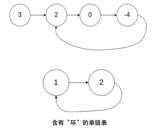

## 1 三路快排

假设给定你一个整型数组 `int a[] = {a0, a1, a2, …, an-1}`，长度为 n，并且数组中的每个元素只能是 0, 1, 2 中的一种，请设计一个在时间和空间上都尽可能高效的算法，将数组进行排序，排序结果要求非递减。

### 基本思想 (5 分)

由于数组中的元素只能是 `0`, `1`, `2`，我们可以利用这一特点设计一个高效的排序算法。我们采用一种称为**三向切分的荷兰国旗问题**的算法，基本思路如下：

- 我们定义三个指针：`low`, `mid`, 和 `high`，分别代表未处理部分的边界
  - `low` 指向 0 的右边界（即比 `low` 小的部分全是 0）
  - `mid` 用来遍历数组（代表当前处理的元素）
  - `high` 指向 2 的左边界（即比 `high` 大的部分全是 2）
- 算法的关键步骤：
  - 如果 `a[mid] == 0`，交换 `a[low]` 和 `a[mid]`，然后 `low` 和 `mid` 向右移动一位
  - 如果 `a[mid] == 1`，直接跳过，`mid` 向右移动一位
  - 如果 `a[mid] == 2`，交换 `a[mid]` 和 `a[high]`，并将 `high` 左移，但 `mid` 不移动（因为交换后 `mid` 位置的值还需要检查）
- 这样在一次扫描过程中，通过不断调整 `low`, `mid`, 和 `high` 三个指针的位置，就可以将数组中的 `0`, `1`, `2` 排序

### 算法实现

```cpp
#include <iostream>
using namespace std;

void sortArray(int a[], int n) {
    int low = 0, mid = 0, high = n - 1;

    // 通过 mid 指针遍历数组，调整 low 和 high 以达到排序目的
    while (mid <= high) {
        if (a[mid] == 0) {
            // 当前元素为 0，交换到 low 的位置
            swap(a[low], a[mid]);
            low++;  // 增加 low 以代表 0 的右边界
            mid++;  // 继续检查下一个元素
        } else if (a[mid] == 1) {
            // 当前元素为 1，直接跳过
            mid++;
        } else { // a[mid] == 2
            // 当前元素为 2，交换到 high 的位置
            swap(a[mid], a[high]);
            high--;  // 减少 high 以代表 2 的左边界
            // mid 不动，因为交换后仍需检查当前的 mid 元素
        }
    }
}
// 简化版本
void sortArray(int a[], int n) {
    int low = 0, mid = 0, high = n - 1;

    while (mid <= high) {
        if (a[mid] == 0) swap(a[low++], a[mid++]);
        else if (a[mid] == 1) mid++;
        else swap(a[mid], a[high--]);
    }
}
int main() {
    int a[] = {1, 0, 2, 1, 0, 2, 1, 0, 2};
    int n = sizeof(a) / sizeof(a[0]);

    // 调用排序函数
    sortArray(a, n);

    // 输出排序后的数组
    for (int i = 0; i < n; i++) {
        cout << a[i] << " ";
    }
    cout << endl;

    return 0;
}
```

### 时间复杂度和空间复杂度 (2 分)

- **时间复杂度**：O(n)。整个数组只遍历了一次，每个元素只被处理一次，因此时间复杂度为 O(n)
- **空间复杂度**：O(1)。除了几个辅助变量（`low`, `mid`, `high`）外，没有额外的空间开销，因此空间复杂度为 O(1)

<div style="page-break-after: always;"></div>

## 2 链表循环移位

假设给定你一个单链表的头指针 `head`（不带有头结点）， $\boxed{data|link}$ 请将该链表整体向右循环移位 k 次，并且返回新的头指针。如下所示，原先的链表 `{1, 2, 3, 4}`，经过向右循环移位一次之后为 `{4, 1, 2, 3}`。单链表的结点示意图如下，要求

### 基本思想

- 先确定链表的长度 `n`，然后根据给定的循环移位次数 kkk，对其进行取模操作，即 `k=k%n`，如果 `k==0`，则直接返回原链表的头指针
- 将链表从第 n−k 个节点处断开，断开的部分重新作为链表的头，而之前的尾部链接到原先的头结点。实现 " 右循环移位 " 的效果
- 具体步骤如下：
    1. 计算链表长度 n
    2. 计算有效的移位次数 k=k%n，避免不必要的循环
    3. 从头指针遍历，找到第 n−k 个节点，将其后的部分移动到链表前面
    4. 最后，将新链表的末尾与原链表的头相连

### 算法实现

```cpp
#include <iostream>
using namespace std;

// 定义单链表节点结构体
struct ListNode {
    int data;
    ListNode* next;
    ListNode(int val) : data(val), next(nullptr) {}
};

// 函数：将链表向右循环移位 k 次
ListNode* rotateRight(ListNode* head, int k) {
    if (!head || k == 0) return head;

    // 1. 计算链表的长度，并找到尾节点
    ListNode* tail = head;
    int length = 1;
    while (tail->next) {
        tail = tail->next;
        length++;
    }

    // 2. 计算实际的移位次数
    k = k % length;
    if (k == 0) return head;  // k 大于等于链表长度的情况

    // 3. 找到新的头节点位置
    ListNode* newTail = head;
    for (int i = 1; i < length - k; ++i) {
        newTail = newTail->next;
    }

    // 4. 更新链表
    ListNode* newHead = newTail->next;
    newTail->next = nullptr;  // 断开旧尾节点的连接
    tail->next = head;       // 将旧尾节点连接到旧头节点

    return newHead;
}
// 简化版本 
// 函数：将链表向右循环移位 k 次
ListNode* rotateRight(ListNode* head, int k) {
    if (!head || k == 0) return head;

    ListNode* tail = head;
    int length = 1;
    while (tail->next) {
        tail = tail->next;
        length++;
    }

    k %= length;
    if (k == 0) return head;

    ListNode* newTail = head;
    for (int i = 1; i < length - k; ++i) newTail = newTail->next;

    ListNode* newHead = newTail->next;
    newTail->next = nullptr;
    tail->next = head;

    return newHead;
}
// 辅助函数：打印链表
void printList(ListNode* head) {
    ListNode* current = head;
    while (current) {
        cout << current->data << " ";
        current = current->next;
    }
    cout << endl;
}

int main() {
    // 创建链表：1 -> 2 -> 3 -> 4
    ListNode* head = new ListNode(1);
    head->next = new ListNode(2);
    head->next->next = new ListNode(3);
    head->next->next->next = new ListNode(4);

    int k = 1;  // 移位次数
    head = rotateRight(head, k);

    // 打印链表
    printList(head);

    return 0;
}
```

### 时间复杂度和空间复杂度

<div style="page-break-after: always;"></div>

## 3 删除链表

假设给定你一个单链表的头指针 `head`（带有头结点），$\boxed{data|link}$ 请删除链表的中间结点，并且返回删除后的链表的头指针。如链表 `{1, 2, 3}`，删除之后成为 `{1, 3}`。链表 `{1, 2, 3, 4}` 删除之后成为 `{1, 2, 4}`。如果链表中没有元素或者只有一个元素，则返回空。单链表的结点示意图如下，要求

### 基本思想 (4 分)

删除单链表中间结点的算法基本思想：

1. **处理边界情况**：如果链表为空或只有一个结点，直接返回 `nullptr`，因为无法删除中间结点
2. **快慢指针法**：使用两个指针 `slow` 和 `fast`：
   - `slow` 每次移动一步，`fast` 每次移动两步
   - 当 `fast` 到达链表末尾时，`slow` 将指向链表的中间结点
3. **删除中间结点**：找到中间结点后，调整前一结点的指针，使其跳过中间结点，从而删除该结点

### 链表数据结构定义及算法实现 (8 分)

```cpp
#include <iostream>
using namespace std;

// 定义单链表节点结构体
struct ListNode {
    int data;
    ListNode* next;
    ListNode(int val) : data(val), next(nullptr) {}
};

// 函数：删除链表的中间结点
ListNode* deleteMiddle(ListNode* head) {
    if (!head || !head->next) return nullptr;  // 如果链表为空或只有一个结点，返回空

    ListNode* slow = head;
    ListNode* fast = head;
    ListNode* prev = nullptr;  // 保存 slow 的前一个节点

    // 快慢指针寻找中间节点
    while (fast && fast->next) {
        prev = slow;
        slow = slow->next;
        fast = fast->next->next;
    }

    // 删除中间节点
    prev->next = slow->next;
    delete slow;

    return head;
}
// 简化版本
// 函数：删除链表的中间结点
ListNode* deleteMiddle(ListNode* head) {
    if (!head || !head->next) return nullptr;

    ListNode *slow = head, *fast = head, *prev = nullptr;

    while (fast && fast->next) {
        prev = slow;
        slow = slow->next;
        fast = fast->next->next;
    }

    prev->next = slow->next;
    delete slow;

    return head;
}
// 辅助函数：打印链表
void printList(ListNode* head) {
    ListNode* current = head;
    while (current) {
        cout << current->data << " ";
        current = current->next;
    }
    cout << endl;
}

int main() {
    // 创建链表：1 -> 2 -> 3 -> 4
    ListNode* head = new ListNode(1);
    head->next = new ListNode(2);
    head->next->next = new ListNode(3);
    head->next->next->next = new ListNode(4);

    // 删除中间节点
    head = deleteMiddle(head);

    // 打印链表
    printList(head);

    return 0;
}
```

### 时间复杂度和空间复杂度

**时间复杂度**：O(n)，其中 `n` 是链表的长度。因为使用了快慢指针法，在一次遍历中可以找到并删除中间结点

<div style="page-break-after: always;"></div>

## 4 链表逆置

(13 分) 假设给定你一个单链表的头指针 `head`（不带有头结点），请将链表逆置，并且返回逆置后的链表的头指针。如链表 `{1, 2, 3, 4}`，逆置之后成为 `{4, 3, 2, 1}`。单链表的结点：$\boxed{data|link}$

### 基本思想 (4 分)

链表逆置的基本思路是通过遍历链表，逐个反转结点的指针。具体步骤如下：

1. **初始化三个指针**：
   - `prev`：指向已反转部分的最后一个结点（初始为 `nullptr`）
   - `current`：指向当前正在处理的结点（初始化为 `head`）
   - `next`：保存当前结点的下一个结点，防止链表断开后丢失剩余部分

2. **逐步反转**：
   - 保存 `current` 的下一个结点 `next`
   - 将 `current` 的 `next` 指针指向 `prev`，即完成当前结点的反转
   - 更新 `prev` 和 `current` 指针，即 `prev` 指向当前结点，`current` 指向下一个结点

3. **终止条件**：当 `current` 为 `nullptr` 时，链表遍历完成，此时 `prev` 指向逆置后的新头结点

### 链表数据结构定义及算法实现 (8 分)

```cpp
#include <iostream>
using namespace std;

// 定义单链表节点结构体
struct ListNode {
    int data;
    ListNode* next;
    ListNode(int val) : data(val), next(nullptr) {}
};

// 函数：反转链表
ListNode* reverseList(ListNode* head) {
    ListNode* prev = nullptr;    // 反转后链表的前一个节点（初始为 nullptr）
    ListNode* current = head;    // 当前处理的节点
    ListNode* next = nullptr;    // 保存当前节点的下一个节点

    while (current != nullptr) {
        next = current->next;    // 暂存下一个节点
        current->next = prev;    // 反转当前节点的指针
        prev = current;          // 更新 prev，移动到当前节点
        current = next;          // 移动 current 到下一个节点
    }

    return prev;                 // prev 最终指向新链表的头节点
}

// 辅助函数：打印链表
void printList(ListNode* head) {
    ListNode* current = head;
    while (current != nullptr) {
        cout << current->data << " ";
        current = current->next;
    }
    cout << endl;
}
// 简化版本
// 函数：反转链表
ListNode* reverseList(ListNode* head) {
    ListNode* prev = nullptr;
    while (head) {
        ListNode* next = head->next;
        head->next = prev;
        prev = head;
        head = next;
    }
    return prev;
}

// 辅助函数：打印链表
void printList(ListNode* head) {
    while (head) {
        cout << head->data << " ";
        head = head->next;
    }
    cout << endl;
}
int main() {
    // 创建链表：1 -> 2 -> 3 -> 4
    ListNode* head = new ListNode(1);
    head->next = new ListNode(2);
    head->next->next = new ListNode(3);
    head->next->next->next = new ListNode(4);

    // 反转链表
    head = reverseList(head);

    // 打印反转后的链表
    printList(head);

    return 0;
}
```

- **时间复杂度**：O(n)，其中 `n` 是链表的长度。每个结点都被访问并操作了一次，时间复杂度为 O(n)
- **空间复杂度**：O(1)，只使用了常量级别的额外空间（`prev`、`current`、`next`）

<div style="page-break-after: always;"></div>

## 5 检测单链表中的环及环入口

(15 分) 假设给定你一个单链表的头指针 `head`（不带有头结点），该单链表可能存在 " 环 "，但是环的个数最多只有一个，环的形式如下图所示：


请你判断给定的单链表中是否存在环，如果存在，请返回环的入口结点指针；否则返回空。单链表的结点示意图：$\boxed{data|link}$

### 基本思想 (5 分)

检测单链表是否存在环并找到环的入口，使用**快慢指针法**，也称为 Floyd 判圈算法。步骤如下：

1. **快慢指针法判断是否有环**：
   - 初始化两个指针：`slow` 和 `fast`，都指向链表的头结点
   - `slow` 每次走一步，`fast` 每次走两步
   - 如果链表中存在环，`slow` 和 `fast` 会在环中相遇；如果没有环，`fast` 会先到达链表末尾

2. **寻找环的入口**：
   - 当 `slow` 和 `fast` 在环中相遇后，将 `fast` 移回链表的头部，`fast` 每次移动一步
   - 同时移动 `slow` 和 `fast`，两者相遇时即为环的入口
   - 返回环的入口结点

### 链表数据结构定义及算法实现 (9 分)

```cpp
#include <iostream>
using namespace std;

// 定义单链表节点结构体
struct ListNode {
    int data;
    ListNode* next;
    ListNode(int val) : data(val), next(nullptr) {}
};

// 函数：判断链表是否存在环，并返回环的入口节点指针
ListNode* detectCycle(ListNode* head) {
    if (head == nullptr || head->next == nullptr) {
        return nullptr;  // 空链表或只有一个节点的链表不可能有环
    }

    ListNode* slow = head;
    ListNode* fast = head;

    // 快慢指针法判断是否有环
    while (fast != nullptr && fast->next != nullptr) {
        slow = slow->next;          // 慢指针走一步
        fast = fast->next->next;    // 快指针走两步

        // 如果快慢指针相遇，说明有环
        if (slow == fast) {
            // 将 fast 指针移回头部，slow 和 fast 每次走一步，找到环的入口
            fast = head;
            while (slow != fast) {
                slow = slow->next;
                fast = fast->next;
            }
            return slow;  // slow 和 fast 都指向环的入口节点
        }
    }

    return nullptr;  // 无环
}

// 辅助函数：创建一个带有环的链表用于测试
ListNode* createCycleList(int size, int cycleIndex) {
    if (size <= 0) return nullptr;

    ListNode* head = new ListNode(1);
    ListNode* tail = head;
    ListNode* cycleEntry = nullptr;
    
    // 创建链表
    for (int i = 2; i <= size; ++i) {
        tail->next = new ListNode(i);
        tail = tail->next;
        if (i == cycleIndex) {
            cycleEntry = tail;  // 记录环的入口节点
        }
    }

    // 创建环
    if (cycleEntry != nullptr) {
        tail->next = cycleEntry;
    }

    return head;
}
// 简化版本
// 函数：判断链表是否存在环，并返回环的入口节点指针
ListNode* detectCycle(ListNode* head) {
    if (!head || !head->next) return nullptr;

    ListNode *slow = head, *fast = head;

    while (fast && fast->next) {
        slow = slow->next;
        fast = fast->next->next;
        if (slow == fast) {
            fast = head;
            while (slow != fast) {
                slow = slow->next;
                fast = fast->next;
            }
            return slow;
        }
    }

    return nullptr;
}

// 辅助函数：创建一个带有环的链表用于测试
ListNode* createCycleList(int size, int cycleIndex) {
    if (size <= 0) return nullptr;

    ListNode *head = new ListNode(1), *tail = head, *cycleEntry = nullptr;
    
    for (int i = 2; i <= size; ++i) {
        tail->next = new ListNode(i);
        tail = tail->next;
        if (i == cycleIndex) cycleEntry = tail;
    }

    if (cycleEntry) tail->next = cycleEntry;

    return head;
}
int main() {
    // 创建一个带环的链表，链表长度为 5，环的入口节点为第 3 个节点
    ListNode* head = createCycleList(5, 3);

    // 检测链表中的环
    ListNode* cycleNode = detectCycle(head);

    if (cycleNode) {
        cout << "环的入口节点值为: " << cycleNode->data << endl;
    } else {
        cout << "链表无环" << endl;
    }

    // 释放链表内存
    ListNode* current = head;
    while (current != nullptr) {
        ListNode* next = current->next;
        delete current;
        current = next;
    }

    return 0;
}
```

- **时间复杂度**：O(n)，其中 `n` 为链表的长度。快慢指针相遇的时间复杂度为 O(n)，查找环的入口也需要 O(n)
- **空间复杂度**：O(1)，只使用了几个辅助指针，没有使用额外的空间

<div style="page-break-after: always;"></div>

## 6 计算数组中逆序对的数量

假设给定你一个整型数组 `int a[] = {a0, a1, a2, …, an-1}`，长度为 `n`
请你设计一个算法，计算数组中逆序对的个数。逆序对的定义如下：
对于数组的第 `i` 个和第 `j` 个元素，如果满足 `i < j 且 a[i] > a[j]`，则其为一个逆序对；否则不是。

### 基本思想 (5 分)

计算数组中的逆序对可以通过**归并排序**的思想来实现。利用归并排序的过程中对数组进行分割和合并，在合并两个排好序的子数组时，可以同时计算出跨左右子数组的逆序对数量，具体方法如下：

1. **归并排序**：
   - 将数组递归地分成左右两部分，分别对它们排序

2. **计算逆序对**：
   - 当左右两部分都已排好序时，合并时如果左边的当前元素大于右边的当前元素，说明左边当前元素及其后的所有元素都会与右边当前元素构成逆序对，可以一次性计算出这些逆序对的数量

3. **逆序对的定义**：
   - 对于数组的第 `i` 个元素和第 `j` 个元素，如果满足 `i < j` 且 `a[i] > a[j]`，则它们构成一个逆序对

### 算法实现 (8 分)

```cpp
#include <iostream>
#include <vector>
using namespace std;

// 归并排序并计算逆序对
long long mergeAndCount(vector<int>& arr, vector<int>& temp, int left, int mid, int right) {
    int i = left;    // 左半部分的起点
    int j = mid + 1; // 右半部分的起点
    int k = left;    // 临时数组的起点
    long long inv_count = 0; // 逆序对计数器

    // 合并两个有序的子数组，并计算逆序对
    while (i <= mid && j <= right) {
        if (arr[i] <= arr[j]) {
            temp[k++] = arr[i++];
        } else {
            temp[k++] = arr[j++];
            inv_count += (mid - i + 1);  // 左侧元素都比 arr[j] 大，产生逆序对
        }
    }

    // 复制剩余的左半部分元素
    while (i <= mid) {
        temp[k++] = arr[i++];
    }

    // 复制剩余的右半部分元素
    while (j <= right) {
        temp[k++] = arr[j++];
    }

    // 将排序后的子数组复制回原数组
    for (int i = left; i <= right; i++) {
        arr[i] = temp[i];
    }

    return inv_count;
}

// 使用归并排序计算逆序对
long long mergeSortAndCount(vector<int>& arr, vector<int>& temp, int left, int right) {
    long long inv_count = 0;
    if (left < right) {
        int mid = left + (right - left) / 2;

        // 递归分治，对左右两边分别排序并统计逆序对
        inv_count += mergeSortAndCount(arr, temp, left, mid);
        inv_count += mergeSortAndCount(arr, temp, mid + 1, right);

        // 合并两个已排序的子数组，并计算跨左右的逆序对
        inv_count += mergeAndCount(arr, temp, left, mid, right);
    }
    return inv_count;
}
// 简化版本
// 归并排序并计算逆序对
long long mergeAndCount(vector<int>& arr, vector<int>& temp, int left, int mid, int right) {
    int i = left, j = mid + 1, k = left;
    long long inv_count = 0;

    while (i <= mid && j <= right) {
        if (arr[i] <= arr[j]) temp[k++] = arr[i++];
        else {
            temp[k++] = arr[j++];
            inv_count += (mid - i + 1);
        }
    }

    while (i <= mid) temp[k++] = arr[i++];
    while (j <= right) temp[k++] = arr[j++];
    for (int i = left; i <= right; i++) arr[i] = temp[i];

    return inv_count;
}

// 使用归并排序计算逆序对
long long mergeSortAndCount(vector<int>& arr, vector<int>& temp, int left, int right) {
    if (left >= right) return 0;
    int mid = left + (right - left) / 2;
    return mergeSortAndCount(arr, temp, left, mid) +
           mergeSortAndCount(arr, temp, mid + 1, right) +
           mergeAndCount(arr, temp, left, mid, right);
}

int main() {
    vector<int> arr = {1, 20, 6, 4, 5};
    int n = arr.size();
    vector<int> temp(n);

    // 调用归并排序并计算逆序对
    long long result = mergeSortAndCount(arr, temp, 0, n - 1);

    // 输出逆序对数量
    cout << "逆序对的数量: " << result << endl;

    return 0;
}
```

- **时间复杂度**：O(n log n)
  - 归并排序的时间复杂度为 O(n log n)，在归并的过程中同时计算逆序对，因此时间复杂度保持不变
- **空间复杂度**：O(n)
  - 由于需要一个临时数组 `temp` 来辅助合并操作，额外的空间复杂度为 O(n)

<div style="page-break-after: always;"></div>

## 7 判断二叉树中是否存在路径和等于给定目标值

现在给定你一个使用链式存储的二叉树的根结点指针 `root`，还有一个目标整数 `sum`，请编写一个函数判断是否存在一条从根结点到叶子结点的路径，使得路径上所有结点内部的 `data` 域的和等于 `sum`。如果存在，返回 `true`，否则返回 `false`。

### 基本思想 (5 分)

该问题是一个典型的**二叉树的路径和问题**，我们可以通过**递归**的方式进行深度优先搜索（DFS），从根节点到叶子节点计算路径的和：

1. **递归遍历二叉树**：
   - 每次递归时，将当前节点的值从目标和 `sum` 中减去
   - 如果当前节点是叶子节点，并且其值正好等于剩余的 `sum`，则表明找到了满足条件的路径，返回 `true`
   - 如果当前节点不是叶子节点，则继续递归遍历左右子树的路径和

2. **递归终止条件**：
   - 当到达叶子节点时，检查当前路径和是否等于剩余的 `sum`
   - 如果遍历完所有节点后仍未找到满足条件的路径，返回 `false`

### 算法实现 (8 分)

#### 二叉树节点的数据结构定义

```cpp
#include <iostream>
using namespace std;

// 二叉树结点结构定义
struct TreeNode {
    int data;         // 节点值
    TreeNode* left;   // 左子树指针
    TreeNode* right;  // 右子树指针
    
    TreeNode(int x) : data(x), left(nullptr), right(nullptr) {}
};

// 判断是否存在从根节点到叶子节点的路径，使得路径和等于 sum
bool hasPathSum(TreeNode* root, int sum) {
    // 如果节点为空，返回 false
    if (root == nullptr) {
        return false;
    }

    // 减去当前节点的值
    sum -= root->data;

    // 如果到达叶子节点，检查路径和是否等于 sum
    if (root->left == nullptr && root->right == nullptr) {
        return sum == 0;
    }

    // 递归判断左子树和右子树
    bool leftHasPath = root->left && hasPathSum(root->left, sum);
    bool rightHasPath = root->right && hasPathSum(root->right, sum);

    return leftHasPath || rightHasPath;
}
// 简化版本
bool hasPathSum(TreeNode* root, int sum) {
    if (!root) return false;
    sum -= root->data;
    if (!root->left && !root->right) return sum == 0;
    return hasPathSum(root->left, sum) || hasPathSum(root->right, sum);
}
int main() {
    // 构建示例二叉树
    TreeNode* root = new TreeNode(5);
    root->left = new TreeNode(4);
    root->right = new TreeNode(8);
    root->left->left = new TreeNode(11);
    root->right->left = new TreeNode(13);
    root->right->right = new TreeNode(4);
    root->left->left->left = new TreeNode(7);
    root->left->left->right = new TreeNode(2);
    root->right->right->right = new TreeNode(1);

    int targetSum = 22;

    // 调用函数判断是否存在符合条件的路径
    if (hasPathSum(root, targetSum)) {
        cout << "存在路径，路径和等于 " << targetSum << endl;
    } else {
        cout << "不存在路径和等于 " << targetSum << endl;
    }

    return 0;
}
```

- **时间复杂度**：O(n)，其中 n 是二叉树中的节点数。递归遍历树的每个节点，每个节点只被访问一次，因此时间复杂度为 O(n)

- **空间复杂度**：O(h)，其中 h 是二叉树的高度。递归调用栈的深度取决于树的高度，最坏情况下（即树为线性结构），空间复杂度为 O(h)
