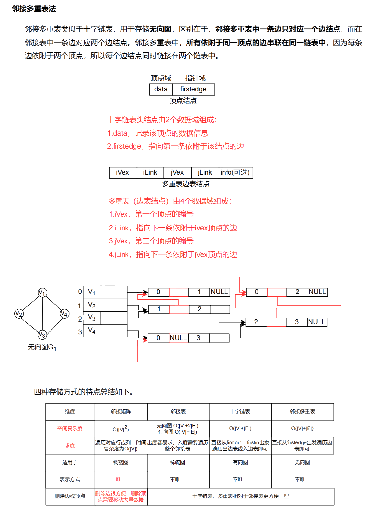

## 图的定义

一个图 G 由顶点集 V 和边集 E 组成，记作 $G=(V, E)$

- 顶点集 $V$ 表示图的顶点，不能为空集。'
- 边集 $E$ 表示顶点之间的连接关系，边集可以为空
- **顶点的数量**：$|V|$，称为**图的阶**
- **边的数量**：$|E|$
- **边**：无向图中的顶点的无序对 $\{v, w\}$
- **弧**：有向图中的顶点的有序对 $(v, w)$
- **度**：与某个顶点相关联的边的数量

### 图的种类

#### 有向图和无向图

- *有向图*：有向图的边有方向，即从一个顶点指向另一个顶点
- *无向图*: 无向图的边没有方向，即边的两个顶点是无序的

##### 边的表示法

- **有向边**：$(u, v)$ 表示从顶点 $u$ 指向顶点 $v$ 的边
- **无向边**：$\{u, v\}$ 表示 $u$ 和 $v$ 之间没有方向的连接

### 有向图与无向图的相关术语

#### 有向图

有向图 G=(V, E)，例如：
$V = \{1, 2, 3\}$
$E = {(1, 2), (2, 3)}$

- **弧**：有向图中的边
- **弧尾**：弧的起点
- **弧头**：弧的终点
- **邻接**：如果存在弧 $(u, v)$，则称 $u$ 邻接到 $v$

- **入度**：顶点 $v$ 的入度是以 $v$ 为终点的弧的条数
- **出度**：顶点 $v$ 的出度是以 $v$ 为起点的弧的条数

- **完全有向图**：任意两个顶点间都存在方向相反的两条弧，共有 $C_n^2 = n(n-1)$ 条边

#### 无向图

无向图 G=(V, E)，例如：
$V = \{1, 2, 3\}$
$E = \{\{1, 2\}, \{2, 3\}, \{1, 3\}\}$

- 邻接点：若存在边{u, v}，则 u 和 v 互为邻接点

- 简单图和多重图

> [! ]
> 顶点 v 的度分为入度和出度
>
> - 入度：以 v 为终点的有向边的条数
> - 出度：以 v 为起点的有向边的条数
>
> 完全有向图：任意两个顶点间都存在方向相反的两条弧，共有 $C_{n}^2$ 条边

### 图的类型

- **简单图**：图中没有重复的边和自环
- **多重图**：图中存在重复的边或自环
- **完全图**：一个简单图，任意两顶点之间都有边相连
- **子图**：图 $G$ 的子集，包含一部分顶点和边
- **生成子图**：包含图中所有顶点，但只包含部分边的子图
- **连通图**：无向图中任意两个顶点之间都有路径相连
- **连通分量**：图的最大连通子图
- **强连通图**：有向图中任意两个顶点之间都存在路径
- **强连通分量**：有向图的最大强连通子图
- **生成树**：连通无向图中的一个无环连通子图，包含所有顶点
- **生成森林**：无向图中不连通的生成树的集合
- **稀疏图**：边的数量较少，接近 $O(n)$
- **稠密图**：边的数量接近 $O(n^2)$

> [! ] 当 $\left| V \right| >1$ 时，若 $G$ 一定连通，则需要 $\left| E \right|=\frac{(\left| V \right|-1)(\left| V \right|-2)}{2}+1\\$【贪心思想】

### 路径、回路与距离

- **路径**：从一个顶点到另一个顶点经过的边的序列
- **路径长度**：路径中边的数量
- **回路**：起点与终点相同的路径
- **简单路径**：路径中没有重复顶点
- **简单回路**：回路中没有重复顶点（除了起点与终点）
- **距离**：两个顶点之间最短路径的长度

### 有向树

- **有向树**：一个没有回路的有向图

## 图像的存储

### 邻接矩阵

> 数组实现的顺序存储

是指用一个二维数组存储图中顶点的信息，用一个二维数组存储图中边的信息（即各顶点之间的邻接关系）
存储顶点之间邻接关系的二维数组称为邻接矩阵

- 无权图

$$
\begin{align*}
A[i][j] &=
\begin{cases}  
1, & \text{若}(v_i, v_j)\text{或}\langle v_i, v_j \rangle \text{是E(G)中的边} \\  
0, & \text{若}(v_i, v_j)\text{或}\langle v_i, v_j \rangle \text{不是E(G)中的边}  
\end{cases}  
\end{align*}
$$

- 带权图

$$
\begin{align*}
A[i][j] &= \begin{cases}  
w_{ij}, & \text{如果顶点 } v_i \text{ 和顶点 } v_j \text{ 之间存在边，且边的权重为 } w_{ij} \\  
0 \ 或 \ \infty, & \text{如果顶点 } v_i \text{ 和顶点 } v_j \text{ 之间不存在边}
\end{cases}
\end{align*}
$$

邻接矩阵表示法的空间复杂度为 O(n^2)，其中 n 为图的顶点数 |V|

#### 特点

- 无向图的邻接矩阵一定是一个对称矩阵（并且唯一）。因此，在实际存储邻接矩阵时只需存储上（或下）三角矩阵的元素
- 对于无向图，邻接矩阵的第 i 行（或第 i 列）非零元素（或非 0 元素）的个数正好是第 i 个顶点的度 TD(v_i)
- 对于有向图，邻接矩阵的第 i 行（或第 i 列）非零元素（或非 0 元素）的个数正好是第 i 个顶点的出度 OD(v_i)
- 用邻接矩阵法存储图，很容易确定图中任意两个顶点之间是否有边相连。但是，要确定图中有多少条边，则必须按行、按列对每个元素进行检测，所以花费的时间代价很大
- 稠密图适合使用邻接矩阵的存储表示

### 邻接表

当一个图为稀疏图时，使用邻接矩阵法要浪费大量的存储空间，而图的邻接表法结合了顺序存储和链式存储方法，减少了不必要的浪费

#### 结构

对图 G 中的每个顶点建立一个单链表，第 i 个单链表中的结点表示依附于顶点 vi 的边，这个单链表就称为顶点 vi 的边表（对于有向图则称为出边表）

边表的头指针和顶点的数据信息采用顺序存储（称为顶点表），所以在邻接表中存在两种结点：顶点表结点和边表结点

#### 示例图

若 G 为无向图，则所需的存储空间为 O (|V| + 2|E|);

若 G 为有向图，则所需的存储空间为 O(|V| + |E|)

#### 性质

- 对于稀疏图，采用邻接表表示将极大地节省存储空间
- 在邻接表中，给定一顶点，能很容易地找出它的所有邻边，因为只需要读取它的邻接表
- 在有向图的邻接表表示中，求一个给定顶点的出度只需计算其邻接表中的结点个数，但求其顶点的入度则需要遍历全部的邻接表
- 图的邻接表表示并不唯一
- 表头向量中每个分量就是一个单链表的头结点，分量个数就是图中的顶点数
- 在边或弧稀疏的情况下，用邻接表表示比用邻接矩阵表示节省存储空间，其中无向图所占用的空间是 `n + 2e`，有向图所占用的空间是 `n + e`
- 对于无向图，顶点 $v_i$ 的度是第 `i` 个链表的结点数
- 有向图第 `i` 个链表中的结点数是顶点 $v_i$ 出（入）度，求入（出）度，需遍历整个邻接表

### 小结

### 十字链表【有向图】

十字链表是一种用于有向图的链式存储结构。在十字链表中，针对有向图中的每条弧都有一个弧结点，且对有向图中的每个顶点也有一个顶点结点

#### 时间复杂度

时间复杂度为 O(|V| + |E|)

#### 弧结点域结构

| mark | ivex | jvex | ilink | jlink |
| ---- | ---- | ---- | ----- | ----- |
|      |      |      |       |       |

- **尾域（tailvex）**：弧尾
- **头域（headvex）**：弧头
- **链域（hlink）**：指向弧头相同的下一条弧
- **链域（tlink）**：指向弧尾相同的下一条弧
- **info 域**：指向该弧的相关信息

#### 顶点结点域结构

| data | firstin | firstout |
| ---- | ------- | -------- |
|      |         |          |

- **data 域**：存放顶点相关的数据
- **firstin 和 firstout 两个域**：分别指向以该顶点为弧头或弧尾的第一个弧结点

#### 特点

- 十字链表只能存储有向图
- 十字链表适用于表示有向图的结构，其节省了存储空间，并且可以方便地找到图中每条弧的弧头和弧尾以及其他相关信息

### 邻接多重表【无向图】

邻接多重表是用于无向图的另一种链式存储结构

#### 时间复杂度

时间复杂度为 O(|V| + |E|)

#### 边结结构

| mark | ivex | jvex | ilink | jlink | info |
| ---- | ---- | ---- | ----- | ----- | ---- |
|      |      |      |       |       |      |

- **mark 域**：标志域，用以标记该条边是否被搜索过
- **ivex 和 jvex 域**：该边依附的两个顶点在图中的位置
- **ilink 域**：指向下一条依附于顶点 ivex 的边
- **jlink 域**：指向下一条依附于顶点 jvex 的边
- **info 域**：指向和边相关的各种信息的指针域

#### 顶点结构

| data | firstedge |
| ---- | --------- |
|      |           |

- **data 域**：存储该顶点的相关信息
- **firstedge 域**：指示第一条依附于该顶点的边

#### 特点

- 邻接多重表只能存储无向图
- 邻接多重表适用于表示无向图的结构，其能够方便地找到图中每条边的两个顶点以及相关的信息，并能有效地避免重复存储边的信息

### 小结

## 图的遍历

### 广度优先搜索（BFS）

#### 概述

广度优先搜索（BFS）是一种类似于二叉树层序遍历的算法。其基本思想是：

1. **首先访问起始顶点**，然后依次访问该顶点的所有未访问过的邻接顶点
2. **再从这些邻接顶点出发**，依次访问它们所有未被访问过的邻接顶点
3. **重复上述过程**，直到图中所有顶点都被访问过为止

#### 实现

- BFS 利用队列数据结构实现顶点的逐层访问

#### 空间复杂度为

在最坏的情况下，空间复杂度为 O(|V|)

#### 时间复杂度

- 邻接表存储方式：
  - 顶点：O(|V|)
  - 边：O(|E|)
  - 总时间复杂度：O(|V| + |E|)

- 邻接矩阵存储：O(|V|^2)

#### 性能分析

- **顶点的访问次数**：每个顶点仅被访问一次
- **边的访问次数**：每条边仅被访问一次

#### 应用

- BFS 算法可以用来解决最短路径问题

#### 唯一性

- 在广度遍历的过程中，我们可以得到一棵遍历树，称为广度优先生成树
- **邻接矩阵存储**：广度优先生成树是唯一的
- **邻接表存储**：由于邻接表存储表示的邻接顺序不唯一，广度优先生成树也是不唯一的

### 深度优先搜索（DFS）

#### 概述

深度优先搜索（DFS）类似于树的先序遍历。其基本思想是：

1. **从起始顶点出发**，首先访问起始顶点
2. **依次访问与该顶点相连的未被访问的顶点**，直到所有与该顶点相连的顶点都被访问
3. **回溯到最近访问的顶点**，然后继续访问未被访问的顶点，重复上述过程，直到图中所有顶点都被访问

#### 实现

- DFS 利用栈或递归实现顶点的深度访问

#### 空间复杂度 O(|V|)

在最坏的情况下，空间复杂度为 O(|V|)

#### 时间复杂度

- 邻接表存储方式：
  - 查找所有顶点的邻接点所需的时间：O(|E|)
  - 访问顶点所需时间：O(|V|)
  - 总时间复杂度：O(|V| + |E|)

- - 邻接矩阵存储：$O(|V|^2)$

#### 性能分析

- **顶点的访问次数**：每个顶点仅被访问一次
- **边的访问次数**：每条边仅被访问一次

#### 应用

- DFS 算法可以用于拓扑排序、检测图中的环、连通分量等问题

#### 唯一性

- 对连通图调用 DFS 才能产生深度优先生成树
- 基于邻接表存储的深度优先生成树是不唯一的

### 小结

- 基于**邻接矩阵**的遍历所得的 DFS 序列和 BFS 序列是**唯一**的
- 基于**邻接表**的遍历所得的 DFS 序列和 BFS 序列是 b 的

### 图的遍历与连通性

#### 对于无向图

- **连通图**：若从任一结点出发，仅需一次遍历就能够访问图中的所有顶点
- **非连通图**：若从某一个顶点出发，一次遍历只能访问到该顶点所在的连通分量的顶点，而无法通过这次遍历访问到图中的其他连通分量的顶点

#### 对于有向图

- **连通图**：从初始点到图中的每个顶点都有路径，则能够访问到图中的所有顶点
- **非连通图**：若有向图是不连通的，则不能访问到所有顶点

## 图的应用

### 最小生成树

#### 基本概念

- 生成树的代价：带权连通图的生成树的所有边的权值之和
- 最小生成树：在一个加权连通图中，包含图中所有顶点且边的权值之和最小的生成树称为最小生成树

> **原则**：尽可能选取最小的边，但不能构成回路，`n` 个顶点的生成树有且仅有 `n - 1` 条边

#### 性质

- 最小生成树不是唯一的，即可能有多个最小生成树
  - 当图 $G$ 中的各边权值互不相等时，$G$ 的最小生成树是唯一的。但构造过程不唯一
  - 当图 $G$ 中的各边权值相等时，不同/同义算法最小生成树构造过程不唯一，最小生成树不唯一
  - **最小生成树所对应的边的权值之和总是唯一**的，且是最小的
- 最小生成树的树形可能不同，但是最小生成树后的权值是唯一的
- 最小生成树的边数等于顶点数减 1

#### 最小生成树算法

##### Prim 算法【点】

- **基本思想**：从图中的某一顶点开始，逐渐增加边和顶点，直到包含所有顶点，形成最小生成树
- **步骤**：
  1. 选择任意一个顶点作为起始点
  2. 从已有的顶点集合中选择一个与集合外顶点有最小权边的顶点，加入集合
  3. 重复步骤 2，直到所有顶点都被包含
- **时间复杂度**：$O(V^2)$
- 适用于**稠密图**

---

> **代码实现**

1. 解锁的点的集合叫 set（普通集合）、解锁的边的集合叫 heap（小根堆）。set 和 heap 都为空。

2. 可从任意点开始，开始点加入到 set，开始点的所有边加入到 heap

3. 从 heap 中弹出权值最小的边 e，查看边 e 所去往的点 x
   - 如果 x 已经在 set 中，边 e 舍弃，重复步骤 3
   - 如果 x 不在 set 中，边 e 属于最小生成树，把 x 加入 set，重复步骤 3

4. 当 heap 为空，最小生成树的也就得到了

##### Kruskal 算法【边】

- **基本思想**：按边的权重顺序（从小到大）选择边，保证这些边不形成环，直到形成一个最小生成树
- **步骤**：
  1. 把所有的边，根据权值从小到大排序，从权值小的边开始考虑
  2. 如果连接当前的边不会形成环，就选择当前的边
  3. 如果连接当前的边会形成环，就不要当前的边
  4. 考察完所有边之后，最小生成树的也就得到了
- **时间复杂度**：$O(E\cdot\log E)$
- 适合于边稀疏的图

### 最短路径

#### Dijkstra 算法求单源最短路径问题

- **辅助数组**：
  - `dist[]`：记录从源点 v0 到其他各顶点当前的最短路径长度
    - 若从 v0 到 vi 有弧，`dist[i]` 为弧上的权值
    - 否则，`dist[i]` 为无穷大
  - `path[]`：`path[i]` 表示从 v0 到顶点 i 之间的最短路径的前驱结点

- **实现过程**：

  1. **初始化**：集合 S 初为 `{v0}`，`dist[i]=arcs[0][i]`，对 `i=1,2,…,n-1`
  2. **选择最小 dj**：从集合 V-S 中选择 `dj` 最小的，满足 `dist[j]=Min{dist[i]}`（`vi` 属于 V-S），`j` 是当前求得的一条从 v0 出发的最短路径的终点。令 `S=S∪{j}`
  3. **更新 dist[k]**：若 `dist[j]+arcs[j][k]<dist[k]`，则更新 `dist[k]=dist[j]+arcs[j][k]`

- **时间复杂度**：$O(V^2)$
- **适用情况**：不适用于边权存在负数的情况

#### Floyd 算法求各顶点之间最短路径问题

- **实现过程**：
  - **初始化**：对任意两个顶点 `vi` 与 `vj`，
    - 若它们之间有弧存在，则以弧上的权值作为它们之间的最短路径长度
    - 若它们之间不存在有向弧，则以无穷大作为它们之间的最短路径长度
   **逐步尝试**：以其他顶点 `0,1,2,…,n-1` 作为中间点
    - 若加入中间顶点后，得到的路径长度小于原来的路径长度，则以新路径代替原路径

- **时间复杂度**：O(V^3)
- **适用情况**：适用于带权有向图，但不允许包含负权回路的边。适用于稠密图

### 有向无环图

- **有向无环图**：若一个有向图中不存在环，则称为有向无环图，简称 DAG 图
- **有向无环图描述**：可以作为关于实效表达式的有效工具

#### 小结

### 拓扑排序

#### AOV 网概述

- 若用 DAG 图表示一个工程，其顶点表示活动，用有向边 $<V_{i}, V_{j}>$ 表示活动 Vi 必须先于活动 $V_{j}$ 进行的这样一种关系，则将这种有向图称为顶点表示活动的网络，记为 AOV 网
- 活动 $V_{i}$ 是活动 $V_{j}$ 的直接前驱，活动 $V_{j}$ 是活动 $V_{i}$ 的直接后继
- 这种前驱和后继关系具有传递性，且任何活动不能以它自己作为自己的前驱或后继

#### 拓扑排序定义

- 每个顶点出现且只出现一次
- 若顶点在序列中排在顶点 b 的前面，则图中存在从顶点 a 到顶点 b 的路径

#### 拓扑排序实现方法

1. 从 AOV 网中选择一个没有前驱的顶点输出
2. 从网中删除该顶点和所有以它为起点的有向边
3. 重复步骤 1 和 2 直到当前的 AOV 网为空图或当前网中不存在无前驱的顶点为止。后一种情况说明有向图中必然存在环

#### 注意

- 入度为零的顶点，即没有前驱的顶点的激活活动就已经完成且终止，后续活动就从新任前驱的活动开始或继续
- 若一个顶点有多个直接后继，则拓扑排序结果不唯一
- 若各个顶点已经在一个线性有序的序列中，则拓扑排序的结果是唯一的
- 生成 AOV 网的新的邻接矩阵，可以是三角矩阵
- 对于一般的图说，若其邻接矩阵是三角矩阵，则存在拓扑序列；反之则不一定成立

### 逆拓扑排序

#### 逆拓扑排序

- **思路**：DFS 算法
  1. 从 AOV 网内选择一个没有后继（出度为 0）的顶点输出
  2. 从网中删除该顶点和所有以它为终点的有向边
  3. 重复步骤 1 和 2 直到 AOV 网为空

- **具体实现**：从网中删除该顶点和所有以它为终点的有向边

- 拓扑排序：逆拓扑排序序列可能不唯一
- 逆拓扑排序：若图中有环，则不存在拓扑序列/逆拓扑序列

### 关键路径

#### AOE 网与 AOV 网

##### 相同点

- AOE 网和 AOV 网都是有向无环图（DAG）

##### 不同点

- **AOE 网**：边有权值，表示活动所需的时间
- **AOV 网**：边无权值，表示事件之间的顺序关系

#### AOE 网概述

在带权有向图中，以顶点表示事件，以有向边表示活动，边上的权值表示完成该活动所需的时间。这种网络称为用边表示活动的网络（Activity On Edge network）

#### AOE 网性质

1. 在某顶点所代表的事件发生后，从该顶点出发的各有向边所代表的活动才能开始
2. 只有在某顶点所代表的前驱事件全部完成后，该顶点所代表的事件才能发生
3. 从源点到汇点的路径中，具有最大路径长度的路径称为关键路径

#### 关键路径与关键活动

##### 关键路径

- 从源点到汇点的所有路径中，具有最大路径长度的路径

##### 关键活动

- 关键路径上的活动

#### 事件 vk 的最早发生时间 ve(k)

- 源点 ve(源点) = 0
- ve(k) = Max{ve(j) + Weight(vj, vk)}，vj 为 vk 的任意前驱，Weight(vj, vk) 表示 <vj, vk> 上的权值

#### 事件 vk 的最迟发生时间 vl(k)

- 汇点 vl(汇点) = ve(汇点)
- vl(k) = Min{vl(j) - Weight(vk, vj)}，vk 为 vj 的任意前驱

#### 变量含义

##### 活动 ai 的最早开始时间 e(i)

- 该活动的起点所表示的事件的最早发生时间。若边 <vk, vj> 表示活动 ai，则有 e(i) = ve(k)

##### 活动 ai 的最迟开始时间 l(i)

- 该活动的终点所表示的事件的最迟发生时间与该活动所需时间之差。若边 <vk, vj> 表示活动 ai，则有 l(i) = vl(j) - Weight(vk, vj)

##### 活动 ai 的时间差值

- 活动的最迟开始时间与最早开始时间之差 (l(i) - e(i))
- 当 l(i) = e(i) 时，该活动是关键活动

#### 关键路径结构方法步骤

1. 从源点出发，按拓扑排序求各顶点的最早发生时间 ve(i)
2. 各 vi(汇点) = ve(汇点)，按逆拓扑排序求各顶点的最迟发生时间 vl(i)
3. 根据各顶点 vi 的 ve 值求所有活动的最早开始时间 e(i)
4. 根据各顶点 vi 的 vl 值求所有活动的最迟开始时间 l(i)

#### 注意事项

- 关键路径上的所有活动都是关键活动，这些活动决定整个项目的进度
- 若某关键活动被推迟，则整个项目的工期将被延长
- 若关键活动的时间被缩短，则整个项目的工期将被缩短
- 拓扑排序或逆拓扑排序：在 AOE 网中，为了计算事件的最早发生时间和最迟发生时间，常使用拓扑排序或逆拓扑排序来确定事件的执行顺序
- 权值表示：AOE 网中，边的权值代表了活动所需的时间，这对于计算关键路径和关键活动至关重要

### 有向无环图表达式

