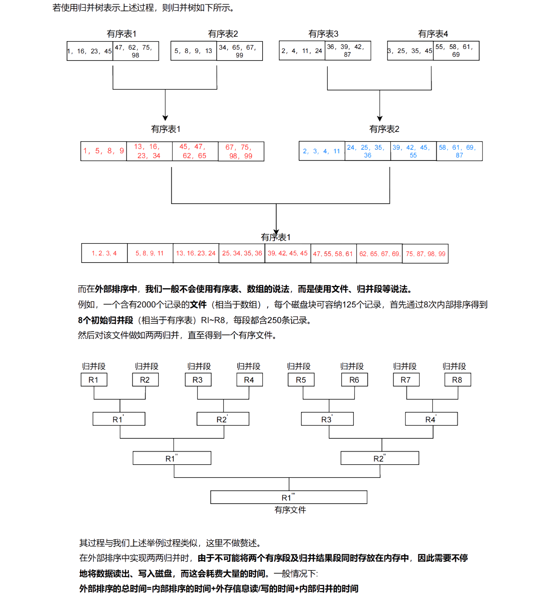
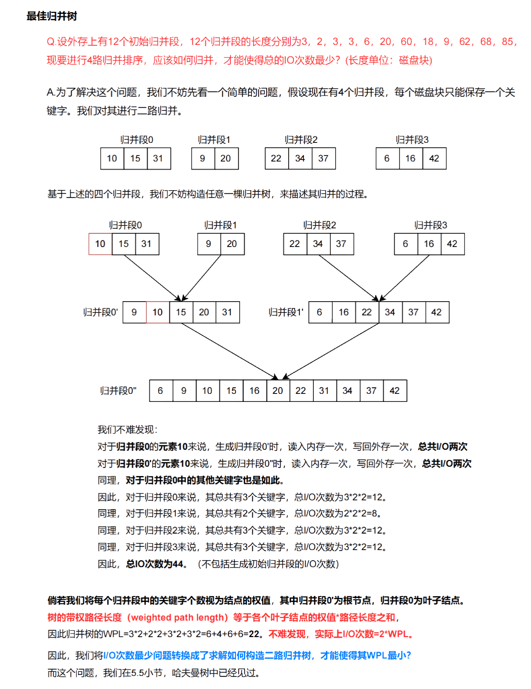

## 排序算法总结


### 三傻排序

- **冒泡排序**：在 `0~i` 范围上，相邻位置较大的数滚下去，最大值最终来到 i 位置，然后在 0~i-1 范围上继续
- **插入排序**：在 `0~i` 范围上已经有序，新来的数从右到左滑到不再小的位置插入，然后继续
- **选择排序**：在 `i~n-1` 范围上，找到最小值并放在 i 位置，然后在 i + 1 ~ n - 1 范围上继续

### 归位性

1. **每趟排序都能确定一个或多个元素的最终位置**
2. 这些确定了位置的元素在后续的排序过程中不会被重新移动
3. 归位性是某些排序算法的重要性质，有助于减少不必要的比较和交换

#### 常见具有归位性的排序算法

1. **冒泡排序**
   - **过程**：每一趟将未排序部分的最大或最小元素 " 冒泡 " 到它的最终位置
   - **归位性**：每趟确定一个最大或最小元素的最终位置

2. **选择排序**
   - **过程**：每一趟从未排序部分选择最小（或最大）元素放在已排序部分的末尾（或开头）
   - **归位性**：每趟确定一个元素的最终位置

3. **快速排序**
   - **过程**：每次选择一个**基准元素**，并将数组划分为两个子数组，其中基准元素位于其最终位置
   - **归位性**：每趟递归中确定一个基准元素的最终位置

4. **堆排序**

#### 非归位性排序算法

1. **插入排序**
   - **原因**：在插入排序的过程中，前面已排序的部分可能会在后续的插入过程中被移动，因此每一趟插入未必能确定某个元素的最终位置

2. **归并排序**
   - **原因**：归并排序直到最后一步合并前，所有的元素都处于未确定状态，需要完整地进行归并才能完成排序
3. **希尔排序**：希尔排序属于插入排序

### 稳定性

- **稳定排序**：插入排序、冒泡排序、归并排序、基数排序
- **不稳定排序**：其余排序算法

### 确定最大或最小

- 冒泡排序、简单选择排序、堆排序

### 确定最终位置

每一步至少将一个元素放到最终位置的排序: 冒泡、快速、简单选择、堆排序
在最后一趟排序前可能所有元素都不在最终位置的排序：直接插入排序、折半插入排序、希尔排序、归并排序、基数排序

### 空间复杂度

- **快速排序**：O(logn)~O(n)（递归栈）
- **归并排序**：O(n)（辅助数组）
- **基数排序**：O(r)（辅助队列）

### 排序趟数与原始状态有关

- **冒泡排序**：
  - 若数据接近有序，趟数会减少，因为无需进行多次交换

- **快速排序**：
  - 若数据分区良好（接近均匀），趟数少，性能优越
  - 最坏情况下（如数组已排序且选取极值作为基准），需要 $O(n^2)$ 趟

### 排序趟数与原始状态无关

- **插入排序**：
  - 每次插入元素，无论原始状态如何，都需完成 $n-1$ 次插入

- **简单选择排序**：
  - 固定进行 $n-1$ 趟，每次选择未排序部分的最小元素

- **基数排序**：
  - 每一趟按位排序（如个位、十位等），总共需要 $d$ 趟，取决于最大数的位数

- **归并排序**：
  - 无论原始数据如何，都需要递归 $O(\log n)$ 趟进行合并

- **堆排序**：
  - 构建堆的过程固定，每次调整堆也需要 $O(\log n)$ 次，因此与原始状态无关

### 比较次数与原始状态无关

- **简单选择排序**：
  - 每一趟比较 $n-i$ 次，总共需要 $n(n-1)/2$ 次比较

- **不改进的冒泡排序**：
  - 每趟固定比较相邻元素，无论数据是否有序，均需进行 $n(n-1)/2$ 次比较

### 比较次数

- **基于比较的排序算法**，如**快速排序**、**归并排序**等，最少需要：

  $$
  \log_2(n!) \approx n \log_2 n
  $$

  次关键字之间的比较，这是比较排序的**理论下界**

### 排序选择

- **排序趟数受原始状态影响**：冒泡排序、快速排序
- **排序趟数与原始状态无关**：插入排序、简单选择排序、基数排序、归并排序、堆排序
- **比较次数与原始状态无关**：简单选择排序、不改进的冒泡排序
- **比较排序的下界**：$n \log_2 n$ 次关键字比较是不可避免的
- **适合顺序存储结构**：折半插入、希尔排序、快速排序、堆排序

### 各个排序算法的已排序部分特点

#### 1. 冒泡排序

- **每趟特点**：每趟排序后，最大的元素 " 冒泡 " 到序列的末尾
- **已排序部分**：序列末尾部分，包含当前序列中最大的元素，顺序不变

#### 2. 选择排序

- **每趟特点**：每一趟从未排序部分选择最小的元素，并将其放到已排序部分的末尾
- **已排序部分**：序列开头部分，逐渐扩展，包含当前最小的元素

#### 3. 插入排序

- **每趟特点**：每一趟将未排序部分的第一个元素插入到已排序部分中，使其保持有序
- **已排序部分**：从序列开头逐渐扩展，始终有序

#### 4. 希尔排序

- **每趟特点**：按增量（间隔）分组，每趟对分组内元素排序，增量逐渐减小，序列趋向有序
- **已排序部分**：按间隔排序的元素，最终间隔为 1 时，整个序列有序

#### 5. 归并排序

- **每趟特点**：每一趟将两个有序子序列合并为一个更大的有序序列
- **已排序部分**：多个有序子序列逐步合并为更大的有序部分，最终整个序列有序

#### 6. 快速排序

- **每趟特点**：选定枢轴元素，左右两部分分别递归排序，枢轴位置固定
- **已排序部分**：枢轴元素位置固定，左右两侧需要继续排序

#### 7. 堆排序

- **每趟特点**：将堆顶元素与序列末尾元素交换，然后调整堆
- **已排序部分**：序列末尾部分，包含当前最大元素

#### 8. 计数排序

- **每趟特点**：根据元素的出现次数将元素直接放入最终位置
- **已排序部分**：经过一次排序后，整个序列成为已排序部分

#### 9. 桶排序

- **每趟特点**：将元素分配到桶中，桶内排序后合并
- **已排序部分**：每次桶内排序后的有序元素，最终合并成已排序序列

#### 10. 基数排序

- **每趟特点**：按数位进行排序，从最低位开始，逐位处理
- **已排序部分**：按当前数位有序的序列，最终整个序列有序

## 排序的基本概念

### 排序的稳定性

- 排序的稳定性主要针对 **内部排序**，是指在排序过程中，**关键字相等的元素之间的相对顺序是否会改变**;

- 考研数据结构中，4 个不稳定算法:
  - 希尔排序
  - 快速排序
  - 简单选择排序
  - 堆排序

### 内部排序和外部排序

- 内部排序
  - **内部排序**是在主存储器（通常是 RAM）中完成的排序算法。所有待排序的数据都能够一次性加载到内存中进行排序
- 外部排序
  - **外部排序**适用于数据量超过内存容量的情况，需要借助**外部存储设备**（如硬盘）完成排序。常用的外部排序算法是**多路归并排序**
  - **特点**：
    - 涉及**数据分区**、**多路归并**等技术
    - 排序性能对**磁盘 I/O**操作次数和**内存与磁盘之间的数据传输速率**非常敏感

## 插入排序

### 直接插入排序

- **原理**：
  - 某节点是提前排好序的
  - 未排序数据从后向前一一比较大小并交换数据
  - 边比较边移动元素


#### 代码实现

```cpp
/* 插入排序 */
void insertionSort(vector<int> &nums) {
    // 外循环：已排序区间为 [0, i-1]
    for (int i = 1; i < nums.size(); i++) {
        int base = nums[i], j = i - 1;
        // 内循环：将 base 插入到已排序区间 [0, i-1] 中的正确位置
        while (j >= 0 && nums[j] > base) {
            nums[j + 1] = nums[j]; // 将 nums[j] 向右移动一位
            j--;
        }
        nums[j + 1] = base; // 将 base 赋值到正确位置
    }
}
```

- 在内循环中，除了比较外，还要将当前元素移动到最终位置

#### 算法性能分析

- **时间复杂度**:

  - **最好情况**: $O(n)$
  - **最坏情况**: $O(n^2)$
  - **平均情况**: $O (n^2)$
- **空间复杂度**:$O (1)$，因为插入排序是原地排序算法，不需要额外的存储空间
- **稳定性**: " **稳定** "

#### 算法特点

- **简单易实现**：直接插入排序算法的逻辑简单，适合初学者实现
- **适用场景广泛**：
  - 插入排序适用于顺序存储和链式存储
  - **在链式存储中，元素不需要移动，只需改变指针位置**
- **性能依赖初始状态**：
  - 排序效率受待排序数据的初始状态影响很大
  - 当数据接近有序时，插入排序的效率很高，接近 $O(n)$
- **局部有序性**：
  - 在每次排序后，前 $m+1$ 个元素是有序的，但它们可能还没有移动到最终位置上

### 折半插入排序

折半插入排序是一种改进版的插入排序，它结合了**折半查找**的思想来加速插入过程
在每轮插入时，通过折半查找定位新元素在已排序序列中的正确位置，从而**减少了比较次数**。但是，虽然比较次数减少了，**元素的移动次数并没有优化**，因此整体的时间复杂度依然是 $O (n^2)$

#### 代码实现

```cpp
void binaryInsertionSort(int arr[], int n) {
    for (int i = 1; i < n; i++) {
        int key = arr[i];
        int left = 0, right = i - 1;
        // 折半查找应该插入的位置
        while (left <= right) {
            int mid = (left + right) / 2;
            if (key < arr[mid])
                right = mid - 1;
            else
                left = mid + 1;
        }
        // 将更大的元素向右移动
        std::copy_backward(arr + left, arr + i, arr + i + 1);
        // 插入元素
        arr[left] = key;
    }
}
```

- 通过折半查找减少比较次数但是移动次数还是没有改变啊

#### 算法性能分析

- **时间复杂度**:

  - **最好情况**: $O(n)$
  - **最坏情况**: $O(n^2)$
  - **平均情况**: $O(n^2)$
- **空间复杂度**: $O (1)$，折半插入排序是一种原地排序算法，不需要额外的辅助空间
- **稳定性**: " **稳定** "

#### 算法特点

- **优于直接插入排序**：在平均情况下，折半插入排序的比较次数少于直接插入排序，因此性能略优
- **移动次数未优化**：虽然比较次数减少了，但元素的移动次数依然未变，因此总的时间复杂度仍然是 O(n²)
- **适用于顺序存储**：由于使用了折半查找，这种排序只适用于顺序存储结构，不适合链表等非顺序存储结构
- **元素位置不确定**：和直接插入排序一样，在排序结束之前，所有元素可能都不在最终位置上

### 希尔排序 （Shell Sort）

希尔排序也称为 " **缩小增量排序** "，其核心在于通过逐步减少增量，**最终达到增量为 1**，即普通的插入排序
希尔排序的基本思想是将整个待排序的记录序列分割成若干个子序列分别进行直接插入排序，待整个序列中的记录 " 基本有序 " 时，再对全体记录进行一次直接插入排序

> [! ] 在希尔排序的过程中，每一趟的排序用的是直接插入排序

```cpp
void shellSort(vector<int>& A) {
    int n = A.size();  // 计算数组长度
    int gap = n / 2;   // 初始增量gap为数组长度的一半
    while (gap > 0) {  // 当增量大于0时循环
        for (int i = gap; i < n; i++) {  // 从增量位置开始遍历数组
            int temp = A[i];  // 取出当前位置的值
            int j = i;  // 设置开始比较的位置
            // 比较并插入排序
            while (j >= gap && A[j - gap] > temp) {
                A[j] = A[j - gap];
                j -= gap;
            }
            A[j] = temp;
        }
        gap /= 2;  // 减小增量
    }
}
```

- **初始化增量 `gap`**：将数组长度除以 2 作为初始增量
- **外循环**：逐步缩小增量 `gap`，当 `gap = 1` 时，算法退化为插入排序
- **内循环**：对每个子序列进行插入排序，比较并插入每个元素至正确位置
- **减小增量**：每趟排序结束后，将 `gap` 除以 2，直至 `gap` 等于 0

#### 增量选择

- **增量序列的选择**对希尔排序的性能有着非常大的影响。虽然任何序列最终只要有 `gap = 1` 都可以，但没有理论上最优的增量序列。目前常用的增量序列有 Hibbard 增量、Sedgewick 增量等
- 由于增量序列涉及未解决的数学难题，希尔排序的时间复杂度也因此无法精确确定

#### 算法性能分析

- **时间复杂度**:

  - 希尔排序的时间复杂度依赖于选择的增量序列。实验表明，在某些情况下，希尔排序的时间复杂度接近 $O(n^{1.3})$。然而，由于增量序列的选择问题未能解决，精确的时间复杂度仍不确定。在考试中一般不会要求计算希尔排序的时间复杂度
- **空间复杂度**: **O(1)**
- **稳定性**:" **不稳定** "

#### 算法特点

- **适用于顺序存储结构**：希尔排序对数据进行分组，通常同一组的元素不相邻，因此只能用于顺序存储结构，无法用于链式存储结构

- **性能优于插入排序**：在处理大规模数据时，希尔排序比直接插入排序更快。对于大数据集，虽然希尔排序可能不如快速排序和堆排序，但对于中等规模的数据集和良好的增量序列，希尔排序的性能可能优于这些高级排序算法

- **元素可能不在最终位置**：在希尔排序的最后一趟排序之前，所有元素都可能不在最终位置上

## 交换排序

> [! ] 冒泡排序和快速排序确保在每轮至少确定一个元素的最终位置

### 冒泡排序

冒泡排序是一种简单的交换排序算法，它通过**相邻元素比较**，逐步将最大或最小的元素 " 冒泡 " 到数组的一端。每次遍历未排序的元素，确保在每一轮之后，将一个最大或最小的元素放在其最终位置上


```cpp
/* 冒泡排序 */
void bubbleSort(vector<int> &nums) {
    int n = nums.size();
    // 外循环：未排序区间为 [0, i]
    for (int i = n - 1; i > 0; i--) {
        bool swapped = false; // 标志变量，用于检测是否进行了交换
        // 内循环：将未排序区间 [0, i] 中的最大元素交换至该区间的最右端
        for (int j = 0; j < i; j++) {
            if (nums[j] > nums[j + 1]) {
                // 交换 nums[j] 与 nums[j + 1]
                std::swap(nums[j], nums[j + 1]);
                swapped = true; // 标记进行了交换
            }
        }
        // 如果在某一趟排序中没有进行交换，则排序已经完成
        if (!swapped) break;
    }
}
```

#### 算法性能分析

- **时间复杂度**:

  - **最好情况**: $O(n)$
  - **最坏情况**: $O (n^2)$
  - **平均情况**: $O (n^2)$
- **空间复杂度**: $O (1)$

  - 冒泡排序只需要常数级的辅助空间（一个标志位和一个临时变量)
- **稳定性**: " **稳定** "

#### 算法特点

- **逐步确定元素位置**: 每趟遍历将一个最大或最小的元素放置到最终位置上
- **适用场景**: 冒泡排序适用于顺序存储结构和链式存储结构，但其效率不高，适合小规模数据集
  - *序列的初始状态会严重影响排序的趟数、比较次数、移动次数;*
- **性能优化**:

  - 设置标志位，如果某次遍历没有发生任何交换，说明序列已经有序，可以提前结束排序，避免不必要的比较
  - 进一步优化：在每轮遍历中，记录最后一次发生交换的位置。该位置之后的元素显然已经有序，后续遍历时可减少范围

### 快速排序

**快速排序**是一种基于分治思想的高效排序算法，旨在**通过一次交换消除多个逆序**，从而提高整体排序效率
相比冒泡排序，快速排序通过选择一个**枢轴（pivot）**，将数组分成两部分，使得左边部分都比枢轴小，右边部分都比枢轴大，然后对左右子数组分别递归地进行排序。最终，所有元素排序完成

> [! ] 所以每次排序都会最少确定一个位置：枢纽位置

> [! ] 快速排序第一趟排序结束后枢纽左右两端分别为 P、Q 两块，则 PQ 块间有序

> [! ] 递归处理的次数与每次划分后得到的分区处理顺序无关，主要取决于数组的划分深度，也就是树的高度


```cpp
/* 哨兵划分 */
int partition(vector<int> &nums, int left, int right) {
    // 以 nums[left] 为基准数
    int pivot = nums[left];
    int i = left, j = right;
    while (i < j) {
        // 从右向左找首个小于基准数的元素
        while (i < j && nums[j] >= pivot)
            j--;
        // 从左向右找首个大于基准数的元素
        while (i < j && nums[i] <= pivot)
            i++;
        // 交换这两个元素
        if (i < j)
            std::swap(nums[i], nums[j]);
    }
    // 将基准数交换至两子数组的分界线
    std::swap(nums[left], nums[i]);
    // 返回基准数的索引
    return i;
}
```

- 首先选择一个基准数（通常是当前区间的第一个元素 `nums[left]`），然后通过两个指针 `i` 和 `j` 从左右两侧向中间扫描，找到两个待交换的元素
- 当所有小于基准数的元素移到左边，大于基准数的元素移到右边时，基准数最终确定其正确的位置
- 递归调用左右子数组，直到所有子数组只有一个元素时，数组已完全排序

#### 算法性能分析

- **时间复杂度**:

  - **最好情况**: $O(nlogn)$
  - **最坏情况**:  $O (n^2)$
  - **平均情况**:  $O (nlogn)$

- **空间复杂度**:

  - 快速排序需要递归调用，空间复杂度与递归栈的深度有关
  - **最好情况**: 当每次均匀划分时，递归深度为 `logn`，空间复杂度为 **O(logn)**
  - **最坏情况**: 当每次只能去掉一个元素时，递归深度为 `n`，空间复杂度为 **O(n)**
- **稳定性**: " **不稳定** "

#### 算法特点

- **高效**: 快速排序每次划分都能将一个元素放在最终位置上，并且划分后分别对两个子数组继续递归
- **适用范围广**: 快速排序适用于顺序存储结构，并且对于数据量较大的情况，快速排序的效率非常高
- **哨兵划分**: 快速排序的核心是哨兵划分，通过双指针的方法，将较长的排序问题分解为两个较短的排序问题
- **小数据优化**: 当子数组元素较少（例如少于某个常数 k 时），可以改用插入排序来提高效率

## 选择排序

### 简单选择排序

#### 算法思想

每趟排序从待排序列中选择关键字最大或最小的元素放在有序序列的末端
每次处理后，无序区减少一个元素，直至所有元素排序完成


#### 代码实现

```cpp
/* 选择排序 */
void selectionSort(vector<int> &nums) {
    int n = nums.size();
    // 外循环：未排序区间为 [i, n-1]
    for (int i = 0; i < n - 1; i++) {
        // 内循环：找到未排序区间内的最小元素
        int k = i;
        for (int j = i + 1; j < n; j++) {
            if (nums[j] < nums[k])
                k = j; // 记录最小元素的索引
        }
        // 将该最小元素与未排序区间的首个元素交换
        std::swap(nums[i], nums[k]);
    }
}
```

#### 算法性能分析

- **比较次数**:  $n(n-1)/2$
- **时间复杂度为** $O (n^2)$
- **空间复杂度**：$O (1)$
- **稳定性**：" 不稳定 "
  - 选择排序可以通过改写为稳定排序，例如每次选出一个最小元素并复制到新空间，但这种实现方式会增加空间复杂度

#### 算法特点

- **适用场景广泛**: 简单选择排序适用于顺序存储和链式存储
- **初始状态无影响**: 输入序列的初始状态不影响比较次数，但会影响元素的交换次数。即使输入序列已经部分有序，仍需进行比较
- **确定位置**: 每趟排序都会将一个元素放到最终位置，因此经过 n-1 轮，所有元素均有序
- **效率低**: 虽然选择排序比较稳定，时间复杂度始终是 O(n²)，但在实际应用中并不适合大数据量的排序任务

### 堆排序

- 堆是⼀棵**完全⼆叉树**分为大根堆，⼩根堆两种类型;
  - **大根堆**：任一结点≥其左右孩子
  - **⼩根堆**：任一结点≤其左右孩子

> [! ] 堆排序基于**最大堆**实现升序排序，或基于**最小堆**实现降序排序

#### 算法思想

1. **构建最大堆**：将数组调整为最大堆结构，使根节点为最大元素
2. **交换与重构**：

    - 将堆顶元素（最大值）与末尾元素交换
    - 重新调整剩余部分为最大堆

3. **重复过程**：不断将堆顶与末尾交换，并调整剩余部分，直到排序完成

#### 性能分析

- **时间复杂度**：
  - **构建堆**：$O(n)$
  - **堆化调整**：$O(\log n)$
  - **整体时间复杂度**：$O(n \log n)$
- **空间复杂度**：$O(1)$
- **稳定性**: " 不稳定 "

#### 堆排序的优化

- **建堆时的优化**：从最后一个非叶子节点开始构建堆，减少调整次数
- **大顶堆与小顶堆切换**：根据排序需求选择大顶堆（升序排序）或小顶堆（降序排序）。
- **部分堆排序**：适用于获取前 K 大的元素（如优先队列）

#### 操作

##### 插入一个元素【2009,2011】

1. **按完全二叉树的编号顺序插入**：
   - 将新元素插入到堆的**最后一个叶子节点**位置，保证堆仍然是**完全二叉树**
2. **向上调整（上浮）**：
   - 依次与**父节点**进行比较，如果违反堆的性质（如最大堆中子节点大于父节点），则交换位置
   - 重复该过程直到堆的性质恢复，或元素成为根节点

##### 删除一个元素【2015】

1. **删除堆顶元素**：在最大堆中，删除**根节点**（即最大值）
2. **将最后一个叶子节点替换到根节点**位置，维持完全二叉树的性质
3. **向下调整（下沉）**：
   - 从根节点开始，与左右子节点中的**较大者**（最大堆）或**较小者**（最小堆）进行比较。
   - 如果违反堆的性质，则交换，继续向下调整，直到堆的性质恢复

##### 空堆一个个插入建堆

1. 初始化一个**空堆**
2. 依次将元素插入堆，并按照插入操作的**上浮规则**调整堆的结构
3. 重复该过程，直到所有元素插入完毕，形成完整的堆

##### 堆排序

1. **构建最大堆**：将无序数组转换为**最大堆**，使堆顶为最大元素。
2. **交换堆顶与末尾元素**：将堆顶（最大元素）与数组末尾元素交换。
3. **缩小堆的范围**，对剩余元素进行调整，恢复最大堆性质。
4. **重复上述过程**，直到堆中只剩一个元素。

#### 代码实现

```cpp
// 堆化函数
void heapify(int arr[], int n, int i) {
    int largest = i; // 初始化最大值为根
    int l = 2 * i + 1; // 左子节点 = 2*i + 1
    int r = 2 * i + 2; // 右子节点 = 2*i + 2

    // 如果左子节点大于当前的最大值
    if (l < n && arr[l] > arr[largest])
        largest = l;

    // 如果右子节点大于当前的最大值
    if (r < n && arr[r] > arr[largest])
        largest = r;

    // 如果最大值不是根，则交换并递归调整子树
    if (largest != i) {
        std::swap(arr[i], arr[largest]);
        heapify(arr, n, largest);
    }
}

// 主堆排序函数
void heapSort(int arr[], int n) {
    // 从最后一个非叶子节点开始构建堆
    for (int i = n / 2 - 1; i >= 0; i--)
        heapify(arr, n, i);

    // 逐个将堆顶移至末尾
    for (int i = n - 1; i > 0; i--) {
        // 将当前堆顶（最大值）与末尾元素交换
        std::swap(arr[0], arr[i]);

        // 在缩小后的堆上继续堆化
        heapify(arr, i, 0);
    }
}

```

#### 实例


## 二路归并排序（Two-Way Merge Sort）


**二路归并排序（Two-Way Merge Sort）** 是一种基于**分治法（Divide and Conquer）** 的排序算法，将原始数组分成两部分递归排序，然后将两个有序数组进行合并。它在处理**大规模数据**时非常高效，尤其在需要**外部排序**的场景（如数据量超出内存时）

### 基本步骤

1. **分解**：将数组不断二分，直到每部分只剩一个元素
2. **合并**：将两个有序子数组进行合并，形成一个更大的有序数组
3. **递归**：对左右子数组递归地执行上述操作

### 性能分析

- **排序次数**：$O(\log n)$
- **每一轮归并操作**：$O(n)$
- **时间复杂度**：
  - **平均情况**：$O(nlog⁡n)$
  - **最坏情况**：$O(nlog⁡n)$
- **空间复杂度**：$O(n)$

- **稳定性**：" 稳定 "

### 适用场景

- 适合处理**链表**，因为链表中的插入操作比数组高效
- 在处理**大规模数据**或需要**外部排序**（如磁盘排序）时，归并排序性能优越

### 代码实现

```cpp
#include <stdlib.h>

// 合并左子数组和右子数组
void merge(int *nums, int left, int mid, int right) {
    // 左子数组区间为 [left, mid], 右子数组区间为 [mid+1, right]
    // 创建一个临时数组 tmp ，用于存放合并后的结果
    int tmpSize = right - left + 1;
    int *tmp = (int *)malloc(tmpSize * sizeof(int));
    // 初始化左子数组和右子数组的起始索引
    int i = left, j = mid + 1, k = 0;
    // 当左右子数组都还有元素时，进行比较并将较小的元素复制到临时数组中
    while (i <= mid && j <= right) {
        if (nums[i] <= nums[j]) {
            tmp[k++] = nums[i++];
        } else {
            tmp[k++] = nums[j++];
        }
    }
    // 将左子数组和右子数组的剩余元素复制到临时数组中
    while (i <= mid) {
        tmp[k++] = nums[i++];
    }
    while (j <= right) {
        tmp[k++] = nums[j++];
    }
    // 将临时数组 tmp 中的元素复制回原数组 nums 的对应区间
    for (int i = 0; i < tmpSize; ++i) {
        nums[left + i] = tmp[i];
    }
    // 释放临时数组的内存
    free(tmp);
}

// 归并排序
void mergeSort(int *nums, int left, int right) {
    // 终止条件
    if (left >= right)
        return; // 当子数组长度为 1时终止递归
    // 划分阶段
    int mid = left + (right - left) / 2;    // 计算中点
    mergeSort(nums, left, mid);      // 递归左子数组
    mergeSort(nums, mid + 1, right); // 递归右子数组
    // 合并阶段
    merge(nums, left, mid, right);
}
```

## 基数排序【桶排序的扩展】


### 算法概述

- **按位排序**：从最低位（个位）开始，一直到最高位，逐位对所有元素进行排序
- **借助稳定排序**：基数排序在每一位的排序过程中，通常借助稳定的排序算法（如**计数排序**或**桶排序**）
- **多轮遍历**：每一轮根据当前位的数值进行分类，分类完成后将元素重新合并，再处理更高的位

### 算法性能分析

- **时间复杂度**：$O(d⋅(n+k))$，其中 d 为最大元素的位数，n 为元素个数，k 为每位的基数（如十进制中 k=10）
- **空间复杂度**：$O(n+k)$，需要额外空间存储每一轮的分类结果

- **稳定性**：" 稳定 "

### 算法特点

- 既适用于顺序存储，又适用于链式存储
- 使用前必须给定每一级关键字的优先级
- **时间复杂度与初始状态无关**，即无论数据是否已部分排序，时间复杂度都保持相同
- 适用于 `n` 比较大，但是 `d` 和 `r` 比较小的序列。比如：对中国 14 亿人口按身份证号进行排序

### 适用场景

- 适合用于**整数排序**和**字符串排序**
- 在数据位数有限且较短时，基数排序非常高效，优于基于比较的排序算法

## 桶排序


### 桶排序的步骤

1. **确定桶的数量**：根据待排序数组的值域范围，将数组划分为 k 个桶，每个桶可以看做是一个范围区间
2. **分配元素**：遍历待排序数组元素，将每个元素根据大小分配到对应的桶中
3. **对每个桶进行排序**：对每个非空桶内的元素单独排序（使用插入排序、归并排序、快速排序等算法）
4. **合并桶内元素**：将排好序的各个桶中的元素按照区间顺序依次合并起来，形成一个完整的有序数组

### 时间复杂度

- **一般情况**：假设有 n 个元素，均匀分布到 k 个桶中，每个桶内的元素数约为 n/k。如果对每个桶使用快速排序，其时间复杂度为 O((n/k) log(n/k))。因此，整个算法的时间复杂度为 O(n + n log(n/k))。在最理想的情况下（元素均匀分布），时间复杂度接近 O(n)
- **最佳情况**：当输入元素个数为 n，桶的个数是 m 时，每个桶里的数据是 k = n/m。每个桶内排序的时间复杂度为 O(k log k)。m 个桶的总时间复杂度为 O(n log(n/m))。当桶的个数 m 接近于数据个数 n 时，log(n/m) 是一个较小的常数，所以桶排序时间复杂度接近于 O(n)

### 空间复杂度

- **一般情况**：需要额外的空间用于桶，空间复杂度为 O(n)
- **最佳情况**：由于桶排序使用了辅助空间，空间复杂度是 O(n + m)

### 排序稳定性

- **稳定性**：桶排序的稳定性取决于桶内使用的排序算法。如果桶内使用稳定的排序算法（比如插入排序），并且在合并桶的过程中保持相等元素的相对顺序不变，则桶排序是一种稳定排序算法。反之，则桶排序是一种不稳定排序算法

### 优点

- 非比较排序，在最佳情况下，时间复杂度接近线性 O(n)
- 适合数据均匀分布的情况

### 缺点

- 需要额外的空间来存储桶，空间开销较大
- 对数据的分布有一定要求，如果数据不均匀，算法性能可能下降

```cpp
/* 桶排序 */
void bucketSort(float nums[], int n) {
    int k = n / 2;                                 // 初始化 k = n/2 个桶
    int *sizes = malloc(k * sizeof(int));          // 记录每个桶的大小
    float **buckets = malloc(k * sizeof(float *)); // 动态数组的数组(桶)
    // 为每个桶预分配足够的空间
    for (int i = 0; i < k; ++i) {
        buckets[i] = (float *)malloc(n * sizeof(float));
        sizes[i] = 0;
    }
    // 1. 将数组元素分配到各个桶中
    for (int i = 0; i < n; ++i) {
        int idx = (int)(nums[i] * k);
        buckets[idx][sizes[idx]++] = nums[i];
    }
    // 2. 对各个桶执行排序
    for (int i = 0; i < k; ++i) {
        qsort(buckets[i], sizes[i], sizeof(float), compare);
    }
    // 3. 合并排序后的桶
    int idx = 0;
    for (int i = 0; i < k; ++i) {
        for (int j = 0; j < sizes[i]; ++j) {
            nums[idx++] = buckets[i][j];
        }
        // 释放内存
        free(buckets[i]);
    }
}

```

- 初始化 k 个桶，将 n 个元素分配到 k 个桶中;
- 对每个桶分别执行排序 (这里采用编程语言的内置排序函数);
- 按照桶从小到大的顺序合并结果;

## 外部排序

### 外部排序的基本概念

外部排序用于处理**大文件排序**，当数据量过大无法完全加载到内存时，需要将数据存储在**外部存储器**（如磁盘）上进行处理。由于无法一次性将所有数据加载到内存，外部排序通过在**内存缓冲区**和外存之间频繁交换数据来完成排序

- **I/O 操作**：外部排序的主要开销是**对外存数据的读写**次数，因此优化 I/O 访问是提高效率的关键
- **应用场景**：数据库查询优化、日志文件排序、大型数据处理任务等

### 外部排序的方法

最常用的外部排序算法是**归并排序**，主要分为两个阶段：

1. **生成初始归并段（顺串）**：
   - 将数据按**内存缓冲区大小**分块加载。
   - 每块数据在内存中进行**内部排序**，形成多个有序的初始归并段（顺串）。
   - 排序后的块写回外存。

2. **归并初始归并段**：
   - 使用**多路归并**将多个有序段合并成一个大的有序文件。
   - 依次读取不同段的最小值进行比较，将较小值输出，直到所有段合并完成。

#### 时间框架

$$
T_{\text{外部排序}} = T_{\text{内部排序}} + T_{\text{归并}}
$$  

- **内部排序时间**：生成初始归并段的时间（通常采用**快速排序或归并排序**）
- **外部排序时间**：进行多路归并的时间（与**外存 I/O 读写**次数密切相关）

#### 归并排序优化

1. **增大归并的路数**：
   - **K 路归并**：同时合并 K 个有序段，可以减少归并趟数，提高效率
   - 例如，若有 100 个初始归并段，采用 2 路归并需要 7 趟，但采用 10 路归并只需 2 趟

2. **减少归并趟数**：
   - 增大**内存缓冲区大小**，减少需要归并的段数

3. **减少初始归并段数量**：
   - 尽量在生成初始归并段时就使段数较少，以减少后续合并的工作量

4. **使用优先队列**：
   - 在归并过程中采用**小顶堆**或优先队列来优化段的选择，使归并更高效



### 多路平衡归并与败者树

#### 引入败者树的原因

- 败者树是归并树的一种变形，每个非叶子结点保存两个记录
- 结构与完全二叉树相似
- 特点：
  - **k 个叶子结点**：保存 k 个归并段的最小记录
  - **内部结点**：记录左右子树中的 " 失败者 "
  - **胜者继续比较**：直到根结点，得到最终的胜者记录

#### 结构描述


- **叶结点**：表示初始归并段，权值为归并段的长度
- **非叶结点**：代表新的初始归并段
- **根结点**：表示最终生成的归并段
- **带权路径长度 (WPL)**：表示归并过程中处理的总记录数
- **伪结点**：用于优先归并记录数均匀分布的归并段，从而减少 I/O 次数

- **败者树的实现步骤**

 1. 初始化叶子结点，存储各归并段的首个记录
 2. 自底向上构建树，内部结点存储败者记录
 3. 根结点存储当前轮次的胜者记录，并输出结果
 4. 更新胜者的归并段中的下一个元素，并重新进行比较，更新树结构

#### 性能影响

- **k 路归并树的高度**：大约为 $\log_k n$
- **k 越大**：树的高度越小，归并所需的 I/O 次数也越少

#### 算法优化

- **树的高度控制**：
  - 树的高度与**归并路数 k**和段数 n 有关，高度为 $\log_k n$
    - 增加**归并路数 k**会减少树的高度和 I/O 操作次数
- **I/O 优化**：
  - 在大规模数据的外部排序中，**减少 I/O 操作**是关键。败者树可以减少每轮 I/O 操作的次数，使多路归并更高效

#### 败者树的实际应用

- **数据库排序**：用于对大规模数据进行归并排序，提高查询性能
- **搜索引擎**：归并多个索引文件，减少读取次数
- **流式数据处理**：实时合并多个流数据，确保有序输出

### 败者树与其他排序算法的比较

- 败者树用于**多路归并**，即同时归并多个已排序的段，减少归并趟数
- **多路归并 vs. 二路归并**：
  - **多路归并**更高效，能一次性处理更多数据
  - 败者树能在多路归并中显著提升效率，减少每轮的 I/O 次数

- **与堆排序的比较**：
  - 堆排序使用堆结构，而败者树是一种特殊的完全二叉树结构，更适合多路归并
- **与普通归并树的区别**：
  - 普通归并树每次仅记录胜者，而败者树同时记录失败者，使更新更高效

##### 示例图


- 预处理：
  - 根据内存大小，将 n 个记录的磁盘文件划分成若干长度为 t 的子文件
  - 读入内存，排序生成有序子文件，写回外存，称为归并段或顺串

- 归并排序：
  - 采用归并方法将初始归并段逐趟合并成一个有序文件

- 外存被分为外存块（如磁盘块）
  - 第一阶段中，根据磁盘块能存放的数据元素决定子文件长度 t

- 例子：
  - 对包含 32 个数据元素的文件进行外部排序，每个磁盘块能装 2 个数据元素
  - 有两个输入缓冲区和一个输出缓冲区用于排序
  - 每次读入两个磁盘块的数据，内部排序后得到长度为 4 的初始归并段

    

    - 输出缓冲区满后，将数据输出到磁盘，继续归并操作，最终得到 8 个长度为 4 的初始归并段

    

    - 初始归并段生成后，通过不断读写外存数据进行归并，直至完成

    

    - 设初始归并段为 R1, R2…R8，归并流程如图所示

    

    - 8 个初始归并段的归并需要 3 趟，称为 2 路平衡归并

- 外部排序时间主要取决于读写磁盘 I/O 次数
  - 归并趟数 $s = \lceil \log_k{m} \rceil$，m 为初始归并段个数
  - 增加归并路数，减少初始归并段个数，减少归并趟数

### 置换选择排序

通过置换选择排序，将初始文件构造为两个初始归并段：

- 归并段 1：22, 26, 36, 49, 51, 55, 63
- 归并段 2：17, 19, 27, 28, 32, 34, 48, 49, 64


#### 操作过程

1. 从初始文件中输入 6 个记录到内存工作区
2. 选出关键字最小的记录作为 MINIMAX 记录，输出到归并段文件
3. 从内存工作区中选出新的 MINIMAX 记录，重复步骤 2-3，直至内存工作区为空

#### 示例

- 输入前 6 个记录到内存工作区，选出最小的 29 作为 MINIMAX 记录，输出到归并段文件

  

- 从初始文件中输入下一个记录 14 到内存工作区，选出新的 MINIMAX 记录

  

- 重复上述过程，直至选不出 MINIMAX 记录

  

  

### 最佳排序树

在置换 - 选择排序后，获得长度不等的初始归并段，各归并段占用的磁盘块数量不同。本节讲解如何使用初始归并段构建最佳归并树，以尽量减少磁盘调用次数


图中，圆形结点表示初始归并段，结点中的数字表示归并段长度（磁盘块数）。一次归并操作所需次数等于该段中每个磁盘块的读写操作次数。例如，图中归并 a 和 b 进行了 $2 + 10 = 12$ 次读写操作，共 $12 \times 2 = 24$ 次磁盘 I/O 操作。整个归并过程总共进行了 $12 + 21 + 33 + 41 + 74 = 181$ 次读操作，写操作即 $181 \times 2 = 362$ 次磁盘 I/O 操作

将每个归并段看作叶子结点，归并段长度作为结点权值。上图归并树的带权路径长度 (WPL) 为：

$$ WPL = (2 + 10 + 18 + 13) \times 3 + (18 + 23) \times 2 = 181 $$

归并树的带权路径长度 WPL 的 2 倍等于整个归并过程中的磁盘 I/O 次数，即：

$$ \text{磁盘 I/O 次数} = 2 \times \text{WPL} $$

因此，对于二路归并，按照哈夫曼树的方式进行归并最节省磁盘操作

对于 n 个初始归并段进行 k 路归并时，需保证 $\frac{(n-1)}{(k-1)}$ 为正整数，有时需添加虚段


