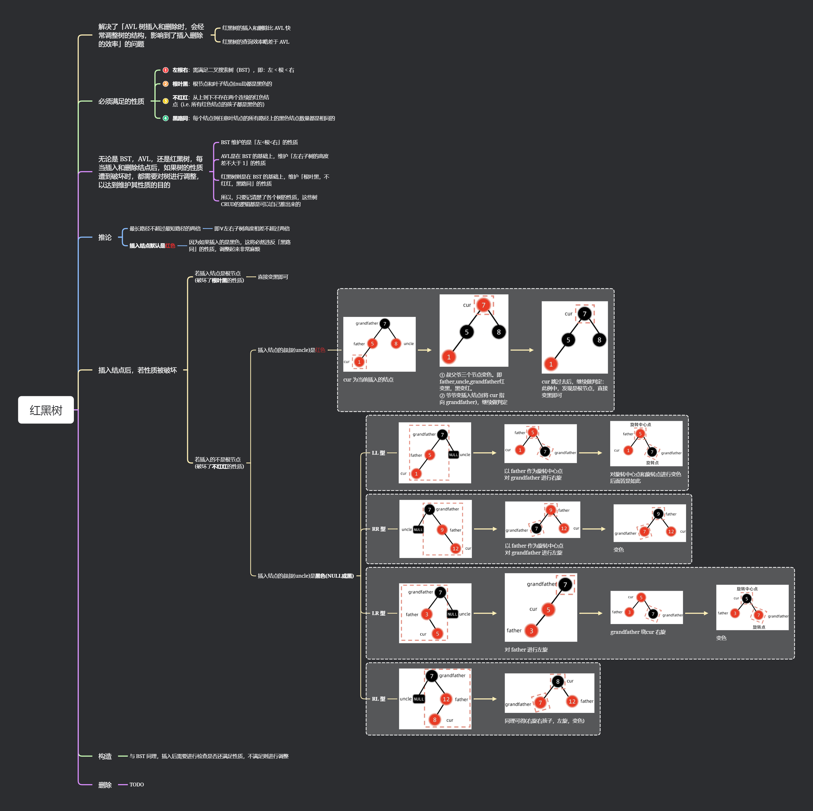

## 基本概念

**查找**：在数据集合中寻找满足某种条件的数据信息元素的过程称为查找
查找的结果分为两种：查找成功和查找失败

### 查找分类

- **检索表**（或文件）：查找一个特定的数据元素是否在查找表中
- 符合条件的特定种类的数据信息元素
- 查找表种类：在查找表中插入一个数据信息元素
- 查找表中间插入一个数据元素
- 查找某个特定条件的数据信息元素

### 查找表（查找结构）

用于查找的数据集合称为查找表，它由一类型的数据元素（或记录）组成，可以是一个数组、链表等数据类型

#### 对查找表的操作

- **查询**：检查特定的数据元素是否在查找表中
- **检索**：找到满足条件的特定种类的数据信息元素
- **插入**：在查找表中插入一个新的数据元素
- **删除**：从查找表中删除一个数据元素

#### 查找表种类

- **静态查找表**：查找操作后不对查找表进行任何修改。**常用于只查询、不修改数据的场景**
  - eg: 顺序查找，折半查找、散列查找
- **动态查找表**：查找操作后，可能会对查找表进行修改，包括插入、删除等操作
  - eg: 二叉排序树的查找、散列查找

### 关键字

**关键字**是数据元素中具有查找标志作用的一个或多个数据信息值，通常用于查找时区分不同的数据元素。每个关键字应该是唯一的，以确保查找结果的唯一性

### 查找效率

**查找效率**衡量的是在查找过程中所需的比较次数。一次查找的长度表示查找某个数据元素时进行的比较次数。对于多个元素的查找，**平均查找长度**是所有查找过程中进行的比较次数的总和

### 🌟🌟🌟平均查找长度（ASL）

**平均查找长度（ASL）**  是衡量查找算法效率的重要指标，用来表示在查找过程中，每个元素的平均比较次数。计算公式为：

$$ASL = \sum P_iC_i$$

- n 为查找长度
- $P_i$ 为查找第 i 个数据元素的概率 (一般情况默认每个数据的概率相等，即 $P_i = \frac{1}{n}$，$i = 1, 2, \ldots, n$)
- $C_i$ 为查找第 i 个数据元素所需的**比较**次数

> **平均查找长度是衡量查找算法效率的最重要的指标。**

## 顺序查找

顺序查找法，主要用于在线性表中进行查找
顺序查找法通常分为一般的**无序线性表查找**和**按关键字非递减有序线性表**的顺序查找

从线性表的第一个数据开始，逐个检查关键字是否满足给定的条件
若查找到满足关键字的第 i 个数据元素与给定的关键字相同，则查找成功，返回该数据元素在表中的位置
若查找到最后一个数据，且还没有查找到满足条件的关键字，则返回 0（或其他标志），则返回查找失败的位置

### 一般线性表的顺序查找

#### 基本思想

依次检查表中的每一个元素，直到找到满足条件的元素或者表的最后一个元素

#### ASL 分析

- 成功：$ASL_{\text{成功}} = \frac{n + 1}{2}$

- 失败：

  - 引入哨兵。比较 n + 1 次：$ASL_{\text{失败}} = \frac{n + 1}{2}$

  - 没有引入哨兵，比较 n 次：$ASL_{\text{失败}} = n$

#### 优缺点

- **优点**：
  - 实现简单，适合顺序表和链表等各种线性表
  - 对数据存储结构和关键字排序无要求，适合存储密度较高的情况
- **缺点**：
  - 查找效率较低，关键字的比较次数较多，适合于数据量较少或查找次数较少的情况

### 有序线性表的顺序查找

#### 基本思想

与无序表的顺序查找方法相同，但是由于数据已经按关键字排序，当查找到一个大于目标关键字的元素时，可以直接判定查找失败，不必继续查找


#### ASL 分析

- 成功（同无序表）：

   $$ASL_{\text{成功}} = \sum_{i=1}^{n}P_i(i + 1) = \frac{1}{2}(n + 1)$$

- 失败，有 n + 1 个失败结点，$C_i$ 分别为 1，2，3，…，n，n(**两个 n**)：

 $$ASL_{\text{失败}} = \sum_{i=1}^{n}P_iC_i = \frac{1 + 2 + 3 + \ldots + n + n}{n + 1} = \frac{n}{2}+ \frac{n}{n + 1}$$

## 折半查找

折半查找又称为二分查找，**仅适用于有序的顺序表**

基本思想：每次查找时，先将表的中间元素的关键字与给定的关键字比较，若相等则查找成功；若不相等则根据中间元素的关键字与给定关键字的大小关系，决定在表的前一半还是后一半继续查找，直到找到为止，或查找区间为空

#### 代码实现

```cpp
int Binary_Search(int *a, int n, int key) {
    int low = 0, high = n - 1, mid;
    while (low <= high) {
        // 使用low + (high - low) / 2防止(low + high)可能导致的溢出
        mid = low + (high - low) / 2;
        if (a[mid] == key) return mid; // 找到key，返回其位置
        else if (a[mid] > key) high = mid - 1; // key小于中间值，调整搜索区间到左半边
        else low = mid + 1; // key大于中间值，调整搜索区间到右半边
    }
    return -1; // 未找到key，返回-1
}
```

#### 查找判定树（平衡二叉树）


#### 特点

- 平均查找长度

  - 成功：$ASL_{\text{成功}} = \sum_{i=1}^{n}P_ih = \frac{1}{2}(\log_2(n + 1))$

  - 失败：$ASL_{\text{失败}} = \frac{1}{12} \cdot (4 \times 3 + 8 \times 4)$

#### 时间复杂度 $O(\log_2n)$

每次折半查找的次数不会超过树的高度，树的高度为 $\log_2(n + 1)$
故时间复杂度为 $O(\log_2n)$

## 分块查找（索引查找）

分块查找是顺序查找的一种改进方法，也称为索引顺序查找

- 基本思想：
  - 将表分成若干块，**块内元素无序，块间有序**
  - 每块建立一个**索引表**，索引表中的每个元素包含了对应块的**最大关键字**和**指向该块的指针**

#### 查找过程

- 在索引表中*顺序或折半查找* 记录所在的块
- 在块内进行**顺序查找**


#### 特点

- 索引查找
  - 查找索引表的平均查找长度 $L_i$
  - 查找块内的平均查找长度 $L_s$

$$
\begin{align*}
ASL = L_i + L_s &= \frac{b + 1}{2} + \frac{s + 1}{2} = \frac{s^2+2s+n}{2s} \\
&= \frac{s}{2}  + \frac{n}{2s} + 1 \geq \sqrt{ns} + 1 \quad \text{当} s = \sqrt{n} \text{时，取得最小值}
\end{align*} \\
$$

> 故 s = $\sqrt{n}$ 时，平均查找长度最小。$ALS_{min} = \sqrt{n} + 1$

- 在块内查找过程中，若使用折半查找，则平均查找长度

$$ASL = \frac{s + 1}{2} + \log_2(b + 1)$$

#### 查找表为动态表查找表

类似于图的邻接表，每个块的大小不固定，可以动态调整

## 二叉查找树 (二叉排序树, BST)

### 定义

二叉排序树也称为二叉查找树，满足以下定义：

- 每个结点都有一个**关键字（key）**，所有结点的关键字都互不相同
- 若结点有左子树，则左子树上所有结点的关键字均小于该结点的关键字
- 若结点有右子树，则右子树上所有结点的关键字均大于该结点的关键字
- 左子树和右子树本身也是二叉搜索树

> 二叉排序树满足 左 < 根 < 右 的特性


### 二叉搜索树的查找与插入


#### 查找过程

1. 从根节点开始，比较要查找的值与当前节点的值：
   - 如果相等，查找成功；
   - 如果小于当前节点的值，则递归地在左子树中查找；
   - 如果大于当前节点的值，则递归地在右子树中查找

2. **时间复杂度**：

- 在最好的情况下，二叉搜索树是平衡的，其查找时间复杂度为 $O(\log n)$，其中 $n$ 为节点数量
- 在最坏的情况下（退化为链表），查找时间复杂度为 $O(n)$

#### 插入过程

1. 从根节点开始，比较要插入的值与当前节点的值：
   - 如果小于当前节点，则递归地在左子树中插入；
   - 如果大于当前节点，则递归地在右子树中插入；
   - 如果到达空节点，则将新值插入到该位置

2. **时间复杂度**：与查找类似，插入的时间复杂度也为 $O(\log n)$ 在平衡树的情况下，最坏情况下为 $O(n)$

### 二叉搜索树的建立


1. 从空树开始，依次将每个值插入到树中；
2. 插入时遵循二叉搜索树的规则：

- 比当前节点小的值插入左子树
- 比当前节点大的值插入右子树

> [! ] 可以用中序遍历检查是否正确

### 二叉搜索树的删除


#### 删除操作分为三种情况


1. **删除叶节点**：直接删除该节点即可
2. **删除只有一个子节点的节点**：直接用该节点的子节点替代它
3. **删除有两个子节点的节点**：找到该节点的**中序后继**或**中序前驱**节点（通常是**右子树中的最小节点或左子树中的最大节点**），将其值替代要删除的节点，并递归地删除该中序后继或前驱节点

删除操作的时间复杂度与查找、插入类似，为 $O(\log n)$ 在平衡树的情况下，最坏情况下为 $O(n)$

## 平衡二叉树（AVL 树）

平衡二叉树（AVL 树）是一种特殊的二叉搜索树，它在保证二叉搜索树性质的基础上，通过**平衡因子**来维护树的平衡性。AVL 树的特点如下：

- **二叉搜索树性质**：AVL 树同时满足二叉搜索树的性质，即对于每个节点，其左子树的值小于节点值，右子树的值大于节点值
- **平衡因子**：$左子树高度-右子树高度$
  - 平衡因子的绝对值不超过 1
  - **平衡因子为 1** 的情况表示左子树比右子树稍高，这种树结构在保证平衡的情况下，树的高度也较小，从而使节点数目最少
- **旋转操作**：每次插入或删除节点后，AVL 树会通过旋转操作保持平衡，以确保树的高度尽可能小


### 性质


### 插入：二叉排序树的插入 + 调整


- **插入步骤**：首先按照二叉搜索树的插入方法插入新节点，然后检查插入是否导致不平衡
- **调整步骤**：通过旋转操作调整不平衡的节点，使得树重新平衡

常见的旋转操作包括：


- **右旋**操作：冲突的右孩变左孩
- **左旋**操作：冲突的左孩变右孩
- **LR 型**（左子树的右子树导致不平衡）：第一次旋转是**左旋左子树的右孩子**，第二次旋转是**右旋根节点**，最终恢复平衡
- **RL 型**（右子树的左子树导致不平衡）：第一次旋转是**右旋右子树的左孩子**，第二次旋转是**左旋根节点**，最终恢复平衡

> [! ] 两次旋转的目的
> 第一次旋转调整子树位置，让结构为后续的调整做好准备。第二次旋转是为了完全恢复树的平衡，保证所有节点的平衡因子符合要求


> [! ] 技巧
>
> - 从最深的叶结点一路向上找到第一个失衡结点；
> - 从这条路径上的失衡结点以及后面两个结点，组成了四种非平衡形态的一种；
> - 先断开其他结点，把这三个结点按上面四种形态旋转，使其恢复平衡；
> - 最后把断开的其他结点按照关系连回到正确位置上


#### LL 右单旋转


#### RR 左单旋转


#### LR


#### RL


### 建立


### 删除


- **删除步骤**：删除节点后，如果导致树失衡，AVL 树同样会通过旋转操作调整树的平衡
- **调整步骤**：根据失衡情况进行相应的单旋或双旋操作，恢复平衡

删除节点时，可能导致多个节点失衡，需要逐个检查并调整

### 性能分析

- **时间复杂度**：AVL 树的查找、插入和删除的时间复杂度均为 $O(\log n)$，因为 AVL 树通过保持平衡，使得树的高度与 $\log n$ 成正比
- **最小高度**：具有 $n$ 个节点的平衡二叉树的最小高度为 $O(\log(n+1))$
- **最大节点数**：若平衡二叉树的高度为 $k$，则最多含有 $2^k - 1$ 个节点
- **最少节点数**：高度为 $h$ 的平衡二叉树最少需要 $h + 1$ 个节点

### 小结

[b战讲解 无敌清晰](https://www.bilibili.com/video/BV1tZ421q72h/?p=16)


## 红黑树


### 红黑树的性质

红黑树是平衡二叉搜索树的一种【**左<根<右**】，其性质包括以下几条：

1. 每个结点要不是红色就是黑色
2. 根结点是黑色的【**根叶黑**】
3. 叶结点的颜⾊是⿊⾊（红⿊树中的叶结点指的是失败结点）
4. 如果⼀个结点是红⾊的，它的⽗结点和⼦结点都是⿊⾊的（**红⾊结点不能连续出现**）【**不红红**】
5. 对于每个结点，从该结点到叶结点的所有路径黑结点数量相同【**黑路同**】

> 红黑树的这五条性质保证了树的大致平衡性，从而**在最坏情况**下，红黑树的高度为 $2 \log (n+1)$，其中 $n$ 是树的内部节点数

> [! ] 任一结点左右子树的高度相差**不超过两倍**

- 🌟**黑高**：从某个结点出发（不含该结点）到达一个叶结点的任意一条简单路径上黑色结点的个数称为该结点的黑高。性质 5 可以换句话说为，某结点黑高相等
- **推论**：
  1. 如果一个结点是红色的，那么该结点的父结点是黑色的（由性质 2 和性质 4 可得）
  2. 如果一个结点是红色的，那么该结点的孩子结点是黑色的（由性质 4 可得）
  3. 如果一个结点是红色的，那么该结点的两个孩子结点要不均为黑色的空结点，要不均为黑色的内部结点。即不可能出现一个孩子结点为空结点，另一个孩子为内部结点的情况（由性质 4 和 5 可得）
  4. 一棵有 $n$ 个内部结点的红黑树的高度至多为 $2\log(n+1)$（由性质 4 可得）
  5. 在一棵红黑树中，从某结点到其后代叶结点的所有简单路径中，最长的一条路径长度至多为最短的一条路径长度的 2 倍（由性质 4 和 5 可得）

- **平衡性**：红黑树的性质保证了从根节点到叶节点的所有路径中，最长路径不超过最短路径的两倍，从而使红黑树在最坏情况下也是接近平衡的
- **节点数**：在一个黑高为 $k$ 的红黑树中，最多有 $2^{2k} - 1$ 个内部节点，至少有 $2^k - 1$ 个内部节点
- **红黑比例**：具有 $n$ 个关键字的红黑树中，红的内部结点数与黑的内部结点数之比最大是 2:1
- **插入节点**：插入 $n$（$n>1$）个结点形成的红黑树，最少有一个红结点

#### 结论 1： 设从根到外部结点的路径长度 (Path Length, PL) 为该路径上指针的个数，如果 $P$ 与 $Q$ 是红黑树中的两条从根到外部结点的路径，则有 $PL(P) \leq 2PL(Q)$

#### 结论 2：设 $h$ 是一棵红黑树的高度（不包括外部结点），$n$ 是树中的内部结点的个数，若根结点的黑高度，则以下关系式成立

1. $h \leq 2r$
2. $n \geq 2^r - 1$
3. $h \leq 2\log_2(n+1)$

### 插入

> [! ] 插入结点默认为红色
> 插入后且只可能违反**根叶黑**或者**不红红**

### 红红冲突

红红冲突指的是违反了红黑树性质 4 的情况，也就是两个相邻的节点都是红色的
例如，当插入一个新的红色节点或重染色后出现两个相邻的红色节点时，就会发生红红冲突
解决红红冲突通常通过旋转和重新染色来完成

### 红黑冲突

红黑冲突通常不是一个正式术语，但可以理解为违反红黑树性质的一种情况
红黑冲突可能指的是根节点或者某些路径上的黑色节点数目不一致
这种情况下也需要通过旋转和重新染色来解决冲突，以恢复红黑树的性质

### 解决方法

解决红红冲突和红黑冲突的步骤主要包括旋转（左旋和右旋）和重新染色
这些操作的目的是恢复红黑树的平衡并保证它的性质得以维持

#### 旋转操作

- **左旋（Left Rotate）**：当一个节点的右子节点是红色，而该节点是黑色时，进行左旋操作
- **右旋（Right Rotate）**：当一个节点的左子节点是红色，而该节点是黑色时，进行右旋操作

#### 重新染色

重新染色主要是在插入或删除节点时，改变某些节点的颜色，以确保红黑树的性质得以维持

例如，当插入节点导致红红冲突时，可以通过将冲突的节点重新染色来解决

总之，红红冲突和红黑冲突都是红黑树在插入和删除操作后可能出现的问题，需要通过旋转和重新染色来解决，确保红黑树的自平衡性质 `

### 小结



## B 树及其基本操作

### B 树的定义

B 树（Balance Tree），也称为**多路平衡查找树**，是一种自平衡树结构，主要用于数据库和文件系统中，以保持数据的有序性并确保较高的查询效率

- **结点孩子个数的最大值**：B 树的阶数 `m` 表示结点最多可以有 `m` 个子树，且最多有 `m-1` 个关键字
- **根结点的特性**：如果根结点不是叶子结点，必须有至少 2 个子树
- **每个结点的关键字个数**：
  - 每个结点最多有 `m-1` 个关键字；
  - 除根节点外，每个非终端结点至少有 `⌈m/2⌉ - 1` 个关键字，至少有 `⌈m/2⌉` 个子节点
- **平衡性**：B 树的所有叶子结点都处于同一层次，因此树是完全平衡的
- **查找性**：每个结点中的关键字按照从小到大的顺序排列，左子树中所有关键字小于结点关键字，右子树中的所有关键字大于结点关键字

1. 平衡性
    AVL 树：每个结点的左右子树的高度差（平衡因子）不能超过 1。因此，AVL 树是一种高度平衡的二叉树

    红黑树：从任一结点到其叶子结点的最长路径的长度最多是最短路径长度的两倍。红黑树利用这个特性保持近似的平衡，确保在最坏情况下查找时间复杂度为 O(log n)

    B 树：B 树中，所有叶子结点都在同一层，因此每个结点的任意两个子树的高度差为 0，树始终保持平衡。这确保了在 B 树中进行查找、插入和删除操作的效率

2. 多路性
    B 树是一棵多路树，其中 " 路数 " 指的是每个结点的分叉数，即一个结点可以有多少子树。B 树的阶数 k 表示每个结点可以有最多 k 个子树，且必须满足 k ≥ 2

    当 k = 2 时，B 树就退化为普通的二叉树。而在 B 树中，阶数越大，每个结点可以保存的关键字和子树越多，这使得 B 树在处理大规模数据时更加高效

3. 查找性
    B 树中的关键字是有序的。类似于二叉搜索树，设某结点 x 中的一个关键字为 K，那么在其左子树中的所有关键字都小于 K，在其右子树中的所有关键字都大于 K

    从左至右遍历 B 树时，可以得到一个单调递增的关键字序列。这种顺序特性使得 B 树在进行查找操作时可以快速确定目标关键字的位置

> B 树实际上是树和顺序表的结合体
> 总体结构一棵树，每个结点是一个顺序表，其 " 中序遍历 " 序列也是一个顺序表，B 树兼具了树和顺序表的优点

### B 树的结构和性质

一棵 $m$ 阶 B 树，或为空树，或为满足下列特性的 $m$ 叉树：

1. **子树数量**：
    - 每个结点至多有 $m$ 棵子树

2. **根结点的子树**：
    - 若根结点不是叶结点，则至少有两棵子树

3. **非叶结点的子树**：
    - 除根结点外的所有非叶结点至少有 $\lceil m/2 \rceil$ 棵子树

4. **结点内容**：
    - 所有非空结点包含 $(n, A_0, K_1, A_1, K_2, A_2, …, K_n, A_n)$ 数据，其中：
      - $K_i$ 为关键字，满足 $K_i < K_{i+1}$
      - $A_i$ 为指向子树根结点的指针，满足 $A_{i-1}$ 所指子树中所有结点的关键字小于 $K_i$ 且 $A_i$ 所指子树中所有结点的关键字大于 $K_i$
      - $n$ 为该结点中的关键字个数，除根结点外的非空结点满足 $\lceil m/2 \rceil - 1 \le n \le m - 1$，根结点满足 $1 \le n \le m - 1$

5. **叶结点**：
    - 所有叶结点都出现在同一层

6. **树的高度**：
    - 如果根结点是关键字数为零的子树，则树的高度为 1
    - 如果根结点有关键字数为 r 的孩子，则树的高度大于等于 $\log_m(n+1)$

7. **关键字总数**：
    - 结点中关键字个数加上该结点的子树的关键字个数等于关键字总数
     1. **最少关键字数**：
         - 一棵高度为 $h$ 的 $m$ 阶 B 树关键字数最少为 $2\lceil m/2 \rceil^{h-1} - 1$

     2. **最多关键字数**：
         - 一棵高度为 $h$ 的 $m$ 阶 B 树关键字数最多为 $m^h - 1$

     3. **高度范围**：
         - 已知一棵 B 树的关键字数量为 $N$，设该 B 树高度为 $h$，则 $h$ 满足 $\log_m(N+1) \le h \le \log_{\lceil m/2 \rceil} \frac{N+1}{2} + 1$

8. **结点的孩子个数**：
    - 结点的孩子个数等于该结点中关键字个数加 1

### B 树的判定


判定一棵树是否为 B 树的步骤：

1. **检查平衡性**：
   - 确认所有叶结点都在同一层

2. **检查查找性**：
   - 对树进行 " 中序遍历 "，确认得到的序列是单调递增的

3. **检查结点关键字数**：
   - 检查除根结点外的每个结点关键字个数，要求关键字个数 $n$ 满足 $\lceil m/2 \rceil - 1 \le n \le m - 1$，根结点关键字个数 $n$ 满足 $1 \le n \le m - 1$

### B 树的高度（磁盘存取次数）

对于任意一颗 n 个关键字，高度为 h ，阶数为 m 的 B 树，满足以下关系：

$$ \log_{m}^{n+1}\leq h \leq \log_{\lceil \frac{m}{2} \rceil}(\frac{n+1}{2}) $$

> 让每个结点的关键字个数最少为 $\lceil \frac{m}{2} \rceil - 1$，则树的高度最小

### B 树的查找

1. 在 B 树上查找某个关键字，在任何非终端结点进行查找
2. 若查找未到叶结点，则说明没有找到

#### 查找操作步骤

- **从根结点开始**：从根结点开始进行查找

- **基本情况**：

  - **空结点**：若到达一个空结点，表示查找失败
  - **包含关键字**：若当前结点包含查找的关键字，则查找成功
- **迭代情况**：若结点不为空且不包含查找的关键字，则判断 `x` 相对于当前结点的关键字的大小，并决定进入哪个子树：

  - **小于最小关键字**：若 $x < K_1$，进入该结点的第一个子树继续查找
  - **位于关键字之间**：若 $K_i < x < K_{i+1}$，进入相应的子树继续查找
  - **大于最大关键字**：若 $x > K_n$，进入该结点的最后一个子树继续查找
- **循环迭代**：重复上述步骤，直到找到关键字或到达空结点

#### 查找操作分析

假设 B 树的阶数为 $m$，在每个结点内部，由于关键字单调有序，可以用以下两种方法查找：

1. **线性查找**：时间复杂度为 $O(m)$

2. **二分查找**：时间复杂度为 $O(\log m)$

#### 时间复杂度分析

假设 B 树的高度为 $h$，关键字总数为 $n$，阶数为 m：

- 最少关键字数：$2\lceil m/2 \rceil^{h-1} - 1 \le n$
- 最多关键字数：$n \le m^h - 1$

由此可得，树高 $h = O(\log_m n)$。由于 $m$ 为常数，假设结点内部采用二分查找，则 B 树查找操作的时间复杂度为：

- $O(\log m) \cdot O(\log_m n) = O(\log n)$

总结：在 B 树中查找关键字的时间复杂度为 $O(\log n)$，这是由于 B 树的高度 $h$ 和结点内部查找共同决定的

### B 树的插入

1. 插入：在 B 树中，每个非叶结点的关键字个数都在区间 $\left[\lceil \frac{m}{2} \rceil - 1, m-1\right]$
2. 插入后的结点关键字个数大于 m-1 时，分裂
3. 若结点满，分裂后的中间关键字需要插入父结点

#### 第一步：插入

##### 情况一：B 树为空

- 若 B 树为空，创建一个新的根节点并将关键字插入

##### 情况二：B 树不为空

- 从根结点开始，**向下递归查找**适当的插入位置，直到找到叶结点
- 在叶结点中插入新关键字，保证关键字左侧的关键字值小于插入关键字，右侧关键字值大于插入关键字

#### 第二步：调整 B 树

##### 不分裂（仅插入）

如果插入后的结点关键字个数小于 B 树阶数 `m`，则无需进行任何调整，插入完成

##### 分裂（插入后分裂，需要迭代）

若插入后结点的关键字个数等于阶数 `m`，需要进行分裂操作：

1. 将结点的第 $\lceil m/2\rceil$ 个关键字上移到父结点中
2. 结点分裂成左右两个结点：
    - 左结点包含第 1 到 $\lceil m/2\rceil - 1$ 个关键字及对应的子树指针
    - 右结点包含第 $\lceil m/2\rceil + 1$ 到 `m` 个关键字及对应的子树指针
3. 若父结点的关键字数超出限制，则递归对父结点进行分裂操作，直至无需分裂为止

##### 分裂过程详解

假设分裂的结点关键字数组为 $K[1]$，子树指针数组为 $A[0]$，分裂后的情况为：

- **左结点**：存储 $K_1$ 至 $K_{\lceil m/2\rceil-1}$，子树指针从 $A_0$ 至 $A_{\lceil m/2\rceil-1}$
- **右结点**：存储 $K_{\lceil m/2\rceil + 1}$ 至 $K_m$，子树指针从 $A_{\lceil m/2\rceil}$ 至 $A_m$
- **上移关键字**：$K_{\lceil m/2\rceil}$ 将被插入到父结点中

#### 插入操作复杂度分析

插入操作可能引发的结点分裂使得 B 树仍然保持平衡，每次插入操作的时间复杂度主要受两部分影响：

1. **查找插入位置**：
   - 时间复杂度为 $O(\log n)$，其中 $n$ 是 B 树中关键字的总数
2. **结点分裂和上移**：
   - 每个结点分裂的时间复杂度为常数级别，但在最坏情况下，可能需要从叶结点到根结点的所有层都进行分裂和上移

因此，B 树的插入操作的整体时间复杂度为 $O(\log n)$

### B 树的删除

兄弟结点个数均少于 $\lceil \frac{m}{2} \rceil - 1$ 时，将关键字与相邻结点关键字合并

> 《数据结构（C 语言版）》中 B 树的删除操作是后处理，
> 即先删除后调整，分为两步：删除和调整

#### 第一步：删除

- **关键字位于叶结点**

  - 如果要删除的关键字在叶结点中，直接删除该关键字即可
- **关键字位于非叶结点**：

  - 若要删除的关键字在非叶结点，用该关键字的**后继关键字**替换该关键字。后继关键字是该结点右子树中的最左叶子结点的关键字，删除该叶结点中的后继关键字

#### 第二步：调整 B 树

- **直接删除**：

  - 如果删除后结点的关键字个数仍然大于等于 $\lceil \frac{m}{2} \rceil - 1$，则不需要进一步调整
- **从兄弟结点借关键字**（旋转操作）：

  - 如果删除后结点中的关键字数目小于 $\lceil \frac{m}{2} \rceil - 1$，并且兄弟结点中有足够的关键字，则从兄弟结点借一个关键字
  - 这种情况称为 " 兄弟够借 "，通过旋转操作将兄弟结点的第一个关键字移动到父结点中，再从父结点取出一个关键字填充到当前结点中
- **兄弟结点不够借关键字**（合并操作）：

  - 如果兄弟结点中的关键字也不足，无法借出关键字，则将当前结点和兄弟结点合并，并将父结点中的关键字下移到合并后的结点中
  - 这种操作会导致父结点的关键字减少，可能引发递归合并操作，直到树结构恢复平衡

- **叶结点调整**

  - 如果调整发生在叶结点，执行旋转或合并操作，使关键字重新分布到相邻兄弟结点
- **非叶结点调整**：

  - 非叶结点中的调整也可以通过旋转或合并操作，将关键字和子树指针重新分配

#### 删除操作复杂度分析

删除操作可能引发的结点合并或 " 借 " 关键字操作使得 B 树仍然保持平衡，每次删除操作的时间复杂度主要受两部分影响：

1. **查找删除位置**：
   - 时间复杂度为 $O(\log n)$，其中 $n$ 是 B 树中关键字的总数
2. **结点合并和调整**：
   - 每个结点合并或调整的时间复杂度为常数级别，但在最坏情况下，可能需要从叶结点到根结点的所有层都进行合并和调整

因此，B 树的删除操作的整体时间复杂度为 $O(\log n)$

> 《数据结构（C 语言版）》中的 B 树删除操作算法优先选择后继替换，选择右兄弟结点借本质是与顺序表的删除操作是一致的，都是将被删除元素右边的元素 " 左移 "

### 小结


## B + 树【分块查找的推广】

1. 非叶结点不存储数据元素，所有数据都在叶子结点
2. 叶子结点通过指针顺序连接，便于范围查询


### B + 树与 B 树的主要差异

|    **区别**    |              **B 树**               |                                 **B+ 树**                                 |
| :----------: | :--------------------------------: | :----------------------------------------------------------------------: |
| 是否包含所有子树的结点  |             有 n-1 个关键字             |                                 有 n 个关键字                                 |
|    关键字用途     |              用关键字做划分               |                                 用关键字做索引                                  |
|    关键字范围     | 根节点: 1~m-1 </br>非根节点: ⌈m/2⌉- 1~m-1 |                     根节点: 2 ~ m </br>非根节点: ⌈m/2⌉ ~ m                      |
| 所有叶子结点包含全局数据 |                 不是                 |                                    是的                                    |
| 所有叶子结点链接在一起  |           不是，**仅支持随机查找**           |                  是的，可通过最左叶子结点的指针顺序访问所有叶子结点，**即支持顺序查找**                   |
| 非叶子节点是否包含数据  |   **包含**，查找到关键字后再根据记录地址找到相应存储元素    | **不包含**，因此每个非叶节点可以包含更多关键字，因为 B+ 树更矮，读写磁盘次数少，读取速度快，查找效率更稳定，更适合作为关系数据库中的索引 |

## 散列表

### 散列表的基本概念

- **散列函数**：一个把查找表中的关键字映射成该关键字对应的地址的函数，记为 Hash(key) = Addr
- **冲突**：散列函数可能会把两个或两个以上的不同关键字映射到同一地址
- **散列表**：根据关键字而直接进行访问的数据结构，一个优先连续的地址空间，用以存储关键字
- 对散列表进行查找的时间复杂度为 O(1)

注意：

- 散列函数的定义域必须包含全部需要存储的关键字，而值的范围则依赖于散列表的大小或地址范围
- 散列函数计算出来的地址应均匀分布在整个地址空间中，从而减少冲突的发生
- 散列函数尽量简单，能使查找时间在 O(1) 复杂度内完成

### 散列函数的构造方法

#### 直接定址法

- 散列函数为：`H(key) = key` 或 `H(key) = a*key + b`
- 适合关键字分布基本连续的情况
- 关键字分布不连续或者较分散则会造成存储空间的浪费

#### 除留余数法

- 散列函数为：`H(key) = key % p`
- 最简单、最常用的方法
- 关键是选取 p，使得每个关键字通过散列函数转换后均匀地映射到散列空间上的任一地址，从而尽可能减少冲突的可能性

#### 数字分析法

- 适合已知关键字集合，若关键字有关联系
- 取关键字的中间若干位作为散列地址

#### 平方取中法

- 取关键字的平方值中的若干位作为散列地址
- 适用于关键字的位数取值不均匀的场景

### 处理冲突的方法

#### 开放定址法

公式：

$$H_i = (H(key) + d_i) \% m$$

其中：

- $H(key)$ 为散列函数
- $m$ 表示散列表长度
- $d_i$ 为增量序列，$d_i = 0, 1, 2, \ldots, m-1$

#### 线性探测法


- 当出现冲突时，就会顺序的在下一个单元探测，直到单元没有发生冲突
- 优点：当冲突发生时，查找效率较高
- 缺点：会出现 " 聚集现象 "，降低查找效率
- $d_i = 0, 1, 2, \ldots, k$

> [! warning] **我们不能在开放寻址哈希表中直接删除元素**。这是因为删除元素会在数组内产生一个空桶 `None`，而当查询元素时，线性探测到该空桶就会返回，因此在该空桶之下的元素都无法再被访问到，程序可能误判这些元素不存在


#### 平方探测法

- $d_i = 1^2, -1^2, 2^2, -2^2, \ldots, k^2$
- 散列表长度必须是一个表示为 $4 k+3$ 的素数

- 优点：避免形成堆积现象
- 缺点：不能探测到所有单元，但至少能探测到一半单元

#### 再散列法

- 通过多个散列函数解决冲突

- 计算公式：$$d_i = Hash_2(key)$$

- 当通过第一个散列函数 $H(key)$ 得到的地址发生冲突时，则利用第二个散列函数 $Hash_2(key)$ 计算该关键字的地址增量

- 计算公式：$$H_i = (H(key) + i \cdot Hash_2(key)) \% m$$

#### 拉链法

- 将冲突的同义词存储在链表中，由散列地址指向链表头


#### 伪随机序列法

- 通过伪随机序列生成冲突时的地址

### 散列查找过程

1. **计算散列地址**：
   - 使用散列函数将关键字映射为对应的散列地址

2. **比较查找**：
   - 检查计算出的地址位置：
     - **若为空**：表示查找失败，返回失败标志
     - **若有记录**：比较该位置上的记录关键字
       - **若相等**：返回查找成功
       - **若不相等**：冲突发生，进入下一步

3. **按步探测**：
   - 计算下一个探查地址，根据处理冲突的方法进行下一步探查
   - 重复探查过程直到：
     1. 找到对应的记录，查找成功
     2. 发现一个空地址，查找失败
     3. 遍历结束但没有找到目标记录

### 性能分析

- **定义**：查找成功或失败情况下，平均需要探测的地址数量
- 假设表长为 $n$，表的**装填因子**为：

     $$
     \alpha = \frac{n}{m} = \frac{\text{数据量}}{\text{表长}}
     $$

    
- **装填因子越大**，发生冲突的概率越高，平均查找长度也会增加
- ASL 分析

 $$ASL 成功 = \frac{查找成功时各个关键字的查找长度之和}{关键字个数}$$

- **影响散列查找效率的因素**：
   1. **散列函数的选择**：
      - 散列函数要尽量将关键字均匀分布在表中，减少冲突的发生
   2. **冲突处理方法**：
      - 线性探测法、二次探测法、双散列法、链地址法等都会影响查找效率
   3. **装填因子（$\alpha$）**：
      - 装填因子越大，表的利用率越高，但冲突发生概率也越大

- **装填因子的影响**：
  - 当 $\alpha$ 接近 1 时，散列表趋于满载，冲突处理开销增大
  - 在实际使用中，适度控制装填因子（如 $\alpha < 0.75$）可以提高查找效率

### 散列表的删除

> [! ] 散列表的删除是懒惰删除

- 懒惰删除仅仅是指**标记一个元素被删除**，而不是整个清除它。被删除的位点在插入时被当作空元素，在搜索之时被当作已占
- 原因

  - 我们不能单纯地把要删除的元素设置为空，因为我们在讲述查找操作的时候，一旦我们通过线性探测方法，找到一个空闲 位置，我们就可以认定散列表中不存在这个数据

  - 但是，如果这个空闲位置是我们后来删除 的，就会导致原来的查找算法失效。本来存在的数据，会被认定为不存在。这个问题如何解 决呢？

  - 我们可以将删除的元素，特殊标记为 deleted。当线性探测查找的时候，遇到标记为 deleted 的空间，并不是停下来，而是继续往下探测
