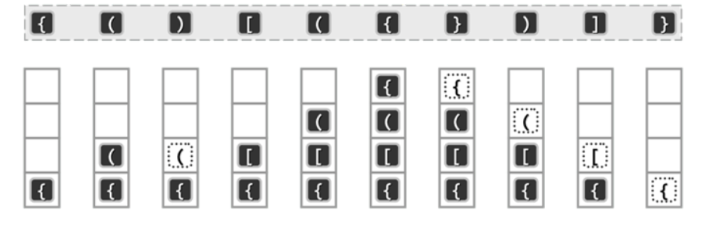

## 栈的定义


- **栈是操作受限的线性表**
- 栈顶 (top): 允许插入和删除的一端
- 栈底: 固定的一端
- 只允许在一端进行插入或删除操作的线性表
- 满足 **先进后出 (FILO)** 的特性

## 卡特兰数 (递归有关)

- n 个不同元素进栈，出栈元素不同排列的个数为:$$\frac{1}{n+1}C_{2n}^n$$

- 卡特兰数：1、1、2、5、14、42、132、429、1430

1. 卡特兰数还可以用于有 n 对括号的排列组合问题
   - eg:n = 3 时，有 5 种排列组合
      1. `((()))`
      2. `(()())`
      3. `(())()`
      4. `()(())`
      5. `()()()`
2. 给定 n 个互异的元素，卡特兰数可以计算出这些元素能够成多各种不同的二叉搜索树
3. 给定一个二叉树的 **前序遍历** 序列，可以构造出多少种不同的二叉树
4. 用于计算一个在 n$\times$n 的网格中从左下角到右上角的路径数

## 栈的基本操作

| 函数名              | 功能描述                              |
| ---------------- | --------------------------------- |
| InitStack(&S)    | **初始化栈**,构造一个空栈 S，分配内存空间          |
| DestroyStack(&S) | **销毁栈**,销毁并释放栈 S 所占用的内存空间         |
| Push(&S, x)      | **进栈**,若栈 S 未满，则将 x 加入使之成为新栈顶     |
| Pop(&S, &x)      | **出栈**,若栈 S 非空，则弹出栈顶元素，并用 x 返回    |
| GetTop(S, &x)    | **读栈顶元素**，若栈 S 非空，则用 x 返回栈顶元素     |
| StackEmpty(S)    | **判空**,若 S 为空，则返回 true，否则返回 false |

## 顺序栈 (顺序存储)


### 进栈操作

- `top = -1` :`S.data[++S.top] = x`
- `top = 0`:`S.data[top] = x`, `top++`
  - 简写为:`S.data[top++] = x`

### 出栈操作

- `top = -1` :`x = S.data[S.top--]`
- `top = 0`:`x = S.data[top]`, `top--`
  - 简写为:`x = S.data[--top]`

### 获取栈顶元素

- `top = -1` :`x = S.data[S.top]`
- `top = 0`:`x = S.data[top-1]`

### 判空

- `top = -1` :`S.top == -1`
- `top = 0`:`top == 0`

### 判满

- `top = -1` :`S.top == MaxSize - 1`
- `top = 0`:`top == MaxSize`

## 共享栈


### 定义

- **双栈共享空间**：利用栈底位置相对不变的特性，可以让两个顺序栈共享一个一维数组空间
- 将两个栈的栈底分别设置在共享空间的两端，两个栈顶向共享空间的中间延伸

### 特点

1. 当 $top_0 = -1$ 时，表示 0 号栈为空
2. 当 $top_1 = Maxsize$ 时，表示 1 号栈为空
3. 当 $top_1 - top_0 = 1$ 时，表示两个栈共同占满了整个存储空间，即栈满
4. 对于 0 号栈的入栈操作，应将 $top_0$ 向右移动一位，然后在新位置上存储数据
5. 对于 1 号栈的入栈操作，应将 $top_1$ 向左移动一位，然后在新位置上存储数据

### 目的

- 更有效地利用存储空间
- 两个栈的空间相互调节，只有在整个存储空间都被占满时才发生上溢

## 链表栈 (链式存储)


```cpp
template <typename T> struct Node {
    T data;     // 节点中的数据
    Node* next; // 指向下一个节点的指针
    // 构造函数，用于初始化节点
    Node(T val = T(), Node* nxt = nullptr)
        : data(val)
        , next(nxt) {}
};
```

```cpp
template <typename T> class Stack {
private:
    Node<T>* top; // 栈顶元素
public:
    // 初始化栈
    // 时间复杂度:O(1)
    Stack()
        : top(nullptr) {}
}
```

```cpp
// 销毁栈
// 时间复杂度:O(n)
void DestroyStack() {
    Node<T>* current = top;
    while (current) {
        Node<T>* next = current->next;
        delete current;
        current = next;
    }
    top = nullptr;
}
```

```cpp
// 进栈
// 时间复杂度:O(1)
void Push(T x) { top = new Node<T>(x, top); }

// 出栈
// 时间复杂度:O(1)
T Pop() {
    if (top == nullptr) {
        throw out_of_range("Stack is empty");
    }
    Node<T>* toDelete = top;
    T data = toDelete->data;
    top = top->next;
    delete toDelete;
    return data;
}
```

```cpp
// 读栈顶元素
// 时间复杂度:O(1)
T GetTop() {
    if (top == nullptr) {
        throw out_of_range("Stack is empty");
    }
    return top->data;
}
```

```cpp
// 判断栈是否为空
// 时间复杂度:O(1)
bool StackEmpty() { return top == nullptr; }
```

## 顺序栈和链表栈的比较

栈的实现可以通过两种主要的方式：顺序实现（使用数组）和链式实现（使用链表）。每种实现方式都有其优缺点，并且适用于不同的使用场景。下面我们将详细比较这两种实现方式：

### 顺序栈（基于数组）

**优点：**

  1. **随机访问性能优秀**：由于数据连续存储，顺序栈可以快速访问到任何一个位置的元素
  2. **空间效率**：在已知最大容量的情况下，使用数组实现的栈不需要额外的空间来存储指针
  3. **实现简单**：使用数组实现栈的代码通常更简单直接

**缺点：**

  1. **固定大小**：数组的大小通常在栈初始化时固定，这可能导致栈溢出或者空间浪费
  2. **扩容困难**：如果栈满了需要扩容，这涉及到创建一个更大的数组并复制旧数据，这是一个时间和空间成本较高的操作

### 链式栈（基于链表）

**优点：**

  1. **动态扩容**：链表实现的栈可以动态地增加和减少存储空间，无需在栈创建时确定大小
  2. **无需扩容操作**：链表结构不需要进行扩容操作，因为元素不是连续存储的，每次入栈都是分配一个节点的空间
  3. **更灵活的内存使用**：链式栈可以更好地利用分散的系统内存，适用于内存使用非常严格的情况

**缺点：**

  1. **空间开销较大**：每个元素都需要额外存储指针信息，这导致链式栈的内存使用效率低于顺序栈
  2. **性能开销**：链表的非连续存储可能导致较差的缓存性能，同时，频繁的内存分配和回收也可能引起性能问题

## 栈的应用

### 括号匹配

使用栈来解决这个问题的基本思路是：

  1. 遍历字符串中的每个字符
  2. 对于每个开放括号（`(`、`[`、`{`），将其推入栈中
  3. 对于每个闭合括号（`)`、`]`、`}`），检查栈顶的元素：
     - 如果栈为空，说明没有对应的开放括号，因此字符串无效
     - 如果栈顶的括号与当前闭合括号匹配，从栈中弹出
     - 如果不匹配，说明括号顺序错误，字符串无效
  4. 遍历结束后，如果栈为空，说明所有开放括号都找到了匹配的闭合括号，字符串有效。如果栈不为空，还有未匹配的开放括号，字符串无效

- 实例

  

### 表达式求值

- **中缀表达式** 运算符在两个操作数中间，例如：`a + b - c * d`
- **后缀表达式** (逆波兰表达式) 运算符在两个操作数后面，例如：`ab + cd * -`
- **前缀表达式** (波兰表达式) 运算符在两个操作数前面，例如：`- + ab * cd`
- 中缀改后缀 -- **结果可唯一确认**

#### 用栈实现 **前缀表达式** 的计算

1. **从右往左**扫描下一个元素，直到处理完所有元素
2. 若扫描到**操作数**则压入栈，并回到步骤 1；
3. 若扫描到**运算符**，则弹出两个栈顶元素，执行相应运算，运算结果压回栈顶，回到步骤 1

> [! ] 步骤 3 中注意：**先出栈的是 " 左操作数 "**，减法、除法要留意【前缀左优先】

#### 中缀改前缀


1. 确定中缀表达式中各个运算符的运算顺序
2. 选择下一个运算符，按照（**运算符 左操作数 右操作数**）的方式组合成一个新的操作数
3. 如果还有运算符没被处理，就继续步骤 2

   > [! ]  " 右优先 " 原则：只要右边的运算符能先计算，就优先算右边的

#### 前缀表达式手算

- **从右往左扫描表达式**：

  - 开始从表达式的最右侧向左逐个扫描元素
- **操作数处理**：

  - 每当扫描到一个**操作数**，将其压入栈中，继续扫描下一个元素
- **运算符处理**：

  - 如果扫描到的是**运算符**，则从栈顶弹出两个操作数：
    - **先弹出的是左操作数**
    - **后弹出的是右操作数**
  - 对弹出的两个操作数执行相应的运算
  - 将运算结果压回栈顶
- **重复步骤**：

  - 重复以上步骤，直到处理完所有元素
  - 最终栈中的唯一一个元素即为表达式的计算结果

#### 中缀表达式【机算】

1. 初始化两个栈：**操作数栈**和**运算符栈**
2. **从左到右扫描表达式**：

- **遇到操作数**：将操作数直接压入**操作数栈**
- **遇到运算符**：根据优先级进行处理：
- **如果运算符栈为空**，或当前运算符的优先级高于栈顶运算符，则将当前运算符压入运算符栈
- **如果当前运算符的优先级低于或等于栈顶运算符**，则从运算符栈弹出栈顶运算符，从操作数栈弹出两个操作数进行运算，计算结果压回操作数栈。然后将当前运算符压入运算符栈
- **遇到左括号 `(`**：将左括号压入运算符栈
- **遇到右括号 `)`**：依次从运算符栈弹出运算符进行运算，直到遇到左括号为止，最后丢弃左括号

- **重复步骤 2**，直到表达式扫描完毕

- **运算符栈清空**：当表达式处理完毕时，如果运算符栈中仍有运算符，则依次从运算符栈弹出运算符并执行运算，直到栈空为止

#### 用栈实现中缀表达式的计算

1. 初始化两个栈：**操作数栈**和**运算符栈**
2. **从左到右扫描中缀表达式**：

      - **操作数**：如果扫描到的是操作数，则将其压入**操作数栈**
      - **运算符**：如果扫描到的是运算符，则按如下规则处理：
        - 如果运算符栈为空，或当前运算符的优先级高于栈顶运算符，则将当前运算符压入**运算符栈**
        - 如果当前运算符的优先级低于或等于栈顶运算符，则从运算符栈中弹出栈顶运算符，并从**操作数栈**中弹出两个操作数，进行运算，将结果压回**操作数栈**。然后将当前运算符压入**运算符栈**
      - **遇到左括号**：

      - 将左括号 `(` 直接压入**运算符栈**，用于标记子表达式的开始
      - **遇到右括号**：

      - 右括号 `)` 表示当前子表达式结束，开始计算括号内的表达式。弹出运算符栈顶的运算符，并从操作数栈中弹出两个操作数进行运算，直到遇到左括号为止

3. **处理完表达式**：

    - 当整个表达式扫描完毕后，如果运算符栈中还有运算符，则依次弹出栈顶运算符进行计算，直到运算符栈为空

| 操作<br/>数栈                                                              | 操作<br/>符栈                                                       |                                  表达式                                   |
| ---------------------------------------------------------------------- | --------------------------------------------------------------- | :--------------------------------------------------------------------: |
| $a$                                                                    |                                                                 |          $\ \boxed{a}\  + b * c * d + (e - f) * (g * h + i)$           |
| $a$                                                                    | $\textcolor{blue}{+}$                                           |          $a + \ \boxed{b}\  * c * d + (e - f) * (g * h + i)$           |
| $a\ b$                                                                 | $\textcolor{blue}{+}$                                           |         $a + b\ \ \boxed{*}\ \ c * d + (e - f) * (g * h + i)$          |
| $a\ b$                                                                 | $\textcolor{blue}{+}\ \textcolor{blue}{*}$                      |          $a + b * \ \boxed{c}\ \ * d + (e - f) * (g * h + i)$          |
| $a\ b\ c$                                                              | $\textcolor{blue}{+}\ \textcolor{blue}{*}$                      |         $a + b * c\ \ \boxed{*}\ \ d + (e - f) * (g * h + i)$          |
| $a\ b\ c\ d$                                                           | $\textcolor{blue}{+}\ \textcolor{blue}{*}\ \textcolor{blue}{*}$ |                $a + b * c * d + (e - f) * (g * h + i)$                 |
| $a\ b\ \textcolor{red}{(c\ d)}\ \textcolor{green}{(c*d)}$              | $\textcolor{blue}{+}\ \textcolor{blue}{*}$                      | $a + b * \ \boxed{\textcolor{green}\ {c * d}} + (e - f) * (g * h + i)$ |
| $a\ \textcolor{red}{(b\ c*d)}\ \textcolor{green}{(b*c*d)}$             | $\textcolor{blue}{+}$                                           | $\ \boxed{\textcolor{green}\ {a + b * c * d}} + (e - f) * (g * h + i)$ |
| $\textcolor{red}{(a+b*c*d)}$                                           | $\textcolor{blue}{+}$                                           | $\ \boxed{\textcolor{green}\ {a + b * c * d}} + (e - f) * (g * h + i)$ |
| $a+b*c*d\ e$                                                           | $\textcolor{blue}{+}$                                           |           $a + b * c * d + \ \boxed{e}\  - f * (g * h + i)$            |
| $a+b*c*d\ \textcolor{red}{(e\ f)}\ \textcolor{green}{(e-f)}$           | $\textcolor{blue}{+}$                                           |  $a + b * c * d + \ \boxed{\textcolor{green}\ {e - f}} * (g * h + i)$  |
| $a+b*c*d-(e-f)\ g$                                                     | $\textcolor{blue}{+}$                                           |            $a + b * c * d + e - f * \ \boxed{g}\ \ * h + i$            |
| $a+b*c*d-(e-f)\ g\ h$                                                  | $\textcolor{blue}{+}$                                           |    $a + b * c * d + e - f * \ \boxed{\textcolor{blue}\ {*}}\ h + i$    |
| $a+b*c*d-(e-f)\ \textcolor{red}{(g\ h)}\ \textcolor{green}{(g*h)}$     | $\textcolor{blue}{+}$                                           |   $a + b * c * d + e - f * \ \boxed{\textcolor{green}\ {g * h}} + i$   |
| $a+b*c*d-(e-f)\ g*h\ i$                                                | $\textcolor{blue}{+}$                                           |             $a + b * c * d + e - f * g * h + \ \boxed{i}$              |
| $a+b*c*d-(e-f)\ g*h\ \textcolor{red}{(i)}\ \textcolor{green}{(g*h+i)}$ | $\textcolor{blue}{+}$                                           |   $a + b * c * d + e - f * g * h + \ \boxed{\textcolor{green}\ {i}}$   |
| $a+b*c*d\ \textcolor{red}{((e-f)*g*h+i)}$                              | $\textcolor{blue}{+}$                                           |   $a + b * c * d + \ \boxed{\textcolor{green}\ {e - f * g * h + i}}$   |
| $\textcolor{red}{((a+b*c*d)+((e-f)*g*h+i))}$                           |                                                                 |   $\ \boxed{\textcolor{green}\ {a + b * c * d + e - f * g * h + i}}$   |

- $\textcolor{blue}{*}$: 表示操作符被推入栈中
- $\textcolor{red}{()}$: 表示操作数从栈中弹出用于运算
- $\textcolor{green}{()}$: 表示运算结果被推回栈中

#### 用栈实现后缀表达式的计算

- 用栈实现 **后缀表达式** 的计算
  - 从左往右扫描下一个元素，直到处理完所有元素
  - 若扫描到操作数则压入栈，并回到 ①；否则执行 ③
  - 若扫描到运算符，则弹出两个栈顶元素，执行相应运算，运算结果压回栈顶，回到 ①
- 注: 步骤 3 中注意:**先出栈的是 " 右操作数 " 减法、除法要留意**
- 若表达式合法，则最后栈中只会留下一个元素，该元素就是最终结果

#### 用栈实现中缀表达式转后缀表达式

初始化一个栈，用于保存暂时还不能确定运算顺序的运算符

从左到右处理各个元素，直到末尾。可能遇到三种情况：

1. 遇到 **操作数**，直接加入后缀表达式
2. 遇到 **界限符**：遇到 "(" 直接入栈；遇到 ")" 则依次弹出栈内运算符并加入后缀表达式，直到弹出 "(" 为止。注意："(" 不加入后缀表达式
3. 遇到 **运算符**，依次弹出栈中优先级高于或等于当前运算符的所有运算符，并加入后缀表达式。若碰到 "(" 或栈空则停止。之后再把当前运算符入栈

按上述方法处理完所有字符后，将栈中剩余运算符依次弹出，并加入后缀表达式

-eg：给定的中缀表达式：$A + B - C * D / E + F$

| 当前字符 | 后缀表达式         | 运算符栈                                           | 注释                          |
| ---- | ------------- | ---------------------------------------------- | --------------------------- |
| $A$  | $A$           |                                                | 操作数，直接加入后缀表达式               |
| $+$  | $A$           | $\textcolor{blue}{+}$                          | 运算符，压入栈                     |
| $B$  | $AB$          | $+$                                            | 操作数，直接加入后缀表达式               |
| $-$ | $AB+$         | $\textcolor{red}{(+)}\ \textcolor{blue}{-}$    | 运算符 $+$ 出栈并加入后缀表达式，$-$ 压入栈 |
| $C$  | $AB+C$        | $-$                                           | 操作数，直接加入后缀表达式               |
| $*$  | $AB+C$        | $\textcolor{blue}{-*}$                         | 运算符，压入栈                     |
| $D$  | $AB+CD$       | $-*$                                           | 操作数，直接加入后缀表达式               |
| $/$  | $AB+CD*$      | $\textcolor{red}{(*\ -)}\ \textcolor{blue}{/}$ | 运算符 $*$ 出栈并加入后缀表达式，$/$ 压入栈  |
| $E$  | $AB+CD*E$     | $-/$                                           | 操作数，直接加入后缀表达式               |
| $+$  | $AB+CD*E/-$  | $\textcolor{red}{(/-)}\ \textcolor{blue}{+}$   | 运算符 $/$ 出栈并加入后缀表达式，$+$ 压入栈  |
| $F$  | $AB+CD*E/-F$  | $+$                                            | 操作数，直接加入后缀表达式               |
|      | $AB+CD*E/-F+$ | $\textcolor{red}{(+)}$                         | 将栈中剩余运算符依次弹出并加入后缀表达式        |

最终后缀表达式：$AB+CD*E/-F+$

- 用栈计算后缀表达式

后缀表达式：$AB+CD*E/-F+$

| 操作数栈 | 表达式 |
|--|:--:|
| $A$ | $\ \boxed{A}\  B+CD*E/-F+$ |
| $A\ B$ | $A \ \boxed{B}\ +CD*E/-F+$ |
| $\textcolor{red}{(A\ B)}\ \textcolor{green}{(A+B)}$ | $A\ B \ \boxed{+}\ CD*E/-F+$ |
| $A+B\ C$ | $A+B \ \boxed{C}\ D*E/-F+$ |
| $A+B\ C\ D$ | $A+B\ C \ \boxed{D}\ *E/-F+$ |
| $\textcolor{red}{(C\ D)}\ \textcolor{green}{(C*D)}$ | $A+B\ C\ D \ \boxed{*}\ E/-F+$ |
| $A+B\ C*D\ E$ | $A+B\ C*D \ \boxed{E}\ /-F+$ |
| $\textcolor{red}{(C*D\ E)}\ \textcolor{green}{(C*D/E)}$ | $A+B\ C*D\ E \ \boxed{/}\ -F+$ |
| $\textcolor{red}{(A+B\ C*D/E)}\ \textcolor{green}{(A+B-C*D/E)}$ | $A+B\ C*D/E\ -F+$ |
| $A+B-C*D/E\ F$ | $A+B-C*D/E\ \ \boxed{F}\ +$ |
| $\textcolor{red}{(A+B-C*D/E\ F)}\ \textcolor{green}{(A+B-C*D/E+F)}$ | $A+B-C*D/E\ F \ \boxed{+}$ |
| $\textcolor{red}{(A+B-C*D/E+F)}$ | $A+B-C*D/E+F$ |

最终计算结果：$A + B - C * D / E + F$

#### 中缀转后缀的手算方法

  1. 确定中缀表达式中 **各个运算符的运算顺序**
  2. 选择下一个运算符，按照「左操作数 右操作数 运算符」的方式组合成一个新的操作数
  3. 如果还有运算符没被处理，就继续②

> 运算顺序不唯一，因此对应的后缀表达式也不唯一

[中缀表达式转后缀表达式](https://zq99299.github.io/dsalg-tutorial/dsalg-java-hsp/05/05.html)

### 递归


- 函数调用时，需要用一个栈存储:(最后被调用的函数最先执行结束 (LIFO))
  - **调用返回地址**：当函数调用结束时，程序需要返回到调用者的地址
  - **实参**：调用时传入的参数值
  - **局部变量**：函数内部定义的局部变量
- 递归调用时，函数调用栈可称为 " 递归工作栈 " :
  - 每进入一层递归，就将递归调用所需信息压入栈顶
  - 每退出一层递归，就从栈顶弹出相应信息

#### 递归的缺点

- **栈溢出风险**：递归的调用次数过多时会导致栈溢出，因为每次递归调用都会消耗一定的栈空间。如果递归层次过深，可能超过栈的容量，导致程序崩溃
- **效率低**：递归调用可能产生大量重复计算。例如，递归求解斐波那契数列时，存在大量重复的子问题计算

#### 递归的改进方法

1. **使用迭代代替递归**：通过循环结构消除递归，尤其是对于尾递归函数，这种转换相对简单

    - **示例**：将递归的阶乘计算转换为迭代：
        - 递归：`fact(n) = n * fact(n-1)`；
        - 迭代：`fact(n) = n * (n-1) * … * 1`
2. **引入栈实现非递归算法**：递归调用的本质是利用系统栈存储每次调用的上下文信息，因此可以通过**显式栈**模拟递归过程，避免系统栈溢出问题

3. **记忆化递归**（Memoization）：通过缓存子问题的计算结果，避免重复计算。例如，在斐波那契数列递归求解中，记录已计算的结果，从而避免冗余计算
