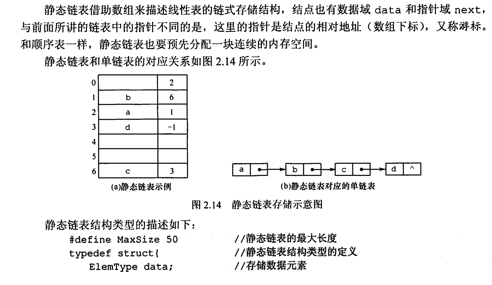

## 线性表的基本概念

### 线性表的定义

- 线性表是具有 **相同数据类型** 的 $n \ (n \geq 0)$ 个数据元素的 **有限序列**。
  - $n$ 是线性表的 **表长**，当 $n = 0$ 时线性表为空表。
  - **表头**：线性表的第一个元素，记为 $a_1$。
  - **表尾**：线性表的最后一个元素，记为 $a_n$。
  - **前驱**、**后继**：
    - **前驱**：某元素的前一个元素。
    - **后继**：某元素的后一个元素。例如，在序列 \{1, 2, 3\} 中，2 的前驱是 1，后继是 3。
  - **元素的位置**：元素在线性表中的序号，从 1 开始计数。

### 线性表的特点

- 表中元素的 **个数有限**。
- 表中元素具有 **逻辑上的顺序性**，即表中元素之间存在严格的先后次序。
- 表中每个元素都是独立的数据项。
- 表中元素的 **数据类型相同**，这意味着每个元素占有相同大小的存储空间。
- 表中元素具有 **抽象性**，即仅讨论元素之间的逻辑关系，而 **不考虑元素的具体内容**。例如，可以用 C 语言中的 `struct` 来创建自定义的数据类型。

### 线性表的分类

线性表是一种 **逻辑结构**，表示元素之间的一对一相邻关系。在实际编程实现中，线性表的存储方式可以分为两种主要形式：

1. **顺序存储结构**（顺序表）：
   - 将线性表的元素存放在连续的存储空间中，常用数组来实现。
   - 特点：可以快速访问任意位置的元素，但插入和删除操作效率较低。

2. **链式存储结构**（链表）：
   - 用指针表示元素之间的关系，不要求元素在存储空间中是连续的。
   - 特点：插入和删除操作效率较高，但查找效率较低。

   链式结构包括以下几种形式：
   - **单链表**：每个节点只有一个指向下一个节点的指针。
   - **双链表**：每个节点有两个指针，分别指向前一个和后一个节点。
   - **循环链表**：链表的尾节点指向表头，使链表形成一个环状结构。
   - **静态链表**：使用数组模拟链表，通过数组下标来表示指针。

### 线性表的实现

| 函数名 | 功能描述 |
| --- | --- |
| InitList(&L) | **初始化表**: 构造一个空的线性表 |
| Length(L) | **求表长**: 返回线性表 L 的长度，即 L 中数据元素的个数 |
| LocateElem(L, e) | **按值查找元素**: 在表 L 中查找具有给定关键字值的元素 |
| GetElem(L, i) | **按位查找元素**: 获取表中第 i 个位置的元素的值 |
| ListInsert(&L, i, &e) | **插入操作**: 在表中第 i 个位置插入指定元素 e |
| ListDelete(&L, i, &e) | **删除操作**: 删除表中第 i 个位置的元素，并用 e 返回删除元素的值 |
| PrintList(L) | **输出操作**: 按前后顺序输出线性表的所有元素 |
| Empty(L) | **判空操作**: 若线性表为空，返回 true，否则返回 false |
| Destroy(&L) | **销毁操作**: 消耗线性表，并释放空间 |

## 顺序表

### 顺序表定义

- 把逻辑上相邻的数据元素存储在物理上 **相邻的存储单元** 中的存储结构
  - 简言之: 逻辑上相邻，物理上也相邻 (一般提顺序表 强调的是存储结构)

- 特点: 以物理位置相邻表示逻辑关系，占用一片连续的存储空间
- *优点*
  - **随机访问**，即通过首地址和元素序号可在时间 O(1) 内找到指定元素 这是一种特殊的散列存储
  - **存储密度大**
- *缺点*
  - 插入、删除元素需要移动大量元素、浪费存储空间、数据元素个数不能自由扩充

### 代码实现

#### 静态分配

```cpp
class StaticSeqList {
private:
    static const int MaxSize = 100;
    int data[MaxSize];
    int length;

public:
    StaticSeqList() : length(0) {}
}
```

#### 动态分配

```cpp
class DynamicSeqList {
private:
    int* data;
    int capacity;
    int length;

    void resize(int newCapacity) {
        int* newData = new int[newCapacity];
        for (int i = 0; i < length; i++) {
            newData[i] = data[i];
        }
        delete[] data;
        data = newData;
        capacity = newCapacity;
    }

public:
    DynamicSeqList(int cap = 10) : capacity(cap), length(0) {
        data = new int[capacity];
    }

    ~DynamicSeqList() {
        delete[] data;
    }
}

bool insert(int index, int element) {
    if (index < 1|| index > length + 1) return false;
    if (length == capacity) resize(2 * capacity);  // 动态扩容
    for (int i = length; i >= index; i--) {
        data[i] = data[i - 1];
    }
    data[index - 1] = element;
    length++;
    return true;
}
```

## 链表

### 链表的静态分配和动态分配

#### 静态分配

#### 动态分配

### 单链表


```cpp
// 单链表插入
if (current == nullptr) return false; // 如果当前节点为空，返回 false
if (currrnt = first) { // 如果当前节点是头结点
    newNode->link = first; // 将 newNode 的 link 指向 first
    first = newNode; // 将 first 指向 newNode
} else {
    newNode->link = current->link; // 将 newNode 的 link 指向 current 的 link
    current->link = newNode; // 将 current 的 link 指向 newNode
}
```


### 双链表

### 循环链表


#### 循环单链表


```cpp
// 判断当前结点是否为链尾
// 如果 current 的 link 指向 first，则表示 current 是链尾
current->link == first;
```


```cpp
// 将 newNode 的 link 指向 rear 的下一个结点
newNode->link = rear->link;

// 将 rear 的 link 指向 newNode
rear->link = newNode;
```


#### 循环双链表


前驱插入：

```cpp
// 将 newNode 的左链接指向 current 的左链接
newNode->lLink = current->lLink;

// 将 current 的左链接指向 newNode
current->lLink = newNode;

// 将 newNode 的右链接的左链接指向 newNode
newNode->rLink->lLink = newNode;

// 将 newNode 的右链接指向 current
newNode->rLink = current;
```

后继插入:

```cpp
// 将 newNode 的右链接指向 current 的右链接
newNode->rLink = current->rLink;

// 将 current 的右链接指向 newNode
current->rLink = newNode;

// 将 newNode 的左链接的右链接指向 newNode
newNode->lLink->rLink = newNode;

// 将 newNode 的左链接指向 current
newNode->lLink = current;
```


```cpp
// 删除节点
if (current == nullptr) return false; // 如果当前节点为空，返回 false

// 将当前节点的左节点的右链接指向当前节点的右节点
current->lLink->rLink = current->rLink;

// 将当前节点的右节点的左链接指向当前节点的左节点
current->rLink->lLink = current->lLink;

// 删除当前节点
delete current;
```

### 静态链表 (用数组模拟链表)




- 概念
  - 静态链表借助数组来描述线性表的链式存储结构，
    - 结点也有数据域 (data) 和指针域 (next)
    - 其指针是结点的相对地址 (数组下标，又称游标)
- 特点
  - 需要预先分配一块连续内存空间 (容量固定不变)、插入删除无需移动元素、不能随机存取
- 优点
  - 插入删除操作无需移动元素
- 缺点
  - 不能随机存取
  - 容量固定不变
- 适用场景
  - 不支持指针的低级语言
  - 数据元素数量固定不变的场景 (如操作系统的文件分配表 FAT)
- 与普通链表的区别
  - 静态链表指针域的指针指向的是结点的相对地址 (数据下标)，又称游标
  - 静态链表和顺序链表一样，要预先分配一块连续的内存空间
  - 静态链表一般用 next =-1 表示结束

## 不同链表的时间效率比较

| 数据结构               | 查找表头结点             | 查找表尾结点                      | 查找结点 *P 的前驱结点                 |
| ------------------ | ------------------ | --------------------------- | ----------------------------- |
| 带头结点的单链表 L         | L->next，时间复杂度 O(1) | 从 L->next 依次向后遍历，时间复杂度 O(n) | 通过 p->next 无法找到其前驱（双指针可以）     |
| 带头结点仅设头指针 L 的循环单链表 | L->next，时间复杂度 O(1) | 从 L->next 依次向后遍历，时间复杂度 O(n) | 通过 p->next 可以找到其前驱，时间复杂度 O(n) |
| 带头结点仅设尾指针 R 的循环单链表 | R->next，时间复杂度 O(1) | R，时间复杂度 O(1)                | 通过 p->next 可以找到其前驱，时间复杂度 O(n) |
| 带头结点的双向循环链表 L      | L->next，时间复杂度 O(1) | L->prior，时间复杂度 O(1)         | p->prior，时间复杂度 O(1)           |

## 顺序表和链表的比较

| 比较项目     | 顺序表                                        | 链表                                   |
|-------------|----------------------------------------------|---------------------------------------|
| 存储分配方式 | 一次性分配                                    | 多次分配                               |
| 存储密度     | 等于 1                                      | 小于 1                                 |
| 存取方式     | 随机存取，按位置访问元素时间复杂度 O(1)         | 顺序存取，按位置访问元素复杂度为 O(n)    |
| 插入删除     | 平均移动约表中一半元素，时间复杂度 O(n)         | 确定位置后时间复杂度 O(1)，无需移动元素     |
| 适用情况     | 表长变化不大，且能事先确定变化范围，较少插入删除操作，常按位置访问 | 长度变化较大，频繁进行插入或删除操作       |

## 链表是否需要头指针

- 设置指针的目的是为了找到链表中每一个节点的位置。具体情况如下：
  - **单链表**：对于简单的单链表，必须设置头指针，以指向链表的头节点。这样，计算机可以沿着头指针通过 `next` 逐步找到每个节点的位置。如果仅有尾指针而没有头指针，则无法向前找到所有节点，因此单链表必须有头指针。
  - **循环链表**：循环链表中，只需要设置一个指针即可表示整个链表结构。这个指针可以是头指针、尾指针，甚至中间某个节点的指针，因为循环链表可以从任何位置遍历到所有节点。

## 链表总结

|              | 优点                                | 缺点                                           |
|--------------|-----------------------------------|----------------------------------------------|
| 单链表       | 插入删除方便                         | 存储密度小，无法随机存取                        |
| 双链表       | 相比单链表更方便访问前驱结点             | 存储密度更小，无法随机存取                       |
| 循环链表     | 可以循环访问                         | 没有明确的链表尾，单次遍历循环时需小心设置结束条件    |
| 静态链表     | 可以在没有指针的语言中表示链表，同时有链表的优点 | 存储在连续的地址但是失去了随机存储的特性，需手动控制内存分配和回收 |
