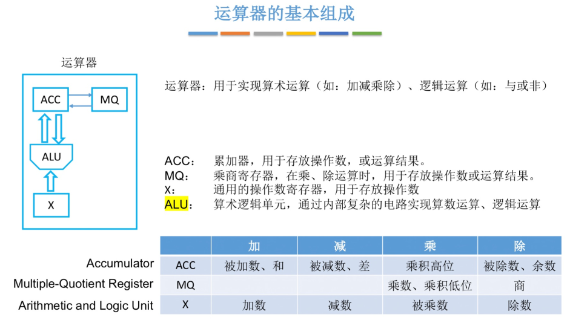
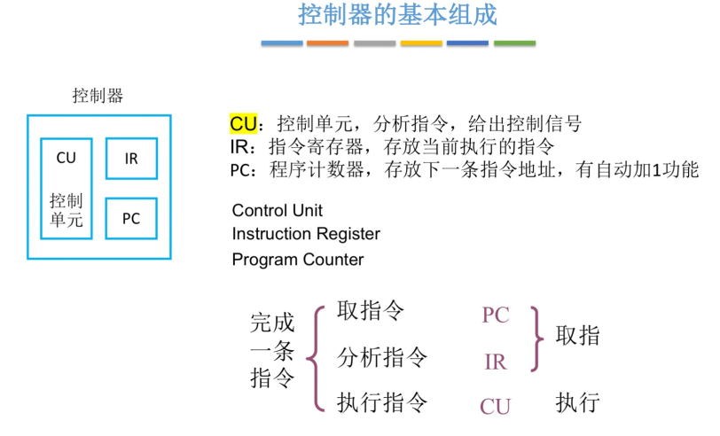

## 计算机的发展历程

- 第一代计算机 *电子管*时代 (1946-1957)
- 第二代计算机 *晶体管*时代 (1958-1964)
- 第三代计算机中小规模*集成电路*时代 (1965-1971)
- 第四代计算机 *超大规模集成电路*时代 (1972- 至今)

## 计算机的层次结构

### 指令集体系结构 `(ISA)`

- 机器指令是指示计算机执行某种操作的命令。一台计算机所有指令的集合构成该机的指令系统，也称指令集。指令系统是指令集体系结构 (ISA) 中最核心的部分
- ISA 完整定义了软件和硬件的接口，主要内容包括:
  - 指令格式，指令寻址方式，操作类型，每种操作对应的操作数的相应规定
  - 操作数的类型，操作数寻址方式，按大端方式或小端方式存放
  - 程序可访问的寄存器编号、个数和位数，存储空间的大小和编址方式
  - 指令执行过程的控制方式等，包括程序计数器、条件码的定义等

- 系列机的指令系统 `向后兼容`
- **向前兼容**：系统、软件或硬件在旧版本能够处理未来版本生成的数据或与未来的功能交互
- **向后兼容**：新版本支持旧版本的功能和数据

## 计算机系统的基本组成

- 计算机系统由 **硬件 和 软件** 两部分组成<a id="计算机软件和硬件的关系"> </a>
- 对于某一功能，若既能由硬件实现，又能有软件实现，则这一特点被称为 **软件与硬件在逻辑上的等价性**

## 计算机硬件的基本组成


### 冯诺依曼计算机的特点


- 采用 **存储程序** 工作方式
- 以 **运算器** 为中心：即输入/输出设备与存储器之间的数据传送通过 **运算器** 完成
- 计算机由 **运算器、控制器、存储器、输入设备与输出设备** 5 个基本组成部件
- 🌟🌟存储器不仅能存放数据，还能存放指令
- 计算机内部 以 **二进制形式表示和指令和数据**
  - 指令与数据在 *形式上* 没有任何区别
  - 但计算机能区分他们 (依据*指令周期的不同阶段* or 处理他们的部件【ALU、IR】)
- 每条指令由操作码和地址码两部分组成
  - 操作码指出操作类型
  - 地址码指出操作数的地址
- **指令在存储器中按顺序存放**
- **工作方式**：控制流驱动方式

### 冯诺依曼模型机


### 现代计算机的组成

- 现代计算机以 **存储器** 为中心
  - 冯诺依曼计算机以 **运算器** 为中心
- CPU = 运算器 + 控制器

### 运算器的基本组成



### 控制器的基本组成



## 计算机软件的基本组成

### 系统软件

系统软件用于控制和管理计算机硬件资源，提供运行环境和平台，使应用软件能够高效运行。其主要功能包括：

- **资源管理**：管理计算机资源（如 CPU、内存、硬盘、输入输出设备等），确保硬件资源可以被合理、有效地使用
- **基础服务**：提供基础服务，如操作系统、编译器、驱动程序等，支持整个计算机系统的运行
- **用户与硬件交互**：作为用户与硬件交互的桥梁，确保系统的稳定性和高效性

系统软件在后台持续运行，支持计算机的整体操作，不需要用户直接干预。其设计目的是为应用软件提供一个稳定的运行环境，确保计算机能以最佳性能运行

> 常见的系统软件包括：

- **操作系统**：如 Windows、Linux、macOS
- **编译器**：如 GCC、Java 编译器
- **设备驱动程序**

### 应用软件

应用软件是为满足用户的特定需求而设计的，可以直接用于解决某些问题或提高工作效率。其主要功能包括：

- **提供功能或服务**：直接为用户提供某种功能或服务，如文字处理、图像处理、数据分析等
- **基于系统软件运行**：应用软件通常基于系统软件提供的功能运行，用户可以随时打开或关闭这些软件，完成特定的任务
- **面向用户需求**：根据用户的需求启动和运行，旨在解决用户的某个特定问题，提供功能性服务

> 常见的应用软件包括：

- **办公软件**：如 Microsoft Word、Excel
- **媒体播放软件**：如 VLC、Windows Media Player
- **图像处理软件**：如 Photoshop、GIMP

## 计算机系统的工作原理

### 采用 **存储程序** 工作方式

### 🌟从源程序到可执行文件

1. **预处理阶段**
   - 预处理器 (cpp) 将 `#` 开头的文件进行处理。输出 hello.i 文件
2. **编译阶段**
   - 编译器 (ccl) 对预处理的文件进行编译，生成汇编语言源程序 hello.s
3. **汇编阶段**
   - 汇编器 (as) 将 hello.s 文件翻译成机器语言指令，打包成可重定位目标文件的 hello.o
4. **链接阶段**
   - 链接器 (ld) 将多个可重定位目标文件和库函数合并成可执行文件，被保存在磁盘上


- 编译，汇编，解释程序，可统称为 " 翻译程序 "
  - 编译可以翻译高级语言和汇编语言
  - 汇编只能翻译汇编语言


- 机器语⾔是计算机唯⼀可以直接识别和执⾏的语⾔

#### 编译程序和解释程序【了解】

##### 什么是编译程序和解释程序

编译程序和解释程序是程序执行的两种不同执行方式

##### 编译程序和解释程序的区别

###### 编译程序

- **功能**: 把用高级语言书写的源程序翻译成与之等价的目标程序
- **编译过程**: 划分成词法分析、语法分析、语义分析、中间代码生成、代码优化和目标代码生成 6 个阶段
- **特点**: 目标程序可以独立于源程序运行
  - 编译程序是一个语言处理程序，它可以把高级语言程序翻译成某个机器的汇编语言程序或者是二进制代码程序，这个阶段叫做编译阶段
  - 编译和运行是分两个阶段进行的，也就是说程序必须要全部编译完成后，才能运行
  - 编译方式执行程序会把源代码翻译成二进制文件的目标代码

###### 解释程序

- **功能**: 直接执行源程序或源程序的内部形式（中间代码）
- **工作原理**: 在词法、语法和语义分析方面与编译程序的工作原理基本相同，但在运行用户程序时，它是直接执行源程序或源程序的内部形式（中间代码）
- **特点**: 解释程序并不生成目标程序，这是它和编译程序的主要区别
  - 解释程序的工作模式是一个个地获取、分析并且去执行源程序的语句，一旦第一个语句分析结束后，源程序就会开始运行并生成结果
  - 解释程序比较适合以交互方式进行工作的情况
  - 解释程序不会生成目标代码

### 总结

- 编译程序不参与用户程序的运行控制，而解释程序则参与

### 指令执行过程的描述

[指令执行过程的描述](./../%E5%9F%BA%E7%A1%80%E7%AC%94%E8%AE%B0/%E7%AC%AC%E5%9B%9B%E7%AB%A0/%E6%8C%87%E4%BB%A4%E7%B3%BB%E7%BB%9F.md#指令执行过程的描述)

## 计算机的性能指标

### 容量

#### 机器字长

  CPU 内部用于整数运算的数据通路的宽度= 运算器位数 (ALU 长度) = 通用寄存器宽度 = 计算机位数

> [!note] 一般来说 eg: 32 位计算机
> 字长 = 机器字长 = 地址总线宽度 (MAR) = 数据总线宽度 (MDR) = 通用寄存器宽度 = 32 位
> 与寄存器位数、寻址空间大小、浮点数运算处理的二进制位数无关

> [! ] 按 " 字 " 寻址这个字<font color="#e36c09">是机器字长</font>不是存储字长

| 字长类型   | 定义                                                                                                                                                                                    | 举例                                                                                                     |
| ------ | ------------------------------------------------------------------------------------------------------------------------------------------------------------------------------------- | ------------------------------------------------------------------------------------------------------ |
| 机器字长   | CPU 一次能处理的数据位数 <br/>通常等于寄存器和 ALU 的位数<br/>通常是存储字长的整数倍                                                                                                                                  | Windows 64 位/32 位中的 <br/> 64、32 指的就是机器字长                                                               |
| 存储字长   | 存储器中一个存储单元可以存储的位数 <br/>通常与 MDR 位数相等                                                                                                                                                   | 按字节编址的计算机，<br/>存储字长为 1 字节 (8 位)                                                                        |
| 指令字长   | 指令长度是指一条指令的二进制代码位数 <br/>通常与 IR 寄存器的位数相等 <br/>包括操作码的长度、地址码的长度和 <br/>地址码的个数。<br/>指令长度与机器字长没有固定的关系，<br/>可以小于、等于或大于机器字长。<br/><font color="#e36c09">但必须是字节的整数倍</font><br/>指令长度会影响取指令所需的时间。| 半字长 <br/>单字长 <br/>双字长指令                                                                                |
| MAR 位数 | 用于寻址，位数对应存储单元个数                                                                                                                                                                       | 逻辑空间 1KB，字节编址 <br/>位数为 10 位；<br/>( 1 字节 = 8 位)<br/>逻辑空间 1KB，字编址 <br/>位数为 8 位；<br/>( 1 字 = 32 位 = 4 字节) |
| MDR 位数 | 用于存储数据和指令                                                                                                                                                                             | 位数通常等于存储字长                                                                                             |

#### 主存容量

系统能支持的**最大容量** =$2^n \times$ 存储字长 (n 是指 MAR 的位数，以存储字编址)

存储器的**总容量** = 存储单元个数 * 存储字长 (单位:bit)= $\frac{存储单元个数 * 存储字长}{8}$ (单位:Byte)(注: 1 字节 = 1Byte = 8 bit)

### 速度

#### 吞吐量 (*throughput*)

- **定义**：指系统在单位时间内处理请求的数量。在某些场合也称为 **带宽**

#### CPU 时钟周期

- **定义**：机器内部主时钟脉冲信号的宽度（脉冲信号中相邻两个波峰或波谷所经历的时间）
- 数据从一个状态逻辑单元通过组合逻辑到达另一个状态逻辑单元所需的时间为一个时钟周期
- 在一个时钟周期内，控制单元（CU）发出一组控制信号，这些信号在该周期内保持不变
- **CPU 时钟周期是 CPU 工作的最小时间单位**

> [! ] 时钟周期不是时间

  ```plaintext
  时钟周期 < 机器周期 = CPU 周期 <= 指令周期（取等号当且仅当单周期 CPU）
  总线周期 < 存储周期 < 指令周期  
  ```

### ⭐️⭐️⭐️ CPU 性能参数

#### 主频 (机器内部主时钟的频率)

$$
\text{CPU 时钟周期频率 (主频) } f = \frac{1}{\text{CPU 时钟周期}} \quad \text{单位：Hz}
$$

| 时间单位 | 毫秒 $(ms)$ | 微秒 $(\mu s)$ | 纳秒 $(ns)$ |
| :--: | :-------: | :----------: | :-------: |
|  倍数  | $10^{-3}$ |  $10^{-6}$   | $10^{-9}$ |

| 频率单位 | 千赫 $(KHz)$ | 兆赫 $(MHz)$ | 吉赫 ($GHz)$ |
| :--: | :--------: | :--------: | :--------: |
|  倍数  |   $10^3$   |   $10^6$   |   $10^9$   |

> [!note] 主频为 m Hz【结合 CPI 理解】
>
> - → 1 秒该计算机的时钟周期是 m 个
> - → $\frac{1}{m}$ 是时钟周期的值

> [! ] 时钟频率的提高可能会对 CPU 的结构造成影响，从而使其他性能指标降低
> 因此，虽然时钟频率的提高会加快 CPU 执行程序的速度，但不能保证执行速度有同倍数的提高。指令条数少不代表执行时间少，时钟频率高也不说明执行速度快

**主频是时钟周期的倒数**，它是衡量机器速度的重要参数。
对于同一个型号的计算机，主频越高，完成指令的一个执行步骤所用的时间越短，执行指令的速度越快

> [!note] **[直观理解]** 主频表示 **每秒有多少个时钟周期**

#### 响应时间 (*response time*)

- **定义**：响应时间是从用户发送请求到系统给出结果的等待时间，又称 **执行时间** 或 **等待时间**。

#### CPU 执行时间 (CPU Time)

- **定义**: CPU 执行时间指在程序运行期间，CPU 实际用于执行指令的时间，不包含 I/O 等待时间及 CPU 执行其他任务的时间。

- 用户感知的是**响应时间**，但响应时间包括 CPU 执行时间和等待时间。

- CPU 执行时间进一步分为两部分：
  1. **用户 CPU 时间 (User CPU Time)**：执行用户程序代码的时间。
  2. **系统 CPU 时间 (System CPU Time)**：为执行用户程序所需的系统代码（如操作系统代码）运行的时间。

$$
\begin{align*}
\text{CPU 执行时间} &=  \text{CPU 时钟周期数} \times \text{时钟周期} = \frac{\text{CPU 时钟周期数}}{\text{主频}} \\
                      &=  \text{CPU 程序的执行指令数} \times \text{CPI} \times \text{时钟周期} \\
                      &= \text{CPU 程序的执行指令数} \times \frac{\text{CPI}}{\text{主频}} \\
\end{align*}

$$

#### CPI (Clock cycles Per Instruction) 执行一条指令所需的<font color="#e36c09">平均</font>时钟周期数

不同指令所需的时钟周期数可能不同，因此对于一个程序或一台机器来说，其 CPI 指该程序或该机器指令集中所有指令执行所需的 **平均时钟周期数**。

> [!note] 执行一条指令的时间 = $CPI \cdot T_{CPU}$【见 IPS 推导】

> [!note] 通过手段提高主频的频率 $f_{CPU}$ 提高 → CPU 的时钟周期变短，</br>但是一条指令需要的时钟周期数不变→CPI 不变

##### CPI 的计算

$$
\text{假定 } CPI_i \text{ 和 } C_i \text{ 分别为第 } i \text{ 类指令的 CPI 和指令条数}
$$

$$
\text{总时钟数} = \sum_{i = 1}^{n} CPI_i \times C_i
$$

$$
\text{CPU 时间} = \text{时钟周期} \times \sum_{i = 1}^{n} CPI_i \times C_i
$$

$$
\text{i 类指令在程序中的出现比例 } F_i = \frac{C_i}{\text{总指令条数}}
$$

$$
CPI = \sum_{i = 1}^{n} CPI_i \times F_i = \frac{\text{CPU 时间} \times \text{时钟频率}}{\text{指令条数}} = \frac{\text{总时钟数}}{\text{总指令条数}}
$$

#### IPC (Instructions Per Cycle) 每个时钟周期执行指令条数

$$
IPC = \frac{1}{CPI} = \frac{\text{总指令条数}}{\text{总时钟数}}
$$

#### IPS (Instructions Per Second) 每秒执行指令条数

$$
IPS = \frac{\text{指令总数}}{\text{执行时间}} = \frac{n}{T_{执行时间}} =  \frac{n}{n \cdot CPI \cdot T_{cpu}} = \frac{\text{主频}}{CPI}
$$

 →  1 秒内时钟周期数{主频} = 1 秒内指令数{IPC} * 每条指令所需时钟周期数{CPI}

#### MIPS (Million Instructions Per Second) 每秒执行多少百万条指令

> MIPS 反映的是机器执行定点指令的速度

$$
MIPS = \frac{\text{指令条数}}{\text{执行时间} \times 10^6} = \frac{\text{主频}}{CPI \times 10^6}
$$

- **选取一组指令组合**，使得到的平均 CPI 最小，由此得到的 MIPS 就是 **峰值 MIPS (Peak MIPS)**
- **MIPS 表示性能的局限性**:
  - 不同机器的指令集不同
  - 程序由不同的指令混合而成
  - 指令使用的频度会动态变化
  - 厂家给出的通常是峰值 MIPS

#### MFLOPS (Million Floating-point Operations Per Second) 每秒执行多少百万次浮点运算

MFLOPS 反映机器对浮点数的处理速度

- MFLOPS 不是用执行浮点数运算的指令条数来计算的，而是用执行浮点数运算的次数来计算的

- 周期小结

> [【浅析】CPU 中的指令周期、CPU 周期和时钟周期](https://zhuanlan.zhihu.com/p/90829922)

| 周期          | 解析                                                                                                                                   |
| ----------- | ------------------------------------------------------------------------------------------------------------------------------------ |
| 时钟</br>周期   | 又称震荡周期，是计算机工作的最小时间单位，由系统时钟的频率决定。|
| 机器</br>周期   | CPU 周期又称机器周期，它由多个时钟周期组成，一条指令执行过程被划分为若干阶段，每一阶段完成所需时间                                                                                  |
| CPU </br>周期 | 同机器周期                                                                                                                                |
| 中断</br>周期   | 两次中断的间隔                                                                                                                              |
| 指令</br>周期   | CPU 从取来一条指令到指令完成所需要的时间。通常等于若干个时钟周期。<br/>指令周期划分为四个阶段: 取址周期、间址周期、执行周期、中断周期。|
| 存取</br>周期   | 存取周期是从启动一次存储器操作 (如读取或写入) 到完成该操作所需的时间。<br/>存取周期包括存取时间 (访问存储器的时间) 和恢复时间 (存储器准备进行下一次操作的时间)<br/>是两次独立存储器操作之间的最小间隔。|
| 总线</br>周期   | 包括 (主设备) 申请分配、寻址 (找从设备)、传送数据、结束 (撤销) 四个阶段，<br/>若是总线上只有一个主设备 (例如 CPU)，则只有寻址、传送数据两个阶段了 <br/>也就是 一般指 CPU 通过总线和存储器或 I/O 接口进行一次数据传输所需要的时间 |

- 时钟周期 < 机器周期 = CPU 周期 ≤ 指令周期 (取等号当且仅当单周期 CPU)
- 总线周期 < 存储周期 < 指令周期
  - 总线周期较短，因为它只涉及数据的传输，而存储周期涉及存储器的读写操作，通常需要更多的时间。指令周期最复杂，因为它包含了取指、解码、执行、写回等多个阶段

#### FLOPS(Floating-point Operations Per Second) 每秒执行多少次浮点运算

# 考前摇一摇

| FLOPS  | Value            |
| ------ | ---------------- |
| MFLOPS | 百万 $10^6$     |
| GFLOPS | 十亿 $10^9$     |
| TFLOPS | 万亿 $10^{12}$  |
| PFLOPS | 千万亿 $10^{15}$|
| EFLOPS | 百京 $10^{18}$  |
| ZFLOPS | 十万京 $10^{21}$|

### 常用数量单位

#### 描述存储容量、文件大小 或 KMGT 大写时

| K        | M        | G        | T        |
| -------- | -------- | -------- | -------- |
| $2^{10}$ | $2^{20}$ | $2^{30}$ | $2^{40}$ |

#### 描述频率、速率 或 kmgt 小写时

| k      | m      | g      | t         |
| ------ | ------ | ------ | --------- |
| $10^3$ | $10^6$ | $10^9$ | $10^{12}$ |

### 系统整体性能指标【了解】

#### 静态测试

- **数据通路带宽**: 数据总线一次所能 **并行传送** 信息的位数
  - 各硬件部件通过数据总线传输数据
  - 如果带宽为 8bit，然后要传输的数据为 16bit，那么需要通过总线进行两次传输

- **吞吐量**: 系统在单位时间内处理请求的数量
  - 它取决于信息能多快地输入内存，CPU 能多快地取指令，数据能多快地从内存取出或存入，以及所得结果能多快地从内存送给一台外部设备。这些步骤中的每一步都关系到主存，因此，系统吞吐量主要取决于主存的存取周期

- **响应时间**: 从用户向计算机发送一个请求开始，到系统对该请求做出响应并获得所需结果的等待时间
  - 通常包括 CPU 时间 (运行一个程序所花费的时间) 与等待时间 (用于磁盘访问、存储器访问、I/O 操作、操作系统开销等时间)

#### 动态测试

- 基准程序: 基准程序是用来测量计算机处理速度的一种实用程序，以便于被测量的计算机性能可以与运行相同程序的其它计算机性能进行比较【其实就是跑分软件】

### 用基准程序进行性能评估

- 基准程序 (Benchmarks) 是专门用来进行性能评价的一组程序
- 一般采用执行时间的算术平均值和几何平均值来综合评价机器的性能
- 如果考虑每个程序的使用频度，用加权平均的方式，结果会更准确
- 执行时间的归一化值 = 参考机器上的执行时间/被测机器的执行时间
