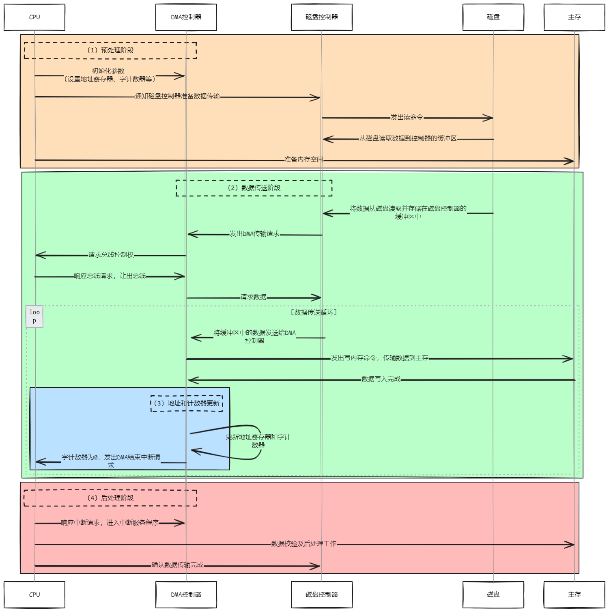

## I/O 设备

- 输入输出设备 (又称外部设备，简称外设) 是计算机系统与人或其他机器之间进行信息交换的装置
- **输入设备**的功能是把数据、命令、字符、图像、声音或电流、电压等信息，以计算机可以接收和识别的二进制代码形式输入到计算机中，供计算机进行处理
- **输出设备**的功能是把计算机处理的结果变成人最终可以识别的数字、文字、图形、图像或声音等信息，然后播放、打印或显示输出

## I/O 接口

> [! ] `I/O接口 ≠ I/O端口`

- I/O 接口又称 I/O 控制器 (I/O Controller)、设备控制器。
- 一般是**控制器 (Controller) 或者适配器 (Adapter)**。
- 是连接主机和外设之间的 " 桥梁 "，负责协调主机与外部设备之间的数据传输

### I/O 接口的作用

- **数据缓冲**：由于主存和 CPU 寄存器的存取速度非常快，而外设速度较低，所以在 I/O 接口中引入数据缓冲寄存器，以达到主机和外设工作速度的匹配。
- **地址译码和设备选择**：CPU 送来选择外设的地址码后，接口必须对地址进行译码以产生设备选择信息，使主机能和指定外设交换信息。
- **错误检测和状态检测**：在 I/O 接口中提供状态寄存器，以保存各种状态信息，供 CPU 查用。例如，设备是否完成打印或显示，是否已准备好输入数据，是否发生缺纸等错误情况。
- **控制和定时**：提供控制和定时逻辑，以接收从系统总线来的控制命令 (命令字) 和定时信号。I/O 接口需要协调主机和外设的操作顺序，控制数据通信过程。
- **数据格式转换**：提供数据格式转换部件，使外部接口的数据转换为主机所需格式，或反向转换。如从磁盘读出二进制位数据并进行串并转换。

### I/O 接口的结构和工作原理

> **如何确定要操作的设备？**

1. 让*地址线*处理指明要读/写的寄存器，也被用于指明具体的设备编号，分两次进行。
2. 每个设备对应一组寄存器，操作不同的寄存器就是在操作不同的设备。

### I/O 接口中的通信线

- **数据线传送**：读/写数据、状态信息、控制信息和中断类型号。
- **地址线传送**：要访问的 I/O 接口中的寄存器的地址。
- **控制线传送**：读/写控制信号（以确认读寄存器还是写寄存器）、中断请求和响应信号、仲裁信号和握手信号。

### I/O 接口的基本结构

1. **I/O 接口在主机侧通过 I/O 总线与内存、CPU 相连**。
2. **数据缓冲寄存器**：用于暂存与 CPU 或内存之间传送的数据信息。
3. **状态寄存器**：记录接口和设备的状态信息。
4. **控制寄存器**：保存 CPU 对外设的控制信息。状态寄存器和控制寄存器在传送方向上是相反的，在访问时间上也是错开的，因此可将它们合二为一。
   - 注意，数据缓冲寄存器和状态/控制寄存器都通过数据线与主机相连。

### 底层的 I/O 软件通过 I/O 接口来控制外设

- I/O 软件可以将控制命令送到控制寄存器来启动外设工作。
- 可以通过直接访问数据缓冲寄存器来进行数据的输入和输出。
- 这些访问操作是通过 I/O 指令来完成的。
- 这些 I/O 指令只能在操作系统内核的底层 I/O 软件中使用，它们是一种特权指令。

  

### I/O 接口分类

- **按数据传送方式**：
  - *并行接口*：一次传送一个字节或字的所有位。
  - *串行接口*：一位一位传送。

- **按主机控制方式**：
  - *程序查询接口*
  - *中断接口*
  - *DMA 接口*

- **按功能选择的灵活性**：
  - *可编程接口*：接口功能可通过程序改变。
  - *不可编程接口*：功能固定，不可通过程序改变。

### I/O 端口及其编址

- I/O 端口实际上就是 I/O 接口中的寄存器，主要有数据端口、状态端口和控制端口。
- 例如，数据缓冲寄存器就是数据端口，控制/状态寄存器就是控制/状态端口。

#### 统一编址【适用于设计简洁、对端口访问频繁的系统，RISC 架构常用】

- **概念**：将 I/O 端口和内存地址映射到相同的地址空间，用 **内存指令**（如 `LOAD`、`STORE`）直接访问 I/O 设备。这种方式称为 **存储器映射 I/O (Memory-Mapped I/O)**。
- **实现**：使用相同的地址和指令访问内存和 I/O 设备。例如使用 `ADD`、`STORE` 等指令直接访问 I/O 端口。
- **优点**：
  1. **无需专门的 I/O 指令**，所有数据传输都使用内存访问指令，简化了 CPU 指令集，特别适用于 RISC 架构。
  2. **代码复用性强**，访问 I/O 设备和内存的代码一致，程序设计更加灵活和通用。
  3. **硬件设计简化**，因总线和指令复用，减少了需要单独设计的 I/O 信号和控制电路，降低了电路复杂性。
- **缺点**：
  1. 端口占用了主存地址空间，**使主存地址空间变小外设寻址时间长**（地址位数多，地址译码速度慢）
  2. **地址译码电路复杂**，因为需要区分哪些地址对应的是 I/O 设备，哪些是内存，这增加了地址译码器的设计难度。

#### 独立编址【适用于需要专门控制 I/O 设备的场景，Intel 体系结构常用】

- **概念**：I/O 端口与存储器地址分开，采用专门的 I/O 地址空间。**CPU 需要提供专门的指令（如 `IN`、`OUT`）来访问 I/O 设备**。
- **实现**：指令根据类型区分访问内存还是 I/O 设备，二者地址空间独立。
- **优点**：
  1. **I/O 地址空间独立**，不占用内存地址空间，确保内存有充足的地址范围。
  2. **指令明确区分内存访问和 I/O 访问**，程序逻辑清晰，避免混淆。
  3. I/O 地址位数较少，**译码电路简单**、速度快。
- **缺点**：
  1. **I/O 指令集有限**，在复杂 I/O 操作时需要更多的 CPU 控制逻辑。
  2. **程序设计不灵活**，必须区分内存和 I/O 访问的指令，增加开发难度。
  3. 需要 CPU 额外提供 I/O 读写控制信号，**增加硬件复杂性**。

> [! ] 若 IO 端口编制的地址线位数和主存地址线位数相同时才可能地址重叠。【2014 年真题】

## I/O 方式

### 程序查询方式

- 信息交换的控制直接由 CPU 执行程序实现。
- 程序查询方式接口中设置一个数据缓冲寄存器 (数据端口) 和一个设备状态寄存器 (状态端口)。
- 主机进行 I/O 操作时，**先读取设备的状态** 并根据设备状态决定下一步操作究竟是进行数据传送还是等待。
  - 即，**每次开始查询后，若外设未准备好进行数据传送，CPU 只能 " 干等着 " 外设，直到外设准备好进行数据传送。**
- **概念**: CPU 一旦启动 I/O，必须停止现行程序的运行，并在现行程序中插入一段程序。
- **特点**: CPU 有 " 踏步 " 等待现象，CPU 与 I/O 串行工作。

- 工作流程

1. CPU 执行初始化程序，并预置传送参数
2. 向 I/O 接口发出命令字，启动 I/O 设备
3. 从外设接口读取其状态信息
4. CPU 周期或持续的查询设备状态，直到外设准备就绪
5. 传送一次数据
6. 修改地址和计数器参数
7. 判断传送是否结束，若未结束转 `3`，直到计数器为 0

#### 独占查询

- **定义**: 一旦设备被启动，CPU 就一直持续查询接口状态，CPU 花费 100% 的时间用于 I/O 操作，此时外设和 CPU 完全串行工作。
- **示意图**:

  

- **特点**:
  - **CPU 和 I/O 设备完全串行工作**: CPU 持续等待 I/O 设备完成，不能并行执行其他任务。
  - **效率低下**: CPU 花费全部时间在查询和等待上，容易导致资源浪费，尤其当外设较慢时。
- **应用场景**: 适用于简单系统或 I/O 设备很快完成传输的情况。

#### 定时查询

- **定义**: CPU 周期性地查询接口状态，每次总是等到条件满足才进行一个数据的传送，传送完成后返回到用户程序。定时查询的时间间隔与设备的数据传输速率有关。
- **示意图**:

  

- **特点**:
  - **CPU 和 I/O 设备部分并行工作**: CPU 只在指定的间隔时间内查询 I/O 接口，其余时间可以执行其他任务。
  - **效率相对较高**: 相比独占查询，定时查询减少了 CPU 的空等待时间，但仍然依赖 I/O 设备的速度。
- **应用场景**: 适用于较慢速的 I/O 设备，如键盘、鼠标等低速设备。

#### 小结

| 查询 方式 |             **独占查询**             |        **定时查询**         |
| -------- | :------------------------------: | :---------------------: |
| 工作 方式 | CPU 持续查询 I/O 设备，100% 时间用于 I/O 操作 | CPU 周期性查询设备，其他时间可处理其他任务 |
| 优点       |             设计简单              |      效率较高，CPU 空等待少      |
| 缺点       |          效率低，CPU 空等待严重           |          复杂度增加          |
| 应用 场景 |          适合简单、快速 I/O 操作          |     适合低速设备，如键盘、鼠标等      |

### 程序中断方式

- 程序中断是指在计算机执行程序过程中，因异常情况或特殊请求，CPU 暂时中止当前程序，转而处理这些情况，完成后返回断点继续执行原程序。
- **早期的中断技术**主要用于处理数据传送。

- **特点: 每传输一个字就需要中断一次。**

> [! ] 外设准备数据的时间＞CPU 的中断处理时间
> 如果**外设准备数据的时间**（即将数据写入缓冲区的时间）**短于 CPU 的中断处理时间**，则外设会经常等待 CPU 处理完中断，可能导致数据传输效率低下。

|    步骤    | 描述                                                                             |
| :------: | ------------------------------------------------------------------------------ |
| 中断 请求 | - 中断源向 CPU 发送中断请求信号。 - CPU 在每条指令执行结束后例行检查是否存在中断请求信号。|
| 中断 响应 | - CPU 判断是否允许中断响应（如未执行**关中断**指令）。 - 如有多个中断请求，使用**判优逻辑**决定优先响应的请求。|
| 中断 处理 | - 跳转至相应的**中断服务程序**，并修改**PC（程序计数器）**指向中断服务程序的第一条指令。 - CPU 完成中断服务后，返回断点继续执行。|

### DMA 方式

#### DMAC 控制器

1. **主存地址计数器**（Address Register）：
   - 存放要交换数据的**主存地址**，即传输数据的**起始地址**。
   - 每传输一个字后，地址计数器自动加 1，直至数据传输结束。

2. **传送长度计数器**（Word Count）：
   - 记录**剩余传输字数**，在每次传输完成后递减 1。
   - 当计数器减为 0 时，表示该批数据传输结束。

3. **数据缓冲寄存器**：
   - 暂存每次传输的一个数据字（word）。
   - 传输单位可能是字节、字或多字节块，取决于设备和 DMA 控制器的要求。

4. **DMA 请求触发器**：
   - 每当 I/O 设备准备好数据时，触发 DMA 请求，激活 DMA 控制器，申请总线控制权。

5. **中断机构**：
   - 数据传输完成后，DMA 控制器向 CPU 发送中断信号。
   - CPU 响应中断后进入中断服务程序，进行数据校验和资源释放。

6. **I/O 设备地址寄存器**（Device Address Register）：
   - 存储目标 I/O 设备的通信地址。
   - 传输过程中用于确定数据来源或目标设备。

#### DMA 传送过程

##### 预处理

CPU 首先执行一段初始化程序，完成对 DMA 控制器中各参数寄存器的初始值的设定。主要为:

1. **准备内存区**
    - **输入数据**：申请内存缓冲区，并对缓冲区进行初始化。
    - **输出数据**：在内存中准备好要输出的数据。

2. **设置传送参数**

   - 执行 I/O 指令来测试外设状态，并对 DMA 控制器设置各种参数
   - 内存首址 → 地址寄存器
   - 字计数值 → 字计数器
   - 传送方向 → 控制寄存器
   - 设备地址 → 设备地址寄存器

3. **启动外设**
    - 发送 " 启动 DMA 传送 " 命令，然后调度 CPU 执行其他进程

##### 数据传送

1. **外设准备数据或准备接收数据:**

   - 外设准备好数据 (或准备好接收数据) 时，发出 " 选通 " 信号，使数据送入数据缓冲寄存器，同时将 DMA 请求触发器置为 "1"

2. **发送 DMA 请求:**

   - DMA 请求触发器向控制/状态端口发出 "Ready" 信号，同时向 DMA 控制器发出 "DMA 请求 " 信号

3. **DMA 控制器向 CPU 请求总线:**

   - DMA 控制器向 CPU 发出 " 总线请求 " 信号

4. **CPU 响应总线请求:**

   - CPU 完成当前总线周期后，发出 " 总线响应 " 信号，允许 DMA 控制器接管总线

5. **CPU 让出总线控制权:**

   - CPU 浮动它的总线，让出总线控制权，由 DMA 控制器控制总线

6. **发送 DMA 响应信号:**

   - DMA 控制器向 I/O 接口发出 "DMA 响应 " 信号，使 DMA 请求触发器复位

7. **设定内存地址:**

   - DMA 控制器给出内存地址，并在其读/写线上发出 " 读 " 或 " 写 " 命令

8. **传输数据:**

   - 根据读写命令，DMA 控制器在数据总线上给出数据，将数据写入存储器中，或从数据端口读取数据

9. **地址和计数器更新:**

   - DMA 控制器每完成一个数据单元的传输，就将字计数值减 1，并更新主存地址。当字计数器减为 0 时，表示完成所有 I/O 操作

##### 后处理

- 当字计数器为 0 时，DMA 控制器向 CPU 发送 **" DMA 结束 "** 中断请求信号。CPU 转入中断服务程序，执行数据校验等后处理工作。

#### DMA 与 CPU 访存冲突的解决办法

##### 停止 CPU 访存

- 当 I/O 设备有 DMA 请求时，**DMA 控制器**向 **CPU** 发送一个停止信号，使 CPU 暂时脱离总线并暂停访问主存。
- DMA 传送完成后，DMA 控制器会通知 CPU 恢复主存访问权，并将总线控制权交还给 CPU。

  - **优点**：控制简单，适用于数据传输速率相对较低的 I/O 设备。
  - **缺点**：在 DMA 传输期间，CPU 处于不工作状态，未充分发挥 CPU 的主存利用率。

##### 周期挪用（或周期窃取）

- 当 I/O 设备有 DMA 请求时，可能出现以下三种情况：

  1. **CPU 不在访存**：
   
     - 例如，当 CPU 执行算术指令时，此时 I/O 的访存请求与 CPU 并不冲突，因此 I/O 设备可以正常访问主存。

  2. **CPU 正在访存**：
      
     - 此时 DMA 传输会挪用 CPU 的存取周期，导致 CPU 访存延迟。
     - **I/O 访存优先级高于 CPU 访存**，因 I/O 数据若延迟可能会导致数据丢失。

  3. **CPU 和 DMA 同时请求访存**：
   
     - *DMA 将挪用一个存取周期传送数据字，然后立即将总线控制权交还给 CPU。这是一种 " 暂停 " 传送方式。*

  - **优点**：在确保 I/O 传输的同时，较好地发挥了主存与 CPU 的利用效率。
  - **缺点**：每次挪用主存周期时，DMA 都需申请、建立和归还总线控制权。

##### DMA 与 CPU 交替访存

- 适用于 **CPU 访存周期比主存取周期长**的情况。例如：
  - 若 **CPU 的访存周期为 1.2 µs**，而 **主存取周期为 0.6 µs**，则一个 CPU 周期可拆分为两个阶段：**C₁** 和 **C₂**：
    - **C₁**：DMA 独占总线访问主存。
    - **C₂**：CPU 使用总线进行访存操作。

- 不需频繁申请和归还总线控制权，通过 **C₁ 和 C₂ 的分时控制**实现灵活的总线使用。

  - **优点**：无需申请和归还总线控制权，传送速率高。
  - **缺点**：硬件逻辑实现复杂。

#### DMA 方式的特点

- **主存和 DMA 接口之间有直接的数据通路**，不需要经过 CPU 参与数据传输。
- **DMA 传输不需要中断**当前正在执行的程序，因此不会影响 CPU 的正常指令执行。
- **I/O 与主机并行工作，程序与传输并行进行**，大大提升了系统的效率。
- **每次机器周期结束时**，如果总线处于空闲状态，DMA 能**抢占总线传送一个字**。当整块数据传送完毕后，才会向 CPU 发送**中断请求**信号。

### DMA 方式 vs 中断方式

|          |                中断方式                 |                      DMA 方式                      |
| -------- | :---------------------------------: | :----------------------------------------------: |
| 数据 传送 |     程序控制  程序的切换 -> 保护和恢复现场      | 硬件控制  CPU 只需进行预处理和后处理  其他时候不占用任何 CPU 资源  |
| 中断 请求 |                传送数据                 |                       后处理                        |
| 响应 时机 | 每条指令执行结束时  (执行周期后) 一个指令周期结束后 | 每个机器周期结束均可  (取指、间址、执行周期后均可) 空闲时即响应 DMA 请求 |
| 场景       |             CPU 控制，低速设备             |      不需要 CPU 控制  DMA 控制器控制，高速外设的成组数据传送       |
| 优先级      |               低于 DMA                |                       高于中断                       |
| 异常 处理 |               能处理异常事件               |                   仅传送数据不能处理异常                    |
