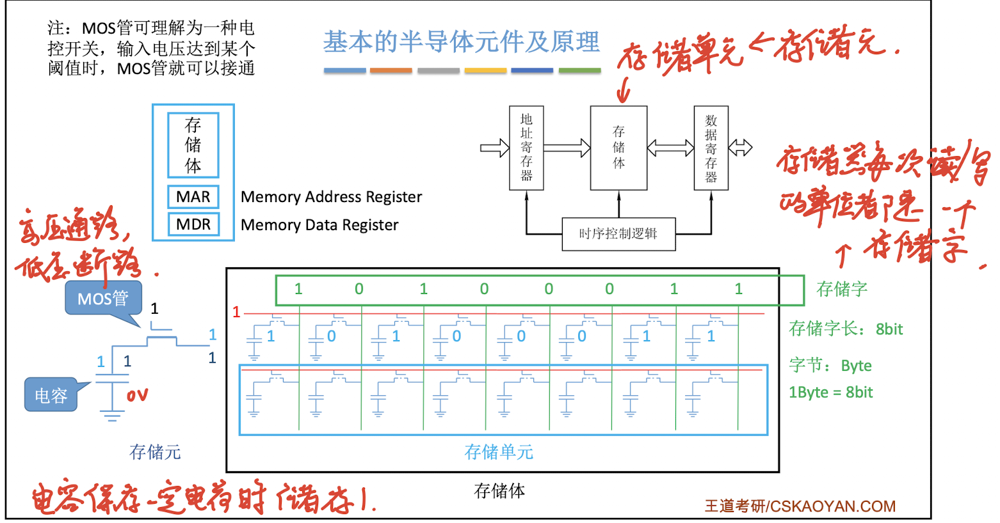
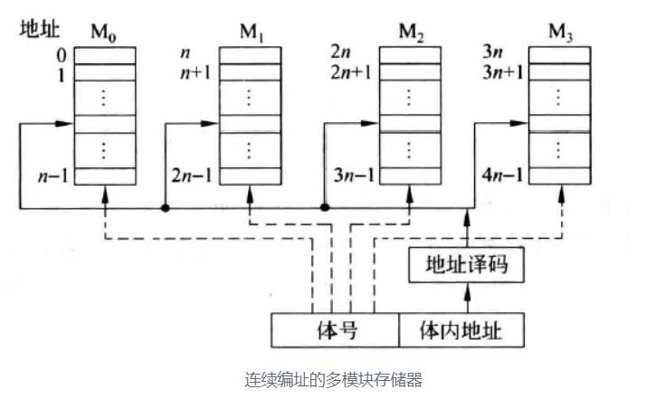

## SRAM 和 DRAM

> [! ] SRAM 采用六管静态 MOS 管存储元件，

> [! ]  DRAM 采用单管动态 MOS 管存储元件

### DRAM 和 SRAM 的比较 #考前摇一摇

| 类型           | SRAM(静态 RAM)                               | DRAM(动态 RAM)                                                                                 |
| ------------ | ------------------------------------------ | -------------------------------------------------------------------------------------------- |
| 存储信息         | (双稳态) 触发器                                  | (栅极) 电容                                                                                      |
| 存储单元         | 由 6 个晶体管构成                                 | 由 1 个晶体管和 1 个电容构成                                                                            |
| 破坏性读出        | 非破坏性读出 读:" 查看 " 触发器状态 写: 改变触发器状态     | 破坏性读出 (读出后需要重新充电) 读: 连接电容，检测电流变化 写: 给电容充/放电                                            |
| 读出后需要重写 (再生) | 不需要                                        | 需要                                                                                           |
| ==运行速度==     | 快                                          | 慢                                                                                            |
| ==集成度==      | 低                                          | 高                                                                                            |
| 发热量          | 大                                          | 小                                                                                            |
| 存储成本         | 高                                          | 低                                                                                            |
| ==价格==       | 高                                          | 低                                                                                            |
| 易失/非易失性存储器？| 易失 (断电后消息小时)                               | 易失 (断电后消息小时)                                                                                 |
| 需要刷新         | 不需要刷新 触发器能保持两种稳定状态 只要不断电，触发器的状态就不会改变 | 需要刷新 (分散、集中、异步) 电容的电荷只能维持 2ms,  2ms 内必须刷新一次 (即给电容充电) **" 刷新 " 由存储器独立完成，不需要 CPU 控制** |
| 送行列地址        | 同时送                                        | 分两次送 (地址线复用技术) **使得地址线、地址引脚减半**                                                           |
| 常用于          | **Cache**                                  | **主存**                                                                                       |

## 主存储器的结构

### 基本原件

#### 存储元

- **MOS 管**: 作为通电 " 开关 "，控制电容的充放电，从而实现 0 和 1 的存储
- **电容**: 存储电荷，通过充电和放电状态来表示二进制的 0 或 1

#### 存储芯片内部结构

- **译码驱动电路**: 将地址信号转换为字选通线的高低电平，用于选通特定的存储单元
  - 一维译码
  - 二维译码 (默认)
- **存储矩阵 (存储体)**: 由多个存储单元构成，每个存储单元又由多个存储元 (MOS 管和电容) 构成
- **片选控制电路**:
- **读写控制电路**:
- **片选电路**: 用于确定哪个存储芯片被选中，可用于容量扩充
- **读写电路**: 每次读/写一个存储字。包括读出放大器和写入电路，用来完成数据的读出和写入
  - 存储器读写的单位是存储字
    - **存储字: 一个存储单元所储存的二进制数据内容**
    - **存储字长: 一个存储单元所储存的二进制数据宽度 (长度)**
- **地址线、数据线、片选线、读写控制线**: 可能分两根，也可能只有一根
  - 两根读/写线:$\overline{WE}$(write enable) 允许写，$\overline{OE}$(output enable) 允许读
  - 一个读写线 $\overline{WE}$ 低电平写，高电平读

| 组件 | 描述 |
| --- | --- |
| 存储矩阵 | 由大量相同的位存储单元阵列构成 |
| 译码驱动 | 将来自地址总线的地址信号翻译成对应存储单元的选通信号， 该信号在读写电路的配合下完成对被选中单元的读/写操作 |
| 读写电路 | 包括读出放大器和写入电路，用来完成读/写操作 |
| 读/写控制线 | 决定芯片进行读/写操作 |
| 片选线 | 确定哪个存储芯片被选中。可用于容量扩充 |
| 地址线 | 是单向输入的，其位数与存储字的个数有关 |
| 数据线 | 是双向的，其位数与读出或写入的数据位数有关 |

- **地址寄存器**: 该寄存器用于存储输入的地址信号，图中用 $𝐴_0$ 到 $𝐴_{11}$ 表示，共 12 位地址
- **X 译码器**: 将来自地址寄存器的前 6 位地址 $𝐴_0$ 到 $𝐴_5$ 译码为一个唯一的输出信号，选择存储矩阵中的一行。$2^6 = 64$
- **驱动器**: 用于放大译码器的输出信号，确保足够的驱动能力来选通存储矩阵中的特定行
- **存储矩阵**: 由 64×64 的存储单元组成，每个单元可以存储一个位 (bit) 的数据。存储矩阵的行由 X 译码器选择，列由 Y 译码器选择
- **I/O 电路**: 负责数据的读出和写入操作。包括读出放大器和写入电路
- **Y 译码器**: 将来自地址寄存器的后 6 位地址 $𝐴_6$ 到 $𝐴_{11}$ 译码为一个唯一的输出信号，选择存储矩阵中的一列
- **输出驱动**: 用于放大从 I/O 电路读出的数据，确保输出信号的强度足够
- **控制电路**: 用于控制存储器的读写操作。包含:
  - 片选信号 $𝐶𝑆$: 用于选择当前存储芯片
  - 读写控制信号 $𝑊𝐸$: 决定当前操作是读还是写
- **片选信号**: 图中有 8 个芯片，需要 3 位片选信号来选择其中一个芯片

- 数据总线 (宽度 = 存储字长)
- 总容量 = 存储单元个数 $\times$ 存储字长
- n 位地址 $\Rightarrow2^n$ 个存储单元
- $8k \times 16$ 位的存储芯片 $\Rightarrow 2^{10 + 3} * 16 = 2^{13+4} = 128KB$

> 数据线数和地址线数共同反映存储芯片容量的大小。>例如，一个存储芯片有 16 个地址线和 8 个数据线，那么它的容量为 $2^{16} \times 8 = 2^{6+10+3} = 64 KB$

#### 寻址

- 现代计算机通常**按字节编址**
- 译码
  - 一维译码: 只有一个行译码器，同一行中所有存储单元的字线连在一起，接到地址译码器的输出端，选中一行的各单元构成一个字，被同时读出或写入
    - 缺点: 当地址位数较多时，地址译码器输出线过多
  - 二维译码: 地址译码器分为行和列两个译码器，在选中的行和列交叉点上能够确定一个存储单元
- 寻址
  - eg：总容量 1 kb，地址线 10 根
  - 按字节寻址：1 k 个单元，每个单元 1 B
  - 按字寻址: 256 个单元，每个单元 4 B
  - 按半字寻址：512 个单元，每个单元 2 B
  - 按双字寻址：128 个单元，每个单元 8 B

### DRAM

#### DRAM 的工作原理

##### 刷新方式 #考前摇一摇

- **读后再生**: 读出一行数据后，再写入，以保持电容的电荷
- **刷新周期**: 同一行相邻两次的刷新的间隔时间为**刷新周期**，通常取**2ms**

> [!NOTE] **刷新周期与存取周期**
>
> - 刷新一行的时间叫做一个**存取周期**
> - **存取周期**是指存储器完成一次读或写操作所需的时间
> - 刷新时间是等于存取周期的。因为刷新的过程与一次存取相同，只是没有在总线上输入输出
> - `存取周期＞真正用于存取的时间`，因为存取周期内、存取操作结束后仍然需要一些时间来更改状态。对于 SRAM 也是这样，对于 DRAM 更是如此

- **刷新机制**: 每次刷新的单元数**以行为单位，DRAM 刷新操作不需要片选，一次刷新操作是对所有芯片的同一行统一刷新。**
  - 选用行列地址可以减少选通线的数量。刷新由硬件支持
- **DRAM 的电容的电荷维持 1-2ms**，必须刷新 (读出一行数据重新写入，占一个读写周期)

> [!NOTE] **定时刷新的原因** 由于存储单元的访问是随机的，有可能某些存储单元长期得不到访问，不进行存储器的读/写操作，其存储单元内的原信息将会慢慢消失，为此，必须采用定时刷新的方法，它规定在一定的时间内，对动态 RAM 的全部基本单元电路必作一次刷新，一般取 2ms，即刷新周期 (再生周期)

- **刷新对于 CPU 是透明的**: 刷新操作由硬件控制，不需要 CPU 参与，不依赖外部访问

- 有以下三种刷新方式:

- **分散刷新**: 将存储器的系统工作周期分为两部分，前半部分用于读写或保持，后半部分用于刷新某一行
  - 优点: 没有死区
  - 缺点: 加长了系统的存取周期
- **集中刷新**: 有一段时间专门用于刷新，无法访问存储器，称为死时间，也叫访存 " 死区 "
  - 优点: 读写操作不受刷新工作的影响
  - 缺点: 在死区内不能访问存储器
- **异步刷新**: 刷新周期除以行数，得到两次刷新操作之间的时间间隔 `t`，每隔 `t` 产生一次刷新请求。$t = \frac{\text{刷新周期}}{行数}$
  - 理解:
    - 将一个刷新周期分配给所有行，每行的刷新周期 $t = \frac{\text{刷新周期}}{行数}$，一个刷新周期内，一行仅被刷新一次
    - 可在译码阶段刷新
    - 相对每一段来说，是集中式刷新 (仍存在 ' 死区 ')
    - 相对整体来说，是分散式刷新
  - 优点: 避免 CPU 连续等待长时间，减少了刷新次数

> [! ] 死区和死时间

- 死时间: 死时间是指系统在进行某些必要的操作 (如刷新、维护等) 期间，无法进行其他有效的操作的时间。在这段时间内，系统可能无法响应用户的请求，或者响应速度会明显下降
- 死区: 死区是指在存储器的工作周期中，由于需要进行刷新操作，而无法进行读写操作的那部分时间。在这个 " 死区 " 期间，存储器不能被访问
- 死区特指存储器的刷新操作，而死时间是一个更广泛的概念，可以包括存储器刷新操作，也可以包括其他操作

#### DRAM 的地址引脚复用技术 **凡事提到 DRAM，都要用到地址引脚复用技术**

- DRAM 芯片含量大，地址位数较多，为了减少芯片的地址引脚数，需要采用地址引脚复用技术
- 也即行地址和列地址通过相同的引脚分先后两次输入，这样地址引脚数可减少一半
- SRAM: 芯片引脚 = 地址线 + 数据线 + 片选线 (1) + 读写控制线 (2)
- DRAM: 芯片引脚 = **地址线/2(地址复用)** + 数据线 + **行列通选线 (2)** + 读写控制线 (2)(片选线由行列通选线代替)

#### DRAM 芯片的读写周期

##### DRAM 的读周期

- 读周期下的各信号时间关系

- $\overline{RAS}$ 为行选通信号，有效前需要将行地址送至芯片的地址引脚
- $\overline{CAS}$ 为列选通信号，需滞后 $\overline{RAS}$ 一段时间，并滞后列地址送到芯片地址输入端的时间，但需在 $\overline{CAS}$ 有效前送到
- $\overline{RAS}$、$\overline{CAS}$ 的时延分别为 $t_{RAS},t_{CAS}$，它们应有足够的宽度
- $\overline{WE}$ 信号为高电平，在 $\overline{CAS}$ 有效前建立

- **每次读后要再生**

##### DRAM 的写周期

- 写周期下的各信号时间关系

- $\overline{RAS}$、$\overline{CAS}$ 之间的关系以及与地址信息间的关系和读周期相同，只有以下两点不同
- $\overline{WE}$ 信号为低电平，并在 $\overline{CAS}$ 信号有效前建立

- 写数据必须在 $\overline{CAS}$ 有效前送到数据输入端

- 存取周期: 可以连续读/写的最短时间间隔
- DRAM 芯片的恢复时间比较长，有可能是存取时间的几倍 (SRAM 的恢复时间较短)

## 只读存储器 ROM

> ROM 和 RAM 都是支持随机存取的存储器；>SRAM 和 DRAM 都是半导体存储器；>而 ROM 具有非易失性，断电后数据不会丢失

### ROM 的特点

- 非破坏性读出，无需再生
- 信息只能读不能 (在线) 写
- 结构简单，位密度比可读写存储器高
- 随机存取，非易失性存储器 (特殊方式写入)

### ROM 的类型

- 掩模式只读存储器 MROM (Mask Read-Only Memory)
  - **厂商**按照客户需求，在芯片生产过程中直接写入信息，之后任何人不可重写 (只能读出)
  - 可靠性高、灵活性差、生产周期长、只适合批量定制

- 一次可编程只读存储器 PROM (Programmable Read-Only Memory)
  - **用户**可用专门的 PROM 写入器写入信息，**写一次之后就不可更改**

- 可擦出可编程只读存储器 EPROM (Erasable Programmable Read-Only Memory)
  - 用户可以用编程器写入信息，并且可以对其内容进行多次修改，不能取代 RAM，因为 EPROM 的编程次数有限，且写入次数过长
  - 可多次重写
    - **UVRPEOM (紫外线擦除)**: 擦除所有信息后重新写入
    - **EEPROM (电擦除)**: 擦除特定的字

  - EEPROM
    - 与 UVEPROM 相比
      - 优点: 可用电来擦除和重编程，可以选择只删除个别字
      - 缺点: 每次写入操作时先执行一个自动擦除，因此比 RAM 的写操作慢的多。无法取代 RAM

- **Flash Memory (闪速存储器)**
  - U 盘、SD 卡。(辅存)
  - 在 EEPROM 基础上发展而来，断电后也能保存信息
  - **既可以在不加电的情况下长期保存信息，又能在线进行多次快速擦除和重写。**
  - Flash 存储器的读操作速度和写操作速度相差很大，其读取速度与半导体 RAM 芯片相当，而写数据 (快擦 - 编程) 的速度则与硬磁盘存储器相当
  - **闪存的 " 写 " 速度要比 " 读 " 速度更慢。**
  - 每个存储元只需单个 MOS 管，位密度比 RAM 高
  - 可进行多次快速擦除重写
  - Flash 存储器的基本操作: 编程、擦除 (采用电擦除)、读取

- **固态硬盘 SSD**
  - 由固态电子存储芯片阵列制成的硬盘，由控制单元和存储单元 (Flash 芯片) 组成
  - 与闪速存储器的核心区别在于控制单元不一样，但存储介质都类似
  - **可进行多次快速擦除重写。**
  - 读写速度快，低功耗
  - 缺点是价格较高

### 计算机内重要的 ROM

## 🌟主存储器 (main mermory，MM) 的基本组成

### 记忆单元 (cell)

- **定义**：存储 0 或 1 的小格子，又叫做存储元、位元，是存储器的最小存储单位
- **存储矩阵**：由记忆单元构成，是存储器的核心器件

### 存储阵列 (bank)

- **定义**：也被称为存储体、存储矩阵，由大量的存储单元构成
- **地址编号**：为了存取存储体中的信息，必须对存储单元编号，所编号码就是地址

### 编址单位 (addressing unit)

- **定义**：具有相同地址的一组存储元，通常为一个字节或一个字
- **编址方式**：对存储单元进行编号的方式，决定了存储器的容量。可以按字节编址、按字编址，通常按字节编址，此时一个地址有一个字节

### 存储器相关术语

- **存储单元**：由多个存储元组成，通常以 8 个存储元为一个字节 (Byte)
- **存储元**：存储单元中的一个二进制位 0 或 1，存储字的每一位就是一个存储元
- **存储体**：存储阵列
- **存储字**：一个存储单元所储存的二进制数据内容
- **存储字长**：一个存储单元所储存的二进制数据宽度，即一个存储字的位数

### 存储器容量计算

- **系统能支持的最大容量**：$2^n \times$ 存储字长 bit（n 是指 MAR 的位数，以存储字编址）
- **存储器的总容量**：
  - 存储单元个数 * 存储字长（单位：bit）
  - $\frac{存储单元个数 \times 存储字长}{8}$（单位：Byte）
  - 注：1 字节 = 1 Byte = 8 bit

- **MAR 的位数**：存储单元个数
- **MDR 的位数**：存储单元的大小 = 存储字长（存储单元中每个单元的比特数）= 数据线位数

### 数据线和地址线

- **数据线**：图中采用 64 位数据线，所以在字节编址的方式下，每次最多可以存放 8 个单元的内容
- **地址线**：地址线的位数决定了主存地址空间的最大可寻址范围
  - 例如：36 位地址线，最大可寻址范围为 $0 \sim 2^{36}-1$ 个存储单元，即 $0 \sim 2^{36}-1$ 个字节。地址从 0 开始编号

### CPU 读操作

> **读操作**：从计算机的存储器（如 RAM，硬盘等）中获取数据并将其加载到 CPU 或其他设备中

CPU 芯片中的总线接口会在总线上发起读事务（read transaction）。该读事务分为以下步骤进行：

1. **发起读请求**：CPU 将物理内存地址 A 放到系统总线上。随后 IO bridge 将信号传递到存储总线上
2. **地址读取**：主存感受到存储总线上的地址信号并通过存储控制器将存储总线上的物理内存地址 A 读取出来
3. **数据定位**：存储控制器通过物理内存地址 A 定位到具体的存储器模块，从 DRAM 芯片中取出物理内存地址 A 对应的数据 X
4. **数据传输**：存储控制器将读取到的数据 X 放到存储总线上，随后 IO bridge 将存储总线上的数据信号转换为系统总线上的数据信号，然后继续沿着系统总线传递
5. **数据接收**：CPU 芯片感受到系统总线上的数据信号，将数据从系统总线上读取出来并拷贝到寄存器中

### CPU 写操作

> **写操作**：将数据从 CPU 或其他设备发送到计算机的存储器中

假设 CPU 要将寄存器中的数据 X 写到物理内存地址 A 中。CPU 芯片中的总线接口会向总线发起写事务（write transaction）。写事务步骤如下：

1. **发起写请求**：CPU 将要写入的物理内存地址 A 放入系统总线上
2. **地址传递**：通过 IO bridge 的信号转换，将物理内存地址 A 传递到存储总线上
3. **地址读取**：存储控制器感受到存储总线上的地址信号，将物理内存地址 A 从存储总线上读取出来，并等待数据的到达
4. **数据传输**：CPU 将寄存器中的数据拷贝到系统总线上，通过 IO bridge 的信号转换，将数据传递到存储总线上
5. **数据接收**：存储控制器感受到存储总线上的数据信号，将数据从存储总线上读取出来
6. **数据写入**：存储控制器通过内存地址 A 定位到具体的存储器模块，最后将数据写入存储器模块中的 8 个 DRAM 芯片中

## 主存系统的优化

> [!NOTE]
> 提高主存的存取速度的方法:
>
> - 使用**高速元件**
> - 通过存储器的**并行工作**

> [! ] 多核 CPU 都要访存，怎么办？
>
> - **双端口 RAM**，优化多核 CPU 访问一根内存条的速度

> [! ]  CPU 的数据传输速度比主存的存取速度快很多，主存的恢复时间较长怎么办？
>
> - **多模块存储器**

### 双端口 DRAM

- 指存储器左右都有独立的端口，分别具有具有两组独立的地址线、数据线和读写控制线

- 两个端口对同一主存操作有以下四种情况:
  1. 两个端口不同时对同一地址单元存取数据
  2. 两个端口同时对同一地址单元写入数据 **❌写入错误**
  3. 两个端口同时对同一地址单元读出数据
  4. 两个端口同时对同一地址单元，一个写入数据，另一个读出数据 **❌读出错误**

> [!NOTE] **解决办法**
> 置 " 忙 " 信号为 0，由判断逻辑决定暂时关闭一个端口 (即被延时)，未被关闭的端口正常访问，被关闭的端口延长一个很短的时间段后再访问

- 双端口存储器广泛应用于数字信号处理、图像处理、网络通信等领域

### 多模块存储器

#### 单体多字存储器【位扩展】

- 每个存储单元存储 m 个字
- 总线宽度为 m 个字
- 一次并行读出 m 个字
- **指令和数据在主存内必须是连续存放的**

- 优点:
  - 只需要一套控制电路，结构简单。
  - 适合大块数据传输，例如连续的多字数据读取。
- 缺点:
  - **灵活性差**，不能单独取其中某个变量，比如一个变量占了 5 个字，存在行*现象*，可能导致读取无用数据，浪费带宽。

> [!NOTE] **行现象**
> 行现象（Bank Conflict）在存储器系统中指的是，多体并行存储器在交叉编址时，多个访问请求落在同一存储模块上，导致这些请求不能并行处理，需要依次进行，从而降低了并行访问的效果和存储器的总体性能。

#### 多体并行存储器【字扩展】

- **多模块存储器是一种空间并行技术**，通过多个相同结构的存储模块并行工作来提高存储器的吞吐率。
- 每个存储模块有相同的容量和存取速度，具有独立的 MAR、MDR、地址译码器和控制电路。
- **解决单个 CPU 读写速度快的问题**，匹配 CPU 和存储器的速度差异。
- 存储模块可以独立并行工作，支持*连续编址*和*交叉编址*两种方式。

#### 连续编址

> [! ] 地址在存储模块内连续

- 主存地址高位表示模块号 (或体号)，低位表示模块内地址 (体内地址)
- 如图存储器有 4 个存储模块，每个模块有 n 个存储单元，每个存储单元存放一个字节，每个存储模块的地址空间为 $0 \sim n-1$，总的地址空间为 $0 \sim 4n-1$
- 连续编址的方式下, 地址被划分为体号和体内地址
  - 低位的体内地址送到存储器的地址译码器
  - 高位的模块号送到模块选择器，以选中相应的模块
- 但是当 CPU 在访问某个存储模块时，DMA 控制器正在控制外设和另一个存储模块数据传输，那么这两个存储模块可以独立并行工作，这种情况下可以提高存储器的夻吐率
- 程序具有局部性和连续性的特点
- 缺点：频繁访问同一模块，导致其他模块闲置，未能充分利用并行性。

#### 交叉编址 **没有特殊强调，交叉编址就是指低位交叉编址**

- 主存地址低位表示模块号 (或体号)，高位表示模块内地址 (体内地址)
- 每个存储模块按 **模 m 交叉方式编址**
- 假设有 m 个存储模块，每个块存储模块 有 k 个单元
  - $第 0，m，…, (k-1)m 号单元位于第\ 0\ 存储模块$
  - $第 m-1, 2m-1, …, km-1号位于\ m-1\ 号存储模块$
- **一般模块数 m 取 2 的整数次幂 图中 m = 4**

- 交叉编址多模块存储器可以采用轮流启动和同时启动两种

##### 轮流启动 (流水线方式)

- 条件: 当每个存储模块的存储字长等于系统总线的宽度时，可以采用轮流启动方式；【总线宽度 = 每个模块的存储字长，$r = \frac{T}{m}$】
- 可以从任意地址（某个模块的模块存储单元）开始顺序存取。
- **每隔 $\frac{1}{m}$ 个存储周期轮流启动各模块进行读写，即每隔 $\frac{1}{m}$ 个存储周期就可以读出或写入一个数据，存取速度提高 $m$ 倍。**
  - **存储周期 (Memory Cycle)**: 存储器完成一次读取或写入操作所需的时间，包括地址设置、响应时间和数据传输时间。
  - **总线周期 (Bus Cycle)**: 总线完成一次数据传输所需的时间，包括地址传输、数据传输及等待时间。

- 下图示意了四位交叉访问的时间关系。每个体的存储周期并没有缩短，但因为交叉访问各体，所以在一个存储周期内向 CPU 提供四个存储字

    
    

  - 在 1 次流水线存取过程中，所有存储模块都能被访问 1 次 (不能重复访问某一个存储模块)

  - 1 次流水线存取过程总耗时为 $T + (m-1)\tau$，带宽为 $\frac{m \times W}{T+(m-1)\tau}$

  - **连续 n 次流水线存取过程总耗时**为 $nT+(m-1)\tau$，带宽为 $\frac{m \times W}{T+(m-1)\tau}$

  - **连续取 n 个字的耗时**为 $T+(n-1)\tau$，带宽为 $\frac{n \times W}{T+(n-1)\tau}$

  - 为了流水线不间断，需要保证 $m \geq \frac{T}{\tau}$，即**存储模块数要大于存储周期与总线周期之比**

> [! NOTE] **计算** 有 $m$ 个存储体，存储周期为 $T$，字长 $W$，每隔 $r$ (总线传送周期) 时间启动下一个存储体，连续存取 $n$ 个字，求存储器的存取速率
>
> - **高位交叉编址** 连续存取 $n$ 个字耗时: $n \times T$
>   - 带宽为 $\frac{n \times W}{n \times T}=\frac{W}{T}$；单个存储体带宽为 $\frac{W}{T}$
> - **低位交叉编址** 连续存取 $n$ 个字耗时: $T+(n-1)r$ ($m \geq \frac{T}{r}$)
>   - 带宽为 $\frac{n \times W}{T+(n-1)r}$；当 $n$ 较大时带宽为 $\frac{W}{r}$；单个存储体带宽为 $\frac{W}{T}$

##### 同时启动

- 条件: 如果所有存储模块一次并行读写的总位数等于系统总线的数据线数，可以采用同时启动方式。
- **总线宽度 = 每个模块的存储字长 $r$ 乘以模块数 $m$，此时 $r = T$**。
- 所有存储模块同时启动，向数据线提供 $m \times \text{存储字长}$ 的数据。

### 小结

> [! ] 关于交叉存储器检测访问冲突的一种算法

> **算法规则**

1. 访问序列由 **数字** 和 **空位** 组成，为方便起见，数字和空位统一称为 **元素**。
2. 算法开始时，在序列的 **头部** 和 **尾部** 各添 3 个空位。
3. 设置一个 **滑动组**，该滑动组 **必须** 包含四个元素（可以全是数字，也可以部分是数字部分是空位）。从序列头部开始，依次往后移动滑动组，直到滑动组不足四个元素为止。
4. 如果发现滑动组中有一对 **重复项**（即两个重复项），则在后一个重复项的 **前面** 添加一个空位。如果是两对重复项，则每对的后一个重复项前都添加一个空位。
5. 滑动组移至序列尾部，算法结束。最后删除序列头部和尾部的 3 个空位，得到最终序列结果。

---

### 冲突检测

> 访问模块号的顺序：`3, 1, 2, 3, 0, 2, 1, 3, 1, 2, 0, 2`

> 我们直接跳过没有冲突的步骤，只列出发生冲突的步骤：

$$
3, 1, 2, 3, 0, 2, 1, 3, 1, 2, 0, 2
$$

$$
\_ \quad \_ \quad \_ \quad 3, 1, 2, 3, 0, 2, 1, 3, 1, 2, 0, 2 \quad \_ \quad \_ \quad \_
$$

$$
\_ \quad \_ \quad \_ \quad (3, 1, 2, 3) \quad 0, 2, 1, 3, 1, 2, 0, 2 \quad \_ \quad \_ \quad \_
$$

$$
\_ \quad \_ \quad \_ \quad (3, 1, 2, \quad \_ \quad 3) \quad 0, 2, 1, 3, 1, 2, 0, 2 \quad \_ \quad \_ \quad \_
$$

$$
\_ \quad \_ \quad \_ \quad 3, 1, 2, \quad \_ \quad 3, 0, (2, 1, 3, 1) \quad 2, 0, 2 \quad \_ \quad \_ \quad \_
$$

$$
\_ \quad \_ \quad \_ \quad 3, 1, 2, \quad \_ \quad 3, 0, (2, 1, 3, \quad \_ \quad 1) \quad 2, 0, 2 \quad \_ \quad \_ \quad \_
$$

$$
\_ \quad \_ \quad \_ \quad 3, 1, 2, \quad \_ \quad 3, 0, 2, (1, 3, \quad \_ \quad 1) \quad 2, 0, 2 \quad \_ \quad \_ \quad \_
$$

$$
\_ \quad \_ \quad \_ \quad 3, 1, 2, \quad \_ \quad 3, 0, 2, (1, 3, \quad \_ \quad \_ \quad 1) \quad 2, 0, 2 \quad \_ \quad \_ \quad \_
$$

$$
\_ \quad \_ \quad \_ \quad 3, 1, 2, \quad \_ \quad 3, 0, 2, 1, 3, \quad \_ \quad \_ \quad (1, 2, 0, 2) \quad \_ \quad \_ \quad \_
$$

$$
\_ \quad \_ \quad \_ \quad 3, 1, 2, \quad \_ \quad 3, 0, 2, 1, 3, \quad \_ \quad \_ \quad (1, 2, 0, \quad \_ \quad 2) \quad \_ \quad \_ \quad \_
$$

$$
3, 1, 2, \quad \_ \quad 3, 0, 2, 1, 3, \quad \_ \quad \_ \quad 1, 2, 0, \quad \_ \quad \_ \quad 2
$$

## 主存储器和 CPU 之间的连接

### 单块存储器和 CPU 之间的连接

### 连接原理

主存储器与 CPU 通过数据总线、地址总线和控制总线连接：

- **数据总线**：其位数与工作频率的乘积决定数据传输率。
- **地址总线**：位数决定了可寻址的最大内存空间。
- **控制总线**：指出总线周期的类型以及当前输入/输出完成的时刻。

- **ROM（只读存储器）**
  - 通常用于存放系统引导程序、系统程序、标准子程序和各类常数，如 BIOS（自举程序）。
- **RAM（随机存储器）**
  - 操作系统内核和用户程序通常存放在 RAM 区。

---

#### 地址线的连接

- CPU 的地址线决定整个主存空间的寻址范围，一般比存储芯片的地址引脚数多。
  - **连续编址**：高位用于字扩展时的片选信号译码。
  - **交叉编址**：低位用于片选信号译码。
- **片选信号**：由译码器生成，用于选择具体的存储芯片。

#### 数据线的连接

- CPU 的数据线数决定一次可读写的最大数据宽度，通常比存储芯片的位数多。
- 可以通过位扩展，将 CPU 数据线连到多个芯片上，使得扩展后的位数与数据线数匹配。

#### 控制线的连接

- CPU 的 `MREQ` 信号用于确定是否访问主存或 I/O 端口，仅当 `MREQ` 为低电平时才需要选择存储芯片。
- `MREQ`（Memory Request）：表示存储器请求。

### 多块存储芯片与 CPU 的连接

### 位扩展法

> 位扩展是为了扩展数据总线的宽度，使得 CPU 的数据线数与存储器的位数匹配。

- **特点**：CPU 数据线数 > 存储芯片的数据位数，需要扩展位数，地址线连接方式不变。
- **实现**：多个存储器件并联扩展数据位数，增加存储字长。
- **别称**：数据总线扩展或字长扩展。

- 用 4K×1 位芯片构成 4K×8 位存储器，需要 8 个芯片。
  - 地址范围：000-FFFH，共 12 位，全部作为片内地址。
  - 所有芯片的地址线及读/写控制线相连，数据线单独引出。

### 字扩展法

> 字扩展用于增加存储字的数量（容量扩充），位数保持不变。

- **实现**：芯片的地址线、数据线和控制线并联，通过片选信号区分芯片的地址范围。
- **片选信号生成方式**：
  - **线选法**：直接使用高位地址线决定片选信号。
  - **译码片选法**：使用译码器将高位地址线译码生成片选信号。

#### 线选法

#### 译码片选法

- $A_{14} 不影响片选信号$

#### 线选法和译码片选法的比较

- 用 16K×8 位芯片扩展成 64K×8 位存储器：
  - 需要 4 个芯片（字扩展 4 倍）。
  - 每个芯片容量为 16K，即 2^14 个地址单元，总共需要 16 位地址。
  - 地址范围：
    - 0000-3FFFH
    - 4000-7FFFH
    - 8000-BFFFH
    - C000-FFFFH
  - 地址高两位经过译码器生成 4 个片选信号，低 14 位连接到各芯片的片内地址。

### 字位同时扩展法

> 字位同时扩展是位扩展和字扩展的结合，既增加容量又扩展位数。

- **组内连接**：位扩展的芯片作为一组，组内的各芯片的地址线、数据线和控制线相连。
- **组间连接**：组间使用字扩展的连接方式，各组的片选信号由高位地址经过译码器生成。

- 用 16K×4 位芯片构成 64K×8 位存储器：
  - 字扩展 4 倍，位扩展 2 倍，共需 8 个芯片。
  - 地址范围：
    - 0000-3FFFH
    - 4000-7FFFH
    - 8000-BFFFH
    - C000-FFFFH

> [!NOTE] **系统存储容量的计算**

1. **确定芯片数**：根据扩展方式计算所需的芯片数量。
2. **地址线分配**：分配芯片（组）与片选信号的地址线。
3. **地址范围划分**：计算各芯片（组）的地址范围。
4. **片选信号表达**：用地址信号表示片选信号的逻辑表达式。

### 又一理解

| **扩展方式** | **扩展内容**    | **编址方案**    |
| -------- | ----------- | ----------- |
| **位扩展**  | 扩展每字的**位宽** | 低位交叉编址      |
| **字扩展**  | 扩展存储的**字数** | 高位交叉编址      |
| **字位扩展** | 扩展**位宽和字数** | 低位 + 高位交叉编址 |

#### 1. 位扩展

- **采用低位交叉编址方案**
  - 位扩展**增加每一字的位宽**，即扩展存储器的**位数**。
  - 例如，原始位宽为 $N$，扩展后为 $4N$。
  - 扩展后的存储容量变为：
    **$M \times 4N$**，其中 $M$ 为字的数量。
  - **注意**：采用低位交叉编址并不一定要增加字的数量（字长不变）。

**示例**：

- 使用四个存储器模块，扩展每一字的位宽。
- 每个存储器模块负责同一字的不同位段。

---

#### 2. 字扩展

- **采用高位交叉编址方案**
  - 字扩展**增加存储的字数**，即字的数量变多。
  - 例如，原始字数为 $M$，扩展后为 $4M$。
  - 扩展后的存储容量变为：
    **$4M \times N$**，其中 $N$ 为每一字的位数。
  - 高位交叉编址确保不同的字存储在不同的存储模块中。

**示例**：

- 使用四个存储器模块来扩展字的数量。
- 每个存储器模块存储不同的字。

---

#### 3. 字位扩展

- **采用低位和高位交叉编址方案相结合**
  - 字位扩展同时**增加字数和位宽**。
  - 例如，原始字数为 $M$，扩展后为 $2M$；原始位宽为 $N$，扩展后为 $2N$。
  - 扩展后的存储容量变为：
    **$2M \times 2N$**。

**示例**：

- 使用四个存储器模块，**同时扩展字数和位宽**。

## 例题

