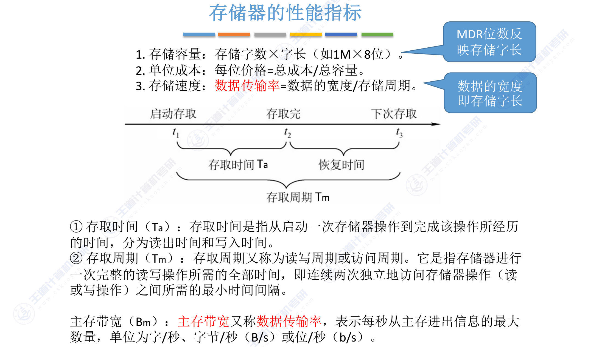
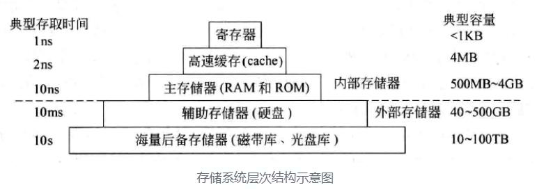
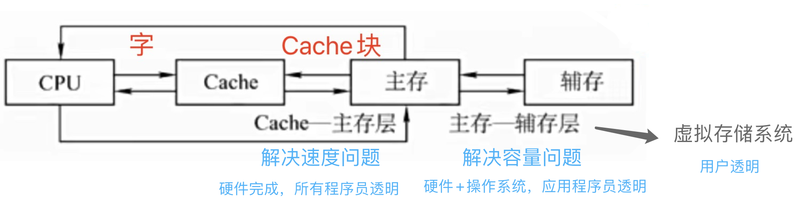

## 存储系统的分类

#### 在计算机中的作用 (层次) 分类

- **高速缓冲存储器** 简称 Cache
- **主存储器** 简称 主存 (内存、MM)
- **辅助存储器** 简称 辅存 (外存)

#### 存储介质

- **磁表面存储器** (eg: 磁盘 磁带)
- **磁芯存储器**
- **半导体存储器** (eg:Mos 型存储器 双极型存储器)
  - 便宜但是不稳定
- **光存储器** (eg: 光盘，CD,CD-ROM,DVD)

#### 信息的可保存性

- 断电后存储信息是否消失
  - **易失性存储器**：如 RAM，在断电后信息会丢失。
  - **非易失性存储器**：如 ROM、磁盘和光盘，即使断电后信息也不会丢失。

- 信息读出后是否被破坏
  - **破坏性读出**：如 DRAM 芯片，读出数据后需要重新写入。
  - **非破坏性读出**：如 SRAM、磁盘、光盘，读出数据后内容保持不变。

#### 信息的可更改性

- **读写存储区** (Read/Write Memory)
  - 既可读、也可写，如: 磁盘、内存、Cache

- **只读存储器** (Read Only Memory) ROM
  - 只能读，不能写 (在某些情况下可以重写)
  - eg.实体音乐专辑通常采用 CD-ROM，实体电影采用蓝光光碟，BIOS(基本输入输出系统) 通常写在 ROM 中

#### 功能/容量/速度/所在位置分类

- **寄存器**: 封装在 CPU 内部，存放当前执行的指令和使用的数据
  - 触发器实现，速度快容量小

- **高速缓存器** (Cache): 位于 CPU 内部或附近，用于存放当前要执行的局部程序段和数据
  - SRAM 实现，速度可与 CPU 匹配，容量小

- **内存储器** (Main Memory，MM)(主存储器): 位于 CPU 外，存放已被启动的程序及数据
  - 用 DRAM 实现，速度较快，容量较大

- **外存储器** (Auxiliary Memory，AM)(辅助存储器): 位于主机之外，用来存放暂不运行的程序、数据或存档文件

#### 工作性质/存取方式

- **随机存储器** (RAM)
  - SRAM(静态 RAM) **用作 Cache**
  - DRAM(动态 RAM) **用作主存**
  - 按地址访问存储单元
    - 任何一个存储单元的内容可以随机存取,存取时间与单元的物理位置无关

- **串行访问存储器**: 读写某个单元的时间与存储单元的物理位置有关
  - *顺序存取储存器* (Sequential Access Memory,SAM)
    - 只能按照某种顺序存取,**存取时间的长短与信息在存储体上的物理位置有关,以记录块为单位编址**
    - 存储容量大,存储速度快
    - eg: 磁带

  - *直接存取储存器* (Direct Access Memory,DAM)
  - 存取方式兼有随机访问和顺序访问的特点,首先直接选取所需信息所在区域 (小区域),然后按照顺序方式存取 **(区域划分不随内容改变)**,存取时间的长短与信息在存储体上的物理位置有关
  - eg: 磁盘,光盘
  - 直接定位到要读写的数据块，在读写某个数据块时按顺序进行
  - 速度太慢，只能做为辅助存储器

#### 按内容访问存储器 CAM/相联存储器

- 既可以按照地址寻址也可以按照内容寻址 (通常是某些字段)
- 为了与传统寄存器作区别，称为按内容寻址的存储器
- 适用于不知道地址，但知道某些内容特征的情况下
- eg. 快表 (TLB) Cache 中的快表就是由 CAM 实现的

#### 存取结构和存储结构的区分

| **存取结构** | 描述                                                                          |
| -------- | --------------------------------------------------------------------------- |
| 随机存取     | 可以通过下标直接访问的数据结构，与存储位置无关， 例如数组。我们可以通过数组的下标直接访问数组中的任何元素。                   |
| 顺序存取     | 不能通过下标访问，只能按照存储顺序存取，与存储位置有关， 例如链表。我们在访问链表中的元素时，必须从链表的头部开始，按照链表的链接顺序逐个访问。 |

| **存储结构** | 描述                                                                    | 优点                  | 缺点                              |
| -------- | --------------------------------------------------------------------- | ------------------- | ------------------------------- |
| 顺序存储结构   | 在计算机中用一组地址连续的存储单元依次存储线性表的各个数据元素。逻辑上相邻的节点存储在物理位置上相邻的存储单元中。| 节省存储空间，可实现对结点的随机存取。| 不便于修改，对结点的插入、删除运算时，可能要移动一系列的结点。|
| 随机存储结构   | 在计算机中用一组任意的存储单元存储线性表的数据元素 (这组存储单元可以是连续的，也可以是不连续的)。逻辑上相邻的元素在物理位置上不必相邻。| 插入、删除灵活。| 查找结点时链式存储要比顺序存储慢，存储密度小。|

## 存储器的性能指标

- 单位成本 是 **每位 (bit) 存储器的价格**

   $$\text{单位成本} = \frac{总成本}{存储总容量}$$

- `kmg 和 KMG`
  - 小写或描写速度时，kmg 分别表示 $10^3,10^6,10^9$
  - 大写或描写存储容量时，KMG 分别表示 $2^{10},2^{20},2^{30}$
- 带宽: 存储器的数据传输速率，表示存储器被连续访问时，可以提供的数据传送速率，**通常用每秒钟传送信息的位数 (或字节数) 来衡量 即 $\text{带宽} = \frac{数据总宽度}{存储时间}$**。单位是字/秒、字节/秒 (B/s)、位/秒 (b/s) 等
  - eg: 存储器的数据总线宽度为 32 位，存储周期为 200ns，
    - 则存储器的带宽为 $\frac{32}{200ns} = 160M b/s = 20M B/s$
- **存储字: 一个存储单元所储存的二进制数据内容**
- **存储字长: 一个存储单元所储存的二进制数据宽度**

### 存储周期的时间计算

1. **地址译码**
   主存控制器收到来自 CPU 的地址信息后，对地址信息进行译码，并定位到对应的存储单元。

2. **数据读取**
   存储单元中，若保存 `1` 则代表存储单元携带一个电荷，若为 `0` 则无电荷。系统将该存储单元中的数据读出，同时该单元中的电荷变为零。

3. **电荷放大**
   读取的电荷通过读出放大器将电压放大后，传输至 CPU。

4. **数据再生**
   由于存储单元数据读出后，电荷归零，需要重新对存储单元补充电荷，使其数据恢复至读出前的状态。此过程称为**数据再生**。

5. **恢复时间**
   再生电路和放大电路在每次启动后，需等待一段时间完成恢复，才能进行下一次启动。

- **存储周期 (Memory Cycle)**
  以上步骤 1 至步骤 5 的总时间即为一个**存储周期**。存储周期是存储器完成一次读取或写入操作所需的时间，包括地址设置、响应时间和数据传输时间。

#### 选择题中的存储时间

在选择题中，存储周期的定义通常较为完整，包括数据恢复步骤。即：
存储周期不仅包括上述数据读取与传输的时间，还包括将存储单元恢复至读取前状态所需的**数据再生**时间。
这样定义的存储周期更准确地反映了存储器完成一次完整操作的时间。

#### 大题中的存储时间

在大题中，存储周期的时间计算通常包括以下步骤：

1. **地址译码**
   主存控制器收到来自 CPU 的地址信息后，对地址信息进行译码，定位到某个存储单元。

2. **数据读取**
   存储单元中，若保存 `1` 则代表存储单元中有电荷，若为 `0` 则无电荷。系统将该存储单元中的数据读出，同时将存储单元中的电荷清空至零。

3. **电荷放大**
   读出的电荷通过读出放大器将电压放大后传输给 CPU。

> **注意**: 在大题中，存储周期的定义省略了**数据恢复**所需的时间，不包括补充电荷以恢复原存储单元数据的步骤。

## 存储器的层次结构

- 为了缩小存储器和处理器两者之间在性能方面的差距，通常在计算机内部采用**层次化的存储器体系结构。**
  - 因为某一种元件制造的存储器**很难同时满足大容量高速度和低成本的要求**。计算机中把各种不同容量和不同存取速度的存储器按照一定的结构有机地组织在一起，形成层次化的存储器体系结构
  - 408 中的存储层次结构主要关注: **Cache- 主存层** 以及 **主存 - 辅存层**

- 存储器层次结构的主要思想是：
 **上一层的存储器作为下一层存储器的高速缓存，即上一层中的内容都只是下一层中内容的副本。**

- CPU 要从存储器中存取数据时，先访问 Cache, 若在 Cache 中，再访问主存，若不在主存中，则访问磁盘。此时，数据从磁盘读出送到主存，从主存送到 Cache。(Cache 的内容是主存的副本，主存的内容是磁盘的副本)
- 如此，**在 CPU 看来，Cache- 主存层的速度接近于 Cache，容量却接近于主存。同样，主存 - 辅存层速度接近于主存，容量却接近于辅存。**

- Cache、主存能够与 CPU 直接交换信息
- 辅存需要通过主存与 CPU 交换信息
- 主存与 CPU、Cache、辅存都能交换信息。-

- **Cache- 主存层主要解决 CPU 和主存速度不匹配的问题**
    主存和 Cache 之间的数据调动是由**硬件**自动完成的，对所有程序员均是透明的
- **主存 - 辅存层主要解决存储系统的容量问题**
    主存和辅存之间的数据调动是由**硬件和操作系统**共同完成的
    对应用程序员是透明的。(对于系统程序员是可见的 (不透明)

> 透明: 指无法查看、干涉其过程或值 #考前摇一摇

- 在计算机技术中，一个存在的事物或概念从某个角度看似不存在，称为**透明性现象**

- 系统程序员所看到的底层机器级的概念性结构和功能特性对高级语言程序员 (**通常是应用程序员**) 来说是透明的

- 对于 CPU 来说
	- 可见寄存器 (中通 APP)
	  - 通用寄存器
	  - 中断寄存器
	  - ACC 寄存器
	  - PSW 寄存器
	  - PC 寄存器
	- 不可见 (透明) 寄存器 (mmiv)
	  - MAR(地址寄存器)
	  - MDR(数据寄存器)
	  - IR(指令寄存器)
	  - 微指令寄存器

|         **类型**          | **寄存器名称**                                                    |
| :---------------------: | ------------------------------------------------------------ |
|   可见寄存器  (中通 APP)    | - 通用寄存器 - 中断寄存器 - ACC 寄存器 - PSW 寄存器 - PC 寄存器  |
| 不可见 (透明) 寄存器  (mmiv) | - MAR (地址寄存器) - MDR (数据寄存器) - IR (指令寄存器) - 微指令寄存    |
