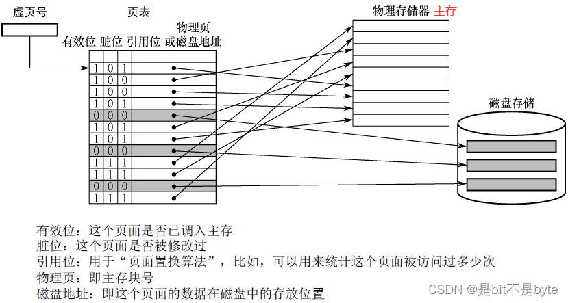
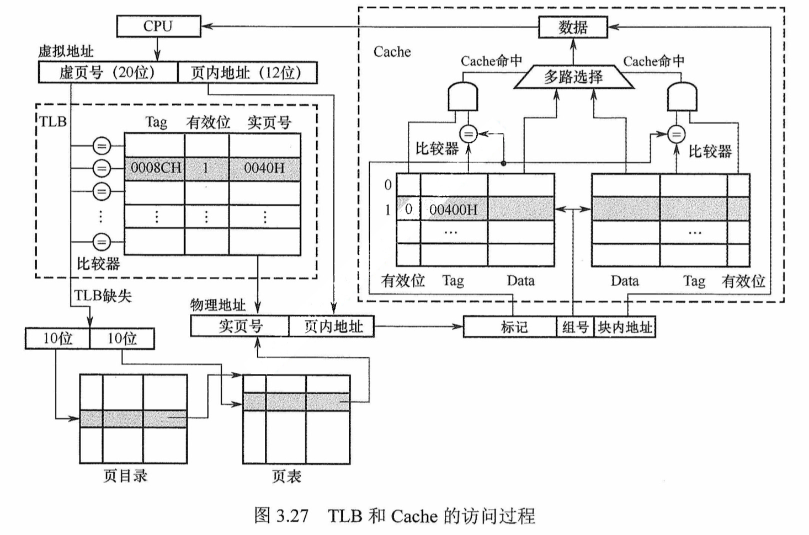

## 基本概念

- **虚拟存储器**是一个**逻辑模型**
- **功能**: 用户给出一个地址（虚地址或逻辑地址），虚拟存储器返回该地址对应的数据
- **实现**: 通过辅助硬件将虚地址映射到主存中的某个单元
  - 主存单元地址称为实地址或物理地址

### 逻辑地址和物理地址

- **逻辑地址 (LA)**: 程序中指令所用地址（进程所在地址空间），也称为虚拟地址 (VA)
- **物理地址 (PA)**: 存放指令或数据的实际内存地址，也称为实地址、主存地址

### 地址转换

- **虚拟地址**由**虚拟页号 (VPN)** 和 **虚拟页偏移量 (VPO)** 组成
- 当 CPU 生成一个虚拟地址并传递给 MMU（内存管理单元）时，MMU 利用虚拟地址的虚拟页号 (VPN) 来选择相应的页表项 (PTE)
- 页表项中包含物理页号 (PPN)，将 PPN 与 VPO 组合生成物理地址

> [! ] 虚拟页与主存页之间采用全相联方式映射时，没有像全相联 Cache 的 Tag?
页表中的表项是**按虚页号存放**，转换时直接用 VA 中的**高位地址（虚页号）即可定位表项**，所以页表不存在 Tag 项

- **MMU (Memory Management Unit)**: 内存管理单元，负责地址转换
- **虚拟地址**: 由虚拟页号 (VPN) 和虚拟页偏移量 (VPO) 组成
- **物理地址**: 由物理页号 (PPN) 和虚拟页偏移量 (VPO) 组成

1. **CPU 生成虚拟地址**并传递给 MMU
2. **MMU 利用 VPN 定位页表项**，获取物理页号 (PPN)
3. **组合 PPN 和 VPO** 生成物理地址
4. **访问主存**，若数据不在主存中，则将相应页调入主存，必要时使用替换算法置换主存中的交换块

## 页式虚拟存储器

虚拟空间与主存空间都被划分成同样大小的页，虚拟存储中的页叫做**虚页（Page）**，而主存中的页框叫做**页框（Page Frame）**

- **优点**
  - 页面的长度固定，页表简单，调入方便
- **缺点**

  - 由于程序不可能正好是页面的整数倍，最后一页的零头将无法利用造成浪费 (**块内碎片**)
  - 页不是逻辑上独立的实体，处理、保护和共享都不如段式虚拟存储器方便

- 页表、段表是一种数据结构，存放在主存中，而快表是硬件。

### 页表 (Page)

- 页表属于进程控制信息，存放在进程地址空间的内核区。
- 页表基址寄存器（PTBR）记录的是**页表在主存的起始地址**。保存的是物理地址。
- **未运行进程的页表起始地址**：存储在进程 **PCB**（进程控制块）中的相关字段。

> [! ] 页表切换的时机： **进程切换**
>
> - 在页表切换的同时，**翻译后备缓冲区 (TLB)** 也会被刷新
> - TLB 刷新是为了确保新进程的虚拟地址映射正确，从而避免使用旧进程的地址缓存数据。

#### 页、页框、页表

- **页（Page）**：

    - 页指的是一系列线性地址组成的存储单元，也就是虚拟内存中的一段数据
    - 页是操作系统用来管理虚拟内存和物理内存之间映射的重要单位

- **页框（Page Frame）**：

    - 页框是物理内存中实际存储数据的固定长度的块
    - 内存中的 RAM 被划分为多个页框，每个页框对应一个页
    - 页框的大小与页的大小一致，这是为了方便页表的映射和管理

- **页表**：

    - 页表是虚拟地址空间与物理地址空间之间的映射表，由多个页表项组成
    - 每个页表项负责记录虚拟内存中的某一页与物理内存中某个页框之间的对应关系

> [! important] 每个进程都有一个页表，页表的项数由虚拟地址空间大小决定

#### 页表项（Page Table Entry, PTE)

- **装入位/有效位/存在位 (valid)**：表示对应页面是否在主存
  - 1: 表示该虚拟页已从外存调入主存，此时页表项中存放了该页的物理页号
  - 0: 表示没有调入主存，此时页表项中可以存放该页的磁盘地址
  - 若位置字段为 NULL，则是未分配页
  - 不为 NULL，则是未缓存页
- **修改位/脏位 (dirty)**：表示页面是否被修改过。虚存机制采用回写策略，利用修改位可判断替换时是否需要写回磁盘
- **替换控制位/引用位/使用位**：用来说明页面的使用情况，配合替换策略来设置。如：是否最先调入 (FIFO)、是否最近最少使用 (LRU) 等
- **访问权限位**：页面是可读可写、只读还是只可执行
- **禁止缓存位**：说明页面是否可以装入 Cache
- **存放位置字段/物理页或磁盘地址**：
  - 当对应页面在主存中时，存放位置字段指向主存页框号（即物理页号或实页号）
  - 若没有调入主存中：
    - 当存放位置字段为 NULL 时，表示其是一个 "**未分配页**"（尚未将该虚拟页分配给某个物理页）
    - 否则是一个 "**未缓存页**"（已分配但未调入主存），该字段给出该虚拟页在磁盘上的起始地址

- **未分配页**: 进程的虚拟地址空间中 " 空洞 " 对应的页 (如 VPO、VP4)
- **已分配的缓存页**: 有内容对应并已装入主存的页 (如 VPI, VP2, VP5, VP7)
- **已分配的未缓存页**: 有内容对应但未装入主存的页 (如 VP3、VP6)

  **区分未分配页和未缓存页**

- 存取权限位和禁止缓存位不在考点涉及范围内，无需关注
- (注: 虚拟存储器出现早于高速缓存，按照习惯的说法块被叫做页。从虚拟内存到物理内存传送页的活动就叫做页面交换。)

#### 单级页表

#### 二级页表

### 地址转换

- **虚拟地址到物理地址的转换**:
  - 对于采用虚存机制的系统，指令中给出的地址是虚拟地址。CPU 执行指令时，首先要将虚拟地址转换为主存物理地址，才能到主存取数据和指令。地址转换工作由 CPU 中的 MMU (存储器管理部件) 完成

  - 虚拟地址分为两个字段:
    - 高位为虚页号
    - 低位为页内偏移地址

  - 物理地址分为两个字段:
    - 高位为物理页号
    - 低位为页内偏移地址

  - 因为两者页面大小相同，因此页内偏移地址是相等的

#### 地址转换过程

1. **CPU 生成虚拟地址**
2. **MMU 生成 PTE 地址**，从内存的页表中请求内容
3. **内存中的页表返回相应的 PTE 值**
4. **PTE 的有效位是 0**，转到异常处理程序
5. **异常处理程序确定内存中的牺牲页**，并将其写回到磁盘上（pagefile.sys）
6. **从 pagefile.sys 中调入新的页面**并更新 PTE
7. **PTE 已经更新**，重新发送虚拟地址到 MMU（后续过程与命中情况相同）

#### 页表基址寄存器 (PTBR)

- 每个进程都有一个页表基址寄存器 (PTBR)，用于存放该进程的页表首地址 (物理)
- 根据页表基址寄存器的内容，找到对应的页表首地址
- 以虚拟地址高位字段的虚拟页号为索引，找到对应的页表项
- 若装入位为 1，则取出物理页号，和虚拟地址中的页内地址拼接，形成实际主存物理地址
- 若装入位为 0，则说明缺页，需要操作系统进行缺页处理（缺页是一种外部中断）

### 快表 (TLB)

- 访存时首先要到主存查页表，然后再根据主存物理地址访问主存取指令或数据。若缺页，还要进行页面替换、页表修改等，访问主存的次数会更多，即虚拟存储器机制增加了访存次数
- **为了减少访存次数**，更好地利用局部性原理，我们通常把页表中最活跃的几个页表项复制到高速缓存组成的快表 (TLB) 中，从而提高效率。相应地，我们把存放在主存中的页表称为慢表。在地址转换时，首先到快表中查页表项，如果命中则无须访问主存中的页表

- **快表用 SRAM 实现，类似于 Cache，采用全相联或组相联方式**:
  - 每个表项的内容由页表项内容加上一个 TLB 标记字段组成，TLB 标记用来表示该表项对应哪个虚拟页
  - 在全相联方式下就是对应页表项的虚拟页号
  - 在组相联方式下就是对应虚拟页号的高位部分
  - 虚拟页号的低位部分作为 TLB 组的组号
  - TLB 全相联时，没有 index，虚页号需与每个 tag 比较
  - TLB 组相联时，虚页号被分成 tag 和 index，index 用于定位组，tag 用于与组内的页表项中的 tag 比较

### 具有 TLB 和 Cache 的多级存储系统

- 如图所示，是一个 TLB 和 Cache 的多级存储系统，Cache 采用二级组相联方式，TLB 采用全相联方式。CPU 给出一个 32 位的虚拟地址
- 首先由 CPU 中的 MMU 进行虚拟地址到物理地址的转换，然后由处理 Cache 的硬件根据物理地址进行存储访问
- 查找时将虚页号与每个 TLB 标记字段进行比较：
  - 若有某一项相等且对应有效位为 1，则 TLB 命中，此时可以直接通过 TLB 进行地址转换
  - 若未命中，则 TLB 缺失，需要访问主存去查页表：
    - 页表命中，则将对应页表项调入 TLB
    - 页表未命中，则缺页，需要操作系统进行缺页处理

- 使用两级页表方式，虚页号分为页目录索引和页表索引两部分，通过这两部分查找得到对应的页表项，进行地址转换，并将对应页表项调入 TLB。若 TLB 已满，还需采用替换策略
- 完成地址转换后，得到物理地址
- 根据 Cache 映射方式将物理地址划分为标记、组号、块内地址 3 个字段，根据映射规则找到对应的 Cache 组
- 同时将一组中两个 Cache 行 (采取二级组相联) 的标记与物理地址的高位进行比较：
  - 若相等且有效位为 1，则 Cache 命中，此时根据块内地址取出对应的字送 CPU
  - 若未命中，则 Cache 缺失，需要访问主存取出对应块，再将块调入 Cache。（不需要更新页表）

> [!NOTE] **缺页处理**
> 
> CPU 执行 Load M
这条指令会去找 M 对应的 页表项 若 这个页表项有效 (P 位 为 1) 则直接访问
若无效 就会产生缺页异常 导致操作系统的缺页异常的服务例程会执行
缺页异常服务例程 会去找外存中的那个页面 若找到 就将其读入内存
读入内存之前 还要先判断物理内存中是否有空闲页 若找到空闲页 就将这页读进来 并修改页表项 最后重新执行 一开始的那条指令
若找不到空闲页 依据页面置换算法 找一页不常用的页 若这一页被修改过 则将其写到外存
若未修改过 则将其丢弃 且 修改 这一页的 P 位 为 0 使其失效
将需要访问的页装入被替换掉的页 且 修改 页表项的 P 位 为 1
>
> - **重启指令**：操作系统调整 CPU 的程序计数器，使得引起缺页中断的指令重新执行。由于页面现在已经在物理内存中，指令可以成功执行，程序继续运行

## 快表 (TLB) 与缓存 (Cache) 的区别

- **快表 (TLB)**: 加速**逻辑地址到物理地址**的转换
  - CPU 访问内存时，可能直接命中快表（相联存储器），否则需访问主存中的页表
  - 快表使用 SRAM，比 DRAM（主存中的页表）快得多，**位于高速缓存（Cache）中**
    - TLB 和 Cache 都是 SRAM 组成【2020 年考题】
  - 快表通过硬件电路快速查找标记内容
  - 存储页表项的副本
- **缓存 (Cache)**: 加速**实际数据**的访问
  - CPU 访问内存时，可能直接命中 Cache 中的副本，否则需访问主存中的内存块
  - 存储主存块的副本

总的来说，快表和缓存都是为了提高存储访问速度，但它们在内存访问过程中的角色和存储内容不同。快表加速虚拟地址到物理地址的转换，缓存加速实际数据的访问

### CPU 访存过程

CPU 一次访存操作可能涉及 TLB、页表、Cache、主存和磁盘的访问，访问过程如图

### 🌟带有 TLB 的请求分页管理系统中通过虚地址访存

> 在带有 TLB 的请求分页管理系统中通过虚地址访问其对应的主存中的数据的过程总结如下：

### 缺页处理

#### 缺页率相关因素

缺页率是指进程在访问内存时出现缺页（即所需的页面不在内存中，需要从外存调入页面）的频率。它对系统性能有重要影响。有效存储访问时间（EAT）的计算公式如下：

$$ \text{EAT} = \text{访存时间} \times (1 - p) + \text{缺页异常处理时间} \times \text{缺页率} $$

其中：

- $p$ 表示缺页率
- 访存时间指内存访问的时间
- 缺页异常处理时间包括从外存读取页面到内存所需的时间

因此，降低缺页率是提升系统性能的关键。以下是影响缺页率及其优化方式：

#### I/O 相关因素

当进程缺页时，必须通过 I/O 操作从外存调入缺失的页面。因此，提高 I/O 操作的速度也有助于提升系统性能。以下是优化 I/O 相关性能的主要方式：

1. **设置对换空间**：
    - 在外存上专门设置对换空间用于页面的调入调出，可以提高页面交换速度，减少缺页异常处理时间

2. **使用页面缓存技术**：
    - 页面缓存可以临时存储最近访问的页面，减少 I/O 访问外存的频率，从而加快页面调入速度

#### 降低缺页率的方式

1. **设置适当的页面大小**：
    - 页面太大时：内部碎片较多，内存利用率下降
    - 页面太小时：虽然内存利用率上升，但会导致缺页频率增加。因此，选择合适的页面大小能够平衡内存利用与缺页率

2. **使用合适的页面置换算法**：
    - 页面置换算法决定了当内存已满时应淘汰哪些页面，以便调入新页面。选择适合的算法可以降低缺页率
    - 常用的页面置换算法包括：**FIFO（先进先出）**、**LRU（最近最少使用）**、**OPT（最优置换算法）**等

3. **增大内存空间**：
    - 增加物理内存大小可以减小缺页率，因为更多的页面可以同时驻留在内存中，从而减少页面调入和调出

### 映射关系

- 页表（page）保存了虚拟页号到物理页号的映射关系，在主存中
- TLB: 页表的缓存，在 CPU 中
- Cache：主存的缓存

因为 TLB 是页表的一部分，所以：

- 当 TLB 命中时，Page 一定命中
- 当 Page 缺失时，TLB 一定缺失
- 同样 Cache 是主存的副本，Page 缺失时，Cache 一定缺失。所有缺失的可能情况见下表：

- 最好的情况是第一种情况，此时无需访问主存
- 第二种和第三种情况都需访问一次主存
- 第四种情况需要访问两次主存。(不需要访问磁盘)
- 第五种情况发生 " 缺页异常 "，需要访问磁盘，并且访存至少 2 次

## 分段存储方式

## 段式虚拟存储器

- 虚地址到实地址之间的变换是通过**段表**来实现的
- **段**：按照程序的逻辑结构划分的相对独立部分，如代码区、只读数据区、可读写数据区等。各段长度因程序而异
- **虚拟地址**：
  - 段号：表示每个进程的段的最大数量
  - 段内地址（段内偏移量）：表示进程内单个段的最大大小
- **地址转换**：通过段表实现虚地址到实地址的转换

> [! ] 页是物理单位, 而段是逻辑单位

- **定义**：程序的逻辑段和在主存中存放位置的对照表
- **内容**：每行记录段的装入位、段起点、段长等信息
- **功能**：
  - 装入位：指示段是否调入主存
  - 地址转换：段表提供段的起始地址，与段内地址相加得到物理地址
- **优点**：逻辑独立性强，易于管理、修改和保护
- **缺点**：段长不定，可能产生碎片，造成空间浪费

## 段页式虚拟存储器

- **定义**：将程序按逻辑结构分段，再将每段划分为固定大小的页，主存空间也被划分为相同大小的页
- **优点**：结合段式和页式存储器的优点，保留段的逻辑结构，避免段内的内部碎片问题
- **结构**：
  - 每个程序对应一个段表，每个段对应一个页表
  - 虚拟地址分为段号、段内页号、页内地址三部分
- **地址转换**：
  1. CPU 访问段表，根据段号得到该段页表起始地址
  2. 访问页表，根据段内页号得到物理页号
  3. 与页内地址拼接形成主存物理地址

## 页式存储管理 vs 段式存储管理

|   特性   | 页式存储管理                  | 段式存储管理                           |
| :----: | ----------------------- | -------------------------------- |
|  引入目的  | 实现离散分配 解决碎片问题        | 更好满足用户需要                         |
|  信息单位  | 页（物理单位）| 段（逻辑单位）|
|   大小   | 固定（由系统决定）| 不定（由用户程序决定）|
| 内存分配单位 | 页                       | 段                                |
| 作业地址空间 | 一维                      | 二维                               |
|   优点   | 有效解决了碎片问题 有效提高内存的利用率 | 更好实现数据共享与保护 段长可动态增长 便于动态链接 |

## 虚拟存储器与 Cache 的比较

### 相同之处

- **提高系统性能**: 两者的最终目标都是为了提高系统性能
- **数据划分**: 都将数据划分为小信息块，作为基本的交换单位，虚拟存储器系统的信息块更大
- **地址映射与替换算法**: 都涉及地址映射和替换算法问题
- **局部性原理**: 都依据局部性原理应用 " 快速缓存 " 的思想，将活跃的数据放在相对高速的部件中

### 不同之处

| 特性      | Cache                              | 虚拟存储器                           |
| ------- | ---------------------------------- | ------------------------------- |
| 主要解决的问题 | 系统速度问题                             | 主存容量问题                          |
| 实现方式    | 全部由**硬件**实现                        | 由**操作系统 (OS) 和硬件**共同实现，是逻辑上的存储器 |
| 透明性     | 对所有程序员透明                           | 对**系统程序员不透明** 对**应用程序员透明**   |
| 缺失处理    | 缺失时需要访问主存                          | Page 缺失需要访问磁盘，对系统性能影响更大         |
| 数据传输    | 不命中时，主存可直接与**CPU**通信，同时将数据调入 Cache | 不命中时，需先从**磁盘**调入主存，再从主存传入 CPUPU  |

## 页面置换算法

### 最佳置换算法 (OPT, Optimal)

每次选择淘汰的页面将是以后永不使用，或者在最长时间内不再被访问的页面，这样可以保证最低的缺页率

- **优点**：保证最低的缺页率
- **缺点**：无法实现，操作系统无法提前预判页面访问序列

### 先进先出置换算法 (FIFO)

- **思路**：每次选择淘汰的页面是最早进入内存的页面
- **实现方法**：把调入内存的页面根据调入的先后顺序排成一个队列，需要换出页面时选择队头页面
- **缺点**：性能较差，可能出现 Belady 异常（缺页次数不减反增）

> [! ] 只有 FIFO 算法会产生 Belady 异常。另外，FIFO 算法虽然实现简单，但是该算法与进程实际运行时的规律不适应，因为先进入的页面也有可能最经常被访问

> [! ] **FIFO 算法应比较 " 页面装入时刻 " 或 " 页面装入时间 "，哪个页面的装入时刻最小就先置换哪个。**

### 最近最久未使用置换算法 (LRU)

- **思想**：每次淘汰的页面是最近最久未使用的页面
- **实现方法**：用访问字段记录页面自上次被访问以来所经历的时间 $t$，选择 $t$ 值最大的页面淘汰
- **优点**：性能较好，不会出现 Belady 异常
- **缺点**：需要硬件支持，算法开销大

> [! ] **LRU 算法应比较 " 最近访问时间 " 或 " 最近访问时刻 "，哪个页面的最近访问时间最小就先置换哪个。**

### 时钟置换算法 (CLOCK)

时钟置换算法是一种性能和开销较均衡的算法，又称 CLOCK 算法，或最近未用算法 (NRU, Not Recently Used)

- **实现方法**：
  - 为每个页面设置一个**访问位**，再将内存中的页面都通过链接指针链接成一个循环队列
  - 当某页被访问时，其访问位置为 1，否则保持为 0
  - 当需要淘汰一个页面时，只需检查页的访问位。如果是 0，就选择该页换出；如果是 1，则将它置为 0，暂不换出，继续检查下一个页面
  - 若第一轮扫描中所有页面都是 1，则将这些页面的访问位依次置为 0 后，再进行第二轮扫描

> [! ] 第二轮扫描中一定会有访问位为 0 的页面，因此简单的 CLOCK 算法选择一个淘汰页面**最多会经过两轮扫描**

### 改进型时钟置换算法

改进型时钟置换算法不仅考虑页面最近是否被访问过，还考虑页面是否被修改过

- **状态表示**：用 $(访问位, 修改位)$ 表示页面状态，如 $(1, 1)$ 表示页面近期被访问且被修改过
- **算法规则**：
  1. **第一轮**：扫描到第一个 $(A = 0, M = 0)$ 的帧用于替换
  2. **第二轮**：若第一轮失败，查找第一个 $(A = 1, M = 0)$ 的帧用于替换，并将扫描过的帧访问位设为 0
  3. **第三轮**：若第二轮失败，查找第一个 $(A = 0, M = 1)$ 的帧用于替换
  4. **第四轮**：若第三轮失败，查找第一个 $(A = 1, M = 1)$ 的帧用于替换

### 总结

| 算法                      | 规则                                                                                     | 优缺点                                      |
| ------------------------- | ---------------------------------------------------------------------------------------- | ------------------------------------------- |
| OPT                       | 优先淘汰最长时间内不会被访问的页面                                                       | 缺页率最小，性能最好；无法实现               |
| FIFO                      | 优先淘汰最先进入内存的页面                                                               | 实现简单；性能差，可能出现 Belady 异常       |
| LRU                       | 优先淘汰最近最久没访问的页面                                                             | 性能好；需要硬件支持，算法开销大             |
| CLOCK                     | 循环扫描各页面。第一轮淘汰访问位=0 的页面，若第一轮没选中，则进行第二轮扫描。| 实现简单，算法开销小；未考虑页面是否被修改过 |
| 改进型 CLOCK (改进型 NRU) | 第一轮淘汰 (0,0)；第二轮淘汰 (0,1)，并将扫描过的页面访问位都置为 0；第三轮淘汰 (0,0)；第四轮淘汰 (0,1) | 算法开销较小，性能不错                       |
