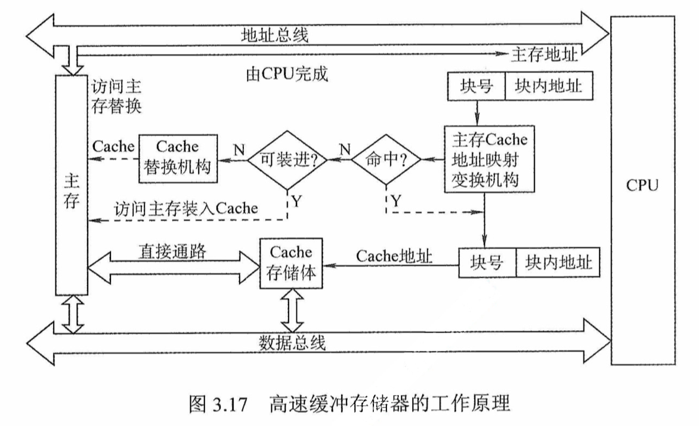
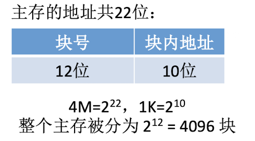
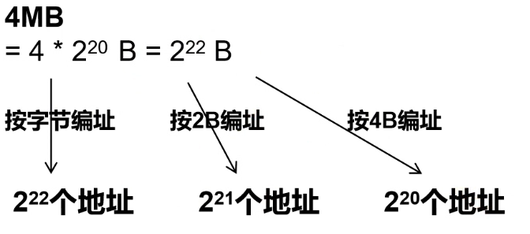
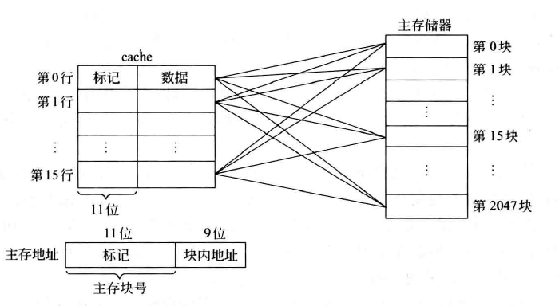
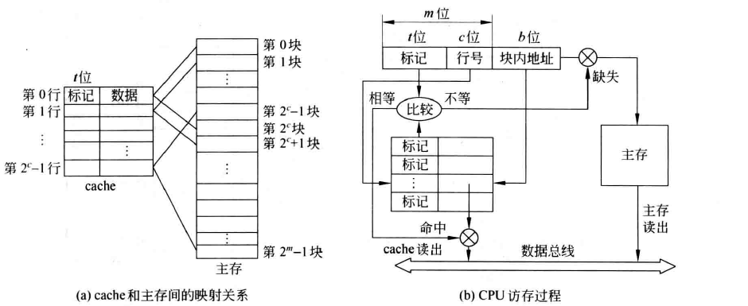
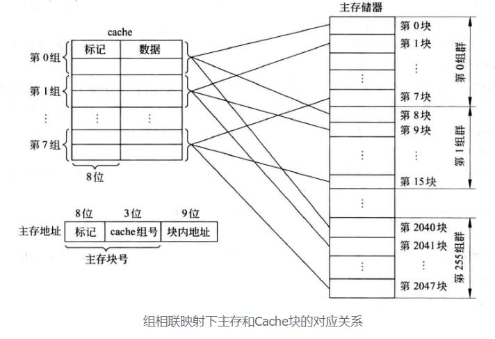
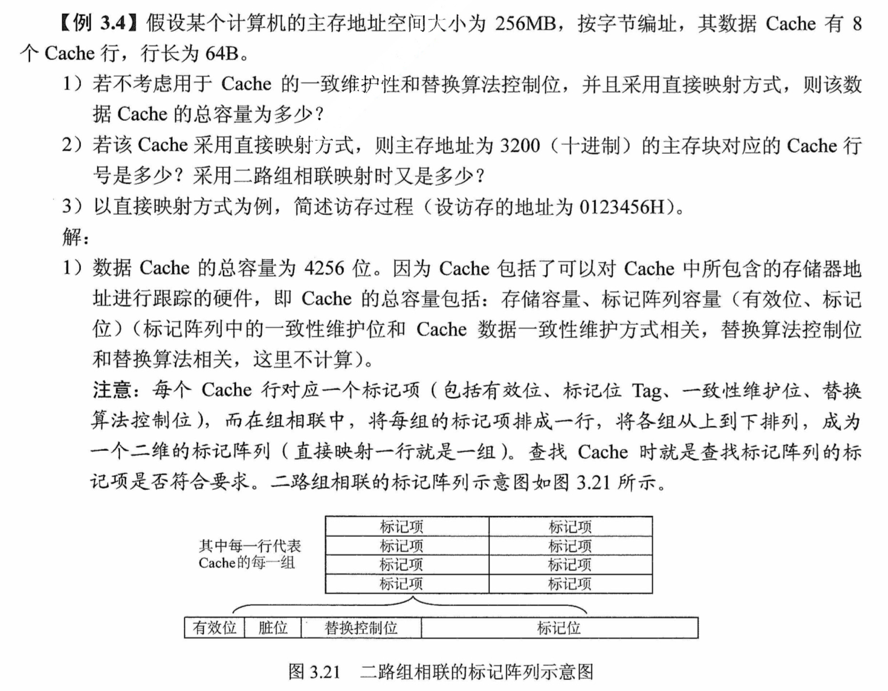
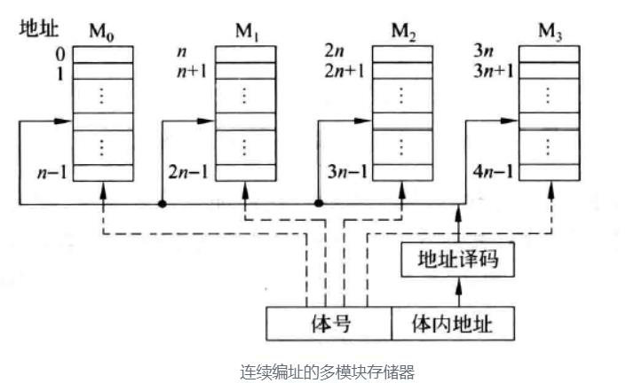

### 程序访问的局部性原理

- **时间局部性**
  - 刚被访问过的单元很可能不久又被访问
  - eg: 循环结构的指令代码
- **空间局部性**
  - 刚被访问过的单元的邻近单元很可能不久被访问
  - eg: 数组元素,顺序执行的指令代码

- 程序局部性原理的基本含义是:
  - **在程序执⾏的过程中, 程序对主存的访问是不均匀的。**

- **评估标准**
  - 重复引用相同变量的程序有良好的时间局部性
  - 对数组以步长为 k 的模式进行引用时，k 越小，空间局部性越好
  - 对取指令而言，循环有好的时间和空间局部性，循环体越小，循环迭代次数越多，局部性越好
  - 空间局部性对于单个变量来说是没有意义的

- **应用**：**高速缓冲技术**就是利用局部性原理，把当前访问单元以及邻近单元作为一个主存块一起放入一个高速的、容量较小的 Cache 中，使得 CPU 的访存操作大多数针对 Cache 进行，从而提高程序的执行速度

### Cache 的工作原理

> [! ] Cache 用 SRAM 实现，速度快，成本高
> Cache 对程序员来说是透明的，所有过程都由硬件自动实现

#### 图示

  

- **CPU 与 Cache**之间的数据交换以**字**为单位 (Cache 中的 " 块 " 也 称为 " 行 ")
- **主存和 Cache**之间的数据交换以**Cache 块**为单位 (主存中的 " 块 " 又称 页/页面/页框)
- 在一些题目中也会采取: Cache 和主存同时访问
  - 如果 Cache 命中则停止访问主存
  - 若未命中先将块调用到 Cache，CPU 再访问 Cache 取出所需数据等方式，具体以题目说明为准

#### 主存地址可拆分为 (块号，块内地址)

  

- 块号可以理解为块索引
- 块内地址理解为块内编号
- 真实地址 = 块号 $\times$ 块大小 + 块内地址

#### 命中与缺失

  若 CPU 访问单元所在的块在 Cache 中，则称 Cache 命中，命中概率称为命中率 $$p_{命中} = \frac{命中次数}{访问总次数}$$

  若不在 Cache 中，则为 Cache 缺失 (Cache miss)，其概率称为缺失率

  $$p_{不命中} = \frac{不命中次数}{访问总次数}$$

- **平均访问时间**:
  - 设 Cache 访问时间为 $T_c$，主存访问时间为 $T_m(T_m \gg T_c)$
  - CPU 在 " Cache- 主存 " 层次的平均访问时间为:

$$
T_a = p \times T_c + (1- p) \times (T_m + T_c)
    = T_c + (1- p) \times T_m
$$

> [! ] 命中率的影响:
 因为程序访问的局部性特点，Cache 的命中率可以达到很高，接近于 1
 因此，虽然 $T_m \gg T_c$，但最终平均访问时间仍可接近 Cache 的访问时间

### Cache 的地址映射方式

Cache 的**地址映射方式**是指将主存的地址空间映射到 Cache 的地址空间，从而加速 CPU 对数据的访问
当 CPU 访问某个主存单元时，地址映射规则允许它在 Cache 的特定行中查找该单元，而不是遍历整个 Cache。这种机制极大提高了访问速度

##### 编址方式

#### 全相联映射

##### 基本思想: 一个主存块可装入 Cache**任意一行**中

- 每行的标记用于指出该行取自主存的哪个块。因为一个主存块可能在任意一行中，所以需要比较所有 Cache 行的标记

##### 地址字段: 主存地址中只有标记和块内地址两个字段

  $$\boxed{\text{标记 (m 位)} \mid \text{块内地址 (低位地址)}}$$

- 全相联映射方式下，只要有空闲 Cache 行，就不会发生冲突，块冲突概率很低

##### 图示

  
  

##### 优缺点

- 优点
  - Cache 存储空间利用充分，命中率高，灵活性高

- 缺点
  - 查找 " 标记 " 最慢，有可能需要对比所有 Cache 行/块的标记

##### CPU 访存操作

- 首先将主存地址的高位标记与 Cache 各行的标记进行比较，

- 若有一个相等且对应有效位为 1，则命中，根据块内地址从该 Cache 行中取出信息

- 若无一相等，则不命中，此时 CPU 从主存中读出该地址所在的一整块信息，送到对应的 Cache 行中，将有效位置为 1，并将标记设置为主存地址中的高位，同时将该地址对应的内容送 CPU

##### 标记比较过程

标记比较过程通常采用按内容寻址的相联存储器实现，具体实现形式为:

- 对每一个 Cache 行设置一个比较器
- 比较器位数等于标记字段的位数
- 访存时根据标记字段的内容访问 Cache 行中的主存块
- 这样也就导致全相联映射的开销较大

#### 直接映射

##### 基本思想

- 直接映射的基本思想是把主存的每一块映射到固定的一个 Cache 行中，其映射关系为:$$\text{Cache 行号} = \text{主存块号} \% \text{ Cache 行数}$$

- 主存中的每一块都只能装入 Cache 中的唯一位置，若该位置已有内容，则产生块冲突，原来的块将被无条件替换出去

##### 地址字段

  $$\boxed{\text{标记(t 位)} \mid \text{Cache 行号(c 位)} \mid \text{块内地址(低位)}}$$

- 高 t 位为标记 $t = m - c  = \log_2{(\frac{\text{主存大小}}{\text{Cache 大小}})}$
- 中间 c 位为 Cache 行号 $c = \log_2{(\text{Cache 行数})}$
- 剩下的低位地址为块内地址

##### 图示

 
    

##### 优缺点

- 优点
  - 对任意地址，都可以直接根据块号确定它**唯一**有可能在 Cache 中存放的位置，只要一次对比
- 缺点
  - 其他地方有空闲 Cache 块，相比于全相联映射，灵活性差一些，空间利用率也不充分

##### CPU 访存操作

- 首先根据访存地址的中间 c 位，找到对应的 Cache 行号，将对应 Cache 行中的标记和主存地址的高 t 位标记进行比较
- 若相等且 Cache 行有效位为 1，则 Cache hit，此时根据主存地址中低位的块内地址，在对应的 Cache 行中存取信息
- 若不相等或有效位为 0，则 Cache miss，此时 CPU 从主存中读出该地址所在的一整块信息，送到对应的 Cache 行中，将有效位置为 1，并将标记设置为地址中的高 t 位，同时将该地址对应的内容送 CPU

#### 组相联映射

##### 基本思想

- 将 Cache 所有行分成 $Q=2^k$ 个大小相等的组，每组有 r 行
- 每个主存块被映射到 Cache 固定组中的任意一行，
- 即采用**组间直接映射、组内全相联映射**的方式。称为 r 路组相联

##### 地址字段

   $$\boxed{\text{标记 (t 位)} \mid \text{组号 (c 位)} \mid \text{块内地址 (低位)}}$$

- 高 t 位为标记 $t = m - c = \log_2{(\frac{\text{主存块数}}{\text{Cache 组数}})}$
- 中间 c 位为组号 $c = \log_2{\text{(Cache 组数)}} = \log_2{(\frac{\text{主存块数}}{r}) }$
- 剩下的低位地址为块内地址

##### 图示

 
 

- 组相联映射结合了直接映射和全相联映射的优点
  - 当 Q = 1 时，为全相联映射
  - 当 r = 1 时，为直接映射

- 组相联映射的关系可以定义为 $$\text{Cache 组号} = \text{主存块号(主存块数)} \% \text{ Cache 组数} = \frac{\text{Cache 行数}}{\text{r}}$$

##### 优缺点

- 优点
  - 结合了全相联映射中的自由度——组内随意存放
  - 结合了直接映射快速找到组号的速度，综合效果比较好

##### CPU 访存过程

- 首先根据访存地址中间的组号找到对应的 Cache 组，将对应的 Cache 组中每个行的标记与主存地址的高位标记进行比较
- 若有一个相等且有效位为 1，则访问 Cache 命中，此时根据主存地址中的块内地址，在对应 Cache 行中存取信息
- 若都不相等或相等但有效位为 0，则不命中，此时 CPU 从主存中读出该地址所在的一整块信息，送到对应的 Cache 组中的任意一个空闲行中，将有效位置为 1，并将标记设置为主存地址中的高位，同时将该地址对应的内容送 CPU

##### 比较器

- 对于 r 路组相联映射，每组需要设置 r 个比较器，用于对 r 个 Cache 行的标记进行同时比较
  - 同时进行几个位置的比较，就需要几个比较器

#### 地址映射总结

- **全相联映射**:
  - 可以映射到所有 Cache 行
  - 把 Cache 分成 **1** 个组
- **直接映射**:
  - 每个主存块只能映射到 Cache 中的某一固定行
  - 把 Cache 分成 **Cache 行数** 个 s 组
- **r 路组相联映射**:
  - 可以映射到 **r** 行
  - 把 Cache 分成 **Cache 行数 / r** 个组

- **命中率**:
  - 直接映射 < 组相联映射 < 全相联映射

- **标记位判断时间开销**:
  - 直接映射 < 组相联映射 < 全相联映射

- **标记所占的额外空间开销**:
  - 直接映射 < 组相联映射 < 全相联映射

- **关联度**: 一个主存块映射到 Cache 的行数
  - 关联度越低，命中率越低，判断是否命中的开销越小，命中时间越短
  - 直接映射: 关联度为 1。每个主存块只能映射到 Cache 中的一个特定行
  - 全相联映射: 关联度为 Cache 行数。存的每个块可以映射到 Cache 中的任意行
  - r 路组相联映射: 关联度为 r。主存块可以映射到某一组中的任意 r 个 Cache 行，组的大小为 r

- **比较器**:
  - 比较器的位数 = tag 的位数，用于对比 tag
  - 当地址无法精确到 Cache 行时，需要用到比较器

| 映射方式     | 比较器个数【与关联度相等】 | 比较器位数   |
| -------- | ------------- | ------- |
| 直接映射     | 1             | tag 的位数 |
| r 路组相联映射 | r             | tag 的位数 |
| 全相联映射    | Cache 行数      | tag 的位数 |

### Cache 中主存块的替换算法

- **随机算法**: 随机地确定要替换的 Cache 行。没有依据程序访问的局部性原理，因此可能命中率较低
  - 优点 实现简单
  - 缺点 完全没有考虑局部性原理，命中率低，实际效果很不稳定

- **先进先出算法 (FIFO)**: 选择最早调入的 Cache 行进行替换。没有依据程序访问的局部性原理，因为最早进入的主存块也有可能是当前经常用到的
  - 优点 实现简单，最开始按#0#1#2#3 放入 Cache，之后轮流替换#0#1#2#3
  - 缺点 FIFO 依然没考虑局部性原理，最先被调入 Cache 的块也有可能是被频繁访问的

- **最近最少使用算法 (LRU)**: 根据程序访问的局部性原理，选择近期内最久未被访问过的 Cache 行进行替换

  - LRU 算法对每个 Cache 行设置一个计数器 (即 LRU 替换控制位)，用计数值来记录主存块的使用情况，并根据计数值选择淘汰某个块
  - 计数值的位数与 Cache 组中行数有关。二路时有 1 位，四路时有 2 位，…，$2^k$ 路时有 k 位
  - 计数器的变化规则为:(计数值越大的行中的主存块越是最近最少用)
    - `命中时`，被访问的行的计数器清零，比其低的计数器加 1，其余不变
    - `未命中且该组还有空闲行时`，新装入的行的计数器设为 0，其余全加 1
    - `未命中且该组无空闲行时`，计数值最大 (此时该计数值一定为 $2^k-1$) 那一行的主存块被淘汰，新装入的行的计数器设为 0，其余加 1

  - 采用四路组相联，有 5 个主存块{1,2,3,4,5}映射到 Cache 的同一组，主存访问序列为{1, 2, 3, 4, 1, 2, 5, 1, 2, 3, 4, 5}，采用 LRU 算法的替换过程如图所示。图中左边的数字是对应 Cache 行的计数值，右边的数字是存放在该行中的主存块号 (主存块数)

  

  - Cache 块的总数 = 2n，则计数器只需 n 位。且 Cache 装满后所有计数器的值一定不重复

  - 优点
    - 基于 " 局部性原理 "，近期被访问过的主存块，在不久的将来也很有可能被再次访问，因此淘汰最久没被访问过的块是合理的。LRU 算法的实际运行效果优秀，Cache 命中率高

  - 缺点
    - 当集中访问的存储区超过 Cache 组大小时 (主存块数量 > Cache 行的数量)，命中率可能变得很低，出现频繁的换入换出现象。例如，当上述访问序列变为 1, 2, 3, 4, 5, 1, 2, 3, 4, 5… 时，Cache 每组只有 4 行时，则命中率为 0。这种现象称为抖动现象

> [! ] **抖动现象**: 频繁的换入换出现象 (刚被替换的块很快又被调入)
> 抖动的**根本原因**是内存过载

- 最近不经常使用算法 (LFU)
  - 最近不经常使用算法 为每一个 Cache 块设置一个 " 计数器 "，用于记录每个 Cache 块被访问过几次。当 Cache 满后替换 " 计数器 " 最小的

  - 缺点
    - 曾经被经常访问的主存块在未来不一定会用到 (如: 微信视频聊天相关的块)，并没有很好地遵循局部性原理，因此实际运行效果不如 LRU

### Cache 的一致性问题

#### **写命中**时的策略 【修改的数据在 Cache 中】

##### 全写法/直写法/写直通法 【直接写】

- **机制**：CPU 将数据同时写入 Cache 和主存。(当块要被替换时，不需要写入主存)

- **优点**：实现简单，随时确保主存和 Cache 数据的一致（单 CPU）

- **缺点**：增加了访存次数，降低了效率

> [! ] 对于多核 CPU 和 DMA 高速外设无论采用写回法还是直写法都存在 Cache 和主存数据不一致的问题，需要其他同步机制来解决

##### 写缓冲 (Write Buffer)

**机制**：在 Cache 和主存之间加入一个写缓冲区（FIFO 队列），CPU 将数据写入 Cache 和写缓冲，缓冲区再写入主存，解决 CPU 与主存速度不匹配的问题。

> [! ] 使用写缓冲，CPU 写的速度很快

- **优点**：若写操作不频繁，则效果很好

- **缺点**：若*写操作很频繁，可能会因为写缓冲饱和而发生阻塞*

##### 回写法 【回头再写】

- **机制**：写命中时仅更新 Cache，不立即写回主存，只有当该块被替换时才写入主存。
- 需要给每个 Cache 行设置一个*修改位 (也叫脏位、一致性维护位)*

  - 脏位 == 1，表示该 Cache 行中的数据被修改过，替换时需要写回主存

  - 脏位 == 0，则说明未被修改过，直接替换即可

- **优点**：减少了访存次数

- **缺点**：存在数据不一致的隐患

> [! ]  Cache 行的内容
>
> $$\boxed{\text{标记} \mid \text{有效位} \mid \text{脏位/一致性维护位} \mid \text{替换控制位} \mid \text{块内地址}}$$

[Cache 行的地址构成 (基于地址角度)](#cache-行的地址构成-基于地址角度)

#### **写不命中**时的策略 【修改的数据只在主存中】

##### 写分配法

- **机制**：

  - **写穿方式**：更新主存，然后将该块调入 Cache。
  - **写回方式**：将主存块调入 Cache，再更新 Cache 中的数据
- **优点**：可以利用程序的空间局部性
- **缺点**：每次写不命中时都要从主存读一个块到 Cache 中，增加了读主存的开销

  > [! ] **回写法和写分配法**一同使用, 都会导致 Cache 和主存内容不一致

##### 非写分配法

- 只更新主存单元，不把主存块调入 Cache 中
- 优点：减少了读主存的开销
- 缺点：没有利用空间局部性

> [! ] 全写法与非写分配法一同使用

### Cache 行的地址构成 (基于地址角度)

Cache 行的地址与 Cache 地址不同，它由五个部分构成：

$$
\boxed{有效位 \mid 脏位 \mid替换信息位 \mid Tag (标志位) \mid   块内数据位}
$$

1. **有效位**
   - 用于判断该 Cache 行的数据是否有效，**一定存在且为 1 bit**

2. **脏位 (修改位、一致性维护位)**
   - 用于在数据被替换时，判断是否修改过，从而决定是否写回主存
   - **写回法** (write-back) 时有效，占用 `1 bit`
   - **直接写法 (write-through) 时，不占用位数**
3. **替换信息位**
   - 根据映射方式和替换算法决定是否存在，用于标记替换 Cache 时要被换出的行
   - **直接映射**：主存块唯一映射，无需替换信息位，`0 bit`
   - **全相联映射**：
     - RAND：`0 bit`
     - FIFO 或 LRU：$log_{2}(\text{行数})$ bit
   - **组相联映射**：
     - RAND：`0 bit`
     - FIFO 或 LRU：$log_{2}(\text{路数})$ bit
4. **Tag (标志位)**
   - 由物理地址位数、Cache 总行数、Cache 块大小和映射方式决定
   - **直接映射**：
     - *Tag* = 物理地址位数 - 行号位数 - 块内地址位数
     - *行号位数* = $log_{2}(\text{Cache 总行数})$
   - **组相联映射**：
     - *Tag* = 物理地址位数 - 组号位数 - 块内地址位数
     - *组号位数* = $log_{2}(\frac{\text{Cache 总行数}}{\text{路数}})$
   - **全相联映射**：
     - *Tag* = 物理地址位数 - 块内地址位数
5. **块内数据位数**
   - 由 Cache 块大小决定
   - 例如：每个 Cache 块为 64B，按字节编址则 $log_{2}(64) = 6$，因此块内地址位数为 `6 bit`

#### 隐含内容 (不额外占用标志位)

- **组号 (组相联映射)**
  - 由 Cache 总行数与几路组相联映射决定
  - 组号位数 = $log_{2}(\text{Cache 总行数} / \text{路数})$

- **行号 (直接映射)**
  - 由 Cache 总行数决定
  - 行号位数 = $log_{2}(\text{Cache 总行数})$

### Cache 的计算问题

> [!TIP] **相关公式**
>
> - **注意编址方式 `->` 块内地址位数**
> - Cache 容量 = 数据区容量 + 标记区容量
> - 数据区容量 = Cache 行大小 * Cache 总行数
> - 标记区容量 = (标记 + 有效位 + 脏位 + 替换控制位) * Cache 总行数

> [! ] 设主存块号 (主存块数) 位数共 m 位，有效位通常为 1 位，回写法时脏位为 1 位，全写法时无脏位。根据给定条件和 Cache 与主存的映射方式，可以计算出 Cache 总容量
>
> $$Cache 行数 = 2^k, Cache 行大小 = 2^p$$

#### 直接映射

- 直接映射，Cache 行数 = $2^c$，则标记位数 t = m - c

  - $\text{Cache 行号} = \text{主存块号(主存块数)} \% \text{ Cache 行数}$

    $$\boxed{\text{标记(t 位)} \mid \text{Cache 行号(c 位)} \mid \text{块内地址(p 位)}}$$

  - 高 t 位为标记 $t = m - c = \log_2{(\frac{\text{主存大小}}{\text{Cache 大小}})} = \log_2{(\frac{\text{主存块数}}{\text{Cache 行数}})}$

  - 中间 c 位为 Cache 行号 $c = \log_2{(\text{Cache 行数})}$

#### 全相联映射

- 全相联映射，则标记位位数 t = m

    $$\boxed{\text{标记 (t 位)} \mid \text{块内地址 (p 位)}}$$

#### r 路组相联映射

- r 路组相联映射，主存块数 = $2^m$, Cache 行数 = r, Cache 组数 $Q = 2^c$，则标记位数 t = m - c

  - Q = 1 时，变为全相联映射；r = 1 时，变为直接映射

    $$\boxed{\text{标记 (t 位)} \mid \text{组号 (c 位)} \mid \text{块内地址 (p 位)}}$$

  - 高 t 位为标记 $t = m - c = \log_2{(\frac{\text{主存块数}}{\text{Cache 组数}})} = \log_2{(\frac{\text{主存块数}}{\text{Q}})}$

  - 中间 c 位为组号 $c = \log_2{\text{(Cache 组数)}} = \log_2{(\frac{\text{Cache 行数}}{r}) }$

- 最后，将标记区位数与数据区位数相加，再与 Cache 总行数相乘，即可得到 Cache 总容量

### Cache 容量计算

#### 指令 Cache 和数据 Cache

- 统一 Cache 虽然设计和实现相对简单，但可能在存取数据时要同时在同一 Cache 中读指令，由此会引发冲突。可以采用分离 Cache 结构解决该问题

- 将指令 Cache 和数据 Cache 分离，不仅能增大计算机的并行效率，还可以充分利用指令和数据的不同局部性来优化性能

> [! ] 数据 Cache ≠ Cache 数据区
>
> - **数据区容量** = Cache 行大小 × Cache 总行
> - **标记区容量** = (标记位数 + 有效位 + 脏位 + 替换控制位) × Cache 总行数
> - **Cache 总容量** = 数据区容量 + 标记区容量 = Cache 行数 × (标记区位数 + Cache 块大小)

#### Cache 总容量计算

- **Cache 总容量** = Cache 行数 × (Cache 行标记项位数 + Cache 块位数)
- 数据 Cache 和 Cache 数据区是不同的概念，计算时需要考虑标记区和数据区的总容量

## CSAPP 的理解

 

1. 组选择
2. 行匹配
3. 字抽取

### 高速缓存行、组、块的区别

### 直接映射

### 2 路组相联

  

### 全相联

## 例题

