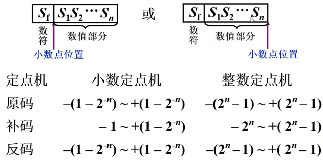
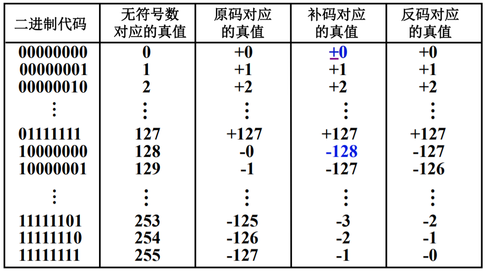
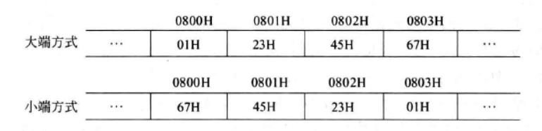

## 数制与编码

在计算机内部，数值数据的表示方法有两种:
一种是 **直接用二进制数** 表示，
另一种是采用 **二进制编码的十进制数 (Binary Coded Decimal Number, BCD)** 表示

### 进位计数制及其相互转换

#### 进位计数法

$$
\begin{array}{|c|c|}  
\hline  
2^n & 数值 \\  
\hline  
2^0 & 1\\  
2^1& 2 \\  
2^2 & 4 \\  
2^3 & 8 \\  
2^4 & 16 \\  
2^5 & 32 \\  
2^6 & 64 \\  
2^7 & 128 \\  
2^8 & 256 \\  
2^9 & 512 \\  
2^{10} & 1024 \\  
2^{15} & 32768 \\  
2^{16} & 65536 \\  
\hline  
\end{array}  
$$

$$
\begin{array}{|c|c|c|c|c|c|c|c|}  
\hline  
0 & 1 & 2 & 3 & 4 & 5 & 6 & 7 \\  
\hline  
0000 & 0001 & 0010 & 0011 & 0100 & 0101 & 0110 & 0111 \\  
\hline  
8 & 9 & A & B & C & D & E & F \\  
\hline  
1000 & 1001 & 1010 & 1011 & 1100 & 1101 & 1110 & 1111 \\  
\hline  
\end{array}  
$$

#### 不同进制相互转换


##### 除基取余法

	  基数  商      余数  
	  2 ┃  43  
		 ┗━━━━━━  
	  2 ┃  21   …… 1(末位)  
		 ┗━━━━━━  
	  2 ┃  10   …… 1
		 ┗━━━━━━  
	  2 ┃   5   …… 0  
		 ┗━━━━━━  
	  2 ┃   2   …… 1
		 ┗━━━━━━  
	  2 ┃   1   …… 0  
		 ┗━━━━━━  
			  0   …… 1(首位)  
	  十进制 43 就等于二进制 101011

##### 乘基取整法

	  基数  余数      商
	  
	  2 ┃  0.375
		 ┗━━━━━━
	  2 ┃  0.75   …… 0(首位)
		 ┗━━━━━━
	  2 ┃  1.5    …… 1
		 ┗━━━━━━
	  2 ┃  1.0    …… 1
		 ┗━━━━━━
		 0.0      …… 1(末位)
	  
	  十进制 0.375 就等于二进制 0.011

### 真值和机器数

- **真值**: 机器数代表的实际值 *【真值不一定是十进制数】*
- **机器数**: 计算机中用*二进制*数表示的数

## 定点数的编码表示

### 机器数的定点表示

- 根据 `小数点的位置是否固定`，计算机有两种数据格式:`定点数` 和 `浮点数`

> 任意一个实数 (浮点数) 都可以用一个定点小数和一个定点整数来表示

- `定点整数`: 小数点固定在最右边, 一般用来表示整数
- `定点小数`: 小数点固定在最左边, 一般用来表示浮点数的尾数部分
- `单精度浮点数`: 32 位, 1 位符号位, 8 位指数位, 23 位尾数位
- `双精度浮点数`: 64 位, 1 位符号位, 11 位指数位, 52 位尾数位



## 原码、补码、反码、移码

对于机器数 $x$ 的表示为 $x = X_{n-1}X_{n-2} \cdots X_{1}X_{0}$

### 原码 (" 符号 - 数值 " 表示法)

#### 原码的表示规则

$$
\begin{align}
当 x 为正数时，& [x] _{原} = 0 \quad X_{n-2} \cdots X_{1}X_{0} \\
当 x 为负数时，& [x] _{原} = 1 \quad X_{n-2} \cdots X_{1}X_{0} \\
\end{align}
$$

#### 原码 0 的表示

$$
\begin{align}
[+0]_{原} &= 0 \quad \underbrace{00\cdots0}_{\text{全0}} \\
[-0]_{原} &= 1\quad \underbrace{00\cdots0}_{\text{全0}} \\
\end{align}
$$

#### 原码表示的优缺点

- **优点**:
  - 原码与真值对应关系直观

- **缺点**:
  - 0 的表示不唯一
  - 原码运算中符号位和数值部分需要分开处理，运算效率低

### 补码

#### 补码的表示规则

$$
\begin{align}
当 x 为正数时，& [x] _{补} = [x]_{原} = 0X_{n-2} \cdots X_{1}X_{0} \\
当 x 为负数时，& [x]_{补} = 2^{n} + x \\
\end{align}
$$

- 对于负数的补码，将原码的符号位不变，数值部分取反加 1

> [! ] 对于字长 $n + 1$ 的数来说，$-2^n$ 有补码表示，但是没有原码表示

#### 补码 - 原码转换技巧

- **正数**，补码和原码相同
- **负数**，先找出原码 **最低位的 1**，从该位（k 位）开始，
  比该位高的 **数值部分** 取反（符号位不变）
    比该位低的**全部保留不变**，得到补码：

  $$
  [x]_{原} = X_{n-1}X_{n-2} \cdots X_{1}X_{0}
  $$

  设 $X_{k} = 1; \  \forall \  i < k \  X_{i}  \equiv 0$

  $$
  [x]_{补} = X_{n-1}\overline{X}_{n-2}\overline{X}_{n-3} \cdots \overline{X}_{k+1} \quad \boxed{{X_{k}}} \cdots X_{0}
  $$

  例如：x = -1011B，则

  $$
  [x]_{原} = 1100 1011B \quad [x]_{补} = 11110101B
  $$

- **相反数** 的补码转换：先找出补码 **最低位的 1**，从该位（k 位）开始，
    比该位高的 **所有部分** 取反（包括符号位），
    比该位低的 **全部保留不变**，得到原码：

  $$
  [x]_{补} = X_{n-1}X_{n-2} \cdots X_{1}X_{0}
  $$

  设 $X_{k} = 1; \  \forall \  i < k \  X_{i}  \equiv 0$

  $$
  [-x]_{补} = \overline{X}_{n-1}\overline{X}_{n-2}\overline{X}_{n-3} \cdots \overline{X}_{k+1}\quad \boxed{{X_{k}}} \cdots X_{0}
  $$

  例如：x = -1011B，则

  $$
  [x]_{补} = 11110101B \quad [-x]_{补} = 0000 1011B
  $$

#### 补码 (负数) 的快速计算

> [! ] 对于 n+1 位, 注意 $-2^n$

- **取反加 1**: 对于任何负数，补码可以通过 **取反所有位** 并在结果上 **加 1** 来快速计算
- **真值转换**: 当补码已知时，判断符号位（最高位），若为 1 表示负数，可以 **取反加 1** 得到原值

$$
[x]_{\text{原}} \underset{\text{正数不变；负数符号位不变，数值位取反，再加一}}{\overset{\text{正数不变；负数符号位不变，数值位取反，再加一}}{\rightleftarrows}} [x]_{\text{补}} \underset{\text{符号和数值位取反，再加一}}{\overset{\text{符号和数值位取反，再加一}}{\rightleftarrows}} [-x]_{\text{补}}
$$

- 8 位表示 $[x]_{补} = x + 2^8 \mod 2^8, 2^8 = 256$
  - $[-3]_{原}$ = 1000 0011
  - $[-3]_{补}$ = 1111 1101

 > 对于已知补码 1111 1101 和 101 的补码效果相同 [符号扩展]( #零扩展和符号扩展 )
 > 都是 101 = -4 + 1 = -3

- 16 位表示 $[x]_{补} = x + 2^{16} \mod 2^{16}, 2^{16} = 65536$
  - $[-130]_{原}$ = 1000 0000 1000 0010 = 8002H
  - $[-130]_{补}$ = 1111 1111 0111 1101 = FF7DH

#### 特殊的补码

$$
\begin{align}
[-1]_{\text{补}} &= 1\quad \underbrace{11\cdots1}_{\text{全1}} \\
[+0]_{\text{补}} &= 0\quad \underbrace{00\cdots0}_{\text{全0}} \\
[-2^n]_{\text{补}} &= 1\quad \underbrace{00\cdots0}_{\text{全0}} \\
[2^n -1]_{\text{补}} &= 0 \quad \underbrace{11\cdots1}_{\text{全1}}
\end{align}
$$

- 例如：
- 2009 年题目中 -9 = -1 - 8 = FFFFH - 0008H = FFF7H
- 🌟对于 $-2^n$ 补码表示是 $1 \quad \underbrace{00 \cdots 00}_{n \text{ 个 } 0}$【2018 年选择题】
- 对于 $n + 1$ 位补码，$-2^{n}$ 具有补码表示，但 $2^{n}$ 没有

#### 补码的优点

- 0 的表示唯一
- 补码的运算规则简单：
- 可以用加法实现减法
- 符号位可以和数值位一起参与运算
- 相比原码、反码，*补码可以多表示一个最小负数。*
- 与反码相比，*补码不需要考虑循环进位。*

### 反码

#### 反码和补码的关系

- 负数的 `反码` = 各位取反
- 负数的 `补码` = 负数的反码 + 1 = 各位取反 + 1

#### 反码 0 的表示

$$
\begin{align}
[+0]_{反} &= 0 \quad 00\cdots0 \\
[-0]_{反} &= 1\quad 00\cdots0 \\
\end{align}
$$

#### 反码的缺点

- 0 的表示不唯一
- 表示范围比补码少一个最小负数
- 运算时需要考虑**循环进位**

#### 反码循环进位的证明【了解】

考虑两个 n 位的二进制数，它们按位置表示法分别为 `X` 和 `Y`
其反码运算为 $[X]_{反} + [Y]_{反}$
为了使反码运算的结果与位置表示法的结果等效，我们需要满足以下等式：

$$
[X] _{反} + [Y]_{反} = [X + Y]_{反} \qquad (1)
$$

我们可以根据 `X + Y` 的进位情况进行讨论:

- 当 `X >= 0, Y >= 0, X + Y >= 0` 时，等式 `(1)` 显然成立
- 当 `X` 和 `Y` 的符号不同时，我们有:

   $$
    [X] _{反} + [Y]_{反} = X + Y + 2^n - 1 \qquad (2)
   $$

  - 若 `X + Y > 0`，则 `(2)` 式会溢出，我们需要舍去其最高位 (相当于减去 $2^n$)，再加上 `1`，即可得到与 `(1)` 式匹配的结果
  - 若 `X + Y < 0`，则 `(2)` 式不会溢出，其结果与 `(1)` 式匹配

- 当 `X < 0, Y < 0, X + Y < 0` 时，我们有:

   $$
    [X] _{反} + [Y]_{反} = X + Y + 2 \times (2^n - 1) \qquad (3)
   $$

    此时 `(3)` 式会溢出，我们需要将 `(3)` 式加 `1`，再舍掉进位，即可得到 `(1)` 式中的结果

综上，无论 `X` 和 `Y` 的符号如何，反码加法的结果都与位置表示法的结果相匹配。这就是反码加法的循环进位规则

### 移码（又称阶码）

- 移码即在真值上加上一个常数 (也称偏置值)
  - 对于 n 位移码来说，偏置值为 $2^{n-1}$
  - 设真值为 $x$，则 $[x]_{移} = x + 2^{n-1}$
  - 也可看作在数轴上向右平移了 $2^{n-1}$ 个单位
- **移码总是用来表示定点整数，不能表示小数。**
- 对于机器数 $x$，它的补码和移码仅第一位不同
- 主要用来表示浮点数的阶码
- **几个常见的移码**：

$$
\begin{align}
[-2^{n-1}]_{\text{移}} &= \underbrace{00 \cdots 00}_{n \text{ 个 } 0} \\
[+0]_{\text{移}} = [-0]_{\text{移}} &= 1 \underbrace{0 \cdots 0}_{(n-1) \text{ 个 } 0}
\end{align}
$$

## 机器数 x 表示范围

对于字长为 n + 1 的 机器数 x

| 编码方式    | 表示范围                                           |
| ------- | ---------------------------------------------- |
| 原码      | $-2^{n-1} + 1\leq x \leq 2^{n-1} - 1$ (关于原点对称) |
| 反码      | $-2^{n-1} + 1\leq x \leq 2^{n-1} - 1$ (关于原点对称) |
| 补码      | $-2^{n-1} \leq x \leq 2^{n-1} - 1$(多一个最小负数)    |
| 移码      | $0 \leq x \leq 2^{n} - 1$                      |
| 无符号定点整数 | $0 \leq x \leq 2^{n} - 1$                      |



> 加蓝处为何为 -128？*【解释方式不同】*

二进制代码 10000000 表示负数
忽略符号位取反后 +1 得到其补码也为 1000000
按照原码的定义，10000000 表示 -0，但是补码没有 "+0" 和 "-0" 之分
补码的 0 全用 00000000 表示，多出的 "-0" 用于表示 -128【*最小负数*】
所以补码比其他都多一个最小负数

## 整数的表示和运算

- 整数的小数点隐含在数的最右边, 顾无需表示小数点, 因而整数也被称为 `定点整数`
- 二进制整数的表示
  - 无符号整数 (unsigned integer)
  - 有符号整数 (signed integer)

### 无符号整数的表示

无符号整数没有符号位，所有位都用来表示数值

### 有符号整数的表示

- 现代计算机中, 有符号整数通常用 **补码** 表示

## C 语言中的整数类型

| 类型          | 字节数 | 位数  | 默认符号 | 范围                                          |
| ----------- | --- | --- | ---- | ------------------------------------------- |
| `char`      | 1   | 8   | 无符号  | $[0,255]$                                   |
| `short`     | 2   | 16  | 有符号  | $[-2^{15}, 2^{15}-1] (2^{15}=32768)$        |
| `int`       | 4   | 32  | 有符号  | $[-2^{31}, 2^{31}-1] (2^{31} = 2147483648)$ |
| `long`      | 4   | 32  | 有符号  | $[-2^{31}, 2^{31}-1]$                       |
| `long`      | 8   | 64  | 有符号  | $[-2^{63}, 2^{63}-1]$                       |
| `long long` | 8   | 64  | 有符号  | $[-2^{63}, 2^{63}-1]$                       |
| `unsigned`  | -   | -   | 无符号  | $[0,2^{n}-1]$                               |


## 类型转换

$$2^{7} = 128 \Rightarrow 7FH = 127_{u} = 127$$

$$2^{8} = 256 \Rightarrow FFH = 255_{u} = -1$$

$$2^{15} = 32768 \Rightarrow 7FFFH = 32767_{u} = 32767$$

$$2^{16} = 65536 \Rightarrow FFFFH = 65535_{u} = -1$$

### 整数类型转换


- **字长不变时**，转换仅改变二进制数的解释方式，二进制机器数保持不变
- **字长增加时**，根据数据的有无符号性进行位扩展：
  - 无符号数：执行 0 扩展，新增高位填 0
  - 有符号数：执行符号扩展，高位填充符号位（正数填 0，负数填 1）
- **字长减少时**，进行高位截断，超出目标字长的高位被舍弃
- **运算时字长不一致**，先对字长较短的数进行位扩展，使两者字长一致，再进行计算

##### 长度相同的整数类型之间的转换 (如: 有符号整数和无符号整数之间的转换)


- 不改变计算机内部存储的二进制数, 只是改变了解释方式

```cpp
short x = -1;  // -1 的补码表示为 11...1 short 为 16 位
unsigned short y = (unsigned short)x
printf("x=%d,y=%d\n",x,y); // x = -1,y = 65535 = 2^16 - 1
```

- 分别用有符号整数和无符号整数 **表示** 同一个数, 则 **数值** 不变, 但 **数值的解释** 不同

##### 长度不同的整数类型之间的转换 (如: int 和 short 之间的转换)


- **由低向高** 转换, 先进行 **符号扩展**, 再进行 **解释**

```cpp
short x = -1;  // -1 的补码表示为 11...1 short 为 16 位

int y = x; // 符号扩展后 y = 1111111111111111 int 为 32 位
unsigned int z = x; // 符号扩展后 z = 1111111111111111
printf("x=%d,y=%d\n",x,y); // x=-1,y=-1
printf("x=%d,y=%u\n",x,y); // x=-1,y=4294967295
// %d 解释为有符号整数 输出为 -1
// %u 解释为无符号整数 输出为 4294967295
// 2012 
unsigned short x = 65530
unsigned int y = x
// y 的机器数： 0000 0000 0000 0000 1111 1111 1111 1110
// hex：0x0000FFFAH
```

- **由高向低** 转换, 先进行 **高位截断低位保留**, 再进行 **解释**

```cpp
int x = -2147483647
short y = (short)x
printf("x=%d,y=%d\n",x,y); // x=-2147483647,y=1
printf("x=%d,y=%u\n",x,y); // x=-2147483647,y=1
// x = 1000 0000 0000 0000 0000 0000 0000 0001高位截断
// y = 0000 0000 0000 0001
// %d %u 均输出为 1
```

### 浮点数与整数的变换

```cpp
int i = 785; // 0000 0000 0000 0000 0000 0011 0001 0001
float  f = 1.5678e3; 
double d = 1.5e100; 
```


| 类型转换                                           | 描述                                           |
| ---------------------------------------------- | -------------------------------------------- |
| 无符号数和有符号数                                      | 不改变数据内容，改变解释方式                               |
| 长整数变短整数                                        | 高位截取，低位保留                                    |
| 短整数变长整数                                        | 符号拓展                                         |
| char -> int                                    | 前面补 0                                        |
| int <-> unsigned                               | 都可能溢出丢失数据                                    |
| int-> float                                    | 不会发生溢出，但可能有数据舍入误差</br>【int 31 位数值位转为 24 位尾数】|
| double -> float <br/>double -> int             | 可能发生溢出，可能有舍入误差                               |
| float -> int <br/>double -> int                | 数据向 0 方向截断，损失精度。</br> 浮点数太大可能会溢出             |
| char-> int-> long-> double <br/>float-> double | 范围精度由小变大，无损失                                 |


## 零扩展和符号扩展

- 将小字长向大字长转换时, 有两种方法: 零扩展 和 符号扩展
  - `零扩展`: 将小字长的数的高位补零，适合 `无符号整数`
   
   
   
  - `符号扩展`: 若原数为正数, 则高位补零; 若原数为负数, 则高位补 1，适合有符号整数
   
   

## 数据的存储和排列 (大小端模式)

> 在计算机系统中，我们是以字节为单位的。每个地址单元都对应着一个字节，一个字节为 8bit 两个十六进制数

- **最低有效字节 (LSB)**: 数据的最低字节
- **最高有效字节 (MSB)**: 数据的最高字节



### 大端模式 【人的习惯】

- 存储顺序: 先存储 MSB，再存储 LSB
- 内存的低地址存放数据的高位字节，高地址存放数据的低位字节

### 小端模式

- 存储顺序: 先存储 LSB，再存储 MS B
- 内存的低地址存放数据的低位字节，高地址存放数据的高位字节

> **大端方式**: 现代人正常的阅读顺序，从左向右
> **小端方式**: 古代人的阅读顺序（联想一下对联横批或牌匾），从右至左

### 示例

- 在 32 位计算机中，int 型变量机器数为 `0123 4567H`
  - LSB 为 `67H`
  - MSB 为 `01H`
  - 大端模式: `01H 23H 45H 67H`
  - 小端模式: `67H 45H 23H 01H`


> ans: D

### 边界对齐

- **1 B（char）**: 数据随便放
- **2B（short）**: 数据只能从 2 的整数倍的**地址**开始存放，如 $00H、02H \cdots$
- **4B（int，float）**: 数据只能从 4 的整数倍的地址开始存放，如 $00H、04H \cdots$
- **8B（double）**: 数据只能从 8 的整数倍的地址开始存放，如 $00H、08H \cdots$


#### 结构体对齐

1. 整个结构体变量的对齐方式与其中对齐方式最严格的成员相同
2. 结构体成员在满足其对齐方式的条件下，取最小可用位置作为成员在结构体中的偏移量
3. 结构体的大小必须是最大对齐单位的整数倍，必要时末尾会添加填充字节


