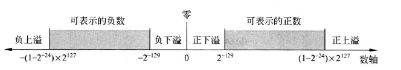
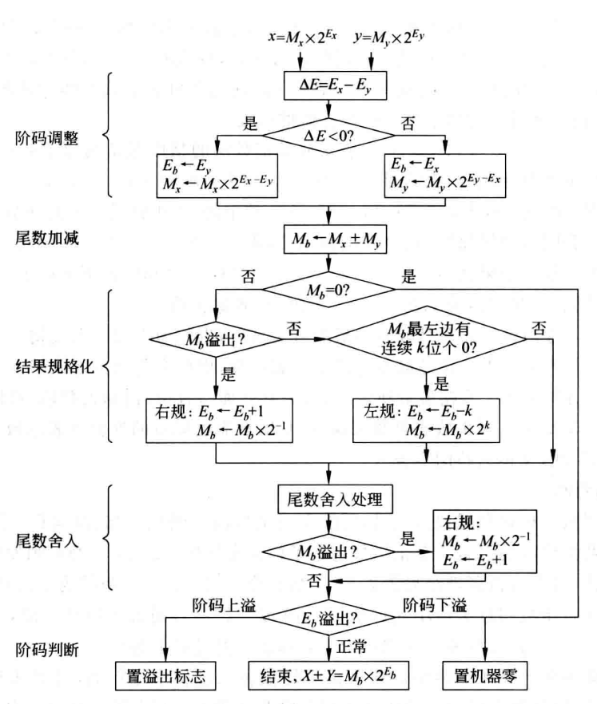
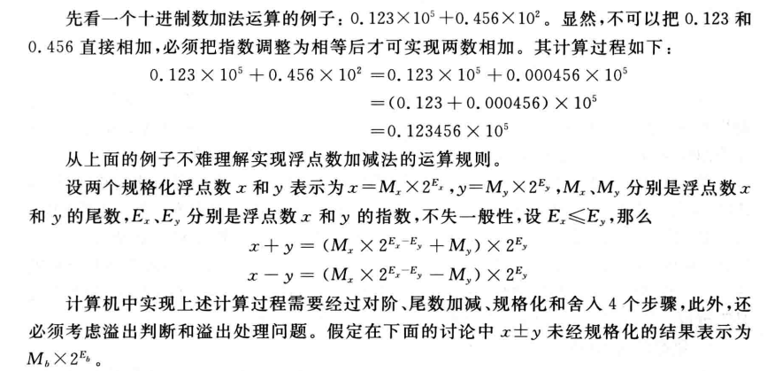
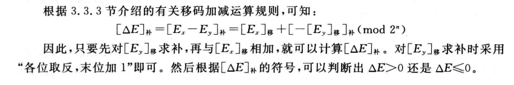
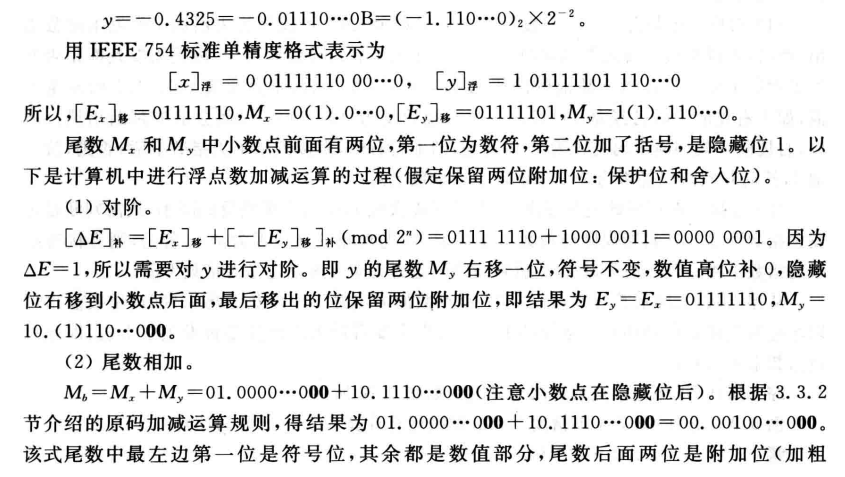

## 浮点数的表示

对于任意一个实数 $X$：

$$
X = (-1)^{S} \times M \times R^{E}
$$

- $S$ 为符号位
- $M$ 为尾数（用原码表示）
- $E$ 为阶码
- $R$ 为基数，通常取 $2$、$4$、$6$

- 通常浮点数格式只需要规定 S、M、E 各自所用的位数、编码方式和所在位置即可

- **阶码的位数决定了浮点数的表示范围，尾数决定了浮点数的精度**

## 浮点数的表示范围和精度【2012、2018】

- 原码的表示范围是关于原点对称的，故浮点格式的表示范围也是关于原点对称的 (尾数用原码表示)

- 数轴上有四个区间不能用浮点数表示 称为 **溢出区**
- 其中 接近 0 的区间 **(下溢区)**、接近无穷大的区间 **(上溢区)**
- 只要尾数是 0 就是 0，不管阶码是多少 这种情况称为 **机器零**
  - 故 机器零的表示不唯一 通常情况下 阶码和尾数同时取 0 来 **唯一** 表示 机器零
  - $+0:0000 \ 0000H$
  - $-0:8000 \ 0000H$
  - 即只要尾数为 0，则令阶码取 0
  - 也有计算机降下溢区的数近似为 机器零 进行处理

## 浮点数规格化

- 目的: 在运算过程中尽可能多的保留有效数字的位数，使有效数字尽量占满尾数数位
- 规格化: 确保了尾数最高位不为 0，即尾数的最高位为 1
- 规格化的操作: 左规和右规【**操作前后都要进行溢出判断**】
  - 左规:【**左规可能进行多次**】
    - 当运算结果的尾数最高位为 0 时，需要进行左规操作
    - 即尾数左移一位，阶码减 1
  - 右规:【**右规最多进行一次**】
    - 当运算结果的尾数有效位进位到了小数点前面，需要进行右规操作
    - 即尾数右移一位，阶码加 1

## IEEE 754 标准

- 该标准提供了两种基本浮点格式：【基数默认为 2】
  - 32 位单精度浮点数（短浮点数 float）
  - 64 位双精度浮点数（长浮点数 double）

- **尾数**：采取*隐藏位策略*的 **原码**

  > [! ] 隐藏位策略
  > 对于规格化浮点数，尾数的最高位默认为 1，不用显式表示出来，这样可以多保留一位有效数字（称为隐藏位），这个隐藏位在小数点之前

  - 例如：$(12)_{10} = (1100)_2$，正常的规格化结果为 $0.1100 \times 2^{4}$，但要隐藏位 1 放在小数点前。故结果为 $1.1000 \times 2^{3}$，此时最高位的 1 隐藏得 $.1000 \times 2^{3}$

- **阶码**：采用 **移码** 表示
  - 移码：阶码的真值加上一个固定的偏移量：$2^{n-1} - 1$，$n$ 为阶码的位数
  - 单精度浮点数的阶码范围为 $-126 \sim 127$，偏置量为 127
  - 双精度浮点数的阶码范围为 $-1022 \sim 1023$，偏置量为 1023
  - 在 IEEE 754 标准中，阶码全为 0 或全为 1 有别的解释
  - 故阶码的范围为 $[1, 2^n -2]$，阶码真值的范围为 $[-2^{n-1} + 1, 2^{n-1} - 1]$

- **格式**：符号 $s$，阶码 $e$ 和尾数 $f$
  - 单精度：1+8+23 = 32 位
  - 双精度：1+11+52 = 64 位

- **真值**
  - 单精度：$(-1)^{s} \times 2^{e-127} \times 1.f$
  - 双精度：$(-1)^{s} \times 2^{e-1023} \times 1.f$

- **规格化浮点数的表示范围**
  - 单精度
    - 最大值：$E = 255 - 1 = 254$，$f = 1.1111\ldots1$，故真值为 $1.11\cdots 1\ \times \ 2^{E-127} = 2^{127}\ \times \ (2-2^{-23}) = 2^{128} - 2^{105}$
    - 最小值：$E = 1$，$f = 0.0000\ldots1$，故真值为 $1.00\cdot1\ \times \ 2^{E-127} = 2^{-126}$
  - 双精度
    - 最大值：$E = 2047 - 2 = 1046$，$f = 1.1111\cdots1$，故真值为 $1.11\cdots 1\ \times \ 2^{E-1023} = 2^{1024}\ \times \ (2-2^{-52}) = 2^{1024} - 2^{971}$
    - 最小值：$E = 1$，$f = 0.0000\cdots1$，故真值为 $1.00\cdot1\ \times \ 2^{E-1023} = 2^{-1022}$

- 阶码全为 0 或者全为 1 的情况

| 类型  | 最大正数                            | 最小正数        | 最大负数                             | 最小负数         |
| --- | ------------------------------- | ----------- | -------------------------------- | ------------ |
| 单精度 | $2^{127} \times (2 - 2^{-23})$  | $2^{-126}$  | $-2^{127} \times (2 - 2^{-23})$  | $-2^{-126}$  |
| 双精度 | $2^{1023} \times (2 - 2^{-52})$ | $2^{-1022}$ | $-2^{1023} \times (2 - 2^{-52})$ | $-2^{-1022}$ |

|     值的类型     |  单精度  |  <  |     <      |           <            |  双精度  |  <   |     <      |            <            |
| :----------: | :---: | :-: | :--------: | :--------------------: | :---: | :--: | :--------: | :---------------------: |
|              |  符号位  | 阶码  |     尾数     |           真值           |  符号位  |  阶码  |     尾数     |           真值            |
|      +0      |   0   |  0  |     0      |           +0           |   0   |  0   |     0      |           +0            |
|      -0      |   1   |  0  |     0      |           -0           |   1   |  0   |     0      |           -0            |
| 正无穷  (+∞) |   0   | 255 |     0      |           +∞           |   0   | 2047 |     0      |           +∞            |
| 负无穷  (-∞) |   1   | 255 |     0      |           -∞           |   1   | 2047 |     0      |           -∞            |
|     NaN      | 0 或 1 | 255 | $f \neq 0$ |          NaN           | 0 或 1 | 2047 | $f \neq 0$ |           NaN           |
|    非规格化正数    |   0   |  0  | $f \neq 0$ | $2^{-126} \times 0.f$  |   0   |  0   | $f \neq 0$ | $2^{-1022} \times 0.f$  |
|    非规格话负数    |   1   |  0  | $f \neq 0$ | $-2^{-126} \times 0.f$ |   1   |  0   | $f \neq 0$ | $-2^{-1022} \times 0.f$ |

- 全 0 阶码，全 0 尾数：+0/-0
  - IEEE 754 标准规定 +0 和 -0 为不同的数，取决于符号位 $s$。一般情况下，+0 和 -0 是等效的

- 全 0 阶码，非 0 尾数：非规格化的数（可以理解为小到无法有隐藏位的数）
  - 隐藏位为 0，阶码（指数）分别为 -126 和 -1022
  - 可以用来处理阶码下溢的问题，计算结果更精确

- 全 1 阶码，全 0 尾数：无穷大
  - 无穷大的符号位取决于 $s$

- 全 1 阶码，非 0 尾数：NaN
  - NaN（Not a Number）表示不是一个数字，用来表示非法操作的结果

- **IEEE 754 例题**
  - 将十进制数 -12.375 转换为 IEEE 754 标准的 32 位浮点数
    - 符号位：1
    - 整数部分：$12 = 1100$
    - 小数部分：$0.375 = 0.011$
    - 阶码：$12 = 1100 = 1.100 \times 2^3$，所以阶码为 $3 + 127 = 130 = 10000010$（8 位）
    - 尾数：$1.1000 11\cdots 0$（23 位）
    - IEEE 754 标准的 32 位浮点数为：$\overbrace{1}^{\text{符号位}} \ \overbrace{10000010}^{\text{阶码}} \ \overbrace{100011\cdots 0}^{\text{尾数}}$
    - 十六进制：C146 0000

  - 求 IEEE 754 单精度浮点数 C0A0 0000H 的十进制表示
    - 二进制：1100 0000 1010 0000 0000 0000 0000 0000
    - IEEE 754 标准：$\overbrace{1}^{\text{符号位}} \ \overbrace{10000001}^{\text{阶码}} \ \overbrace{01000000 00000000 00000}^{\text{尾数}}$
    - 符号位：1
    - 阶码：$10000001 = 128 + 1 - 127 = 2$
    - 尾数：$1.01 = 1.25$
    - 十进制：$-1.25 \times 2^2 = -5$

- **浮点数与定点数的区别**
  - 相同字长，浮点数表示范围更大
  - 精度指一个数含有有效数值的位数，相同字长的浮点数精度较低
  - 浮点数运算时不仅要进行尾数的运算，还要进行阶码的运算，并且运算还要进行规格化，运算更为复杂
  - *浮点数中，运算结果超出尾数的表示范围不一定溢出，只有超出阶码的表示范围才溢出。*

- **浮点数的密度问题**
  - 浮点数分布是不等距且稀疏的，越远离原点越稀疏

## 浮点数的运算

- 浮点数的运算特点是阶码运算和尾数运算是分开的，运算步骤:
  1. 对阶
  2. 尾数求和
  3. 规格化
  4. 舍入
  5. 溢出判断

- 流程图

### 对阶

- 对阶的目的是使两个浮点数的 **阶码相同**，以便进行尾数的运算
- **原则**:小阶向大阶看齐，即阶码小的那个数尾数右移，阶码加 1，直到两个数的阶码相同，右移的位数 = 两个阶码差的绝对值

> [! ] 右移时，符号位不参与移位，数值位要将隐含的 1 右移到小数部分，其余情况高位补 0

- 为了确保运算的精度，尾数右移时，低位保留

### 尾数加减

- 对阶后进行定点原码小叔的加减法运算
- 尾数的隐藏位，保留位也要参与运算
- 加减运算的尾数不一定规格化，需要进行规格化操作处理

### 规格化

- IEEE 754 标准中，浮点数的规格化尾数形式为 $\pm 1.bb \cdots b$。在浮点数加减运算中，尾数可能会发生以下变化：
  - $1.bb \cdots b + 1.bb \cdots b = \pm \textbf{1b}.bb \cdots b$：
    - 在这种情况下，需要进行 **右规** 操作，即**尾数右移一位，阶码加 1**
    - 当最后一位移出时，需考虑舍入处理
    - 最高一位 1 被称为隐藏位，小数点前并不存储这一位
  - $1.bb \cdots b - 1.bb \cdots b = \pm 0.\textbf{00} \cdots \textbf{01}b\cdot b$：
    - 在这种情况下，需要进行 **左规** 操作，即尾数左移一位，阶码减 1，直到第一个 1 移动到小数点的左边

> [! ] 机器内部如何减一： $[Z-1]_{移} = [Z]_{移} + 255_{移}$

- $[Z-1]_{移} = Z - 1 + 127 = [Z]_{移} - 1=  [Z]_{移} + [-1]_{补}$
- $[-1]_{补} = 11111111= 255$

#### 尾数规格化后的处理

- **尾数求和**完毕后，需检查尾数是否符合规格化要求。不满足要求的尾数需进行 **左规或右规** 操作
  - **注意**：规格化操作不涉及符号位，双符号位中的低符号位参与移位

#### 单符号位原码尾数的规格化

- 规格化的原码尾数形式：
  - 正尾数为 $0.1x\cdots x$
  - 负尾数为 $1.1x\cdots x$
- 在尾数左规或右规操作时，空位均补 0

#### 单符号位补码尾数的规格化

- 规格化的补码尾数要求符号位和尾数最高位必须相反，才能算是规格化浮点数
  - 正尾数规格化后为 $0.1x\cdots x$
  - 负尾数规格化后为 $1.0x\cdots x$

#### 双符号位补码尾数的规格化

- 双符号位补码尾数的格式为 $00.1x\cdots x$ 或 $11.0x\cdots x$。尾数不符合规格化要求时，需进行以下处理：
  - **右规**：若尾数形如 $01.x\cdots x$ 或 $10.x\cdots x$，需右移一位，阶码加 1
    - 右规后，可能会出现 $00.0\cdots 01x\cdots x$ 或 $11.1\cdots 10x\cdots x$，需再进行左规

  - **左规**：若尾数形如 $00.0\cdots 01x\cdots x$ 或 $11.1\cdots 10x\cdots x$，需不断左移，直到变为 $00.1x\cdots x$ 或 $11.0x\cdots x$，每左移一次，阶码减 1

- **注意要点**：
  - 双符号位中，只有低符号位参与移位运算，高符号位保持不动
  - 右规后被移出的低位需保留下来，称为 **保留位**，参与后续的舍入操作

### 舍入 【3 种】

- **对阶/右规** 时，为了保证精度，将低位移出的位保留，并在运算结束后进行舍入，将结果还原为 IEEE 754 标准的浮点数
- 常用的舍入方式有以下三种：
  1. **0 舍 1 入**：当保留位最高位为 0 时，舍去；最高位为 1 时，尾数末尾加 1，保留位舍去（若导致尾数溢出，还需进行右规）
  2. **恒置 1 法**：尾数的末位恒置为 1
  3. **截断法**：直接截取所需的位数，丢弃后面所有位

> [! ]  **IEEE 754 标准**要求至少保留两位附加位

### 溢出判断【只看阶码】

- 在浮点运算中，结果超出尾数的表示范围不一定溢出，**只有阶码超出表示范围才会发生溢出**

> [! ] **判断溢出的时机**：只要涉及阶码运算，就要判断是否发生溢出

- 只要涉及 **阶码运算**，就需要判断是否发生溢出

  - **右规和尾数舍入**：
    - 右规时，阶码加 1
    - 需提前判断阶码是否全为 1：
      - 若阶码全为 1，结果直接设置为正无穷大（+∞）
      - 若阶码不全为 1，阶码加 1 后再判断：
        - 若阶码此时全为 1，结果仍为正无穷大（+∞）

  - **左规**：
    - 左规时，阶码减 1
    - 需提前判断阶码是否全为 0：
      - 若阶码全为 0，结果直接设置为指数下溢（0）
      - 若阶码不全为 0，阶码减 1 后再次判断：
        - 若阶码此时全为 0，结果仍为指数下溢（0）

- 当正指数 > 最大允许值（127 / 1023）时，发生 **指数上溢**，结果为 +∞
- 当负指数 < 最小允许值（-126 / -1022）时，发生 **指数下溢**，结果为 0

### 浮点数的运算实例

- 采用 IEEE 754 单精度浮点数标准计算 0.75 - (-65.25)
  - $x = 0.75 = 0.11B = 1.1 \times 2^{-1}$
  - $y = -65.25 = -1000001.01B = -1.00000101 \times 2^{6}$
  - $E_x = -1 + 127 = 126 = 01111110$
  - $E_y = 6 + 127 = 133 = 10000101$
  - $M_x = 1.1 = 1.10000000 \times 2^{-1}$
  - $M_y = -1.00000101 = -1.00000101 \times 2^{6}$
  - $[x]_{\text{IEEE 754}} = \overbrace{0}^{\text{符号位}} \ \overbrace{01111110}^{\text{阶码}} \ \overbrace{10000000 00000000 00000}^{\text{尾数}}$
  - $[y]_{\text{IEEE 754}} = \overbrace{1}^{\text{符号位}} \ \overbrace{10000101}^{\text{阶码}} \ \overbrace{0000010100000000 00000}^{\text{尾数}}$
  - **对阶**：$[\Delta E]_补 = E_x + [-E_y]_补 = 01111110 + 11111011 = 11111001 (\mod 2^8) = -7$ 即 $x$ 的尾数右移 7 位，符号位不变，高位补 0，隐藏位右移到小数点后面，最后移出的 2 位保留
  - **尾数相减**：
    - $[M]_b = M_x - M_y = 00.000000100\cdots 0 \ \textbf{00} - 11.000001010\cdots 0 \ \textbf{00}$
    - $[M]_x = 00.0000\ 00110\cdots 0 \ \textbf{00}$
    - $[M]_y = 11.0000\ 01010\cdots 0 \ \textbf{00}$
    - $[M]_b = 01.0000\ 10000\cdots 0 \ \textbf{00}$ [原码运算](运算方法和运算电路.md#原码运算)
    - 其中，最左边是符号位，其余为数值部分，尾数后面是附加位（加粗）
  - **规格化**：
    - 数值部分最高位是 1，不需要规格化
    - $[M]_b = 1.000010000\cdots 0 \ \textbf{00} \times 2^{-7}$
  - **舍入**：把结果尾数的附加位舍去，得 $M_b = 01.000010000\cdots 0 \times 2^{-7}$
  - **溢出判断**：结果的符号位为 01，不发生溢出
  - 最后结果：
    - $E_b = 1000 0101 = 126 + 7$
    - $M_b = 1(1).000010000\cdots 0$
    - $(+1.00001) \times 2^6 = +66$

