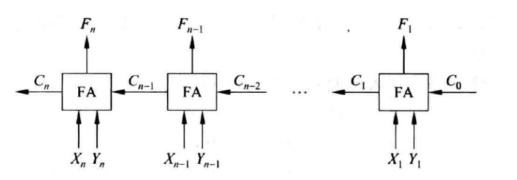
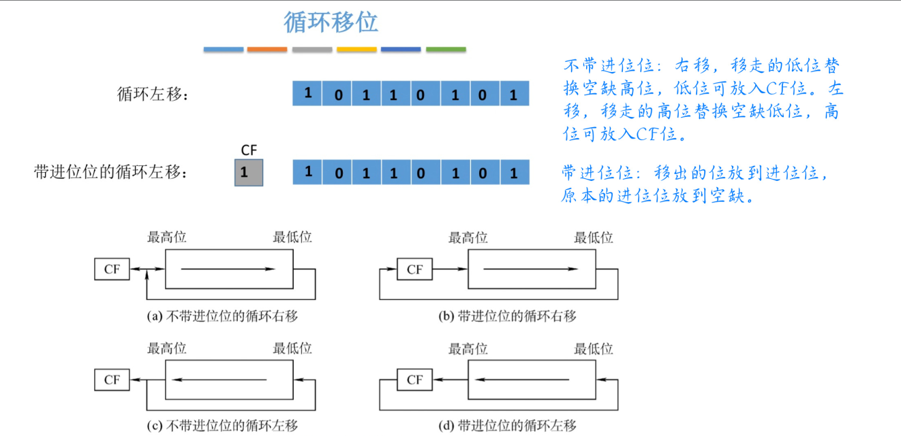
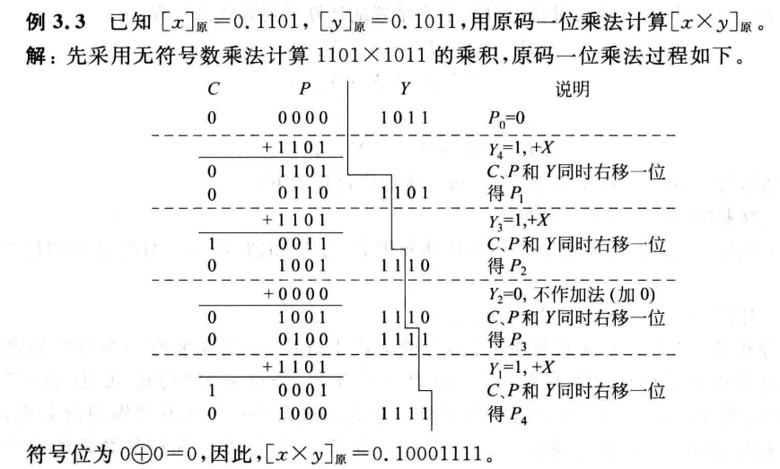

## 运算器

### 运算器的基本组成

- 算术逻辑第单元 (Aritmetic Logic Unit, ALU)
- 移位器
- 程序状态字寄存器 (Program Status Word, PSW)
- 通用寄存器组

## 运算器的基本功能

- 算术运算 (加减乘除)
- 逻辑运算 (与或非异或)
- 移位
- 求补

### 加法器

- 在加法器的运算过程中，所有的数都当做 **无符号数** 来处理

### ALU 的构成

- 串行进位加法器
 
- n 位串行进位加法器 (n 位全加器)
- **n 位** 带标志位的加法器

### 运算电路

### 电路模拟

## 定点数的移位运算

- **逻辑左移**和**算术左移**相同，都是在低位补 0。
- **逻辑右移**：高位补 0，不考虑符号位。
- **算术右移**：高位补符号位，保持符号不变。

### 逻辑移位

> 逻辑移位操作数视为 **无符号整数**

- 逻辑左移: 高位移出，低位补 0
- 逻辑右移: 低位移出，高位补 0

> 溢出判断:
>
> - 逻辑左移时，高位 1 移出，则溢出
> - 逻辑右移不会产生溢出，但是低位 1 被移出后会影响精度

### 算术移位

> 算术移位操作数视为 **有符号整数**

- 算术左移: 高位移出，低位补 0
- 算术右移: 低位移出，高位补符号位

> 溢出判断:
>
> - 算术左移前后符号位不同, 则溢出
> - 通逻辑右移

> [!note] 双符号位的算术移位 (不移动高位符号位) 操作:
> 只需要移动低符号位，最高位表示真正的符号不移动

|  类型  |    码制    |  符号位  | 左移  | 右移  |
| :--: | :------: | :---: | :-: | :-: |
| 正数移位 | 原码、反码、补码 | 不参与移位 | 补 0 | 补 0 |
| 负数移位 |    原码    | 不参与移位 | 补 0 | 补 0 |
| 负数移位 |    反码    | 不参与移位 | 补 1 | 补 1 |
| 负数移位 |    补码    | 不参与移位 | 补 0 | 补 1 |

> [! ] 由于位数有限，有时候无法用算数移位来精确的等效于乘除法

- 基数为 x，
- 左移相当于乘 x
- 右移相当于除 x

### 循环移位

## 定点数的运算

### 补码的加减法运算

#### 运算表达式

$$
\begin{align}
[A + B]_{\text{补}} &= [A]_{\text{补}} + [B]_{\text{补}} \mod 2^n \\
[A - B]_{\text{补}} &= [A]_{\text{补}} - [B]_{\text{补}} \mod 2^n \\
[+B]_{\text{补}} &= [B]_{\text{补}} \\
\end{align}
$$

#### 补码加/减运算部件

- 负数的补码是其原码的 " 各位取反，再加 1 "。
- **输入端**
  - `X`：n 位二进制补码
  - `Y`：n 位二进制补码
  - `Sub` 1 位标志位，用于选择加法或减法：
    - **当 `Sub = 0` 时（加法 `X + Y`）：**

      - `MUX` 将 `Y` 直接送入加法器，并且 `Cin = 0`（无进位）。
      - 加法器输出 `F = X + Y`。
    - **当 `Sub = 1` 时（减法 `X - Y`）：**

      - `MUX` 将 `Y` 的每个位取反（等同于计算 `-Y` 的反码），再加 1（得到 `-Y` 的补码）。
      - 此时，`Cin = 1`，表示初始进位为 1，配合取反加 1 操作。
      - 加法器输出 `F = X + (-Y)`，实现减法 `X - Y`。
- **输出端**
  - F：n 位二进制补码表示的计算结果。

> [! ] 该部件对 **有符号整数，无符号整数** 均适用
> 无符号数相当于正整数其补码就是本身

### 小结

#### 补码的运算规则

- 按二进制运算规则
- 符号位和数值位一起运算
- 最终结果的高位舍弃，只保留 n 位结果 (mod$2^{n}$)

#### 溢出判断

- **上溢** 只有 " 正数 + 正数 " 的时候才会上溢，上溢的表现为 " 正 + 正 = 负 "(因为进位进到符号位里去了)
- **下溢** 只有 " 负数 + 负数 " 的时候才会下溢，下溢的表现为 " 负 + 负 = 正 "(因为借位借到符号位里去了)

##### 方法一【符号位变化】

采用一位符号位 (mod 2 补码)，对运算前后的符号位进行比较，若不同则溢出
设 A 的符号位为 $A_S$，B 的符号位为 $B_S$，运算结果 F 的符号位为 $F_S$
溢出判断符号 V，无溢出时 $V = 0$，溢出时 $V = 1$：

$$
V = A_S B_S \overline{F_S} + \overline{A_S B_S} F_S
$$

$$
\begin{array}{|c|c|c|c|}
\hline
A_S & B_S & F_S & V \\
\hline
0 & 0 & 0 & 0 \\
0 & 0 & 1 & 1 \\
0 & 1 & 0 & 0 \\
0 & 1 & 1 & 0 \\
1 & 0 & 0 & 0 \\
1 & 0 & 1 & 0 \\
1 & 1 & 0 & 1 \\
1 & 1 & 1 & 0 \\
\hline
\end{array}
$$

- $A_S = 0$, $B_S = 0$, $F_S = 1$, $V = 1$，发生了上溢
- $A_S = 1$, $B_S = 1$, $F_S = 0$, $V = 1$，发生了下溢

##### 方法二【进位不同】

采用一位符号位 (mod 2 补码)，根据 **数据位进位情况** 判断是否溢出
符号位进位 $C_n$，最高位进位 $C_{n-1}$。当 $C_n$ 和 $C_{n-1}$ 不同时则发生溢出：

$$
\begin{array}{|c|c|c|}
\hline
C_n & C_{n-1} & V \\
\hline
0 & 0 & 0 \\
0 & 1 & 1 \\
1 & 0 & 1 \\
1 & 1 & 0 \\
\hline
\end{array}
$$

$$
V = C_n \oplus C_{n-1}
$$

- $C_n = 0$, $C_{n-1} = 1$, $V = 1$，发生了上溢
- $C_n = 1$, $C_{n-1} = 0$, $V = 1$，发生了下溢

- $-3 - 5 = [-3]_{\text{补}} + [-5]_{\text{补}} = 1101 + 1011 = 11000 = -8$
  $C_n = 1$, $C_{n-1} = 1$, $V = 0$，没有发生溢出

- $3 + 6 = [3]_{\text{补}} + [6]_{\text{补}} = 0011 + 0110 = 1001 = -7$
  $C_n = 0$, $C_{n-1} = 1$, $V = 1$，发生了上溢

- $-7 - 6 = [-7]_{\text{补}} + [-6]_{\text{补}} = 1001 + 1010 = 0011 = +3$
  $C_n = 1$, $C_{n-1} = 0$, $V = 1$，发生了下溢

##### 方法三【双符号位不同】

采用两位符号位 (mod 4 补码)，正常情况下正数的符号位是 `00`，负数的符号位是 `11`
实际储存时仍然只有一个符号位，但在运算时会出现两个符号位，两个符号位同时参与运算

- 发生上溢时，符号位是 `01`
- 发生下溢时，符号位是 `10`

$$
\begin{array}{|c|c|c|c|}
\hline
F_{n-1} & F_{n-2} & F & V \\
\hline
0 & 0 & 00 & 0 \\
0 & 1 & 01 & 1 \\
1 & 0 & 10 & 1 \\
1 & 1 & 11 & 0 \\
\hline
\end{array}
$$

$$
V = F_{n-1} \oplus F_{n-2}
$$

- $F_{n-1} = 0$, $F_{n-2} = 1$, $V = 1$，发生了上溢
- $F_{n-1} = 1$, $F_{n-2} = 0$, $V = 1$，发生了下溢

#### 标志位

- $F = A + B + C_{in}$
- $\text{OF (overflow flag)} = C_{n} \oplus C_{n-1}$
- $\text{SF (sign flag)} = F_{n-1}$
- $\text{ZF (zero flag)} = (F == 0)$
- $\text{CF (carry flag)} = C_{\text{out}} \oplus \text{Sub}$ 或者 $\text{CF} = C_{\text{out}} \oplus C_{\text{in}}$ (n 位加法器 $C_{\text{out}} = C_n$, $C_{\text{in}} = C_0$)
- ALUop 操作控制端 0 表示加法，1 表示减法。ALUop 的位数决定了操作的种类，例如 4 位 ALUop 可以有 16 种操作
- 因为减法实际上 $a - b + 2^n$，当 $C_n = 1$ 时，$a - b > 0$ 无需借位

- **OF、SF** 只对 **有符号数运算** 有效
- **CF** 只对 **无符号数运算** 有效：
  - 无符号数运算涉及进位/借位
  - 有符号数运算涉及溢出

##### 通过标志位判断大小

> [! ]  $A - B$:

- **无符号数** 比较大小

  - $A = B \Rightarrow ZF = 1$
  - $A > B \Rightarrow CF = 0 \quad ZF = 0$（没有发生借位）
  - $A < B \Rightarrow CF = 1 \quad ZF = 0$（发生了借位）

- **有符号数** 比较大小
  - $A = B \Rightarrow ZF = 1 \quad OF = 0$
  - $A > B \Rightarrow ZF = 0 \quad OF \oplus SF = 0$
    - $OF = 0 \Rightarrow$ 没有发生溢出，$SF = 0 \Rightarrow$ 结果为正 $\Rightarrow A > B$
    - $OF = 1 \Rightarrow$ 发生了溢出，$SF = 1 \Rightarrow$ 结果为正 $\Rightarrow A > B$（正数减负数）
  - $A < B \Rightarrow ZF = 0 \quad OF \oplus SF = 1$
    - $OF = 0 \Rightarrow$ 没有发生溢出，$SF = 1 \Rightarrow$ 结果为负 $\Rightarrow A < B$
    - $OF = 1 \Rightarrow$ 发生了溢出，$SF = 0 \Rightarrow$ 结果为正 $\Rightarrow A < B$（负数减正数）

### 原码的加减法运算

- **应用**: 用于浮点数尾数运算
- **处理方式**: 符号位和数值部分分开处理
- **运算方法**: 仅对数值部分进行加减运算，符号位起判断和控制作用
- **规则如下**:
  - **加法**: 执行 " 同号求和，异号求差 "
  - **减法**: 执行 " 同号求差，异号求和 "

  - **求和**: 数值位相加，和的符号取被加数 (或被减数) 的符号。若最高位产生进位，则结果溢出

  - **求差**: 加数 (或减数) 求补后与被加数 (被减数) 相加
    1. 最高位产生进位 ($C_{out} = 1$)，无借位 ($CF = 0$)，结果为正，该结果即为 " 差 " 的数值位的原码
    2. 最高位无进位 ($C_{out} = 0$)，则 $CF = 1$，结果为负，它是 " 差 " 的数值位的补码形式，需要对结果求补，还原为原码形式的数值位
- **差的符号位**:
  - 对于 (1) 情况，符号位取被加数 (被减数) 的符号；
  - 对于 (2) 情况，符号位为被加数 (被减数) 的符号取反

### 移码的加减法运算

- **应用**: 用于浮点数的阶码运算
- **处理方式**: 符号位和数值部分可以一起处理

- **加法**:

  $$
  [E1]_{\text{移}} + [E2]_{\text{移}} = [E1 + E2]_{\text{补}} \quad (\text{mod} \, 2^n)
  $$

  - 直接将移码相加，取模 $2^n$，并对符号位进行处理。

- **减法**:

  $$
  [E1]_{\text{移}} - [E2]_{\text{移}} = [E1 - E2]_{\text{补}} \quad (\text{mod} \, 2^n)
  $$

  - 将 $E2$ 求补 (各位取反，末位加 1) 后与 $E1$ 相加，取模 $2^n$。

- **溢出判断**: 当两个加数符号相同，并且与和数的符号相同时，发生溢出。

### 原码的乘法运算

- 符号位和数值位分开求结果
- 符号位有两个乘数的符号位异或得到
- 数值位是两个乘数取绝对值后的乘积
- 初始状态:ACC = 0, 乘数对应低位，被乘数在寄存器。每次 ACC 加完乘积高位低位同时进行逻辑右移
- 手算模拟
  - $用乘数 Y 的各位乘以被乘数 X 得 X \times Y_i。若 Y_i = 1，则结果为 X，否则为 0$
  - 将上述所得各项结果在空间上向左错位排列，逐位左移，可以表示为 $X \times Y_i \times 2^{-i}$
  - 将上述所得结果求和，即为两符号数的乘积

- 逻辑硬件图

- 溢出判断
  - 结果高位是否都一样，不一样则溢出

### 补码的乘法运算

### 原码乘法和补码乘法对比

### 原码除法

