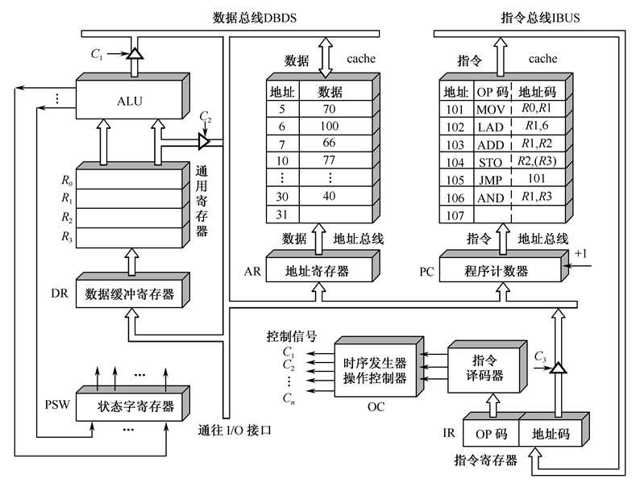
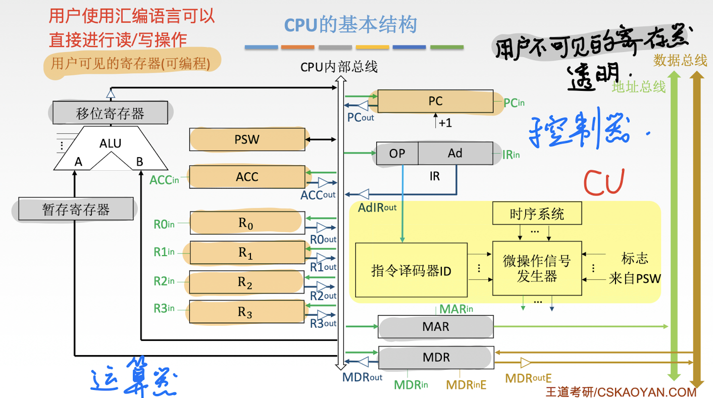

## CPU 的功能

### 指令控制

- 完成取指令、分析指令和执行指令的操作，即程序的顺序控制 (PC IR)
- 如果遇到分支且分支条件满足、或者遇到跳转指令则会改变程序的执行顺序，CPU 必须能够正确获取到下一条指令的地址。

### 操作控制

- 一条指令的功能往往是由若干操作信号的组合来实现的。
- CPU **管理并产生**由内存取出的每条指令的**操作信号**，把各种操作信号送往相应的部件，从而控制这些部件按指令的要求进行动作 (CU)

### 时间控制

- 对各种操作加以时间上的**控制**。时间控制要为每条指令按时间顺序提供应有的控制信号

### 数据加工

- 对数据进行算术和逻辑运算 (ALU)

### 中断处理

- 对计算机运行过程中出现的异常情况和特殊请求进行处理

## 运算器和控制器的功能

## CPU 的结构

### 运算器的基本结构

- **算术逻辑单元 (ALU)**：主要负责执行各种算术和逻辑运算，如加、减、与、或、非等操作。

- **通用寄存器组**：包含一些通用寄存器（如 AX、BX、CX、DX、SP 等），用于存放操作数（包括源操作数、目的操作数及中间结果）以及地址信息等。特别地，SP（堆栈指针）寄存器用于指示栈顶的地址。

- **暂存寄存器**：用于临时存放从主存读取的数据。该寄存器独立于通用寄存器组，避免破坏通用寄存器中的数据。

- **累加寄存器 (ACC)**：是一个专用的寄存器，用于临时存放 ALU 运算的结果。尤其在加法运算中，累加寄存器是关键的中间存储位置。

- **程序状态字寄存器 (PSW)**：用于存放由 ALU 运算或测试指令结果产生的各种状态信息，包括溢出标志（OF）、符号标志（SF）、零标志（ZF）、进位标志（CF）等。这些状态标志可用于控制程序的流程。

- **移位器**：用于对运算结果进行移位操作，支持逻辑移位和算术移位等操作。移位操作通常用于优化乘除法运算或数据对齐。

- **计数器**：用于控制复杂运算（如乘法和除法）的操作步数。乘除运算可通过多次加法或减法实现，计数器则统计这些操作的次数来实现正确的运算。

> **说明**：移位器和计数器在广义上也属于寄存器，但它们具有特定的功能，分别用于移位操作和控制操作步数。

> **移位器和计数器也是寄存器**

### 控制器的基本结构

- **程序计数器 (PC)**：用于存放下一条指令在主存中的地址。CPU 根据 PC 的内容从主存中取指令。通常程序指令是顺序执行的，因此 PC 具有自动加一的自增功能，以便指向下一条顺序指令的地址。

- **指令寄存器 (IR)**：用于存储当前正在执行的指令。CPU 在执行指令期间会保持当前指令的内容在 IR 中，直到该指令执行完毕。

- **指令译码器 (ID)**：对 IR 中的操作码字段进行译码，并将译码结果转化为相应的控制信号，以指示控制器执行相应操作。

- **微操作信号发生器 (CU)**：根据 IR 的指令内容、PSW 中的状态信息，以及时序信号，生成控制整个计算机系统的各种控制信号。CU 结构包括两种实现方式：**组合逻辑型**（通过硬件逻辑电路产生控制信号）和**存储逻辑型**（通过微程序存储器控制）。

- **时序系统 (CU)**：用于产生各种时序信号，确保操作的有序进行。这些信号由统一的时钟（CLOCK）进行分频生成，以控制各部件的同步操作。

- **存储器地址寄存器 (MAR)**：存放需要访问的主存单元的地址。在执行指令时，CPU 会将目标地址送入 MAR，以进行读或写操作。

- **存储器数据寄存器 (MDR)**：用于存放从主存读取或将要写入主存的数据。在读操作时，MDR 从主存接收数据；在写操作时，数据会暂存于 MDR 后再写入主存。

