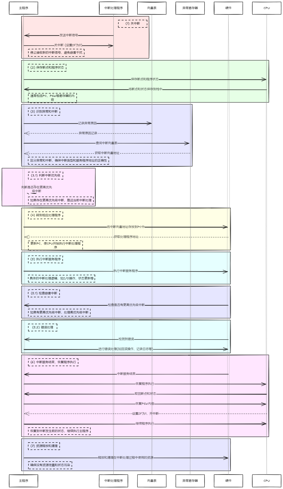
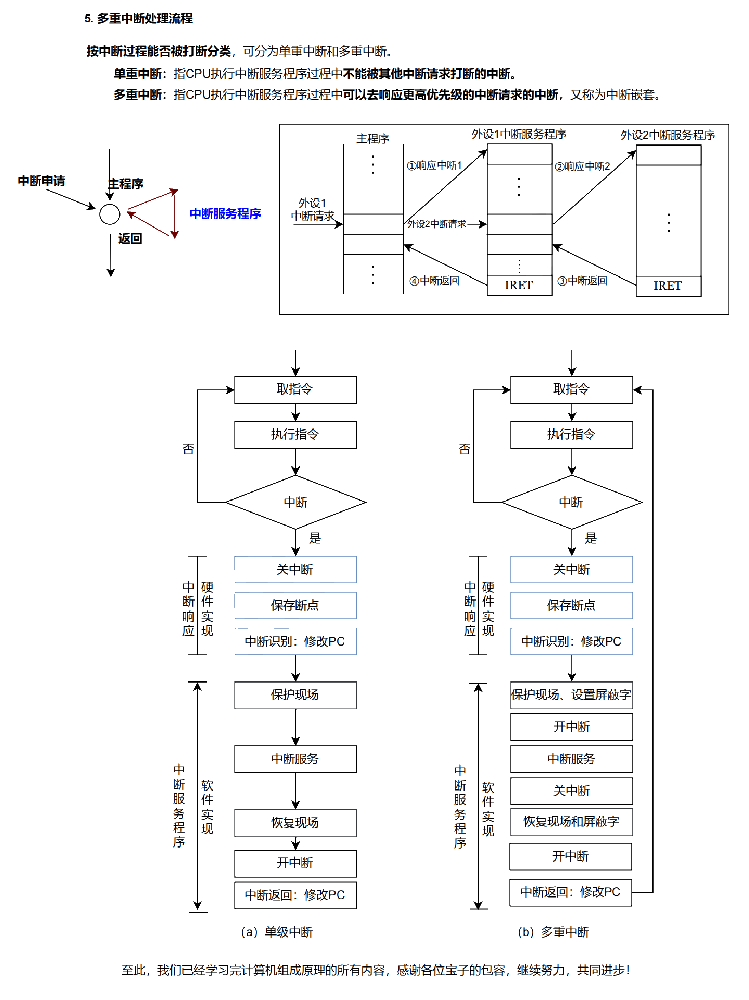

## 中断和异常机制

### 基本概念

|   类别   |          原因           | 异步/同步 | 处理方式         |
| :----: | :-------------------: | :---: | ------------ |
| **中断** | 外部设备请求 （如 I/O、定时器）|  异步   | 执行下一条指令      |
| **陷阱** |   程序主动请求 （如系统调用）|  同步   | 返回系统调用后继续执行  |
| **故障** | 可恢复的错误 （如缺页、地址越界）|  同步   | 处理后返回导致故障的指令 |
| **终止** |  不可恢复的错误 （如硬件故障）|  同步   | 系统终止运行，无法返回  |

- **中断**: 异常和外部中断的统称
- **异常**:
  - CPU 在执行指令过程中 **内部** 检测到的 **与当前指令有关** 的 **同步** 事件
  - 可发生在指令执行的任何阶段 (取指令、指令译码、执行、访存或回写阶段等)
  - eg:
    - 硬故障异常: 电源掉电、线路故障等
    - 程序性异常: 非法操作码、溢出、缺页、除数为 0 等

- **外部中断**
  - CPU 外部设备向 CPU 发出的中断请求
  - 由外部设备触发，**与当前指令无关** 的 **异步** 事件
  - 可发生在任何时间，通常在 CPU 完成当前指令执行后被检测和响应
  - eg: 打印纸缺纸、键盘缓冲区满、DMA 传输结束

> [! ] 如何区分硬件功能和软件功能
> - 依靠**指令**实现的是**软件功能**
> - 依靠机**制**实现的是**硬件功能**

### 分类

> [! ] 本质是将 CPU 的控制权交给 OS，因此中断发生后 CPU 状态转为核心态

#### 内部异常 【同步】

- 异步异常是处理器外部的 IO 设备中的事件产生的
- 同步异常时执行一条指令的直接产物

- **中断信号**:
  - 来源: CPU 内部，与当前执行的指令有关
  - 响应: 发生在指令执行过程中
  - 特点: 内中断皆为不可屏蔽中断，需立即处理
  - 检测: CPU 通过电路检测中断请求

- **与中断周期无关**

> 与中断不同，异常通常在指令的执行阶段被响应，不能被屏蔽。

##### 故障 (Fault)

- 在引起故障的指令启动后、指令执行结束前检测到的异常事件
- 故障（Fault）是可以被修复的异常
- 例如: 非法操作码、缺段、缺页、溢出、除数为 0 等
  - **缺页异常**: 当程序访问一个不在内存中的页面时，会触发缺页异常。CPU 会将控制转移到操作系统的缺页异常处理程序，处理程序会将所需页面加载到内存中，然后重新执行引起异常的指令
- **断点**: 发生故障的当前指令的地址

##### 自陷 (Trap)

> [! ] 自陷指令 = trap 指令 = 陷阱指令 = 陷入指令 = 访管指令
> 自陷指令只能在用户态使用

- 程序预先安排的一种异常事件，通过特殊指令或控制标志设置。(是一种自愿中断)
- 例如: 单步追踪、系统调用 (执行访管指令) 等
  - 系统调用: 程序通过执行特定的系统调用指令 (如 int 0x80 在 x86 架构中) 请求操作系统服务。执行该指令时，CPU 会转移到系统调用处理程序，完成所需服务后，返回到系统调用指令后的下一条指令继续执行
- **注意**: 当自陷指令是转移指令时，返回到转移目标指令执行
- **断点**: 自陷指令后下一条指令的地址
- 执行自陷指令后，进行相应处理，然后返回继续执行

##### 终止 (Abort)

- 程序执行过程中发生的 **硬件故障**(和具体指令无关)，如电源掉电、线路故障等，导致程序无法继续执行
- 内存访问违例 (非法内存访问): 当程序试图访问未分配的内存地址或受保护的内存区域时，会触发内存访问违例异常。此类异常通常无法恢复，操作系统会终止该程序并可能记录错误信息

- 不有特定指令产生，随机发生
- **断点**: 随便

#### 外部中断

- **来源**: 来自 CPU 和内存外部，与当前执行的指令无关
- **检测与响应**:
  - 每个指令周期结束时检测并响应中断
  - CPU 通过采样请求信号检测中断请求
- **常见类型**:
  - IO 设备发起的 IO 中断
  - 外部信号中断 (hardware failure)
  - 各种定时器 (timer) 引起的时钟中断
- **特点**:
  - **异步**
  - 外设完成任务或发生特殊事件（如打印机缺纸、键盘缓冲满等）向 CPU 发出中断请求
  - 中断的断点
- **处理**
 
- 外部设备都是通过 INTR 接口向 CPU 发出中断，均属于可屏蔽终端。

##### 是否可屏蔽【都属于外部中断】

###### 可屏蔽中断 INTR

- **功能**：可以通过屏蔽字实现多重中断，即允许 CPU 在处理某些重要任务时忽略此类中断。
- **信号线**：通过可屏蔽中断线 **INTR** 发出，CPU 可以选择屏蔽或不屏蔽。

> [! ] 键盘中断
  当用户按下键盘时，键盘控制器通过 INTR 线向 CPU 发出中断请求。CPU 保存状态后转到键盘中断处理程序，处理完后恢复状态继续执行。

###### 不可屏蔽中断 NMI

- 通过不可屏蔽中断线 NMI 发出，通常是紧急的硬件故障（如电源掉电）
- 处理优先级最高，发生时立即处理
- *DMA 请求 > NMI*：DMA 请求不是 DMA 中断
- 做选择题时 " 中断 " 一般不考虑 NMI

> [! ] 电源故障中断
>
> - 当系统检测到电源即将失效时，会通过不可屏蔽中断线 NMI 向 CPU 发出中断请求
> - CPU 会立即响应该中断，转到电源故障处理程序，进行紧急保存数据和系统状态的操作

#### 不同异常检测检测的周期阶段

- " `除数为 0`" 异常在**取数/译码周期**进行检测
- " `溢出` " 异常在 R 型指令和 I 型运算类指令的**执行周期**进行检测
- " `无效指令` " 异常在**取数/译码周期**进行检测
- " `无效指令地址` "" 缺页 "" 访问越权 " 异常在**取指令周期**检测
- " `无效数据地址` "" 缺页 "" 访问越权 " 异常在存储器访问周期检测
- " `外部中断` " 可在每条指令的最后一个周期进行检测

#### 小结

- **内中断**：由 CPU 内部处理程序执行时的异常情况或软件指令触发，用于处理程序中的异常和系统调用
- **外中断**：由外部硬件设备或事件触发，用于通知 CPU 处理外设的请求

|          | **内中断（异常） （Internal Interrupt）** | **外中断 （External Interrupt）** |
| :------: | :---------------------------------: | :-----------------------------: |
| 触发 原因 |        由程序执行过程中发生的异常或软件指令引发         |          由外部硬件设备或事件引发           |
| 处理 对象 |           处理程序内部的错误或系统调用            |        处理外部设备的请求和系统的硬件事件        |
| 触发 方式 |         CPU 自行检测到问题或软件主动触发          |     外部设备通过中断信号线向 CPU 发出中断请求     |
|    例子    | 除以零错误、非法指令、越界访问、系统调用（如 `int 0x80`）等 |  时钟中断、键盘输入、鼠标点击、时钟定断、网络数据到达中断等  |
|  是否可以屏蔽  |               通常不能屏蔽                |        可以屏蔽，操作系统可选择屏蔽或允许        |
|   同步性    |            同步（发生在指令执行中）|           异步（与指令执行无关）|
|    作用    |          处理程序错误、系统调用、异常处理           |      处理外设请求，协调设备与 CPU 的交互       |

### 响应中断的条件

- CPU 处于**开中断**状态
  - 至少有一个未被屏蔽的中断请求
  - 当前指令刚执行完
- 通过 PSW 中的 IF 位来进行判断：
  - `IF = 1`：表示允许中断
  - `IF = 0`：表示不允许中断

##### 向量中断

向量中断是指通过**中断向量**来确定中断服务程序的入口地址，使 CPU 可以快速跳转到对应的中断服务程序。该机制的关键在于**中断向量表**的引入，通过中断类型号查找对应的服务程序地址，从而简化中断的处理流程。

- **中断向量**：每个中断类型号对应一个中断向量，即中断服务程序的入口地址。中断类型号用于唯一标识某类中断。
- **中断向量表**：系统为每个中断类型号分配一个存储区域，称为中断向量表，用于存储各个中断类型对应的中断服务程序的入口地址。。通常，中断向量表类似于一个指针数组，快速指向对应中断服务程序。

#### 中断向量地址的获取流程

1. **CPU 响应中断**：检测到中断信号后，CPU 读取中断类型号。
2. **查找中断向量地址**：根据类型号查找中断向量表，获取该类型号对应的服务程序入口地址。
3. **跳转执行**：CPU 将入口地址加载到程序计数器 (PC) 中，跳转到该地址并开始执行中断服务程序。

#### 中断响应的三项任务

1. **关闭中断**：为了避免其他中断干扰当前处理中断，CPU 会暂时关闭中断。这一步确保当前中断服务程序能够完整执行。
2. **保存断点**：CPU 保存断点（程序计数器的内容），确保中断服务程序结束后能够回到被打断的程序继续执行。断点通常保存在堆栈中或特定存储单元中。
3. **加载服务程序入口地址**：从中断向量表中取出中断服务程序的入口地址，将其加载到程序计数器 (PC) 中，开始执行服务程序。

##### 中断向量的作用总结

- **唯一标识中断服务程序**：通过中断向量可以快速定位到某个中断的处理程序。
- **提高中断响应速度**：减少了查询和寻找中断处理程序的时间，从而提高了中断的响应效率。
- **支持多种中断类型**：系统通过中断向量表的映射关系，能够轻松扩展支持多种外部设备的中断处理。

##### 非向量中断

非向量中断指中断请求时，CPU 不直接提供中断服务程序地址，通常需额外的步骤来确定该地址。
与向量中断不同，非向量中断的处理较为复杂且速度较慢。

- **无直接地址**：中断请求时 CPU 无法直接提供服务程序地址，需要额外步骤来确定该入口地址。
- **处理流程**：
  1. 中断发生后，CPU 需通过查询外设状态寄存器或使用硬编码地址来确定服务程序地址。
  2. CPU 获取地址后跳转执行服务程序。

#### 单重中断和多重中断

既适用于内部异常处理，也适用于外部中断

##### 单重中断

- **定义**：CPU 在执行中断时，不允许其他中断请求再次打断，避免中断嵌套。
- **特点**：
  - 在处理某个中断请求时，CPU 屏蔽其他中断请求。
  - 仅在当前中断服务程序处理完毕后，才恢复并响应新的中断请求。
- **处理流程**：
  1. **关闭中断**：中断服务程序运行时关闭其他中断。
  2. **恢复中断**：当前中断处理完成后，恢复中断状态。

##### 多重中断

- **定义**：CPU 在处理某个中断时，可以响应更高优先级的中断（中断嵌套）。
- **特点**：
  - 允许嵌套中断，提升系统响应效率，适用于实时系统。
  - 高优先级中断打断低优先级中断服务程序，完成后恢复到低优先级中断。
- **处理流程**：
  1. **开中断**：运行低优先级中断服务程序时，允许更高优先级中断打断。
  2. **优先级切换**：处理完高优先级中断后，恢复低优先级的中断处理。

> **注意**：去掉开关中断、屏蔽字和现场保护即为【单重中断】。

- 若异常或中断处理程序发现是不可恢复的致命错误，则终止用户程序
- 异常和中断的具体处理过程通常由 **操作系统和驱动程序** 完成

## 异常和中断响应过程

- 异常和中断响应过程基本相同
- 从 CPU 检测到事件到调出处理程序的整个过程称为响应

#### 中断响应过程

1. **关中断**
   - 禁止新的中断响应，通过设置 " 中断允许 " (IF) 触发器实现
   - IF 为 1 表示开中断，IF 为 0 表示关中断

2. **保存断点和程序状态**
   - **断点保存**: 程序的返回地址，即被中断时的程序计数器 (PC) 值
   - **程序状态保存**: 包括程序状态字寄存器 (PSW) 的内容，以便中断处理完毕后能恢复到中断前的状态
   - **支持嵌套处理**: 为了支持多重中断，断点和程序状态保存在栈中，便于管理和恢复
   - **断点差异性**: 不同类型的异常事件导致的断点不同
      - 故障: 断点是发生故障的指令地址
      - 自陷: 断点是自陷指令后的下一条指令地址

3. **识别异常和中断并转到相应的处理程序**
   - 明确发生了什么类型的异常或中断
     - 内部异常识别多采用软件方式
     - 外部中断可用软件或硬件方式
   - **转到处理程序**: 找到处理程序的地址，将其存放到 PC 中

   - **软件识别方式**:
     - **异常状态寄存器**: CPU 设置一个异常状态寄存器，用于记录异常原因
     - **查询程序**:
        - 操作系统使用一个统一的异常或中断查询程序
        - 按优先级顺序查询异常状态寄存器，以检测异常和中断类型
        - 先查询到的先被处理，然后转到内核中相应的处理程序

   - **硬件识别方式**:
     - **向量中断**: 异常或中断处理程序的首地址称为中断向量
     - **中断向量表**:
        - 所有中断向量都存放在中断向量表中
        - 每个异常或中断都被指定一个中断类型号
        - 在中断向量表中，类型号和中断向量一一对应，根据类型号快速找到对应的处理程序

   - 响应过程不可被打断
   - 中断响应结束后，CPU 从 PC 中取出对应中断服务程序的第一条指令开始执行，直至中断返回
   - 整个过程由软硬件协同实现

> [! NOTE] **关中断作用**
> 关中断指令是 CPU 的一条特权指令，用于关闭 CPU 对中断请求的响应，
> 即 CPU 在执行关中断指令后，任何的中断请求信号暂时都不会被响应，但是也有一些很特别的，优先级非常高的中断信号必须被响应——非屏蔽中断
> eg: 某时 CPU 正处于关中断，但是强行按关机按钮，关机这种很特别，很紧急的事件必须被响应被处理，在电脑完全断电之前，CPU 需要做一些强制关机相关的紧急处理，如记录系统状态

##### 中断请求标记 -- 判断是哪个设备发来的中断信号

###### 中断请求标记寄存器的作用

- 每个中断源在发出中断请求时，**随机向 CPU 发送请求**。
- 为了记录这些中断事件并区分不同的中断源，中断系统需要为每个中断源设置**中断请求标记触发器**。
- 当标记状态为 `1` 时，表示**该中断源有请求**；状态为 `0` 表示**没有请求**。

###### CPU 响应外中断的时机【2018、2020】

- 对于**外部中断**，CPU 在**每条指令执行阶段结束前**会向接口发出中断查询信号，以获取 I/O 的中断请求。

> [! ] CPU 响应中断的时机是在每条指令执行结束的时刻。

###### CPU 响应中断必须满足以下 3 个条件

1. **中断源有中断请求**：中断请求标记寄存器的状态为 `1`。
2. **CPU 允许中断**：即中断未被屏蔽，CPU 处于可以响应中断的状态。
3. **指令执行完成且无更紧急任务**：当前指令执行完毕，并且没有其他更高优先级的任务。

##### 中断请求判优实现 -- 有多个中断信号，先处理哪个

###### 硬件实现

- 使用**硬件排队器**来实现，可以集中在 CPU 中，或分散在各个中断源中。
- 硬件排队器会根据**固定优先级**排列，直接对中断进行响应。
- **优势**：响应速度快，适合对响应时间要求较高的系统。
- **示例**：图中显示了硬件排队器的结构，不同中断源通过硬件排队器发送中断请求。

###### 软件实现

- 通过**查询程序**实现，软件通过遍历中断请求标记来确定优先响应的中断源。
- **灵活性更高**：可以根据需要动态调整中断优先级，适合应用程序复杂的场景。
- **劣势**：响应速度可能较慢，因为需要占用 CPU 资源进行查询。

###### 中断判优流程示意

- **响应优先级**与**处理优先级**可能不同：

  - 对每个中断请求标记进行查询，判断是否有中断请求。
  - 根据请求的优先级顺序逐步响应优先级较高的中断请求。
  - 在处理完当前中断后，再检查是否有其他中断需要响应。
- **硬件排队器示意**：

  - 每个中断源都有一个对应的硬件排队器，决定响应的优先顺序。
  - 图中 `INTR1` 到 `INTRn` 表示不同中断源的请求，通过排队器决定哪个中断优先处理。

- **中断优先级的划分**：

  - **响应优先级**：由硬件决定，确定响应顺序。
  - **处理优先级**：可以在处理中动态调整，通过屏蔽字设置适应不同需求。
- **系统设计**：

  - 对于响应速度要求高的中断，适合使用硬件实现；对于需要灵活调整优先级的场景，软件实现更为合适。
- **典型应用场景**：

  - **硬件排队**适用于高实时性场景，例如传感器数据采集。
  - **软件查询**适用于复杂系统中的多任务处理，例如多设备 I/O 管理。

###### 中断优先级的设置

- **硬件故障中断 > 软件中断**【硬: 掉电/关机；软: 系统调用】
- **非屏蔽中断 > 可屏蔽中断**: 非屏蔽中断是无法屏蔽的，CPU 必须立即响应，优于可屏蔽中断
- **DMA 请求 > I/O 设备中断**: DMA 控制器的中断优先级高于普通 I/O 设备中断，因为 DMA 通常处理高速数据传输
- **高速设备 > 低速设备**: 高速设备如硬盘、网络卡的中断优先级高于低速设备如打印机，因为高速设备响应不及时会导致更多的工作延误
- **输入设备 > 输出设备**: 输入设备（如键盘）的中断优先级高于输出设备（如打印机），因为输入数据可能更容易丢失
- **实时设备 > 普通设备**: 实时设备的中断优先级高于非实时设备，以保证系统实时性

- **响应优先级 (在后)** 先响应哪个请求，由查询程序或中断判优电路决定; 由硬件线路实现，不可改变
- **处理优先级 (在前)** 可利用中断屏蔽技术 (中断屏蔽字) 动态调整，以实现多重中断

##### 中断处理过程【由硬件自动完成】

- **关中断、保存断点和程序状态字、中断服务程序寻址**: 这三步由硬件自动完成，又称作**中断隐指令**
  - **中断向量**: 每个中断源都有一个唯一的类型号，每个中断类型号都对应一个中断服务程序，每个中断服务程序都有一个入口地址，即中断向量
  - **中断向量表**: 把系统中的全部中断向量集中存放到存储器的某个区域内，这个存放中断向量的存储区称为中断向量表
  - **中断向量法**: CPU 响应中断后，通过识别中断源获得中断类型号，然后据此计算出对应中断向量的地址；再根据该地址从中断向量表中取出中断服务程序的入口地址，并送入程序计数器 PC，以转去执行中断服务程序。这种方法被称为中断向量法，采用中断向量法的中断被称为向量中断

###### 中断向量法

###### 保存现场与屏蔽字

在进入中断服务程序后，第一步是**保存现场**和**中断屏蔽字**

- **现场**: 指用户程序中正在使用的工作寄存器的内容，例如通用寄存器的状态。这些寄存器内容由软件保存，以便在中断服务程序结束后恢复原程序的状态
- **屏蔽字**: 用于控制哪些中断信号可以被屏蔽，进入中断服务程序后，当前的屏蔽字会被保存

###### 中断嵌套

**中断嵌套**指的是在处理一个中断时，可以响应更高级别的中断请求，从而形成多层次的中断处理。中断嵌套依赖于**开中断**和**关中断**的配合

- **开中断**: 在处理当前中断时，允许更高级的中断请求被响应。通过**开中断指令**，CPU 可以在中断服务程序中再响应其他中断，从而实现中断嵌套
- **关中断**: 用于确保在处理完当前中断（尤其是恢复现场和屏蔽字）时，不会被新的中断打断。如果不需要嵌套中断，可以关闭中断以阻止其他中断请求

###### 中断恢复

中断处理完成后，CPU 需要恢复到原程序继续执行。恢复的步骤包括：

- 恢复之前保存的**现场**和**屏蔽字**
- 从保存的**断点**（程序计数器 PC）处继续执行原程序

##### 多重中断

- **多重中断**: 当 CPU 在执行一个中断的中断服务程序时，如果接收到**更高优先级的中断请求**，CPU 会暂停当前的中断服务程序，转去处理优先级更高的中断。处理完更高优先级的中断后，CPU 再回到原来被中断的服务程序继续执行。这种机制称为**多重中断**或**中断嵌套**

- **特点**:
  - **提高响应能力**: 允许更高优先级的中断打断当前的中断服务程序，提高系统的响应能力，尤其适用于对关键任务的实时性要求更高的场景
  - **增加复杂性**: 增加了中断处理的复杂性，需要管理好中断的优先级和上下文切换
  增加了中断处理的复杂性，需要管理好中断的优先级和上下文切换

###### CPU 要具备多重中断的功能，实现条件

- **开中断指令**: 在中断服务程序的某些部分，尤其是关键部分处理完毕后，**重新启用中断（开中断）**，允许更高优先级的中断打断当前中断的执行。通过**开中断指令**，可以实现多重中断的嵌套处理
- **中断优先级管理**:
  - 系统必须设置**中断优先级**，即优先级高的中断源能够中断优先级低的中断源。优先级的设定可以基于硬件或者通过软件的中断屏蔽字灵活调整
  - 当优先级较高的中断请求到达时，系统暂停低优先级中断的处理，转而执行高优先级中断服务程序
- **中断屏蔽技术**:
  - 通过**中断屏蔽字**动态调整系统的中断优先级和处理顺序。CPU 在处理中断时，可以决定是否允许更高级别的中断请求打断当前中断，通过**开中断和关中断**来控制嵌套中断

###### 单重中断和多重中断对比

|  **对比项**   |        **单重中断**         |      **多重中断（中断嵌套）**       |
| :--------: | :---------------------: | :-----------------------: |
| **中断处理方式** | 在执行中断服务程序时 不允许其他中断打断 | 在执行中断服务程序时 允许更高优先级中断打断 |
| **优先级处理**  |         忽略新到的中断         | 可以暂停低优先级的中断 优先处理高优先级中断 |
|  **复杂性**   |   简单，系统不需要复杂的中断优先级管理    |   复杂，系统需要管理中断优先级及上下文切换    |
|  **适用场景**  |         实时性要求低          |   实时性要求高 如操作系统中的任务调度   |

## 中断屏蔽技术

> 计算机系统有 5 个中断源，分别记为中断源 1、2、3、4、5，其优先级顺序如下：

> [! ] 屏蔽位看的是**处理优先级**

- 中断响应优先级：`中断源 1 > 中断源 2 > 中断源 3 > 中断源 4 > 中断源 5`
- 中断处理优先级：`中断源 1 > 中断源 4 > 中断源 5 > 中断源 2 > 中断源 3`

$$
\begin{array}{|c|c|c|c|c|c|}
\hline
\textbf{中断处理程序} & \textbf{1 号中断源} & \textbf{2 号中断源} & \textbf{3 号中断源} & \textbf{4 号中断源} & \textbf{5 号中断源} \\
\hline
1 \, \text{号中断源} & 1 & 1 & 1 & 1 & 1 \\
\hline
2 \, \text{号中断源} & 0 & 1 & 1 & 0 & 0 \\
\hline
3 \, \text{号中断源} & 0 & 0 & 1 & 0 & 0 \\
\hline
4 \, \text{号中断源} & 1 & 1 & 1 & 1 & 0 \\
\hline
5 \, \text{号中断源} & 1 & 1 & 1 & 0 & 1 \\
\hline
\end{array}
$$

> 若运行用户程序时，中断源 2 和中断源 4 同时发出中断请求，而在处理 2 号中断的过程中，中断源 1、3、5 同时发生中断请求，画出 CPU 运行过程图。【多重中断】

1. **中断源 2 和中断源 4 同时发出中断请求**：

   - **中断源 2 的响应优先级高于中断源 4**，因此系统会**优先响应中断 2**。
   - **保存现场**：保存当前 CPU 的状态和寄存器信息，以便中断处理结束后恢复用户程序。
   - **设置屏蔽字 `01100`**：新的屏蔽字屏蔽了中断 1 和中断 3，但对中断 4 和中断 5 开放。
   - **开中断，处理中断 4**：由于中断 2 的屏蔽字对中断 4 开放，因此在处理中断 2 的过程中，中断 4 被响应。
   - 中断 4 处理结束后，**返回中断 2 的中断服务程序继续执行**。

2. **在处理 2 号中断的过程中，中断源 1、3、5 同时发生中断请求**：

   - 根据中断的响应优先级，**中断源 1 > 中断源 5 > 中断源 2 > 中断源 3**。
   - 中断 1 和中断 5 请求被排队判优，且**优先响应中断 1**。
   - **处理中断 1**：在处理中断 1 时，由于中断 1 的优先级最高，系统不会响应任何其他中断请求。
   - **处理中断 1 结束后，返回中断 2 的中断服务程序继续执行**。

3. **处理中断 2 时，中断源 5 仍然有效**：

   - 中断源 5 的请求由于优先级高于中断源 2，**中断 5 被响应并处理**。
   - **处理中断 5 结束后，再次返回中断 2 的中断服务程序继续执行**。

4. **处理中断 2 完成后，处理中断 3**

### 不同优先级区分

- **中断请求优先级**：决定请求进入等待队列的顺序。
- **中断响应优先级**：硬件决定，确定 CPU 在多个请求到达时优先响应哪个。
- **中断处理优先级**：通过屏蔽字动态调整，控制处理中断时是否允许其他中断打断。

## 中断处理和子程序调用的区别

子程序调用方是程序设计者事先在主程序中安排一条调用指令 CALL，子程序的调用时间是固定的。
主程序调用子程序的过程完全属于软件处理的过程，不需要专门的硬件短路

| 特点       |              中断处理               |          子程序调用           |
| -------- | :-----------------------------: | :----------------------: |
| 入口 地址 |         由中断隐指令根据中断向量得到          |      通过调用程序根据寻址方式得到      |
| 保存 环境 | 保存当前程序状态 （PC、**PSW**、通用寄存器等）| 通常根据调用协议保存 （PC、通用寄存器）|
| 返回 处理 |     执行完中断处理程序后 恢复之前的程序状态     |      执行完子程序后返回到主程序       |
| 进程 状态 |            用户态转为核心态             |          没有状态变化          |

---

## 时钟中断

- **定义**：时钟中断是由系统时钟（定时器）硬件周期性生成的一种中断信号，用于通知 CPU 执行特定的周期性任务。
- **来源**：时钟中断信号由硬件时钟（如实时时钟 RTC，或定时器芯片，如 Intel 8254 定时器）生成。
- **频率**：时钟中断的产生频率可以设置为固定的时间间隔（如每隔几毫秒），这个频率通常由硬件和系统配置来决定。

### 时钟中断的作用

时钟中断在操作系统中起到了非常重要的作用，主要体现在以下几个方面：

- **时间管理**：操作系统利用时钟中断来管理时间，包括更新系统时间和记录程序运行时间。
- **进程调度**：时钟中断为操作系统提供了周期性检查当前运行进程的机会。如果某个进程已用完了其时间片，时钟中断将触发进程调度，切换到下一个进程，从而实现多任务并发。
- **系统心跳**：时钟中断提供了一种可靠的计时方式，使系统可以在准确的时间间隔内执行例行任务，比如缓存清理、资源释放等。
- **资源控制**：在多任务环境中，时钟中断还可以限制每个进程的 CPU 使用时间，以防止某个进程长时间占用 CPU 资源。

### 时钟中断的工作原理

时钟中断的产生和处理流程大致如下：

1. **时钟产生脉冲信号**：硬件定时器按照设定的频率（如每 1 毫秒或 10 毫秒）产生脉冲信号。
2. **触发中断请求（IRQ）**：每当一个脉冲到达，硬件产生一个中断请求，将其发送给 CPU。
3. **CPU 响应中断**：CPU 检测到中断请求后，停止当前正在执行的任务，并调用与该中断相应的中断服务程序（ISR）。
4. **执行中断处理程序**：操作系统的中断处理程序负责完成时钟中断的具体任务，如更新系统时间、检查和切换进程等。
5. **恢复原有任务**：中断处理完成后，CPU 恢复被中断的任务。

### 时钟中断的实现

时钟中断的实现主要依赖于硬件定时器和操作系统的支持：

- **硬件定时器**：如 Intel 8254 芯片，它可以被配置成以特定的频率产生中断。现代处理器还可以使用高精度事件计时器（HPET）来生成高精度的时钟中断。
- **操作系统设置**：操作系统在启动时会初始化硬件定时器，并设定中断频率。每当时钟中断发生时，操作系统会调用相应的中断处理程序。

### 时钟中断的配置

在许多操作系统中，时钟中断的频率可以通过配置来调节。例如：

- 在 Linux 系统中，可以通过修改 `HZ` 参数来调整时钟中断频率。`HZ` 值通常为 100、250 或 1000，这对应于每秒的中断次数。
- 在嵌入式系统中，时钟频率通常较低，以节省功耗。可以通过修改定时器的控制寄存器来设定合适的时钟中断间隔。

### 时钟中断与时钟周期的关系

- **时钟周期**：是指系统时钟信号的一个完整波形所需的时间。CPU 的时钟周期通常是由晶振频率决定的，1 GHz 的频率对应的时钟周期为 1 纳秒。
- **时钟中断频率**：是指硬件定时器触发时钟中断的间隔时间，它通常远大于 CPU 时钟周期。时钟中断的频率一般在几毫秒到几十毫秒之间，比如 1000 Hz 的时钟中断频率意味着每毫秒发生一次时钟中断。

时钟中断与时钟周期有本质区别，前者是一个周期性中断事件，后者是 CPU 内部指令执行的时间基准。