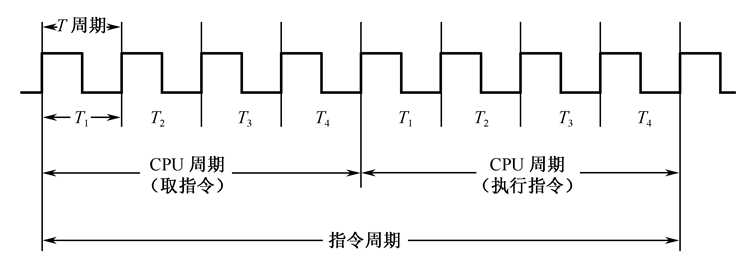
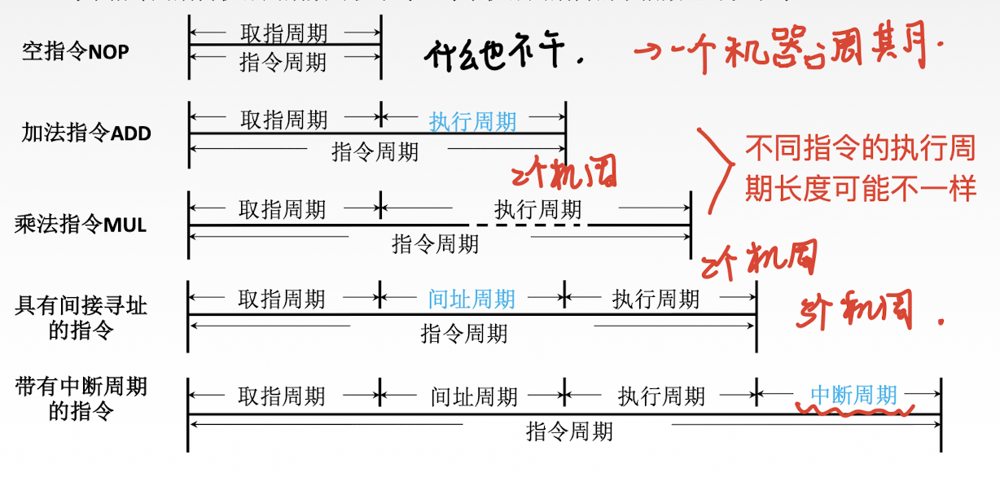

## 指令周期

- CPU 从主存中每取出并执行一条指令所需的全部时间
- 常用若干机器周期来表示

## 机器周期

- 指令周期常常用若干机器周期来表示，
  - 机器周期又叫 CPU 周期
  - 一个机器周期又包含若干时钟周期
  - 也称为节拍、T 周期或 CPU 时钟周期，它是 CPU 操作的最基本单位
- 机器周期 == CPU 周期
  - 完成指令中某一步操作所需要的时间
  - **机器周期 (CPU 周期) 包含若干个时钟周期**
- 时钟周期
  - 时钟周期 = 节拍 = T 周期 = CPU 时钟周期
  - **时钟周期是 CPU 操作的最基本单位**
- 分类
  - 定长的机器周期
  - 不定长的机器周期

- 每个指令周期内机器周期数可以不等，每个机器周期内的节拍数也可以不等

### 周期总结

> [【浅析】CPU 中的指令周期、CPU 周期和时钟周期](https://zhuanlan.zhihu.com/p/90829922)

| 周期 | 解析|
|--|--|
| 时钟 周期| 又称震荡周期，是计算机工作的最小时间单位，由系统时钟的频率决定。|
| 机器 周期| CPU 周期又称机器周期，它由多个时钟周期组成， 一条指令执行过程被划分为若干阶段，每一阶段完成所需时间 |
| CPU 周期 | 同机器周期|
| 中断 周期| 两次中断的间隔|
| 指令 周期| CPU 从取来一条指令到指令完成所需要的时间。通常等于若干个时钟周期。 指令周期划分为四个阶段: 取址周期、间址周期、执行周期、中断周期。|
| 存取 周期| 存取周期是从启动一次存储器操作 (如读取或写入) 到完成该操作所需的时间。 存取周期包括存取时间 (访问存储器的时间) 和恢复时间 (存储器准备进行下一次操作的时间) 是两次独立存储器操作之间的最小间隔。|
| 总线 周期| 包括 (主设备) 申请分配、寻址 (找从设备)、传送数据、结束 (撤销) 四个阶段， 若是总线上只有一个主设备 (例如 CPU)，则只有寻址、传送数据两个阶段了  也就是 一般指 CPU 通过总线和存储器或 I/O 接口进行一次数据传输所需要的时间 |

    时钟周期 < 机器周期 = CPU 周期 <= 指令周期(取等号当且仅当单周期 CPU)
    总线周期 < 存储周期 < 指令周期

## 指令周期流程

- `取指周期 -> 间址周期 -> 执行周期 -> 中断周期 (有可能不需要间址周期)`
  - `FE--> 取指周期` : 取指令并计算下一条指令地址
    - 从 PC 指向的内存单元中取出指令，送到指令寄存器 (IR)
    - 计算下一条指令的地址并送到 PC
- 顺序执行的指令:
  - 将 PC 加上当前指令长度即可得到下一条指令地址
- 改变执行顺序的指令:
  - 如遇到转移指令等改变执行顺序的指令时，需要根据指令操作码和寻址方式决定下一条指令地址的计算方式
- `IND --> 间址周期`: 判断是否需要间址
  - 如果需要间址，那么根据寻址方式计算操作数的有效地址
- `EX--> 执行周期`
  - 取操作数，数据操作，存操作数，取出操作数
  - 在 ALU 或加法器等运算部件中对取出的操作数进行运算，并完成存操作数的任务
- `INT--> 中断周期`: 中断处理
  - 如果 CPU 检测到中断请求，进入中断周期，此时需要关中断、保存断点、执行中断服务程序等

- 取指阶段
  
- 执行阶段【数据传输类】
  
- 执行阶段【转移类指令】
   
- **四个工作周期都有 CPU 访存操作，只是访存的目的不同**

| CPU 工作周期  | 访问目的                             |
|---------------|--------------------------------------|
| 取指周期      | 取指令                               |
| 间址周期      | 取操作数有效地址                     |
| 执行周期      | 取操作数、存操作数                   |
| 中断周期      | 保存断点、执行中断服务程序、恢复断点 |

## 指令执行方案

一个指令周期通常包括几个时间段 (执行步骤)，每个步骤完成指令的一部分功能，几个依次执行的步骤完成这条指令的全部功能

### CPU 指令执行的过程

1. **取指令**: 从 PC 指出的内存单元中取出指令送到指令寄存器 (IR)
   - 异常: 缺页，越界，访问权限保护错
2. **PC 更新**: `PC -> PC + 1`
3. **指令译码**: 对 IR 中的指令进行译码，确定指令的操作码，同时计算下条指令的地址
   - 不同指令有不同的操作码，指令涉及的操作过程不同，需要不同的控制信号
   - 异常: 非法指令
4. **计算源操作地址**
   - 异常: 运算溢出 (例如整数溢出、浮点异常)
5. **取操作数**
   - 异常: 缺页异常，越界，访问权限保护错
6. **对操作数进行相应的运算**
   - 异常: 运算溢出 (例如整数溢出、浮点异常)
7. **计算目的操作数地址**
   - 异常: 运算溢出 (例如整数溢出、浮点异常)
8. **存储操作数**
   - 异常: 缺页，越界，访问权限保护错
9. **中断检测**: 检测是否有 " 中断 " 请求，有则转中断处理

### 单指令周期

- 单指令周期，对所有指令都选用相同的执行时间来完成。`CPI=1`
- 每条指令在一个时钟周期内完成，时钟周期选取时间最长的访存指令的执行时间
- 指令周期取决于执行时间最长的指令的执行时间。对于那些本来可以在更短时间内完成的指令，要使用这个较长的周期来完成，会降低整个系统的运行速度
- 指令之间串行执行

### 多指令周期

- 多指令周期，对不同类型的指令选用不同的执行周期来完成。`CPI>1`
- 指令之间串行执行
- **优点**:
  - 时钟周期短
  - 不同指令所用周期数可以不同
  - 允许功能部件在一条指令执行过程中被重复利用

### 流水线方案

- 流水线方案，在每一个时钟周期启动一条指令。`CPI = 1`
  - 尽量让多条指令同时运行，但各自处在不同的执行步骤中
- 指令之间并行执行 (由于不同阶段使用的硬件部件不一样，所以可以并行)
