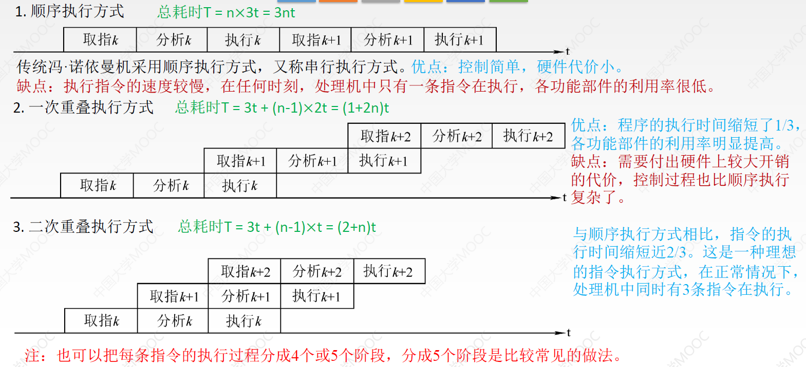
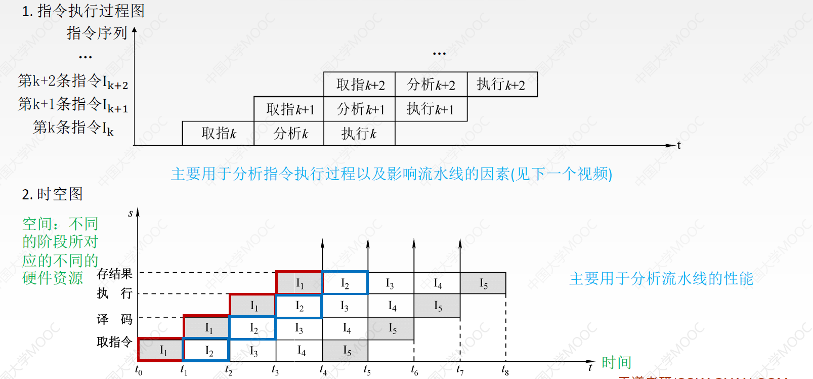

## 指令流水线的基本概念

现代计算机普遍采用指令流水线技术，使得同一时刻有多条指令在 CPU 的不同功能部件中**并发执行**
 一条指令的执行过程可被分成若干阶段，每个阶段由相应的功能部件完成，构成了一条指令流水线

|    流水段    | 描述              |
| :-------: | --------------- |
| 取指令 (IF)  | 从 Cache 或主存取指令  |
| 指令译码 (ID) | 产生指令执行所需的控制信号   |
| 取操作数 (OF) | 读取存储器操作数或寄存器操作数 |
|  执行 (EX)  | 对操作数完成指定操作      |
|  写回 (WB)  | 将操作数写回存储器或寄存器   |

- 后一条指令的第 k 步与前一条指令的第 k+1 步同时执行，使总的完成时间大幅缩短
- 理想情况下，每个时钟周期都有一条指令进入流水线并执行完成，每条指令的时钟周期数 (CPI) 为 1

## 适合流水线的指令集特征

1. **指令长度一致**: 有利于简化取指令和指令译码操作
   - 如:MIPS 指令都是 32 位，每条指令占 4 个存储单元
   - 80x86 指令长度不一，取指令部件复杂
2. **指令格式规整**: 源寄存器的位置相同，有利于在指令未知时就可取寄存器操作数
3. **采用 LOAD/STORE 型指令**: 其他指令都不能访问存储器，简化操作步骤，规整流水线
4. **数据和指令按边界对齐存放**: 减少访存次数，提高效率

## 指令流水线的基本实现

### 流水线的设计原则

1. **指令流水段个数**: 以最复杂指令所用的功能段个数为准
2. **流水段的长度**: 以单段所花时间最长的操作为准

### 机器周期的设置

- 设计原则
  - 为方便流水线设计，将每个阶段的耗时取成一样，以最长耗时为准。即此处应将机器周期设置为 100ns

- **缓冲寄存器**【2022】

  - 流水线的每一个功能段部件后面都要有一个缓冲寄存器，也称为锁存器。它的作用是保存本流水段的执行结果，以供下一流水段使用。
  - 例如，如果我们要求每个阶段耗时 100ns，但执行阶段需要在 200ns 的时候才要输入数据，而第二个阶段 (指令解码阶段) 只需要 80ns 就完成了，那么我们就需要一个缓冲寄存器来存储结果，以便更方便地统一每个阶段的实际开销

- Cache 访问

  - 第一阶段和第四阶段的取指和取数据都是优先访问 Cache
  - 根据局部性原理，这两个阶段有很大的概率命中 Cache
  - 我们可以把 Cache 分为 Instruction 和 Data 两个模块，这样第一个阶段和第四个阶段所需的硬件部件就可以 **并行工作**

- 指令译码和写回操作

  - 在 ID(指令译码) 阶段，我们不仅要进行译码，同时也要从寄存器中读出需要的数据。而在 WB(写回) 阶段，我们又要往寄存器中写数据。这两个操作可能会造成一些问题

### 流水线的逻辑结构

- **流水段寄存器**: 每个流水段后面增加一个流水段寄存器，用于锁存本段处理完的所有数据，保证结果能在下个时钟周期给下一流水段使用
  
- **统一时钟同步**: 各种寄存器和数据存储器均采用统一时钟 CLK 进行同步，每来一个时钟，各段处理完的数据都将锁存到段尾的流水段寄存器中，作为后段的输入

- **指令并行执行**: 一条指令依次进入 IF、ID、EX、MEM、WB 五个功能段进行处理。第一条指令进入 WB 后，各流水段将包含一条不同的指令，流水线中将同时存在 5 条不同的指令并行执行

### 流水线的时空图表示

- 通常用时空图直观描述流水线的执行情况，如图所示
 

- 横坐标表示时间，它被分割成长度相等的时间段 T
- 纵坐标表示空间，表示当前指令所处的功能部件
- 第一条指令 I1 在时刻 0 进入流水线，在时刻 5T 流出流水线
- 每隔时间 T 就有一条指令进入流水线
- 从 5T 开始每隔时间 T 就有一条指令流出流水线

### 🌟🌟🌟 流水线数据通路

- 如图，每条指令的执行都经历五个流水段，每个流水段都在不同的功能部件中执行。流水段之间有一个流水段寄存器，存放从当前流水段传到后面所有流水段的信息。下边分别介绍各流水段的功能

- **IF 段**
  - 功能: 将 PC 的值作为地址，从指令存储器中取指令放入 IF/ID 寄存器中，并计算 PC+4，送入 PC 输入端
  - 指令不总是顺序执行，当执行到分支指令或无条件转移指令时，PC 的值可能被修改，因此 PC 的输入来自一个多路选择器，多路选择器的两端输入分别是 PC+4 和目标地址。当需要转移时，可以控制转移目标地址送入 PC；不需要转移时，将 PC+4 送入 PC 即可
  - IF/ID 寄存器保存的信息: 取出的指令；PC+4 的值 (如果需要进行相对寻址，会用到 PC+4 的值，所以为了方便直接将 PC+4 的值向后传递即可)

- **ID 段**
  - 功能: 根据指令中的 Rs 和 Rt 的值到寄存器堆中取出对应寄存器的值，同时对指令中的操作码 op 字段进行译码，生成对应的控制信号
  - ID/EX 寄存器保存的信息:Rs 的值、Rt 的值、Rt、Rd、PC+4 等

- **EX 段**
  - 功能: 由具体指令决定，通常借助 ALU 进行运算操作
  - 如: 运算指令计算两数运算结果；与立即数相加计算主存地址；在分支指令中计算减法运算；计算生成转移目标地址等等

- **MEM 段**
  - 功能: 由具体指令决定
    - 当指令不需要访存时，在该段为 " 空 " 操作，把相应信息送到下一个流水段即可
    - 当指令需要取数时，从主存中读出数据送至 Mem/Wr 寄存器
    - 当指令需要写数时，向主存中写入数据
    - 当指令为跳转指令，需要更新 PC 值时，在该阶 s 段更新 PC 值

- **WB 段**
  - 功能: 写回阶段，根据指令类型，将 ALU 计算的结果或从内存读取的数据写回寄存器堆中的目标寄存器

| 指令类型 | IF | ID | EX| MEM | WB |
|--|--|--|:--:|--|--|
| 计算类指令 | 取指  | 译码； 读寄存器堆| 计算| -| 结果写回寄存器堆|
| 存取类指令 |^|^| 计算访存有效地址| 访存| 将读出的数据写入寄存器堆/ - |
| 转移类指令 |^|^| 计算转移目标地址； 若为分支指令，还需通过减法设置条件码| 若条件成立，将转移目的地址送入 PC |-|

## 🌟🌟🌟 流水线的处理与冒险

### 结构相关 (资源冲突) ——互斥

#### 解决办法

a.在前一指令访存时，将后一条冲突指令 (及其后续全部指令) 暂停一个时钟周期
b.设置多个独立的部件避免硬件资源冲突。例如: 将寄存器读口和写口独立开来，利用时钟上升沿和下降沿两次触发，使得前半周期使用写口进行寄存器写，后半周期使用读口进行寄存器读; 将指令存储器和数据存储器分开，从而使指令和数据的访问各自独立等。实际上，现代 Cache 机制中，L1 级 Cache 通常采用数据 Cache 和指令 Cache 分离的方式，避免了资源冲突的发生，

### 数据相关 (同步问题) ——同步

- 概念
  - 数据相关指在一个程序中，存在必须等前一条指令执行完才能执行后一条指令的情况，则这两条指令即为数据相关  >

  > [! ]  **数据冒险的判断是根据该指令与前一条指令的比较，发生数据冒险是当前指令，而不是前一条指令**

#### 解决办法

- 把遇到数据相关的指令及其后续指令都暂停一至几个时钟周期，直到数据相关问题消失后继续执行。分为硬件阻塞 (stall) 和软件插入 "NOP" 两种方法
- 数据旁路技术
- 编译优化: 通过编译器调整指令顺序来解决数据相关

- 问题: 后序的 r1 的数据必须要在第一条指令执行完毕后才能正确使用 r1 中的数据

- 方法 1: 把遇到数据相关的指令及其后续指令都暂停一至几个时钟周期，直到数据相关问题消失后再继续执行。可分为硬件阻塞 (stall) 和软件插入空指令 (NOP) 两种方法

- 方法 2: 数据旁路技术
- 因为 r1 已经在 E 执行阶段进行运算器 ALU 的处理后已经有结果了，我们可以直接把第一条指令的 ALU 输出端直接送回给第二条指令的 ALU 的输入端 (ALU 自己的输出端接到输入端)
- 
- 方法 5: 编译优化——把后序用不到 r1 的指令提前执行
- 

### 控制相关 (控制冲突)

- 概念
  - 当流水线遇到**转移指令和其他改变 PC 值的指令**而造成断流时，会引起控制相关
- 分支指令引起的控制冒险

 

- 异常或中断引起的控制冒险

 

#### 解决办法

### 区分数据冒险和控制冒险

## 流水线的主要性能指标

> 理想情况: 各阶段花费时间相同, 每个阶段结束后能立即进入下一阶段

### 吞吐率

 

### 加速比

### 效率

## 🌟🌟🌟 五段式流水线

- 时间并行性原理，而非空间并行性原理
- 每条指令前两个功能段相同，无需控制信号
- IF: 取指令并计算 PC+4
- ID: 寄存器取数并译码

## 高级流水线技术

为了增加指令级并行度（Instruction Level Parallelism，ILP），有两种常用策略：

1. **多发射技术**：通过采用多个功能部件，使得流水线的功能段可以同时处理多条指令，处理器一次可发射多条指令进入流水线执行。
2. **超流水线技术**：通过增加流水线级数来提高并行度，使得更多指令可以在流水线中重叠执行。

### 超标量流水线技术

- 在每个时钟周期内，可以并行执行多条独立指令。
- 需要配置多个功能部件来支持多条指令的并发执行。
- 使用动态调度和动态分支预测技术，不按固定顺序执行指令，这称为**乱序执行**。
- 为了提高指令级并行度，编译器会优化指令顺序，使可并行的指令能够合理搭配。
- 也称为**动态多发射技术**。
- 在这种架构下，**CPI（每条指令的时钟周期数）通常小于 1**，表明多个指令在同一个时钟周期内完成。

### 超长指令字技术

- 由编译器在编译阶段分析和挖掘出指令间的潜在并行性。
- 将多条能并行执行的指令组合成一条包含多个操作码字段的 " 超长指令 "。
- 配置多个处理部件以同时执行各个操作码字段中的指令。
- 也称为**静态多发射技术**。
- 在这种架构下，**CPI 通常为 1**，表明一个时钟周期内执行一条包含多个操作的 " 超长指令 "。

### 超流水线技术

- 在一个时钟周期内对流水段进一步分段，使得每个功能部件可以在一个时钟周期内被使用多次。
- 通过增加流水线级数来提高流水线的并行度，进一步缩短流水线每一级的时钟周期。
- 不能调整指令的执行顺序，编译器需要优化指令序列以最大化性能。
- 超流水线技术能够在更高主频下工作，虽然**CPI 为 1**，但处理器的整体吞吐率因主频提高而增强。

### 比较

- **超标量流水线技术**：每个时钟周期内可以并发执行多条独立指令，采用乱序执行，**CPI < 1**。
- **超流水线技术**：通过进一步划分流水线级数来增加主频，并提升流水线并行度，虽然**CPI = 1**，但因更短的时钟周期而实现更高的整体性能。
- **超长指令字技术（VLIW）**：将多条指令捆绑成一个超长指令字，由编译器静态挖掘并行性，通过多个处理部件同时执行操作，**CPI = 1**。此技术具有较高的并行处理能力，但对编译器优化和 Cache 容量要求较高。

### 运算类指令

### LOAD 指令 (lw 指令)

- 通常，RISC 处理器只有 " 取数 LOAD" 和 " 存数 STORE" 指令才能访问主存

### STORE 指令

### 条件转移指令 (beq 指令)

- 特点: 在 MEM 段将 PC 值写回了

### 无条件转移指令 (j 指令)

- 特点: 在 EX 段写回 PC
