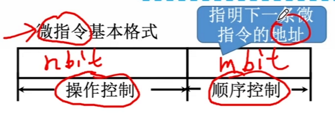
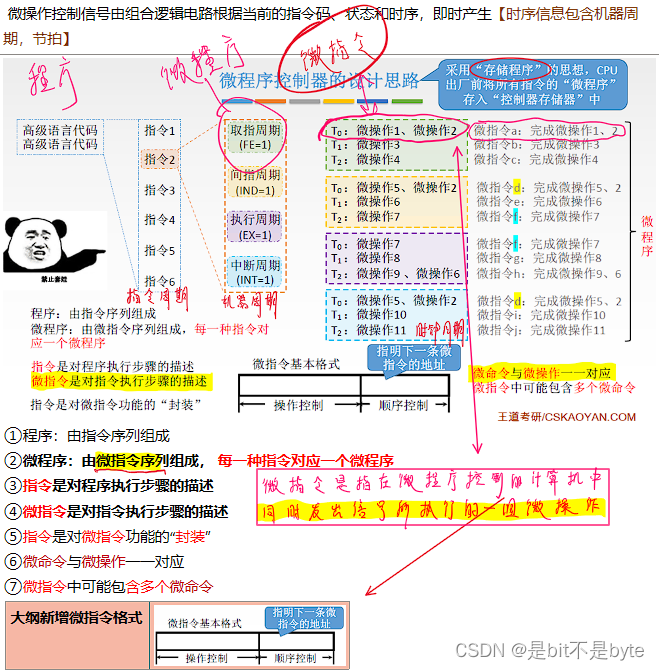
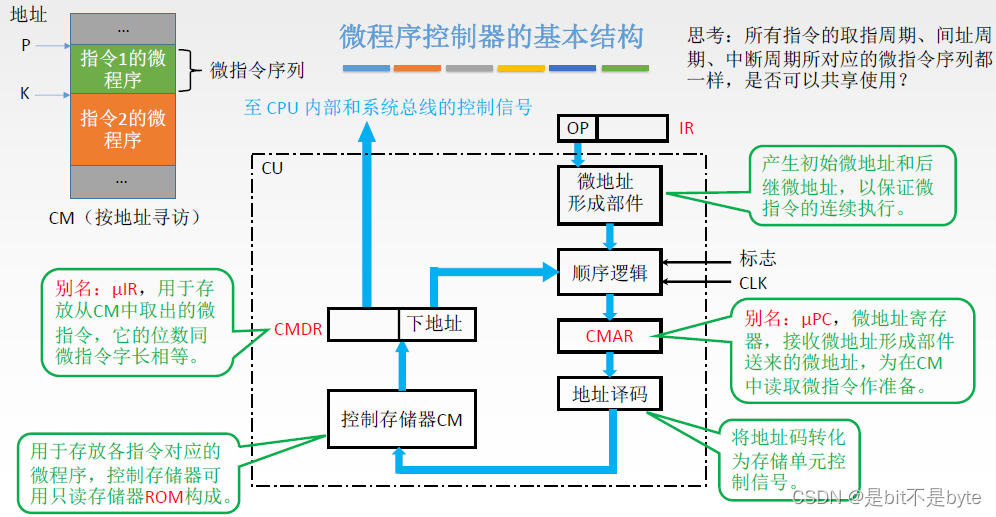
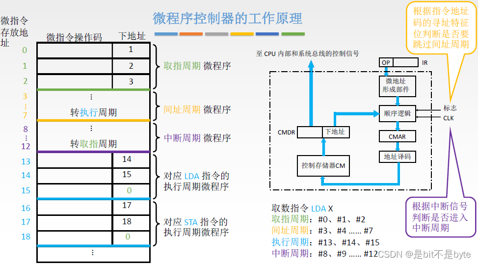
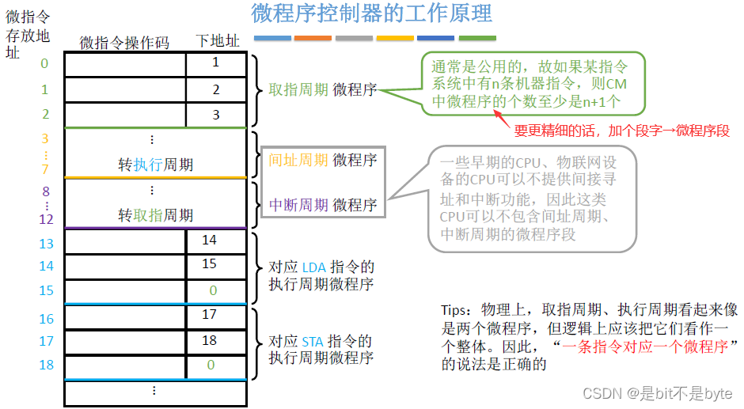
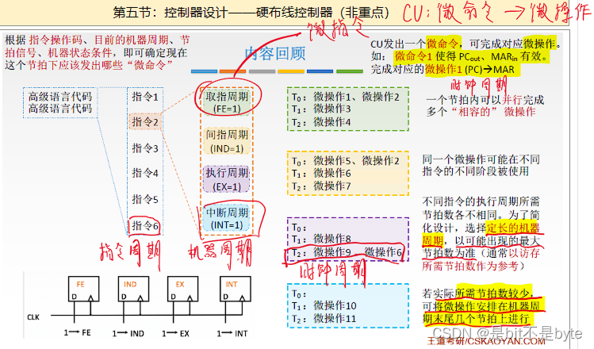

## 微程序控制的基本概念

### 控制存储器 (CM): 在 CPU 中的控制存储器

- **主存**: 在 CPU 的 `外部`，用于存放 `程序和数据`，用 `RAM` 实现
- **控制存储器 (CM)**: 在 CPU 的 `内部`，用于存放 `微程序`，用 `ROM` 实现

### 微命令与微操作

- **微命令**: 在微程序控制的计算机中，将控制部件向执行部件发出的各种控制命令称为微命令，是微操作的控制信号
- **微操作**: 是微命令的执行过程，一个机器指令可以分解成一个微操作序列，这些微操作是计算机中最基本的、不可再分解的操作

#### 微命令的分类

- **相容性微命令**: 可以**同时产生、共同完成**某一些微操作的微命令
- **互斥性微命令**: 在机器中**不允许同时出现的微命令**

### 微指令

> [! ] 微指令是若干微命令的集合

- 包含操作控制字段/微操作码字段和顺序控制字段/微地址码字段
  - **操作控制字段/微操作码字段**: 用于产生某一部操作所需要的各种操作控制信号
  - **顺序控制字段/微地址码字段**: 用于控制产生下一条要执行的微指令地址

### 微周期： 指从控制存储器中读取一条微指令并执行相应微操作所需要的时间

### 微地址：存放微指令的控制存储器的单元地址称为微地址

### 程序和微程序

- **程序**: 指令的有序集合，用于完成特定的功能
- **微程序**: 微指令的有序集合，一条指令的功能由一段微程序实现

### 指令、微程序、微指令、微命令、微操作它们之间的关系

### 微程序控制器的基本原理

#### 微程序控制器的基本结构

- **微地址形成部件**：负责生成下一条要执行的微指令的地址
- **微程序存储器（控制存储器）**：存放机器指令对应的微程序

> [! ] 不同机器指令有不同的微程序
> 微地址形成部件根据机器指令的 `操作码（OP）` 确定微程序的起始地址

#### 微程序控制器的工作原理

- **指令周期**: 从主存取出并执行一条机器指令所需的时间
- **指令周期** = 取址周器 + 间址周期 + 执行周期 + 中断周期
  - **取址周期**：确定下一条要执行指令的地址
  - **间址周期**（可选）：通过间接地址确定指令的实际地址
  - **执行周期**：执行当前指令
  - **中断周期**（可选）：处理中断信号

- 处理取址周期、间址周期、中断周期的微指令序列通常是公用的
- 执行周期的微指令序列各不相同

- **微周期**：是从控制存储器中取出一条微指令并执行相应操作的时间

- **存储地址确定**：指令的操作码决定了要执行的微程序的起始地址，而取指周期的微指令序列通常从固定地址开始（例如从 `#0`）

#### 微程序

- **一条机器指令对应一个微程序**：每一条机器指令的执行过程由相应的微程序控制
- **取指操作是公共的**：所有机器指令的取址操作（从内存中取出指令）相同，通常可以使用同一组微指令，这样能够节省存储空间
- **微程序数量**：

  - 控制存储器 (CM) 中存储的微程序数量等于机器指令数，外加取指、间址和中断周期的公用微程序数
  - **公用微程序**：取指的微程序是公共的，也就是所有指令都共用这一段微程序
  - **间址和中断微程序**：间址和中断操作可能并不是所有指令都共享，需要根据具体情况来决定是否公用

### 微指令的编码方式

- **概念**: 微指令的编码方式又称为微指令的控制方式
- 它是指如何对微指令的控制字段进行编码，以形成控制信号
- 编码的目标是在保证速度的情况下，尽量缩短微指令字长

##### 直接编码方式

- **概念**: 也称为**直接控制方式**，在微指令的操作控制字段中，每一位代表一个微操作命令，某位为 "1" 时表示该控制信号有效，无需译码
- **优点**:
  - 简单、直观，执行速度快
  - 操作并行性好，能同时发出多个控制信号
- **缺点**:
  - 微指令字长过长，n 个微命令就需要 n 位控制位，增加了控存容量
  - 有效微命令少，造成存储空间利用率低

##### 字段直接编码方式

- **概念**：将微指令的控制字段划分为多个 " 段 "，每个段通过译码发出控制信号
- **分段原则**：
  - 互斥性微命令分在同一段，相容性微命令分在不同段
  - 每段信息位不能太多，否则会增加译码复杂度
  - **每个段通常有一个状态表示不发出微命令（如全 0）**

> [! ] 如果一个互斥类需要 n 个微命令，则操作控制字段需要 $ceil  (\log (n+1))$
> eg: 7 个需要 3 位，8 个需要 4 位

- **优点**：有效缩短了微指令字长，节省存储空间
- **缺点**：由于要经过译码过程，发出微命令的速度比直接编码方式慢

##### 字段间接编码方式

- **概念**：一个字段中的某些微命令需要由另一个字段中的微命令解释，即通过其他字段的命令来间接发出微命令，也称**隐式编码**
- **优点**：可以进一步缩短微指令字长
- **缺点**：降低了并行控制能力，执行速度较慢，通常作为字段直接编码的辅助手段

### 微指令的地址形成方式【断定方式】

> 测试网络

![[images/Pasted image 20241028205252.png]]

> 微程序入口地址【**硬件**产生】

- **加电后取指周期的入口地址**：
  - 当系统加电后，第一条微指令的地址通常由专门的硬件电路产生
  - 该地址对应取指周期微程序的入口地址，确保 CPU 在加电后正确读取并执行第一条指令
- **外部输入入口地址**：

  - 微程序控制存储器（CM）中的微指令地址可以通过外部设备直接输入到控制存储器地址寄存器（CMAR）中
  - 这种方式可以由外部设备或程序控制输入，直接引导系统执行特定微程序
- **中断周期的入口地址**：

  - 当系统收到中断请求，且满足中断条件时，CPU 会中断当前执行的程序，进入中断周期
  - 控制单元设计时已为中断周期安排好微程序入口地址。响应中断时，由硬件自动生成中断周期的入口地址，使系统能够迅速进入中断处理阶段
- **间址周期的入口地址**：

  - 当指令需要间接寻址时，CPU 会进入间址周期
  - 类似中断周期，间址周期的微程序入口地址由硬件生成，控制器根据此地址执行与间址操作相关的微指令

---

　图中多路选择器可选择四路地址：
　　- (CMAR)+1→CMAR；
　　- 微指令的下地址字段；
　　- 指令寄存 (通过微地址形成部件)；
　　- 微程序入口地址

### 微指令的格式

##### 水平型微指令

##### 垂直型微指令

##### 混合型微指令

## 微程序控制单元的设计

### 设计步骤

1. 分析每个阶段的微操作序列

2. 写出对应机器指令的微操作命令及节拍安排

3. 确定微指令格式

4. 编写微指令码点

### 硬布线控制器

 微操作控制信号由组合逻辑电路根据当前的指令码、状态和时序，即时产生【**时序信息包含机器周期，节拍**】

## 硬布线控制器

### 硬布线控制器的设计步骤

1. **分析每个阶段的微操作序列**
   - 了解指令执行过程中的每一个微操作，并确定这些操作的顺序。

2. **选择 CPU 的控制方式**
   - 决定使用硬布线控制还是微程序控制。

3. **安排微操作时序**
   - 根据指令周期和各个微操作的时序，确定控制信号的生成时刻。

4. **电路设计**
   1. **列出操作时间表**
      - 明确每个微操作的具体执行时间。
   2. **写出微操作命令的最简表达式**
      - 使用布尔代数或其他简化方法表示控制信号。
   3. **画出逻辑图**
      - 设计实现控制信号生成的逻辑电路。

### 硬布线控制器的特点

1. **复杂性与扩展性**
   - 指令越多，设计和实现就越复杂。因此硬布线控制器一般用于精简指令集计算机（RISC）架构中。
   - 如果需要扩充新的指令，则控制器的设计需要大改，因此扩充指令较困难。

2. **执行速度**
   - 由于使用硬件实现控制，硬布线控制器的执行速度很快。

3. **控制信号生成**
   - 微操作控制信号由组合逻辑电路即时产生，具有高效、快速的特点。

## 硬布线控制器和微程序控制器比较

|          |              微程序控制器               |              硬布线控制器              |
| :------: | :-------------------------------: | :------------------------------: |
| 工作 原理 | 微操作控制信号以微程序的形式存放在控制存储器中，执行指令时读出即可 | 微操作控制信号由组合逻辑电路根据当前的指令码，状态和时序即时产生 |
| 执行 速度 |                 慢                 |                快                 |
| 是否 规整 |                 是                 |                否                 |
| 应用 场合 |            CISC 和 CPU             |            RISC 和 CPU            |
| 易扩 充性 |               易于扩充                |               很难扩充               |
