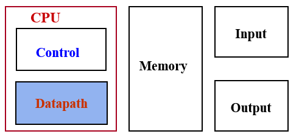
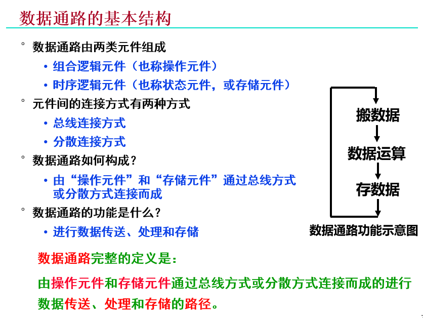
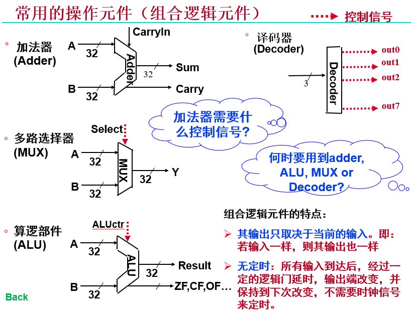
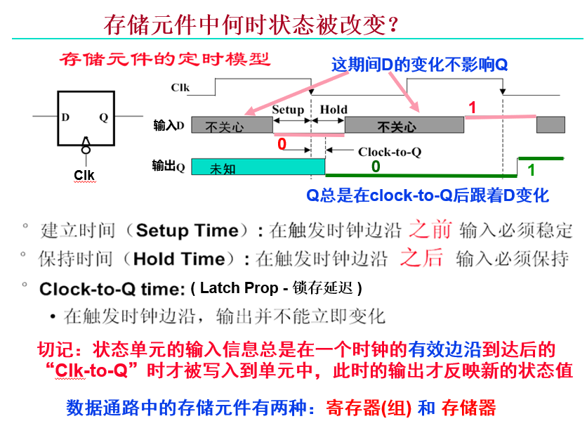
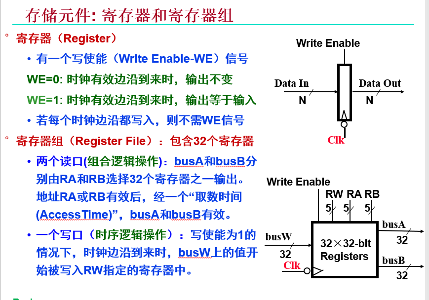
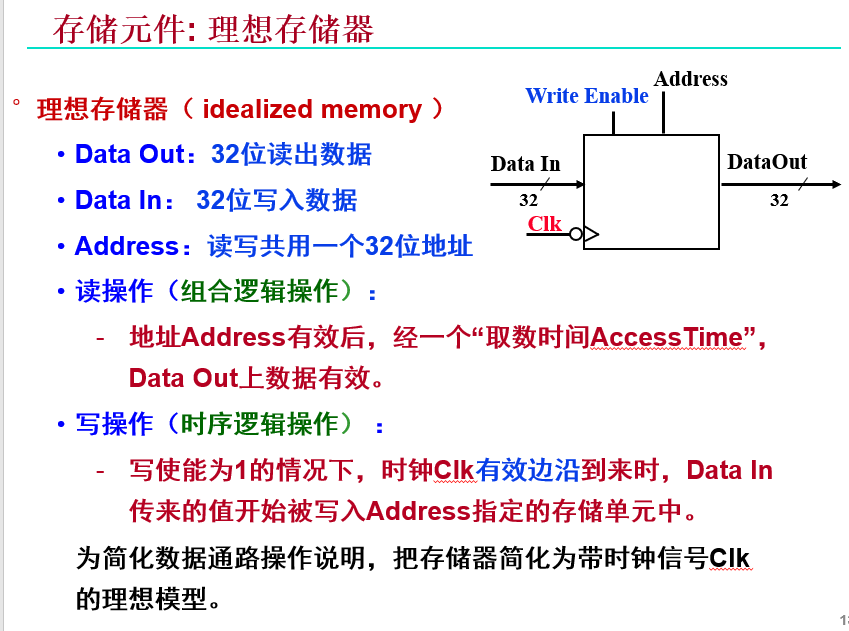
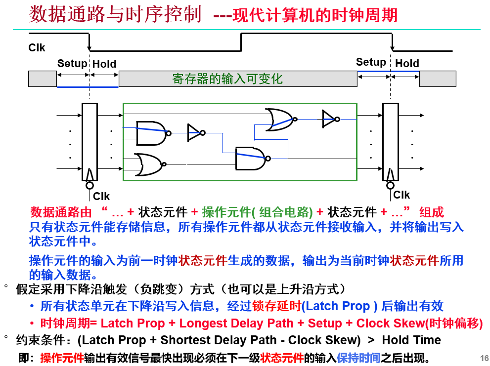

## 数据通路

### 数据通路的功能

- 指令执行过程中，数据所**经过的路径，以及路径上的部件**。
- 包括：**ALU**、**通用寄存器**、**状态寄存器**、**MMU**、**cache**、**中断处理逻辑**等。
- 数据通路中专门进行数据运算的部件称为**执行部件**或**功能部件**。
- 控制器对指令进行译码，生成指令对应的控制信号，控制数据通路的动作。它向执行部件发出控制信号，是指令的**控制部件**。
- CPU 是由**数据通路**和**控制部件**组成。

## 数据通路的基本结构

## 操作元件

## 存储元件

- 特点: 具有存储功能，在时钟控制下输入被写到电路中，直到下个时钟到达。输入端状态由时钟决定何时被写入，输出端状态随时可以读出
- 定时方式: 边沿触发。在时钟上升/下降沿读写
- Setup/Hold/Clock-to-Q

### 寄存器 (组)

### 理想存储器

## 时序控制

## 内部总线

- 内部总线是指同一部件，如 CPU 内部连接各寄存器及运算部件之间的总线

## 系统总线

- 系统总线是指同一台计算机系统的各部件，如 CPU、内存、通道和各类 I/O 接口间互相连接的总线

## CPU 内部单总线方式

## 专用通路结构

专用数据通路各部件之间的线路使用多路选择器 MUX 或者三态门Δ

1. **自动 "+1" 寄存器和地址寄存器的确定:**
    - 能自动 "+1" 的是 PC，PC 内容是地址，送 MAR，故 c 是 MAR，b 与微操作信号发生器相连，是 IR 与主存相连的寄存器是 MAR 和 MDR，c 是 MAR，则 a 是 MDR
    - 数据通路:(PC) → MAR → M(MAR) → MDR → IR → (PC)+1→PC

2. **数据在运算器和主存之间进行存/取访问的数据通路:**
    - 存/取的数据放到 ACC 中设数据地址已放入 MAR
    - 取数据通路:M(MAR) → MDR → ALU→ ACC
    - 存数据通路:(ACC) → MDR → M(MAR)

3. **完成指令 LDA X 的数据通路 (X 为主存地址，LDA 的功能为 (X)→ACC):**
    - 数据通路:X → MAR → M(MAR) → MDR → ALU→ ACC

4. **完成指令 ADD Y 的数据通路 (Y 为主存地址，ADD 的功能为 (ACC)+(Y)→ACC):**
    - 数据通路:Y → MAR → M(MAR) → MDR → ALU, (ACC) → ALU → ACC

5. **完成指令 STA Z 的数据通路 (Z 为主存地址，STA 的功能为 (ACC)→Z):**
    - 数据通路:Z → MAR → (ACC) → MDR → M(MAR)

## 例题

