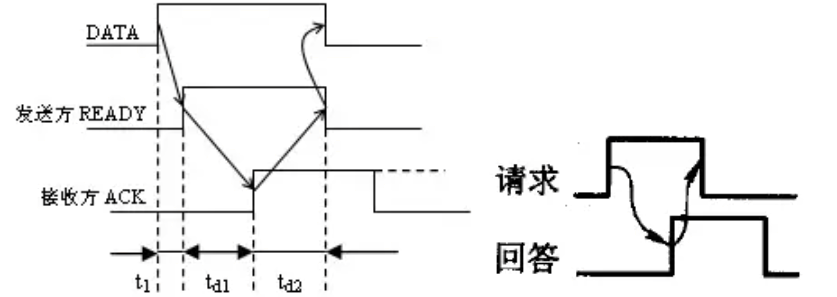
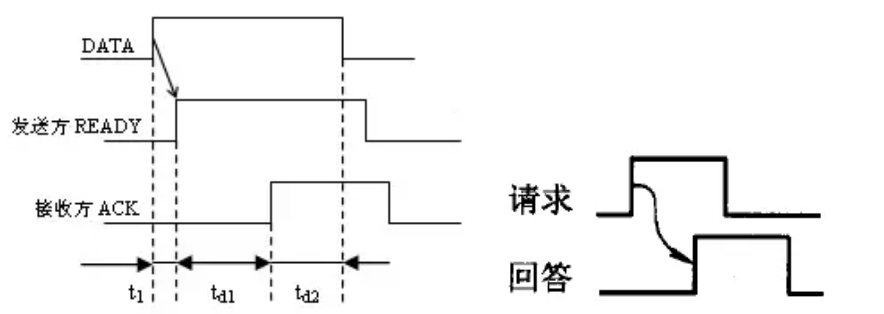
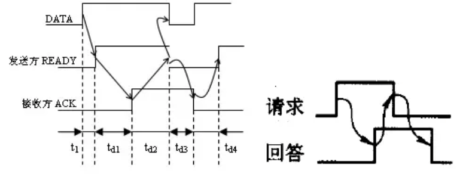

## 总线的基本概念

- **定义**: 总线是一组能为多个部件 **分时共享** 的公共 **信息传送线路**

### 总线特点

- **分时**: 同一时刻只允许有一个部件向总线发送信息。若系统中有多个部件，则它们只能分时地向总线发送信息
- **共享**: 总线上可以挂接多个部件，各个部件之间互相交换的信息可以通过这组线路分时共享，多个部件可同时从总线上接收相同的信息

### 总线设备

- **主设备**: 发出总线请求且获得总线控制权的设备
- **从设备**: 被主设备访问的设备，它总能响应从主设备发来的各种总线命令

> [! NOTE] **主设备和从设备与发送者和接受者是两个不同的概念**
> **无论是数据的发送还是接收，主设备始终是控制者。**
> 数据传输 `A -> B`
>
> - CPU 向磁盘写数据 `CPU -> 磁盘` 这时主设备是 CPU，从设备是磁盘
> - CPU 向磁盘读数据 `磁盘 -> CPU` 这时主设备是磁盘，从设备是 CPU

### 总线特性【结合计网】

- **机械特性**: 尺寸、形状、管脚数、排列顺序
- **电气特性**: 传输方向和有效的电平范围
- **功能特性**: 每根传输线的功能 (地址、数据、控制)
- **时间特性**: 信号的时序关系

## 总线的分类

### 按总线的功能层次

#### 内部总线/片内总线

- **CPU 芯片内部** 的总线。它是 CPU 芯片内部寄存器与寄存器之间、寄存器与 ALU 之间的公共连接线

#### 系统总线

**定义**: 连接计算机系统内主要部件（如 CPU、主存、I/O 接口）的总线。根据传输信息的内容，系统总线又可分为：

- **数据总线**: 传输*数据*
- **地址总线**: 用于传输存储器或 I/O 设备的*地址*
- **控制总线**: 用于传输控制*信号*，协调系统各部件的操作

### 按传输内容

总线通常由 **一组控制线、一组数据线和一组地址线** 构成。
有些总线没有单独的地址线，地址信息通过数据线来传送，这种情况称为 **数据线和地址线复用**。

#### 数据总线

- **概念**: 传输各功能部件之间的*数据*信息
  - eg: 数据、命令字、地址（数据线、地址线复用）
- **方向**: 信息传递方向是 **双向**
- **位数/根数**: 位数 (根数) 与每次的主存读或写操作只需用数据总线传输一次数据即可)

#### 地址总线

- **概念**: 传输地址信息，包括主存单元或 I/O 端口的*地址*
- **方向**: 信息传递方向是 **单向**（通常从 CPU 到内存或 I/O 设备）
- **位数/根数**: 位数 (根数) 与主存地址空间大小及设备数量有关
  - eg: 新增多个主存或者输入输出设备，那么地址总线的宽度至少就需要把它们的地址信息全部表示出来

#### 控制总线

- **概念**: 用来控制对数据线和地址线的访问和使用。传输各种 *命令* (指令是由数据总线传输)、反馈和定时信号，eg: 时钟、复位、总线请求/允许、中断请求/回答、存储器读/写等
- **方向**:
  - 对于单根控制线来说传输方向肯定是单向的
  - 对于整根控制总线来说传输方向是双向的
    - **有出**: CPU 送出的控制命令
    - **有入**: 主存 (或外设) 返回 CPU 的反馈信号
- **位数/根数**: 一根控制总线包含多根控制线，每一根控制线可以负责传输一个信号

### 按数据传输方式

#### 串行总线

- 每次只能传送 **一位比特** 的信息 (如 USB)
- **优点**:
  - 只需要一条传输线，**抗干扰能力强，成本低廉**，广泛应用于 **长距离传输**；
  - 应用于计算机内部时，可以 **节省布线空间**
- **缺点**:
  - 发送和接收时需要进行串行
  - 并行转换，增加了复杂度
  - 相比并行总线，传输速度较慢

#### 并行总线

- 每次可以传送 **多位比特** 的信息 (如 `CPU←→主存`)
- **优点**:
  - 总线的逻辑时序比较简单，电路实现起来比较容易
- **缺点**:
  - 需要多条信号线，占用更多布线空间，远距离传输成本高
  - 高频时，并行信号线之间会产生**干扰**，限制了并行总线的传输速度

#### 总结

- **传输速度**: 在相同工作频率下，**并行总线**的传输速度比**串行总线**快。但串行总线可以通过提高工作频率，最终传输速度超过并行总线
- **传输距离**: 串行总线适用于长距离传输，而并行总线适合短距离高带宽的传输

#### I/O 总线

- 连接中低速的 I/O 设备，通过 I/O 接口与系统总线相连接
- 目的是将低速设备和高速总线分离，提升总线的系统性能

### 按时序控制方式

#### 同步总线

- **定义**: 互联的部件或设备通过统一的时钟信号同步运行。所有操作在相同时钟周期内完成，适合于速度较慢的设备
- **特点**:
  - 操作必须按照统一时钟的节拍进行，限制了总线的长度，若设备速度差异过大，会影响总线传输效率
  - 总线定时以最慢设备所花时间为标准

#### 异步总线

- **定义**: 各设备**没有统一的时钟**，通过**握手信号**进行通信，时序不固定
- **特点**:
  - 通过握手协议实现设备之间的数据传输，不需要统一时钟，灵活性高
  - 适合于不同速度设备之间的通信

## 系统总线的拓扑结构

> 与片内总线结构区分

### 单总线结构

- **定义**: CPU、主存、I/O 设备（通过 I/O 接口）都连接在一条总线上，共用该总线传输数据
- **结构**:
  
- **优点**:
  - 结构简单，成本低，易于增加新的设备
- **缺点**:
  - 带宽低，负载重，所有设备争用唯一的总线，不能支持**并发传输**，导致传输速度慢

### 双总线结构 【主存总线 + IO 总线】

- **定义**: 双总线结构中，计算机系统有两条总线，一条用于 CPU 与主存之间的数据传输（**主存总线**），另一条用于外部设备与通道之间的数据传输（**I/O 总线**）
- **结构**:
  
- **注意**:
  - 主存总线支持**突发 (猝发) 传送**: 送出一个地址，收到多个地址连续的数据
  - 通道是具有特殊功能的处理器，对 I/O 设备进行统一管理。通道程序放在主存中
- **优点**:
  - 分离 I/O 设备和主存总线，减少了低速 I/O 设备对总线的占用，实现更高效的传输
  - 支持**突发传送**，一次地址传输后可以接收多个连续数据
- **缺点**:
  - 增加了硬件设备，如通道管理器，用于协调 I/O 设备的传输

### 三总线结构 【主存总线 + IO 总线 + DMA 总线】

- **定义**: 三总线结构使用三条独立的总线，即**主存总线**、**I/O 总线**和**DMA 总线**，以提升 I/O 设备性能和系统吞吐量

- **结构**:
  
- **注意**:
  - 主存总线支持突发 (猝发) 传送: 送出一个地址，收到多个地址连续的数据
  - 通道是具有特殊功能的处理器，对 I/O 设备进行统一管理。通道程序放在主存中
- **优点**:
  - 提高了 I/O 设备性能，特别是**高速 I/O 设备**，通过 DMA 总线加速与主存之间的交互
  - 提高了系统的吞吐量，减少了 I/O 设备对主存总线的占用
- **缺点**:
  - 同一时刻只能使用一条总线，主存总线和 DMA 总线不能同时访问主存，因此系统工作效率较低

### 四总线结构

- **定义**: 四总线结构增加了一条**高速缓存总线**，用于连接高速缓存、主存、CPU 和 I/O 设备，通过四条独立的总线进行数据传输
- **结构**:
  

  > [! ]  " 北桥芯片 " 和 " 南桥芯片 " 就是桥接器

- **优点**:
  - 高速缓存总线可以大大提高 CPU 与高速缓存之间的数据传输效率，减少主存总线的负担
  - 桥接器用于连接不同总线，实现数据缓冲、传输和控制，进一步提升系统性能
- **缺点**:
  - 结构复杂，增加了硬件成本
  - 高速缓存和主存的数据同步问题增加了设计难度
- **桥接器**:
  - 用于连接不同的总线，具有数据缓冲、转换 (把串行输入的数据，通过桥接器并行的发送给 CPU) 和控制功能 (总线仲裁，要把总线的使用权分配给哪个设备)
- **注意**:
  - 越靠近 CPU 的总线速度较快
  - 每级总线的设计遵循总线标准

### 小结

## 总线的性能指标

### 总线的传输周期 (总线时钟周期)

- **定义**: 一次完整数据传输操作所需的时间，包括**申请**、**寻址**、**传输**和**结束**阶段。
- **组成**: 通常由多个总线时钟周期构成。每个总线周期完成一组数据的传输，如 32 位总线一次传输 32 位数据。

### 总线的时钟周期

- **定义**: 总线操作的基本时间单位，类似于 CPU 时钟周期。
- **作用**: 总线时钟周期决定了总线操作的基本时间单位，可能与机器的时钟周期相同，也可能不同

### 总线的时钟频率

- **定义**: 总线时钟的工作频率，是**总线周期的倒数**。
- **计算**: 若总线周期为 N 个时钟周期，则总线工作频率为 1/N
  - 例如，总线周期为 2 秒，则工作频率为 1/2 = 0.5 次/秒

### 总线的工作频率

- **定义**: 总线在 1 秒内传输数据的次数，即总线操作的频率，也是总线周期的倒数
- **计算**:
  - 若总线周期为 $N \times T$，其中 T 为时钟周期时间，则总线的工作频率为：工作频率= $\frac{1}{T \times N}$

### 总线宽度（总线位宽）

- **定义**: 总线中**数据线的条数**，决定了**每次传输的数据位数**，即总线每次传输的数据量。
- **常见位宽**: 并行传输总线的宽度通常为 8 位、16 位、32 位
  - 例如，32 位总线每次传输 32 位数据

### 总线带宽

- **定义**: 总线的**最大数据传输率**，即单位时间内总线上最多可传输数据的位数。
- **计算有效数据传输效率**: 用实际传输时间除以总耗时
  - 只考虑传输数据花费的时间，不考虑其他如总线裁决、地址传送等所花的时间
- **衡量单位**: 通常用每秒钟传送信息的字节数来衡量，单位为字节/秒 (B/s)

#### 计算公式

  $$
   \text{总线带宽} = \text{总线工作频率} \times \frac{\text{总线宽度}}{8} = \frac{\text{总线宽度}}{8 \times \text{总线周期}}
   $$

> 某总线的工作频率为 100 MHz，总线宽度为 32 位，总线周期为 10 ns

$$

\text{总线带宽} = 100 \times 10^6 \times \frac{32}{8} = 400 \times 10^6 \text{ B/s} = 400 \text{ MB/s}

$$

## 总线传送方式

#### 非突发方式

#### 突发方式

| 传送 方式  | 非突发方式                                                            | 突发方式                                                                      |
| --------- | ---------------------------------------------------------------- | ------------------------------------------------------------------------- |
| 地址 传送  | 每个数据传输周期： **先传送地址，再传送数据；** 每次传输都需要通过总线传送地址并获取数据地址后再传输。  | 首次传送数据块的**首地址**， 随后**连续传输数据块** 无需再次传输后续地址 **默认后续地址为首地址加 1**。  |
| 特点        | 每个传输周期分为两个阶段： 1. 地址传输阶段 2. 数据传输阶段                          | 只需传输一次地址 减少了地址传输的开销 提高传输效率。                                      |
| 数据 传输率 | 传输率较低                                                            | 传输率较高 节省时间和资源，提升总线利用率                                                  |
| 应用 场景  | 适用于小规模或数据地址变化频繁的传输场景                                          | 适合大规模的**连续数据传输**，如从存储器读取或写入大量数据时。                                      |

- 当 CPU 从主存读一个存储单元的内容时，采用读总线事务。
- 当主存块从主存送入 Cache 时，采用突发传送总线事务。

## 总线事务和定时

### 总线事务

> **总线事务**: 从发起请求到完成总线使用所涉及的一系列操作序列，包括请求、仲裁、地址传输、数据传输以及总线释放。这些操作可能跨越多个总线周期。

- **请求阶段**: 主设备 (CPU 或 DMA) 发出总线传输请求，获得总线控制权
- **仲裁阶段**: 总线仲裁机构决定将下一个传输周期的总线使用权授予某个申请者
- **寻址阶段**: 主设备通过总线给出要访问的从设备地址及有关命令，启动从模块
- **传输阶段**: 主模块和从模块进行数据交换，可单向或双向进行数据传送
- **结束阶段**: 主模块的有关信息均从系统总线上撤除，让出总线使用权

> **注意**：在总线事务的传输阶段，主、从设备之间**一般只能传输一个字长的数据**。

#### 总线读事务

当 CPU 需要访问主存数据时，总线读事务的流程如下：

1. **请求总线控制权**
   CPU 向总线控制器申请总线控制权，总线控制器批准后将控制权授予 CPU。

2. **发送地址**
   CPU 将访问地址加载到内存地址寄存器 (MAR)，并通过总线发送到主存。主存收到地址后启动 DRAM 准备数据。

3. **数据传输**
   当数据准备好后，主存将数据发送到数据总线上，CPU 从数据总线上读取并存入其内的内存数据寄存器 (MDR)。

#### 事务分离机制

事务分离机制旨在提高总线利用率，通过在数据准备期间释放总线，让其他设备使用总线资源。可分为**未采用事务分离**和**采用事务分离**两种方式。

1. **未采用事务分离**
   - **流程**：
     - CPU 获取总线控制权，将地址发送到主存。
     - 在主存准备数据期间，CPU 保留总线控制权，但无法执行其他总线传输，导致总线处于闲置状态，传输效率降低。
     - 数据准备好后，主存获取总线控制权，将数据发送给 CPU。
   - **缺点**：在数据准备过程中，总线闲置，导致传输效率低。

2. **采用事务分离**
   - **流程**：
     - CPU 获取总线控制权，发送地址给主存后立即释放总线控制权。
     - 主存准备数据后申请总线控制权，将数据传输给 CPU。
   - **优点**：
     - 释放了数据准备期间的总线，提高了总线的利用率。
     - 系统整体性能提升，因为其他设备可以在此期间使用总线。

### 总线定时

总线定时指的是总线在双方交换数据的过程中需要时间上配合关系的控制，这种控制称为总线定时，它的实质是一种协议或规则。

- **同步通信**: 也称同步定时方式，**由总线控制器提供统一时钟控制数据传送**
- **异步通信**: 采用应答方式，没有公共时钟标准。
- **半同步通信**: 同步和异步结合，通过等待信号调整时钟。
- **分离式通信**: 充分挖掘系统总线每瞬间的潜力，适合高效大规模数据传输。

#### 同步定时的方式

##### 传输过程

系统采用一个*统一的时钟信号*来协助发送方和接收双方的传送定时关系

> （408 考试只认为时钟由总线控制器发出）

**时钟信号（时标）**：通常由 CPU 的总线控制器发出，送达总线上所有有的设备

> 假设：CPU 作为主设备，某个输入设备作为从设备

1. 在 T1 的上升时刻，CPU 给出地址信息；
2. 在 T2 的时钟上升沿，CPU 发出读命令，主设备等待从设备响应；
3. 在 T3 的时钟上升沿，CPU 从数据总线上读取从设备返回的数据；
4. 在 T4 时钟上升沿，CPU 准备进行下一步操作，从设备释放总线。

##### 优缺点

- **优点**:
  - 传输速率高
  - 控制逻辑简单

- **缺点**:
  - 主从设备强制同步，无法及时检验数据有效性
  - 总线需匹配最慢设备的速度，降低效率
  - 时钟偏移限制总线长度，过长会导致传输错误

所有模块都用同一时钟，对于不同速率设备，总线接线只能使设备有所损功能

> 同步定时适用于总线长度短，存取时间接近的情况

- 总线长度短
- 存取时间的适宜

#### 异步定时方式

- 没有统一的时钟，也没有固定的时间间隔，依靠双方相互制约的 " 握手 " 信号来实现定时控制
- 每个设备可以独立运行，且不需要遵循统一的时钟周期
- **工作流程**:

 1. 主设备发送 " 请求 " 信号给从设备，表示希望交换信息
 2. 从设备接收到 " 请求 " 信号后，返回 " 回答 " 信号，确认收到了请求
 3. 交换完成后，主设备和从设备根据具体方式撤销信号

- **优点**:
  - 适应不同速度的设备，自动调整交换时间
  - 总线周期可变，灵活性强

- **缺点**:
  - 控制逻辑复杂，传输速度较慢

> **握手方式**分类:

|       | 速度  | 可靠性 | 应用场景            |
| :---: | :-: | :-: | --------------- |
| 不互锁方式 | 最快  | 最差  | 需要快速响应，但可承受偶尔丢包 |
| 半互锁方式 | 中等  | 较好  | 平衡速度与可靠性的情况     |
| 全互锁方式 | 最慢  | 最好  | 对数据可靠性要求高的场景    |

##### 不互锁方式【类比一次握手】

- **主设备** 发出 " 请求 " 信号，不等待响应，在预设时间后自动撤销请求。
- **从设备** 接收到请求后发出 " 回答 " 信号，也在一段时间后自动撤销。

- **特点**: 速度最快、可靠性最差

##### 半互锁方式【类比两次握手】

- **主设备** 发出 " 请求 " 信号，等待接收到从设备的 " 回答 " 信号后，才撤销请求。
- **从设备** 接收到请求后发出 " 回答 " 信号，然后自动撤销回答。

##### 全互锁方式【类比三次握手】

- **主设备** 发出 " 请求 " 信号，等待从设备的 " 回答 " 信号后撤销请求。
- **从设备** 在主设备撤销请求信号后，才撤销 " 回答 " 信号。

- 特点: 速度最慢、可靠性最好

### 半同步通信

- **定义**: 半同步通信既采用**时钟信号**进行基本同步，又增加了**握手信号**来进行协调。它在同步通信的基础上，通过等待信号调整传输节拍数，适应不同速度的设备
  - **同步时钟控制**: 数据传输按照统一时钟进行
  - **等待信号（WAIT）**: 当从设备速度跟不上时，从设备通过等待信号让总线控制器延长传输周期，直到准备好数据
- **特点**:
  - **兼顾同步通信的高效性和异步通信的灵活性**
  - **自动调整传输速度**：当从设备速度跟不上时，通过 `WAIT` 信号调整节拍数，保证可靠传输

- **优点**：控制方式比异步定时简单，可靠性较高
- **缺点：系统时钟频率不能要求太高，所以整体来开系统工作的速度不是很高**

#### 例子

- 主设备在 T1 时间发出地址信号，T2 时间发出读命令，按理说后一个节拍 T3 时间从设备应该把数据准备好，但是有的从设备跟不上这个节奏，就会通过控制线路给总线控制器一个反馈 " 等待 " 信号线 `WAIT`，让总线控制器等待自己几个节拍

### 分离式通信 (了解)

在一个**总线传输周期**中（以输入数据为例），主模块和从模块的操作分为以下步骤：

1. **主设备发出读请求**：主设备向从设备发送读请求信号，并发送地址和命令。
2. **主设备释放总线控制权**：从设备应答后，主设备立即释放总线控制权，让其他设备使用总线。
3. **从设备准备数据**：从设备在后台准备数据，不占用总线。
4. **总线处理其他事务**：在数据准备期间，总线可以处理其他设备的通信事务。
5. **从设备申请总线**：数据准备好后，从设备申请总线控制权，将数据发送到总线上。
6. **主设备接收数据**：原主设备通过总线接收从设备发送的数据。
7. **数据传输完成**：从设备完成数据传输后，释放总线。

#### 总线传输周期划分

在一个完整的传输周期中，分离式通信可被分为两个**子周期**：

- **子周期 1**：
  - 主模块 A 申请总线控制权，发送命令、地址以及主模块编号（如果有多个模块，编号非常重要）到系统总线上。
  - 从模块 B 接收这些信息，并开始准备数据。主模块 A 完成发送后，释放总线。

- **子周期 2**：
  - 从模块 B 准备好数据后，申请占用总线，将数据以及主模块 A 的编号和地址发送至总线，供 A 接收。

这两个子周期之间的分离显著提高了总线利用率，因为主设备和从设备在数据准备过程中不占用总线，从而让其他模块使用总线资源。

#### 特点

- **提高总线利用率**：在数据准备期间，总线可以处理其他请求，避免资源浪费。
- **各模块独立申请总线控制权**：主模块和从模块在不同阶段独立申请总线控制权，减少长时间占用总线的情况。
- **同步方式通信**：通过同步通信方式进行，不需要等待对方的回应即可释放总线。
- **减少总线占用时间**：各模块在准备数据时，不占用总线，显著提高了总线的整体效率。

#### 小结

| 通信方式  | 时钟信号 | 握手信号   | 适用场景            |
| --------- | -------- | ---------- | ------------------- |
| 同步通信  | 有        | 无          | 固定速率，高速通信           |
| 异步通信  | 无        | 有          | 不同速度模块，灵活通信         |
| 半同步通信 | 有        | 有（WAIT 信号）| 同步基础上灵活调整，适应速度不同的模块 |

- **半同步通信**：利用同步时钟的高效性，并通过握手信号调整节拍数，适应不同速度设备。
- **同步通信**：适合高速设备之间的通信，但要求严格同步。
- **异步通信**：适合速度差异较大的设备，灵活但速度较慢。
