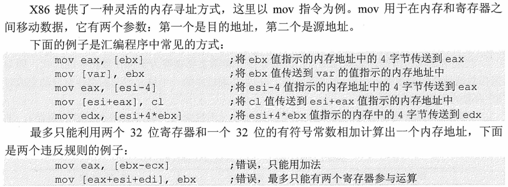

## 指令

指令又称机器指令。是指示计算机执行某种操作的命令，**是计算机运行的最小功能单位**
一台计算机的所有指令的集合构成该机的指令系统，也称为 **指令集 (ISA)**

- **一台计算机只能执行自己指令系统中的指令，不能执行其他系统的指令。**  不同体系结构计算机所能支持的指令集是不一样的如: X86 架构 (intel) 和 ARM 架构 (智能手机)
- 一条指令就是机器语言的一个语句，它是一组有意义的二进制代码

### 指令执行过程的描述

- 以取数指令为例，说明如何描述其过程:
  1. 取指令: `(PC) -> MAR -> M(主存) -> MDR -> IR`
     - 含义为: 首先将 PC 的内容送往 MAR，MAR 的内容送地址线，主存储器根据地址线上的地址，从指定存储单元读出指令送到数据线上，MDR 从数据线接收指令信息，传送到 IR 中
     - 这里省略了控制信号的传输过程
  2. 分析指令: `OP(IR) -> CU`
     - 含义为: 指令译码。从指令寄存器 (IR) 中提取操作码 (OP)，将操作码送到控制单元 (CU) 进行指令译码
  3. 执行指令: `AD(IR) -> MAR -> M(主存) -> MDR -> ACC`
     - 含义为: 从指令寄存器 (IR) 中提取地址码 (AD)，将地址码送到内存地址寄存器 (MAR)，MAR 的内容作为地址线发送到主存 (M)，主存根据地址线上的地址读取主存中的操作数，将操作数通过数据寄存器 (MDR) 送至累加器 (ACC) 中
  4. 更新程序计数器 `(PC) + 1 -> PC` 含义为: 将程序计数器 (PC) 中的内容加 "1"(1 指令字长)，更新为下一条指令的地址
  5. `(PC) + 1` 的实现方式通过**硬件实现**
     1. ALU 加法
     2. 加法器
     3. 有 " 自增功能的 " 寄存器【PC 寄存器】

---

- `(PC)` 指 PC 中存放的内容
- 当寄存器在箭头左边，表示寄存器中存放的内容时，括号不可忽略
- 当寄存器在箭头右边，表示要传输到该寄存器时，不应添加括号
- 当一个描述语句有多个箭头时，除第一个箭头左边的寄存器外，其余寄存器可以不加括号
- 当题目要求每个描述语句只描述一次传输过程时，需要严格考虑是否添加括号
- `eg:(R1)->R2->R3`

### 指令集体系结构 `(ISA)`

- 机器指令是指示计算机执行某种操作的命令。一台计算机所有指令的集合构成该机器的指令系统，也称指令集。指令系统是指令集体系结构 (ISA) 中最核心的部分
- ISA 完整定义了软件和硬件的接口，主要内容包括:
  - **指令格式**，指令寻址方式，操作类型，每种操作对应的操作数的相应规定
  - **操作数的类型**，操作数寻址方式，按大端方式或小端方式存放
  - **程序可访问的寄存器编号**、个数和位数，存储空间的大小和编址方式
  - **指令执行过程的控制方式等**，包括程序计数器、条件码的定义等

### 指令的基本格式 $\boxed{OP \mid A}$

- **操作码** 指出该指令执行什么操作，用于识别指令、了解指令功能和区分操作数地址内容等。例如，指出是移位运算还是程序转移指令
- **地址码** 给出被操作的信息 (指令或数据) 的地址，包括参加运算的操作数地址、运算结果的保存地址、程序的转移地址、被调用子程序的入口地址等

## 指令的分类

### 按地址码数目的不同分类

#### 零地址指令 $\boxed{OP}$

- 不需要操作数的指令
  - 例如：空操作指令、停机指令和关中断指令
- 零地址的运算类指令
  - 仅用在堆栈计算机，**两个操作数隐含存放在栈顶和次栈顶，计算结果压回栈顶（后缀表达式的计算）**

#### 一地址指令 $\boxed{OP \mid A1}$

- `A1` 指某个主存地址（类似于 C 语言指针）
- `(A1)` 表示 A1 所指向的地址中的内容（指针所指位置的内容）

##### 只有目的操作数的单操作指令

- 只需要单操作数，如加 1、减 1、取反、求补等
- 指令含义：`OP (A1) -> A1`
- 完成一条指令需要 3 次访存：
  - `取指 -> 读A1 -> 写A1`

#### 隐含目的地址的双操作指令

- 需要两个操作数，但其中一个操作数隐含在某个寄存器（如隐含在 ACC）
- 指令含义：`(ACC) OP (A1) -> ACC`
- 运算结果放在 ACC
- 完成一条指令需要 2 次访存：
  - `取指 -> 读A1`

#### 二地址指令 $\boxed{OP \mid A1(目的操作数) \mid A2(源操作数)}$

- 结果默认存回 A1
- 常用于需要两个操作数的算术运算、逻辑运算相关指令
- 指令含义：`(A1) OP (A2) -> A1`
- 完成一条指令需要 4 次访存：
  - `取指 -> 读A1 -> 读A2 -> 写A1`

#### 三地址指令 $\boxed{OP \mid A1 \mid A2 \mid A3(结果)}$

- 结果存入 A3 中
- 常用于需要两个操作数的算术运算、逻辑运算相关指令，将结果存入 A3 中
- 指令含义：`(A1) OP (A2) -> A3`
- 完成一条指令需要 4 次访存：
  - `取指 -> 读A1 -> 读A2 -> 写A3`

#### 四地址指令 $\boxed{OP \mid A1 \mid A2 \mid A3(结果) \mid A4(下址)}$

- 指令含义：
  - `(A1) OP (A2) -> A3`, `A4 = 下一条将要执行指令的地址`
- 完成一条指令需要 4 次访存：
  - `取指 -> 读A1 -> 读A2 -> 写A3`
- 下址 A4 是送入 PC 的，不会在这条指令的指令周期中访问

```cpp
memory = {  // 初始内存和寄存器状态
    0x1000: "ADD 0x2000, 0x2004, 0x2008, 0x1004",  // 指令存储在内存地址0x1000
    0x2000: 5,  // 操作数1存储在内存地址0x2000
    0x2004: 3,  // 操作数2存储在内存地址0x2004
}
registers = {
    "PC": 0x1000,  // 程序计数器初始值
}
// 取指令(Fetch instruction)
instruction = memory[registers["PC"]]
// 更新程序计数器
registers["PC"] += 1
// 解析指令
operation, A1, A2, A3, A4 = instruction.split()
A1 = int(A1, 16)
A2 = int(A2, 16)
A3 = int(A3, 16)
A4 = int(A4, 16)
// 读取操作数1(Read operand 1, A1)
operand1 = memory[A1]
// 读取操作数2(Read operand 2, A2)
operand2 = memory[A2]
// 执行操作并写结果(Write result, A3)
result = operand1 + operand2
memory[A3] = result
// 更新程序计数器(Update Program Counter, A4)
registers["PC"] = A4
  ```

- 正常情况下: 取指令之后 PC+1，指向下一条指令
- 四地址指令: 执行指令后，将 PC 的值修改位 A4 所指地址

- 多地址指令
  - 大中型机中成批处理数据的指令，向量、矩阵等 (SIMD)

> [!NOTE] 指令总位数固定，地址码数量越多，寻址能力越差

### 按指令长度分类

- 半字长指令、单字长指令、双字长指令 : 指令长度是机器字长的多少倍
  - 单字长指令只需访存 1 次就能将指令完整读出，花费 1 个存取周期；双字长指令需要访存 2 次，花费 2 个存取周期
- 指令字长会影响取指令所需时间
  - 如: 机器字长 = 存储字长 = 16bit，则取一条双字长指令需要两次访存
- **定长指令字结构 RISC**
  - 指令系统中 **所有指令的长度都相等**
    - $eg:n位 →2^n条指令$
  - 优点
    - 定长操作码对千简化计算机硬件设计，提高指令译码和识别速度很有利
  - 缺点
    - 指令数量增加时会占用更多固定位，留给表示操作数地址的位数受限
- **变长指令字结构 CISC**
  - 指令系统中 **各种指令的长度不等**

### 按操作类型分类

- 数据传送类

  - 数据传输 -- 进行主存与 CPU 之间的数据传送

    - LOAD: 把存储器 (源) 中的数据放到寄存器 (目的) 中
    - STORE: 把寄存器 (目的) 中的数据放到存储器 (源) 中
    - MOVE: 寄存器之间的传送

- 运算类

  - 算术操作:ADD、SUB、MUL、DIV、CMP、INC、DEC
  - 逻辑操作:AND、OR、NOT、XOR

- 移位操作

  - 算术移位
  - 逻辑移位
  - 循环移位 (带进位和不带进位)

- 转移操作

  - 程序控制类

    - **无条件转移**:JMP -- 在任何情况下都会执行转移操作

    - 条件转移
      - 根据某个标志位或几个标志位的组合来决定是否执行转移操作

    - 调用和返回
      - **CALL**: 调用
      - **RETURN (RET)**: 返回

    - 陷阱 (Trap) 与陷阱指令

- 输入输出操作
  - 进行 CPU 和 I/O 设备之间的数据传送，完成 CPU 与外部设备交换数据或传送控制命令及状态信息

### 可变长操作码

- 定长指令字结构 + 可变长操作码
- 不同地址数的指令使用不同长度的操作码
- **特点**:
- 注意两点
  - **定长指令字结构**：指令的总长度是固定的，但**操作码的长度可变**
  - **操作码长度与使用频率有关**：常用指令使用较短的操作码，减少译码时间；不常用指令使用较长的操作码，节约操作码的空间
  - **不允许短码是长码的前缀**：短操作码不能是长操作码的前缀部分，类似于哈夫曼编码的 " 前缀编码 " 原理，确保指令可以无歧义地被解码
  - **操作码不重复**：每个指令的操作码必须唯一，确保 CPU 能正确识别和执行每一条指令

  > [! ] 为了减少指令译码和分析的时间 通常情况下
  > - 对使用频率较高的指令，分配较短的操作码
  > - 对使用频率较低的指令，分配较长的操作码

- **优点**: 在指令字长有限的前提下仍保持比较中富的指令种类
- **缺点**: 增加了指令译码和分析的难度，使控制器的设计复杂化

- **例题**

 

> 在一个指令系统中，指令字长为 32，一个地址码为 6 位，指令分为 4 地址指令、3 地址指令和 2 地址指令，已知 4 地址指令有 254 条，2 地址指令有 4095 条，则 3 地址指令**至多**有多少条？

> 法一：$32 - 6 \times 4 = 8$
 四地址操作码 8 位，256 - 254 = 2
 二地址操作码 20 位，ceil (4095/64) = 64 前十四位需要 64
 三地址操作码 14 位，前四十位还剩 $(2^8 - 254) \times 2^6 = 128$ 扣除二地址操作码需要的 64 最多还剩 64

> 法二:  $(128-x)\times 64 \geq 4095 \Rightarrow x \leq 64$

##### 树形解法

> （2017 年统考真题）某计算机按字节编址，指令字长固定且只有两种指令格式，其中三地址指令 29 条，二地址指令 107 条，每个地址字段为 6 位，则指令字长至少应该是（ ）


> （2022 年统考真题）设计某指令系统时，假设采用 16 位定长指令字格式，操作码使用扩展编码方式，地址码为 6 位，包含零地址、一地址和二地址 3 种格式的指令。若二地址指令有 12 条，一地址指令有 254 条，则零地址指令的条数最多为（ ）


> 某指令系统指令长 32 位，地址码字段为 12 位，采用扩展操作码技术，如果已定义了 250 条二地址指令，则最多还可定义多少条一地址指令？


## 指令的寻址方式 (10 种)

### 寻址方式

#### 指令寻址

- **定义**: 指令寻址是指在取指阶段，确定下一条需要执行的**指令**的位置或地址。计算机通过程序计数器 (PC) 来确定下一条指令的内存地址，并从该地址处取出指令。指令寻址的目的是找到**指令本身**，而不是指令操作的数据
- **过程**:
  - 指令计数器（PC）指向当前需要执行的指令地址
  - 取出指令后，PC 的值增加，以便指向下一条指令，除非程序执行的是跳转或分支指令
- **相关概念**:
  - **顺序寻址**: 指令按顺序存储在内存中，PC 顺序递增 `(PC) + 1 -> PC`
  - **跳转寻址**: 遇到跳转类指令时，PC 值会被修改为目标地址

#### 数据寻址

- **定义**: 数据寻址是指在指令执行过程中，确定指令所需的**操作数**（数据）的地址。计算机根据指令中的操作数地址字段确定数据的存放位置。数据寻址用于定位存储在内存或寄存器中的操作数
- **过程**:
  - 在执行指令的过程中，CPU 根据操作码（Opcode）和操作数地址字段确定数据的存放位置
  - 数据可以存储在寄存器、内存或通过立即数形式提供
- **相关概念**:
  - **立即寻址**: 操作数直接包含在指令中，不需要再去内存中读取
  - **直接寻址**: 指令中给出的地址直接指向数据所在的内存单元
  - **间接寻址**: 指令中的地址指向另一个地址，而数据存储在该另一个地址中
  - **寄存器寻址**: 操作数存储在寄存器中
  - **偏移寻址**: 通过基地址加上偏移量来确定操作数的地址

#### 指令寻址 vs 数据寻址

- **目标不同**:
  - **指令寻址**的目标是指令的地址
  - **数据寻址**的目标是操作数的地址
  - **寻址方式**：顺序寻址和跳跃寻址
- **时机不同**:
  - **指令寻址**发生在取指周期，PC 用于确定下一条指令的地址
  - **数据寻址**发生在执行周期，用于获取指令需要的数据
  - **寻址方式**：立即数、直接寻址或间接寻址等方式

#### 形式地址与有效地址

- **形式地址 (A)**:
  - 指令中的地址码字段并不代表操作数的真实地址，这种地址称为 `形式地址` `(A)`
  - `(A)` 表示地址为 A 的数值，A 既可以是寄存器编号，又可以是内存地址

- **有效地址 (EA)**:
  - 通过形式地址结合寻址方式，可以计算出操作数在存储器中的真实地址，这种地址称为 `有效地址` `(EA)`
  - 不同的数据寻址方式对应不同的寻址特征码
    - EA 是 VA（虚拟地址），需要进一步转换才能得到 PA（物理地址）
    - 间接寻址得到的 EA
    - PTR（页表寄存器）中的地址是 PA
    - `(A)` 表示地址为 A 的数值，A 既可以是寄存器编号，又可以是内存地址

### 1. 立即 (数) 寻址

- **定义**: 形式地址 A 就是操作数本身，又称为立即数，一般采用补码形式
- **图示**:
 
- **访存**: 0 次
- **优点**:
  - 指令执行阶段不访问主存，指令执行时间最短
- **缺点**:
  - *A 的位数限制了立即数的范围*

### 2. 直接寻址

- **定义**: 指令字中的形式地址 A 就是操作数的真实地址 EA，即 EA = A
- **图示**:
  
- **访存**: 1 次
- **优点**:
  - 简单，指令执行阶段仅访问一次主存，不需要专门计算操作数的地址
- **缺点**:
  - A 的位数决定了该指令操作数的寻址范围
  - 操作数的地址也不易修改
- 示例:
  - LDA: 将存储器数入累加器或变址以指定的存储器

    ```cpp
    LDA 1000h  ; 将内存地址1000h中的数值载入累加器
    ```

> 例题


### 3. 隐含寻址

- **定义**: 不是明显地给出操作数的地址，而是在指令中隐含着操作数的地址
- **图示**:
  
- **访存**: 1 次
- **优点**: 有利于缩短指令字长
- **缺点**: 需增加存储操作数或隐含地址的硬件
- **示例**:
  - 一地址指令只给出一个操作数的地址，另一个操作数隐含规定为累加器 (ACC) 中的内容

    ```cpp
    MOV AL, 5   // 将常数5加载到累加器AL
    ADD AL, BL  // 将累加器AL中的值与寄存器BL中的值相加
    ```

  - 堆栈操作指令，操作数隐含在堆栈中

### 4. 间接寻址

- **定义**: 指令的地址字段给出的形式地址 A 不是操作数的真正地址，而是操作数有效地址所在的存储单元的地址，也就是操作数地址的地址，即 EA = (A)
- **图示**:
  
- **访存**:【至少两次】
  - 一次间址: 访问 2 次: 取 EA + 取数
  - 两次间址: 访问 3 次: 取 A1 + 取 EA + 取数
- **优点**:
  - 可扩大量地址范围 (有效地址 EA 的位数大于形式地址 A 的位数)
  - 便于编制程序 (用间接寻址可以方便地完成子程序调用)
- **缺点**:
  - 指令在执行阶段要多次访存 (一次间址需两次访存，多次寻址需根据存储字的最高位确定几次访存)


### 5. 寄存器寻址

- **定义**: 在指令字中直接给出操作数所在的寄存器编号，即 EA = Ri，其操作数在由 Ri 所指的寄存器内。Ri 中的内容就是要取的数据
- **图示**:
  
- **优点**:
  - 不访问主存，只访问寄存器
  - 指令字短且速度快，支持向量/矩阵运算
- **缺点**:
  - 寄存器昂贵，寄存器个数有限

### 6. 寄存器间接寻址

- **定义**: 寄存器 `Ri` 给出的是操作数所在主存单元的地址，即 `EA = (Ri)`
- **图示**:
  
- **访存**: 1 次
- **优点**:
  - 与一般间接寻址相比速度更快
- **缺点**:
  - 指令的执行阶段需要访问主存

### 偏移寻址

#### 7. 基址寻址

- **定义**:
  - 以程序的起始存放地址作为 " 起点 "
  - 将 CPU 中基址寄存器 `(BR)` 的内容加上指令格式中的形式地址 A，形成操作数的有效地址，即 `EA = (BR) + A`
  - BR——base address register
  - EA——effective address

- **图示**:
 

- **特点**:
  - 采用 **专用寄存器 BR** 作为基址寄存器:
    - **面向操作系统**，内容由操作系统或管理程序确定，主要用于系统重定位
  - 采用 **通用寄存器** 作为基址寄存器:
    - 可以在指令中指明用哪个通用寄存器作为基址寄存器
    - 由用户决定哪个寄存器作为基址寄存器，内容由操作系统确定

- **应用**:

 1. **程序重定位**：
    - 多道程序系统中，程序在逻辑地址空间编写。
    - 操作系统分配主存空间，并为每个程序分配一个基地址。
    - 基址寄存器中的基址加上指令中的逻辑地址，形成物理地址。
    - 这允许程序重定位到不同的主存位置。

 2. **扩展寻址能力**：
    - 基址寄存器可以存储存储区或段地址的首地址。
    - 指令中的位移量会与基址寄存器的值相加，形成实际访问地址。
    - 这种方式允许使用短地址访问较大的地址空间。

> 例题


#### 8. 变址寻址

- **定义**:
  - 程序员自己决定从哪里作为 " 起点 "
  - `IX`: 变址寄存器，也可用通用寄存器作为变址寄存器
  - `EA = (IX) + A`

- **图示**:
  

- **特点**:
  - 变址寄存器是**面向用户**的，在程序执行过程中，变址寄存器的内容可由用户改变 (IX 作为偏移量)，形式地址 A 不变 (作为基地址)

- **优点**:
  - **在数组处理或循环处理中**，可设定 A 为数组的首地址，不断修改变址寄存器内的内容，便可很容易形成数组中任一数据的地址，特别适合编制循环程序

- **变址寻址公式**:
  - 基址寻址: `EA = (BR) + A`
  - 变址寻址: `EA = (IX) + A`
  - 先基址后变址寻址:`EA = (IX) + ((BR) + A)`

- **注意**:
  - 实际应用中往往需要多种寻址方式组合使用 (可理解为复杂函数)

> 例题


> ans: C

#### 9. 相对寻址

> [! ] RISC 和 CISC 的区别
>
> - 如果是 `RISC` 风格的指令集，如 MIPS 指令风格的指令集，计算想读均值的偏移量时，偏移量实际上是计算 PC 的值和目标指令之间差了多少条**指令**
> - 如果是 `CISC` 风格的指令集，如 x86 指令风格的指令集，计算偏移量是 PC 的值和目标**地址之间的距离**

- **定义**:
  - 以程序计数器 (PC) 所指地址作为 " 起点 "
  - 把程序计数器 (PC) 的内容加上指令格式中的形式地址 A 而形成数据操作数的有效地址，即 EA = (PC) + A
    - 其中 A 是相对于 PC 所指地址 (即下条指令) 的位移量，可正可负，补码表示

- **图示**:
  

- **优点**:
  - 操作数的地址不是固定的，它随着 PC 值的变化而变化，并且与指令地址之间总是 **相差一个固定值**，因此便于程序 **跨段** (一段代码在程序内的移动)
  - 相对寻址广泛应用于转移指令

> **程序浮动**:

- 基址寻址便于程序的浮动 -- 整个程序在主存的浮动
- 相对寻址便于程序内部的浮动 -- 代码在程序内部的浮动

> 例题


#### 偏移寻址小结

| 寻址方式 | 应用场景                 |
| ---- | -------------------- |
| 基址寻址 | 多道程序                 |
| 变址寻址 | 数组问题、循环程序            |
| 相对寻址 | 广泛用于转移指令，方便代码在程序内部浮动 |

### 10. 堆栈寻址

- **定义**: 堆栈寻址是一种隐式的寻址方式，指令通过**堆栈指针**（Stack Pointer, SP）自动访问堆栈中的数据。堆栈是一块按照**后进先出（LIFO）**  规则管理的存储区域，通常用于存放局部变量、函数调用时的返回地址等

#### 堆栈寻址的特点

- **隐含操作数**: 指令表面上通常表现为无操作数形式（如 `PUSH` 和 `POP`），因为操作数的地址由堆栈指针隐含给出，自动管理堆栈的读写
- **自动更新 SP**: 每次进行堆栈操作时，堆栈指针 SP 会自动增加或减少，以指向堆栈中的下一个数据

#### 堆栈的实现方式

- **寄存器堆栈**: 在**专用寄存器组**中划分的一块，属于**硬堆栈**的实现方式
- **内存堆栈**: 系统在**主存**中划出一块区域作为堆栈，属于**软堆栈**的实现方式。现代操作系统（如 Windows）中，ESP 和 EBP 配合使用管理堆栈

#### 硬堆栈和软堆栈

| 类型      | 实现方式 | 特点                                                                                     |
| ------- | ---- | -------------------------------------------------------------------------------------- |
| **硬堆栈** | 寄存器  | 1. 操作数存放在寄存器堆栈中<br>2. `PUSH` 和 `POP` 操作不需要访问主存，速度快<br>3. 成本高，通常用于处理器内部                 |
| **软堆栈** | 主存   | 1. 堆栈存放在主存中 <br>2. `PUSH` 和 `POP` 需要访问主存 1 次<br>3. 每次操作涉及访存，速度相对较慢<br>4. 成本低，适合大容量数据管理 |

#### 堆栈应用场景

堆栈广泛应用于：

- **函数调用**: 存储函数的局部变量、返回地址、函数参数等
- **中断处理**: 保存中断前的 CPU 状态，方便中断处理完成后恢复

#### 示例

- **指令操作**:
  - 指令如 `PUSH`（入栈）、`POP`（出栈）操作时，不需要显式指定操作数地址，堆栈指针 `SP` 隐含地指示操作数的地址
  - **优点**: 简化指令集设计，指令操作数隐含在堆栈中，无需显式指定操作数的地址

```cpp
// 示例代码
PUSH AX  // 将寄存器 AX 的内容压入堆栈
POP BX   // 将堆栈顶端的内容弹出到寄存器 BX
```

### 寻址方式小结


- 相对寻址常用于转移指令
- 基址寻址常用于多道程序
- 编址寻址常用于循环程序 eg: 数组问题

## 程序的机器级代码


|  | AT&T | Intel |
|---|---|---|
| 大小写 | 只能小写字母 | 大小写不敏感 |
| 源/目的操作数 | 第一个源操作数，第二个目的操作数 | 第一个目的操作数，第二个源操作数 |
| 前缀格式 | 寄存器前缀 "%"，立即数前缀 "$" | 无需前缀 |
| 内存寻址格式 | 用 "("，")" | 用 " ["，" ]" |

### 相关寄存器


- 这些 32 位寄存器的低 16 位与原来的 16 位寄存器同名
  - 为了向后兼容，EAX，EBX，ECX 和 EDX 的高两位字节和低两位字节可以独立使用，E 为 Extend，表示 32 位寄存器
  - EAX 低两位字节称为 AX，而 AX 的高低字节又可分别做微两个 8 位寄存器，分别称为 AH 和 AL
- **寄存器的名称与大小写无关**
- 除了用于堆栈操作的 ESP 和基址指针操作的 EBP 外，其他寄存器在不同的编程环境和操作中可能有不同的用法

### 寻址模式和内存分配



- 作为原地址

    `[ebx]` 是指取 ebx 所存地址指向内存区域所存的数据；ebx 则是指 ebx 内存放的内容，可能是地址，也有可能是数据

- 如果作为目的地址

    `[ebx]` 一般就是内存地址 ebx 是寄存器

- 数据类型长度规定


### 常用指令

- **x86 汇编指令都不能直接处理两个内存地址**


#### 操作数标记: 以下标记用于表示操作数是寄存器、内存还是常数

- `<reg>`: 表示任意寄存器，若其后带有数字，则强制指定其位数
- `<mem>`: 表示内存地址
- `<con>`: 表示常数，若其后带有数字，则表示常数位数

#### 数据传送指令

- `mov/lea`: 将第二个操作数复制到第一个操作数。如:

    ```cpp
    mov eax, ebx                     #将ebx中的值复制到eax中
    mov byte ptr [var], 5            #将5保存到内存地址为var的一字节中
    ```

- 两个操作数不能都是内存，即 **`mov` 指令不能直接从内存复制到内存**

- 对比 `mov` 和 `lea`
  - `lea eax, [addr]` 将表达式 addr 的地址传送到 eax 中
  - `mov eax, [addr]` 将表达式 addr 地址中的内容传送到 eax 中

    ```cpp
    SI = 1000H, (1000H) = 23
    mov bx, [si]                    #bx = 23
    lex bx, [si]                    #bx = 1000H 
    ```

- `push`: 将操作数压入栈中。ESP 是栈顶，入栈前会先让 ESP 的值减 4(因为栈增长方向是内存地址减少方向)，然后将操作数压入 ESP 指示的地址。如:

    ```cpp
    push eax                        #将eax中的值入栈
    push [var]                      #将var值指示的内存地址的4字节入栈
    ```

- `pop`: 出栈。出栈前先将 ESP 指示的地址中的内容出栈并送入操作数所指示的位置，然后将 ESP 值加 4。如:

    ```cpp
    pop eax                         #弹出栈顶元素送入eax中
    pop [ebx]                       #弹出栈顶元素送到ebx所指示的内存地址中
    ```

#### 算术和逻辑运算指令

- `add/sub`: 将两个操作数相加或相减，将结果保存到第一个操作数中

 ```cpp
 sub eax, ebx                  #计算eax-ebx的值，存入eax中
 add byte ptr [var], 10        #将var指向的内存地址的一字节值与10相加，存入var指向的内存地址
 ```

- `inc/dec`: 将操作数自增 1 或自减 1

 ```cpp
 dec eax                       #将eax值自减1
 inc dword ptr [var]           #将var指示的内存地址的4字节值自增1
 ```

- `imul`: 有符号整数乘法指令，有两种格式
  - 当有两个操作数时，将其相乘，结果保存在第一个操作数中
  - 当有三个操作数时，讲第二个和第三个操作数相乘，保存在第一个操作数中

 ```cpp
 imul eax, [var]                 #[var] * eax -> eax
 imul esi, edi, 25               #25 * edi -> esi
 ```

- `idiv`: 有符号整数除法指令，只有一个操作数作为除数，被除数为 edx: eax 中的内容 (共 64 位)，计算结果的商送到 eax，余数送到 edx

- `and/or/xor`: 分别是逻辑与、逻辑或、逻辑异或操作，用于进行位运算，将结果放在第一个操作数中

 ```cpp
 and eax, 0fH                   #将eax中的前28位置0，最后4位保持不变
 xor edx, edx                   #将edx中的内容置为0
 ```

- `not`: 位翻转指令，将操作数的每一位反转

- `neg`: 取负指令，取操作数的相反数

- `shl/shr`: 逻辑移位指令，分别是逻辑左移和逻辑右移。第一个操作数表示被操作数，第二个操作数表示移位的位数

 ```cpp
 shl eax, 1                   #将eax中的值左移1位
 shr ebx, cl                   #将ebx中的值右移n位(n是cl中的值)
 ```

#### 控制流指令

| 转移指令         | 子程序调用与返回指令             |
| ------------ | ---------------------- |
| 条件转移指令需要满足条件 | 一般是无条件的                |
| 在同一程序内转移     | 不同程序之间转移               |
| 不需要返回原处      | 需要返回调用处，因此需要保护断点（返回地址） |

##### x86 和 ARM 的指令指针寄存器

- 在 x86 计算机中，IP(指令指针寄存器) 指向下一条指令的地址，相当于 ARM 型 CPU 中的 PC(程序计数器)

- 标签 (label)****

- 可以在某条指令前插入标签，用于控制流指令的跳转。例如:

    ```cpp
    mov esi, [ebp+8]  #将ebp+8处的值送入esi
    begin:            #标签
    xor ecx, ecx      #将ecx清零
    mov eax, [esi]    #将esi指向的内存地址的值送入eax
    ```

  - 上例中，`begin` 标签指示了第二条指令的起始位置

##### 无条件转移指令 `jmp`

- `jmp` 指令用于无条件跳转到指定的标签位置

    ```cpp
    jmp begin
    ```

##### 比较指令 `cmp/test`

- `cmp` 和 `test` 指令类似于 `sub` 和 `and` 指令，不保存计算结果，仅根据结果设置 CPU 状态字中的条件码 (程序状态字)
- 不同计算机的实现方式不同，但概念上应有程序状态字 (PSW)


##### 条件转移指令 `jcondition`

- 条件转移指令根据 CPU 状态字中的条件判断是否跳转，语法如下:
  - `je (jump when equal)`
  - `jz (jump when last result was zero)`
  - `jne (jump when not equal)`
  - `jg (jump when greater than)`
  - `jge (jump when greater than or equal to)`
  - `jl (jump when less than)`
  - `jle (jump when less than or equal to)`

- 示例:

```cpp
cmp eax, ebx
jle done  # 若eax值<=ebx值，则跳转到done执行；否则顺序执行下一条指令

cmp dword ptr [var], 10  # 将var指向的主存地址的4字节内容与10比较
jne loop  # 若不相等，则跳转到loop执行；否则顺序执行下一条指令
```

##### 子程序的调用和返回 `call/ret`

- `call` 指令首先将当前执行指令地址入栈，然后无条件转移到标签指示的指令。`call` 保存了调用之前的地址信息，方便在 `call` 指令结束后返回
- `ret` 指令实现子程序的返回，弹出栈中保存的指令地址，然后无条件转移到保存的指令地址执行

> [! ] 返回指令不一定有地址字段。

> [!  ] 跳转指令和调用（转子）指令的区别

- **跳转指令**：

  - 跳转指令分为**无条件跳转指令**和**条件跳转指令**（又称分支指令）。
  - 主要用于改变程序执行的顺序，跳转后不再返回执行，因此无需保存返回地址。
- **调用指令**：

  - 调用指令是一种程序调用指令，程序执行结束后必须返回调用指令后面的指令执行。
  - 因此调用指令除了计算跳转的目标地址，还需要保存返回地址。
  - 通常将调用指令后面的指令地址作为返回地址，保存到栈中或特定寄存器中。


> ans:D

---

#### 选择语句的机器级表示

- 条件码与转移指令实现选择结构

- 编译器通过条件码设置指令和各类转移指令来实现程序中的选择结构语句。条件码描述了最近的算术或逻辑运算操作的属性
- 常见的算术逻辑运算指令 (如 `add`, `sub`, `imul`, `and`, `or`, `xor`, `shl`, `shr`, `inc`, `dec`, `not` 等) 会设置条件码，`cmp` 和 `test` 指令只设置条件码

- `if-else` 语句的转换

- 通用形式:

 ```cpp
if(A)
  B
else
  C
 ```

- 写成 goto 形式:

```cpp
if(A)
  goto true_case
goto false_case
true_case:
	B
goto done
false_case:
	C
done:
```

- 例如:

```cpp
 if(op1== op2) {
	  X = 1
	  Y = 2
 } else {
	  X = 3
	  Y = 4
 }
```

  转换为汇编语言:

```cpp
mov eax, op1  ; 将op1加载到eax寄存器
cmp eax, op2   ; 比较eax寄存器中的值与op2
jne L1        ; 如果不相等，则跳转到标签L1
mov X, 1      ; 如果相等，将1赋给X
mov Y, 2       ; 如果相等，将2赋给Y
jmp L2         ; 无条件跳转到标签L2，跳过else分支的执行
L1:
mov X, 3       ; 不相等时，将3赋给X
mov Y, 4       ; 不相等时，将4赋给Y
L2:
```

- 可以看出，高级语言用等于来判断是否进入分支，汇编语言用不等于来判断是否跳过分支

---

#### 循环语句的机器级表示

- `do-while` 语句的通用形式

- 通用形式:

    ```cpp
    do {
        A
    } while(B)
    ```

  写成 goto 形式:

    ```cpp
    loop:
    A
    if(B)
        goto loop
    ```

- while 和 for 循环的转换

- 将 while、for 类型的循环语句转换为 do-while 形式，再考虑机器级表示

- 例如，自然数求和过程:

    ```cpp
    int sum = 0
    for(int i = 1; i <= n; i++)
        sum += i
    ```

  转换为 do-while 类型:

    ```cpp
    int i = 1, sum = 0
    if(i > n)
        goto done
    do {
        sum += i
        i++
    } while(i <= n)
    done:
    ```

  写成 goto 形式:

    ```cpp
    int i = 1, sum = 0
    if(i > n)
        goto done
    loop:
    sum += i
    i++
    if(i <= n)
        goto loop
    done:
    ```

  写成汇编语言:

    ```cpp
    mov eax, 0       ; 初始化sum为0，eax为累加结果寄存器
    mov edx, 1      ; 初始化i为1，edx为循环计数器
    cmp edx, ecx     ; 比较i和n的值，ecx中存放n的值
    jg .L2           ; 若i > n，则跳转到标签.L2，结束循环
    .L1:
    add eax, edx     ; 将i累加到sum，即sum += i
    add edx, 1      ; i自增，即i++
    cmp edx, ecx     ; 再次比较i和n的值
    jle .L1         ; 若i <= n，则跳转到标签.L1，继续循环
    .L2:
    ```

### 过程 (函数) 调用对应的机器级表示 #🌟🌟🌟


#### 调用过程

以下是过程 P(调用者) 调用过程 Q(被调用者) 时的具体步骤:

1. **参数传递**: 过程 P 将入口参数 (实参) 放到过程 Q 能访问到的地方。这通常涉及将参数存储在寄存器或内存中

2. **保存返回地址**: 过程 P 将返回地址 (即 P 下一条要执行的指令地址) 存到特定的地方，然后将控制转移到过程 Q(即将指令指针 IP 指向过程 Q 的起始地址)。这通常由 `call` 指令实现

3. **保存现场**: 过程 Q 保存过程 P 的现场 (即通用寄存器的内容)，并为自己的非静态局部变量分配空间。这确保了过程 Q 在执行时不会覆盖过程 P 的数据

4. **执行过程 Q**: 过程 Q 执行其定义的操作

5. **恢复现场和返回结果**: 过程 Q 执行完毕后，它恢复过程 P 的现场，将返回结果放到过程 P 能访问的地方，并释放为局部变量分配的空间

6. **返回控制**: 过程 Q 取出返回地址，将控制转移到过程 P。这通常由 `ret` 指令实现

    在这个过程中，可能需要为实参、返回地址、过程 P 的现场、过程 Q 的局部变量、过程 Q 的返回结果等创造存放空间。这类似于 C 语言中使用 `malloc` 函数分配内存的过程

#### 寄存器使用规则

- **调用者保存寄存器**: 寄存器 EAX、ECX 和 EDX 是调用者保存寄存器。当过程 P 调用过程 Q 时，若 Q 需要用到这些寄存器，则 P 需要将这些寄存器的内容保存到栈中，再调用 (`call`)Q，并在返回后由 P 来恢复它们的值

- **被调用者保存寄存器**: 寄存器 EBX、ESI 和 EDI 是被调用者保存寄存器。当过程 P 调用过程 Q 时，Q 首先将这些寄存器的内容保存在栈中才能使用他们，并在返回 (`ret`) 之前首先恢复它们的值

- **注意**: 以上内容了解、理解即可，不需要记住哪个寄存器属于哪类

#### 栈帧：每个过程都有属于自己的栈区，称为栈帧


- **栈帧在主存中**
- 寄存器 `EBP` 指示当前过程的栈帧的 **起始位置**，即 **栈底**
- 寄存器 `ESP` 指示栈顶的下一个位置，即下一个入栈元素的地址。
- **栈是从高地址向低地址增长的
- `ESP` 会随着数据的出栈和入栈**动态变化**
- `EBP` 作为基指针寄存器，指示当前过程的栈帧的起始位置 (栈底)，在过程执行期间**保持不变**

#### 例子

```cpp
int add(int x, int y) {
    return x + y;
}

int caller() {
    int temp1 = 125;
    int temp2 = 80;
    int sum = add(temp1, temp2);
    return sum;
}
```

```cpp
caller:
push ebp                # 将上一个过程的栈底入系统栈
                        # (因为现在进入了一个新的过程，需要对 ebp 赋新值了)
mov ebp, esp            # 将 caller 的栈底设置为上个过程的栈顶
sub esp, 24             # 将 caller 的栈顶扩充 24 个字节，即提前为 caller 申请 24 个字节的空间
mov [ebp-12], 125       # M[R[ebp]-12] = 125，即 temp1 = 125
mov [ebp-8], 80         # M[R[ebp]-8] = 80，即 temp2 = 80
mov eax, dword ptr [ebp-8] # R[eax] = M[R[ebp]-8]，即令 R[eax] = temp2
mov [esp+4], eax        # M[R[esp]+4] = R[eax]，即 temp2 入栈
							   为 add 提供形参
mov eax, dword ptr [ebp-12] # R[eax] = M[R[ebp]-12]，即 R[eax] = temp1
mov [esp], eax          # M[R[esp]] = R[eax]，即 temp1 入栈
								为 add 提供另一个形参
call add                # 调用 add，默认将返回值保存在 eax 中
mov [ebp-4], eax        # M[R[ebp]-4] = R[eax]，即将 add 返回值送 sum
mov eax, dword ptr [ebp-4] # R[eax] = M[R[ebp]-4]，即将 sum 返回到 eax 
leave
ret
```

- 首先需要将 P 的栈底保存，然后将 caller 的栈底设置为 P 的栈顶，再将 caller 的栈顶减去 6 个字节，表示为 caller 申请了 6 个字节的空间
- 接着，因为 temp1、temp2 和 sum 是 caller 函数中创建的局部变量，因此需要在 caller 的栈帧中为他们分配空间，依次分配了 temp1 和 temp2
- 然后，在调用 add 前，将作为形参的 temp1 和 temp2 的值 (125 和 80) 依次保存到栈中，方便 add 函数访问
- 使用 call 指令调用函数 add，隐含了将返回地址压入栈中的过程
- 调用返回后，add 函数的返回值保存在了 eax 中，需要将结果存入 sum 变量
- 因为 caller 函数的返回值是 sum，因此需要将 sum 的值存入 eax 中

```cpp
|    ...    | <- 栈顶高地址
| 参数 temp1 | <- esp
| 参数 temp2 |
| 返回地址  |
| 旧 ebp   | <- ebp
| 局部变量 sum |
| 局部变量 temp1 |
| 局部变量 temp2 | <- esp (调用完 add 后)
```

## 汇编代码实战


### 访问局部变量


### 函数调用


> [! ] 在 x 86 中函数调用不会保存 PSW, 而中断调用会保存 PSW
> 保存 PSW 的目的是为了在中断处理完毕后，能够准确恢复到中断发生前的状态，使得被中断的程序继续运行而不受干扰
> **函数调用**是程序内的正常控制流跳转，并不会改变中断级别或影响全局的状态，因此无需保存 PSW。函数调用的过程更注重保存寄存器的现场信息，确保函数执行过程中不会覆盖调用者的数据
> **中断调用**则是由硬件或软件触发的异步事件，会打断当前程序的执行。为了在中断服务程序执行完后能恢复到被打断的程序执行，中断处理机制会自动保存当前的程序状态字（PSW）

### 切换栈帧


### 访问参数


### 传递返回值


### 恢复上一栈帧


### 函数调用返回


### 使用返回值


### 传递返回值


## CISC & RISC 的概念

### CISC (Complex Instruction Set Computer) - 复杂指令系统计算机

- **设计思路**: 一条指令完成一个复杂功能，通过硬件直接实现高级操作。
- **架构**: 常见于 **x86 架构**，广泛用于笔记本、台式机等。
- **特点**:
  1. **复杂指令集**: 包含大量功能多样的指令，单条指令可以执行多步操作。
  2. **指令长度不固定**: 指令可以有不同的字长和寻址模式。
  3. **支持内存直接操作**: 部分指令（如乘法、除法）可以直接在内存中操作数据，而无需通过而不需要单独的 Load/Store 指令操作寄存器。
  4. **硬件实现复杂**: CISC 指令复杂，依赖微程序控制器进行译码和执行。
  5. **软件兼容性好**: 由于历史发展较早，CISC 系统广泛兼容不同软件，适合通用计算任务。
  6. **优化编译困难**: 指令集复杂，使得编译器优化变得更加困难。

### RISC (Reduced Instruction Set Computer) - 精简指令系统计算机

- **设计思路**: 一条指令只完成一个基本操作，通过多条指令组合完成复杂功能。
- **架构**: 常见于 **ARM 架构**，广泛用于手机、平板等嵌入式设备。
- **特点**:
  1. **指令集精简**: 指令种类较少，且功能简单，易于解码与执行。
  2. **指令长度统一**: 每条指令的长度固定，通常为 32 位，便于流水线操作。
  3. **仅寄存器操作**: 大多数指令只在寄存器之间传输数据，只有 Load/Store 指令会访问内存。
  4. **高效流水线技术**: 由于指令结构简单统一，RISC 架构通过流水线技术使多条指令并行执行，大多数指令在一个时钟周期内完成。
  5. **硬件设计简化**: RISC 依赖寄存器的操作，硬件设计简洁高效，能够达到较高的执行效率。
  6. **编译器优化容易**: 简单的指令集使得编译器能更有效地优化程序。
  7. **不兼容 CISC**: RISC 通常不与传统的 CISC 系统兼容，适合以效率为目标的应用。

### 关键对比


1. **复杂性**:
   - CISC 系统指令复杂，支持多种寻址方式，功能多样，但解码和执行复杂。
   - RISC 系统精简指令集，执行速度快，指令简单，便于优化和流水线处理。

2. **访存操作**:
   - CISC 指令能够直接在内存操作，而 RISC 强调寄存器操作，只有 Load/Store 访问内存。

3. **性能优化**:
   - RISC 系统强调通过硬件流水线技术和编译器优化提高性能。

4. **硬件设计**:
   - CISC 设计复杂，硬件需要支持复杂指令的译码与执行。
   - RISC 强调硬件简化，提高执行效率，常用于移动设备。
5. **指令长度**【2017】
	- CISC 使用变长指令长度
	- RISC 使用定长指令长度