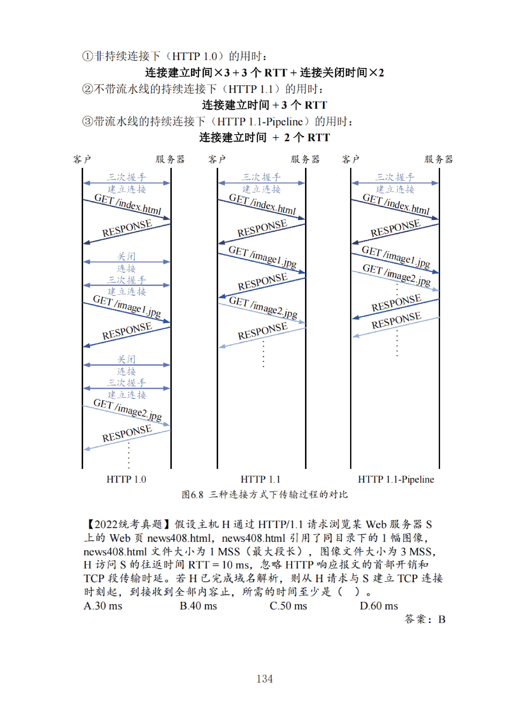

## 网络应用模型

网络通信的端系统之间的通信方式通常分为两大类：

- 客户 - 服务器方式 (C/S 方式)
- 对等方式 (P 2 P 方式)

### 客户/服务器 (C/S) 模型

- **客户 (client)** 和 **服务器 (server)** 都是指通信中所涉及的两个**应用进程**
- 客户 - 服务器方式描述的是**进程之间服务和被服务的关系**

- **主要特征**：**客⼾是服务请求⽅，服务器是服务提供⽅。**
  - **客户程序**：
    - 被用户调用后运行，在通信时**主动**向远地服务器发起通信 (请求服务)
    - 因此，客户程序必须知道服务器程序的地址
    - 不需要特殊的硬件和很复杂的操作系统
  - **服务器程序**：
    - 是一种专门用来提供某种服务的程序，可**同时处理多个远地或本地客户的请求**
    - 系统启动后即一直不断地运行着，**被动**地等待并接受来自各地的客户的通信请求。因此，服务器程序不需要知道客户程序的地址
    - 一般需要有强大的硬件和高级的操作系统支持
  - 客户与服务器的通信关系建立后，通信可以是双向的，客户和服务器都可发送和接收数据
- **常见应用**：Web、文件传输协议 (FTP)、远程登录、电子邮件等
- **主要特点**：
  - **网络中各计算机的地位不平等**，服务器管理用户权限，使客户机不能随意存储/删除数据，或进行其他受限的网络活动
  - 整个网络的管理工作由少数服务器担当，因此网络的管理非常集中和方便
  - **客户机相互之间不直接通信**
  - 可扩展性不佳，受服务器硬件和网络带宽的限制，服务器支持的客户机数有限

- **B/S 方式** (Browser/Server 方式)，即浏览器 - 服务器方式，是 C/S 的一种特例

### 对等 (P2P) 模型

- **对等连接** (peer-to-peer，简写为 P2P)
  - 指两个主机在通信时并不区分哪一个是服务请求方还是服务提供方
  - 只要两个主机都运行了对等连接软件 (P2P 软件)，它们就可以进行平等的、对等连接通信
  - 双方都可以下载对方已经存储在硬盘中的共享文档
  - 对等连接方式从本质上看仍然是使用客户 - 服务器方式，只是对等连接中的**每一个主机既是客户又是服务器。**

- **常见应用**：PPlive、Bittorrent、电驴等

### 小结

|          |     C/S 模型（客户端/服务器模型）     |      P2P 模型（点对点模型）       |
| -------- | :-----------------------: | :----------------------: |
| 基本 概念 | 存在特定的服务器以及 与服务器相连的客户端  |      每个节点既是客户端又是服务器      |
| 网络 类型 |           集中式网络           |          分散式网络           |
| 可靠性      | 服务器故障会影响所有客户端的功能 可靠性较差 | 部分节点失效后其余节点仍可提供服务 更可靠 |
| 安全性      |          更稳定、更安全          |         相对来说不稳定          |
| 数据 存储 |     数据存储在一个/几个集中服务器中      |       每个节点都保留自己的数据       |
| 可扩 展性 | 服务器性能支持的客户端数量有限 扩展性较差  |    无传统一服务器限制 扩展性较好    |
| 应用 场景 |     万维网、文件传输 FTP、电子邮件     |    P2P 文件共享、即时通信、加密货币    |

## DNS 系统

- 域名系统 DNS (Domain Name System) 是互联网使用的**分布式命名系统**，用来把便于人们使用的机器名字**转换为 IP 地址**
- 互联网的域名系统 DNS 被设计成为一个**联机分布式数据库系统**，并采用**客户服务器方式**
- DNS 使大多数名字都在本地进行解析 (resolve)，仅少量解析需要在互联网上通信，因此 DNS 系统的效率很高。
- 由于 **DNS 是分布式系统**，即使单个计算机出了故障，也不会妨碍整个 DNS 系统的正常运行

- DNS 协议运行在 **UDP** 之上，使用 `53` 号端口

> **DNS 的功能**

- 域名解析: 主机名到 IP 地址的转换【核心功能，正向解析】
- 主机别名
- 邮件服务器别名
- 负载分配

> 从概念上可将 DNS 分为三部分：

- 层次域名空间【分布式、层次数据库】
- 域名服务器
- 解析器

### 层次域名空间【分布式、层次数据库】

- 域名系统中，每个域由不同的组织进行管理，每个组织将域再分成一定数目的子域并委托给其他组织去管理。如管理 cn 域的中国将 edu. cn 子域授权给中国教育和科研计算机网来管理

#### 顶级域名分类

顶级域名（Top-Level Domain，TLD）是互联网域名系统中的最高级别域名。根据用途和属性，顶级域名可以分为以下几类：

##### 国家顶级域名 (nTLD)

国家和某些地区的顶级域名，通常由两个字母组成，代表特定的国家或地区

| 国家/地区 | 顶级域名 |
|-----------|----------|
| 中国      | .cn      |
| 美国      | .us      |
| 英国      | .uk      |
| 德国      | .de      |
| 加拿大    | .ca      |

##### 国家顶级域名下的二级域名

| 国家/地区 | 二级域名示例     |
|-----------|------------------|
| 中国      | .com. cn, .edu. cn |
| 美国      | .gov. us, .edu. us |
| 英国      | .co. uk, .gov. uk  |

通过这种分类方式，可以更清晰地了解不同类型的顶级域名及其用途

##### 通用顶级域名 (gTLD)

最先确定的通用顶级域名有 7 个，分别是：

| 通用顶级域名 | 用途                    |
|--------------|-------------------------|
| .com         | 公司企业                |
| .net         | 网络服务机构            |
| .org         | 非营利性组织            |
| .int         | 国际组织                |
| .edu         | 美国专用的教育机构      |
| .gov         | 美国的政府部门          |
| .mil         | 美国的军事部门          |

后来又陆续增加了 13 个通用顶级域名：

| 通用顶级域名 | 用途                                            |
|--------------|-------------------------------------------------|
| .aero        | 航空运输企业                                    |
| .asia        | 亚太地区                                        |
| .biz         | 公司和企业                                      |
| .cat         | 使用加泰隆人的语言和文化团体                    |
| .coop        | 合作团体                                        |
| .info        | 各种信息                                        |
| .jobs        | 人力资源管理者                                  |
| .mobi        | 移动产品与服务的用户和提供者                    |
| .museum      | 博物馆                                          |
| .name        | 个人                                            |
| .pro         | 有证书的专业人员                                |
| .tel         | Telnic 股份有限公司                              |
| .travel      | 旅游业                                          |

##### 基础结构域名 (Infrastructure Domain)

这种顶级域名只有一个，用于反向域名解析，因此又称为反向域名

| 基础结构域名 | 用途       |
| ------ | -------- |
| .arpa  | 用于反向域名解析 |

### 域名服务器

#### 根域名服务器

- 根域名服务器是最高层次的域名服务器，所有的根域名服务器都知道所有的顶级域名服务器的 IP 地址
- 互联网有 13 个根域名服务器 (根域名服务器只使用 13 个不同 IP 地址的域名，即 a.rootservers. net, b.rootservers. net, …, m.rootservers. net)，每个服务器都是冗余服务器的集群，以提供安全性和可靠性
- 根域名服务器用来管辖顶级域 (如 .com)，通常它只返回相应的顶级域名服务器的 IP，而不返回代查询域名的 IP
- 根域名服务器采用了**任播 (anycast) 技术**，当 DNS 客户向某个根域名服务器的 IP 地址发出查询报文时，互联网上的路由器就能找到离这个 DNS 客户最近的一个根域名服务器。这样做不仅加快了 DNS 的查询过程，也更加合理地利用了互联网的资源

#### 顶级域名服务器

- 顶级域名服务器负责管理在该顶级域名服务器注册的所有二级域名
- 收到 DNS 查询请求时，就给出相应的回答 (可能是代查询域名的 IP，也可能是相应的授权域名服务器的 IP)

#### 授权域名服务器 (权限域名服务器)

- 每台有域名的主机都要在授权域名服务器处登记
- 授权域名服务器总能将其管辖的主机名转换为该主机的 IP 地址

#### 本地域名服务器

- 本地域名服务器并不属于域名服务器层次结构，但它对域名系统非常重要
- 当一台主机发出 DNS 查询请求时，这个查询请求报文就发送给该主机的本地域名服务器
- 我们在系统中配置本地连接时，就需要填写 DNS 地址，这个地址就是本地域名服务器的地址

### 域名解析

- **域名解析**：把域名映射成为 IP 地址或把 IP 地址映射成域名的过程，前者为正向解析，后者为反向解析

- 客户端需要域名解析时，用本机的 DNS 客户端构造一个 `DNS 请求报文`，以 **UDP 数据报方式** 发往本地域名服务器
- 域名解析有两种方式：**递归查询**、**递归与迭代相结合的查询**

#### 递归查询

- 主机向本地域名服务器的查询采用递归查询
- 即主机向本地 DNS 服务器发送域名解析请求后，主机将不再参与后续的解析工作，所有解析工作都由本地 DNS 服务器负责处理
- 本地 DNS 服务器会负责获取最终的 IP 地址，无论它需要多少次查询，都不会返回中间结果给主机​

#### 迭代查询

- 本地域名服务器向根域名服务器的查询采用迭代查询
- 根域名服务器不会直接给出最终的 IP 地址，而是告诉本地域名服务器下一步应向哪个服务器查询。例如，根域名服务器通常会返回顶级域名服务器的 IP 地址，要求本地域名服务器向其查询​​
- 顶级域名服务器接着会返回权限域名服务器的 IP 地址，依次迭代，直到本地域名服务器最终获得要查询的域名的 IP 地址​

#### 域名解析过程示例

假定某客户端想获知域名为 `y.abc.com` 主机的 IP 地址，域名解析的过程如下：

1. **主机 `m.xyz.com` 向其本地域名服务器 `dns.xyz.com` 进行递归查询**
   - 主机 `m.xyz.com` 发出查询 `y.abc.com` 主机的 IP 地址请求后，任务交由本地域名服务器 `dns.xyz.com` 处理，主机不会再参与后续过程

2. **本地域名服务器开始迭代查询，首先向根域名服务器查询**
   - 本地域名服务器 `dns.xyz.com` 向根域名服务器发起查询，询问 `y.abc.com` 的 IP 地址

3. **根域名服务器告诉本地域名服务器下一步应查询顶级域名服务器 `dns.com`**
   - 根域名服务器不会直接返回 `y.abc.com` 的 IP 地址，而是返回负责 `.com` 顶级域名的服务器 `dns.com` 的 IP 地址

4. **本地域名服务器向顶级域名服务器 `dns.com` 进行查询**
   - 本地域名服务器使用迭代查询向顶级域名服务器 `dns.com` 询问 `y.abc.com` 的 IP 地址

5. **顶级域名服务器 `dns.com` 告诉本地域名服务器下一次应查询权限域名服务器 `dns.abc.com`**
   - 顶级域名服务器也不会给出最终 IP 地址，而是返回负责 `abc.com` 域的权限域名服务器 `dns.abc.com` 的 IP 地址

6. **本地域名服务器向权限域名服务器 `dns.abc.com` 查询**
   - 本地域名服务器 `dns.xyz.com` 继续迭代查询，向权限域名服务器 `dns.abc.com` 询问 `y.abc.com` 的 IP 地址

7. **权限域名服务器 `dns.abc.com` 返回 `y.abc.com` 的 IP 地址**
   - 权限域名服务器 `dns.abc.com` 是负责 `abc.com` 区域的服务器，它可以直接返回 `y.abc.com` 的 IP 地址

8. **本地域名服务器 `dns.xyz.com` 把查询结果返回给主机 `m.xyz.com`**
   - 本地域名服务器最终将查询到的 `y.abc.com` 的 IP 地址返回给发起请求的主机 `m.xyz.com`，完成整个递归查询过程

#### 例题

## 文件传输协议（FTP）

### FTP 协议的工作原理

- **文件传送协议 FTP** (File Transfer Protocol) 是互联网中广泛使用的文件传送协议
- FTP 提供交互式访问，允许用户指定文件的类型与格式（如 ASCII 码），并且文件具有访问权限（如访问文件的用户必须经过授权并输入有效的口令）
- FTP 屏蔽了各计算机系统的细节，适用于在异构网络中任意计算机之间传送文件
- 基于 **TCP** 的 **FTP** 和基于 *UDP* 的简单文件传送协议 *TFTP*: 都是文件共享协议的一大类，即复制整个文件，特点是：若要访问一个文件，必须先获得一个本地的文件副本。如果要修改文件，只能对文件副本进行修改，然后再将修改后的文件副本传回原节点

- **FTP 提供以下功能**：
  - 提供不同种类主机系统之间的文件传输能力
  - 以用户权限管理方式提供用户对远程 FTP 服务器上的文件管理能力
  - 以匿名 FTP 方式提供公用文件共享能力

### 客户 - 服务器方式

- **FTP 使用客户 - 服务器方式**
- 一个 FTP 服务器进程可同时为多个客户进程提供服务
- FTP 的服务器进程由两大部分组成：
  - 一个主进程，负责接受新的请求
  - 若干个从属进程，负责处理单个请求

- **主进程的工作步骤如下**：
  1. 打开熟知端口（端口号为 21），使客户进程能够连接上
  2. 等待客户进程发出连接请求
  3. 启动从属进程处理客户进程发来的请求。从属进程对客户进程的请求处理完毕后即终止，但从属进程在运行期间根据需要还可能创建其他子进程
  4. 回到等待状态，继续接受其他客户进程发来的请求。主进程与从属进程的处理是并发进行的

### 控制连接与数据连接

> [! ] 控制连接在整个会话期间一直打开，用于传送 FTP 相关控制命令。

> [! ] 数据连接用于文件传输，在每次文件传输时才建立，传输结束就关闭。

1. **FTP 使用两个并行的 TCP 连接**
   - **控制连接**：端口号 `21`,用于传输命令，保持整个会话期间不断开
   - **数据连接**：端口号 `20`,用于传输文件内容，传输完成后关闭

2. **控制连接**
   - 服务器监听 `21` 号端口，等待客户连接
   - 用于传输控制信息（如连接请求、传送请求等），**以 7 位 ASCII 格式传送**
   - 控制连接用于发送传送请求，但不**传送文件**
   - **在整个会话期间保持打开状态**，可用于传输控制命令（如中止传输）

3. **数据连接**
   - 用于实际传输文件
   - 服务器端的控制进程接收到传输请求后创建数据传送进程和数据连接
   - **数据传送进程完成文件传送，传送完毕后关闭数据连接**
   - FTP 的控制信息是带外（out of band）传送的

4. **数据连接的传输模式**

   - **主动模式（PORT）**：
    
     - 客户端随机开放一个端口，发送 PORT 命令告知服务器
     - 服务器通过 `20` 端口连接客户端开放的端口，发送数据
   - **被动模式（PASV）**：
    
     - 客户端发送 PASV 命令到服务器
     - 服务器随机开放一个端口，告知客户端
     - 客户端连接服务器开放的端口进行数据传输
   - 模式选择权在客户端：
     - 主动模式：服务器连接到客户端端口
     - 被动模式：客户端连接到服务器端口
     - 默认采用主动模式

5. **FTP 文件修改**
   - 修改服务器上的文件需先传送到本地，修改后再传回服务器
   - **网络文件系统（NFS）** 允许应用进程直接打开远地文件，在特定位置读写数据，仅传送当前使用的小块数据

## 电子邮件

### 电子邮件系统的组成结构

1. **电子邮件特点**
   - 异步通信方式，不需要双方同时在场
   - 邮件发送到收件人的邮件服务器，存放在收件人邮箱中
   - 收件人可以随时到邮件服务器读取邮件

2. **电子邮件系统的三个主要组成构件**
   - **用户代理（User Agent，UA）**：
     - 用户与电子邮件系统的接口，通常是运行在用户计算机中的程序（如 Outlook Express 和 Foxmail）
     - 提供友好的界面（主要是窗口界面）来发送和接收邮件
     - 主要功能：撰写、显示、处理和通信
   - **邮件服务器**：
     - 负责发送和接收邮件，并向发件人报告邮件传送结果（已交付、被拒绝、丢失等）
     - 按照客户 - 服务器方式工作，能够同时充当客户和服务器
   - **电子邮件使用的协议**：
     - 两种协议：

- **SMTP**：用于邮件服务器之间传输邮件。
- **POP3/IMAP**：用于用户代理从服务器读取邮件。

### 电子邮件收发过程

1. **撰写和发送邮件**
   - 发信人用用户代理撰写和编辑邮件，用户代理用 SMTP 把邮件传送给发送端邮件服务器

2. **邮件缓存**
   - 发送端邮件服务器将邮件放入邮件缓存队列中，等待发送

3. **建立连接**
   - 发送端邮件服务器的 SMTP 客户进程发现邮件缓存中有待发送的邮件，向接收端 SMTP 服务器发起建立 TCP 连接

4. **发送邮件**
   - 连接建立后，向接收端 SMTP 服务器发送邮件，发完后关闭 TCP 连接

5. **存储邮件**
   - 接收端 SMTP 服务器收到邮件后，将邮件放入收信人的用户邮箱，等待收信人在方便时进行读取

6. **接收邮件**
   - 收信人打算收信时，调用用户代理，使用 POP 3（或 IMAP）协议将邮件从接收端邮件服务器的用户邮箱中取回

### 电子邮件格式与 MIME

#### 电子邮件格式

- 一个电子邮件分为信封和内容两大部分
- 在草案标准 RFC 5322 文档中只规定了邮件内容中的首部（header）格式，而对邮件的主体（body）部分则让用户自由撰写。用户写好首部后，邮件系统自动地将信封所需的信息提取出来并写在信封上
- 所以*用户不需要填写电子邮件信封上的信息*

- **电子邮件地址**
  - TCP/IP 体系的电子邮件系统规定电子邮件地址的格式为：`用户名@邮件服务器的域名`
  - 例如，在电子邮件地址 "<xyz@abc.com>" 中，"abc. com" 就是邮件服务器的域名，而 "xyz" 就是在这个邮件服务器中收件人的用户名，也是收件人邮箱名，是收件人为自己定义的字符串标识符，这个用户名在邮件服务器中必须是唯一的

- **邮件内容首部关键字**
  - `To:` 后面填入一个或多个收件人的电子邮件地址
  - `Subject:` 是邮件的主题，反映了邮件的主要内容
  - `Cc:` 是抄送，意思是留下一个 " 复写副本 "，表示应给某某人发送一个邮件副本
    - 有些邮件系统允许用户使用关键字 `Bcc` (Blind carbon copy) 实现盲复写副本，表示将邮件的副本送给某人，但不希望此事为收件人知道。Bcc 又称为暗送
  - `From:` 和 `Date:` 表示发件人的电子邮件地址和发信日期。这两项一般都由邮件系统自动填入
  - `Reply-To:` 是对方回信所用的地址，这个地址可以与发件人发信时所用的地址不同

#### SMTP 协议与 POP 3 协议

##### SMTP 协议

- 简单邮件传送协议 SMTP 规定了在两个相互通信的 SMTP 进程之间应如何交换信息
- 由于 SMTP 使用客户端服务器方式，因此负责发送邮件的 SMTP 进程就是 SMTP 客户端，而负责接收邮件的 SMTP 进程就是 SMTP 服务器
- SMTP 未规定邮件内部的格式，邮件如何存储，以及邮件系统应以多快的速度来发送邮件
- SMTP 规定了 `14` 条命令和 `21` 种应答信息
- SMTP 使用 `TCP` 连接，端口号 `25`
- SMTP 通信有连接建立、邮件传送和连接释放三个阶段

###### 连接建立

1. **邮件缓存扫描**
   - SMTP 客户端每隔一定时间（例如 30 分钟）扫描邮件缓存
   - 发现有邮件时，使用端口 25 与接收方邮件服务器建立 TCP 连接

2. **TCP 连接建立**
   - 连接建立后，接收方 SMTP 服务器发送 "220 Service ready"（服务就绪）
   - SMTP 客户端发送 HELO 命令，附上发送方的主机名
   - 服务器响应：
     - `250 OK`：准备接收邮件
     - `421 Service not available`：服务不可用

3. **发送失败通知**
   - 若在一定时间内（例如三天）发送不了邮件，邮件服务器通知发件人

4. **直接连接**
   - SMTP 不使用中间邮件服务器
   - 无论距离多远，TCP 连接直接在发送方和接收方邮件服务器之间建立
   - 若接收方邮件服务器故障，发送方邮件服务器等待一段时间后再尝试连接，而不是使用中间服务器

###### MIME

1. **SMTP 限制**
   - *仅支持传送 7 位的 ASCII 码*
   - 无法传送非英语国家的文字、可执行文件或其他二进制对象

2. **MIME 介绍**
   - MIME（通用互联网邮件扩充）提出以解决 SMTP 的限制
   - MIME 不改动或取代 SMTP，而是增加邮件主体的结构和编码规则
   - MIME 邮件可在现有的电子邮件程序和协议下传送

3. **MIME 主要内容**
   - 增加 5 个新的邮件首部字段，提供邮件主体的信息
   - 标准化多媒体电子邮件的表示方法
   - 定义传送编码，确保任何内容格式在传送中不被改变

4. **MIME 报文**
   - 每个 MIME 报文包含数据类型和编码信息，适应任意数据类型和表示
   - 增加的信息加入到原来的邮件首部中

5. **MIME 增加的 5 个邮件首部字段**
   - `MIME-Version`: 标志 MIME 的版本（当前版本为 1.0）。若无此行，则为英文文本
   - `Content-Description`: 可读字符串，说明邮件主体是否是图像、音频或视频
   - `Content-Id`: 邮件的唯一标识符
   - `Content-Transfer-Encoding`: 邮件主体在传送时的编码方式
   - `Content-Type`: 说明邮件主体的数据类型和子类型

###### 邮件传送

1. **MAIL 命令**
   - 开始邮件传送，格式为 `MAIL FROM:<发件人地址>`
   - 服务器响应：
     - `250 OK`：准备接收邮件
     - 错误代码：
       - `451`：处理时出错
       - `452`：存储空间不够
       - `500`：命令无法识别

2. **RCPT 命令**
   - 指定收件人，格式为 `RCPT TO:<收件人地址>`
   - 服务器响应：
     - `250 OK`：邮箱存在
     - `550 No such user here`：邮箱不存在
   - 作用：确认接收方系统是否准备好接收邮件，避免浪费通信资源

3. **DATA 命令**
   - 开始传送邮件内容
   - 服务器响应：`354 Start mail input; end with <CRLF>.<CRLF>`
   - 邮件内容结束标志：独占一行的 `.` (点)
   - 传送完成后，SMTP 客户端返回信息：邮件已发送

4. **流传送**
   - 处理长邮件内容
   - 使用流传送 TCP 连接，传送单元是文件
   - 优点：减小每次传送数据段的延迟时间
   - 缺点：可能增加多次传送数据段所用的带宽

###### 连接释放

- 邮件发送完毕后，SMTP 客户端应发送 `QUIT` 命令
- SMTP 服务器返回的信息是 "221 (服务关闭)"，表示 SMTP 同意释放 TCP 连接。邮件传送的全部过程即结束
- 使用电子邮件的用户看不见以上过程，所有这些复杂过程都被电子邮件的用户代理屏蔽了

###### SMTP 的缺点

- 发送电子邮件不需要经过鉴别。在 FROM 命令后面的地址可以任意填写
- SMTP 本来就是为传送 ASCII 码而不是传送二进制数据设计的。虽然后来有了 MIME 可以传送二进制数据，但在传送非 ASCII 码的长报文时，在网络上的传输效率是不高的
- SMTP 传送的邮件是明文，不利于保密

##### POP 3 协议

- 邮局协议 POP 3 是从邮件服务器上读取邮件的协议。POP 3 规定用户代理如何连接邮件服务器、验证用户和接收邮件
- POP 3 使用客户端服务器方式，在用户主机上的用户代理 (客户端) 和邮件服务器 (服务器) 之间通过 TCP 连接进行通信
- POP 3 使用 TCP 端口 110

> POP 3 协议分为三个阶段：

###### 认证阶段

- 用户代理向邮件服务器发出一个用户名和密码进行认证。认证成功后，用户才能读取邮件

###### 操作阶段

- 操作阶段用户可以使用以下几种命令：

- `STAT`: 返回邮件数量和邮箱占用的存储空间
- `LIST`: 返回邮件列表和每封邮件的大小
- `RETR`: 读取邮件
- `DELE`: 删除邮件
- `NOOP`: 无操作，用于保持连接
- `RSET`: 重置，取消之前的所有删除操作

###### 更新阶段

- 用户代理发送 `QUIT` 命令，邮件服务器删除所有被标记为删除的邮件，并释放 TCP 连接

##### 电子邮件收发过程

#### IMAP

- 网际报文存取协议 IMAP 也使用*客户端 - 服务器方式*工作，是 **联机协议**，常用于需要在多设备上访问邮件的用户。与 POP3 不同，IMAP 可以在服务器上同步邮件状态，用户通过不同的设备访问邮件时，操作会保持一致。

- **在线操作**：邮件存储在服务器上，用户可以通过多个客户端随时读取邮件。
- **同步功能**：允许用户在不同设备上访问、管理邮件，且每个设备上的操作都会同步到服务器。
- **部分下载**：用户可以选择只下载邮件的某一部分，节省带宽，特别适用于网络受限的环境。
- **文件夹管理**：用户可以在服务器端创建、删除文件夹，并在文件夹间移动邮件。
- **缺点**：如果用户没有将邮件下载到本地，则邮件会一直保存在服务器上，查看邮件时必须保持联网。

#### IMAP 与 POP3 的比较

> **IMAP**

- 邮件保存在服务器，支持多设备同步访问。
- 支持服务器端管理，用户可以创建文件夹、移动邮件。
- 允许部分下载邮件，提高带宽利用效率。

> **POP3**

- 邮件下载到本地后，通常会从服务器上删除。
- 适合单一设备使用，无法多设备同步邮件状态。
- 邮件操作（如删除、标记）只能在本地完成，无法同步到其他设备。

### 基于万维网的电子邮件

- **浏览器访问**：无需专用的客户端软件，通过浏览器即可进行邮件收发。
- **HTTP 协议传输**：用户与邮件服务器的通信通过 HTTP 协议完成，浏览器充当用户代理，服务器为邮件服务器。
- **SMTP 协议传输**：仅在不同邮件服务器之间传送邮件时才使用 SMTP

## WWW

### WWW 的概念与组成结构

- 万维网 (WWW, World Wide Web) 是一个大规模的、分布式的、联机式的信息储藏所是运行在因特网的一个**分布式应用**，简称为 Web

- 万维网的内核部分由三个标准构成：
  - **统一资源定位符 (URL, Uniform Resource Locator)**：标志万维网上的各种文档，并使每一个文档在整个互联网的范围内具有唯一的标识符 URL
  - **超文本传送协议 (HTTP, HyperText Transfer Protocol)**：一个**应用层协议**，它使用 TCP 连接进行可靠的传送，是万维网客户端程序与万维网服务器程序之间的交互遵守的严格协议
  - **超文本标记语言 (HTML, HyperText Markup Language)**：使得万维网页面的设计者可以很方便地用链接从本页面的某处链接到互联网上的任何一个万维网页面，并且能够在自己的主机屏幕上将这些页面显示出来

#### 统一资源定位符 (URL)

- 资源是指在互联网上可以被访问的任何对象，包括文件目录、文件、文档、图像、声音等，以及与互联网相连的任何形式的数据
- URL 相当于一个文件名在网络范围的扩展
- URL 是与互联网相连的机器上的任何可访问对象的一个指针
- 由于访问不同对象所使用的协议不同，所以 URL 还指出读取某个对象时所使用的协议
- URL 的一般形式由以下四个部分组成：

- **协议**：指出使用何种协议来获取该万维网文档。最常用的协议是 http (超文本传送协议 HTTP)，其次是 ftp (文件传送协议 FTP)。在协议后面的 "://" 是规定的格式，必须写上
- **主机名**：是万维网文档所存放的主机的域名，通常以 www 开头，也可用点分十进制的 IP 地址代替
- **端口**：主机名后面的 ": 端口 " 就是端口号，但经常被省略掉。这是因为这个端口号通常就是协议的默认端口号 (例如，协议 HTTP 的默认端口号为 80)，因此可以省略。但如不使用默认端口号，那么就必须写明现在所使用的端口号
- **路径**：可能是较长的字符串 (其中还可包括若干斜线 / )，但有时也不需要使用

### HTTP 协议【TCP 80】

HTTP 协议是超文本传输协议的缩写，英文是 `Hyper Text Transfer Protocol`

HTTP 是一个基于 *TCP/IP* 通信协议来传递数据的协议，传输的数据类型为 HTML 文件、图片文件, 查询结果等

HTTP 是**无状态协议**

#### HTTP 的操作过程

- 协议 HTTP 定义了浏览器 (即万维网客户进程) 怎样向万维网服务器请求万维网文档，以及服务器怎样把文档传送给浏览器。*从层次的角度看，HTTP 是面向事务的应用层协议*，规定了浏览器和服务器之间的请求和响应的交互的格式与规则，是万维网上能够可靠地交换文件 (包括文本、声音、图像等各种多媒体文件) 的重要基础
- 每个万维网站点都有一个服务器进程，它不断地监听 TCP 的端口 80，以便发现是否有浏览器向它发出连接建立请求
- 一旦监听到连接建立请求并建立了 TCP 连接之后，浏览器就向万维网服务器发出浏览某个页面的请求，服务器接着就返回所请求的页面作为响应
- 服务器在完成任务后，TCP 连接就被释放了

- 用户在浏览器输入 `https://www.tsinghua.edu.cn/news.htm` 并回车后发生的事件如下：
  1. 浏览器分析链接指向的页面的 URL
  2. 浏览器向 DNS 请求解析 "www. tsinghua.edu.cn" 的 IP 地址
  3. 域名系统 DNS 解析出 IP 地址并发送给浏览器
  4. 浏览器与服务器建立 TCP 连接（默认 80 端口）
  5. 浏览器发出 HTTP 请求：GET /news. htm
  6. 服务器通过 HTTP 响应把文件 news. htm 发送给浏览器
  7. 释放 TCP 连接
  8. 浏览器解释文件 news. htm，并将 Web 页显示给用户

#### HTTP 的主要特点

- **基于 TCP 连接**：HTTP 使用了面向连接的 TCP 作为传输层协议，保证了数据的可靠传输。HTTP 不必考虑数据在传输过程中被丢弃后又怎样被重传
- **无连接**：HTTP 协议本身是无连接的。
  - HTTP 使用了 TCP 连接，但通信的双方**在交换 HTTP 报文之前不需要先建立 HTTP 连接**
- **无状态**：HTTP 协议是无状态的 (stateless)
  - 同一个客户第二次访问同一个服务器上的页面时，服务器的响应与第一次被访问时的相同
  - 在实际应用中，通常使用 **Cookie** 加数据库的方式来跟踪用户的活动

#### 连接模式

##### **非持续连接**：`Connection:close`

在非持续连接中，客户端每次请求对象时都需要重新建立 TCP 连接，完成后立即关闭。

###### **非持续 HTTP（无并行连接）**

- **特点**：每次请求一个对象时，客户端与服务器之间必须建立新的 TCP 连接。
- **缺点**：多个对象请求时，重复建立 TCP 连接会产生大量延迟，效率低。
- **时间消耗**：每个对象需要单独的 TCP 连接。对于每个 TCP 连接，需经过 3 次握手，传输对象后关闭连接，增加了额外的 RTT 时间。

###### **非持续 HTTP（并行连接）**

- **特点**：允许客户端同时打开多个 TCP 连接请求多个对象。
- **优点**：减少了等待时间，因为多个对象可以同时请求。
- **时间消耗**：虽然需要为每个对象建立 TCP 连接，但由于连接可以并行进行，总的 RTT 消耗相对较少。

##### **持续连接**：`Connection:keep live`

HTTP/1.1 引入了持续连接，客户端和服务器在完成一次请求 - 响应后保持 TCP 连接，以便后续请求复用该连接。

- **持续 HTTP（流水线方式）**：
- **特点**：在一个 TCP 连接上可以请求多个对象，服务器逐个返回对象，无需为每个对象重新建立连接。
- **优点**：减少了建立和关闭连接的开销，适合多个对象请求的场景。
- **时间消耗**：一个 TCP 连接可持续传输多个对象，避免重复建立连接，极大提高效率。

##### 例题

- **没有并行 TCP 连接的非持续 HTTP**

  - 对于每个对象，需要先建立 TCP 连接，再发送 HTTP 请求
  - 因此，总时间是：$8RTT_w+2RTT_1+2RTT_2+\cdots+2RTT_n$
        这里 8 RTT 包括了 3 次握手的 RTT 及关闭连接时的 RTT
- **使用并行 TCP 连接的非持续 HTTP**

  - 三个 TCP 连接可以并行进行，每个连接需要 2 RTT（建立连接和关闭连接）。因此，总时间是：$4RTT_w + 2RTT_1 + 2RTT_2 + \cdots + RTT_n$
- **流水线方式的持续 HTTP**

  - 所有对象在一个 TCP 连接内传输，无需重复握手过程
  - 总时间是：$3RTT_w + RTT_1 + RTT_2 + \cdots + RTT_n$

#### HTTP 的报文结构

- 由于 HTTP 是面向文本的，因此在报文中的每一个字段都是一些 ASCII 码串，因此各个字段的长度都是不确定的。HTTP 有两类报文：
  - **请求报文**：从客户向服务器发送请求报文
  - **响应报文**：从服务器到客户的回答
 

- HTTP 请求报文和响应报文都是由三个部分组成的。这两种报文格式的区别就是开始行不同
  - **开始行**：用于区分是请求报文还是响应报文
    - 在请求报文中的开始行叫作请求行 (Request-Line)，
    - 而在响应报文中的开始行叫作状态行 (Status-Line)
    - 在开始行的三个字段之间都以空格分隔开，最后的 "CR" 和 "LF" 分别代表 " 回车 " 和 " 换行 "
    - 请求行包含方法、请求资源的 URL、以及 HTTP 的版本
    - 状态行包括 HTTP 的版本、状态码，以及解释状态码的简单短语
    - **状态码**：都是三位数字的，分为 5 大类，这 5 大类的状态码都是以不同的数字开头的：
      - `1 xx`：表示通知信息，如请求收到了或正在进行处理
      - `2 xx`：表示成功，如接受或知道了
      - `3 xx`：表示重定向，如要完成请求还必须采取进一步的行动
      - `4 xx`：表示**客户**的差错，如请求中有错误的语法或不能完成
      - `5 xx`：表示**服务器**的差错，如服务器失效无法完成请求
    - 常见状态行：
      - `HTTP/1.1 202 Accepted`（接受）
      - `HTTP/1.1 400 Bad Request`（错误的请求）
      - `HTTP/1.1 404 Not Found`（找不到）
  - **首部行**：用于说明浏览器、服务器或报文主体的一些信息。首部可以有好几行，但也可以不使用
    - 在每一个首部行中都有首部字段名和它的值，每一行在结束的地方都要有 " 回车 " 和 " 换行 "
    - 整个首部行结束时，还有一空行将首部行和后面的实体主体分开
  - **实体主体**：在请求报文中一般都不用这个字段，而在响应报文中也可能没有这个字段

---

在基于 TCP 的数据传输中，如果应用层的 PDU（Protocol Data Unit）超过了 TCP 的 MSS（Maximum Segment Size），TCP 就需要将这个完整的应用层消息分成多个段来传输。每个段都包含部分应用层数据，并会被标记为属于一个重组后的 PDU。

- **分段标记**：除了最后一个分段外，所有其他分段会被标记为 "TCP segment of a reassembled PDU"。这个标记是为了表明这些段是来自同一个应用层 PDU 的一部分。
- **数据重组**：当这些分段到达接收端后，TCP 会根据每个分段的顺序和序列号将数据重新组装，以还原出完整的应用层 PDU。
- **有序交付**：TCP 确保这些分段按序到达，即使它们在传输中经过了不同路径或受到了网络延迟的影响。

#### HTTP 请求报文举例

