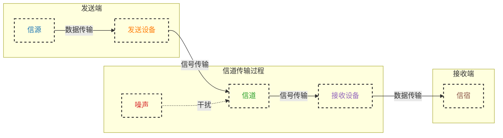

## 通信基础

### 数据、信号、码元

#### 数据 (Data)

- 数据是指各种形式的原始信息和事实，可以是文字、数字、图像、声音或视频等

##### 数据的传输方式 (本质在信道上传输的都是信号)

- 串行传输:1 比特 1 比特按照时间顺序传输
  - 速度慢，费用低，适合*远距离*

- 并行传输: 若干比特通过多条通信信道同时传输
  - 速度快，费用高，适合*近距离*，用于**计算机内部（距离短）数据传输**

> [! ] 近距离硬件实现简单，长距离并行传输会造成信号干扰

##### 数据的通信方式

> [!warning] 同步、异步传输是通信方式，不是传输方式

- **同步传输**：数据传输由时钟信号控制，以一个数据区块为单位进行传输
 
  - 特点
    - 适合高速、大量数据传输
    - 需要时钟信号同步
    - 传送数据时需先发送一个或多个同步字符，然后发送整批数据
  - 类型
    - **外同步**：在收发双方之间增加一条时钟信号线
    - **内同步**：发送端将时钟信号编码到发送数据中一起发送（例如曼彻斯特编码）

- **异步传输**：数据传输不依赖时钟信号，通过起始位和停止位标识数据的开始和结束
 
  - 特点
    - 适合低速、间断数据传输
    - 传送数据时每个字符加一个起始位和一个停止位
    - 发送方可以在任何时刻发送比特组，接收方在不固定的时间间隔接收
  - 类型
    - 字节之间异步：字节之间的时间间隔不固定
    - 字节内同步：字节内的每个比特仍然同步，即各比特的持续时间相同

#### 信号 (Signal)

- 信号是数据在传输介质中传递时的物理表示形式
  - **模拟信号** (Analog Signal):
    - 连续变化的信号
    - 常用于传输声音、光等连续信息
  - **数字信号** (Digital Signal)
    - 离散的信号，由一系列的 0 和 1 组成
    - 常用于计算机和数字通信系统
  - **基带信号** (Baseband Signal):
    - 未经过调制的原始信号，其频率范围从零到最高频率成分，包含完整的原始信息
  - **宽带信号** (Broadband Signal):
    - 通过调制将基带信号搬移到较高频率范围内的信号
    - 通常用于长距离传输或需要同时传输多种信号的场合

- 信号是数据传输的载体，通过物理介质 (如电缆、光纤、无线电波) 在发送端和接收端之间传播
- 在传输过程中，信号会受到衰减、干扰和噪声的影响，需要经过处理以恢复原始数据

#### 码元 (Symbol)

- 定义：码元是信号的基本单位，表示在特定时间间隔内传输的离散信息单元
- 比特表示：一个码元可以表示一个或多个比特
- 传输速率：码元是信号传输的最小单位，传输速率可以通过 *每秒传输的码元数量（波特率）* 来表示
- 物理表示：码元可以有不同的物理表示形式，如电压、电流、光信号的不同状态

> 数据是消息的载体，信号是数据在传输介质中的物理表示，码元是信号的基本单位

### 信源、信道、信宿

#### 信源 (Source)

- 信源是指生成和发送信息的**源头**

#### 信道 (Channel)

- 信道是信息从信源传输到信宿的**传输介质或路径**
  - 信道≠电路，信道应被视为一条线路的逻辑部件,表示**向某个方向**传送信息的介质
  - 因此一条通信线路往往包含一条发送信道和一条接收信道

- 信道的质量和特性直接影响信息传输的速度、可靠性和质量
- 分类:
  - 传输信号形式: 传送模拟信号的模拟信道和传送数字信号的数字信道
    - 基带传输: 基带信号将数字信号 1 和 0 **直接**用两种不同的电压表示，然后送到数字信道上传输
      - 通常要对数字信号进行编码
      - 适于近距离、小距离
    - 宽带传输: 将基带信号调制后形成频分复用模拟信号，然后送到模拟信道上传输
      - 对数字信号进行调制、解调
      - 适用于远距离、大范围
  - 传输介质: 无线信道和有线信道
- 极限容量: 信道的最高码元传输速率或信道的极限信息传输速率

#### 信宿 (Destination)

- 信宿是指接收和处理信息的设备或实体。(终点)

#### 通信系统模型

#### 🌟🌟通信方式

| 通信类型  | 描述                                                         | 所需信道数 |
| ----- | ---------------------------------------------------------- | ----- |
| 单向通信  | 只有一个方向的通信而没有反方向的交互（广播）                                     | 1     |
| 半双工通信 | 通信双方都可以发送或接收消息 不需要独立的接收端和发送端 任何一方都不能同时发生和接收消息（对讲机） | 2     |
| 全双工通信 | 通信双方都可以同时发送或接收消息 **需要两条信道**【独立的接收端和发送端】（打电话）           | 2     |

### 码元、速率、波特、带宽 #🌟🌟🌟

#### 码元

- 一个码元对应一种信号波形/信号变换 (用一个固定时长)，对应一位 k 进制数字，对应一个信号
- *码元的宽度*：码元的持续时间，即信号的持续时间
- *k 进制码元*：一个码元对应 k 种不同的信号状态，即每个码元可以表示 k 种不同的离散电平

#### 速率 (Data Rate)

##### 码元传输速率 (波特率)

- 定义：单位时间内数字通信系统所传输的码元个数，也可以称为脉冲个数或信号变化的次数
- 波特率与码元的具体内容无关，只与码元的传输频率有关
- 单位：波特 (Baud)
- 公式：码元传输速率 = 码元数 / 时间
- 示例：如果每秒传输 1000 个码元，那么码元传输速率就是 1000 Baud

##### 信息传输速率 (比特率)

- 定义：单位时间内数字通信系统传输的二进制码元个数
- 单位：比特每秒 (bps)
- 公式：信息传输速率 = 比特数 / 时间
- 关系公式：信息传输速率 = 波特率 × log₂ N，其中 N 是码元的进制数
  - 例如，在二进制系统中 (N = 2)，1 码元 = 1 比特，因此比特率 = 波特率
  - 在四进制系统中 (N = 4)，1 码元 = 2 比特，因此比特率 = 波特率 × 2
- 示例：如果波特率为 1000 Baud，且每个码元携带 2 比特信息，则信息传输速率为 2000 bps

> [!note] 如果一个码元携带 $n$ 比特的信息量，则 $M$ 波特率（码元传输速率）对应的信息传输速率为 $M \times n$ bps（比特每> 秒）
> 单位理解：信息传输速率的单位是 bit/s（比特每秒），可以通过以下方式理解：

- 波特率（码元传输速率）表示每秒传输的码元数量，即 $\frac{\text{码元数}}{\text{时间}}$
- 每个码元携带 $n$ 比特的信息量，即 $\frac{\text{比特数}}{\text{码元数}}$
因此，信息传输速率等于波特率乘以每个码元携带的比特数，即：

$$\text{信息传输速率} = \text{波特率} \times \text{每个码元携带的比特数}$$

$$\text{bit/s} = \left(\frac{\text{码元数}}{\text{时间}}\right) \times \left(\frac{\text{比特数}}{\text{码元数}}\right) = \frac{\text{比特数}}{\text{时间}} = \text{波特率} \times \text{每码元的比特数} = M \times n$$

#### 带宽 (Bandwidth)

- 定义：带宽是信道能够传输的频率范围
- 在模拟通信中以赫兹 (Hz) 为单位
  - 模拟通信中，带宽是频率范围的宽度
    - 例如，一个信道的频率范围是 20 MHz 到 30 MHz，则带宽为 10 MHz
    - 即 **带宽 = 最大频率 - 最小频率**
- 在数字通信中，带宽也指信道每秒能够传输的最大比特数，以比特每秒 (bps) 为单位
  - 数字通信中，带宽和数据速率之间的关系可以通过香农定理等公式表示
- 在通信中，带宽用于表示单位时间内从网络中的某一点到另一点所能通过的 " 最高数据率 "
- 单位：比特每秒 (bps)
- 公式：带宽 = 数据量 / 时间
- 示例：如果一个网络连接的带宽是 100 Mbps (百万比特每秒)，表示该连接每秒可以传输 100 百万比特的数据

### 信号失真的因素

### 奈奎斯特定理与香农定理 #🌟🌟🌟

#### 奈奎斯特定理 (Nyquist Theorem)

- **奈氏准则**: 在 *理想低通 (没有噪声、带宽有限)* 信道中，为了避免码间串扰，**极限码元传输速率为 2W 波特**，其中 W 是信道的频率带宽 (单位为 Hz)
  - **码间串扰**: 前一个码元 (符号) 的信号干扰到后一个码元 (符号)，导致接收端无法准确解码，在高速传输或长距离传输中尤为明显
  - **公式**: 理想低通信道下的极限数据传输速率为 $2W\ log_2V\ (bps)$
    - W: 信道的带宽 (单位 Hz)
    - V: 每个码元的离散电平数目，即每个码元可以表示的不同状态数
- **结论**:
  - 在任何信道中，码元传输速率有上限
    - 传输速率超过上限会出现严重码间串扰，使得接收端不可能完全正确识别码元

      $$码元传输速率 \leq 2W\ log_2V\ (bps)$$

    - 理想**低通**信道下的 **最高码元传输速率** = 2 W Baud = 2 W 波特 = 2 W (码元/s)
    - 理想**带通**信道下的 **最高码元传输速率** = W Baud = W 波特 = W (码元/s)
  - 信道的频带越宽，越可以用更高的速率有效传输码元 (W 越大，极限数据传输速率越大)
  - **奈氏准则未限制每个码元的离散电平数目 V，但香农定理的存在侧面说明 V 有限。**

#### 香农定理 (Shannon Theorem)

- **定理**: 对于一个带宽为 W(单位 Hz) 的信道，在*高斯噪声干扰下*，信道容量 C(即信道的最大数据传输速率) 由以下公式给出:
  - **公式**:$C = W log_2(1+ \frac{S}{N})\ (bps)$
    - C: 信道容量，即信道的最大数据传输速率，单位为比特每秒 (bps)
    - W: 信道的带宽，单位为赫兹 (Hz)
    - S: 信号功率，单位为瓦特 (W)
    - N: 噪声功率，单位为瓦特 (W)
    - *S/R: 信噪比 (SNR)，即信号功率与噪声功率的比值。没有单位*

- **信噪比转换**:
  - 信噪比有两种写法，一种没有单位，直接用于香农定理计算
  - 另一种有单位 dB 时，需要用公式转换

   $$\text{信噪比(dB)} = 10\ log_{10}(S/N)$$

   $$S/N = 10^{\frac{\text{信噪比}}{10}}$$

   $$C = W\ log_2(1+ \frac{S}{N}) = W\ log_2(1+ 10^{\frac{\text{信噪比}}{10}})$$

- **结论**:
  - 信道的带宽或信道中的信噪比越大，信息的极限传输速率越高。(W 或 S/N 越大，C 越大)
  - 对一定的传输带宽和一定的信噪比，信息传输速率的上限是确定的
  - 只要信息传输速率低于信道的极限传输速率，就能找到某种方法实现无差错的传输
  - 香农定理得出的是极限信息传输速率，实际信道能达到的速率低于极限

#### 小结

- **区分传输速率和传播速率**
  - **传输速率** 也称为数据速率或比特率，指的是单位时间内通过 **通信信道传输** 的数据量，通常以比特每秒 (bps, bits per second) 为单位
  - **传播速率** 指的是信号 **在传输介质**(如电缆、光纤或无线电波) 中的传播速度。它是指电磁波或光波在介质中传播的物理速度，通常以米每秒 (m/s) 为单位

- 奈奎斯特定理找 V，香农定理找 S/N，一般题目只会出现其中一个
- 如果题目中两个定理的条件都存在，两个定理结果的最小值作为信道极限数据传输速率

### 编码与调制

- **编码**: 将数据转换为数字信号, `数据->数字信号`
- **调制**: 将数据转换为模拟信号, `数据->模拟信号`

#### 数字数据*编码*为数字信号

##### 不归零 (NRZ) 编码 【存在同步问题】

- 高电平表示 1、低电平表示 0 (或相反)
- 简单易实现，但长时间的连续 0 或连续 1 可能导致 **时钟漂移** 问题
- **需要双方都有时钟线。**

##### 归零 (RZ) 编码 【自同步，编码效率低】

- *每个位周期（比特周期）内都会归零*
- *（起始电平）高电平表示 1，低电平表示 0 (或相反)*
  - $位周期 = 比特周期 = \frac{1}{码元}$
- 提供 **时钟同步**，但编码效率较 NRZ 编码低;
- 归零编码相当于将时钟信号用 " 归零 " 方式编码在了数据之内，这称为 " **自同步** " 信号
- **缺点**：大部分的数据带宽都用来传输 " 归零 " 而浪费掉了

##### 反向非归零 (NRZI) 编码

- 电平跳变表示 0、电平保持不变表示
- 如果编码涉及前一位周期的电平，第一个二进制数据是 1
- 既能 **传输时钟信号**，又能尽量不损失系统带宽。如 **USB2.0**

##### 曼彻斯特编码 【自同步，10 Mbps 传统以太网】

> [! ] **标准以太网使用曼彻斯特编码**

- 在每个*位周期的中间发生信号电压的变化*，表示二进制位 0 和 1
- 位周期的中间信号向下跳变表示 1、向上跳变表示 0 (或相反)
- 码元中间时刻的跳变既表示时钟同步，又表示数据内容。
- 优点: 提供 时钟同步和频率内容
- 缺点: 需要 **双倍的频带宽度**，因为每个位周期内有两次信号跳变

##### 差分曼彻斯特编码

- 每个码元的中间都会发生电平跳变，但*仅表示时钟信号不表示数据*
- 码元中间时刻的跳变仅表示时钟同步
- 数据的表示在于每个码元*开始处*是否有电平跳变:
  - 无跳变表示 1，有跳变表示 0
- **更强的抗干扰能力**，被广泛用于 **宽带高速网（局域网）** 中
  - 在传输入大量连续 1 或连续 0 的情况下：差分曼彻斯特编码信号比曼彻斯特编码信号的变化少
  - 在噪声干扰环境下：检测有无跳变比检测跳变方向更不容易出错
  - 在传输介质接线错误导致高低电平翻转的情况下：差分曼彻斯特编码仍然有效

##### 电平跳变小结

- **归零编码**：在每个码元结束时电平归零，可能在码元内发生跳变。有助于同步
- **不归零编码**：在一个码元的持续期间内，电平保持不变。由于电平不变，双方难以保持同步
- **反向非归零编码**：与非归零编码相反，电平在码元间不变，但用于表示数据

- **曼彻斯特编码与差分曼彻斯特编码**

  - **特点**：在每个码元内部，电平都会发生至少一次跳变，这种跳变有助于接收方保持同步
  - **曼彻斯特编码**：码元内前低后高表示 1，前高后低表示 0（也可以相反）
  - **差分曼彻斯特编码**：码元内电平的改变表示 1，电平保持不变表示 0。这种方式更多地用于时钟同步，而不直接表示数据

##### 真题

#### 数字数据*调制*为模拟信号

> [! ] 调制速率 = 码元速率或波特率

##### 调幅 (AM) 或幅移键控 (ASK)

- 通过改变载波信号的幅度来表示数字数据
  - 0 用低幅度或零幅度表示
  - 1 用高幅度表示
- *优点*：实现简单，对带宽的需求较低，
- *缺点*：对噪声和干扰敏感，容易受到衰减影响
- *应用*: 低速率的无线通信和简单的调制系统

##### 调频 (FM) 或频移键控 (FSK)

- 通过改变载波信号的频率来表示数字数据
- *优点*：抗噪声性能好，易于实现解调，比 ASK 更可靠，
- *缺点*：频带利用效率不高
- *应用*: 调制解调器、无线电传输等

##### 调相 (PM) 或相移键控 (PSK)

- 通过改变载波信号的相位来表示数字数据。分为绝对调相和相对调相
- *优点*：对噪声和干扰的抗性较强，相对频带利用效率较高，
- *缺点*：实现复杂度较高
- *应用*: 卫星通信、无线 LAN 等

##### 🌟正交幅度调制 (QAM)

- 通过同时改变载波信号的幅度和相位来表示数字数据，不同的幅度和相位组合表示不同的二进制数

- 频带利用效率高，能够在有限带宽内传输更多数据，但对噪声和干扰较敏感，要求信噪比高
- 应用: 数字电视、有线电视调制解调器、高速数据传输

> [! ] 设波特率为 B，采用 m 个相位，每个相位有 n 种振幅，则该 QAM 的数据传输速率 R 为:
>
> $$R = B \cdot \log_2(m \cdot n)(单位 bps)$$

#### 模拟数据*编码*为数字信号

- 主要包括三个步骤:**采样、量化、编码**
- 常用于对音频信号进行编码的 **PCM 编码**

- **采样**
  - 将连续时间的模拟信号转换为离散时间的信号，即在时间上以一定的间隔对模拟信号进行取样
- **量化**
  - 将采样得到的离散样本值转换为有限的离散数值 (即将连续的幅度值离散化)
- **编码**
  - 将量化后的离散数值转换为二进制代码，以便在数字系统中进行存储或传输

- **奈奎斯特定理 (采样定理)**
  - 为了不丢失任何信息地重建带限信号，采样频率必须至少是信号最高频率分量的两倍
  - 即，如果信号的最高频率为 $f_{max}$，则采样频率 $f_s$ 必须满足:

   $$f_s(采样频率) \geq 2 \times f_{max}(信号最高频率)$$

  - 确定了将连续时间信号 (模拟信号) 转换为离散时间信号 (数字信号) 所需的最低采样率

#### 模拟数据*调制*为模拟信号

- 为了实现传输的有效性，可能需要较高的频率
- 这种调制方式还可使用**频分复用** (FDM) 技术，充分利用带宽资源
- 电话机和本地局交换机采用模拟信号传输模拟数据的编码方式

### 电路交换、报文交换与分组交换 #🌟🌟🌟

#### 数据交换方式

  > [! ] " 交换 " 从广义上讲是指在通信网络中，根据通信需求，动态地分配通信资源，使通信双方能够在通信过程中占用通信资源，而不会造成资源的浪费。交换技术是指在通信网络中实现交换功能的技术

#### 电路交换 (Circuit Switching)

- n 部电话需要 $C_n^2$ 条线路
- 电话机的数量多到一定程度需要使用交换机

- 电路交换是一种在通信双方之间建立专用通信路径的交换方式
- 在通信会话期间，该路径独占使用，直到会话结束
- 电路交换有以下三个步骤:

  - **建立连接**: 通信开始前，先建立一条从发送方到接收方的专用*物理路径*
  - **传输数据**: 连接建立后，数据以稳定的速率传输，不受其他通信的影响
  - **释放连接**: 通信结束后，释放专用路径，使其可用于其他通信

##### 电路交换的应用

传统电话网络、专线通信

#### 报文交换 (Message Switching)

- 报文交换是一种将整个报文作为一个独立单位进行传输的交换方式
- 每个报文包含完整的目标地址信息，在各节点存储转发
  - 报文的长短不限且可变
  - **存储转发**: 报文在每个节点存储，然后转发到下一个节点，直至到达目的地

##### 应用

适用于较少时延要求的数据传输，如早期电报系统和现代的电子邮件系统。

#### 分组交换 (Packet Switching)

- 分组交换在报文交换的基础上，限制了每次传送的数据块大小的上限，把大数据块划分为小数据块，加上控制信息，构成分组 (Packet)
- 网络节点接收分组时，暂时保存并排队等待传输，然后根据控制信息选择下一个节点，反复直到目的地

- **分类**:
  - 面向连接的虚电路方式
  - 无连接的数据报方式
    - 两种服务方式都由网络层提供

##### 分组交换的应用

适合突发性数据通信和多样化传输，如于互联网、局域网和广域网。

#### 时延计算问题

##### 报文交换时延

报文交换是将整个报文作为一个完整的实体进行传输，只有当整个报文传输完毕后，下一跳才能继续转发。

- **传输时延（Transmission Delay）**: 主机或路由器将数据推送到链路上所需的时间。
  - 公式：

  $$
  T_{\text{transmission}} = \frac{L}{R} = \frac{\text{报文长度} \ (比特)}{\text{链路传输速率} \ (bps)}
  $$

- **传播时延（Propagation Delay）**: 信号在传输介质中传播所需的时间。传播时延与数据大小无关，仅取决于信号在介质中的传播速度和链路长度。
  - 公式：

  $$
  T_{\text{propagation}} = \frac{d}{v} = \frac{\text{链路长度} \ (米)}{\text{信号传播速度} \ (米/秒)}
  $$

- **总时延（Total Delay）**: 报文的总传输时延包括传输时延和传播时延。
  - 公式：

  $$
  T_{\text{total}} = T_{\text{transmission}} + T_{\text{propagation}} = \frac{L}{R} + \frac{d}{v} = + \frac{\text{报文长度} \ (比特)}{\text{链路传输速率} \ (bps)} +  \frac{\text{链路长度} \ (米)}{\text{信号传播速度} \ (米/秒)}
  $$

##### 分组交换时延

分组交换是将报文分割成较小的分组，每个分组独立传输，可以逐跳转发，从而减少时延。主要的时延包括以下几种：

- **处理时延（Processing Delay）**: 每个路由器或交换机处理分组（如查找路由表、封装/解封装数据包）所需的时间。

- **排队时延（Queuing Delay）**: 分组在路由器队列中等待转发的时间，受网络负载影响较大。

- **传输时延（Transmission Delay）**: 分组在链路上推送所需的时间，与分组长度和链路传输速率相关。
  - 公式：

  $$
  T_{\text{transmission}} = \frac{L_p}{R} = \frac{\text{分组长度} \ (比特)}{\text{链路传输速率} \ (bps)}
  $$

- **传播时延（Propagation Delay）**: 信号在链路上传播的时间，与链路长度和传播速度相关。
  - 公式：

  $$
  T_{\text{propagation}} = \frac{d}{v} = \frac{\text{链路长度} \ (米)}{\text{信号传播速度} \ (米/秒)}
  $$

- **分组交换总时延**: 分组交换的总时延为处理、排队、传输和传播时延的总和，另外还需要考虑分组的逐跳转发特性。
  - 公式：

  $$
  T_{\text{total}} = N \cdot (T_{\text{processing}} + T_{\text{queuing}}) + (N + H - 1) \cdot \frac{L_p}{R} + H \cdot \frac{d}{v}
  $$

  其中：
  - $N$ 为分组数。
  - $H$ 为跳数（路由器数量 + 1）。
  - $L_p$ 为每个分组的长度。
  - $R$ 为链路传输速率。
  - $d$ 为链路长度。
  - $v$ 为信号传播速度。

#### 小结

| **特点**       | **电路交换**                        | **报文交换**            | **分组交换**                    |
| ------------ | ------------------------------- | ------------------- | --------------------------- |
| **线路连接**     | 独占固定线路，传输前建立连接                  | 动态分配线路，无需建立连接       | 无需建立连接                      |
| **线路/信道利用率** | 占用整条线路，即使没有数据传输，也不允许其他用户使用，利用率低 | 一个报文某一时刻占用一段线路，利用率高 | 同属一个报文的多个分组可以同时分布于多段线路，利用率高 |
| **转发单元**     | -                               | 报文                  | 分组                          |
| **通信机制**     | 建立连接→传输数据→释放连接                  | 报文存储转发              | 报文分割→分组存储转发→分组重组            |
| **连续性**      | 连续有序                            | -                   | 分组未必按序到达                    |
| **错误处理**     | 无                               | 发生错误时重传整个报文         | 发生错误时重传单个分组                 |
| **传输时延**     | 电路交换<报文交换<分组交换                  | <                   | <                           |
| **错误率**      | 低                               | 高                   | 按报文交换低                      |
| **无效传输率**    | 低                               | 高                   | 低                           |
| **多目的站点通信**  | 很难实现                            | 容易实现                | 容易实现                        |

### 🌟数据报与虚电路

#### 数据报

- **端系统**: 拆分报文并加上控制信息后发送到网络上
- **中间结点**: 选择合适的路由转发

> 主机 A 发送分组到主机 B 的过程

1. 主机 A 发送分组

   - 主机 A 生成分组 P1 和 P2
   - 主机 A 将分组 P1 和 P2 逐个发送到直接相连的交换结点 A

2. 交换结点 A 处理分组

   - 交换结点 A 收到分组 P1 和 P2，并将它们缓存
   - 交换结点 A 查找其转发表，决定如何转发这些分组
     - P1 被选择转发到交换结点 C
     - P2 被选择转发到交换结点 D

   - 交换结点 A 将分组 P1 发送到交换结点 C
   - 交换结点 C 收到分组 P1，并发送 ACK 确认到交换结点 A
   - 以此
3. 主机 B 接收分组

   - 主机 B 收到交换结点 B 转发的分组 P1 和 P2
   - 主机 B 发送 ACK 确认给交换结点 B，确认分组已成功接收

> 总结

分组 P1 和 P2 从主机 A 经过不同的路径到达主机 B。具体路径如下：

- 分组 P1 路径：`A -> C -> E -> B`
- 分组 P2 路径：`A -> D -> G -> B`

每个交换结点在转发分组后，会向前一结点发送 ACK 确认，确保分组在网络中顺利传递
最终，主机 B 收到所有分组并发送 ACK 确认，完成数据传输过程

> **特点**:

- **无连接传输**：无需预先建立连接，每个数据报独立传输
- **乱序、丢失和重复数据报**：高层协议负责错误检测和纠正，如 TCP 协议
- **每个数据报独立传输**：包含完整的源地址和目标地址，可以通过不同路径到达目的地
- **适用于突发性通信**：适合快速传输小数据量，
- **不适用于长报文或会话式通信**：传输时延不确定，不适合实时通信
- **灵活性**：适应动态网络状况，故障时数据报可通过其他路径传输
- **不同路径传输**：各数据报可能通过不同路径，需在接收方重新组装
- **负载均衡**：动态调整路径，均衡流量，减少过载风险

#### 虚电路

- 虚电路结合**数据报方式与电路交换方式**:
- 虚电路通信过程分为*虚电路建立、数据传输与虚电路释放*三个阶段
- **虚电路号**
  - 虚电路方式的分组首部控制信息还需要加上虚电路号
  - 端系统每次建立虚电路时，选择一个未用过的虚电路号分配给该虚电路，以区别于本系统中的其他虚电路
- **虚电路表**
  - 在虚电路网络中的每个结点上都维持一张虚电路表，表中的每项记录了一个打开的虚电路的信息
  - **虚电路表项包括**
    - 在接收链路
    - 发送链路上的虚电路号
    - 前一结点和下一结点的标识

##### 虚电路建立

在分组发送之前，通信双方需要建立一条**逻辑上**相连的虚电路，这意味着虚电路对应的物理路径是固定的

1. **虚电路建立**：
    - 主机 A 发送 " 呼叫请求 " 分组到结点 A
    - 结点 A 转发 " 呼叫请求 " 分组到结点 B，依此类推，直到主机 B
    - 主机 B 发送 " 呼叫应答 " 分组，依次返回给主机 A，完成虚电路建立

2. **数据传输**：
    - 分组 P1 和 P2 从主机 A 依次通过结点 A、B、C 等到达主机 B
    - 每个结点转发分组后，会发送 ACK 确认分组已成功传输

3. **虚电路释放**：
    - 主机 A 发送 " 释放请求 " 分组到主机 B
    - 主机 B 接收到 " 释放请求 " 分组后，发送 " 释放应答 " 分组
    - 断开连接，释放虚电路资源

- **特点**:

  - 时间开销: 建立和拆除虚电路需要时间，对短分组不利，但长时间数据交换效率高
  - **路由选择**: 在连接建立阶段确定传输路径
  - 可靠通信: 保证分组**正确、有序**到达，并进行流量控制
  - 故障影响: 结点或链路故障会破坏经过的虚电路
  - 首部内容: 分组首部包含虚电路标识符，不包含目的的地址，开销小于数据报方式
  - 适用场景: 适合需要稳定传输的持续数据流，如视频会议和语音通信

#### 总结 -- 数据报服务和虚电路服务的比较

|                | 数据报服务（邮政）                       | 虚电路服务（电话）                         |
| -------------- | ------------------------------- | --------------------------------- |
| 可靠性            | 不保证可靠通信  可靠性由用户主机来保证        | 可靠性由网络保证                          |
| 连接的建立          | 不需要建立网络层连接                      | 必须建立网络层连接 -- 虚电路 VC                 |
| 目的地址           | 每个分组都有完整的目的地址                   | 仅在建立连接阶段使用  之后每个分组使用长度较短的虚电路号 |
| 路由选择           | 每个分组独立地进行路由选择和转发                | 同一虚电路的分组按同一路由转发                   |
| 分组顺序           | 不保证分组的有序到达                      | 保证分组的有序到达                         |
| 对网络故障 的适应性 | 出故障的结点丢失分组  其他分组按需选择变化的路由   | 所有经过故障结点的虚电路均不能正常工作               |
| 差错处理和 流量控制 | 用户主机负责流量控制和差错处理  不保证数据报的可靠性 | 网络负责流量控制和差错处理 用户主机也可负责        |

> [! ] 上面所学的公式、编码与调制都是基于信道，而非传输媒体。

## 传输介质

- 传输介质，也称传输媒体，是数据传输系统中发送设备和接收设备之间的物理通路（第 0 层）

- 传输介质可以分为导向传输介质和非导向传输介质:
  - **导向传输介质**: 电磁波沿着固体媒介 (铜线或光纤) 传播
  - **非导向传输介质**: 空气、真空或海水等

> [! warning] 传输介质不是物理层的内容，可以看作是第 0 层，只是发送信号，不管信号代表什么

### 导向传播介质

#### 双绞线

- **结构**: 双绞线由两根采用一定规则并排绞合的、相互绝缘的铜导线组成
  - 绞合能*减少对相邻导线的电磁干扰*，同时抵御部分来自外界的电磁干扰

- **分类**:
  - **屏蔽双绞线 (STP)**: 在双绞线外加上一层用金属丝编织成的屏蔽层，能进一步提高抗电磁干扰能力
  - **非屏蔽双绞线 (UTP)**: 无屏蔽层的双绞线

- **应用**:
  - **100 BASE-T 以太网**、**局域网**和**传统电话网**中普遍使用，价格便宜
  - **带宽取决于铜线的粗细和传输的距离**
  - 适用于模拟和数字传输，通信距离一般为几千米到数十千米
  - **模拟**传输：用**放大器**放大衰减的信号
  - **数字**传输：用**中继器**将失真的信号整形

- **信号**: 传输电脉冲

#### 同轴电缆

- **结构**: 同轴电缆由内导体铜制芯线 (单股实心线或多股绞合线)、绝缘层、网状编织的外导体屏蔽层和绝缘保护套层构成

- **分类**:
  - **50Ω 同轴电缆**: 传送**基带**信号，又称基带同轴电缆，在**局域网**中应用广泛
  - **75Ω 同轴电缆**: 传送**宽带**信号，又称宽带同轴电缆，主要用于**有线电视系统**

- **抗干扰能力强**：同轴电缆采用屏蔽技术，能有效减少电磁干扰，因此抗干扰性能比双绞线更好。*但仍受噪声影响。*
- **数据传输速率**：同轴电缆适合传输**较高速率数据**，且比双绞线能够支持**更远**的传输距离
- **成本高**

- **信号**: 传输电脉冲

#### 光纤

> [! ] 既不受电磁影响又不受噪声影响

> 光纤不是中空的，里面是头发丝大小的玻璃丝

- **结构**:
  - 光纤是利用光导纤维传递光脉冲进行通信。有光脉冲表示 1，无光脉冲表示 0
  - 光纤系统带宽范围极大
  - 光纤主要由纤芯 (实心) 和包层构成，纤芯直径只有 8 至 100μm，光波通过纤芯传导
   
    - 由于 **纤芯的折射率 > 包层的折射率**
    - 当光线从高折射率的介质射向低折射率的介质时，其折射角将大于入射角
    - 因此，入射角大于某个临界角度，就会出现**全反射**
    - 这个过程不断重复，光也就沿着光纤传输下去
  - **多模光纤**: 纤芯直径 50μm、62.5μm
  - **单模光纤**: 纤芯直径 9μm
  - **包层直径**:125μm

- **工作波长**:
  - 0.85μm(衰减较大)
  - 1.30μm(衰减较小)
  - 1.55μm(衰减较小)

- **多模光纤**:
  - 利用光的**全反射**特性，可以将从不同角度入射的多条光线在一根光纤中传输，这种光纤称为多模光纤
  - 多模光纤的光源为发光二极管，接收可用光电二极管
  - 光脉冲在多模光纤中传输时会逐渐展宽，造成失真
  - 多模光纤只适合于**近距离**传输

- **单模光纤**:
  - 光纤的直径为一个光的波长时，可使光线一直向前传播，而不会产生多次反射，这样的光纤就是单模光纤
  - 单模光纤的纤芯很细，直径只有几微米，制造成本较高，**光源为定向性很好的半导体激光器**
  - 单模光纤的衰减较小，可传输数公里甚至数十千米而不必采用中继器，适合**远距离传输**

|  特性  |          多模光纤          |          单模光纤           |
| :--: | :--------------------: | :---------------------: |
| 纤芯直径 |   直径为 50μm 或 62.5μm    |        直径约为 9μm         |
|  光源  |         发光二极管          |         半导体激光器          |
| 传输方式 | 多条光线从不同角度入射 全反射传输  |   单条光线直向传播 无多次反射    |
| 传输距离 | 适合近距离传输 光脉冲容易展宽失真  |    适合远距离传输 衰减较小     |
| 制造成本 |          相对较低          |          相对较高           |
| 应用范围 | 较短距离通信 如局域网和短距离传感器 | 远距离通信 如长距离数据传输和远程通信 |

- **光纤优点**:
  - 通信容量非常大 (25000Hz~30000GHz 的带宽)
  - 传输损耗小，中继距离长，对远距离传输特别经济
  - 抗雷电和电磁干扰性能好，在有大电流脉冲干扰的环境下尤为重要
  - 无串音干扰，保密性好，也不易被窃听或截取数据
  - 体积小，重量轻，有利于现有电缆管道已拥塞的情况下使用

- **光纤缺点**:
  - 切割需要专用设备
  - 光电接口价格较贵

### 非导向传输介质

- 空气、真空、海水

##### **无线电波**

- 无线电波:
  - 具有**较强的穿透能力**，常用于**长距离**传输
  - 信号**向所有方向散播**，有效距离范围内的接收设备可与发射者通信
  - 应用于通信领域，如无线手机通信、无线局域网 (WLAN) 等

##### **微波、红外线和激光**

- 微波
  - 高频率、宽频段范围（载波频率 2~40GHz），通信信道容量大
  - 地面微波传播距离有限，需用中继站接力。卫星通信利用卫星中继转发微波信号，克服地面传播距离限制
  - 优点：通信容量大、距离远、覆盖广、广播通信和多址通信
  - 缺点：保密性差、端到端传播时延长

- 红外线和激光
  - 需要发送方和接收方之间存在一条视线通路，方向性强，沿直线传播，统称为视线介质
  - 红外通信和激光通信将信号转换为红外光信号和激光信号，直接在空间中传播

- 卫星通信
  - 利用卫星作为中继转发微波信号，克服地面微波通信距离限制
  - 优点: 通信容量大、距离远、覆盖广、广播通信和多址通信
  - 缺点: 保密性差、端到端传播时延长

## 🌟物理层接口的特性

物理层考虑的是如何在连接到各种计算机的传输媒体上传输数据比特流，而不指具体的传输媒体
物理层的主要任务：**确定与传输媒体的接口有关的一些特性**:

- **电气特性** *【数字】*: 传输二进制时 , 传输信号的电压范围 , 阻抗匹配 , 传输速率 , 距离限制

  - **电压范围示例:** 规定信号电平 +10V~+15V 表示二进制数据 0,信号电平 -10V~-15V 表示二进制数据 1
  - **电缆长度示例:** 路由器到主机间的电缆长度必须在 20 米以内
- **机械特性** *【物理特征】*: 指定义物理连接特性, 包括采用的规格, 接口形状 , 引线数目 , 排列情况 , 引脚数量

  - **引脚排列示例:** 水晶头的引脚排列情况,插座的间距规格等
- **功能特性** *【含义】*: 指明某条线上出现的某一电平的电压表示何种意义

  - **电平意义示例:** 描述当一个接口的引脚处于高电平的含义

  - **注意与电气特性区分:**

    - 电气特性是描述根据电压得到电平 *【数值】*
    - 功能特性是指电平的意义 *【含义】*
- **规程特性** *【顺序】*: 又称为 **过程特性** , 规定各个物理线路工作规程, 时序关系

常用的物理层接口标准有 EIARS-232-C、ADSL、SONET/SDH 等
