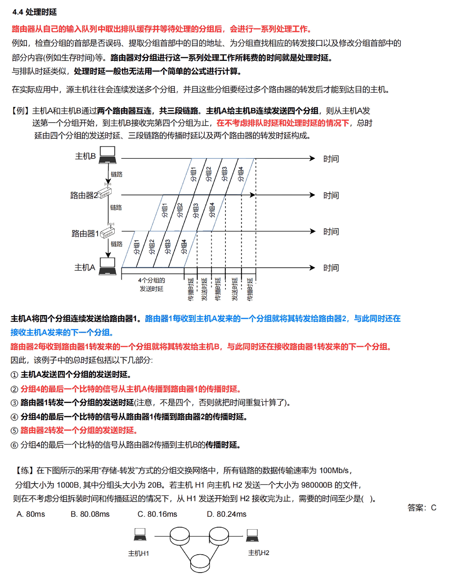

## 计算机网络的概念、组成与功能 (了解)

### 概念

- 计算机网络没有精确、统一的定义
- **计算机网络 = 节点 (计算机、集线器、交换机、路由器等)+ 链路，实现某一特定目的**
- 互连网 (**internet**) : 通用名词，网络通过路由器互联而成的覆盖范围更广的计算机网络，**任意通信协议**
- 因特网 (互联网，**Internet**) : 专有名词，当前全球最大的计算机网络，采用 **TCP/IP 协议簇** 作为通信规则

### 组成

#### 物理组成

从物理组成上看，计算机网络包括**硬件、软件、协议**三大部分

1. *硬件* ∶由主机、通信处理机（或称为前端处理器）、通信线路（包括有线线路和无线线路等）和交换设备（交换机等连接设备）组成
2. *软件*∶主要包括实现资源共享的软件和方便用户使用的各种工具软件（如 QQ）
3. *协议*∶就是一种规则，如汽车在道路上行驶必须遵循交通规则一样，数据在线路上传输也必须遵循一定的规则

#### 工作方式组成

从工作方式上看，计算机网络可分为**边缘部分**和**核心部分**，如图 1-1 所示

1. *边缘部分*∶由所有连接在互联网上，供用户直接使用的主机组成，用来进行通信和资源共享
2. *核心部分*∶由大量的网络和连接这些网络的路由器组成，它为边缘部分提供连通性和交换服务

#### 功能组成

从功能组成上看，计算机网络由通信子网和资源子网两部分构成

1. *通信子网*∶由各种传输介质、通信设备和相应的网络协议组成，为网络提供数据传输、交换和控制能力，实现联网计算机之间的数据通信

2. *资源子网*∶由主机、终端以及各种软件资源、信息资源组成，负责全网的数据处理业务，向网络用户提供各种网络资源与服务

> [! warning] 通信子网包括物理层、数据链路层和网络层，请读者务必记住!

### 功能

- **数据通信**: 实现联网计算机之间各种信息的传输，并将分散在不同地理位置的计算机联系起来，进行统一的调配、控制和管理。(最基本、最重要的功能)
- **资源共享**: 使多个用户和应用程序能够共享硬件资源 (如打印机、存储设备) 和软件资源 (如数据库、应用程序)
- 分布式处理: 允许多个计算机协同工作，共同完成一项任务或处理同一个应用程序，提高计算效率和处理能力
- 提高可靠性: 通过冗余和备份机制，提高系统的可靠性和容错能力，确保在部分设备或链接发生故障时，系统仍能正常运行。(各台计算机通过网络互为替代机)
- 负载均衡: 通过合理分配网络流量和计算任务，避免单个节点或链接过载，提高整体系统的性能

### 🌟 分类

#### 覆盖范围

- *广域网* (WAN，Wide Area Network)
  - 通常直径几十千米到几千千米
  - **交换技术**
  - 因特网核心部分

- *城域网* (MAN，Metropolitan Area Network)
  - 通常直径范围 5~50km
  - 采用多种技术，包括光纤以太网、SONET/SDH、ATM、MPLS 等

- *局域网* (LAN，Local Area Network)
  - 通常直径几十米到几千米
  - **广播技术、以太网**
    - 广播是一种通信方式，指在网络中一个节点向所有其他节点发送数据的方式
    - **以太网**(Ethernet) 是一种广泛应用于局域网 (LAN) 中的网络技术标准，由 IEEE 标准协会规范化为 IEEE 802.3 标准。在数据链路层详细介绍

- *个人区域网* (PAN，Personal Area Network)
  - 用于个人设备之间的连接，通常覆盖几米
  - 无线技术

#### 传输介质

- 有线网络: 使用物理介质 (如 **双绞线、同轴电缆、光纤电缆**) 进行数据传输
- 无线网络: 使用 **无线电波、微波、红外线** 等进行数据传输

#### 通信方式

- *广播式网络*: 发送的数据包会被传送到网络中的所有节点，每个节点根据数据包中的地址决定是否接收和处理该数据包 (如以太网)
  - 局域网（总线型）
- *点对点网络*: 数据在两个直接相连的节点之间传输。每条通信链路只连接两个节点，数据可以通过中间节点传递到目标节点
  - 使用**分组存储转发与路由选择机制**
  - 广域网

> [! ] TCP/IP 协议中使用广播的有 #考前摇一摇
>
> - 地址解析协议 ARP
> - 路由协议 RIP
> - 动态主机配置协议 DHCP

#### 使用者

- *公用网*（中国电信）: 电信公司出资建造的大型网络
- *专用网*（校园网）: 某部门为满足本单位需求建造的网络，不向本单位以外的人提供服务

#### 🌟拓扑结构

- 网中结点和通信线路之间的几何关系表示的网络结构，**主要指通信子网的拓扑结构**

- *总线型*: 所有节点共享一个通信介质
- *星型*: 所有节点通过一个中央节点 (如交换机或集线器) 连接
- n 个节点，(n-1) 条链路
- *环型*: 节点形成一个闭环，数据沿一个方向或两个方向传输
- *网状*: 每个节点与多个节点直接相连
- *树型*: 由多个星型网络通过总线连接而成

### **🌟🌟🌟 计算机网络主要性能指标**

#### 速率: 连接在计算机网络上的主机在数字信道上**传送比特的速率**

- 也称为**数据传输速率**、数据传输率、数据率或比特率
- 特点：实时
- 单位:bit/s(比特/秒, bps, b/s)
- 数据率较高时，会加上前缀，变为 kb/s、Mb/s、Gb/s、Tb/s 等表示

  - $1kb/s = 10^3 b/s$
  - $1Mb/s = 10^6 b/s$
  - $1Gb/s = 10^9 b/s$
  - $1Tb/s = 10^{12} b/s$
 

#### 带宽: 信号所包含的不同频率成分所占据的 **频率范围**，单位为赫兹 (Hz)

- 计算机网络中，带宽表示网络的通信线路传送数据的能力
- 即单位时间内从网络中的某一个点到另一个点所能通过的 "**最高数据率**"，单位为 b/s
- 理想、最高
  

#### 吞吐量: 在 **单位时间内** 通过 **某个网络 (信道/接口) 的数据量**，受网络带宽或网络额定速率的限制

- 特点：全局、总量

#### 时延: 数据 (一个报文或分组, 甚至比特) 从网络 (或链路) 的一端传送到另一端所需的时间

$$\text{总时延}=\text{发送时延}+\text{传播时延} + (\text{处理时延}+\text{排队时延})$$

##### 发送时延(**传输**时延): 从发送分组 (帧) 的第一个比特开始，到分组 (该帧) 的最后一个比特发送完毕需要的时间

- $\text{发送时延}=\frac{\text{分组长度(bit)}}{\text{发送速率bps}}$
- 数据帧长越长，发送时延越长，数据发送速率越大，发送时延越短

##### **传播**时延: 数据在物理介质上传输所花费的时间

- $\text{传播时延}=\frac{\text{信道长度(m)}}{\text{传播速率(m/s)}}$
- 影响因素: **❗️❗️❗️区分传送和传播**
    1. 与信号的**发送速率**无关，信号传送的距离越远，传播时延就越大
    2. 不同的物理介质 (如光纤、电缆) 有不同的**传播速度**

##### 处理时延: 路由器或交换机在处理数据包 (如检查包头、路由选择等) 所需的时间

- 检错、找出口

##### 排队时延: 分组在进入路由器后要先在输入队列中排队等待处理

- 等待输入、输出、链路可用

##### 时延带宽积: 表⽰在传输数据过程中，从源节点到 ⽬ 的节点的路径上，能够在传输介质中同时存在的数据量

- 表示容量（某段链路现在有多少比特）

- $\text{时延带宽积(bit)}=\text{传播时延(s)}\times \text{带宽(bit/s)} = \frac{\text{信道长度(m)}}{\text{传播速率(m/s)}} \times \text{带宽(bit/s)}$

#####  往返时延 (RTT):⼀个数据包从源节点发送到⽬的节点并返回源节点所需的总时间

- $\text{RTT}=\text{发送时延}+\text{目的节点处理时延}+\text{返回时延}$

- 信道利⽤率: 在⼀定时间内，网络信道被实际使⽤的时间与总时间 (不管有无时间通过) 的⽐率，反映了网络资源的使用效率
  - $\text{信道利⽤率}=(\frac{\text{信道被占用的时间}}{\text{总时间}})×100 \%$
- 网道利用率: 信道利用率加权平均值，考虑了整个网络中的多条信道和它们的利用情况

#### 丢包率: 在网络传输过程中丢失的数据包数量占总发送数据包数量的 ⽐ 率，是衡量网络可靠性的重要指标

- $\text{丢包率}=(\frac{\text{丢失的数据包数}}{\text{发送的数据包总数}})×100 \%$

## 计算机网络体系结构

> 计算机网络的体系结构是指计算机网络各层次及其协议和层间接口的集合

- **计算机网络各层次**：网络分层的基本概念，每一层负责不同的网络功能
- **各层次的协议**：每一层都有自己的协议，规定了该层的通信规则和数据格式
- **各层次的接口**：层与层之间的接口，定义了上层如何调用下层的服务

### 分层原则

1. **独立性**：每层实现相对独立的功能，降低整个系统的复杂度
2. **清晰的界面**：各层之间界面清晰，相互交流尽可能少，易于理解和实现
3. **技术独立**：各层功能的定义独立于具体的实现技术，允许采用最合适的技术实现
4. **层间独立**：保持下层对上层的独立性，上层单向使用下层提供的服务
5. **促进标准化**：分层结构应促进网络技术和协议的标准

### **🌟 实体、对等实体**

- **实体**：在计算机网络中，实体可以是任何能够发送或接收信息的硬件或软件进程。每一层的活动元素，即能够进行数据处理和通信的元素，被称为该层的实体
- **对等实体**：位于不同机器上但处于同一层的实体被称为对等实体。这些实体之间的通信遵循相同的协议规范，实现了层与层之间的交互。第 n 层的实体提供的服务被第 n+1 层的实体所使用，形成了网络协议栈的层次结构

### SDU、PCI 和 PDU

- 服务数据单元 (`SDU,Service Data Unit`): 包含需要传输的用户数据和服务请求的相关信息
- 协议控制信息 (`PCI，Protocol Control Information`): 每一层在封装数据时添加的控制信息，包括首部和可能的尾部
- 协议数据单元 (`PDU，Protocol Data Unit`): 每一层封装后的数据单元，也是对等层次之间传送的数据单位
- $PDU_n = SDU_n + PCI_n$

| 层级 | PDU |
| --- | --- |
| 物理层 | 比特 |
| 数据链路层 | 帧 |
| 网络层 | 分组 |
| 传输层 | 报文段 |

### 层次结构的含义

- **服务与提供**: 每一层的实体使用下一层的服务来实现自己的功能，并向上一层提供服务。这些服务是该层及其下层服务的总和

- **基础与用户服务**: 最底层是服务的基础，仅提供服务。最高层面向用户提供服务，而中间层既使用下层服务，也提供上层服务

- **接口与透明性**: 上一层只能通过层间接口使用下一层的服务，而不能调用其他层的服务；下一层所提供的服务的实现细节对上一层透明

- **对等通信**: 两台主机通信时，对等层在逻辑上有一条直接信道，表现为不经过下层就把信息传送到对方

### **🌟 计算机网络协议、接口、服务等概念**

#### 协议

- 网络协议是一组**规则**和标准，用于定义计算机在网络中如何进行通信，是实现接口和服务的基础

##### 三要素

- **语法**: 语法规定传输数据的 **格式**
  - 图示 IP 数据报的格式，每个格子称为字段或者域，语法定义了这些小格子的长度和顺序
 
- **语义**: 语义指数据的 **含义和解释**，包括各字段的功能、用途和意义，定义了通信各方应如何处理和响应接收到的数据
 

- **同步 (时序)**:**事件发生的顺序和时间关系**，包括消息发送和接收的时机、超时处理和同步机制等

- **协议是水平的**，是控制对等实体之间通信的规则

> [! ] 对于 TCP 协议
> 
>
> - **语法**：规定了 SYN、ACK 等消息的结构和数据包格式
> - **语义**：明确了 SYN 表示同步请求，ACK 表示确认等意义
> - **同步**：定义了消息的发送顺序和时间关系，确保连接按照正确的时序建立

#### 接口

接口定义了计算机网络中不同层次之间的交互方式
它是一个逻辑概念，用于实现网络各层之间的信息交换

- **逻辑接口**：接口不是物理的，而是逻辑上的概念，用于描述不同网络层次之间的交互协议和数据格式
- **信息交换的连接点**：接口作为同一节点内相邻两层间交换信息的连接点，规定了上层如何调用下层提供的服务
- **服务访问点（SAP）**：通过服务访问点，上层实体可以访问下层实体提供的服务

> [! ] SAP 是实现层间交互的逻辑端点
> 每个 SAP 都有一个唯一的标识符，用于区分不同的服务

#### 服务

- 服务是下层 (实体) 为紧邻的上层 (实体) 提供的 **功能调用**
- 基于协议和接口提供的功能或资源
- 只有被高一层实体 " 看得见 " 的功能称为服务

##### 服务原语 (OSI 参考模型中概念)

上层使用下层所提供的服务时与下层交换的一些命令

- **请求 (Request)**：由服务用户发往服务提供者，请求完成某项工作
- **指示 (Indication)**：由服务提供者发往服务用户，指示发生了某些事件
- **响应 (Response)**：由服务用户发往服务提供者，对前面的指示进行响应
- **确认 (Confirmation)**：由服务提供者发往服务用户，对前面的请求进行证实

> 服务是 **垂直** 的，是由下层通过层间接口向上层提供的

##### 服务分类

###### 面向连接服务

- **连接**: 两个通信实体为进行通信而建立的一种结合。（如握手，分配资源，为通信做好准备等）
- **通信过程**: 连接建立、数据传输、连接释放
- **例子**: TCP
- **适用范围**: 适合大的数据块传输，不适合小的零星报文
- **特点**: 保证数据报序
- **服务类型**:
  - 可靠的信息流: 传送页面
  - 可靠的字节流: 远程登录
  - 不可靠的连接: 数字化声音

###### 面向无连接服务

- **无连接服务**: 通信前不需要建立连接，不预留资源；不需要通信双方都是活跃的
- **特点**: 不可靠、可能重复、可能失序
- **例子**: IP 分组，数据包
- **适用范围**: 适合传送零星的数据
- **服务类型**:
  - 不可靠的数据报: 电子方式的函件
  - 有确认的数据报: 挂号信
  - 请求回答: 信息查询

###### 可靠服务与不可靠服务

- **可靠服务**: 网络具有纠错、检错、应答机制，确保数据包按序到达、不丢失、不重复，并且正确无误

- **不可靠服务**: 不提供数据传输的可靠性保障，数据包可能丢失、重复或乱序到达
  - 可靠性由应用或用户来保障

###### 有应答服务与无应答服务

- **有应答服务**: 发送方在发送数据后，接收方需对每个数据包进行确认应答，确保发送方知道数据包已成功接收
  - 应答由传输系统内部实现，不由用户实现

- **无应答服务**: 发送方在发送数据后，接收方不发送确认应答，发送方也不关心数据包是否成功接收

#### 小结

| 术语  | 描述                                                      |
| --- | ------------------------------------------------------- |
| 协议  | 规定了对等层次 (如两个网络层实体) 之间的 **通信规则** 确保数据在相同层次之间正确传输和处理。|
| 接口  | 连接了不同层次之间的交互点 通过接口上层可以调用下层提供的服务。|
| 服务  | 由协议具体实现，通过接口提供给上层使用。|

##### 协议与服务的区别与联系

1. **协议的实现保证了能够向上一层提供服务**：
    - 下面的协议对上面的服务用户是透明的
    - 在协议的控制下，两个对等实体间的通信使得本层能够向上一层提供服务
    - 要实现本层协议，还需要使用下面一层所提供的服务
    - 只要不改变提供给用户的服务，实体可以任意地改变它们的协议

2. **协议是 " 水平的 "**：
    - 协议是控制两个对等实体进行通信的规则
    - 协议的实现保证了能够向上一层提供服务，下面的协议对上面的服务用户是透明的

3. **服务是 " 垂直的 "**：
    - 服务是由下层通过层间接口向上层提供的
    - 上层使用所提供的服务必须与下层交换一些命令，这些命令在 OSI *中称为服务原语*

> [!warning] 并非在一个层内完成的全部功能都称为服务，只有那些能够被高一层实体看得见的功能才能称为服务

## 🌟🌟🌟ISO/OSI 参考模型和 TCP/IP 模型

### OSI 参考模型 (开放系统互连参考模型)

- 上三层（资源子网）：
  - 应用层
  - 表示层
  - 会话层
- 核心层：传输层
- 下三层（通信子网）：
  - 网络层
  - 数据链路层：网络由链路连接而成
  - 物理层：决定数据传输的硬件

##### 端到端通信 vs 点到点通信

> **传输层是端到端通信，数据链路层是点到点通信。**

- **点到点通信**是一种直接连接两个通信节点的方式，数据直接从一个节点传输到另一个节点，过程中不经过任何中间网络节点或设备的转发或处理
  - 一个 " 点 " 可以是一个硬件地址或 IP 地址
- **端到端通信**则指在不同主机上运行的两个进程之间的通信
  - 一个进程通过一个端口进行标识

##### 流量控制小结

| 层级    | 流量控制范围 | 控制手段                            |
| ----- | ------ | ------------------------------- |
| 数据链路层 | 相邻节点之间 | 使用帧间间隔、流量整形和窗口机制等技术             |
| 网络层   | 整个网络中  | 利用路由算法和拥塞控制技术                   |
| 传输层   | 端到端    | 通过拥塞控制协议如 TCP  的流量控制和拥塞避免机制 |

### TCP/IP 模型

### 两个模型的对比

#### 相似之处

- **分层的体系结构**: 都采用分层的体系结构
- **独立的协议栈**: 都基于独立的协议栈的概念
- **异构网络的互连**: 都可以解决异构网络的互连
- **面向服务的设计**: 都强调面向服务的设计原则，每一层通过明确的接口向上一层提供服务
- **模块化设计**: 都采用模块化设计，使得每一层的实现可以独立开发、测试和维护，便于系统的扩展和升级

#### 差别

- **结构层次不同**:

    

  - OSI 参考模型七层，自顶向下分别为应用层、表示层、会话层、传输层、网络层、数据链路层、物理层
  - TCP/IP 四层，自顶向下分别为应用层、传输层、网际层、网络接入层

- **发展历史不同**:
  - OSI 模型由国际标准化组织 (ISO) 于 20 世纪 80 年代指定的标准化模型
  - TCP/IP 模型基于实际使用的协议，发展自 ARPANET，广泛应用于互联网，是实际网络通信的标准

- **协议栈不同**:
  - OSI 模型是一个参考模型，定义了理论上的层次和功能，不绑定具体的协议
  - TCP/IP 模型是一个实用模型，定义了具体的协议 (如 IP、TCP、UDP 等)，直接用于网络通信

- **层间接口和服务**:
  - OSI 模型详细定义了层间接口和服务访问点 (SAP)，强调层次间的独立性和标准化
  - TCP/IP 模型更关注协议的实现和互操作性，层间接口和服务的定义较为灵活，实际实现中常常结合在一起

- **🌟 无连接与面向连接问题**:
  - 面向连接：分为三个阶段 -- 连接建立、数据传输、连接释放
  - 无连接: 直接进行数据传输

| 层级 | OSI 参考模型 | TCP/IP 模型 |
| --- | --- | --- |
| 网络层 | 无连接 + 面向连接 | 无连接的通信 |
| 传输层 | 面向连接 | 无连接 + 面向连接 |

#### OSI 参考模型、TCP/IP 模型以及 5 层协议体系结构模型的层次对应关系

